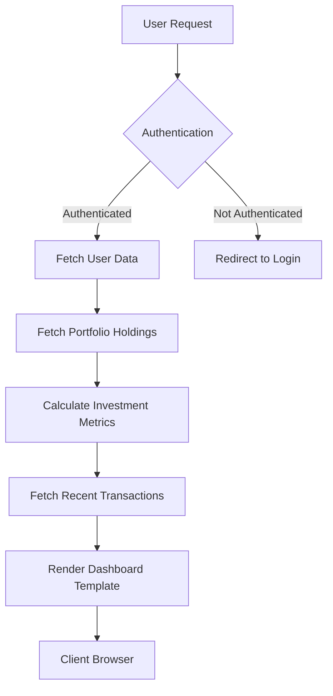

# API Endpoints Reference

<cite>
**Referenced Files in This Document**   
- [main.py](file://main.py)
- [test_web_routes.py](file://tests/test_web_routes.py)
- [templates/index.html](file://templates/index.html)
- [templates/dashboard.html](file://templates/dashboard.html)
- [templates/admin_dashboard.html](file://templates/admin_dashboard.html)
</cite>

## Table of Contents
1. [Introduction](#introduction)
2. [Authentication Endpoints](#authentication-endpoints)
3. [Prediction Endpoints](#prediction-endpoints)
4. [Portfolio Endpoints](#portfolio-endpoints)
5. [Admin Endpoints](#admin-endpoints)
6. [Error Response Format](#error-response-format)
7. [Security Considerations](#security-considerations)
8. [Client Implementation Guidelines](#client-implementation-guidelines)
9. [Integration with Frontend](#integration-with-frontend)
10. [Third-Party Integration Endpoints](#third-party-integration-endpoints)

## Introduction
The intelligent-stock-prediction application provides a comprehensive RESTful API for stock analysis, portfolio management, and prediction services. The API endpoints are implemented using Flask and follow a RESTful design pattern with form-based POST requests for data modification operations. The API is organized into functional categories including authentication, prediction, portfolio management, and administrative functions.

All endpoints require proper authentication except for the prediction endpoint, which is publicly accessible but requires a valid stock symbol. The API uses session-based authentication with CSRF protection for all POST requests. Response data is primarily delivered through template rendering rather than JSON, as the application is designed as a server-side rendered web application.

The API integrates machine learning models (LSTM, ARIMA, Linear Regression) for stock price prediction and combines these with sentiment analysis from financial news sources to provide comprehensive investment recommendations.

**Section sources**
- [main.py](file://main.py#L1-L980)
- [README.md](file://README.md#L1-L202)

## Authentication Endpoints

### POST /register
Registers a new user account in the system.

**URL**: `/register`  
**Method**: `POST`  
**Authentication Required**: No  
**CSRF Protected**: Yes  

**Request Parameters**:
- `email` (string, required): User's email address
- `username` (string, required): Desired username
- `password` (string, required): User password
- `confirm_password` (string, required): Password confirmation

**Response**:
- On success: Redirects to login page with success flash message
- On failure: Renders registration form with error flash messages for:
  - Missing required fields
  - Password mismatch
  - Email or username already registered

**Example Request**:
```bash
curl -X POST http://localhost:5000/register \
  -H "Content-Type: application/x-www-form-urlencoded" \
  -d "email=newuser@example.com&username=newuser&password=SecurePass123&confirm_password=SecurePass123"
```

**Test Case Reference**:
```python
def test_register_POST_valid(self, client, test_db):
    data = {
        'email': 'new@example.com',
        'username': 'newuser',
        'password': 'Pass123!',
        'confirm_password': 'Pass123!'
    }
    response = client.post('/register', data=data, follow_redirects=True)
    assert response.status_code == 200
```

### POST /login
Authenticates a user and creates a session.

**URL**: `/login`  
**Method**: `POST`  
**Authentication Required**: No  
**CSRF Protected**: Yes  

**Request Parameters**:
- `email` (string, required): Registered email address
- `password` (string, required): User password

**Response**:
- On success: Redirects to dashboard with authenticated session
- On failure: Renders login form with "Invalid credentials" flash message

**Example Request**:
```bash
curl -X POST http://localhost:5000/login \
  -H "Content-Type: application/x-www-form-urlencoded" \
  -d "email=user@example.com&password=SecurePass123"
```

**Test Case Reference**:
```python
def test_login_POST_valid(self, client, sample_user):
    data = {
        'email': sample_user.email,
        'password': 'TestPass123!'
    }
    response = client.post('/login', data=data, follow_redirects=True)
    assert response.status_code == 200
```

### GET /logout
Terminates the current user session.

**URL**: `/logout`  
**Method**: `GET`  
**Authentication Required**: Yes  
**CSRF Protected**: No  

**Response**:
- Clears session data and redirects to the home page

**Example Request**:
```bash
curl -X GET http://localhost:5000/logout
```

**Test Case Reference**:
```python
def test_logout(self, authenticated_client):
    response = authenticated_client.get('/logout', follow_redirects=True)
    assert response.status_code == 200
```

**Section sources**
- [main.py](file://main.py#L198-L248)
- [test_web_routes.py](file://tests/test_web_routes.py#L43-L79)
- [templates/register.html](file://templates/register.html)
- [templates/login.html](file://templates/login.html)

## Prediction Endpoints

### POST /predict
Generates stock price predictions using multiple machine learning models and sentiment analysis.

**URL**: `/predict`  
**Method**: `POST`  
**Authentication Required**: No  
**CSRF Protected**: No  

**Request Parameters**:
- `nm` (string, required): Stock symbol (ticker) to analyze

**Response**:
- On success: Renders results.html template with comprehensive prediction data
- On failure: Renders index.html with "Stock Symbol Not Found" error

**Response Schema** (passed to results.html template):
```json
{
  "quote": "string",
  "arima_pred": "number",
  "lstm_pred": "number",
  "lr_pred": "number",
  "open_s": "string",
  "close_s": "string",
  "high_s": "string",
  "low_s": "string",
  "vol": "string",
  "sentiment_list": "array",
  "sentiment_pol": "array",
  "idea": "string",
  "decision": "string",
  "forecast_set": "array",
  "error_lr": "number",
  "error_lstm": "number",
  "error_arima": "number",
  "arima_actual": "array",
  "arima_predicted": "array",
  "lstm_actual": "array",
  "lstm_predicted": "array",
  "lr_actual": "array",
  "lr_predicted": "array"
}
```

**Prediction Models**:
1. **ARIMA**: Statistical time series forecasting model
2. **LSTM**: Deep learning neural network for sequence prediction
3. **Linear Regression**: Baseline predictive model

**Sentiment Analysis**:
- Uses Finviz news scraping with FinVADER sentiment analysis
- Aggregates polarity scores from recent financial news articles
- Combines with price predictions to generate BUY/SELL recommendations

**Example Request**:
```bash
curl -X POST http://localhost:5000/predict \
  -H "Content-Type: application/x-www-form-urlencoded" \
  -d "nm=AAPL"
```

**Test Case Reference**:
```python
@patch('main.finviz_finvader_sentiment')
@patch('news_sentiment.retrieving_news_polarity')
def test_predict_route(self, mock_retrieving_news, mock_sentiment, client):
    mock_retrieving_news.return_value = []
    mock_sentiment.return_value = (0.5, ['News'], [0.5], 1, 0, 0)
    data = {'nm': 'AAPL'}
    response = client.post('/predict', data=data, follow_redirects=True)
    assert response.status_code in [200, 500, 400]
```

**Section sources**
- [main.py](file://main.py#L545-L959)
- [test_web_routes.py](file://tests/test_web_routes.py#L163-L183)
- [templates/index.html](file://templates/index.html#L468-L485)
- [templates/results.html](file://templates/results.html)

## Portfolio Endpoints

### POST /trade/buy
Executes a simulated stock purchase and updates the user's portfolio.

**URL**: `/trade/buy`  
**Method**: `POST`  
**Authentication Required**: Yes  
**CSRF Protected**: Yes  

**Request Parameters**:
- `symbol` (string, required): Stock symbol to purchase
- `quantity` (integer, required): Number of shares to buy

**Business Logic**:
1. Validates input parameters
2. Fetches current market price using yfinance
3. Calculates total cost including broker commission
4. Verifies sufficient wallet balance
5. Updates portfolio holdings (averaging cost basis for existing positions)
6. Creates transaction record with commission tracking

**Response**:
- On success: Redirects to dashboard with success flash message
- On failure: Redirects to dashboard with appropriate error flash message for:
  - Invalid quantity
  - Missing symbol
  - Insufficient funds
  - Unable to fetch price

**Example Request**:
```bash
curl -X POST http://localhost:5000/trade/buy \
  -H "Content-Type: application/x-www-form-urlencoded" \
  -d "symbol=AAPL&quantity=10"
```

**Test Case Reference**:
```python
def test_buy_route_POST(self, authenticated_client, mock_stock_price):
    data = {
        'symbol': 'AAPL',
        'quantity': '10'
    }
    response = authenticated_client.post('/trade/buy', data=data, follow_redirects=True)
    assert response.status_code == 200
```

### POST /trade/sell
Executes a simulated stock sale and updates the user's portfolio.

**URL**: `/trade/sell`  
**Method**: `POST`  
**Authentication Required**: Yes  
**CSRF Protected**: Yes  

**Request Parameters**:
- `symbol` (string, required): Stock symbol to sell
- `quantity` (integer, required): Number of shares to sell

**Business Logic**:
1. Validates input parameters
2. Checks that user owns sufficient shares
3. Fetches current market price using yfinance
4. Calculates proceeds after broker commission
5. Updates portfolio holdings (removes position if quantity reaches zero)
6. Creates transaction record with commission tracking

**Response**:
- On success: Redirects to dashboard with success flash message
- On failure: Redirects to dashboard with appropriate error flash message for:
  - Invalid quantity
  - Missing symbol
  - Insufficient shares
  - Unable to fetch price

**Example Request**:
```bash
curl -X POST http://localhost:5000/trade/sell \
  -H "Content-Type: application/x-www-form-urlencoded" \
  -d "symbol=AAPL&quantity=5"
```

**Test Case Reference**:
```python
def test_sell_route_POST(self, authenticated_client, sample_portfolio_item, mock_stock_price):
    data = {
        'symbol': sample_portfolio_item.company.symbol,
        'quantity': '5'
    }
    response = authenticated_client.post('/trade/sell', data=data, follow_redirects=True)
    assert response.status_code == 200
```

### POST /funds/topup
Adds funds to the user's simulated wallet balance.

**URL**: `/funds/topup`  
**Method**: `POST`  
**Authentication Required**: Yes  
**CSRF Protected**: Yes  

**Request Parameters**:
- `amount` (number, required): Amount to add to wallet

**Business Logic**:
1. Validates amount is positive
2. Adds specified amount to user's wallet_balance
3. Commits transaction to database

**Response**:
- On success: Redirects to dashboard with success flash message
- On failure: Redirects to dashboard with error flash message for invalid amount

**Example Request**:
```bash
curl -X POST http://localhost:5000/funds/topup \
  -H "Content-Type: application/x-www-form-urlencoded" \
  -d "amount=1000.00"
```

**Test Case Reference**:
```python
def test_topup_route(self, authenticated_client):
    data = {'amount': '1000.00'}
    response = authenticated_client.post('/funds/topup', data=data, follow_redirects=True)
    assert response.status_code == 200
```

### POST /dividends/record
Records a dividend payment for a stock holding and credits the user's wallet.

**URL**: `/dividends/record`  
**Method**: `POST`  
**Authentication Required**: Yes  
**CSRF Protected**: Yes  

**Request Parameters**:
- `symbol` (string, required): Stock symbol that paid dividend
- `amount_per_share` (number, required): Dividend amount per share

**Business Logic**:
1. Validates dividend amount is positive
2. Calculates total dividend based on share holdings
3. Credits total amount to user's wallet_balance
4. Creates Dividend record linked to portfolio item
5. Creates Transaction record with type 'DIVIDEND'

**Response**:
- On success: Redirects to dashboard with success flash message
- On failure: Redirects to dashboard with appropriate error flash message

**Example Request**:
```bash
curl -X POST http://localhost:5000/dividends/record \
  -H "Content-Type: application/x-www-form-urlencoded" \
  -d "symbol=AAPL&amount_per_share=0.25"
```

**Test Case Reference**:
```python
def test_dividend_route(self, authenticated_client, sample_portfolio_item):
    data = {
        'symbol': sample_portfolio_item.company.symbol,
        'amount_per_share': '0.25'
    }
    response = authenticated_client.post('/dividends/record', data=data, follow_redirects=True)
    assert response.status_code == 200
```

**Section sources**
- [main.py](file://main.py#L268-L434)
- [test_web_routes.py](file://tests/test_web_routes.py#L82-L124)
- [templates/dashboard.html](file://templates/dashboard.html#L105-L177)

## Admin Endpoints

### GET /admin
Displays the administrative dashboard with system statistics.

**URL**: `/admin`  
**Method**: `GET`  
**Authentication Required**: Yes  
**Role Required**: admin  
**CSRF Protected**: No  

**Response**:
- Renders admin_dashboard.html template with system statistics:
  - User counts (total, active)
  - Transaction statistics (count, volume, commission totals)
  - Broker and company management interfaces
  - Recent transaction logs
  - Trading activity charts

**Access Control**:
- Only accessible to users with role='admin'
- Regular users are redirected to login or receive 403 Forbidden

**Example Request**:
```bash
curl -X GET http://localhost:5000/admin
```

**Test Case Reference**:
```python
def test_admin_dashboard_loads_for_admin(self, admin_client):
    response = admin_client.get('/admin')
    assert response.status_code == 200
```

### POST /admin/brokers
Adds a new broker to the system with commission rate configuration.

**URL**: `/admin/brokers`  
**Method**: `POST`  
**Authentication Required**: Yes  
**Role Required**: admin  
**CSRF Protected**: Yes  

**Request Parameters**:
- `name` (string, required): Broker name
- `email` (string, optional): Broker contact email
- `commission_rate` (number, required): Commission rate as percentage

**Business Logic**:
1. Validates required fields
2. Ensures commission rate is non-negative
3. Creates new Broker record in database
4. Commits transaction

**Response**:
- On success: Redirects to admin dashboard with success flash message
- On failure: Redirects to admin dashboard with error flash message

**Example Request**:
```bash
curl -X POST http://localhost:5000/admin/brokers \
  -H "Content-Type: application/x-www-form-urlencoded" \
  -d "name=Test+Broker&email=test%40broker.com&commission_rate=0.50"
```

**Test Case Reference**:
```python
def test_add_broker_route(self, admin_client):
    data = {
        'name': 'Test Broker',
        'email': 'test@broker.com',
        'commission_rate': '0.50'
    }
    response = admin_client.post('/admin/brokers', data=data, follow_redirects=True)
    assert response.status_code == 200
```

### POST /admin/companies
Adds or updates a company record in the system.

**URL**: `/admin/companies`  
**Method**: `POST`  
**Authentication Required**: Yes  
**Role Required**: admin  
**CSRF Protected**: Yes  

**Request Parameters**:
- `symbol` (string, required): Company stock symbol
- `name` (string, optional): Company name
- `exchange` (string, optional): Stock exchange
- `sector` (string, optional): Industry sector
- `is_active` (boolean, optional): Active status

**Business Logic**:
1. Validates symbol is provided
2. Creates new Company record if symbol doesn't exist
3. Updates existing Company record if symbol exists
4. Commits transaction

**Response**:
- On success: Redirects to admin dashboard with success flash message
- On failure: Redirects to admin dashboard with error flash message

**Example Request**:
```bash
curl -X POST http://localhost:5000/admin/companies \
  -H "Content-Type: application/x-www-form-urlencoded" \
  -d "symbol=TEST&name=Test+Company&exchange=NASDAQ&sector=Technology&is_active=on"
```

**Test Case Reference**:
```python
def test_add_company_route(self, admin_client):
    data = {
        'symbol': 'TEST',
        'name': 'Test Company',
        'exchange': 'NASDAQ',
        'sector': 'Technology',
        'is_active': 'on'
    }
    response = admin_client.post('/admin/companies', data=data, follow_redirects=True)
    assert response.status_code == 200
```

**Section sources**
- [main.py](file://main.py#L436-L539)
- [test_web_routes.py](file://tests/test_web_routes.py#L127-L160)
- [templates/admin_dashboard.html](file://templates/admin_dashboard.html)

## Error Response Format
The application uses a consistent flash messaging system for error reporting rather than JSON error responses, as it is a server-side rendered application.

**Error Categories**:
- **Validation Errors**: Displayed as flash messages with 'danger' category
  - "All fields are required."
  - "Passwords do not match."
  - "Email or username already registered."
  - "Quantity must be an integer."
  - "Insufficient wallet balance including commission."

- **Authentication Errors**: Displayed as flash messages
  - "Invalid credentials."
  - "Stock Symbol (Ticker) Not Found. Please Enter a Valid Stock Symbol"

- **Success Messages**: Displayed as flash messages with 'success' category
  - "Registration successful. Please log in."
  - "Buy order executed in simulated portfolio."
  - "Wallet balance updated for simulation."

**HTTP Status Codes**:
- `200 OK`: Successful requests (with possible flash error messages)
- `302 Found`: Redirects (authentication, form submissions)
- `400 Bad Request`: CSRF token validation failures
- `403 Forbidden`: Access denied for non-admin users
- `405 Method Not Allowed`: GET requests to POST-only endpoints

**Section sources**
- [main.py](file://main.py#L208-L211)
- [main.py](file://main.py#L234-L235)
- [main.py](file://main.py#L278-L282)
- [main.py](file://main.py#L288-L289)

## Security Considerations

### Authentication and Session Management
The application implements several security measures for authentication:

**Session Security**:
- Uses Flask's secure session management
- Configures `SESSION_COOKIE_HTTPONLY` to prevent XSS access
- Sets `SESSION_COOKIE_SAMESITE=Lax` to mitigate CSRF attacks
- Clears session on logout

```python
app.config['SESSION_COOKIE_HTTPONLY'] = True
app.config['SESSION_COOKIE_SAMESITE'] = 'Lax'
```

**Password Security**:
- Passwords are hashed using Werkzeug's `generate_password_hash`
- Hashed passwords are stored in the database, never plaintext
- Uses secure hashing algorithms (bcrypt, scrypt, or PBKDF2)

```python
password_hash = generate_password_hash(password)
```

### CSRF Protection
The application implements CSRF protection for all state-changing operations:

**CSRF Token Generation**:
- Generates random CSRF tokens using `secrets.token_urlsafe(32)`
- Stores tokens in user session
- Renders tokens in all POST forms via Jinja2 template

```python
def generate_csrf_token():
    token = session.get('csrf_token')
    if not token:
        token = secrets.token_urlsafe(32)
        session['csrf_token'] = token
    return token
```

**CSRF Token Verification**:
- Validates CSRF token on all POST requests
- Aborts with 400 error if token is missing or invalid
- Uses `verify_csrf()` function called at the beginning of protected routes

```python
def verify_csrf():
    token = session.get('csrf_token')
    form_token = request.form.get('csrf_token')
    if not token or not form_token or token != form_token:
        abort(400)
```

### Input Validation
The application performs server-side validation for all user inputs:

**Authentication Inputs**:
- Email: Stripped, lowercased, and validated for presence
- Username: Stripped and validated for presence
- Password: Validated for presence and matching confirmation

**Trading Inputs**:
- Symbol: Stripped, uppercased, and validated for presence
- Quantity: Converted to integer with ValueError handling
- Amount: Converted to Decimal with exception handling

**Admin Inputs**:
- Commission rate: Converted to Decimal with negative value validation
- Company symbol: Stripped, uppercased, and validated

### Role-Based Access Control
The application implements role-based access control using a decorator pattern:

**login_required Decorator**:
- Checks for user_id in session
- Optionally enforces specific user role
- Redirects unauthenticated users to login
- Aborts with 403 for unauthorized role access

```python
def login_required(role=None):
    def decorator(f):
        @wraps(f)
        def wrapped(*args, **kwargs):
            user_id = session.get('user_id')
            user_role = session.get('user_role')
            if not user_id:
                return redirect(url_for('login'))
            if role and user_role != role:
                abort(403)
            return f(*args, **kwargs)
        return wrapped
    return decorator
```

**Section sources**
- [main.py](file://main.py#L121-L136)
- [main.py](file://main.py#L139-L151)
- [main.py](file://main.py#L30-L31)
- [main.py](file://main.py#L43-L47)

## Client Implementation Guidelines

### Using cURL
The API can be tested and automated using cURL commands. Due to the session-based authentication, multiple requests require cookie persistence.

**Complete Workflow Example**:
```bash
# Step 1: Get CSRF token from login page
curl -c cookies.txt http://localhost:5000/login > /dev/null

# Extract CSRF token (simplified - in practice use proper HTML parsing)
CSRF_TOKEN=$(curl -c cookies.txt -s http://localhost:5000/login | grep -o 'name="csrf_token" value="[a-zA-Z0-9-]*"' | cut -d'"' -f4)

# Step 2: Login with credentials and CSRF token
curl -b cookies.txt -c cookies.txt -X POST \
  -H "Content-Type: application/x-www-form-urlencoded" \
  -d "email=user@example.com&password=SecurePass123&csrf_token=$CSRF_TOKEN" \
  http://localhost:5000/login

# Step 3: Perform authenticated actions (e.g., buy stock)
curl -b cookies.txt -c cookies.txt -X POST \
  -H "Content-Type: application/x-www-form-urlencoded" \
  -d "symbol=AAPL&quantity=10&csrf_token=$CSRF_TOKEN" \
  http://localhost:5000/trade/buy
```

### Using Postman
For Postman, configure the following:

**Environment Variables**:
- `base_url`: http://localhost:5000
- `email`: user@example.com
- `password`: SecurePass123

**Pre-request Script** (for CSRF token):
```javascript
// This requires a separate request to get the CSRF token
// In practice, you might need to handle this manually or with a custom script
```

**Collection Structure**:
1. **Authentication**
   - GET /login (to retrieve CSRF token)
   - POST /login (with credentials and CSRF token)
2. **Portfolio Management**
   - POST /trade/buy
   - POST /trade/sell
   - POST /funds/topup
3. **Prediction**
   - POST /predict

**Headers**:
- Content-Type: application/x-www-form-urlencoded

### Debugging Tips
1. **CSRF Token Issues**: Ensure you're including a valid CSRF token in all POST requests. The token is stored in the session and rendered in forms.

2. **Authentication Problems**: Verify that the login request was successful and that cookies are being persisted across requests.

3. **Database State**: The application uses SQLite by default. Check the database state if operations don't appear to persist.

4. **Stock Data Availability**: The prediction endpoint relies on yfinance for current data. Ensure internet connectivity and that the stock symbol is valid.

5. **Session Expiry**: Sessions are cleared on server restart. You may need to re-authenticate after restarting the application.

**Section sources**
- [main.py](file://main.py#L121-L136)
- [main.py](file://main.py#L229-L230)
- [templates/dashboard.html](file://templates/dashboard.html#L106-L123)

## Integration with Frontend

### Template Integration
The API endpoints are tightly integrated with Jinja2 templates that render the server-side generated responses.

**Base Template Structure**:
- CSRF token injected globally via `app.jinja_env.globals`
- Flash messages displayed in a consistent location
- Navigation based on authentication state

```python
app.jinja_env.globals['csrf_token'] = generate_csrf_token
```

**Form Integration**:
All forms include the CSRF token as a hidden field:

```html
<form method="POST" action="{{ url_for('trade_buy') }}" class="form-inline">
    <input type="hidden" name="csrf_token" value="{{ csrf_token() }}">
    <!-- Other form fields -->
</form>
```

### JavaScript Integration
The frontend uses minimal JavaScript for enhanced user experience:

**Main.js Functionality**:
- Navigation scroll effects
- Back-to-top button
- Carousel controls
- Counter animations
- Responsive menu handling

**jQuery Usage**:
- DOM manipulation for UI effects
- Scroll event handling
- Animation effects

```javascript
$(document).ready(function(){
    $(window).scroll(function(){
        if ($(this).scrollTop() > 100) {
            $('#back-to-top').addClass('show');
        } else {
            $('#back-to-top').removeClass('show');
        }
    });
});
```

### Dashboard Data Flow
The dashboard integrates multiple data sources:



**Section sources**
- [main.py](file://main.py#L251-L265)
- [templates/dashboard.html](file://templates/dashboard.html)
- [static/main.js](file://static/main.js)

## Third-Party Integration Endpoints
While the primary API endpoints are designed for the web interface, certain endpoints are suitable for third-party integration and automation.

### Key Integration Endpoints
The following endpoints are critical for automation and third-party integration:

**POST /predict**
- **Purpose**: Automated stock analysis and prediction
- **Integration Use Cases**:
  - Daily market analysis scripts
  - Automated investment decision systems
  - Market sentiment monitoring
  - Price prediction data collection

**POST /trade/buy and POST /trade/sell**
- **Purpose**: Automated portfolio management
- **Integration Use Cases**:
  - Algorithmic trading simulations
  - Portfolio rebalancing automation
  - Investment strategy testing

**POST /funds/topup**
- **Purpose**: Automated wallet management
- **Integration Use Cases**:
  - Simulation initialization scripts
  - Automated testing scenarios

### Automation Considerations
When integrating with third-party systems, consider the following:

**Rate Limiting**:
- The application does not implement explicit rate limiting
- External systems should implement reasonable delays between requests
- Avoid rapid-fire requests that could overwhelm the yfinance API

**Error Handling**:
- Implement robust error handling for network issues
- Handle CSRF token rotation
- Manage session expiration gracefully
- Validate response content, not just status codes

**Data Consistency**:
- The application uses a SQLite database which may have concurrency limitations
- Avoid highly parallel operations that modify the same user's data
- Implement retry logic with exponential backoff for transient failures

**Security**:
- Never expose credentials in automation scripts
- Use environment variables for sensitive data
- Consider implementing API key authentication for automated access

### Example Integration Script
```python
import requests
from bs4 import BeautifulSoup

class StockPredictionClient:
    def __init__(self, base_url):
        self.base_url = base_url
        self.session = requests.Session()
    
    def get_csrf_token(self):
        response = self.session.get(f"{self.base_url}/login")
        soup = BeautifulSoup(response.text, 'html.parser')
        return soup.find('input', {'name': 'csrf_token'})['value']
    
    def predict_stock(self, symbol):
        # Get CSRF token
        csrf_token = self.get_csrf_token()
        
        # Make prediction request
        response = self.session.post(
            f"{self.base_url}/predict",
            data={
                'nm': symbol,
                'csrf_token': csrf_token
            }
        )
        
        # Parse results (simplified)
        if response.status_code == 200:
            # Extract prediction data from HTML
            return self.parse_prediction_results(response.text)
        
        return None
```

**Section sources**
- [main.py](file://main.py#L545-L959)
- [main.py](file://main.py#L268-L375)
- [tests/test_web_routes.py](file://tests/test_web_routes.py#L163-L183)