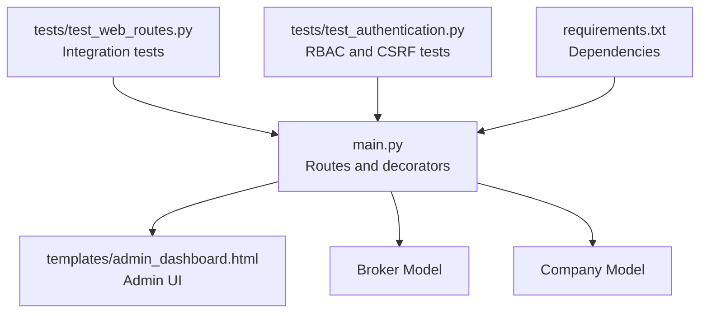
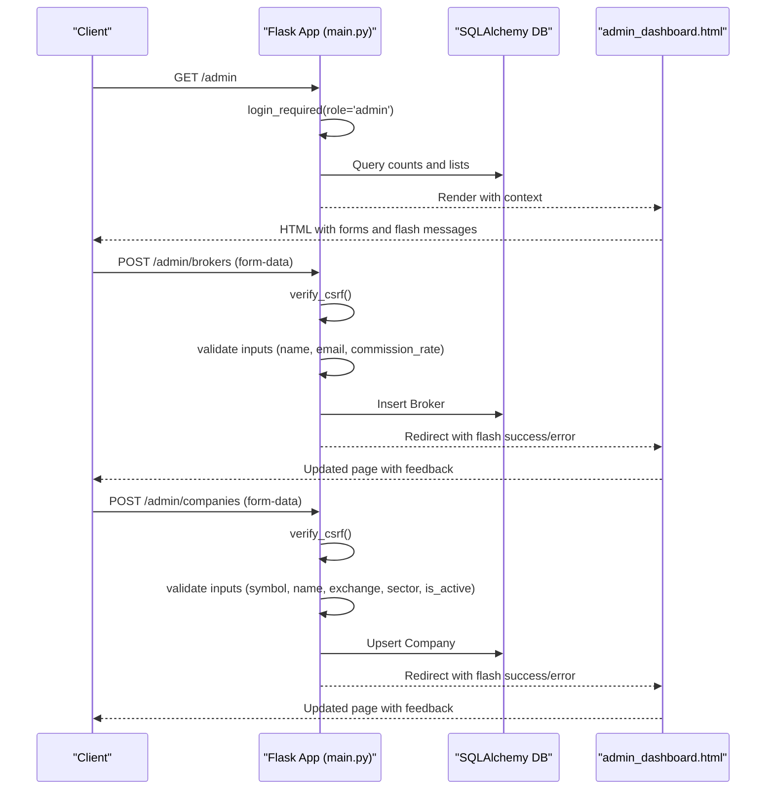
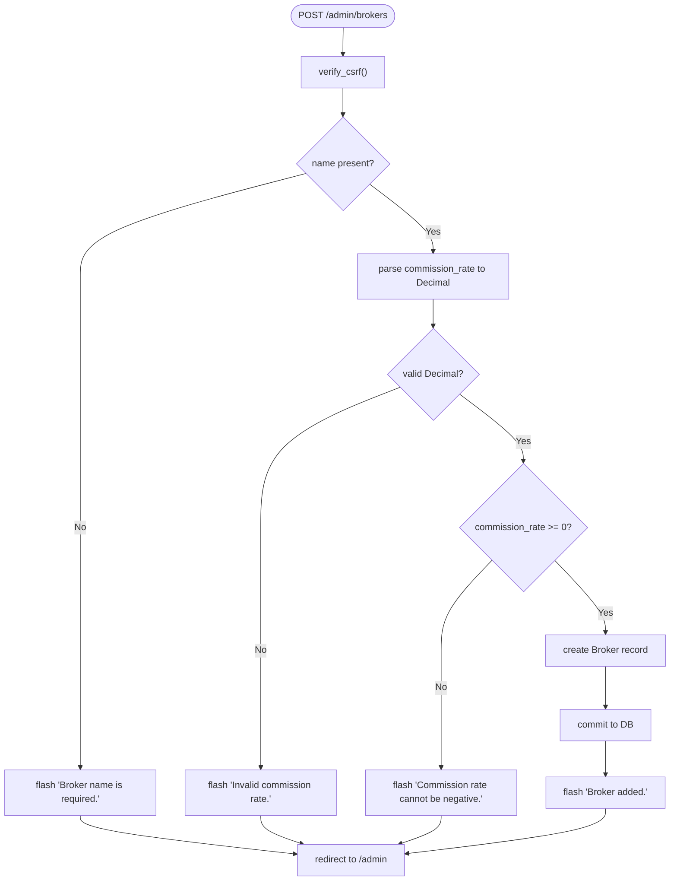
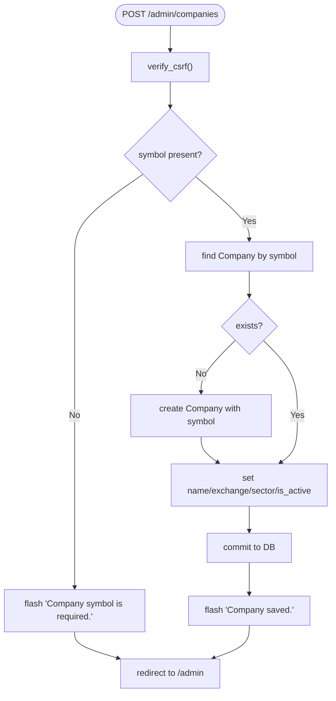
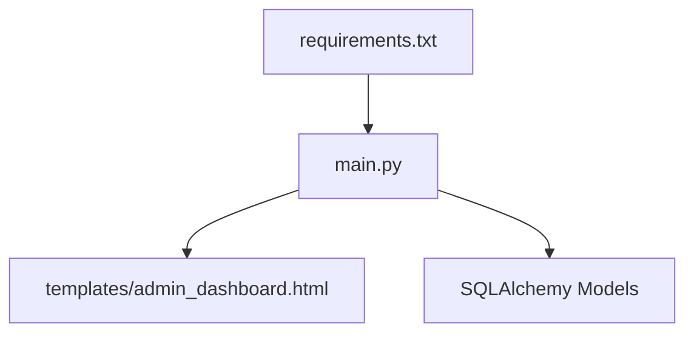

# Admin Management API

<cite>
**Referenced Files in This Document**
- [main.py](file://main.py)
- [tests/test_web_routes.py](file://tests/test_web_routes.py)
- [tests/test_authentication.py](file://tests/test_authentication.py)
- [templates/admin_dashboard.html](file://templates/admin_dashboard.html)
- [requirements.txt](file://requirements.txt)
</cite>

## Table of Contents
1. [Introduction](#introduction)
2. [Project Structure](#project-structure)
3. [Core Components](#core-components)
4. [Architecture Overview](#architecture-overview)
5. [Detailed Component Analysis](#detailed-component-analysis)
6. [Dependency Analysis](#dependency-analysis)
7. [Performance Considerations](#performance-considerations)
8. [Troubleshooting Guide](#troubleshooting-guide)
9. [Conclusion](#conclusion)
10. [Appendices](#appendices)

## Introduction
This document describes the admin management endpoints for the intelligent-stock-prediction application. It focuses on:
- The /admin (GET) endpoint for admin dashboards
- The /admin/brokers (POST) endpoint for registering brokers
- The /admin/companies (POST) endpoint for managing company profiles

It explains role-based access control (RBAC), integration with Broker and Company models, data validation rules, authentication and CSRF protection, flash message feedback, and client implementation guidelines. It also references test coverage for admin functionality.

## Project Structure
The admin endpoints are implemented in the main application module and rendered via a dedicated admin dashboard template. Tests validate authentication, RBAC, and endpoint behavior.

**Diagram sources**
- [main.py](file://main.py#L435-L540)
- [templates/admin_dashboard.html](file://templates/admin_dashboard.html#L1-L322)
- [tests/test_web_routes.py](file://tests/test_web_routes.py#L127-L160)
- [tests/test_authentication.py](file://tests/test_authentication.py#L216-L252)
- [requirements.txt](file://requirements.txt#L1-L19)

**Section sources**
- [main.py](file://main.py#L435-L540)
- [templates/admin_dashboard.html](file://templates/admin_dashboard.html#L1-L322)
- [tests/test_web_routes.py](file://tests/test_web_routes.py#L127-L160)
- [tests/test_authentication.py](file://tests/test_authentication.py#L216-L252)
- [requirements.txt](file://requirements.txt#L1-L19)

## Core Components
- Role-based access control: The login_required decorator enforces admin privileges for admin routes.
- CSRF protection: verify_csrf validates CSRF tokens for admin POST endpoints.
- Data validation: Inputs are validated server-side and flashed back to the UI.
- Flash messages: Success and error feedback is delivered via flash categories.
- Models: Broker and Company are persisted to the database.

Key implementation references:
- Admin dashboard GET: [admin_dashboard](file://main.py#L435-L490)
- Add broker POST: [admin_add_broker](file://main.py#L492-L515)
- Add company POST: [admin_add_company](file://main.py#L517-L539)
- CSRF and RBAC helpers: [verify_csrf](file://main.py#L129-L134), [login_required](file://main.py#L139-L151)
- Admin UI forms: [admin_dashboard.html](file://templates/admin_dashboard.html#L144-L159), [admin_dashboard.html](file://templates/admin_dashboard.html#L239-L262)

**Section sources**
- [main.py](file://main.py#L129-L151)
- [main.py](file://main.py#L435-L539)
- [templates/admin_dashboard.html](file://templates/admin_dashboard.html#L144-L159)
- [templates/admin_dashboard.html](file://templates/admin_dashboard.html#L239-L262)

## Architecture Overview
The admin endpoints are Flask routes decorated with login_required(role='admin') and CSRF verification. They operate on Broker and Company models and render the admin dashboard template.

**Diagram sources**
- [main.py](file://main.py#L435-L539)
- [templates/admin_dashboard.html](file://templates/admin_dashboard.html#L144-L159)
- [templates/admin_dashboard.html](file://templates/admin_dashboard.html#L239-L262)

## Detailed Component Analysis

### Endpoint: GET /admin
- Purpose: Admin dashboard overview with metrics and management forms.
- Authentication: Requires login; enforced by login_required().
- Authorization: Requires role='admin'; enforced by login_required(role='admin').
- Behavior: Aggregates counts and recent transactions, renders admin_dashboard.html with context.
- Output: HTML page containing:
  - Metrics cards (users, active users, brokers, transactions, companies, total commission, total volume)
  - Broker registration form (POST to /admin/brokers)
  - Company management form (POST to /admin/companies)
  - Recent transactions table

Validation and feedback:
- No server-side validation occurs here; validation happens on POST endpoints.
- Flash messages are displayed via the template’s flash rendering.

**Section sources**
- [main.py](file://main.py#L435-L490)
- [templates/admin_dashboard.html](file://templates/admin_dashboard.html#L1-L322)

### Endpoint: POST /admin/brokers
- Purpose: Register a new broker.
- Authentication and authorization: Same as GET /admin.
- CSRF protection: verify_csrf() is called.
- Request parameters:
  - name: string, required
  - email: string, optional
  - commission_rate: numeric percentage, required, non-negative
- Validation rules:
  - name must be present; otherwise flash an error and redirect.
  - commission_rate must parse to a decimal; otherwise flash an error and redirect.
  - commission_rate must be non-negative; otherwise flash an error and redirect.
- Persistence: Creates a new Broker record with provided fields.
- Feedback: On success, flashes a success message; on error, flashes a danger message.

**Diagram sources**
- [main.py](file://main.py#L492-L515)

**Section sources**
- [main.py](file://main.py#L492-L515)
- [templates/admin_dashboard.html](file://templates/admin_dashboard.html#L144-L159)

### Endpoint: POST /admin/companies
- Purpose: Manage company profiles (create/update).
- Authentication and authorization: Same as GET /admin.
- CSRF protection: verify_csrf() is called.
- Request parameters:
  - symbol: string, required (uppercased)
  - name: string, optional (defaults to symbol if empty)
  - exchange: string, optional
  - sector: string, optional
  - is_active: checkbox presence determines boolean flag
- Validation rules:
  - symbol must be present; otherwise flash an error and redirect.
  - If symbol does not exist, a Company record is created with minimal data.
  - Updates name/exchange/sector/is_active accordingly.
- Persistence: Upserts Company by symbol.
- Feedback: On success, flashes a success message; on error, flashes a danger message.

**Diagram sources**
- [main.py](file://main.py#L517-L539)

**Section sources**
- [main.py](file://main.py#L517-L539)
- [templates/admin_dashboard.html](file://templates/admin_dashboard.html#L239-L262)

### Role-Based Access Control and Authentication
- login_required decorator:
  - Enforces session presence; redirects unauthenticated users to login.
  - Enforces role='admin' for admin routes.
- verify_csrf:
  - Compares session-stored CSRF token with form-provided token; aborts with 400 if mismatch.
- Session storage:
  - Stores user_id and user_role in session upon login.
- CSRF token availability:
  - Jinja global csrf_token() renders hidden input in templates.

References:
- [login_required](file://main.py#L139-L151)
- [verify_csrf](file://main.py#L129-L134)
- [CSRF token global](file://main.py#L136-L137)
- [Admin UI forms include CSRF token](file://templates/admin_dashboard.html#L144-L159)

**Section sources**
- [main.py](file://main.py#L129-L151)
- [main.py](file://main.py#L136-L137)
- [templates/admin_dashboard.html](file://templates/admin_dashboard.html#L144-L159)

### Data Models and Integration
- Broker model fields: name, email, commission_rate, is_active.
- Company model fields: symbol, name, exchange, sector, is_active.
- Persistence:
  - Broker creation in POST /admin/brokers.
  - Company upsert in POST /admin/companies.

References:
- [Broker model](file://main.py#L75-L81)
- [Company model](file://main.py#L66-L73)
- [Admin broker route](file://main.py#L492-L515)
- [Admin company route](file://main.py#L517-L539)

**Section sources**
- [main.py](file://main.py#L66-L81)
- [main.py](file://main.py#L492-L539)

### Flash Message Feedback
- Success and danger categories are used to communicate outcomes.
- The admin dashboard template renders flash messages for user feedback.

References:
- [Admin dashboard template flash rendering](file://templates/admin_dashboard.html#L1-L322)

**Section sources**
- [templates/admin_dashboard.html](file://templates/admin_dashboard.html#L1-L322)

### Client Implementation Guidelines
- Use HTML forms targeting the admin endpoints:
  - POST /admin/brokers with fields: name, email, commission_rate
  - POST /admin/companies with fields: symbol, name, exchange, sector, is_active (checkbox)
- Include CSRF token in each form:
  - Hidden input named csrf_token with value from csrf_token()
- Expect redirects with flash messages; handle success and error feedback accordingly.

References:
- [Admin broker form](file://templates/admin_dashboard.html#L144-L159)
- [Admin company form](file://templates/admin_dashboard.html#L239-L262)

**Section sources**
- [templates/admin_dashboard.html](file://templates/admin_dashboard.html#L144-L159)
- [templates/admin_dashboard.html](file://templates/admin_dashboard.html#L239-L262)

## Dependency Analysis
- Internal dependencies:
  - main.py defines routes, decorators, and models.
  - templates/admin_dashboard.html renders forms and displays feedback.
- External dependencies:
  - Flask, SQLAlchemy, and related packages are declared in requirements.txt.

**Diagram sources**
- [main.py](file://main.py#L435-L539)
- [templates/admin_dashboard.html](file://templates/admin_dashboard.html#L1-L322)
- [requirements.txt](file://requirements.txt#L1-L19)

**Section sources**
- [main.py](file://main.py#L435-L539)
- [templates/admin_dashboard.html](file://templates/admin_dashboard.html#L1-L322)
- [requirements.txt](file://requirements.txt#L1-L19)

## Performance Considerations
- Route logic is lightweight; performance primarily depends on database writes and template rendering.
- Consider batching company updates if bulk operations are needed.
- Ensure database indexes exist on frequently queried fields (e.g., Company.symbol).

## Troubleshooting Guide
Common issues and resolutions:
- Permission denied (403 or redirect): Ensure the session user has role='admin'.
- CSRF mismatch (400): Include a valid CSRF token in the form.
- Validation errors:
  - Broker name required: Provide a non-empty name.
  - Invalid commission rate: Provide a valid numeric value.
  - Negative commission rate: Provide a non-negative value.
  - Company symbol required: Provide a non-empty symbol.
- Redirect loops: After successful POST, the route redirects back to the admin dashboard with a flash message.

References:
- [RBAC tests](file://tests/test_authentication.py#L216-L252)
- [Admin route tests](file://tests/test_web_routes.py#L127-L160)
- [CSRF tests](file://tests/test_authentication.py#L197-L215)

**Section sources**
- [tests/test_authentication.py](file://tests/test_authentication.py#L197-L252)
- [tests/test_web_routes.py](file://tests/test_web_routes.py#L127-L160)

## Conclusion
The admin management endpoints provide secure, validated operations for broker and company administration. They enforce RBAC and CSRF protection, integrate with Broker and Company models, and deliver user feedback via flash messages. Clients should submit HTML forms with CSRF tokens and observe redirect behavior with flash messages.

## Appendices

### API Reference Summary
- GET /admin
  - Method: GET
  - URL: /admin
  - Authentication: Required
  - Authorization: admin
  - Response: HTML admin dashboard
- POST /admin/brokers
  - Method: POST
  - URL: /admin/brokers
  - Authentication: Required
  - Authorization: admin
  - CSRF: Required
  - Parameters:
    - name: string, required
    - email: string, optional
    - commission_rate: numeric, required, non-negative
  - Response: Redirect to /admin with flash message
- POST /admin/companies
  - Method: POST
  - URL: /admin/companies
  - Authentication: Required
  - Authorization: admin
  - CSRF: Required
  - Parameters:
    - symbol: string, required
    - name: string, optional
    - exchange: string, optional
    - sector: string, optional
    - is_active: checkbox, optional
  - Response: Redirect to /admin with flash message

**Section sources**
- [main.py](file://main.py#L435-L539)
- [templates/admin_dashboard.html](file://templates/admin_dashboard.html#L144-L159)
- [templates/admin_dashboard.html](file://templates/admin_dashboard.html#L239-L262)