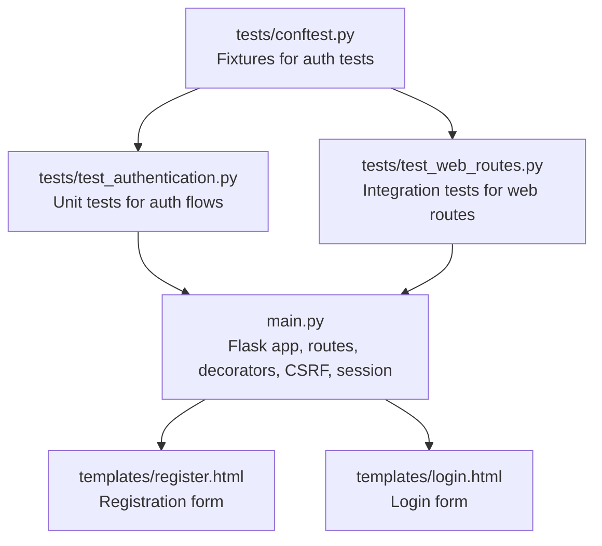
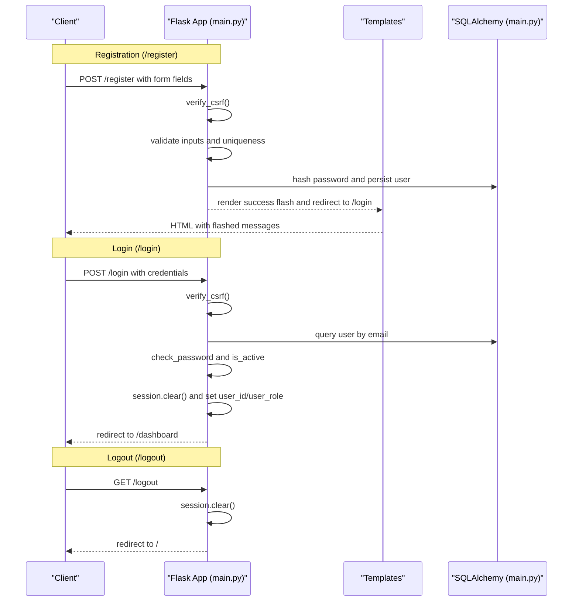
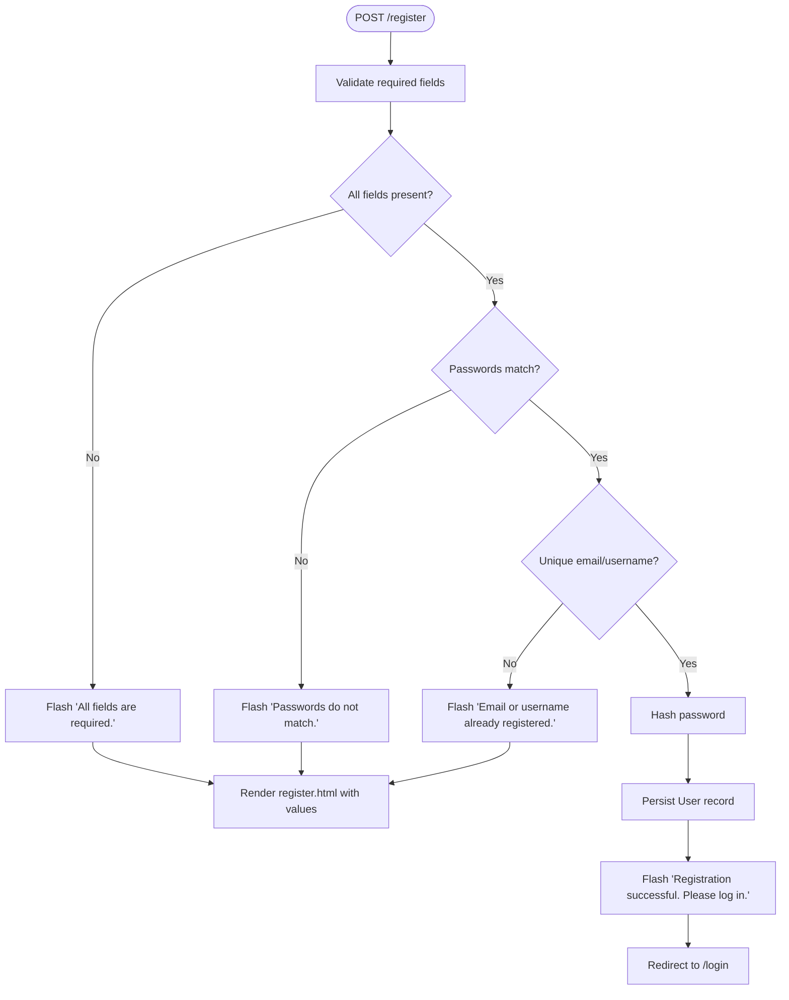
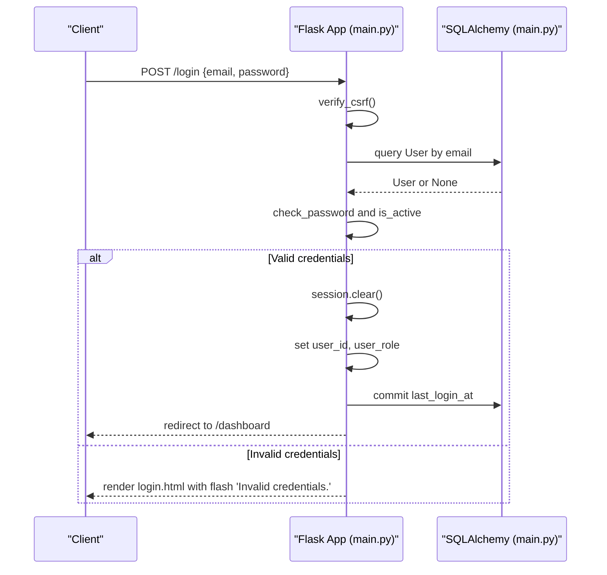
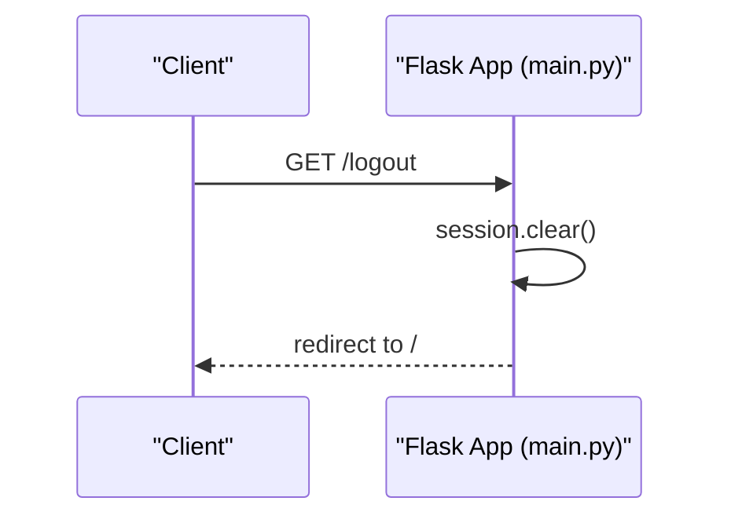
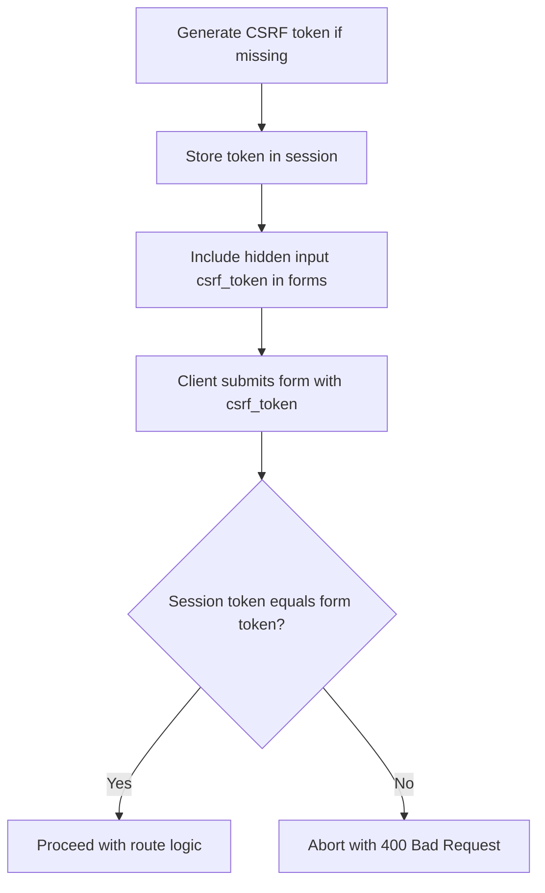
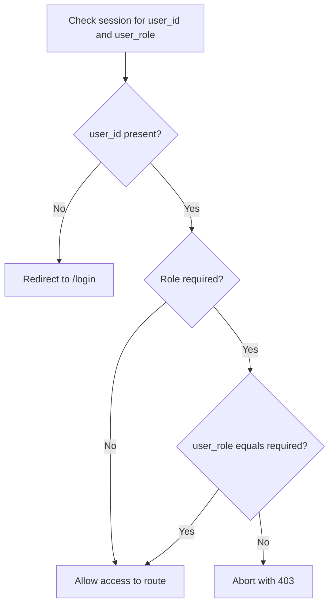
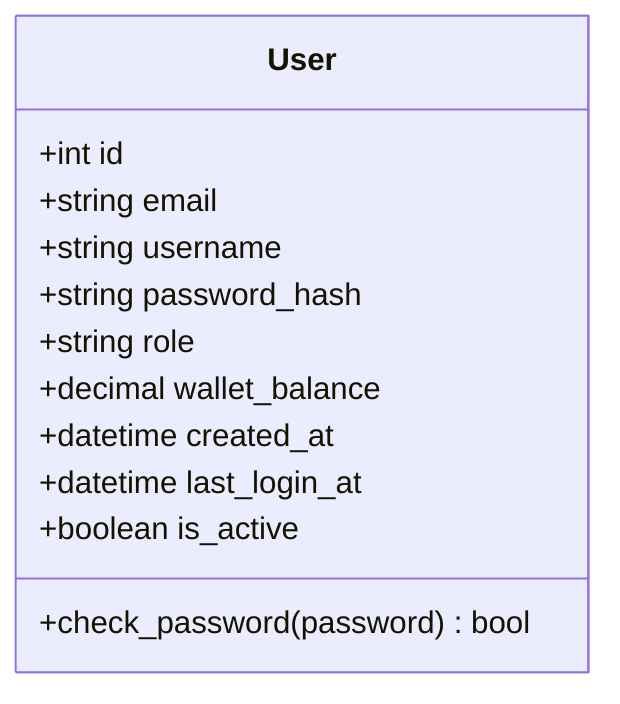
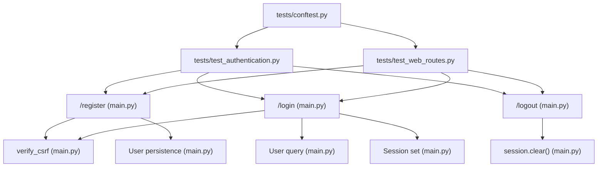

# Authentication API

<cite>
**Referenced Files in This Document**
- [main.py](file://main.py)
- [templates/register.html](file://templates/register.html)
- [templates/login.html](file://templates/login.html)
- [tests/test_authentication.py](file://tests/test_authentication.py)
- [tests/test_web_routes.py](file://tests/test_web_routes.py)
- [tests/conftest.py](file://tests/conftest.py)
</cite>

## Table of Contents
1. [Introduction](#introduction)
2. [Project Structure](#project-structure)
3. [Core Components](#core-components)
4. [Architecture Overview](#architecture-overview)
5. [Detailed Component Analysis](#detailed-component-analysis)
6. [Dependency Analysis](#dependency-analysis)
7. [Performance Considerations](#performance-considerations)
8. [Troubleshooting Guide](#troubleshooting-guide)
9. [Conclusion](#conclusion)
10. [Appendices](#appendices)

## Introduction
This document provides API documentation for the authentication endpoints in the intelligent-stock-prediction application. It covers the HTTP endpoints for user registration, login, and logout, including request parameters, response behaviors, session management, CSRF protection, and integration with the User model. It also includes client implementation guidelines and security considerations derived from the repository’s code and tests.

## Project Structure
Authentication endpoints are implemented in the main application module and rendered via Jinja2 templates. Tests validate behavior and flows for these endpoints.

**Diagram sources**
- [main.py](file://main.py#L121-L159)
- [templates/register.html](file://templates/register.html#L79-L103)
- [templates/login.html](file://templates/login.html#L79-L95)
- [tests/test_authentication.py](file://tests/test_authentication.py#L1-L336)
- [tests/test_web_routes.py](file://tests/test_web_routes.py#L43-L79)
- [tests/conftest.py](file://tests/conftest.py#L1-L144)

**Section sources**
- [main.py](file://main.py#L121-L159)
- [templates/register.html](file://templates/register.html#L79-L103)
- [templates/login.html](file://templates/login.html#L79-L95)
- [tests/test_authentication.py](file://tests/test_authentication.py#L1-L336)
- [tests/test_web_routes.py](file://tests/test_web_routes.py#L43-L79)
- [tests/conftest.py](file://tests/conftest.py#L1-L144)

## Core Components
- Authentication routes
  - POST /register: Creates a new user account after validating inputs and CSRF.
  - POST /login: Authenticates a user and initializes session.
  - GET /logout: Clears session and redirects to the home page.
- Session management
  - login_required decorator enforces authentication and role checks.
  - Session stores user_id and user_role.
- CSRF protection
  - CSRF token is generated and stored in the session.
  - verify_csrf validates the token on POST requests.
- User model integration
  - Passwords are hashed using a secure hashing function.
  - User records are persisted to the database.

**Section sources**
- [main.py](file://main.py#L121-L159)
- [main.py](file://main.py#L199-L249)
- [main.py](file://main.py#L51-L64)

## Architecture Overview
The authentication flow integrates route handlers, template rendering, session storage, CSRF validation, and database persistence.

**Diagram sources**
- [main.py](file://main.py#L121-L159)
- [main.py](file://main.py#L199-L249)
- [templates/register.html](file://templates/register.html#L79-L103)
- [templates/login.html](file://templates/login.html#L79-L95)

## Detailed Component Analysis

### Endpoint: POST /register
- Purpose: Create a new user account.
- Request method: POST
- URL pattern: /register
- Form fields:
  - email (required)
  - username (required)
  - password (required, minimum length enforced by template)
  - confirm_password (required)
- Behavior:
  - Validates presence of all fields.
  - Ensures password and confirm_password match.
  - Checks uniqueness of email or username.
  - Hashes password and creates a new User record with role set to user.
  - Emits a success flash message and redirects to /login.
- CSRF protection: Enforced via verify_csrf().
- Session management: No session created during registration.
- Templates: Uses register.html; includes hidden csrf_token input.

**Diagram sources**
- [main.py](file://main.py#L199-L223)
- [templates/register.html](file://templates/register.html#L79-L103)

**Section sources**
- [main.py](file://main.py#L199-L223)
- [templates/register.html](file://templates/register.html#L79-L103)
- [tests/test_authentication.py](file://tests/test_authentication.py#L14-L95)
- [tests/test_web_routes.py](file://tests/test_web_routes.py#L46-L61)

### Endpoint: POST /login
- Purpose: Authenticate a user and initialize session.
- Request method: POST
- URL pattern: /login
- Form fields:
  - email (required)
  - password (required)
- Behavior:
  - Validates CSRF token.
  - Queries user by email and checks password and is_active flag.
  - On success: clears any existing session, sets user_id and user_role, updates last_login_at, and redirects to /dashboard.
  - On failure: flashes an invalid credentials message and re-renders login.html.
- CSRF protection: Enforced via verify_csrf().
- Session management: Sets session keys user_id and user_role; clears session before setting new values.

**Diagram sources**
- [main.py](file://main.py#L226-L249)
- [templates/login.html](file://templates/login.html#L79-L95)

**Section sources**
- [main.py](file://main.py#L226-L249)
- [templates/login.html](file://templates/login.html#L79-L95)
- [tests/test_authentication.py](file://tests/test_authentication.py#L97-L171)
- [tests/test_web_routes.py](file://tests/test_web_routes.py#L62-L75)

### Endpoint: GET /logout
- Purpose: Clear the current session and redirect to the home page.
- Request method: GET
- URL pattern: /logout
- Behavior:
  - Clears all session data.
  - Redirects to the index route.
- CSRF protection: Not applicable for GET; CSRF is validated on POST routes.

**Diagram sources**
- [main.py](file://main.py#L245-L249)

**Section sources**
- [main.py](file://main.py#L245-L249)
- [tests/test_authentication.py](file://tests/test_authentication.py#L173-L195)
- [tests/test_web_routes.py](file://tests/test_web_routes.py#L76-L80)

### CSRF Protection Mechanism
- Token generation: A CSRF token is generated and stored in the session if not present.
- Token inclusion: Templates include a hidden input field named csrf_token.
- Validation: verify_csrf compares the token in the session with the token submitted in the form; on mismatch, aborts with HTTP 400.

**Diagram sources**
- [main.py](file://main.py#L121-L134)
- [templates/register.html](file://templates/register.html#L79-L83)
- [templates/login.html](file://templates/login.html#L79-L83)

**Section sources**
- [main.py](file://main.py#L121-L134)
- [templates/register.html](file://templates/register.html#L79-L83)
- [templates/login.html](file://templates/login.html#L79-L83)
- [tests/test_authentication.py](file://tests/test_authentication.py#L197-L214)

### Session Management and Role-Based Access Control
- Session keys:
  - user_id: ID of the authenticated user.
  - user_role: Role of the authenticated user (e.g., user, admin).
- login_required decorator:
  - Redirects to login if user_id is absent.
  - Optionally enforces role equality when role is specified.
- get_current_user helper:
  - Retrieves the current user based on session user_id.

**Diagram sources**
- [main.py](file://main.py#L139-L151)
- [main.py](file://main.py#L154-L159)

**Section sources**
- [main.py](file://main.py#L139-L159)
- [tests/test_authentication.py](file://tests/test_authentication.py#L216-L243)

### User Model Integration
- Fields:
  - email (unique)
  - username (unique)
  - password_hash (hashed)
  - role (default user)
  - is_active (default True)
  - last_login_at (updated on login)
- Password handling:
  - Passwords are hashed before storage.
  - check_password verifies provided password against stored hash.

**Diagram sources**
- [main.py](file://main.py#L51-L64)

**Section sources**
- [main.py](file://main.py#L51-L64)
- [tests/test_authentication.py](file://tests/test_authentication.py#L291-L336)

### Example Request/Response Flows from Tests
- Registration flow (valid):
  - Client sends POST /register with email, username, password, confirm_password.
  - Server validates, hashes password, persists user, flashes success, and redirects to /login.
  - Reference: [tests/test_authentication.py](file://tests/test_authentication.py#L23-L39), [tests/test_web_routes.py](file://tests/test_web_routes.py#L51-L61)
- Login flow (valid):
  - Client sends POST /login with email and password.
  - Server validates CSRF, authenticates user, sets session, updates last_login_at, and redirects to /dashboard.
  - Reference: [tests/test_authentication.py](file://tests/test_authentication.py#L106-L118), [tests/test_web_routes.py](file://tests/test_web_routes.py#L67-L75)
- Logout flow:
  - Client sends GET /logout.
  - Server clears session and redirects to /.
  - Reference: [tests/test_authentication.py](file://tests/test_authentication.py#L176-L195), [tests/test_web_routes.py](file://tests/test_web_routes.py#L76-L80)

**Section sources**
- [tests/test_authentication.py](file://tests/test_authentication.py#L23-L39)
- [tests/test_authentication.py](file://tests/test_authentication.py#L106-L118)
- [tests/test_authentication.py](file://tests/test_authentication.py#L176-L195)
- [tests/test_web_routes.py](file://tests/test_web_routes.py#L51-L61)
- [tests/test_web_routes.py](file://tests/test_web_routes.py#L67-L75)
- [tests/test_web_routes.py](file://tests/test_web_routes.py#L76-L80)

## Dependency Analysis
- Route dependencies:
  - /register depends on verify_csrf, form validation, and User persistence.
  - /login depends on verify_csrf, User lookup, password verification, and session initialization.
  - /logout depends on session clearing.
- Template dependencies:
  - Both register.html and login.html include a hidden csrf_token input and render flashed messages.
- Test dependencies:
  - Fixtures in conftest.py provide authenticated clients and sample users for testing.

**Diagram sources**
- [main.py](file://main.py#L121-L249)
- [tests/test_authentication.py](file://tests/test_authentication.py#L1-L336)
- [tests/test_web_routes.py](file://tests/test_web_routes.py#L43-L79)
- [tests/conftest.py](file://tests/conftest.py#L1-L144)

**Section sources**
- [main.py](file://main.py#L121-L249)
- [tests/test_authentication.py](file://tests/test_authentication.py#L1-L336)
- [tests/test_web_routes.py](file://tests/test_web_routes.py#L43-L79)
- [tests/conftest.py](file://tests/conftest.py#L1-L144)

## Performance Considerations
- Password hashing is performed server-side; ensure appropriate hashing parameters for production.
- Database queries for user lookup are O(1) with indexed email; ensure database indexing is configured.
- CSRF token generation uses a secure random generator; keep SECRET_KEY secret in production.

[No sources needed since this section provides general guidance]

## Troubleshooting Guide
Common issues and resolutions:
- Invalid CSRF token:
  - Symptom: 400 Bad Request on POST.
  - Cause: Missing or mismatched csrf_token.
  - Resolution: Ensure templates include hidden csrf_token input and resubmit the form.
  - Reference: [main.py](file://main.py#L129-L134), [templates/register.html](file://templates/register.html#L79-L83), [templates/login.html](file://templates/login.html#L79-L83)
- Invalid credentials:
  - Symptom: Flash message indicating invalid credentials on /login.
  - Cause: Incorrect email/password or inactive account.
  - Resolution: Verify credentials and ensure account is active.
  - Reference: [main.py](file://main.py#L226-L249), [tests/test_authentication.py](file://tests/test_authentication.py#L119-L157)
- Unauthenticated access:
  - Symptom: Redirect to /login or 403 for protected routes.
  - Cause: Missing or invalid session.
  - Resolution: Log in to establish session or ensure login_required decorator is bypassed appropriately.
  - Reference: [main.py](file://main.py#L139-L151), [tests/test_authentication.py](file://tests/test_authentication.py#L216-L243)
- Session not cleared on logout:
  - Symptom: Session keys still present after /logout.
  - Cause: Logout endpoint not invoked or session not cleared.
  - Resolution: Call /logout to clear session.
  - Reference: [main.py](file://main.py#L245-L249), [tests/test_authentication.py](file://tests/test_authentication.py#L176-L195)

**Section sources**
- [main.py](file://main.py#L129-L134)
- [main.py](file://main.py#L226-L249)
- [main.py](file://main.py#L245-L249)
- [templates/register.html](file://templates/register.html#L79-L83)
- [templates/login.html](file://templates/login.html#L79-L83)
- [tests/test_authentication.py](file://tests/test_authentication.py#L119-L157)
- [tests/test_authentication.py](file://tests/test_authentication.py#L176-L195)
- [tests/test_authentication.py](file://tests/test_authentication.py#L216-L243)

## Conclusion
The authentication endpoints provide a straightforward, secure mechanism for user registration, login, and logout. CSRF protection and session management are integrated into the route handlers, while the User model ensures secure password storage. Tests validate expected behaviors and flows, including CSRF enforcement, session creation/clearing, and role-based access control.

[No sources needed since this section summarizes without analyzing specific files]

## Appendices

### Security Considerations
- Password hashing:
  - Passwords are hashed before storage and verified using a secure hashing function.
  - References: [main.py](file://main.py#L51-L64), [tests/test_authentication.py](file://tests/test_authentication.py#L291-L336)
- CSRF token validation:
  - CSRF tokens are generated, stored in session, and validated on POST requests.
  - References: [main.py](file://main.py#L121-L134), [templates/register.html](file://templates/register.html#L79-L83), [templates/login.html](file://templates/login.html#L79-L83)
- Session clearing on logout:
  - Session is cleared upon logout to prevent session fixation.
  - References: [main.py](file://main.py#L245-L249), [tests/test_authentication.py](file://tests/test_authentication.py#L176-L195)

**Section sources**
- [main.py](file://main.py#L51-L64)
- [main.py](file://main.py#L121-L134)
- [main.py](file://main.py#L245-L249)
- [templates/register.html](file://templates/register.html#L79-L83)
- [templates/login.html](file://templates/login.html#L79-L83)
- [tests/test_authentication.py](file://tests/test_authentication.py#L176-L195)
- [tests/test_authentication.py](file://tests/test_authentication.py#L291-L336)

### Client Implementation Guidelines
- Registration:
  - Submit a POST request to /register with fields email, username, password, confirm_password.
  - Include the hidden csrf_token input from the rendered form.
  - Handle flash messages and redirect to /login on success.
  - References: [templates/register.html](file://templates/register.html#L79-L103), [tests/test_web_routes.py](file://tests/test_web_routes.py#L51-L61)
- Login:
  - Submit a POST request to /login with fields email and password.
  - Include the hidden csrf_token input from the rendered form.
  - Handle flash messages and redirect to /dashboard on success.
  - References: [templates/login.html](file://templates/login.html#L79-L95), [tests/test_web_routes.py](file://tests/test_web_routes.py#L67-L75)
- Logout:
  - Send a GET request to /logout.
  - Expect a redirect to the home page.
  - References: [main.py](file://main.py#L245-L249), [tests/test_web_routes.py](file://tests/test_web_routes.py#L76-L80)
- Error handling:
  - Validate CSRF token presence and correctness.
  - Handle flash messages for validation errors and authentication failures.
  - Respect redirects for unauthenticated access to protected routes.
  - References: [main.py](file://main.py#L129-L134), [main.py](file://main.py#L139-L151), [tests/test_authentication.py](file://tests/test_authentication.py#L97-L157)

**Section sources**
- [templates/register.html](file://templates/register.html#L79-L103)
- [templates/login.html](file://templates/login.html#L79-L95)
- [main.py](file://main.py#L129-L134)
- [main.py](file://main.py#L139-L151)
- [tests/test_web_routes.py](file://tests/test_web_routes.py#L51-L61)
- [tests/test_web_routes.py](file://tests/test_web_routes.py#L67-L75)
- [tests/test_web_routes.py](file://tests/test_web_routes.py#L76-L80)
- [tests/test_authentication.py](file://tests/test_authentication.py#L97-L157)