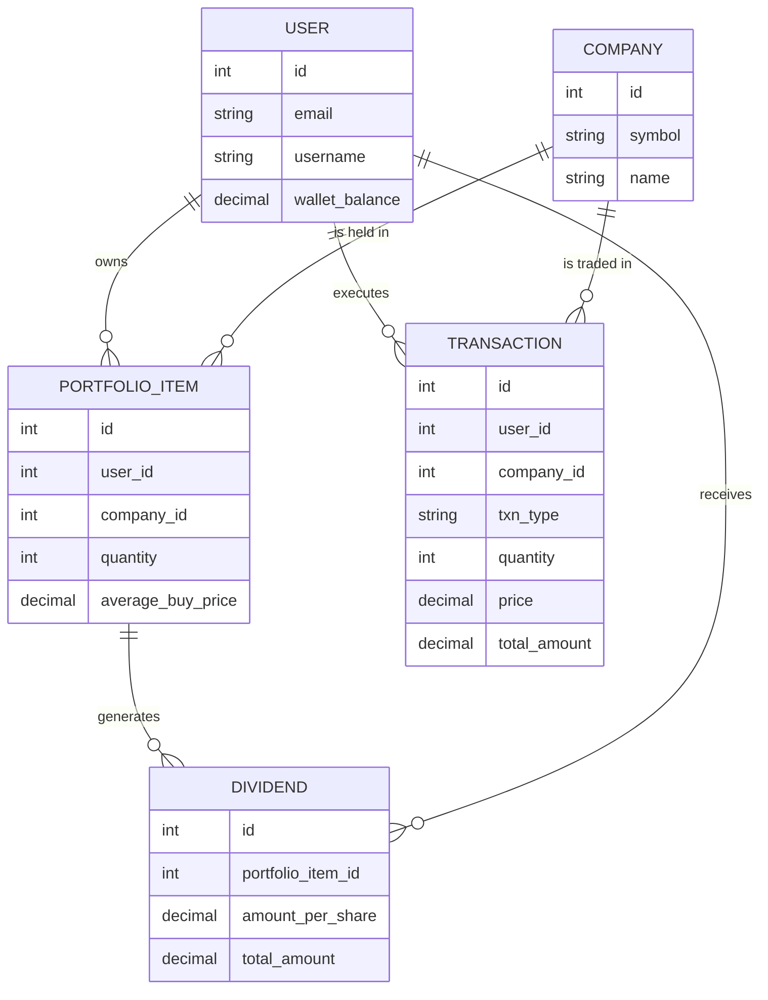
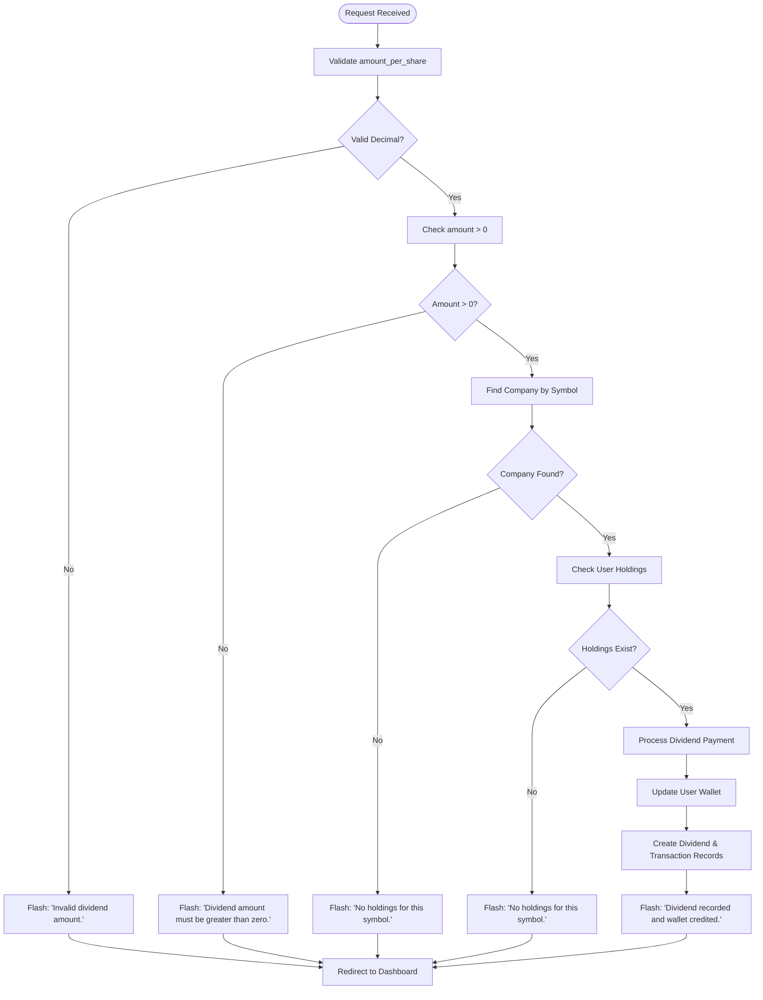
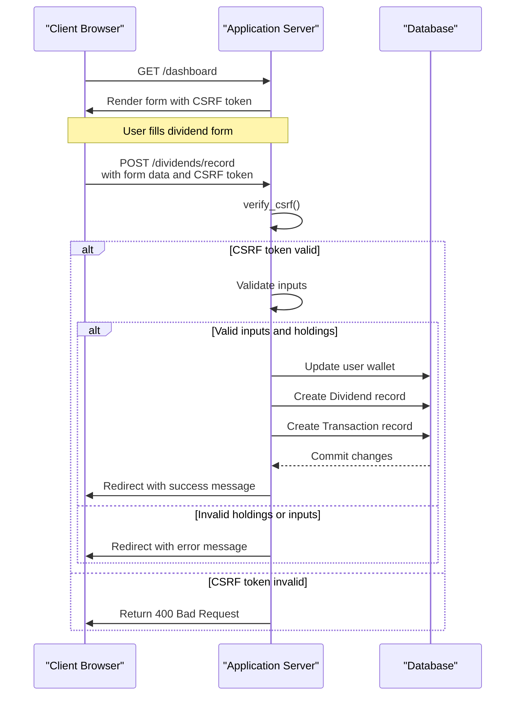

# Dividend Management API

<cite>
**Referenced Files in This Document**   
- [main.py](file://main.py#L398-L433)
- [test_portfolio_management.py](file://tests/test_portfolio_management.py#L277-L315)
- [test_web_routes.py](file://tests/test_web_routes.py#L117-L124)
- [dashboard.html](file://templates/dashboard.html#L115-L133)
- [test_database_models.py](file://tests/test_database_models.py#L298-L328)
</cite>

## Table of Contents
1. [Introduction](#introduction)
2. [API Endpoint Specification](#api-endpoint-specification)
3. [Business Logic and Data Flow](#business-logic-and-data-flow)
4. [Model Relationships](#model-relationships)
5. [Validation and Error Handling](#validation-and-error-handling)
6. [Authentication and Security](#authentication-and-security)
7. [Test Cases](#test-cases)
8. [Client Implementation Guidelines](#client-implementation-guidelines)

## Introduction
The Dividend Management API provides functionality for recording dividend payouts within the intelligent-stock-prediction application. This API endpoint allows authenticated users to record dividend payments for their portfolio holdings, which triggers updates to their wallet balance and creates appropriate transaction records. The system integrates with multiple models including Dividend, PortfolioItem, Transaction, and User to maintain accurate financial records and portfolio values.

## API Endpoint Specification

### Endpoint Details
- **HTTP Method**: POST
- **URL Pattern**: `/dividends/record`
- **Authentication Required**: Yes (user must be logged in)
- **CSRF Protection**: Enabled

### Request Parameters
The endpoint accepts form data with the following parameters:

| Parameter | Type | Required | Description |
|---------|------|----------|-------------|
| `symbol` | String | Yes | The stock symbol for which dividend is being recorded (e.g., "AAPL") |
| `amount_per_share` | Decimal | Yes | The dividend amount per share, must be greater than zero |

### Response Behavior
- On success: Redirects to the dashboard with a success flash message
- On failure: Redirects to the dashboard with an appropriate error flash message
- HTTP status code: 200 OK on successful processing

**Section sources**
- [main.py](file://main.py#L398-L433)
- [dashboard.html](file://templates/dashboard.html#L115-L133)

## Business Logic and Data Flow

### Processing Workflow
When a dividend is recorded, the system follows this business logic:

1. **Input Validation**: Validates that the dividend amount is a valid decimal and greater than zero
2. **Company Lookup**: Finds the company by the provided symbol
3. **Portfolio Verification**: Checks if the user has holdings in the specified company
4. **Amount Calculation**: Calculates the total dividend amount by multiplying amount_per_share by the quantity of shares held
5. **Data Updates**: Updates the user's wallet balance and creates appropriate records

### Total Dividend Calculation
The total dividend amount is calculated using the formula:
```
total_amount = amount_per_share × quantity_of_shares
```

For example, if a user holds 100 shares of AAPL and the dividend is $0.50 per share, the total dividend amount would be $50.00.

### Wallet Update Process
The user's wallet balance is credited with the total dividend amount. This simulated credit allows users to track dividend income within the application's virtual trading environment.

**Section sources**
- [main.py](file://main.py#L403-L425)

## Model Relationships

### Data Model Integration
The dividend recording process involves four key models that work together to maintain financial records:



**Diagram sources**
- [main.py](file://main.py#L50-L118)
- [test_database_models.py](file://tests/test_database_models.py#L298-L328)

### Model Responsibilities
- **User**: Stores user information including wallet balance that gets credited with dividend amounts
- **PortfolioItem**: Represents user holdings in a specific company, including quantity of shares
- **Dividend**: Records dividend payment details including amount per share and total amount
- **Transaction**: Creates an audit trail of the dividend payment with type 'DIVIDEND'

## Validation and Error Handling

### Input Validation
The system performs several validation checks:

1. **Amount Validation**: Ensures the dividend amount can be converted to a decimal value
2. **Positive Value Check**: Verifies the dividend amount is greater than zero
3. **Symbol Validation**: Confirms the stock symbol exists in the database
4. **Holdings Verification**: Checks that the user has active holdings in the specified company

### Error Scenarios
The API handles the following error conditions:

| Error Condition | Response |
|----------------|----------|
| Invalid dividend amount format | Flash message: "Invalid dividend amount." |
| Dividend amount ≤ 0 | Flash message: "Dividend amount must be greater than zero." |
| Symbol not found | Flash message: "No holdings for this symbol." |
| No holdings for symbol | Flash message: "No holdings for this symbol." |

### Error Response Flow


**Diagram sources**
- [main.py](file://main.py#L405-L420)
- [test_portfolio_management.py](file://tests/test_portfolio_management.py#L307-L315)

**Section sources**
- [main.py](file://main.py#L405-L420)
- [test_portfolio_management.py](file://tests/test_portfolio_management.py#L307-L315)

## Authentication and Security

### Authentication Requirements
The `/dividends/record` endpoint requires user authentication through the `@login_required()` decorator. Users must be logged in to access this functionality.

### CSRF Protection
The endpoint implements CSRF (Cross-Site Request Forgery) protection:

- The `verify_csrf()` function validates that the submitted CSRF token matches the session token
- CSRF tokens are generated automatically and stored in the user's session
- The token must be included in the form as a hidden field named `csrf_token`

### Security Implementation


**Diagram sources**
- [main.py](file://main.py#L401-L402)
- [dashboard.html](file://templates/dashboard.html#L123)

**Section sources**
- [main.py](file://main.py#L121-L133)
- [test_authentication.py](file://tests/test_authentication.py#L197-L213)

## Test Cases

### Unit and Integration Tests
The following test cases verify the functionality of the dividend recording endpoint:

```python
def test_record_dividend(self, authenticated_client, test_db, sample_portfolio_item, sample_user):
    """Test recording a dividend payout."""
    initial_balance = sample_user.wallet_balance
    amount_per_share = Decimal('0.25')
    expected_total = amount_per_share * sample_portfolio_item.quantity
    
    data = {
        'symbol': sample_portfolio_item.company.symbol,
        'amount_per_share': str(amount_per_share)
    }
    response = authenticated_client.post('/dividends/record', data=data, follow_redirects=True)
    
    assert response.status_code == 200
    test_db.session.refresh(sample_user)
    assert sample_user.wallet_balance == initial_balance + expected_total
```

### Test Coverage
The test suite covers the following scenarios:

| Test Case | Description | Expected Outcome |
|---------|-------------|------------------|
| `test_record_dividend` | Valid dividend recording | Wallet balance increases by total dividend amount |
| `test_dividend_invalid_symbol` | Non-existent symbol | Wallet unchanged, error message displayed |
| `test_dividend_negative_amount` | Negative dividend amount | Error message about positive value requirement |

### Test Implementation Details
- Uses `authenticated_client` fixture to simulate logged-in user
- Verifies database state changes using `test_db.session.refresh()`
- Tests both successful and error scenarios
- Validates flash messages in the response

**Section sources**
- [test_portfolio_management.py](file://tests/test_portfolio_management.py#L277-L315)
- [test_web_routes.py](file://tests/test_web_routes.py#L117-L124)

## Client Implementation Guidelines

### Form Implementation
To implement the dividend recording functionality in client applications:

```html
<form method="POST" action="{{ url_for('record_dividend') }}" class="form-inline">
    <input type="hidden" name="csrf_token" value="{{ csrf_token() }}">
    <div class="form-group">
        <label for="div_symbol">Symbol</label>
        <input type="text" class="form-control" id="div_symbol" name="symbol" placeholder="Symbol">
    </div>
    <div class="form-group">
        <label for="amount_per_share">Amount/Share</label>
        <input type="number" step="0.0001" min="0" class="form-control" id="amount_per_share" name="amount_per_share" placeholder="Amount per share">
    </div>
    <button type="submit" class="btn btn-success">Record</button>
</form>
```

### Key Implementation Points
1. **Include CSRF Token**: Always include the CSRF token as a hidden field in the form
2. **Input Validation**: Implement client-side validation for positive decimal values
3. **User Feedback**: Display success/error messages from the server response
4. **Symbol Autocomplete**: Consider implementing symbol autocomplete to prevent typos
5. **Current Holdings Display**: Show the user's current holdings for the selected symbol

### Best Practices
- Always redirect after successful POST to prevent duplicate submissions
- Use appropriate input types and attributes (e.g., `step="0.0001"` for dividend amounts)
- Provide clear error messages to guide users
- Ensure mobile responsiveness for the dividend recording form
- Consider adding a preview feature that shows the total dividend amount before submission

**Section sources**
- [dashboard.html](file://templates/dashboard.html#L122-L132)
- [main.py](file://main.py#L398-L433)