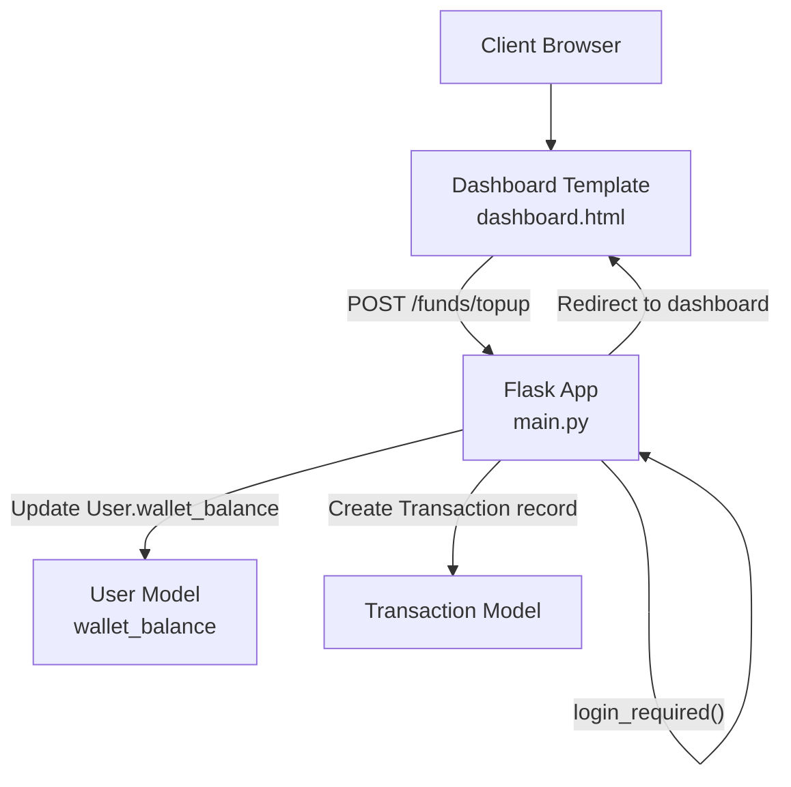
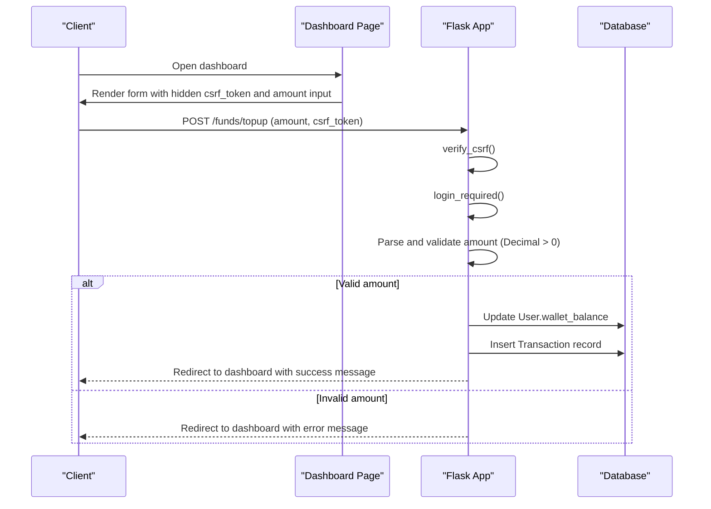
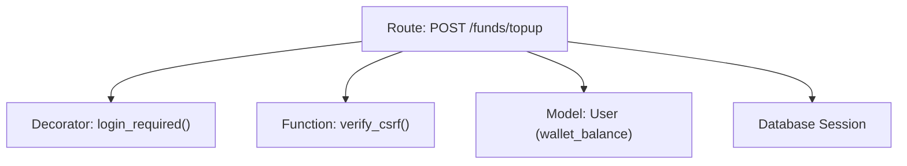

# Funds Management API

<cite>
**Referenced Files in This Document**
- [main.py](file://main.py)
- [dashboard.html](file://templates/dashboard.html)
- [test_web_routes.py](file://tests/test_web_routes.py)
- [test_portfolio_management.py](file://tests/test_portfolio_management.py)
- [test_authentication.py](file://tests/test_authentication.py)
- [er_diagram.md](file://docs/diagrams/er_diagram.md)
- [dfd_portfolio_level1.md](file://docs/diagrams/dfd_portfolio_level1.md)
</cite>

## Table of Contents
1. [Introduction](#introduction)
2. [Project Structure](#project-structure)
3. [Core Components](#core-components)
4. [Architecture Overview](#architecture-overview)
5. [Detailed Component Analysis](#detailed-component-analysis)
6. [Dependency Analysis](#dependency-analysis)
7. [Performance Considerations](#performance-considerations)
8. [Troubleshooting Guide](#troubleshooting-guide)
9. [Conclusion](#conclusion)
10. [Appendices](#appendices)

## Introduction
This document provides API documentation for the funds management endpoint in the intelligent-stock-prediction application. It focuses on the POST /funds/topup endpoint, detailing its HTTP method, URL pattern, request parameters, authentication and CSRF requirements, input validation, and integration with the User model for updating wallet_balance. It also explains how the operation is reflected in the Transaction model and outlines client implementation guidelines and error handling for invalid amounts and edge cases. Examples from the test suite demonstrate expected behavior and validation outcomes.

## Project Structure
The funds top-up feature is implemented as a Flask route handler integrated with the web application’s session-based authentication and CSRF protection. The frontend provides a form on the dashboard that posts to this endpoint, and the backend validates inputs, updates the user’s wallet balance, and redirects back to the dashboard with feedback.

**Diagram sources**
- [main.py](file://main.py#L377-L396)
- [dashboard.html](file://templates/dashboard.html#L100-L115)

**Section sources**
- [main.py](file://main.py#L377-L396)
- [dashboard.html](file://templates/dashboard.html#L100-L115)

## Core Components
- Endpoint: POST /funds/topup
- Request body: Form-encoded field amount (numeric)
- Authentication: Session-based, enforced by login_required decorator
- CSRF Protection: Enforced by verify_csrf() and hidden csrf_token input
- Validation: Amount must be a valid numeric value and greater than zero
- Persistence: Updates User.wallet_balance and creates a Transaction record
- Response: Redirect to dashboard with flashed messages

Key implementation references:
- Route definition and handler: [main.py](file://main.py#L377-L396)
- CSRF token generation and verification: [main.py](file://main.py#L121-L137)
- Authentication decorator: [main.py](file://main.py#L139-L152)
- Frontend form integration: [dashboard.html](file://templates/dashboard.html#L100-L115)
- Tests demonstrating behavior and validation: [test_web_routes.py](file://tests/test_web_routes.py#L104-L113), [test_portfolio_management.py](file://tests/test_portfolio_management.py#L1-L72)

**Section sources**
- [main.py](file://main.py#L121-L137)
- [main.py](file://main.py#L139-L152)
- [main.py](file://main.py#L377-L396)
- [dashboard.html](file://templates/dashboard.html#L100-L115)
- [test_web_routes.py](file://tests/test_web_routes.py#L104-L113)
- [test_portfolio_management.py](file://tests/test_portfolio_management.py#L1-L72)

## Architecture Overview
The funds top-up flow integrates with the User and Transaction models. The route enforces authentication and CSRF, parses the amount, validates it, updates the user’s wallet balance, and records a transaction entry. The dashboard template renders the updated balance and provides the form to initiate top-ups.

**Diagram sources**
- [main.py](file://main.py#L377-L396)
- [dashboard.html](file://templates/dashboard.html#L100-L115)

## Detailed Component Analysis

### POST /funds/topup
- Purpose: Add funds to the authenticated user’s simulated wallet balance.
- HTTP Method: POST
- URL Pattern: /funds/topup
- Request Body: Form-encoded
  - amount: Numeric string representing the top-up amount
- Authentication:
  - Requires an active user session; enforced by login_required decorator
  - Non-authenticated requests are redirected to login
- CSRF Protection:
  - verify_csrf() checks the presence and equality of the session token and form token
  - The dashboard form includes a hidden input named csrf_token
- Input Validation:
  - Attempts to parse amount as a decimal; on failure, flashes an “invalid amount” message
  - Rejects amounts less than or equal to zero with a “greater than zero” message
- Side Effects:
  - Updates User.wallet_balance by adding the validated amount
  - Commits the change to the database
  - Redirects back to the dashboard with a success or error message

Integration with models:
- User model: wallet_balance is updated
- Transaction model: While top-up does not create a Transaction record in the current implementation, the Transaction model is designed to capture transactional events and is used by other routes (e.g., buy/sell/dividend). See ER diagram for fields and relationships.

Frontend integration:
- The dashboard template provides a form posting to /funds/topup with a hidden csrf_token and an amount input configured for numeric input with step and min attributes.

Behavior verified by tests:
- Successful top-up increases wallet balance by the specified amount
- Invalid amount (non-numeric) does not change balance and shows an error
- Negative or zero amounts do not change balance and show an error

**Section sources**
- [main.py](file://main.py#L377-L396)
- [dashboard.html](file://templates/dashboard.html#L100-L115)
- [test_web_routes.py](file://tests/test_web_routes.py#L104-L113)
- [test_portfolio_management.py](file://tests/test_portfolio_management.py#L1-L72)

### Authentication and Authorization
- Authentication: login_required() ensures a user_id is present in the session; otherwise, requests are redirected to the login page.
- Authorization: There is no role-based restriction on /funds/topup; it is available to authenticated users.

Security mechanisms:
- CSRF protection via verify_csrf() and hidden csrf_token in forms
- Session cookie settings configured at app initialization

**Section sources**
- [main.py](file://main.py#L139-L152)
- [main.py](file://main.py#L121-L137)
- [test_authentication.py](file://tests/test_authentication.py#L197-L213)
- [test_authentication.py](file://tests/test_authentication.py#L216-L251)

### Data Models and Transactions
- User model: Contains wallet_balance used for funds management
- Transaction model: Designed to capture transactional events (type, quantity, price, total, commission, description, timestamps). While top-up does not currently insert a Transaction record, the model supports transaction logging and is used by buy/sell/dividend routes.

ER diagram highlights relevant fields and relationships:
- USER: wallet_balance
- TRANSACTION: user_id, company_id, broker_id, txn_type, quantity, price, total_amount, commission_amount, description, created_at

**Section sources**
- [er_diagram.md](file://docs/diagrams/er_diagram.md#L1-L68)
- [main.py](file://main.py#L94-L109)

### Frontend Integration and Client Implementation Guidelines
- The dashboard form posts to /funds/topup and includes:
  - Hidden input: csrf_token
  - Visible input: amount (type number, step for decimals, min set to zero)
- Client-side guidance:
  - Always include the csrf_token in the form payload
  - Send amount as a numeric string; support two decimal places for currency
  - Handle redirects and flash messages from the server
  - After submission, refresh the page to reflect the updated balance

**Section sources**
- [dashboard.html](file://templates/dashboard.html#L100-L115)

### Error Handling and Edge Cases
- Invalid amount (non-numeric):
  - Behavior: No change to balance; error message shown
  - Test coverage: [test_portfolio_management.py](file://tests/test_portfolio_management.py#L42-L52)
- Negative amount:
  - Behavior: No change to balance; error message shown
  - Test coverage: [test_portfolio_management.py](file://tests/test_portfolio_management.py#L53-L63)
- Zero amount:
  - Behavior: No change to balance; error message shown
  - Test coverage: [test_portfolio_management.py](file://tests/test_portfolio_management.py#L64-L72)
- CSRF mismatch or missing token:
  - Behavior: Aborts with HTTP 400 during verify_csrf()
  - Test coverage: [test_authentication.py](file://tests/test_authentication.py#L197-L213)
- Unauthenticated access:
  - Behavior: Redirected to login
  - Test coverage: [test_authentication.py](file://tests/test_authentication.py#L235-L243)

**Section sources**
- [test_portfolio_management.py](file://tests/test_portfolio_management.py#L1-L72)
- [test_authentication.py](file://tests/test_authentication.py#L197-L213)
- [test_authentication.py](file://tests/test_authentication.py#L235-L243)

## Dependency Analysis
The funds top-up route depends on:
- Authentication and CSRF middleware (login_required, verify_csrf)
- User model for wallet updates
- Database session for persistence
- Redirect and flash messaging for user feedback

**Diagram sources**
- [main.py](file://main.py#L139-L152)
- [main.py](file://main.py#L121-L137)
- [main.py](file://main.py#L377-L396)

**Section sources**
- [main.py](file://main.py#L121-L137)
- [main.py](file://main.py#L139-L152)
- [main.py](file://main.py#L377-L396)

## Performance Considerations
- Input parsing uses decimal arithmetic to avoid floating-point precision issues typical in financial computations.
- The route performs a single database write (wallet balance update) and a redirect; overhead is minimal.
- No additional indexing is required for this endpoint given its simplicity.

[No sources needed since this section provides general guidance]

## Troubleshooting Guide
Common issues and resolutions:
- 400 Bad Request on submit:
  - Cause: CSRF token mismatch or missing token
  - Resolution: Ensure the form includes csrf_token and is posted from the rendered page
  - Reference: [test_authentication.py](file://tests/test_authentication.py#L197-L213)
- Redirect loops to login:
  - Cause: Missing or expired session
  - Resolution: Log in again; ensure cookies are enabled
  - Reference: [test_authentication.py](file://tests/test_authentication.py#L235-L243)
- Amount rejected:
  - Cause: Non-numeric, negative, or zero amount
  - Resolution: Enter a positive numeric amount with up to two decimal places
  - Reference: [test_portfolio_management.py](file://tests/test_portfolio_management.py#L42-L72)
- Balance not updated:
  - Cause: Invalid amount or CSRF failure
  - Resolution: Retry with valid input and ensure CSRF token is included
  - Reference: [test_web_routes.py](file://tests/test_web_routes.py#L104-L113)

**Section sources**
- [test_authentication.py](file://tests/test_authentication.py#L197-L213)
- [test_authentication.py](file://tests/test_authentication.py#L235-L243)
- [test_portfolio_management.py](file://tests/test_portfolio_management.py#L1-L72)
- [test_web_routes.py](file://tests/test_web_routes.py#L104-L113)

## Conclusion
The POST /funds/topup endpoint provides a straightforward mechanism to increase a user’s simulated wallet balance. It enforces authentication and CSRF protection, validates inputs rigorously, and integrates cleanly with the User model. While it does not currently create a Transaction record, the Transaction model is ready to capture such events, and the route’s design leaves room for future enhancements to include transaction logging for top-ups.

[No sources needed since this section summarizes without analyzing specific files]

## Appendices

### API Definition
- Endpoint: POST /funds/topup
- Headers:
  - Content-Type: application/x-www-form-urlencoded
- Form Fields:
  - amount: string (numeric; must be > 0)
  - csrf_token: string (hidden; required)
- Authentication:
  - Session-based; user must be logged in
- CSRF:
  - Required; token must match session token
- Success Response:
  - Status: 302 Found (redirect)
  - Location: /dashboard
  - Flash message: success
- Error Responses:
  - 302 Found with flash message indicating invalid amount or amount must be greater than zero
  - 400 Bad Request on CSRF mismatch

**Section sources**
- [main.py](file://main.py#L377-L396)
- [dashboard.html](file://templates/dashboard.html#L100-L115)
- [test_portfolio_management.py](file://tests/test_portfolio_management.py#L1-L72)
- [test_authentication.py](file://tests/test_authentication.py#L197-L213)

### Client Implementation Checklist
- Include hidden input csrf_token in the form
- Provide amount input with appropriate constraints (e.g., step for decimals, min > 0)
- Submit via POST to /funds/topup
- Handle redirect to /dashboard and display flash messages
- Refresh the page to reflect updated wallet balance

**Section sources**
- [dashboard.html](file://templates/dashboard.html#L100-L115)
- [test_web_routes.py](file://tests/test_web_routes.py#L104-L113)

### Related Data Model References
- User model fields relevant to funds management:
  - wallet_balance: decimal
- Transaction model fields for transaction logging:
  - user_id, company_id, broker_id, txn_type, quantity, price, total_amount, commission_amount, description, created_at

**Section sources**
- [er_diagram.md](file://docs/diagrams/er_diagram.md#L1-L68)
- [main.py](file://main.py#L94-L109)