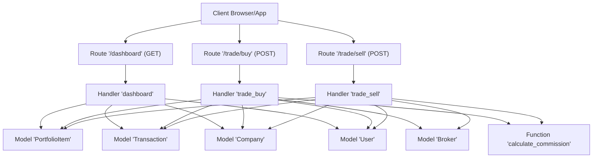
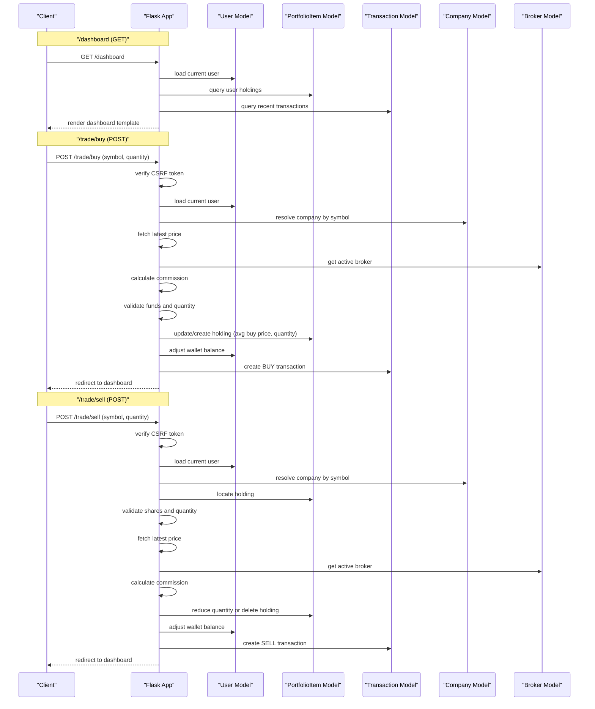
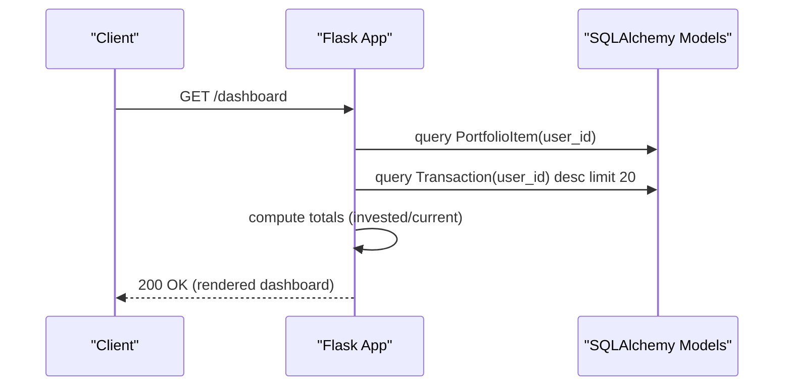
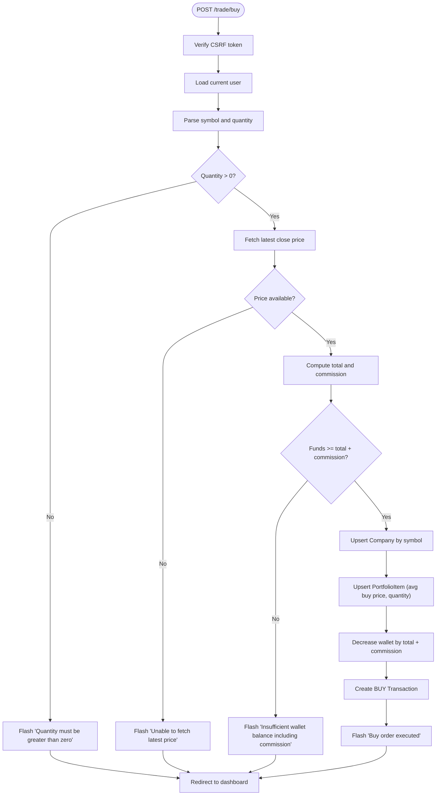
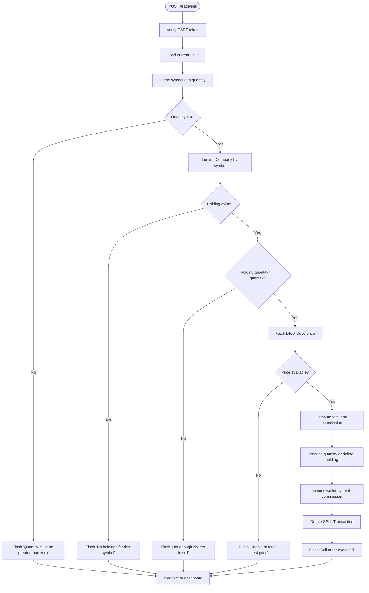
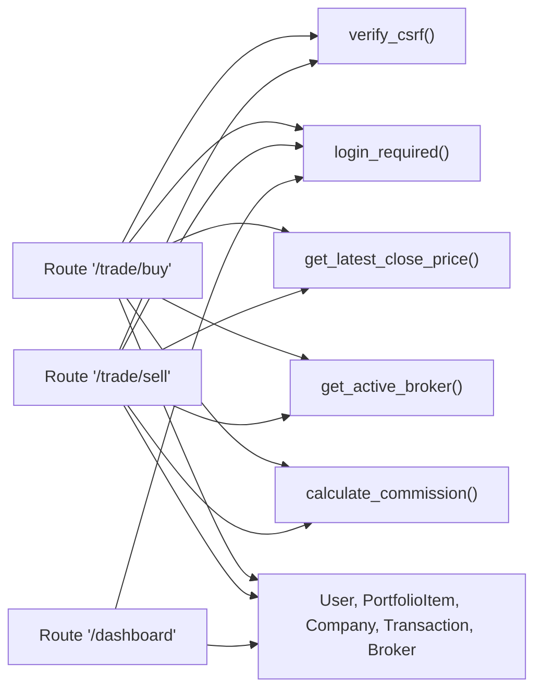

# Portfolio Management API

<cite>
**Referenced Files in This Document**
- [main.py](file://main.py)
- [templates/dashboard.html](file://templates/dashboard.html)
- [tests/test_web_routes.py](file://tests/test_web_routes.py)
- [tests/test_trading_operations.py](file://tests/test_trading_operations.py)
- [tests/test_portfolio_management.py](file://tests/test_portfolio_management.py)
</cite>

## Table of Contents
1. [Introduction](#introduction)
2. [Project Structure](#project-structure)
3. [Core Components](#core-components)
4. [Architecture Overview](#architecture-overview)
5. [Detailed Component Analysis](#detailed-component-analysis)
6. [Dependency Analysis](#dependency-analysis)
7. [Performance Considerations](#performance-considerations)
8. [Troubleshooting Guide](#troubleshooting-guide)
9. [Conclusion](#conclusion)
10. [Appendices](#appendices)

## Introduction
This document describes the portfolio management API endpoints for the intelligent-stock-prediction application. It focuses on:
- /dashboard (GET): renders the portfolio dashboard and transaction history
- /trade/buy (POST): executes simulated stock purchases
- /trade/sell (POST): executes simulated stock sales

It explains how these endpoints integrate with the PortfolioItem, Transaction, and Company models, including business logic for commission calculation, wallet balance updates, and average buy price maintenance. It also documents authentication and CSRF protection, error handling scenarios, and client implementation guidelines.

## Project Structure
The portfolio management endpoints are implemented in the main application module and rendered via a Jinja2 template. Tests validate behavior and error conditions.

**Diagram sources**
- [main.py](file://main.py#L251-L376)
- [templates/dashboard.html](file://templates/dashboard.html#L140-L228)

**Section sources**
- [main.py](file://main.py#L251-L376)
- [templates/dashboard.html](file://templates/dashboard.html#L140-L228)

## Core Components
- Authentication and CSRF protection:
  - login_required decorator enforces session-based authentication for protected routes.
  - CSRF protection is enforced by verifying a session-stored token against the form submission token.
- Models:
  - PortfolioItem: holds user holdings (quantity and average buy price).
  - Transaction: records buy/sell/dividend events with amounts, price, and commission.
  - Company: stores symbol/name/exchange/sector metadata.
  - Broker: stores commission rates used for commission calculation.
  - User: holds wallet balance and session state.

Key business logic:
- Commission calculation uses the active broker’s commission rate and quantizes to two decimals.
- Buy operations:
  - Validate symbol and quantity, fetch latest price, compute total and commission, check sufficient funds, update portfolio item (creating if needed), update wallet balance, and record transaction.
- Sell operations:
  - Validate symbol and quantity, ensure sufficient shares, compute proceeds and commission, update portfolio item (delete if quantity reaches zero), update wallet balance, and record transaction.

**Section sources**
- [main.py](file://main.py#L83-L119)
- [main.py](file://main.py#L172-L185)
- [main.py](file://main.py#L251-L376)

## Architecture Overview
The endpoints are Flask route handlers that coordinate with SQLAlchemy models and utility functions. The dashboard endpoint aggregates portfolio and transaction data for rendering.

**Diagram sources**
- [main.py](file://main.py#L251-L376)
- [templates/dashboard.html](file://templates/dashboard.html#L140-L228)

## Detailed Component Analysis

### Endpoint: GET /dashboard
- Purpose: Render the user’s portfolio dashboard, including wallet balance, total invested, current value, unrealized P/L, recent transactions, and interactive trade forms.
- Authentication: Requires login via login_required decorator.
- CSRF: Not applicable for GET; CSRF protection is enforced on POST routes.
- Request parameters: None.
- Response: HTML template rendering portfolio items, transactions, and summary metrics.
- Integration points:
  - Loads PortfolioItem entries for the user.
  - Loads Transaction entries for the user (most recent).
  - Computes totals using get_latest_close_price for current valuation.

**Diagram sources**
- [main.py](file://main.py#L251-L266)
- [templates/dashboard.html](file://templates/dashboard.html#L1-L120)

**Section sources**
- [main.py](file://main.py#L251-L266)
- [templates/dashboard.html](file://templates/dashboard.html#L140-L228)

### Endpoint: POST /trade/buy
- Purpose: Execute a simulated stock purchase.
- Authentication: login_required enforced.
- CSRF: verify_csrf enforced.
- Request parameters:
  - symbol: uppercase stock symbol (required).
  - quantity: positive integer (required).
- Business logic:
  - Fetch latest close price for symbol.
  - Compute total cost and commission using active broker rate.
  - Validate quantity > 0 and sufficient funds (total + commission).
  - Resolve or create Company entity.
  - Update or create PortfolioItem:
    - If exists: recalculate average buy price and increase quantity.
    - If new: initialize quantity and average buy price.
  - Deduct total + commission from User wallet balance.
  - Record Transaction with type BUY, price, total, commission, and description.
- Error handling:
  - Invalid or missing symbol.
  - Invalid or non-positive quantity.
  - Insufficient funds including commission.
  - Unable to fetch latest price.
- Response: Redirects to dashboard with flash messages.

**Diagram sources**
- [main.py](file://main.py#L268-L325)

**Section sources**
- [main.py](file://main.py#L268-L325)
- [tests/test_trading_operations.py](file://tests/test_trading_operations.py#L13-L133)
- [tests/test_trading_operations.py](file://tests/test_trading_operations.py#L41-L102)

### Endpoint: POST /trade/sell
- Purpose: Execute a simulated stock sale.
- Authentication: login_required enforced.
- CSRF: verify_csrf enforced.
- Request parameters:
  - symbol: uppercase stock symbol (required).
  - quantity: positive integer (required).
- Business logic:
  - Validate symbol and quantity.
  - Ensure holding exists and quantity is sufficient.
  - Fetch latest close price for symbol.
  - Compute proceeds and commission using active broker rate.
  - Reduce PortfolioItem quantity or delete if zero.
  - Add proceeds minus commission to User wallet balance.
  - Record Transaction with type SELL, price, total, commission, and description.
- Error handling:
  - Invalid or missing symbol.
  - Invalid or non-positive quantity.
  - No holdings for symbol.
  - Not enough shares to sell.
  - Unable to fetch latest price.
- Response: Redirects to dashboard with flash messages.

**Diagram sources**
- [main.py](file://main.py#L327-L376)

**Section sources**
- [main.py](file://main.py#L327-L376)
- [tests/test_trading_operations.py](file://tests/test_trading_operations.py#L135-L204)
- [tests/test_trading_operations.py](file://tests/test_trading_operations.py#L158-L191)

### Integration with Models and Business Logic
- PortfolioItem:
  - Tracks quantity and average_buy_price per user-company pair.
  - Updated on buy (recalculate average buy price) and sell (reduce quantity or delete).
- Transaction:
  - Records BUY/SELL/DIVIDEND events with price, quantity, total_amount, commission_amount, and description.
  - Linked to User, Company, and optional Broker.
- Company:
  - Ensures symbol exists; created if missing during buy.
- Broker:
  - Active broker used to compute commission via calculate_commission.
- Commission calculation:
  - Uses broker.commission_rate percentage of total_amount, quantized to two decimals.
- Wallet balance:
  - Deducted on buy (total + commission).
  - Added on sell (total - commission).
  - Adjusted on dividend recording.

**Section sources**
- [main.py](file://main.py#L83-L119)
- [main.py](file://main.py#L172-L185)
- [main.py](file://main.py#L268-L376)

### Authentication and CSRF Protection
- Authentication:
  - login_required decorator checks session for user_id and user_role.
  - Unauthenticated requests are redirected to login.
- CSRF:
  - verify_csrf compares session-stored token with form token.
  - Mismatch aborts with 400.
- Template forms:
  - Hidden input field named csrf_token is embedded in forms on the dashboard.

**Section sources**
- [main.py](file://main.py#L121-L159)
- [templates/dashboard.html](file://templates/dashboard.html#L105-L112)
- [templates/dashboard.html](file://templates/dashboard.html#L161-L172)
- [templates/dashboard.html](file://templates/dashboard.html#L200-L209)
- [templates/dashboard.html](file://templates/dashboard.html#L213-L223)

### Error Handling Scenarios
Common errors surfaced to the client via flash messages and redirects:
- Invalid or missing symbol.
- Invalid or non-positive quantity.
- Insufficient funds for buy (including commission).
- Not enough shares to sell.
- No holdings for symbol.
- Unable to fetch latest price.
- Invalid amount or negative amount for funds top-up.

These behaviors are validated in tests for buy, sell, and wallet top-up operations.

**Section sources**
- [tests/test_trading_operations.py](file://tests/test_trading_operations.py#L41-L102)
- [tests/test_trading_operations.py](file://tests/test_trading_operations.py#L158-L191)
- [tests/test_portfolio_management.py](file://tests/test_portfolio_management.py#L42-L73)

### Client Implementation Guidelines
- Authentication:
  - Ensure the client maintains a valid session by logging in via the application’s login flow.
- CSRF:
  - Include a hidden input field named csrf_token with the token generated by the server in forms.
- Request format:
  - Submit POST requests with form-encoded data containing symbol and quantity for buy/sell.
- Validation:
  - Validate inputs on the client side (e.g., positive integers) to minimize server errors.
- Error handling:
  - After POST, expect a redirect to the dashboard; inspect flash messages for feedback.
- Monitoring portfolio performance:
  - Use GET /dashboard to retrieve current holdings, wallet balance, and recent transactions.

**Section sources**
- [templates/dashboard.html](file://templates/dashboard.html#L105-L112)
- [templates/dashboard.html](file://templates/dashboard.html#L140-L228)
- [tests/test_web_routes.py](file://tests/test_web_routes.py#L82-L102)

## Dependency Analysis
The endpoints depend on:
- Session-based authentication and CSRF verification.
- SQLAlchemy models for persistence.
- Utility functions for price fetching and commission calculation.
- Broker selection for commission computation.

**Diagram sources**
- [main.py](file://main.py#L121-L185)
- [main.py](file://main.py#L251-L376)

**Section sources**
- [main.py](file://main.py#L121-L185)
- [main.py](file://main.py#L251-L376)

## Performance Considerations
- Price fetching:
  - get_latest_close_price performs a lightweight external API call; consider caching or batching in production.
- Commission calculation:
  - Decimal arithmetic ensures precise financial computations.
- Query patterns:
  - Portfolio and transaction queries are simple and filtered by user_id; ensure appropriate indexing on user_id columns.

[No sources needed since this section provides general guidance]

## Troubleshooting Guide
- 405 Method Not Allowed on POST routes:
  - Ensure you are using POST for /trade/buy and /trade/sell.
- 400 CSRF token mismatch:
  - Include a valid csrf_token in the form payload.
- 302/401 Unauthorized on /dashboard:
  - Log in to establish a session.
- Flash messages indicating validation failures:
  - Check symbol and quantity constraints and ensure sufficient funds for buy.

**Section sources**
- [tests/test_web_routes.py](file://tests/test_web_routes.py#L185-L209)
- [main.py](file://main.py#L121-L159)

## Conclusion
The portfolio management endpoints provide a clear, secure, and testable interface for simulating trades within the application. They integrate tightly with the data models to maintain accurate holdings, transactions, and balances while enforcing authentication and CSRF protections. Clients should follow the guidelines to ensure robust operation and reliable feedback.

[No sources needed since this section summarizes without analyzing specific files]

## Appendices

### API Reference Summary
- GET /dashboard
  - Authentication: Required
  - CSRF: Not applicable
  - Request parameters: None
  - Response: HTML dashboard with portfolio and transactions
- POST /trade/buy
  - Authentication: Required
  - CSRF: Required
  - Request parameters: symbol, quantity
  - Response: Redirect to dashboard with flash messages
- POST /trade/sell
  - Authentication: Required
  - CSRF: Required
  - Request parameters: symbol, quantity
  - Response: Redirect to dashboard with flash messages

**Section sources**
- [main.py](file://main.py#L251-L376)
- [templates/dashboard.html](file://templates/dashboard.html#L140-L228)

### Test Cases from test_web_routes.py
- GET /dashboard requires authentication.
- POST /trade/buy and POST /trade/sell are tested with valid inputs.
- GET /trade/buy returns 405/302 for GET requests.

**Section sources**
- [tests/test_web_routes.py](file://tests/test_web_routes.py#L29-L41)
- [tests/test_web_routes.py](file://tests/test_web_routes.py#L82-L102)
- [tests/test_web_routes.py](file://tests/test_web_routes.py#L185-L199)