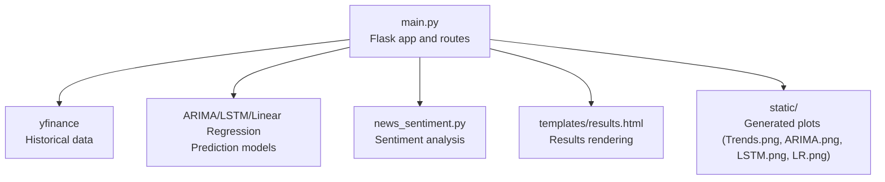
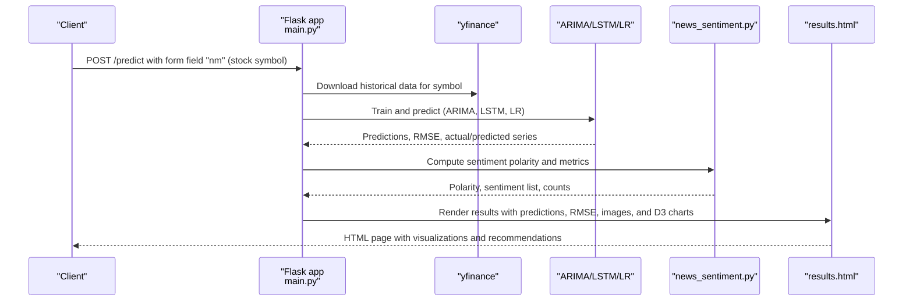
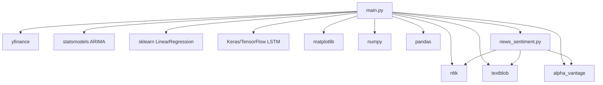

# Prediction API

<cite>
**Referenced Files in This Document**
- [main.py](file://main.py)
- [news_sentiment.py](file://news_sentiment.py)
- [templates/results.html](file://templates/results.html)
- [tests/test_web_routes.py](file://tests/test_web_routes.py)
- [README.md](file://README.md)
- [requirements.txt](file://requirements.txt)
</cite>

## Table of Contents
1. [Introduction](#introduction)
2. [Project Structure](#project-structure)
3. [Core Components](#core-components)
4. [Architecture Overview](#architecture-overview)
5. [Detailed Component Analysis](#detailed-component-analysis)
6. [Dependency Analysis](#dependency-analysis)
7. [Performance Considerations](#performance-considerations)
8. [Troubleshooting Guide](#troubleshooting-guide)
9. [Conclusion](#conclusion)
10. [Appendices](#appendices)

## Introduction
This document describes the stock prediction endpoint in the intelligent-stock-prediction application. It focuses on the /predict (POST) route, including request parameters, response behavior, prediction workflow, data processing, visualization outputs, and error handling. It also explains the integration with news_sentiment.py for sentiment analysis and yfinance for historical data retrieval, and provides client implementation guidelines for form submission and response interpretation.

## Project Structure
The prediction endpoint is implemented in the Flask application entry point and integrates with a sentiment analysis module and templates for rendering results.

**Diagram sources**
- [main.py](file://main.py#L545-L980)
- [news_sentiment.py](file://news_sentiment.py#L1-L800)
- [templates/results.html](file://templates/results.html#L1-L460)

**Section sources**
- [README.md](file://README.md#L140-L173)
- [requirements.txt](file://requirements.txt#L1-L19)

## Core Components
- Flask route handler for /predict (POST): extracts the stock symbol, retrieves historical data, runs ARIMA, LSTM, and Linear Regression models, performs sentiment analysis, and renders results.
- Prediction models: ARIMA, LSTM, and Linear Regression, each generating predictions and saving visualization images.
- Sentiment analysis: Uses news_sentiment.py to compute sentiment polarity and related metrics.
- Template rendering: results.html displays predictions, RMSE metrics, and interactive visualizations.

**Section sources**
- [main.py](file://main.py#L545-L980)
- [templates/results.html](file://templates/results.html#L140-L420)

## Architecture Overview
The prediction workflow is a server-side pipeline that orchestrates data retrieval, model inference, and visualization generation, then renders a results page.

**Diagram sources**
- [main.py](file://main.py#L545-L980)
- [news_sentiment.py](file://news_sentiment.py#L1-L800)
- [templates/results.html](file://templates/results.html#L140-L420)

## Detailed Component Analysis

### Endpoint Definition
- HTTP method: POST
- URL pattern: /predict
- Request parameter:
  - nm: stock symbol (string)
- Response behavior:
  - Renders the results page template with prediction data and visualizations.
  - Generates static images for trend and model accuracy comparisons.

**Section sources**
- [main.py](file://main.py#L545-L560)
- [templates/results.html](file://templates/results.html#L140-L220)

### Data Retrieval and Preprocessing
- Historical data retrieval:
  - Uses yfinance to fetch two years of daily adjusted data for the given symbol.
  - Handles multi-index columns and resets index to CSV-friendly format.
  - Falls back to Alpha Vantage if yfinance returns empty data.
- CSV storage:
  - Writes historical data to a CSV file named after the symbol.
- Data preprocessing:
  - Drops NA values.
  - Builds a DataFrame with a Code column and concatenates with the original data.
  - Splits data into training and test sets for evaluation.

**Section sources**
- [main.py](file://main.py#L550-L620)

### ARIMA Model
- Training and prediction:
  - Uses ARIMA with fixed order parameters.
  - Forecasts on a held-out test set and computes RMSE.
- Visualization:
  - Saves a trend plot and an ARIMA accuracy plot to static images.
- Outputs:
  - Returns tomorrow’s predicted close price, RMSE, and series for D3 visualization.

**Section sources**
- [main.py](file://main.py#L584-L642)

### LSTM Model
- Training and prediction:
  - Scales features using MinMaxScaler.
  - Constructs sequences with a fixed window length for time-series memory.
  - Builds an LSTM model with dropout regularization and trains for multiple epochs.
  - Predicts on test sequences and forecasts next values.
- Visualization:
  - Saves an LSTM accuracy plot to a static image.
- Outputs:
  - Returns tomorrow’s predicted close price, RMSE, and series for D3 visualization.

**Section sources**
- [main.py](file://main.py#L646-L779)

### Linear Regression Model
- Training and prediction:
  - Uses StandardScaler for normalization.
  - Predicts on a test split and computes RMSE.
- Visualization:
  - Saves a Linear Regression accuracy plot to a static image.
- Outputs:
  - Returns forecasted values for the next seven days, RMSE, and series for D3 visualization.

**Section sources**
- [main.py](file://main.py#L780-L846)

### Sentiment Analysis Integration
- The prediction pipeline calls a sentiment function to compute polarity and related metrics.
- The results include sentiment polarity, a list of recent news items, and counts for positive, negative, and neutral sentiments.
- The template renders sentiment-related UI elements and links to external finance resources.

**Section sources**
- [main.py](file://main.py#L939-L959)
- [news_sentiment.py](file://news_sentiment.py#L1-L800)
- [templates/results.html](file://templates/results.html#L290-L340)

### Visualization Outputs
- Generated static images:
  - Trends.png: Plot of historical price trends.
  - ARIMA.png: ARIMA model accuracy vs. actual.
  - LSTM.png: LSTM model accuracy vs. actual.
  - LR.png: Linear Regression model accuracy vs. actual.
- D3-based interactive charts:
  - ARIMA, LSTM, and Linear Regression charts accept actual and predicted series arrays for rendering.

**Section sources**
- [main.py](file://main.py#L611-L633)
- [main.py](file://main.py#L754-L761)
- [main.py](file://main.py#L823-L831)
- [templates/results.html](file://templates/results.html#L140-L220)
- [templates/results.html](file://templates/results.html#L460-L800)

### Recommendation Logic
- Based on model predictions and sentiment polarity, the system determines whether to recommend a rise or fall and a corresponding buy or sell action.
- The recommendation is rendered on the results page.

**Section sources**
- [main.py](file://main.py#L847-L905)
- [templates/results.html](file://templates/results.html#L390-L422)

### Error Handling
- Invalid symbol handling:
  - Attempts to fetch historical data; on failure, the route renders the index page with a flag indicating the symbol was not found.
- Graceful degradation:
  - The prediction route continues to render results even if some steps encounter issues, as indicated by tests that expect 200 or non-200 responses depending on mocks.
- Data retrieval failures:
  - The route attempts to use yfinance and falls back to Alpha Vantage when data is empty.

**Section sources**
- [main.py](file://main.py#L910-L920)
- [tests/test_web_routes.py](file://tests/test_web_routes.py#L163-L183)

### Client Implementation Guidelines
- Form submission:
  - Submit a POST request to /predict with a form field named nm containing the stock symbol.
- Response interpretation:
  - The server responds with an HTML page that includes:
    - Today’s OHLC and volume metrics.
    - Tomorrow’s predicted close prices for ARIMA, LSTM, and Linear Regression.
    - RMSE metrics for each model.
    - Trend plot and model accuracy plots.
    - Sentiment polarity and recent news items.
    - A recommendation (rise/fall) and a corresponding buy/sell suggestion.
  - Static images are served from the static folder and referenced in the template.
  - D3-based interactive charts are initialized client-side using the provided arrays of actual and predicted values.

**Section sources**
- [main.py](file://main.py#L910-L980)
- [templates/results.html](file://templates/results.html#L140-L420)

## Dependency Analysis
The prediction endpoint depends on several libraries and modules for data retrieval, modeling, and visualization.

**Diagram sources**
- [requirements.txt](file://requirements.txt#L1-L19)
- [main.py](file://main.py#L1-L40)
- [news_sentiment.py](file://news_sentiment.py#L1-L800)

**Section sources**
- [requirements.txt](file://requirements.txt#L1-L19)

## Performance Considerations
- Model training and inference:
  - LSTM training runs for multiple epochs; consider reducing epochs or enabling GPU acceleration for faster inference.
  - ARIMA and Linear Regression are computationally lighter but still depend on data size and preprocessing steps.
- Data retrieval:
  - yfinance and Alpha Vantage calls introduce latency; caching or batching requests can improve responsiveness.
- Visualization generation:
  - Matplotlib saves figures to disk; ensure sufficient disk space and consider asynchronous generation for large datasets.
- Sentiment analysis:
  - Multiple sources and fallbacks increase latency; configure appropriate timeouts and consider rate limiting.

[No sources needed since this section provides general guidance]

## Troubleshooting Guide
- Invalid stock symbol:
  - The route attempts to fetch historical data and falls back to Alpha Vantage if yfinance returns empty data. If both fail, the index page is rendered with a not-found indicator.
- Missing static images:
  - Ensure the static directory is writable and accessible by the Flask application.
- Empty or malformed CSV:
  - Verify that the CSV is generated and readable before model inference.
- Model errors:
  - ARIMA may fail on insufficient or highly volatile data; consider adjusting model parameters or skipping ARIMA for problematic symbols.
  - LSTM requires adequate data length; ensure the dataset contains sufficient samples for sequence construction.
- Sentiment analysis failures:
  - If all sources fail, the system returns neutral results; verify network connectivity and API keys if applicable.

**Section sources**
- [main.py](file://main.py#L550-L620)
- [main.py](file://main.py#L910-L920)
- [tests/test_web_routes.py](file://tests/test_web_routes.py#L163-L183)

## Conclusion
The /predict (POST) endpoint integrates historical data retrieval, multiple forecasting models, sentiment analysis, and visualization to deliver a comprehensive stock prediction experience. Clients should submit a form with the stock symbol and interpret the resulting HTML page, which includes numerical predictions, RMSE metrics, static plots, and interactive D3 charts. Proper error handling ensures resilience against invalid symbols and data retrieval failures.

[No sources needed since this section summarizes without analyzing specific files]

## Appendices

### API Definition Summary
- Endpoint: POST /predict
- Form field:
  - nm: stock symbol (string)
- Response:
  - HTML page rendering predictions, RMSE metrics, and visualizations.

**Section sources**
- [main.py](file://main.py#L545-L560)
- [templates/results.html](file://templates/results.html#L140-L220)

### Example Test Cases
- Valid symbol submission triggers prediction pipeline and renders results.
- Invalid symbol submission is handled gracefully by the route.

**Section sources**
- [tests/test_web_routes.py](file://tests/test_web_routes.py#L163-L183)