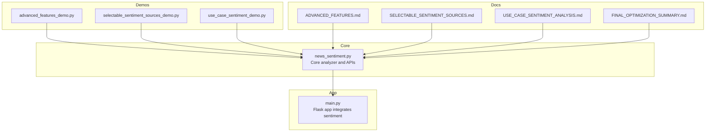
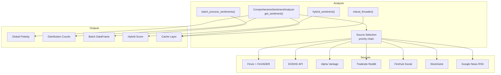
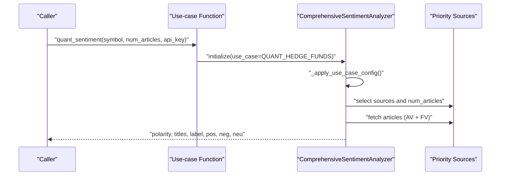
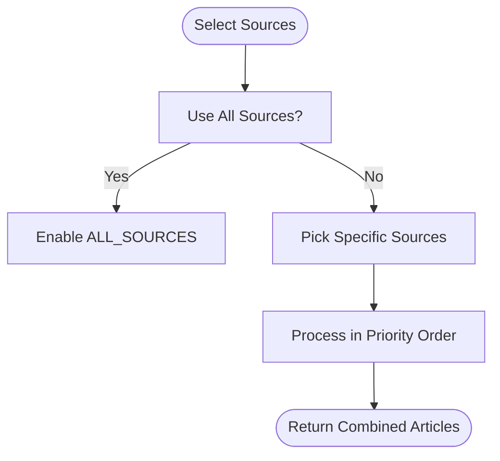
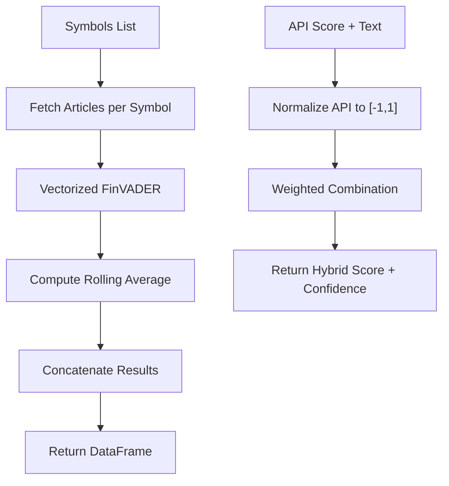
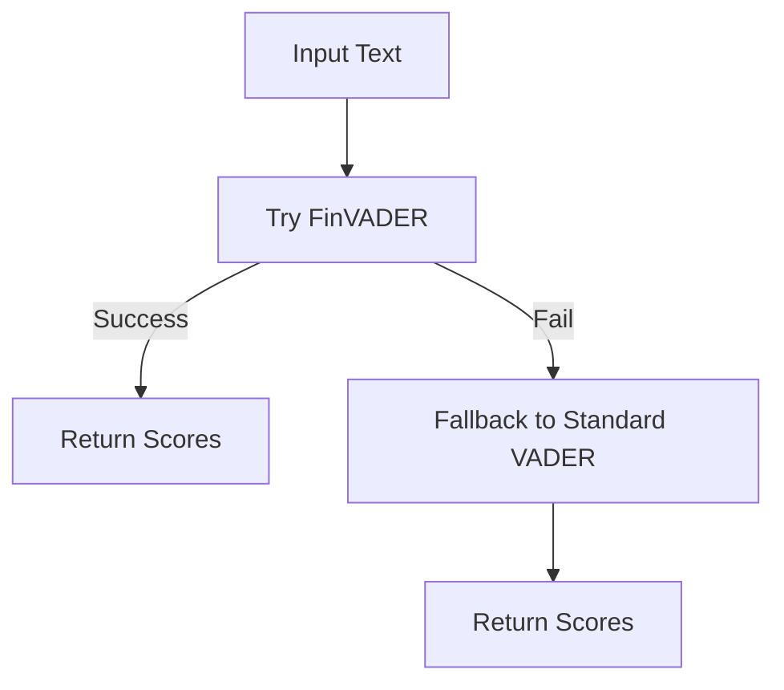
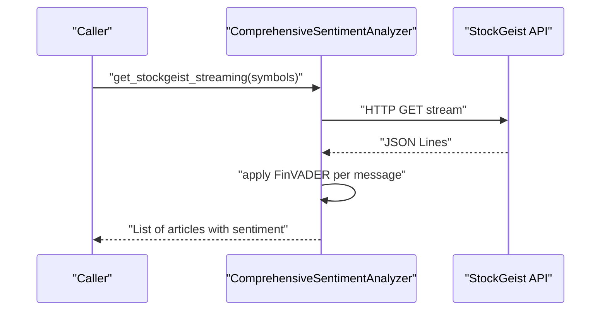
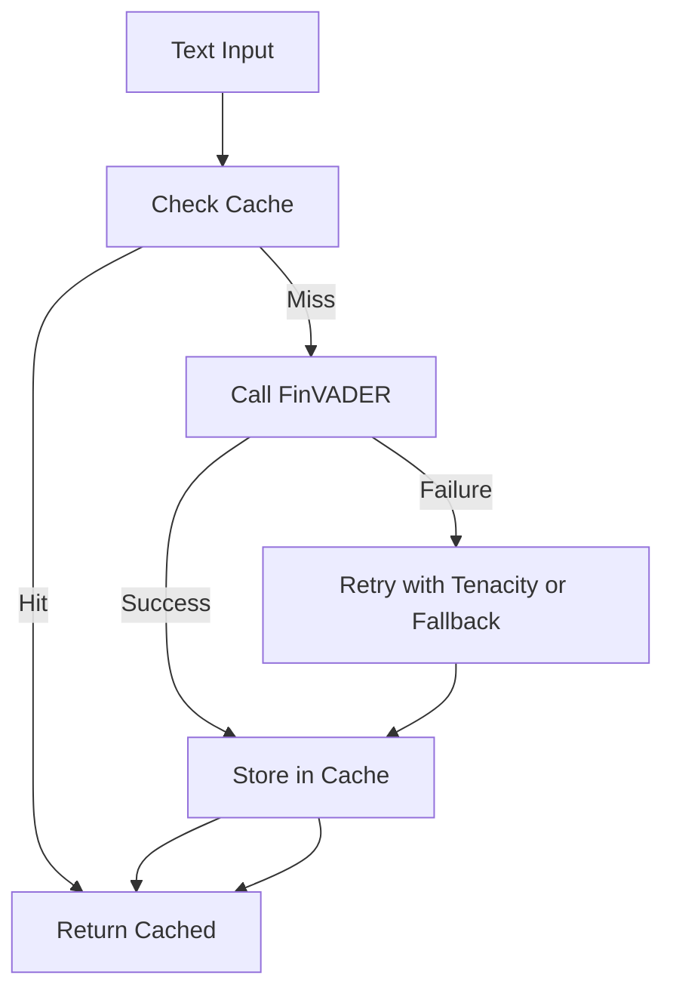
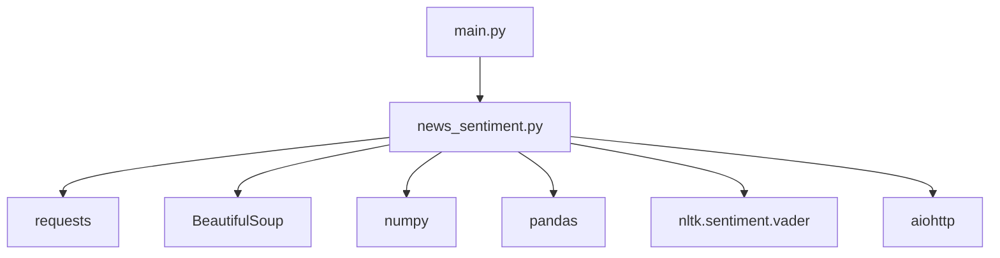

# Advanced Features

<cite>
**Referenced Files in This Document**
- [news_sentiment.py](file://news_sentiment.py)
- [demos/advanced_features_demo.py](file://demos/advanced_features_demo.py)
- [demos/selectable_sentiment_sources_demo.py](file://demos/selectable_sentiment_sources_demo.py)
- [demos/use_case_sentiment_demo.py](file://demos/use_case_sentiment_demo.py)
- [docs/ADVANCED_FEATURES.md](file://docs/ADVANCED_FEATURES.md)
- [docs/SELECTABLE_SENTIMENT_SOURCES.md](file://docs/SELECTABLE_SENTIMENT_SOURCES.md)
- [docs/USE_CASE_SENTIMENT_ANALYSIS.md](file://docs/USE_CASE_SENTIMENT_ANALYSIS.md)
- [docs/FINAL_OPTIMIZATION_SUMMARY.md](file://docs/FINAL_OPTIMIZATION_SUMMARY.md)
- [main.py](file://main.py)
</cite>

## Table of Contents
1. [Introduction](#introduction)
2. [Project Structure](#project-structure)
3. [Core Components](#core-components)
4. [Architecture Overview](#architecture-overview)
5. [Detailed Component Analysis](#detailed-component-analysis)
6. [Dependency Analysis](#dependency-analysis)
7. [Performance Considerations](#performance-considerations)
8. [Troubleshooting Guide](#troubleshooting-guide)
9. [Conclusion](#conclusion)
10. [Appendices](#appendices)

## Introduction
This document presents the advanced features of the intelligent-stock-prediction sentiment analysis system. It focuses on configuration-driven adaptation across use cases (HFT, retail, academic, quant, fintech), selectable sentiment sources, performance optimization patterns, and expert customization options. It synthesizes the repository’s official documentation and implementation to guide both practitioners and expert users toward production-grade deployment and extensibility.

## Project Structure
The advanced features are implemented primarily in the sentiment core module and demonstrated through dedicated demo scripts. The web application integrates sentiment analysis into its prediction pipeline.

**Diagram sources**
- [news_sentiment.py](file://news_sentiment.py#L1-L1334)
- [demos/advanced_features_demo.py](file://demos/advanced_features_demo.py#L1-L154)
- [demos/selectable_sentiment_sources_demo.py](file://demos/selectable_sentiment_sources_demo.py#L1-L136)
- [demos/use_case_sentiment_demo.py](file://demos/use_case_sentiment_demo.py#L1-L150)
- [docs/ADVANCED_FEATURES.md](file://docs/ADVANCED_FEATURES.md#L1-L298)
- [docs/SELECTABLE_SENTIMENT_SOURCES.md](file://docs/SELECTABLE_SENTIMENT_SOURCES.md#L1-L208)
- [docs/USE_CASE_SENTIMENT_ANALYSIS.md](file://docs/USE_CASE_SENTIMENT_ANALYSIS.md#L1-L165)
- [docs/FINAL_OPTIMIZATION_SUMMARY.md](file://docs/FINAL_OPTIMIZATION_SUMMARY.md#L1-L126)
- [main.py](file://main.py#L910-L960)

**Section sources**
- [news_sentiment.py](file://news_sentiment.py#L1-L1334)
- [demos/advanced_features_demo.py](file://demos/advanced_features_demo.py#L1-L154)
- [demos/selectable_sentiment_sources_demo.py](file://demos/selectable_sentiment_sources_demo.py#L1-L136)
- [demos/use_case_sentiment_demo.py](file://demos/use_case_sentiment_demo.py#L1-L150)
- [docs/ADVANCED_FEATURES.md](file://docs/ADVANCED_FEATURES.md#L1-L298)
- [docs/SELECTABLE_SENTIMENT_SOURCES.md](file://docs/SELECTABLE_SENTIMENT_SOURCES.md#L1-L208)
- [docs/USE_CASE_SENTIMENT_ANALYSIS.md](file://docs/USE_CASE_SENTIMENT_ANALYSIS.md#L1-L165)
- [docs/FINAL_OPTIMIZATION_SUMMARY.md](file://docs/FINAL_OPTIMIZATION_SUMMARY.md#L1-L126)
- [main.py](file://main.py#L910-L960)

## Core Components
- Sentiment analyzer with configurable source selection and use-case presets
- Batch processing engine for portfolio-level analysis
- Hybrid scoring combining API signals with FinVADER
- Custom lexicon extension hooks
- Robust FinVADER wrapper with retry and caching
- Asynchronous streaming for real-time feeds
- Production-grade error handling and monitoring

Key implementation anchors:
- Analyzer class and source selection logic
- Use-case presets and convenience functions
- Batch processing and hybrid scoring
- Robust FinVADER wrapper and logging

**Section sources**
- [news_sentiment.py](file://news_sentiment.py#L311-L1334)
- [docs/ADVANCED_FEATURES.md](file://docs/ADVANCED_FEATURES.md#L1-L298)

## Architecture Overview
The system orchestrates multiple sentiment sources with a prioritized fallback chain. Use-case presets automatically tune article counts and source sets. Batch processing vectorizes FinVADER application for throughput. Hybrid scoring merges API signals with FinVADER for improved accuracy. Optional caching and retries improve reliability.

**Diagram sources**
- [news_sentiment.py](file://news_sentiment.py#L311-L1334)
- [docs/SELECTABLE_SENTIMENT_SOURCES.md](file://docs/SELECTABLE_SENTIMENT_SOURCES.md#L1-L208)
- [docs/USE_CASE_SENTIMENT_ANALYSIS.md](file://docs/USE_CASE_SENTIMENT_ANALYSIS.md#L1-L165)
- [docs/ADVANCED_FEATURES.md](file://docs/ADVANCED_FEATURES.md#L1-L298)

## Detailed Component Analysis

### Use Case Configurations
The system provides preset configurations optimized for distinct operational contexts:
- High-Frequency Trading (HFT): Fastest sources, minimal article count, aggressive caching
- Retail Trading Apps: Cost-effective social sources, low memory footprint
- Quant Hedge Funds: Premium data sources, hybrid scoring, higher article count
- Academic Research: Historical depth, reproducibility, free sources
- Fintech Startups: Real-time streaming, freemium-friendly scaling

These presets are applied automatically when invoking use-case-specific functions.

**Diagram sources**
- [news_sentiment.py](file://news_sentiment.py#L346-L379)
- [news_sentiment.py](file://news_sentiment.py#L1244-L1283)
- [docs/USE_CASE_SENTIMENT_ANALYSIS.md](file://docs/USE_CASE_SENTIMENT_ANALYSIS.md#L1-L165)

**Section sources**
- [news_sentiment.py](file://news_sentiment.py#L346-L379)
- [news_sentiment.py](file://news_sentiment.py#L1244-L1283)
- [docs/USE_CASE_SENTIMENT_ANALYSIS.md](file://docs/USE_CASE_SENTIMENT_ANALYSIS.md#L1-L165)

### Selectable Sentiment Sources
Users can choose among multiple sources, including Finviz + FinVADER, EODHD API, Alpha Vantage, Tradestie Reddit, Finnhub Social, StockGeist, and Google News RSS. The system processes sources in priority order and gracefully skips unavailable API sources.

**Diagram sources**
- [news_sentiment.py](file://news_sentiment.py#L708-L740)
- [docs/SELECTABLE_SENTIMENT_SOURCES.md](file://docs/SELECTABLE_SENTIMENT_SOURCES.md#L1-L208)

**Section sources**
- [news_sentiment.py](file://news_sentiment.py#L708-L740)
- [docs/SELECTABLE_SENTIMENT_SOURCES.md](file://docs/SELECTABLE_SENTIMENT_SOURCES.md#L1-L208)

### Batch Processing and Hybrid Scoring
Batch processing aggregates sentiment across multiple symbols and computes rolling averages for trend analysis. Hybrid scoring combines FinVADER with normalized API signals to improve accuracy.

**Diagram sources**
- [news_sentiment.py](file://news_sentiment.py#L959-L1001)
- [news_sentiment.py](file://news_sentiment.py#L1003-L1027)
- [docs/ADVANCED_FEATURES.md](file://docs/ADVANCED_FEATURES.md#L1-L298)

**Section sources**
- [news_sentiment.py](file://news_sentiment.py#L959-L1001)
- [news_sentiment.py](file://news_sentiment.py#L1003-L1027)
- [docs/ADVANCED_FEATURES.md](file://docs/ADVANCED_FEATURES.md#L1-L298)

### Custom Lexicon Extension
The analyzer provides hooks to extend FinVADER with domain-specific lexicons. While the current implementation falls back to standard VADER when FinVADER is unavailable, the architecture supports future extensions for dynamic lexicon merging.

**Diagram sources**
- [news_sentiment.py](file://news_sentiment.py#L1029-L1045)
- [news_sentiment.py](file://news_sentiment.py#L828-L859)

**Section sources**
- [news_sentiment.py](file://news_sentiment.py#L1029-L1045)
- [news_sentiment.py](file://news_sentiment.py#L828-L859)

### Asynchronous Streaming and Real-Time Feeds
Asynchronous processing enables real-time streaming from StockGeist. The analyzer exposes an async method to consume SSE-like streams and apply FinVADER to incoming messages.

**Diagram sources**
- [news_sentiment.py](file://news_sentiment.py#L667-L706)

**Section sources**
- [news_sentiment.py](file://news_sentiment.py#L667-L706)

### Production-Grade Robustness and Monitoring
The analyzer includes a robust FinVADER wrapper with retry logic and caching, plus sentiment distribution logging for monitoring.

**Diagram sources**
- [news_sentiment.py](file://news_sentiment.py#L1049-L1119)
- [news_sentiment.py](file://news_sentiment.py#L1121-L1163)

**Section sources**
- [news_sentiment.py](file://news_sentiment.py#L1049-L1119)
- [news_sentiment.py](file://news_sentiment.py#L1121-L1163)

## Dependency Analysis
The analyzer depends on external libraries for HTTP, parsing, and sentiment analysis. It integrates multiple APIs and RSS feeds, with a clear fallback chain. The web app integrates sentiment into its prediction workflow.

**Diagram sources**
- [news_sentiment.py](file://news_sentiment.py#L1-L1334)
- [main.py](file://main.py#L910-L960)

**Section sources**
- [news_sentiment.py](file://news_sentiment.py#L1-L1334)
- [main.py](file://main.py#L910-L960)

## Performance Considerations
- Vectorized operations: Batch processing applies FinVADER across article texts efficiently.
- Priority-based fetching: Fast sources are preferred, reducing latency.
- Optional caching: Redis caching is available in the analyzer’s cache layer.
- Async streaming: Real-time feeds minimize latency for streaming providers.
- Logging and monitoring: Distribution logs help detect anomalies and tune thresholds.

Practical guidance anchored in repository documentation:
- Batch processing throughput and vectorization benefits
- Redis caching potential for high request rates
- Simplified architecture and reduced latency from removing heavy scraping

**Section sources**
- [docs/ADVANCED_FEATURES.md](file://docs/ADVANCED_FEATURES.md#L1-L298)
- [docs/FINAL_OPTIMIZATION_SUMMARY.md](file://docs/FINAL_OPTIMIZATION_SUMMARY.md#L1-L126)

## Troubleshooting Guide
Common issues and remedies:
- API key missing: The analyzer gracefully skips unavailable API sources and continues with available ones.
- FinVADER availability: If FinVADER is unavailable, the analyzer falls back to standard VADER.
- Selenium-related components: Some legacy scraping logic remains for compatibility but is not used in the optimized flow.
- Logging: Enable debug mode via environment variable to inspect per-article sentiment during development.

Operational tips:
- Use use-case functions to quickly align configuration with requirements.
- Prefer FinVADER + Finviz for speed-sensitive tasks.
- For production, enable caching and retries where applicable.

**Section sources**
- [news_sentiment.py](file://news_sentiment.py#L311-L1334)
- [docs/SELECTABLE_SENTIMENT_SOURCES.md](file://docs/SELECTABLE_SENTIMENT_SOURCES.md#L1-L208)
- [docs/USE_CASE_SENTIMENT_ANALYSIS.md](file://docs/USE_CASE_SENTIMENT_ANALYSIS.md#L1-L165)

## Conclusion
The intelligent-stock-prediction system offers a production-ready foundation for sentiment-driven analysis. Its configuration-driven presets, selectable sources, batch processing, hybrid scoring, and robust wrappers enable deployment across diverse use cases—from HFT to academic research—while maintaining performance and reliability.

## Appendices

### Use Case Quick Reference
- HFT: Fastest sources, minimal article count, caching
- Retail: Social sources, low memory footprint
- Quant: Premium data + hybrid scoring
- Academic: Historical depth, reproducibility
- Fintech: Real-time streaming, freemium scaling

**Section sources**
- [docs/USE_CASE_SENTIMENT_ANALYSIS.md](file://docs/USE_CASE_SENTIMENT_ANALYSIS.md#L1-L165)
- [news_sentiment.py](file://news_sentiment.py#L1244-L1283)

### Implementation Patterns Demonstrated
- Batch processing and hybrid scoring
- Selectable sources and API key handling
- Use-case-specific presets
- Asynchronous streaming and robust FinVADER wrapper

**Section sources**
- [demos/advanced_features_demo.py](file://demos/advanced_features_demo.py#L1-L154)
- [demos/selectable_sentiment_sources_demo.py](file://demos/selectable_sentiment_sources_demo.py#L1-L136)
- [demos/use_case_sentiment_demo.py](file://demos/use_case_sentiment_demo.py#L1-L150)
- [news_sentiment.py](file://news_sentiment.py#L1286-L1334)

### Enterprise-Grade Deployment Notes
- Use use-case presets to align infrastructure and SLAs.
- Integrate caching and retries for resilience.
- Monitor sentiment distributions for drift and anomalies.
- Keep the analyzer’s fallback chain simple and well-documented.

**Section sources**
- [docs/USE_CASE_SENTIMENT_ANALYSIS.md](file://docs/USE_CASE_SENTIMENT_ANALYSIS.md#L1-L165)
- [docs/ADVANCED_FEATURES.md](file://docs/ADVANCED_FEATURES.md#L1-L298)
- [docs/FINAL_OPTIMIZATION_SUMMARY.md](file://docs/FINAL_OPTIMIZATION_SUMMARY.md#L1-L126)