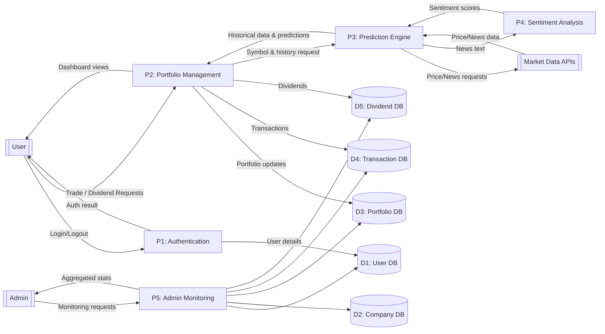
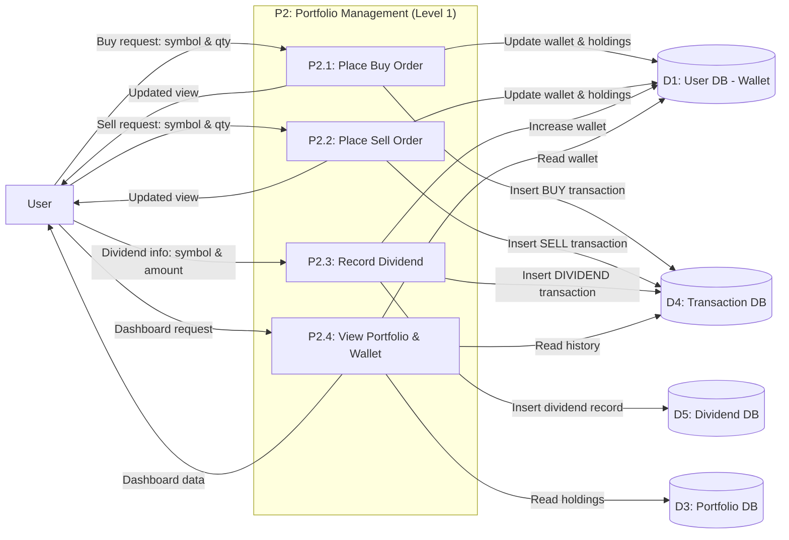
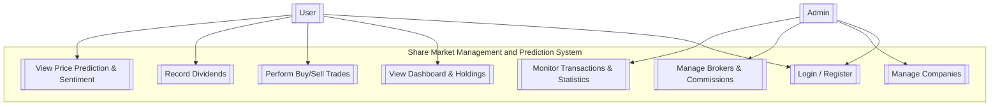

# Architecture & Design

<cite>
**Referenced Files in This Document**   
- [main.py](file://main.py)
- [news_sentiment.py](file://news_sentiment.py)
- [templates/index.html](file://templates/index.html)
- [templates/dashboard.html](file://templates/dashboard.html)
- [docs/diagrams/dfd_level0.md](file://docs/diagrams/dfd_level0.md)
- [docs/diagrams/dfd_portfolio_level1.md](file://docs/diagrams/dfd_portfolio_level1.md)
- [docs/diagrams/usecase_diagram.md](file://docs/diagrams/usecase_diagram.md)
- [docs/diagrams/er_diagram.md](file://docs/diagrams/er_diagram.md)
- [docs/API_KEYS_GUIDE.md](file://docs/API_KEYS_GUIDE.md)
- [docs/SELECTABLE_SENTIMENT_SOURCES.md](file://docs/SELECTABLE_SENTIMENT_SOURCES.md)
- [docs/USE_CASE_SENTIMENT_ANALYSIS.md](file://docs/USE_CASE_SENTIMENT_ANALYSIS.md)
- [requirements.txt](file://requirements.txt)
- [README.md](file://README.md)
</cite>

## Table of Contents
1. [Introduction](#introduction)
2. [Three-Tier Architecture](#three-tier-architecture)
3. [MVC Pattern Implementation](#mvc-pattern-implementation)
4. [Key Architectural Patterns](#key-architectural-patterns)
5. [System Boundaries and Component Interactions](#system-boundaries-and-component-interactions)
6. [Data Flow Diagrams](#data-flow-diagrams)
7. [Design Trade-offs](#design-trade-offs)
8. [Infrastructure Requirements](#infrastructure-requirements)
9. [Deployment Topology Options](#deployment-topology-options)
10. [Scalability Considerations](#scalability-considerations)
11. [Cross-Cutting Concerns](#cross-cutting-concerns)
12. [Use Case Diagrams](#use-case-diagrams)
13. [Conclusion](#conclusion)

## Introduction
The intelligent-stock-prediction system is a full-stack web application that combines machine learning-based stock price prediction with sentiment analysis of financial news and integrated portfolio management. This system provides a simulated trading environment where users can experiment with stock predictions and portfolio strategies in a risk-free setting. The application follows a three-tier architecture with presentation, application, and data layers, implementing the MVC pattern through Flask routes (controllers), Jinja2 templates (views), and SQLAlchemy models (models). The system integrates multiple sentiment analysis sources with fallback mechanisms and use case-based configurations to provide robust market sentiment analysis.

## Three-Tier Architecture
The intelligent-stock-prediction system follows a three-tier architecture that separates concerns into distinct layers:

**Presentation Layer**: This layer consists of responsive web interfaces built with HTML, CSS, Bootstrap, and JavaScript. The templates in the `templates/` directory render dynamic content using Jinja2 templating engine. The user interface provides interactive dashboards for portfolio management, stock prediction, and administrative monitoring. Key templates include `index.html` for the prediction interface, `dashboard.html` for portfolio management, and `admin_dashboard.html` for administrative functions.

**Application Layer**: This layer is implemented in Python using the Flask web framework and contains the core business logic, prediction models, and data processing components. The `main.py` file serves as the entry point, defining Flask routes that handle HTTP requests and coordinate between the presentation and data layers. This layer includes machine learning models for stock prediction (LSTM, ARIMA, Linear Regression) and sentiment analysis components that aggregate financial news sentiment from multiple sources.

**Data Layer**: This layer uses SQLite as the database management system, with data operations managed through SQLAlchemy ORM. The system implements a relational database schema with entities for User, Company, Broker, PortfolioItem, Transaction, and Dividend. The data layer provides persistence for user accounts, portfolio holdings, transaction history, and company information, enabling the simulation of trading activities and portfolio management.

**Section sources**
- [main.py](file://main.py#L41-L48)
- [README.md](file://README.md#L75-L79)
- [requirements.txt](file://requirements.txt#L8-L19)

## MVC Pattern Implementation
The intelligent-stock-prediction system implements the Model-View-Controller (MVC) pattern through Flask routes, Jinja2 templates, and SQLAlchemy models.

**Models**: The SQLAlchemy models in `main.py` define the data structure and business rules. The system includes several models that represent the domain entities:
- **User**: Handles authentication and profile information with password hashing and role-based access control
- **Company**: Stores stock information and metadata such as symbol, name, exchange, and sector
- **Broker**: Manages commission configuration with commission rates and active status
- **PortfolioItem**: Tracks user holdings with quantity and average buy price
- **Transaction**: Records buy/sell transactions with commission tracking
- **Dividend**: Manages dividend payout records

These models use SQLAlchemy ORM to map Python classes to database tables, providing an object-oriented interface to the underlying SQLite database.

**Views**: The Jinja2 templates in the `templates/` directory serve as the views in the MVC pattern. These templates define the presentation layer and are responsible for rendering dynamic content. The templates use Jinja2 syntax to embed Python expressions and control structures, allowing for dynamic content generation based on data passed from controllers. Key templates include `index.html` for the prediction interface, `dashboard.html` for portfolio management, and `admin_dashboard.html` for administrative functions.

**Controllers**: The Flask routes in `main.py` act as controllers, handling HTTP requests and coordinating between models and views. Each route function processes incoming requests, interacts with the appropriate models to retrieve or modify data, and returns rendered templates with the necessary context. The controllers implement various business functions such as user authentication, portfolio management, trading operations, and prediction processing.

**Section sources**
- [main.py](file://main.py#L51-L118)
- [templates/index.html](file://templates/index.html)
- [templates/dashboard.html](file://templates/dashboard.html)

## Key Architectural Patterns
The intelligent-stock-prediction system implements several key architectural patterns to enhance flexibility, reliability, and maintainability.

**Dependency Injection for API Keys**: The system uses dependency injection to manage API keys for various sentiment analysis services. Instead of hardcoding API keys, they are passed as parameters to functions or configured through environment variables. This approach allows for flexible configuration and secure handling of sensitive credentials. The `ComprehensiveSentimentAnalyzer` class in `news_sentiment.py` accepts API keys as constructor parameters, enabling different configurations for different deployment environments.

**Fallback Mechanisms in Sentiment Analysis**: The sentiment analysis system implements a robust fallback mechanism that ensures availability even when primary sources fail. The system follows a priority order when retrieving sentiment data:
1. Finviz + FinVADER (primary source, no API key required)
2. EODHD API (API fallback)
3. Alpha Vantage News & Sentiments API
4. Tradestie WallStreetBets API
5. Finnhub Social Sentiment API
6. StockGeist.ai
7. Google News RSS (last resort)

If a source is unavailable or returns an error, the system automatically falls back to the next available source in the priority list. This ensures that sentiment analysis can proceed even when some external services are down.

**Use Case-Based Configurations**: The system provides pre-configured settings for different use cases through the `UseCase` enum in `news_sentiment.py`. Each use case automatically configures the sentiment analyzer with optimal settings for that specific scenario:
- **High-Frequency Trading**: Optimized for speed with minimal article count and aggressive caching
- **Retail Trading Apps**: Cost-effective configuration using free tier services
- **Quant Hedge Funds**: Premium configuration with higher article count and hybrid scoring
- **Academic Research**: Configuration focused on historical data and reproducible results
- **Fintech Startups**: Configuration optimized for real-time streaming and easy scaling

These configurations allow users to select the most appropriate settings for their specific needs without requiring deep technical knowledge of the underlying system.

**Section sources**
- [news_sentiment.py](file://news_sentiment.py#L78-L95)
- [docs/API_KEYS_GUIDE.md](file://docs/API_KEYS_GUIDE.md)
- [docs/SELECTABLE_SENTIMENT_SOURCES.md](file://docs/SELECTABLE_SENTIMENT_SOURCES.md)
- [docs/USE_CASE_SENTIMENT_ANALYSIS.md](file://docs/USE_CASE_SENTIMENT_ANALYSIS.md)

## System Boundaries and Component Interactions
The intelligent-stock-prediction system defines clear boundaries between internal components and external systems, with well-defined interaction patterns.

**External Interfaces**: The system interacts with several external systems and services:
- **Market Data APIs**: The system retrieves stock market data from external APIs such as Alpha Vantage and Yahoo Finance. These APIs provide historical price data used for prediction models.
- **Sentiment Analysis APIs**: The system integrates with multiple sentiment analysis services including EODHD API, Alpha Vantage News & Sentiments API, Finnhub Social Sentiment API, and StockGeist.ai. These services provide pre-calculated sentiment scores or raw news data for analysis.
- **User Interface**: The system presents a web-based interface to users through standard HTTP/HTTPS protocols. Users interact with the system through web browsers, submitting forms and receiving dynamic content.

**Internal Component Interactions**: The system's internal components interact through well-defined interfaces:
- **Prediction Engine**: When a user requests a stock prediction, the controller in `main.py` coordinates with the prediction models (ARIMA, LSTM, Linear Regression) and the sentiment analysis module to generate forecasts.
- **Portfolio Management**: The portfolio management functions in `main.py` interact with the database models to update user holdings, process trades, and record transactions.
- **Authentication System**: The authentication functions handle user registration, login, and session management, interacting with the User model to verify credentials and maintain session state.

**Data Flow**: Data flows through the system in a structured manner:
1. User input is received through HTTP requests to Flask routes
2. Controllers process the input and interact with appropriate models
3. Models retrieve or modify data in the database
4. Results are passed back to controllers
5. Controllers render templates with the results
6. Templates generate HTML responses sent back to the user

This clear separation of concerns ensures that each component has a well-defined responsibility and interacts with others through standardized interfaces.

**Section sources**
- [main.py](file://main.py#L545-L780)
- [news_sentiment.py](file://news_sentiment.py#L737-L800)
- [README.md](file://README.md#L98-L102)

## Data Flow Diagrams
The system is visualized using Data Flow Diagrams (DFD) at different levels of abstraction to illustrate the flow of data through the system.

**Diagram sources**
- [docs/diagrams/dfd_level0.md](file://docs/diagrams/dfd_level0.md)

The Level 0 DFD shows the system as a whole, with external entities (User, Admin, Market Data APIs) interacting with major processes (Authentication, Portfolio Management, Prediction Engine, Sentiment Analysis, and Admin Monitoring). Data stores represent the database entities that persist information across sessions.

**Diagram sources**
- [docs/diagrams/dfd_portfolio_level1.md](file://docs/diagrams/dfd_portfolio_level1.md)

The Level 1 DFD for Portfolio Management decomposes the P2 process into four subprocesses: Place Buy Order, Place Sell Order, Record Dividend, and View Portfolio & Wallet. This diagram shows the detailed flow of data between the user, the portfolio management functions, and the various data stores.

## Design Trade-offs
The intelligent-stock-prediction system incorporates several design trade-offs that balance simplicity, performance, and functionality.

**SQLite for Simplicity vs. Scalability Limitations**: The system uses SQLite as its database management system, which offers significant advantages in terms of simplicity and ease of deployment. SQLite requires no separate server process and stores the entire database in a single file, making it ideal for development and small-scale applications. This choice eliminates the need for complex database administration and reduces the overall system complexity.

However, this design choice comes with scalability limitations. SQLite is not designed for high-concurrency scenarios and may become a bottleneck as the number of users and transactions increases. The database file can become locked during write operations, potentially causing delays for other users. Additionally, SQLite lacks some advanced features found in client-server databases like PostgreSQL or MySQL, such as sophisticated replication and clustering capabilities.

Despite these limitations, SQLite is appropriate for this application because:
- The system is designed as a simulated trading environment rather than a production trading platform
- User concurrency requirements are expected to be moderate
- The focus is on providing a functional demonstration of stock prediction and portfolio management concepts
- The single-file database simplifies distribution and deployment

**Section sources**
- [main.py](file://main.py#L44)
- [README.md](file://README.md#L54)

## Infrastructure Requirements
The intelligent-stock-prediction system has specific infrastructure requirements to support its functionality and performance characteristics.

**Hardware Requirements**: 
- **CPU**: Minimum 2-core processor, recommended 4-core or higher for optimal performance of machine learning models
- **Memory**: Minimum 4GB RAM, recommended 8GB or higher to handle data processing and model training
- **Storage**: Minimum 10GB available disk space for the application, database, and temporary files
- **Network**: Stable internet connection for retrieving market data and sentiment analysis from external APIs

**Software Requirements**:
- **Operating System**: Cross-platform compatibility with Windows, macOS, and Linux
- **Python**: Version 3.7 or higher
- **Dependencies**: The system requires several Python packages as specified in `requirements.txt`, including TensorFlow/Keras for deep learning, NLTK for natural language processing, and Flask for web framework functionality
- **Database**: SQLite 3.7.16 or higher

**Performance Requirements**:
- **Response Time**: User interface interactions should respond within 2 seconds under normal load
- **Prediction Processing**: Stock prediction calculations should complete within 10-15 seconds for typical market conditions
- **Concurrent Users**: The system should support up to 100 concurrent users with acceptable performance

**Security Requirements**:
- **Data Encryption**: Sensitive data such as passwords should be stored using secure hashing algorithms
- **Session Management**: User sessions should be securely managed with appropriate expiration and invalidation mechanisms
- **Input Validation**: All user inputs should be validated to prevent injection attacks and other security vulnerabilities

**Section sources**
- [requirements.txt](file://requirements.txt)
- [README.md](file://README.md#L106-L110)

## Deployment Topology Options
The intelligent-stock-prediction system can be deployed in several different topologies depending on the requirements and scale of the deployment.

**Development/Local Deployment**: For development and testing purposes, the system can be deployed locally on a single machine. This topology uses the built-in Flask development server and stores the database in a local file. This setup is ideal for development and debugging but is not recommended for production use due to performance and security limitations.

**Production Web Server Deployment**: For production environments, the system can be deployed on a dedicated web server using a production-grade WSGI server such as Gunicorn. This topology provides better performance, reliability, and security compared to the development server. The database can be stored on the same server or on a separate storage system for improved performance.

**Containerized Deployment**: The system can be containerized using Docker, allowing for consistent deployment across different environments. This approach packages the application and its dependencies into a container, ensuring that it runs the same way regardless of the host system. Containerization also facilitates scaling and orchestration using tools like Docker Compose or Kubernetes.

**Cloud Deployment**: The system can be deployed on cloud platforms such as AWS, Google Cloud, or Azure. This topology offers several advantages:
- **Scalability**: Cloud platforms can automatically scale resources based on demand
- **High Availability**: Cloud infrastructure typically provides redundancy and failover capabilities
- **Managed Services**: Cloud providers offer managed database services that can replace the local SQLite database for improved performance and reliability
- **Global Access**: Cloud deployment allows users to access the system from anywhere with an internet connection

Each deployment topology has its own trade-offs in terms of complexity, cost, and performance, allowing organizations to choose the most appropriate option for their needs.

**Section sources**
- [README.md](file://README.md#L125)
- [requirements.txt](file://requirements.txt#L15)

## Scalability Considerations
The intelligent-stock-prediction system has several scalability considerations that impact its ability to handle increased load and user demand.

**Current Scalability Limitations**:
- **SQLite Database**: The use of SQLite limits the system's ability to handle high-concurrency scenarios. SQLite is not designed for multi-user environments with heavy write loads, which could become a bottleneck as the number of users increases.
- **Monolithic Architecture**: The system is implemented as a monolithic application, which makes it difficult to scale individual components independently. All functionality is bundled together, requiring the entire application to be scaled as a unit.
- **Synchronous Processing**: Many operations, particularly the stock prediction calculations, are performed synchronously, which can lead to request timeouts or degraded performance under heavy load.

**Scalability Enhancement Options**:
- **Database Migration**: For larger deployments, the system could be modified to use a client-server database like PostgreSQL or MySQL, which are better suited for high-concurrency scenarios and offer advanced features like replication and clustering.
- **Microservices Architecture**: The system could be refactored into microservices, separating concerns such as user management, portfolio management, prediction engine, and sentiment analysis into independent services. This would allow each component to be scaled independently based on its specific resource requirements.
- **Asynchronous Processing**: Long-running operations like stock prediction could be moved to background task queues using tools like Celery, allowing the web interface to respond quickly while calculations are performed in the background.
- **Caching**: Implementing caching mechanisms for frequently accessed data, such as stock prices and sentiment analysis results, could significantly reduce database load and improve response times.
- **Load Balancing**: For high-traffic scenarios, multiple instances of the application could be deployed behind a load balancer to distribute incoming requests and improve overall system capacity.

These scalability considerations highlight the trade-offs between simplicity and performance, with the current design prioritizing ease of deployment and development over horizontal scalability.

**Section sources**
- [main.py](file://main.py#L44)
- [README.md](file://README.md#L54)

## Cross-Cutting Concerns
The intelligent-stock-prediction system addresses several cross-cutting concerns that affect multiple components and aspects of the application.

**Security**:
- **Authentication**: The system implements user authentication with registration, login, and session management. Passwords are securely hashed using `werkzeug.security.generate_password_hash` before storage.
- **Authorization**: The system uses role-based access control with different permissions for regular users and administrators. The `@login_required` decorator ensures that only authenticated users can access protected routes, and the `role` parameter allows for role-specific access control.
- **CSRF Protection**: The system implements CSRF (Cross-Site Request Forgery) protection through the `generate_csrf_token` and `verify_csrf` functions. A CSRF token is generated for each session and included in forms, preventing unauthorized form submissions from external sites.
- **Input Validation**: The system validates user inputs to prevent injection attacks and ensure data integrity. For example, the `trade_buy` and `trade_sell` routes validate quantity inputs to ensure they are positive integers.

**Monitoring**:
- **Error Handling Dashboard**: The admin dashboard provides system monitoring capabilities, displaying statistics such as user count, active users, broker count, transaction count, and company count. This allows administrators to monitor system health and usage patterns.
- **Logging**: The sentiment analysis module includes logging functionality to track API calls and errors, facilitating troubleshooting and performance monitoring.
- **Transaction Monitoring**: The system maintains a complete record of all transactions, allowing for auditing and analysis of trading activities.

**Disaster Recovery**:
- **Data Persistence**: The system uses SQLite for data persistence, ensuring that user data, portfolio holdings, and transaction history are preserved across application restarts.
- **Database Schema**: The database schema is designed with appropriate constraints and relationships to maintain data integrity. Foreign key constraints ensure referential integrity between related entities.
- **Backup Strategy**: While not explicitly implemented in the code, the single-file nature of SQLite databases facilitates backup and recovery. The database file can be easily copied to create backups, and restored in case of data loss.

These cross-cutting concerns are integrated throughout the system to ensure security, reliability, and maintainability.

**Section sources**
- [main.py](file://main.py#L121-L136)
- [main.py](file://main.py#L436-L489)
- [news_sentiment.py](file://news_sentiment.py#L36-L38)

## Use Case Diagrams
The system's functionality is illustrated through use case diagrams that show the interactions between actors and system functions.

**Diagram sources**
- [docs/diagrams/usecase_diagram.md](file://docs/diagrams/usecase_diagram.md)

The use case diagram illustrates the primary interactions between users and the system. Regular users can perform core trading functions such as logging in, viewing their dashboard, executing trades, recording dividends, and viewing price predictions. Administrators have additional capabilities for managing companies, brokers, and monitoring system-wide transactions and statistics.

The diagram shows two main actors: User and Admin. The User actor represents regular users of the system who manage their portfolios and make trading decisions. The Admin actor represents system administrators who have elevated privileges for managing system configuration and monitoring overall performance.

Each use case represents a specific functionality provided by the system:
- **Login / Register**: Handles user authentication and account creation
- **View Dashboard & Holdings**: Displays the user's portfolio, wallet balance, and recent transactions
- **Perform Buy/Sell Trades**: Allows users to execute simulated buy and sell orders
- **Record Dividends**: Enables users to record dividend payments and update their wallet balance
- **View Price Prediction & Sentiment**: Provides stock price forecasts using machine learning models and sentiment analysis
- **Manage Companies**: Allows administrators to add, edit, and manage company information
- **Manage Brokers & Commissions**: Enables administrators to configure broker information and commission rates
- **Monitor Transactions & Statistics**: Provides administrators with system-wide monitoring and reporting capabilities

This use case diagram provides a high-level overview of the system's functionality and helps to clarify the roles and responsibilities of different user types.

## Conclusion
The intelligent-stock-prediction system implements a comprehensive three-tier architecture with clear separation of concerns between presentation, application, and data layers. The system effectively utilizes the MVC pattern through Flask routes as controllers, Jinja2 templates as views, and SQLAlchemy models as models, providing a structured approach to web application development.

Key architectural patterns such as dependency injection for API keys, fallback mechanisms in sentiment analysis, and use case-based configurations enhance the system's flexibility, reliability, and maintainability. The system boundaries and component interactions are well-defined, with clear data flows between external entities, internal processes, and data stores.

While the use of SQLite provides simplicity and ease of deployment, it introduces scalability limitations that should be considered for larger deployments. The system addresses important cross-cutting concerns including security, monitoring, and disaster recovery, ensuring a robust and reliable application.

The deployment topology options range from simple local deployment to more complex cloud-based solutions, allowing organizations to choose the most appropriate option based on their requirements. Scalability considerations highlight potential enhancement options such as database migration, microservices architecture, and asynchronous processing for high-demand scenarios.

Overall, the intelligent-stock-prediction system provides a solid foundation for stock analysis and market sentiment prediction, with well-structured architecture and thoughtful design decisions that balance functionality, performance, and maintainability.