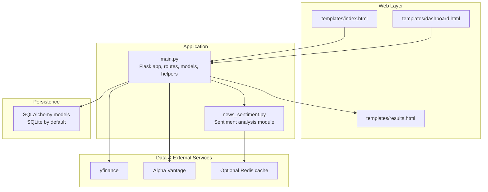
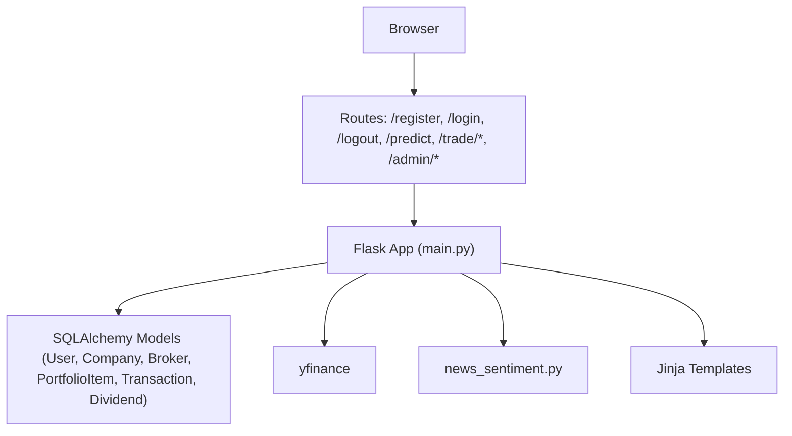
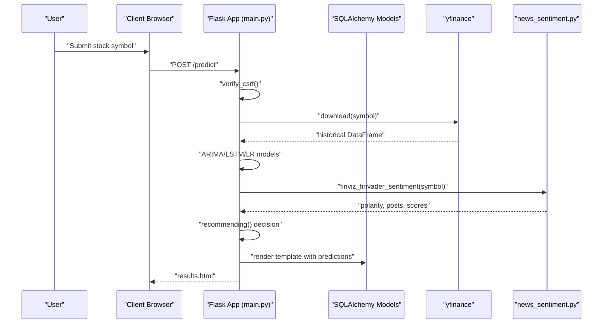
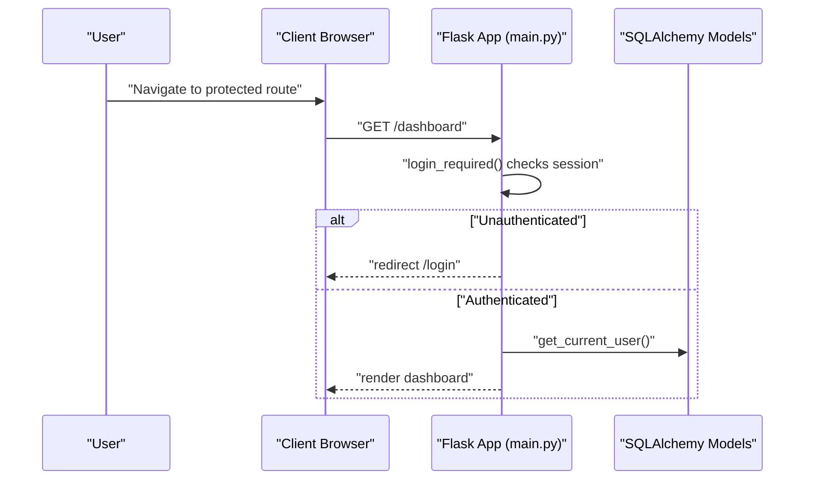
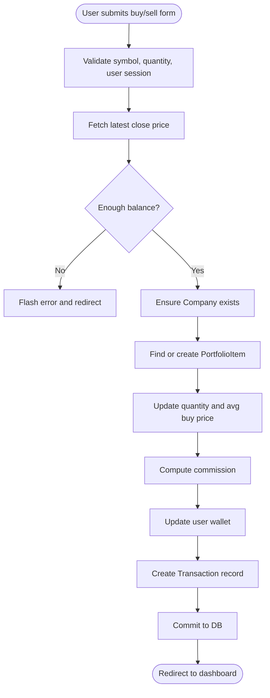
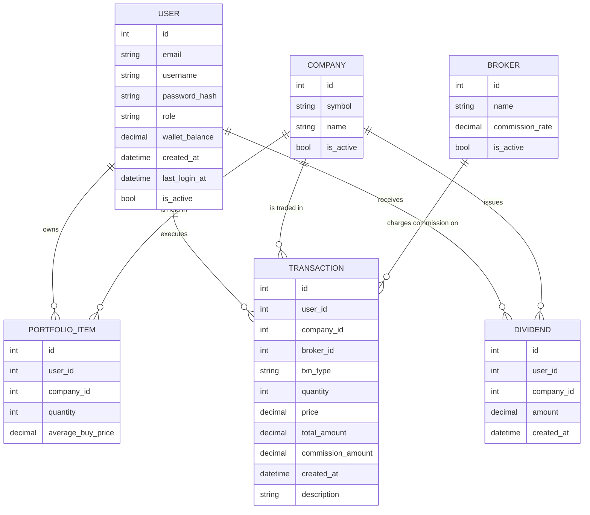
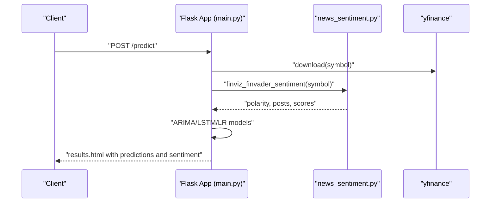
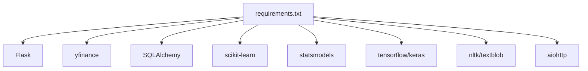

# Component Interactions

<cite>
**Referenced Files in This Document**
- [main.py](file://main.py)
- [news_sentiment.py](file://news_sentiment.py)
- [requirements.txt](file://requirements.txt)
- [templates/index.html](file://templates/index.html)
- [templates/results.html](file://templates/results.html)
- [templates/dashboard.html](file://templates/dashboard.html)
- [tests/test_web_routes.py](file://tests/test_web_routes.py)
- [tests/test_prediction_pipeline.py](file://tests/test_prediction_pipeline.py)
- [tests/test_authentication.py](file://tests/test_authentication.py)
- [docs/diagrams/er_diagram.md](file://docs/diagrams/er_diagram.md)
- [docs/diagrams/dfd_portfolio_level1.md](file://docs/diagrams/dfd_portfolio_level1.md)
</cite>

## Table of Contents
1. [Introduction](#introduction)
2. [Project Structure](#project-structure)
3. [Core Components](#core-components)
4. [Architecture Overview](#architecture-overview)
5. [Detailed Component Analysis](#detailed-component-analysis)
6. [Dependency Analysis](#dependency-analysis)
7. [Performance Considerations](#performance-considerations)
8. [Troubleshooting Guide](#troubleshooting-guide)
9. [Conclusion](#conclusion)

## Introduction
This document explains how the Flask application orchestrates the end-to-end prediction workflow, integrating market data retrieval, sentiment analysis, and model execution. It also documents the authentication and role-based access control, portfolio management interactions with database models, and the integration between the sentiment analysis module and the prediction engine. Sequence diagrams illustrate critical workflows, and code examples demonstrate component coupling and dependency management.

## Project Structure
The system centers around a Flask application that exposes routes for user authentication, portfolio management, and prediction. Templates render results and dashboards. The sentiment analysis module encapsulates multiple sources and scoring strategies. Tests validate integration and error handling.

**Diagram sources**
- [main.py](file://main.py#L1-L120)
- [news_sentiment.py](file://news_sentiment.py#L1-L120)
- [templates/index.html](file://templates/index.html#L456-L471)
- [templates/results.html](file://templates/results.html#L1-L120)
- [templates/dashboard.html](file://templates/dashboard.html#L162-L173)

**Section sources**
- [main.py](file://main.py#L1-L120)
- [requirements.txt](file://requirements.txt#L1-L19)

## Core Components
- Flask application and routing: user registration, login/logout, protected routes, prediction route, portfolio operations, admin functions.
- Database models: User, Company, Broker, PortfolioItem, Transaction, Dividend.
- Authentication and session management: CSRF protection, login_required decorator, session-scoped user context.
- Prediction pipeline: historical data retrieval, ARIMA/LSTM/Linear Regression models, sentiment integration, recommendation generation.
- Sentiment analysis module: configurable sources, fallback strategies, caching, and scoring.

**Section sources**
- [main.py](file://main.py#L121-L220)
- [main.py](file://main.py#L226-L396)
- [main.py](file://main.py#L545-L979)
- [news_sentiment.py](file://news_sentiment.py#L1-L120)
- [docs/diagrams/er_diagram.md](file://docs/diagrams/er_diagram.md#L1-L68)

## Architecture Overview
The Flask app acts as the central coordinator:
- Receives user input via forms and routes.
- Retrieves market data using yfinance.
- Executes machine learning models locally.
- Integrates sentiment analysis from news_sentiment.py.
- Renders results and manages portfolio operations backed by SQLAlchemy models.

**Diagram sources**
- [main.py](file://main.py#L226-L396)
- [main.py](file://main.py#L545-L979)
- [news_sentiment.py](file://news_sentiment.py#L1-L120)
- [templates/results.html](file://templates/results.html#L1-L120)

## Detailed Component Analysis

### Flask Application Orchestration
- Entry points and routing:
  - Registration and login routes manage user lifecycle and session creation.
  - Protected routes enforce role-based access control.
  - Prediction route coordinates data retrieval, model execution, and rendering.
  - Portfolio routes handle buy/sell, top-up, and dividend recording.
  - Admin routes manage brokers and companies.
- Session management:
  - CSRF token generation and verification.
  - Role-aware decorators for protected endpoints.
  - Current user resolution from session.

**Diagram sources**
- [main.py](file://main.py#L545-L979)
- [news_sentiment.py](file://news_sentiment.py#L1-L120)
- [templates/results.html](file://templates/results.html#L1-L120)

**Section sources**
- [main.py](file://main.py#L121-L220)
- [main.py](file://main.py#L226-L396)
- [main.py](file://main.py#L545-L979)

### Authentication and Role-Based Access Control
- Decorator enforces login and role checks.
- Session stores user identity and role.
- CSRF protection prevents cross-site request forgery.
- Tests validate session creation, persistence, and logout clearing.

**Diagram sources**
- [main.py](file://main.py#L139-L152)
- [main.py](file://main.py#L154-L159)
- [tests/test_authentication.py](file://tests/test_authentication.py#L254-L288)

**Section sources**
- [main.py](file://main.py#L139-L159)
- [tests/test_authentication.py](file://tests/test_authentication.py#L1-L120)
- [tests/test_authentication.py](file://tests/test_authentication.py#L254-L288)

### Portfolio Management and Trading Operations
- Buy/Sell routes:
  - Validate inputs, compute totals and commissions, update holdings and wallet.
  - Create portfolio items or adjust quantities.
  - Insert transactions and dividends.
- Admin routes:
  - Manage brokers and companies.
- Tests validate route behavior and data persistence.

**Diagram sources**
- [main.py](file://main.py#L268-L375)
- [main.py](file://main.py#L378-L433)
- [docs/diagrams/dfd_portfolio_level1.md](file://docs/diagrams/dfd_portfolio_level1.md#L1-L37)

**Section sources**
- [main.py](file://main.py#L268-L375)
- [main.py](file://main.py#L378-L433)
- [docs/diagrams/dfd_portfolio_level1.md](file://docs/diagrams/dfd_portfolio_level1.md#L1-L37)

### Database Models and Relationships
The ER diagram defines core entities and relationships used by portfolio and trading operations.

**Diagram sources**
- [docs/diagrams/er_diagram.md](file://docs/diagrams/er_diagram.md#L1-L68)
- [main.py](file://main.py#L51-L119)

**Section sources**
- [docs/diagrams/er_diagram.md](file://docs/diagrams/er_diagram.md#L1-L68)
- [main.py](file://main.py#L51-L119)

### Sentiment Analysis Integration and Prediction Engine
- Prediction route invokes sentiment analysis and combines it with model outputs.
- The sentiment module supports multiple sources and fallbacks, with optional caching.
- Tests validate integration and graceful error handling.

**Diagram sources**
- [main.py](file://main.py#L545-L979)
- [news_sentiment.py](file://news_sentiment.py#L1-L120)
- [templates/results.html](file://templates/results.html#L1-L120)

**Section sources**
- [main.py](file://main.py#L545-L979)
- [news_sentiment.py](file://news_sentiment.py#L1-L120)
- [tests/test_web_routes.py](file://tests/test_web_routes.py#L163-L182)
- [tests/test_prediction_pipeline.py](file://tests/test_prediction_pipeline.py#L45-L98)

### Component Coupling and Dependency Management
- main.py imports and depends on:
  - news_sentiment.py for sentiment analysis.
  - yfinance for market data.
  - SQLAlchemy for ORM and models.
- news_sentiment.py depends on external libraries for HTTP, parsing, and optional caching.
- Templates depend on rendered variables from main.py.

Examples of coupling (paths only):
- [main.py](file://main.py#L24-L26) imports news_sentiment.
- [main.py](file://main.py#L19-L20) imports yfinance.
- [main.py](file://main.py#L29-L31) imports SQLAlchemy and security utilities.
- [news_sentiment.py](file://news_sentiment.py#L1-L40) imports requests, BeautifulSoup, newspaper, nltk, aiohttp, etc.

**Section sources**
- [main.py](file://main.py#L19-L31)
- [news_sentiment.py](file://news_sentiment.py#L1-L40)
- [requirements.txt](file://requirements.txt#L1-L19)

## Dependency Analysis
External dependencies and their roles:
- Flask: web framework and routing.
- yfinance: market data retrieval.
- SQLAlchemy: ORM and database abstraction.
- scikit-learn, statsmodels, tensorflow/keras: ML modeling.
- nltk, textblob, aiohttp: NLP and async HTTP.
- Additional packages for RSS parsing and optional caching.

**Diagram sources**
- [requirements.txt](file://requirements.txt#L1-L19)

**Section sources**
- [requirements.txt](file://requirements.txt#L1-L19)

## Performance Considerations
- Data retrieval:
  - yfinance calls are synchronous; consider async alternatives or caching to reduce latency.
  - CSV writes occur during prediction; ensure disk I/O is minimized or buffered.
- Model execution:
  - LSTM and ARIMA are computationally intensive; consider batching or offloading to GPU where available.
  - Normalize and scale data efficiently to avoid repeated transformations.
- Rendering:
  - Static images are generated; ensure they are cached and served efficiently.
  - Client-side D3 charts rely on JSON data; ensure payload sizes remain reasonable.
- Security and resilience:
  - CSRF and session security are configured; ensure SECRET_KEY is strong in production.
  - Implement circuit breakers and retries for external APIs (Alpha Vantage, RSS) to improve resilience.

[No sources needed since this section provides general guidance]

## Troubleshooting Guide
Common issues and resolutions:
- Invalid stock symbol:
  - The prediction route handles empty datasets gracefully and redirects to the index with a not-found flag.
- Model failures:
  - Tests demonstrate graceful handling; wrap model calls with try/catch and provide fallbacks.
- External API failures:
  - The code includes fallback logic to Alpha Vantage when yfinance fails.
- Authentication and session problems:
  - Ensure sessions are created on login and cleared on logout; CSRF tokens must be present.

**Section sources**
- [main.py](file://main.py#L910-L979)
- [tests/test_prediction_pipeline.py](file://tests/test_prediction_pipeline.py#L152-L199)
- [tests/test_web_routes.py](file://tests/test_web_routes.py#L163-L182)
- [tests/test_authentication.py](file://tests/test_authentication.py#L254-L288)

## Conclusion
The Flask application integrates market data retrieval, multiple ML models, and sentiment analysis into a cohesive prediction workflow. Authentication and role-based access control protect sensitive routes, while portfolio operations persist state via SQLAlchemy models. The sentiment analysis module provides flexible, resilient sourcing with optional caching. Tests validate end-to-end behavior and error handling. Performance can be improved through caching, async I/O, and efficient model execution strategies.