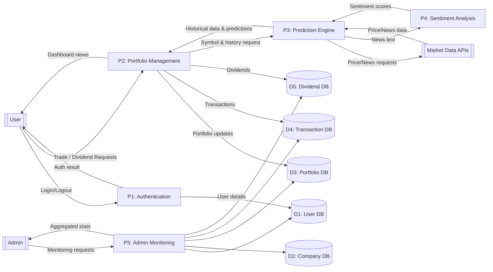
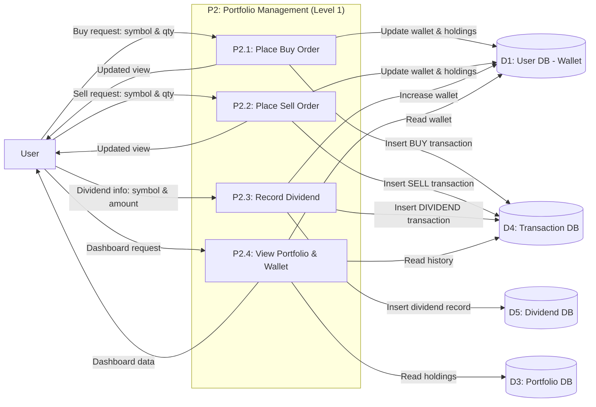
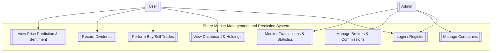

# Data Flow Diagrams

<cite>
**Referenced Files in This Document**   
- [main.py](file://main.py)
- [news_sentiment.py](file://news_sentiment.py)
- [docs/diagrams/exported/dfd_level0.mmd](file://docs/diagrams/exported/dfd_level0.mmd)
- [docs/diagrams/exported/dfd_portfolio_level1.mmd](file://docs/diagrams/exported/dfd_portfolio_level1.mmd)
- [docs/diagrams/exported/usecase_diagram.mmd](file://docs/diagrams/exported/usecase_diagram.mmd)
</cite>

## Table of Contents
1. [DFD Level 0](#dfd-level-0)
2. [DFD Portfolio Level 1](#dfd-portfolio-level-1)
3. [Use Case Diagram](#use-case-diagram)
4. [Interpretation Guidance](#interpretation-guidance)

## DFD Level 0

The Level 0 Data Flow Diagram (DFD) provides a high-level overview of the intelligent stock prediction system, illustrating the five main processes and their interactions with external entities and data stores.

**Diagram sources**
- [docs/diagrams/exported/dfd_level0.mmd](file://docs/diagrams/exported/dfd_level0.mmd)

### Authentication (P1)
The Authentication process handles user login and logout requests. It verifies user credentials against the User DB (D1) and returns authentication results to the User. This process is implemented in `main.py` through the `/login` and `/logout` routes, which validate user credentials and manage session state.

**Section sources**
- [main.py](file://main.py#L226-L248)

### Portfolio Management (P2)
The Portfolio Management process handles all trading activities, including buy/sell orders and dividend recording. It updates the Portfolio DB (D3), Transaction DB (D4), and Dividend DB (D5) accordingly. This process is implemented in `main.py` through the `/trade/buy`, `/trade/sell`, and `/dividends/record` routes, which manage portfolio updates and transaction logging.

**Section sources**
- [main.py](file://main.py#L268-L434)

### Prediction Engine (P3)
The Prediction Engine process generates stock price predictions using historical data from Market Data APIs and sentiment analysis results. It requests price and news data from external Market Data APIs and forwards news text to the Sentiment Analysis process. The prediction functionality is implemented in the `predict()` function in `main.py`, which uses ARIMA, LSTM, and Linear Regression algorithms to generate forecasts.

**Section sources**
- [main.py](file://main.py#L545-L778)

### Sentiment Analysis (P4)
The Sentiment Analysis process analyzes news and social media content to generate sentiment scores for stocks. It receives news text from the Prediction Engine and returns sentiment scores. This process is implemented in `news_sentiment.py` through the `ComprehensiveSentimentAnalyzer` class, which uses multiple sources including Finviz, EODHD API, Alpha Vantage, and social media APIs to gather and analyze sentiment data.

**Section sources**
- [news_sentiment.py](file://news_sentiment.py#L311-L894)

### Admin Monitoring (P5)
The Admin Monitoring process provides administrative oversight of the system. It accesses all data stores to generate aggregated statistics for administrators. This process is implemented in `main.py` through the `/admin` route, which queries the database for user, transaction, and company statistics and displays them in the admin dashboard.

**Section sources**
- [main.py](file://main.py#L436-L489)

## DFD Portfolio Level 1

The Level 1 DFD breaks down the Portfolio Management process (P2) into its subprocesses, providing a detailed view of the data flows and storage interactions.

**Diagram sources**
- [docs/diagrams/exported/dfd_portfolio_level1.mmd](file://docs/diagrams/exported/dfd_portfolio_level1.mmd)

### Place Buy Order (P2.1)
This subprocess handles buy order requests from users. It validates the order, updates the user's wallet balance in the User DB, creates a new portfolio item or updates an existing one in the Portfolio DB, and records the transaction in the Transaction DB. This functionality is implemented in the `trade_buy()` function in `main.py`.

**Section sources**
- [main.py](file://main.py#L268-L324)

### Place Sell Order (P2.2)
This subprocess handles sell order requests from users. It validates the order, updates the user's wallet balance in the User DB, adjusts the portfolio holdings in the Portfolio DB, and records the transaction in the Transaction DB. This functionality is implemented in the `trade_sell()` function in `main.py`.

**Section sources**
- [main.py](file://main.py#L327-L375)

### Record Dividend (P2.3)
This subprocess handles dividend recording for portfolio holdings. It increases the user's wallet balance in the User DB, creates a dividend record in the Dividend DB, and records the transaction in the Transaction DB. This functionality is implemented in the `record_dividend()` function in `main.py`.

**Section sources**
- [main.py](file://main.py#L398-L433)

### View Portfolio & Wallet (P2.4)
This subprocess handles dashboard requests from users. It reads the user's wallet balance from the User DB, retrieves portfolio holdings from the Portfolio DB, and fetches transaction history from the Transaction DB to generate the dashboard view. This functionality is implemented in the `dashboard()` function in `main.py`.

**Section sources**
- [main.py](file://main.py#L251-L265)

## Use Case Diagram

The Use Case Diagram illustrates the interactions between actors (User and Admin) and the system, distinguishing between user and administrative capabilities.

**Diagram sources**
- [docs/diagrams/exported/usecase_diagram.mmd](file://docs/diagrams/exported/usecase_diagram.mmd)

### User Capabilities
Users can perform the following actions:
- **Login / Register**: Authenticate with the system and create new accounts
- **View Dashboard & Holdings**: See their portfolio, transactions, and financial summary
- **Perform Buy/Sell Trades**: Execute simulated trading operations
- **Record Dividends**: Add dividend income to their portfolio
- **View Price Prediction & Sentiment**: Access stock predictions and sentiment analysis

These capabilities are implemented through various routes in `main.py`, including `/login`, `/register`, `/dashboard`, `/trade/buy`, `/trade/sell`, `/dividends/record`, and `/predict`.

**Section sources**
- [main.py](file://main.py#L199-L434)

### Admin Capabilities
Administrators can perform the following actions:
- **Login / Register**: Authenticate with the system
- **Manage Companies**: Add, edit, or deactivate company listings
- **Manage Brokers & Commissions**: Configure broker information and commission rates
- **Monitor Transactions & Statistics**: View system-wide transaction data and analytics

These capabilities are implemented through the admin-specific routes in `main.py`, including `/admin`, `/admin/brokers`, and `/admin/companies`.

**Section sources**
- [main.py](file://main.py#L436-L539)

## Interpretation Guidance

The data flow diagrams provide a comprehensive view of the system architecture and are essential tools for understanding, troubleshooting, and extending the intelligent stock prediction system.

### How Diagrams Guide System Understanding
The DFD Level 0 provides a high-level overview that helps developers understand the major components of the system and their interactions. Each process (P1-P5) represents a distinct functional area, making it easier to comprehend the system's overall architecture. The data stores (D1-D5) clearly show where information is persisted, while the external entities highlight integration points with third-party services.

The DFD Portfolio Level 1 offers a more detailed view of the Portfolio Management process, breaking it down into specific subprocesses. This hierarchical approach allows developers to understand both the big picture and the implementation details. The clear data flows show how information moves between components, making it easier to trace the path of a user request through the system.

The Use Case Diagram complements the DFDs by focusing on user interactions rather than data flows. It clearly distinguishes between user and admin capabilities, helping developers understand the different permission levels and access controls in the system.

### Using Diagrams for Troubleshooting
When troubleshooting issues, developers can use these diagrams to systematically trace problems:
1. Identify which process is involved based on the user's reported issue
2. Follow the data flows to understand the sequence of operations
3. Check the relevant data stores for consistency and integrity
4. Verify interactions with external entities if the issue involves third-party data

For example, if a user reports that their buy order is not reflected in their portfolio, a developer can:
1. Examine the "Place Buy Order" subprocess in the DFD Portfolio Level 1
2. Verify that data flows correctly from the user request to the User DB, Portfolio DB, and Transaction DB
3. Check the `trade_buy()` function implementation in `main.py` for any logical errors
4. Validate that the database transactions are being committed properly

### Using Diagrams for System Extension
When extending the system with new features, these diagrams serve as a blueprint for integration:
1. Determine which existing process should handle the new functionality
2. Identify the appropriate data stores for persistence
3. Map out the required data flows between components
4. Consider any new external entities that may need to be integrated

For instance, if adding a new "Stop-Loss Order" feature, a developer would:
1. Extend the Portfolio Management process with a new subprocess
2. Determine if existing data stores are sufficient or if new ones are needed
3. Define the data flows for order creation, monitoring, and execution
4. Consider whether the Prediction Engine should be involved in determining stop-loss levels

The diagrams also help maintain architectural consistency by ensuring that new features follow the established patterns and principles of the system.

**Section sources**
- [main.py](file://main.py)
- [news_sentiment.py](file://news_sentiment.py)