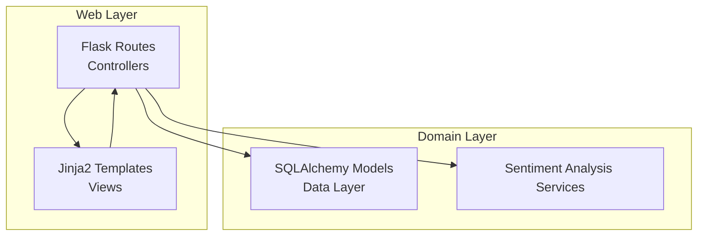
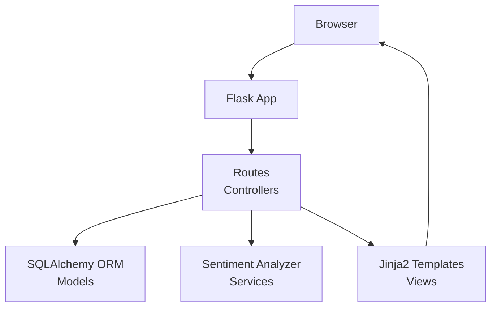
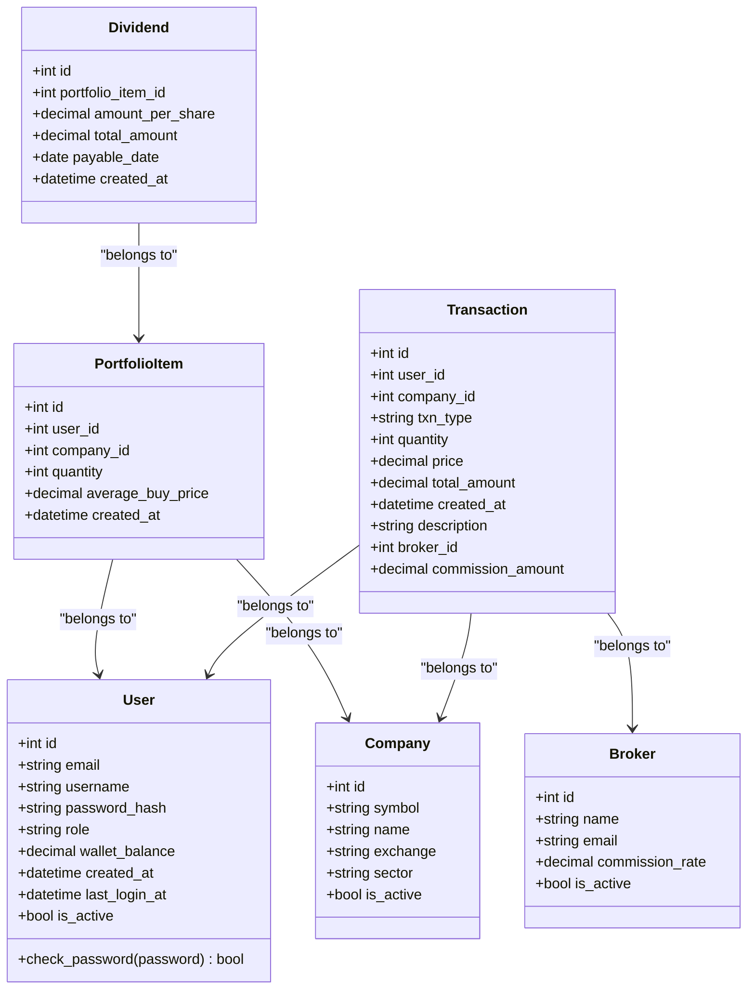
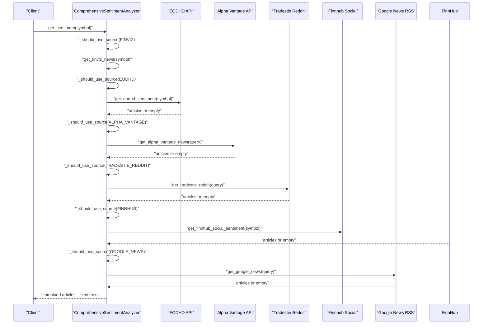
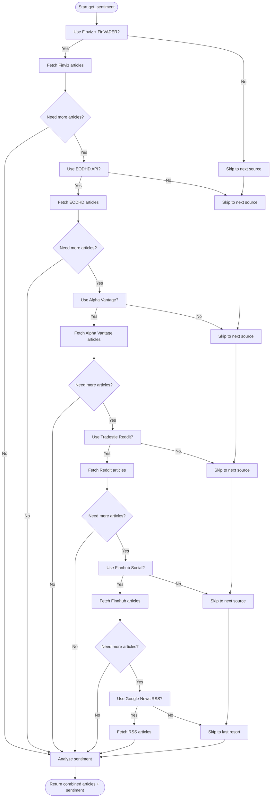
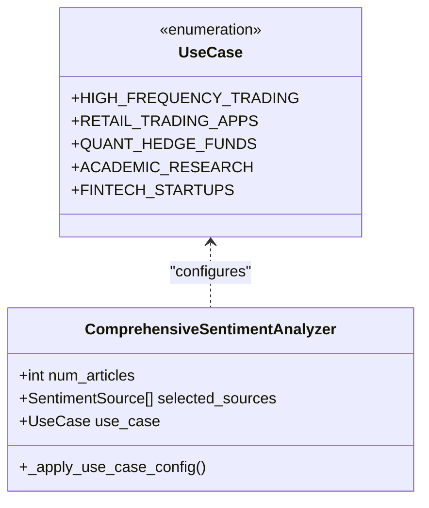
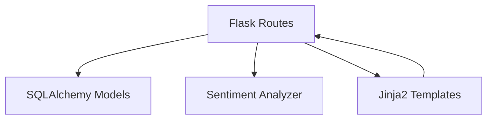

# Design Patterns & Implementation

<cite>
**Referenced Files in This Document**
- [main.py](file://main.py)
- [news_sentiment.py](file://news_sentiment.py)
- [templates/index.html](file://templates/index.html)
- [templates/dashboard.html](file://templates/dashboard.html)
- [templates/login.html](file://templates/login.html)
- [templates/register.html](file://templates/register.html)
- [docs/USE_CASE_SENTIMENT_ANALYSIS.md](file://docs/USE_CASE_SENTIMENT_ANALYSIS.md)
- [docs/API_KEYS_GUIDE.md](file://docs/API_KEYS_GUIDE.md)
- [docs/ERROR_HANDLING_MONITORING.md](file://docs/ERROR_HANDLING_MONITORING.md)
- [demos/api_keys_demo.py](file://demos/api_keys_demo.py)
- [tests/test_web_routes.py](file://tests/test_web_routes.py)
- [tests/test_sentiment_sources.py](file://tests/test_sentiment_sources.py)
- [tests/test_comprehensive_framework.py](file://tests/test_comprehensive_framework.py)
</cite>

## Table of Contents
1. [Introduction](#introduction)
2. [Project Structure](#project-structure)
3. [Core Components](#core-components)
4. [Architecture Overview](#architecture-overview)
5. [Detailed Component Analysis](#detailed-component-analysis)
6. [Dependency Analysis](#dependency-analysis)
7. [Performance Considerations](#performance-considerations)
8. [Troubleshooting Guide](#troubleshooting-guide)
9. [Conclusion](#conclusion)
10. [Appendices](#appendices)

## Introduction
This document explains the key design patterns implemented in the codebase and how they contribute to system resilience, flexibility, and maintainability. It focuses on:
- Model-View-Controller (MVC) with Flask routes as controllers, Jinja2 templates as views, and SQLAlchemy models as the data layer
- Dependency Injection for API key management across external sentiment services
- Fallback mechanism for sentiment analysis with prioritized sources and failover logic
- Use case configuration enabling different sentiment analysis profiles (HFT, retail, quant, academic, fintech)
- Practical mitigation strategies for API rate limiting and source unavailability

## Project Structure
The application is organized around a Flask web interface, SQLAlchemy ORM models, and a modular sentiment analysis module. Templates provide the user-facing views, while routes orchestrate user interactions and data flows.

**Section sources**
- [main.py](file://main.py#L1-L120)
- [templates/index.html](file://templates/index.html#L1-L120)
- [templates/dashboard.html](file://templates/dashboard.html#L1-L120)

## Core Components
- Flask application with SQLAlchemy configuration and CSRF protection
- MVC routing and templating for user interactions
- SQLAlchemy models for user, company, broker, portfolio, transactions, and dividends
- Comprehensive sentiment analyzer with configurable sources and use cases

**Section sources**
- [main.py](file://main.py#L1-L120)
- [news_sentiment.py](file://news_sentiment.py#L311-L420)

## Architecture Overview
The system follows a layered MVC architecture:
- Controllers: Flask routes handle HTTP requests and orchestrate business logic
- Views: Jinja2 templates render HTML pages with dynamic data
- Models: SQLAlchemy ORM defines persistent entities and relationships
- Services: The sentiment analyzer encapsulates external API integrations and fallback logic

**Diagram sources**
- [main.py](file://main.py#L199-L375)
- [templates/index.html](file://templates/index.html#L432-L586)
- [templates/dashboard.html](file://templates/dashboard.html#L1-L120)
- [news_sentiment.py](file://news_sentiment.py#L311-L420)

## Detailed Component Analysis

### MVC Pattern: Controllers, Views, and Models
- Controllers: Flask routes manage user sessions, form submissions, and data retrieval. They validate inputs, enforce roles, and coordinate with models and services.
- Views: Jinja2 templates render pages such as index, login, register, and dashboard, integrating flashed messages and CSRF tokens.
- Models: SQLAlchemy models define entities (User, Company, Broker, PortfolioItem, Transaction, Dividend) with relationships and constraints.

Key implementation references:
- Controllers and routes: [main.py](file://main.py#L199-L375)
- Login/registration templates: [templates/login.html](file://templates/login.html#L69-L90), [templates/register.html](file://templates/register.html#L69-L90)
- Dashboard template: [templates/dashboard.html](file://templates/dashboard.html#L1-L120)
- Index template: [templates/index.html](file://templates/index.html#L432-L586)
- Models: [main.py](file://main.py#L51-L120)

**Diagram sources**
- [main.py](file://main.py#L51-L120)

**Section sources**
- [main.py](file://main.py#L199-L375)
- [templates/index.html](file://templates/index.html#L432-L586)
- [templates/dashboard.html](file://templates/dashboard.html#L1-L120)
- [templates/login.html](file://templates/login.html#L69-L90)
- [templates/register.html](file://templates/register.html#L69-L90)

### Dependency Injection Pattern for API Key Management
External sentiment services are configured through constructor parameters and environment variables, enabling flexible runtime configuration without hardcoding credentials. The analyzer accepts API keys for EODHD, Alpha Vantage, Finnhub, and StockGeist, and gracefully skips unavailable sources.

Key implementation references:
- Constructor parameters and headers: [news_sentiment.py](file://news_sentiment.py#L311-L345)
- API key usage in sources: [news_sentiment.py](file://news_sentiment.py#L480-L581), [news_sentiment.py](file://news_sentiment.py#L622-L665), [news_sentiment.py](file://news_sentiment.py#L667-L706)
- Use-case-specific API requirements: [docs/API_KEYS_GUIDE.md](file://docs/API_KEYS_GUIDE.md#L1-L188)
- Demo of API key usage: [demos/api_keys_demo.py](file://demos/api_keys_demo.py#L1-L162)

**Diagram sources**
- [news_sentiment.py](file://news_sentiment.py#L737-L800)
- [news_sentiment.py](file://news_sentiment.py#L480-L581)
- [news_sentiment.py](file://news_sentiment.py#L583-L665)
- [news_sentiment.py](file://news_sentiment.py#L667-L706)
- [news_sentiment.py](file://news_sentiment.py#L394-L420)

**Section sources**
- [news_sentiment.py](file://news_sentiment.py#L311-L345)
- [news_sentiment.py](file://news_sentiment.py#L480-L581)
- [news_sentiment.py](file://news_sentiment.py#L583-L665)
- [news_sentiment.py](file://news_sentiment.py#L667-L706)
- [news_sentiment.py](file://news_sentiment.py#L737-L800)
- [docs/API_KEYS_GUIDE.md](file://docs/API_KEYS_GUIDE.md#L1-L188)
- [demos/api_keys_demo.py](file://demos/api_keys_demo.py#L1-L162)

### Fallback Mechanism Pattern in Sentiment Analysis
The sentiment analyzer implements a strict priority chain:
1. Finviz + FinVADER (primary, fast and reliable)
2. EODHD API (premium fallback)
3. Alpha Vantage News API
4. Tradestie Reddit API
5. Finnhub Social Sentiment API
6. Google News RSS (last resort)

It checks availability and fills remaining slots until the target number of articles is reached. Redis caching is supported for performance.

Key implementation references:
- Priority chain and selection logic: [news_sentiment.py](file://news_sentiment.py#L737-L800)
- Individual source methods: [news_sentiment.py](file://news_sentiment.py#L394-L420), [news_sentiment.py](file://news_sentiment.py#L421-L479), [news_sentiment.py](file://news_sentiment.py#L480-L581), [news_sentiment.py](file://news_sentiment.py#L583-L665), [news_sentiment.py](file://news_sentiment.py#L667-L706)
- Redis cache helpers: [news_sentiment.py](file://news_sentiment.py#L708-L740)

**Diagram sources**
- [news_sentiment.py](file://news_sentiment.py#L737-L800)
- [news_sentiment.py](file://news_sentiment.py#L394-L420)
- [news_sentiment.py](file://news_sentiment.py#L421-L479)
- [news_sentiment.py](file://news_sentiment.py#L480-L581)
- [news_sentiment.py](file://news_sentiment.py#L583-L665)
- [news_sentiment.py](file://news_sentiment.py#L667-L706)

**Section sources**
- [news_sentiment.py](file://news_sentiment.py#L737-L800)
- [news_sentiment.py](file://news_sentiment.py#L394-L420)
- [news_sentiment.py](file://news_sentiment.py#L421-L479)
- [news_sentiment.py](file://news_sentiment.py#L480-L581)
- [news_sentiment.py](file://news_sentiment.py#L583-L665)
- [news_sentiment.py](file://news_sentiment.py#L667-L706)
- [news_sentiment.py](file://news_sentiment.py#L708-L740)

### Use Case Configuration Pattern
The analyzer applies predefined configurations based on use cases:
- High-Frequency Trading: Fastest sources, minimal article count, aggressive caching
- Retail Trading Apps: Free-tier friendly, moderate latency
- Quant Hedge Funds: Premium sources with hybrid scoring
- Academic Research: Historical focus, higher article count
- Fintech Startups: Real-time streaming, scalable architecture

Key implementation references:
- Use case enum and configuration application: [news_sentiment.py](file://news_sentiment.py#L88-L95), [news_sentiment.py](file://news_sentiment.py#L346-L380)
- Use case-specific functions: [news_sentiment.py](file://news_sentiment.py#L1219-L1261)
- Documentation of use cases: [docs/USE_CASE_SENTIMENT_ANALYSIS.md](file://docs/USE_CASE_SENTIMENT_ANALYSIS.md#L1-L165)

**Diagram sources**
- [news_sentiment.py](file://news_sentiment.py#L88-L95)
- [news_sentiment.py](file://news_sentiment.py#L346-L380)

**Section sources**
- [news_sentiment.py](file://news_sentiment.py#L88-L95)
- [news_sentiment.py](file://news_sentiment.py#L346-L380)
- [news_sentiment.py](file://news_sentiment.py#L1219-L1261)
- [docs/USE_CASE_SENTIMENT_ANALYSIS.md](file://docs/USE_CASE_SENTIMENT_ANALYSIS.md#L1-L165)

### Code Examples from main.py and news_sentiment.py
- MVC controller example: [main.py](file://main.py#L251-L266) (dashboard route)
- View example: [templates/dashboard.html](file://templates/dashboard.html#L1-L120)
- Dependency injection for API keys: [news_sentiment.py](file://news_sentiment.py#L311-L345)
- Fallback chain: [news_sentiment.py](file://news_sentiment.py#L737-L800)
- Use case configuration: [news_sentiment.py](file://news_sentiment.py#L346-L380)

**Section sources**
- [main.py](file://main.py#L251-L266)
- [templates/dashboard.html](file://templates/dashboard.html#L1-L120)
- [news_sentiment.py](file://news_sentiment.py#L311-L345)
- [news_sentiment.py](file://news_sentiment.py#L737-L800)
- [news_sentiment.py](file://news_sentiment.py#L346-L380)

## Dependency Analysis
The system exhibits clear separation of concerns:
- Routes depend on models and the sentiment analyzer
- Templates depend on route-provided context and CSRF tokens
- The sentiment analyzer depends on external APIs and optional Redis caching

**Diagram sources**
- [main.py](file://main.py#L199-L375)
- [templates/index.html](file://templates/index.html#L432-L586)
- [templates/dashboard.html](file://templates/dashboard.html#L1-L120)
- [news_sentiment.py](file://news_sentiment.py#L311-L420)

**Section sources**
- [main.py](file://main.py#L199-L375)
- [news_sentiment.py](file://news_sentiment.py#L311-L420)

## Performance Considerations
- Caching: Redis caching is integrated to reduce repeated computations and API calls when available.
- Latency optimization: Use case configurations minimize article counts and source selection for speed-sensitive scenarios.
- Asynchronous processing: StockGeist streaming uses async HTTP client for real-time updates.
- Graceful degradation: When sources fail or rate limits apply, the system continues with available data.

[No sources needed since this section provides general guidance]

## Troubleshooting Guide
Common issues and mitigations:
- API rate limiting and source unavailability
  - The analyzer gracefully skips unavailable sources and continues with remaining ones. See [news_sentiment.py](file://news_sentiment.py#L737-L800).
  - Retry and exponential backoff are implemented for resilience. See [docs/ERROR_HANDLING_MONITORING.md](file://docs/ERROR_HANDLING_MONITORING.md#L1-L120).
- Missing API keys
  - Many sources can be used without keys; others are skipped when keys are absent. See [docs/API_KEYS_GUIDE.md](file://docs/API_KEYS_GUIDE.md#L1-L188) and [demos/api_keys_demo.py](file://demos/api_keys_demo.py#L1-L162).
- Route and template validation
  - Integration tests verify route behavior and CSRF token usage. See [tests/test_web_routes.py](file://tests/test_web_routes.py#L1-L40) and [templates/login.html](file://templates/login.html#L69-L90), [templates/register.html](file://templates/register.html#L69-L90).
- Use case configuration verification
  - Unit tests validate use case-specific configurations. See [tests/test_sentiment_sources.py](file://tests/test_sentiment_sources.py#L79-L115) and [tests/test_comprehensive_framework.py](file://tests/test_comprehensive_framework.py#L115-L171).

**Section sources**
- [news_sentiment.py](file://news_sentiment.py#L737-L800)
- [docs/ERROR_HANDLING_MONITORING.md](file://docs/ERROR_HANDLING_MONITORING.md#L1-L120)
- [docs/API_KEYS_GUIDE.md](file://docs/API_KEYS_GUIDE.md#L1-L188)
- [demos/api_keys_demo.py](file://demos/api_keys_demo.py#L1-L162)
- [tests/test_web_routes.py](file://tests/test_web_routes.py#L1-L40)
- [templates/login.html](file://templates/login.html#L69-L90)
- [templates/register.html](file://templates/register.html#L69-L90)
- [tests/test_sentiment_sources.py](file://tests/test_sentiment_sources.py#L79-L115)
- [tests/test_comprehensive_framework.py](file://tests/test_comprehensive_framework.py#L115-L171)

## Conclusion
The codebase demonstrates robust design patterns that enhance resilience and flexibility:
- MVC cleanly separates concerns between controllers, views, and models
- Dependency injection centralizes API key management and improves testability
- A strict fallback mechanism ensures continuity under partial outages
- Use case configurations tailor performance and cost to specific domains

Together, these patterns enable the system to remain operational under varying conditions and scale across diverse deployment scenarios.

[No sources needed since this section summarizes without analyzing specific files]

## Appendices
- Additional documentation references:
  - Use case-based sentiment analysis: [docs/USE_CASE_SENTIMENT_ANALYSIS.md](file://docs/USE_CASE_SENTIMENT_ANALYSIS.md#L1-L165)
  - API keys guide: [docs/API_KEYS_GUIDE.md](file://docs/API_KEYS_GUIDE.md#L1-L188)
  - Error handling and monitoring: [docs/ERROR_HANDLING_MONITORING.md](file://docs/ERROR_HANDLING_MONITORING.md#L1-L120)

[No sources needed since this section provides general guidance]