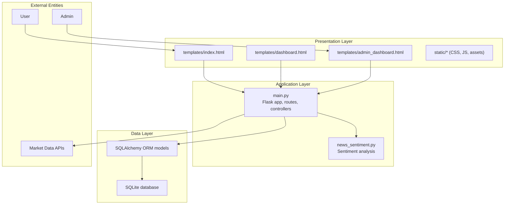
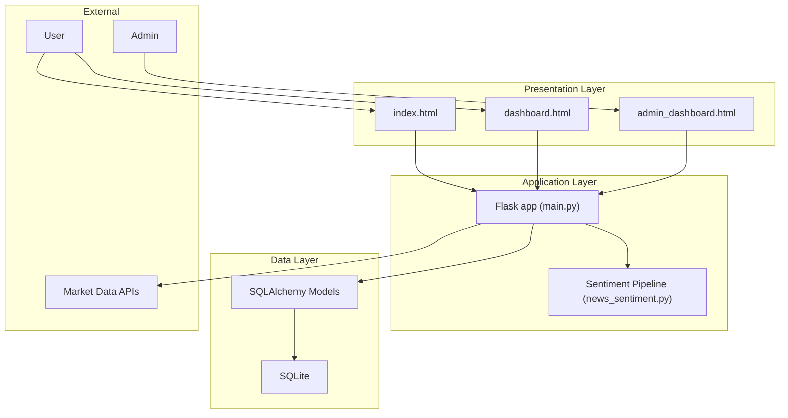
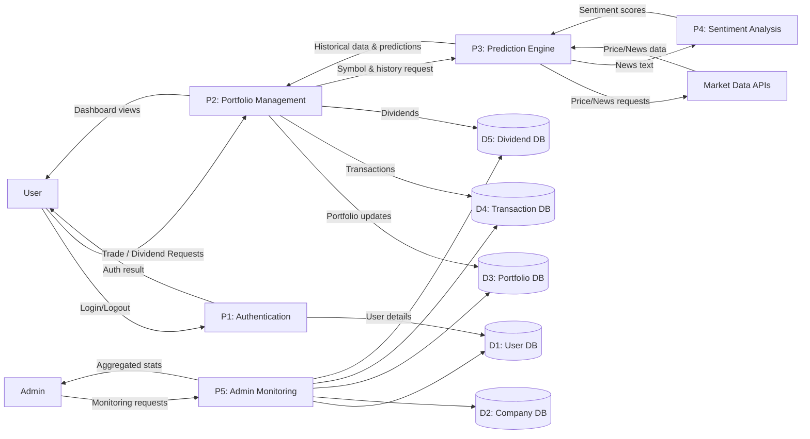
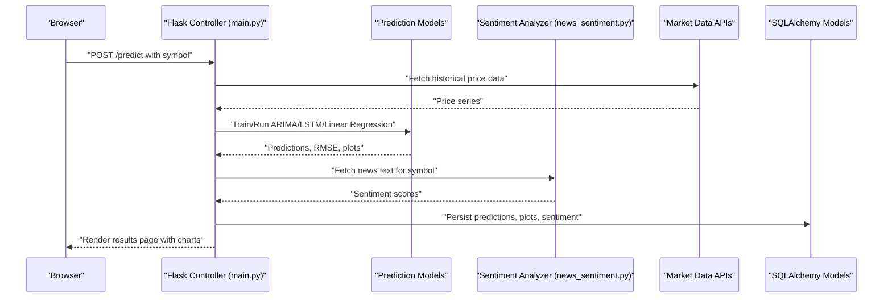
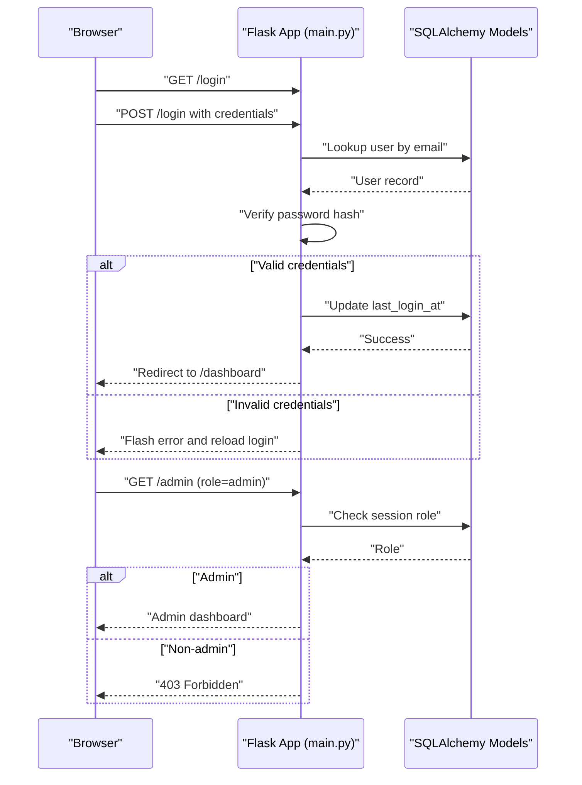
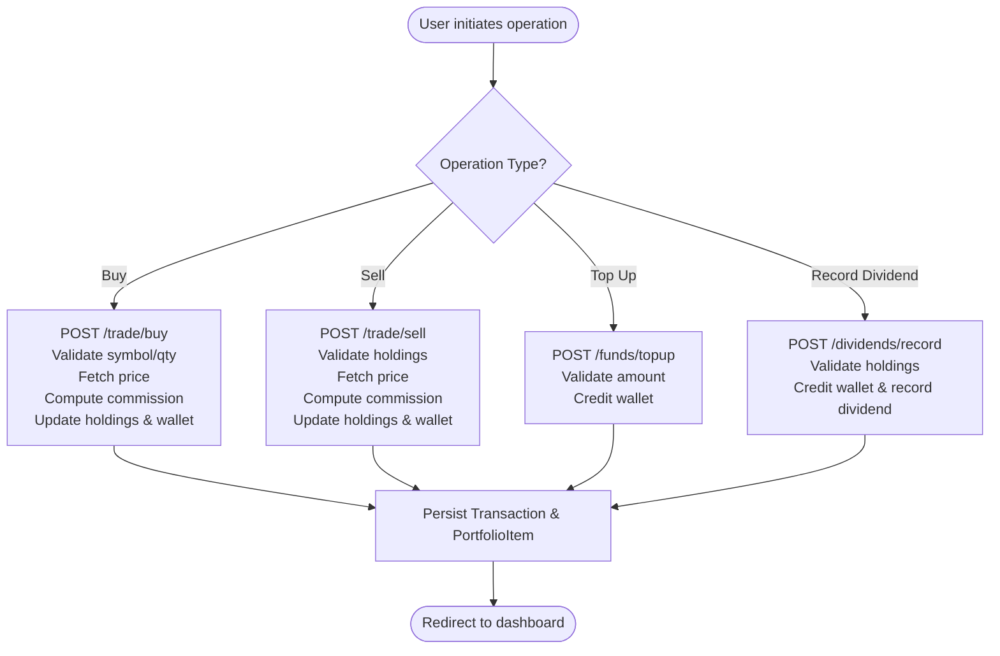
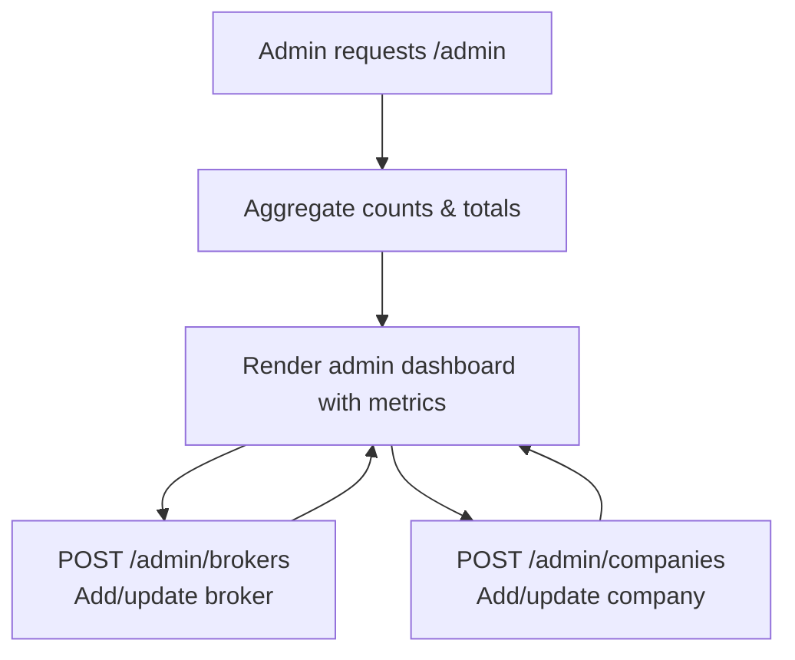
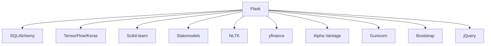

# System Architecture Overview

<cite>
**Referenced Files in This Document**
- [main.py](file://main.py)
- [news_sentiment.py](file://news_sentiment.py)
- [README.md](file://README.md)
- [requirements.txt](file://requirements.txt)
- [templates/index.html](file://templates/index.html)
- [templates/dashboard.html](file://templates/dashboard.html)
- [templates/admin_dashboard.html](file://templates/admin_dashboard.html)
- [docs/diagrams/dfd_level0.md](file://docs/diagrams/dfd_level0.md)
- [docs/diagrams/er_diagram.md](file://docs/diagrams/er_diagram.md)
- [docs/diagrams/export_diagrams.py](file://docs/diagrams/export_diagrams.py)
- [demos/api_keys_demo.py](file://demos/api_keys_demo.py)
- [tests/test_database_models.py](file://tests/test_database_models.py)
</cite>

## Table of Contents
1. [Introduction](#introduction)
2. [Project Structure](#project-structure)
3. [Core Components](#core-components)
4. [Architecture Overview](#architecture-overview)
5. [Detailed Component Analysis](#detailed-component-analysis)
6. [Dependency Analysis](#dependency-analysis)
7. [Performance Considerations](#performance-considerations)
8. [Troubleshooting Guide](#troubleshooting-guide)
9. [Conclusion](#conclusion)
10. [Appendices](#appendices)

## Introduction
This document describes the high-level architecture of the intelligent-stock-prediction system. It covers the three-tier architecture (presentation, application, and data), external entities (Users, Admins, Market Data APIs), and the end-to-end data flows using a Level 0 DFD. It also documents component interactions among frontend templates, Flask controllers, ML models, and database models, along with technology choices and deployment considerations.

## Project Structure
The repository organizes the system into:
- Presentation layer: Jinja2 templates and static assets
- Application layer: Flask routes and business logic
- Data layer: SQLAlchemy models backed by SQLite
- Supporting artifacts: documentation diagrams, tests, demos, and requirements



**Diagram sources**
- [main.py](file://main.py#L1-L120)
- [news_sentiment.py](file://news_sentiment.py#L1-L120)
- [templates/index.html](file://templates/index.html#L1-L120)
- [templates/dashboard.html](file://templates/dashboard.html#L1-L120)
- [templates/admin_dashboard.html](file://templates/admin_dashboard.html#L1-L120)

**Section sources**
- [README.md](file://README.md#L73-L83)
- [main.py](file://main.py#L40-L60)
- [requirements.txt](file://requirements.txt#L1-L19)

## Core Components
- Presentation layer: HTML templates and static assets rendered by Flask and served via Jinja2.
- Application layer: Flask application with route handlers, business logic, and orchestration of ML and sentiment components.
- Data layer: SQLAlchemy models representing Users, Companies, Brokers, PortfolioItems, Transactions, and Dividends, persisted in SQLite.

Key responsibilities:
- Routes for authentication, portfolio management, prediction, and admin monitoring.
- Database models with relationships and constraints validated by tests.
- Sentiment analysis pipeline aggregating multiple sources and returning polarity scores.

**Section sources**
- [main.py](file://main.py#L120-L220)
- [tests/test_database_models.py](file://tests/test_database_models.py#L1-L120)
- [docs/diagrams/er_diagram.md](file://docs/diagrams/er_diagram.md#L1-L68)

## Architecture Overview
The system follows a three-tier architecture:
- Presentation: HTML templates and static assets.
- Application: Flask controllers and business logic.
- Data: SQLite via SQLAlchemy ORM.

External entities:
- Users: Interact with dashboards, place trades, and view predictions.
- Admins: Monitor system statistics and manage brokers/companies.
- Market Data APIs: Provide price and news data consumed by the prediction and sentiment engines.



**Diagram sources**
- [main.py](file://main.py#L199-L224)
- [news_sentiment.py](file://news_sentiment.py#L1-L120)
- [docs/diagrams/er_diagram.md](file://docs/diagrams/er_diagram.md#L1-L68)

## Detailed Component Analysis

### Three-Tier Architecture Details
- Presentation layer: Templates define user-facing pages and include static assets. Controllers render templates and pass context data.
- Application layer: Flask routes implement authentication, portfolio operations, prediction orchestration, and admin monitoring. Controllers interact with the database and ML/sentiment components.
- Data layer: SQLAlchemy models encapsulate business entities and relationships. Tests validate constraints and cascades.

```mermaid
classDiagram
class User {
+int id
+string email
+string username
+string password_hash
+string role
+decimal wallet_balance
+datetime created_at
+datetime last_login_at
+bool is_active
+check_password(password) bool
}
class Company {
+int id
+string symbol
+string name
+string exchange
+string sector
+bool is_active
}
class Broker {
+int id
+string name
+string email
+decimal commission_rate
+bool is_active
}
class PortfolioItem {
+int id
+int user_id
+int company_id
+int quantity
+decimal average_buy_price
+datetime created_at
}
class Transaction {
+int id
+int user_id
+int company_id
+int broker_id
+string txn_type
+int quantity
+decimal price
+decimal total_amount
+decimal commission_amount
+datetime created_at
+string description
}
class Dividend {
+int id
+int portfolio_item_id
+decimal amount_per_share
+decimal total_amount
+date payable_date
+datetime created_at
}
User ||--o{ PortfolioItem : "owns"
Company ||--o{ PortfolioItem : "held in"
User ||--o{ Transaction : "executes"
Company ||--o{ Transaction : "traded in"
Broker ||--o{ Transaction : "charges commission on"
User ||--o{ Dividend : "receives"
Company ||--o{ Dividend : "issues"
```

**Diagram sources**
- [docs/diagrams/er_diagram.md](file://docs/diagrams/er_diagram.md#L1-L68)
- [tests/test_database_models.py](file://tests/test_database_models.py#L1-L120)

**Section sources**
- [docs/diagrams/er_diagram.md](file://docs/diagrams/er_diagram.md#L1-L68)
- [tests/test_database_models.py](file://tests/test_database_models.py#L1-L120)

### Data Flow: Level 0 DFD
The Level 0 DFD captures high-level interactions among Users, Admins, Market Data APIs, and internal processes.



**Diagram sources**
- [docs/diagrams/dfd_level0.md](file://docs/diagrams/dfd_level0.md#L1-L50)

**Section sources**
- [docs/diagrams/dfd_level0.md](file://docs/diagrams/dfd_level0.md#L1-L50)

### Component Interactions: Prediction and Sentiment Pipeline
The prediction flow integrates market data retrieval, model inference, and sentiment aggregation.



**Diagram sources**
- [main.py](file://main.py#L545-L780)
- [news_sentiment.py](file://news_sentiment.py#L311-L800)

**Section sources**
- [main.py](file://main.py#L545-L780)
- [news_sentiment.py](file://news_sentiment.py#L311-L800)

### Authentication and Authorization Flow
Authentication ensures secure access to dashboards and admin controls.



**Diagram sources**
- [main.py](file://main.py#L226-L249)
- [main.py](file://main.py#L436-L490)

**Section sources**
- [main.py](file://main.py#L226-L249)
- [main.py](file://main.py#L436-L490)

### Portfolio Management Workflow
Portfolio operations include buying/selling, dividend recording, and fund top-ups.



**Diagram sources**
- [main.py](file://main.py#L268-L434)

**Section sources**
- [main.py](file://main.py#L268-L434)

### Admin Monitoring Pathways
Admins can monitor system statistics and manage entities.



**Diagram sources**
- [main.py](file://main.py#L436-L541)
- [templates/admin_dashboard.html](file://templates/admin_dashboard.html#L1-L120)

**Section sources**
- [main.py](file://main.py#L436-L541)
- [templates/admin_dashboard.html](file://templates/admin_dashboard.html#L1-L120)

## Dependency Analysis
Technology stack and dependencies:
- Backend: Flask, SQLAlchemy, Werkzeug security utilities
- ML/AI: TensorFlow/Keras, Scikit-learn, Statsmodels, NLTK, TextBlob
- Data providers: yfinance, Alpha Vantage
- Frontend: Bootstrap, jQuery, static assets
- Deployment: Gunicorn



**Diagram sources**
- [requirements.txt](file://requirements.txt#L1-L19)
- [README.md](file://README.md#L51-L73)

**Section sources**
- [requirements.txt](file://requirements.txt#L1-L19)
- [README.md](file://README.md#L51-L73)

## Performance Considerations
- SQLite for development simplifies setup but limits concurrent writes and scaling compared to production-grade databases.
- ML inference (LSTM/ARIMA) can be computationally intensive; consider batching, caching, or offloading heavy tasks to background workers.
- Sentiment analysis uses multiple sources; implement timeouts and fallbacks to maintain responsiveness.
- Static asset caching and compression can improve frontend performance.
- Use production WSGI server (Gunicorn) and reverse proxy for concurrency and stability.

[No sources needed since this section provides general guidance]

## Troubleshooting Guide
Common issues and remedies:
- Authentication failures: Verify credentials and ensure user is active; review session handling and CSRF protection.
- Missing API keys: The sentiment system gracefully skips unavailable sources; configure keys or environment variables.
- Database integrity errors: Foreign key violations or unique constraint conflicts indicate invalid data or missing relations.
- Prediction errors: Validate symbol availability and ensure market data retrieval succeeds before model inference.

**Section sources**
- [main.py](file://main.py#L226-L249)
- [demos/api_keys_demo.py](file://demos/api_keys_demo.py#L1-L162)
- [tests/test_database_models.py](file://tests/test_database_models.py#L331-L356)

## Conclusion
The intelligent-stock-prediction system employs a clean three-tier architecture with clear separation of concerns. The presentation layer delivers responsive dashboards, the application layer orchestrates business logic and ML/sentiment pipelines, and the data layer persists entities with strong relational constraints. While SQLite suits development, production deployments should consider scalable databases and robust infrastructure for concurrency and reliability.

[No sources needed since this section summarizes without analyzing specific files]

## Appendices

### Deployment Topology and Infrastructure
- Local deployment: Flask dev server with SQLite and local static assets.
- Cloud deployment: Use a WSGI server (e.g., Gunicorn) behind a reverse proxy, containerized with environment variables for secrets and database URLs. Replace SQLite with a managed database for production.

**Section sources**
- [requirements.txt](file://requirements.txt#L14-L14)
- [README.md](file://README.md#L104-L135)

### Exporting Diagrams
Mermaid diagrams can be exported to SVG/PNG using the provided export script.

**Section sources**
- [docs/diagrams/export_diagrams.py](file://docs/diagrams/export_diagrams.py#L1-L211)