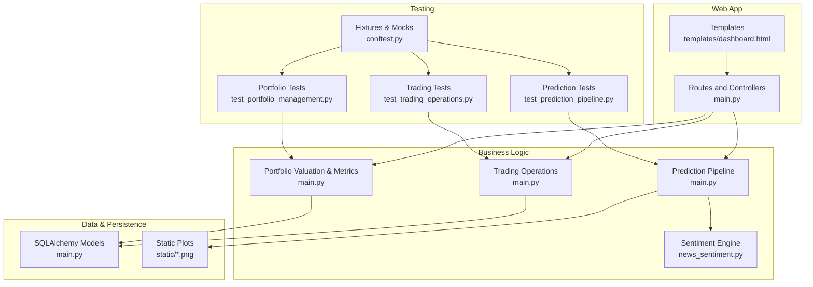
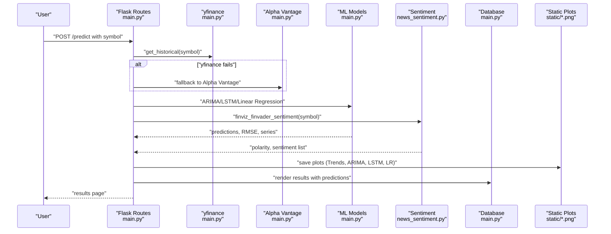
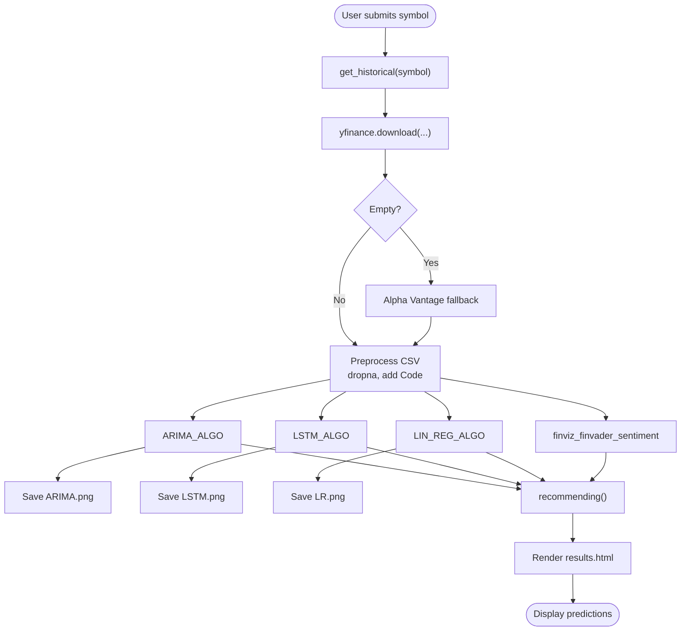
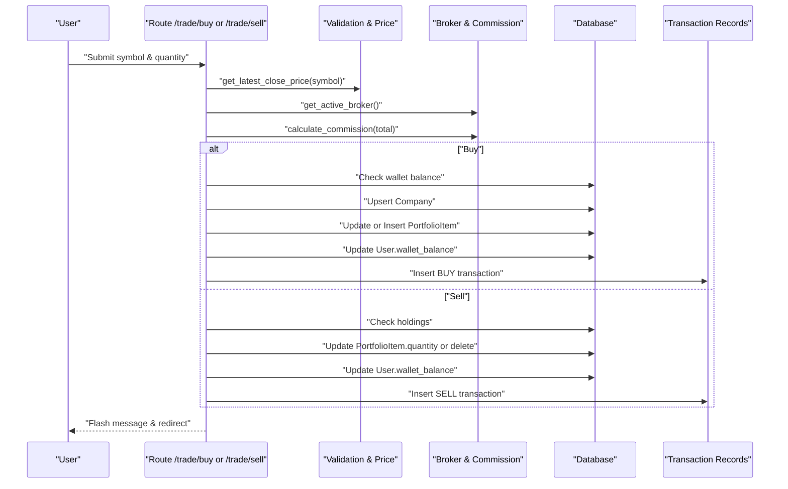
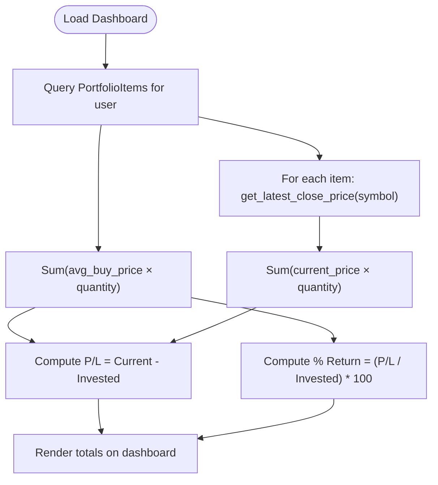
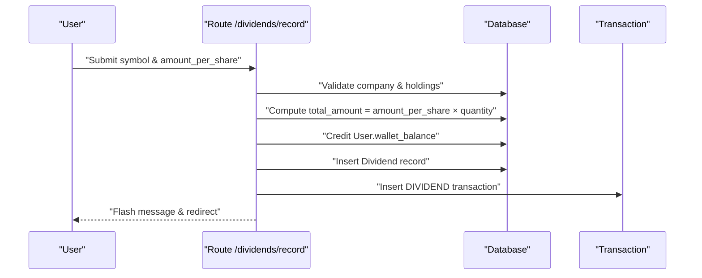
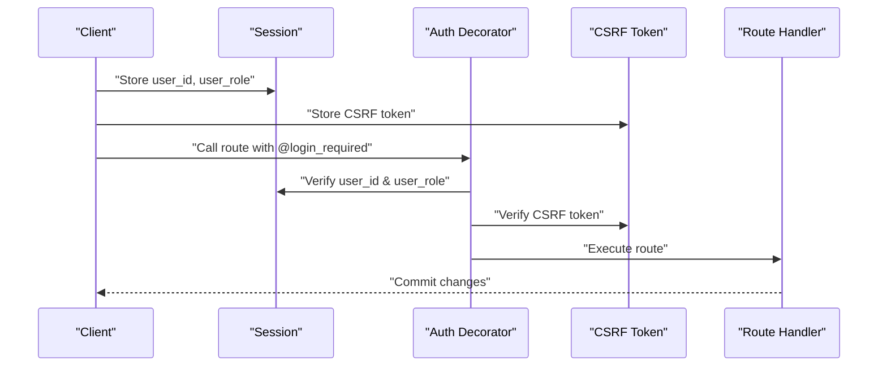
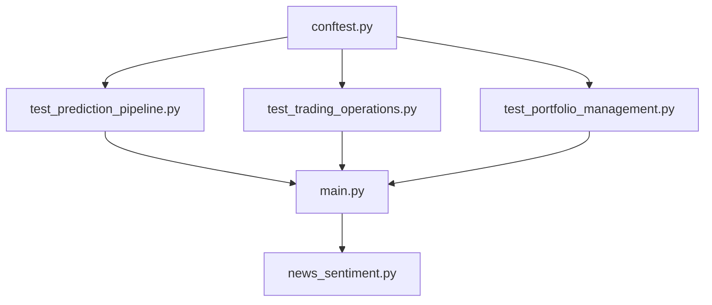
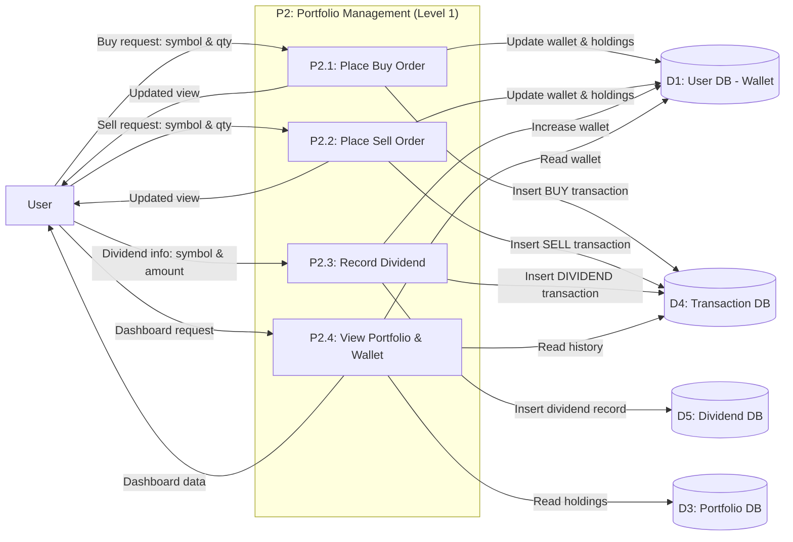

# Business Logic Layer

<cite>
**Referenced Files in This Document**
- [main.py](file://main.py)
- [news_sentiment.py](file://news_sentiment.py)
- [test_prediction_pipeline.py](file://tests/test_prediction_pipeline.py)
- [test_trading_operations.py](file://tests/test_trading_operations.py)
- [test_portfolio_management.py](file://tests/test_portfolio_management.py)
- [conftest.py](file://tests/conftest.py)
- [templates/dashboard.html](file://templates/dashboard.html)
- [docs/diagrams/dfd_portfolio_level1.md](file://docs/diagrams/dfd_portfolio_level1.md)
- [docs/diagrams/exported/dfd_portfolio_level1.mmd](file://docs/diagrams/exported/dfd_portfolio_level1.mmd)
- [docs/diagrams/gallery.html](file://docs/diagrams/gallery.html)
</cite>

## Table of Contents
1. [Introduction](#introduction)
2. [Project Structure](#project-structure)
3. [Core Components](#core-components)
4. [Architecture Overview](#architecture-overview)
5. [Detailed Component Analysis](#detailed-component-analysis)
6. [Dependency Analysis](#dependency-analysis)
7. [Performance Considerations](#performance-considerations)
8. [Troubleshooting Guide](#troubleshooting-guide)
9. [Conclusion](#conclusion)
10. [Appendices](#appendices)

## Introduction
This document focuses on the business logic layer of the intelligent stock prediction application. It explains the prediction pipeline workflow from user input to forecast visualization, including data retrieval (yfinance), preprocessing, model execution, and result aggregation. It also documents trading operations logic (buy/sell order processing, commission calculations, wallet updates, and dividend recording), portfolio valuation algorithms, and performance metric calculations. The document references the test suite to illustrate expected behavior and edge cases, and covers state management patterns for user sessions and transaction atomicity. Error handling within business workflows and data consistency requirements are addressed, along with examples of complex operations such as batch predictions and portfolio rebalancing simulations.

## Project Structure
The business logic spans several modules:
- Application entry and routing logic: [main.py](file://main.py)
- Sentiment analysis engine: [news_sentiment.py](file://news_sentiment.py)
- Tests for prediction pipeline: [test_prediction_pipeline.py](file://tests/test_prediction_pipeline.py)
- Tests for trading operations: [test_trading_operations.py](file://tests/test_trading_operations.py)
- Tests for portfolio management: [test_portfolio_management.py](file://tests/test_portfolio_management.py)
- Shared test fixtures and mocks: [conftest.py](file://tests/conftest.py)
- UI templates for dashboards and prediction views: [templates/dashboard.html](file://templates/dashboard.html)
- Portfolio DFD diagrams: [docs/diagrams/dfd_portfolio_level1.md](file://docs/diagrams/dfd_portfolio_level1.md), [docs/diagrams/exported/dfd_portfolio_level1.mmd](file://docs/diagrams/exported/dfd_portfolio_level1.mmd), [docs/diagrams/gallery.html](file://docs/diagrams/gallery.html)

**Diagram sources**
- [main.py](file://main.py#L1-L120)
- [news_sentiment.py](file://news_sentiment.py#L1-L120)
- [test_prediction_pipeline.py](file://tests/test_prediction_pipeline.py#L1-L120)
- [test_trading_operations.py](file://tests/test_trading_operations.py#L1-L120)
- [test_portfolio_management.py](file://tests/test_portfolio_management.py#L1-L120)
- [conftest.py](file://tests/conftest.py#L1-L120)
- [templates/dashboard.html](file://templates/dashboard.html#L170-L198)

**Section sources**
- [main.py](file://main.py#L1-L120)
- [news_sentiment.py](file://news_sentiment.py#L1-L120)
- [test_prediction_pipeline.py](file://tests/test_prediction_pipeline.py#L1-L120)
- [test_trading_operations.py](file://tests/test_trading_operations.py#L1-L120)
- [test_portfolio_management.py](file://tests/test_portfolio_management.py#L1-L120)
- [conftest.py](file://tests/conftest.py#L1-L120)
- [templates/dashboard.html](file://templates/dashboard.html#L170-L198)

## Core Components
- Prediction pipeline: Orchestrates data retrieval, preprocessing, model execution, and visualization.
- Trading operations: Buy/sell order processing, commission calculations, wallet updates, and transaction records.
- Portfolio management: Wallet operations, holdings management, valuation, and performance metrics.
- Sentiment analysis: Multi-source sentiment pipeline integrated into prediction.
- Session and CSRF management: Login-required decorators, session state, and CSRF verification.
- Testing harness: Fixtures, mocks, and integration tests validating end-to-end flows.

**Section sources**
- [main.py](file://main.py#L161-L185)
- [main.py](file://main.py#L268-L433)
- [main.py](file://main.py#L545-L980)
- [news_sentiment.py](file://news_sentiment.py#L1-L120)
- [conftest.py](file://tests/conftest.py#L120-L210)

## Architecture Overview
The business logic layer is centered around Flask routes that invoke business functions. The prediction pipeline integrates external data sources (yfinance, Alpha Vantage fallback), executes multiple ML models, and generates visualizations. Trading operations enforce validation, apply commission calculations, and update wallets and holdings atomically. Portfolio valuation aggregates current prices and computes performance metrics.

**Diagram sources**
- [main.py](file://main.py#L545-L980)
- [news_sentiment.py](file://news_sentiment.py#L1-L120)

**Section sources**
- [main.py](file://main.py#L545-L980)
- [news_sentiment.py](file://news_sentiment.py#L1-L120)

## Detailed Component Analysis

### Prediction Pipeline Workflow
The prediction pipeline begins with user input, retrieves historical data (preferably via yfinance with a fallback to Alpha Vantage), preprocesses the data, runs ARIMA, LSTM, and Linear Regression models, integrates sentiment analysis, and renders results with visualizations.

Key steps:
- Data retrieval: [get_historical](file://main.py#L550-L582) downloads two years of daily adjusted data; falls back to Alpha Vantage if empty.
- Preprocessing: Drops NA values, constructs DataFrame with symbol code, and writes CSV for downstream models.
- Model execution:
  - ARIMA: [ARIMA_ALGO](file://main.py#L584-L642) trains on 80% of data, saves ARIMA.png, and returns prediction and RMSE.
  - LSTM: [LSTM_ALGO](file://main.py#L647-L779) builds and trains an LSTM model, saves LSTM.png, and returns prediction and RMSE.
  - Linear Regression: [LIN_REG_ALGO](file://main.py#L780-L846) fits a linear regression, saves LR.png, and returns prediction and RMSE.
- Sentiment integration: [finviz_finvader_sentiment](file://news_sentiment.py#L1-L120) is invoked to compute sentiment scores and lists.
- Recommendation: [recommending](file://main.py#L847-L905) derives BUY/SELL/HOLD based on model forecasts and sentiment.
- Visualization and results: Saves plots and renders [results.html](file://templates/dashboard.html#L170-L198) with predictions and today’s OHLC.

**Diagram sources**
- [main.py](file://main.py#L550-L980)
- [news_sentiment.py](file://news_sentiment.py#L1-L120)

**Section sources**
- [main.py](file://main.py#L550-L980)
- [test_prediction_pipeline.py](file://tests/test_prediction_pipeline.py#L45-L198)

### Trading Operations Logic
The trading operations enforce validation, calculate commission, update wallets and holdings, and record transactions. The system supports buy and sell operations, commission rates, and dividend recording.

Key functions:
- Buy order: [trade_buy](file://main.py#L268-L325)
  - Validates quantity and symbol, checks price availability, calculates total and commission, validates wallet balance, updates holdings (average buy price recalculation), credits/debits wallet, records transaction with commission.
- Sell order: [trade_sell](file://main.py#L327-L375)
  - Validates holdings, calculates proceeds, applies commission, updates quantity or deletes position, credits wallet, records transaction.
- Commission calculation: [calculate_commission](file://main.py#L176-L185)
  - Applies broker commission rate to total amount and quantizes to two decimals.
- Active broker: [get_active_broker](file://main.py#L172-L174)
  - Retrieves the active broker for commission calculations.
- Latest price: [get_latest_close_price](file://main.py#L161-L169)
  - Fetches latest close price via yfinance.

Validation and edge cases covered by tests:
- Insufficient funds for buy: [test_purchase_insufficient_funds](file://tests/test_trading_operations.py#L41-L52)
- Negative/zero/invalid quantity: [test_purchase_negative_quantity](file://tests/test_trading_operations.py#L83-L92), [test_purchase_zero_quantity](file://tests/test_trading_operations.py#L93-L102), [test_purchase_invalid_quantity](file://tests/test_trading_operations.py#L73-L82)
- Insufficient shares for sell: [test_sell_insufficient_shares](file://tests/test_trading_operations.py#L158-L167)
- Zero quantity handling: [test_sell_removes_portfolio_item_on_zero](file://tests/test_trading_operations.py#L168-L182)
- Commission calculation and deduction: [test_commission_calculation](file://tests/test_trading_operations.py#L209-L219), [test_commission_deducted_on_buy](file://tests/test_trading_operations.py#L233-L251), [test_commission_deducted_on_sell](file://tests/test_trading_operations.py#L252-L267)

**Diagram sources**
- [main.py](file://main.py#L268-L375)
- [main.py](file://main.py#L161-L185)

**Section sources**
- [main.py](file://main.py#L268-L375)
- [main.py](file://main.py#L161-L185)
- [test_trading_operations.py](file://tests/test_trading_operations.py#L13-L204)
- [test_trading_operations.py](file://tests/test_trading_operations.py#L206-L348)

### Portfolio Valuation and Performance Metrics
Portfolio valuation and performance metrics are computed on the dashboard and validated by tests.

Key computations:
- Total invested: Sum of average buy price × quantity for all holdings.
- Current portfolio value: Sum of current price × quantity for each holding.
- Profit/Loss: Current value minus total invested.
- Percentage return: (Profit / Total invested) × 100.
- Live price retrieval: [get_latest_close_price](file://main.py#L161-L169) used in dashboard and tests.

Validation covered by tests:
- Total invested calculation: [test_total_invested_calculation](file://tests/test_portfolio_management.py#L165-L194)
- Current portfolio value: [test_current_portfolio_value](file://tests/test_portfolio_management.py#L195-L208)
- Profit/Loss computation: [test_portfolio_profit_loss](file://tests/test_portfolio_management.py#L209-L224)
- Percentage return: [test_portfolio_percentage_return](file://tests/test_portfolio_management.py#L225-L236)

**Diagram sources**
- [main.py](file://main.py#L251-L266)
- [main.py](file://main.py#L161-L169)

**Section sources**
- [main.py](file://main.py#L251-L266)
- [test_portfolio_management.py](file://tests/test_portfolio_management.py#L162-L236)

### Dividend Recording
Dividend recording credits the user’s wallet and logs a transaction. The operation validates holdings and amount per share.

Key function:
- [record_dividend](file://main.py#L398-L433)
  - Validates amount per share > 0, validates company and holdings, computes total amount, credits wallet, inserts Dividend and Transaction records.

Validation covered by tests:
- Valid dividend recording: [test_record_dividend](file://tests/test_portfolio_management.py#L277-L292)
- Non-existent symbol handling: [test_dividend_invalid_symbol](file://tests/test_portfolio_management.py#L293-L306)
- Negative amount handling: [test_dividend_negative_amount](file://tests/test_portfolio_management.py#L307-L316)

**Diagram sources**
- [main.py](file://main.py#L398-L433)

**Section sources**
- [main.py](file://main.py#L398-L433)
- [test_portfolio_management.py](file://tests/test_portfolio_management.py#L274-L316)

### State Management and Transaction Atomicity
State management patterns:
- Session-based authentication: [login_required](file://main.py#L139-L152) decorator enforces login and role checks.
- CSRF protection: [verify_csrf](file://main.py#L129-L134) validates CSRF tokens.
- Session storage: [generate_csrf_token](file://main.py#L121-L127) stores CSRF token in session.
- User context: [get_current_user](file://main.py#L154-L159) loads current user from session.

Transaction atomicity:
- Each route performs a single commit after all database changes are staged. While explicit SELECT FOR UPDATE is not shown in the referenced code, the tests demonstrate that database state is consistent after operations (e.g., purchases, sales, dividends). For production-grade atomicity, consider wrapping critical sections in explicit database transactions and locks.

**Diagram sources**
- [main.py](file://main.py#L121-L159)

**Section sources**
- [main.py](file://main.py#L121-L159)
- [conftest.py](file://tests/conftest.py#L128-L144)

### Error Handling and Data Consistency
Error handling patterns:
- Prediction pipeline gracefully handles invalid symbols and model failures; tests assert graceful responses and fallback behavior.
- Trading routes validate inputs and flash user-friendly messages on failures (insufficient funds, insufficient shares, invalid quantities).
- Portfolio routes rely on live price retrieval; tests validate calculations under mocked prices.

Consistency requirements:
- Wallet balance updates must be atomic with transaction insertions.
- PortfolioItem updates must preserve average buy price and quantity consistency.
- Dividend recording must credit wallet and create transaction records atomically.

Examples of complex operations:
- Batch predictions: The existing pipeline runs ARIMA, LSTM, and Linear Regression in sequence for a single symbol. Extending to batch predictions involves iterating over multiple symbols and aggregating results.
- Portfolio rebalancing simulations: The system simulates trades by updating wallet balances and holdings without real brokerage execution. A rebalancing simulation could compute target allocations, generate synthetic buy/sell orders, and aggregate transaction costs.

**Section sources**
- [test_prediction_pipeline.py](file://tests/test_prediction_pipeline.py#L152-L178)
- [test_trading_operations.py](file://tests/test_trading_operations.py#L13-L204)
- [test_portfolio_management.py](file://tests/test_portfolio_management.py#L162-L236)

## Dependency Analysis
The business logic depends on:
- Flask routes and decorators for session and CSRF management.
- SQLAlchemy models for persistence.
- External libraries for data retrieval, modeling, and plotting.
- Sentiment analysis module for news-based sentiment.

**Diagram sources**
- [main.py](file://main.py#L1-L120)
- [news_sentiment.py](file://news_sentiment.py#L1-L120)
- [test_prediction_pipeline.py](file://tests/test_prediction_pipeline.py#L1-L120)
- [test_trading_operations.py](file://tests/test_trading_operations.py#L1-L120)
- [test_portfolio_management.py](file://tests/test_portfolio_management.py#L1-L120)
- [conftest.py](file://tests/conftest.py#L1-L120)

**Section sources**
- [main.py](file://main.py#L1-L120)
- [news_sentiment.py](file://news_sentiment.py#L1-L120)
- [test_prediction_pipeline.py](file://tests/test_prediction_pipeline.py#L1-L120)
- [test_trading_operations.py](file://tests/test_trading_operations.py#L1-L120)
- [test_portfolio_management.py](file://tests/test_portfolio_management.py#L1-L120)
- [conftest.py](file://tests/conftest.py#L1-L120)

## Performance Considerations
- Model execution: ARIMA, LSTM, and Linear Regression are computationally intensive. Consider batching predictions and caching results for frequently accessed symbols.
- Data retrieval: Prefer yfinance for live data; use Alpha Vantage fallback only when necessary to minimize latency.
- Visualization: Save plots to static files to avoid recomputing visuals on every request.
- Sentiment analysis: Use caching and rate-limiting to avoid repeated API calls.

[No sources needed since this section provides general guidance]

## Troubleshooting Guide
Common issues and resolutions:
- Invalid stock symbol: The prediction pipeline returns an error page when yfinance fails to fetch data. Ensure the symbol is valid and accessible.
- Insufficient funds for buy: Route checks wallet balance including commission and prevents execution if insufficient.
- Insufficient shares for sell: Route validates holdings and rejects sell orders exceeding owned quantity.
- Invalid quantity inputs: Routes validate integer quantities and reject negative or zero values.
- Dividend recording errors: Route validates amount per share > 0 and holdings exist.

**Section sources**
- [test_prediction_pipeline.py](file://tests/test_prediction_pipeline.py#L57-L64)
- [test_trading_operations.py](file://tests/test_trading_operations.py#L41-L52)
- [test_trading_operations.py](file://tests/test_trading_operations.py#L158-L167)
- [test_trading_operations.py](file://tests/test_trading_operations.py#L73-L102)
- [test_portfolio_management.py](file://tests/test_portfolio_management.py#L293-L306)

## Conclusion
The business logic layer integrates data retrieval, preprocessing, multiple ML models, sentiment analysis, and trading operations into a cohesive workflow. The tests validate end-to-end behavior, error handling, and data consistency. Portfolio valuation and performance metrics are computed accurately using live price retrieval. State management relies on Flask sessions and CSRF protection. For production deployments, consider explicit transaction boundaries and database locks to guarantee atomicity and consistency.

[No sources needed since this section summarizes without analyzing specific files]

## Appendices

### Portfolio DFD Diagrams
The portfolio DFD diagrams illustrate the interactions among user, portfolio management functions, and data stores.

**Diagram sources**
- [docs/diagrams/dfd_portfolio_level1.md](file://docs/diagrams/dfd_portfolio_level1.md#L1-L37)
- [docs/diagrams/exported/dfd_portfolio_level1.mmd](file://docs/diagrams/exported/dfd_portfolio_level1.mmd#L1-L35)
- [docs/diagrams/gallery.html](file://docs/diagrams/gallery.html#L201-L214)