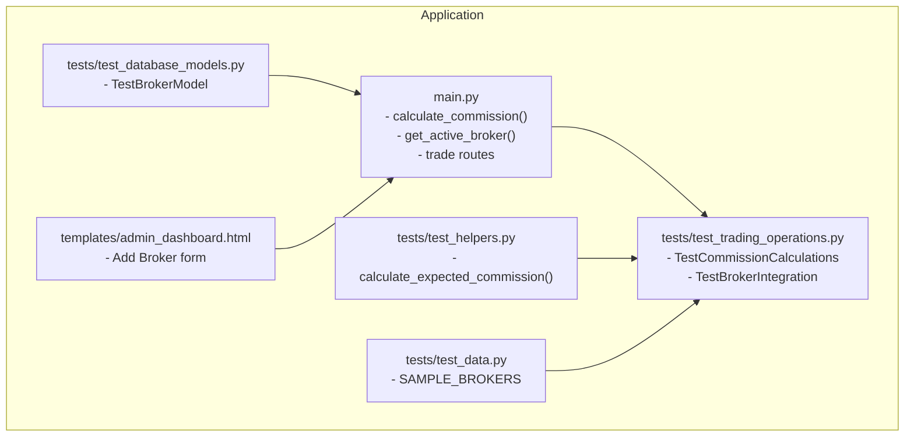
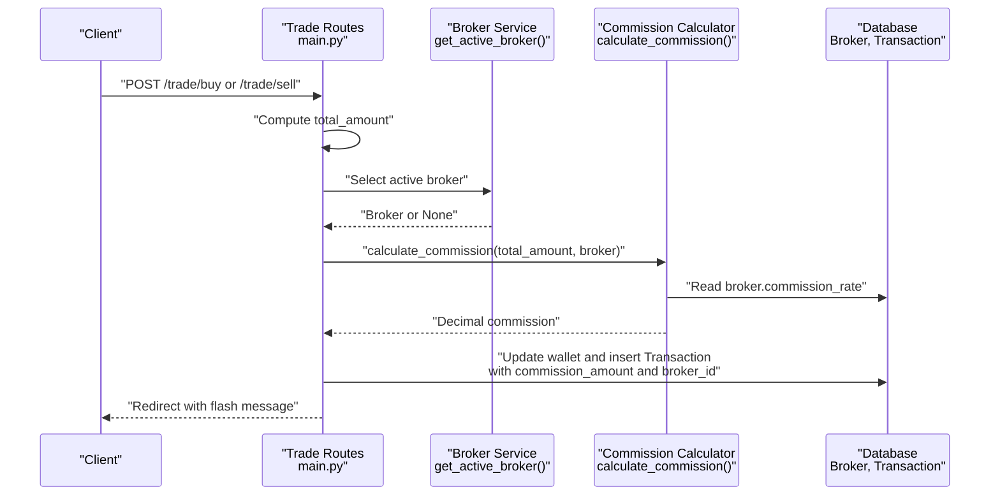
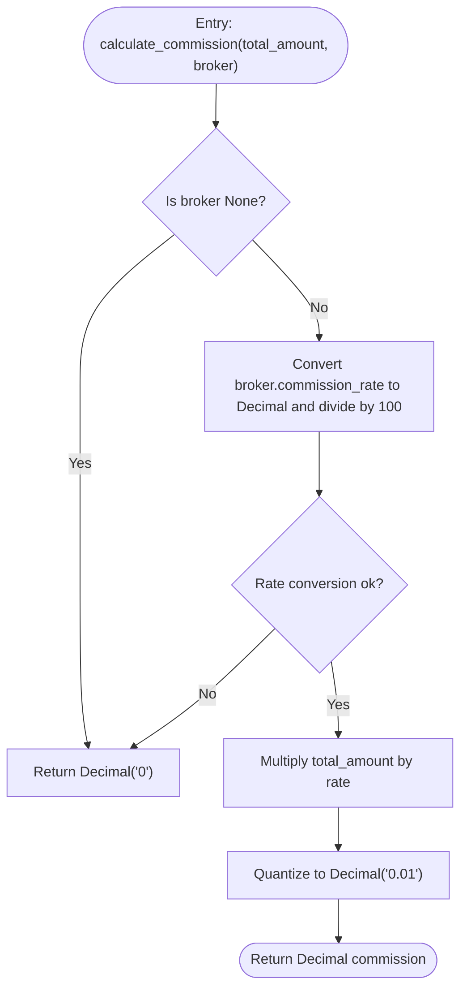
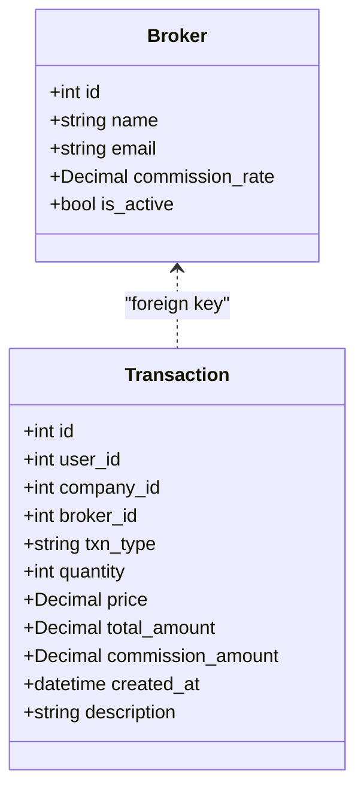
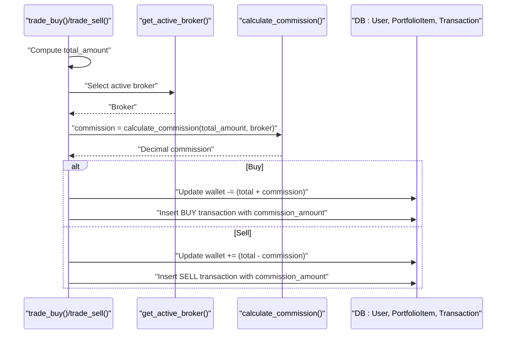
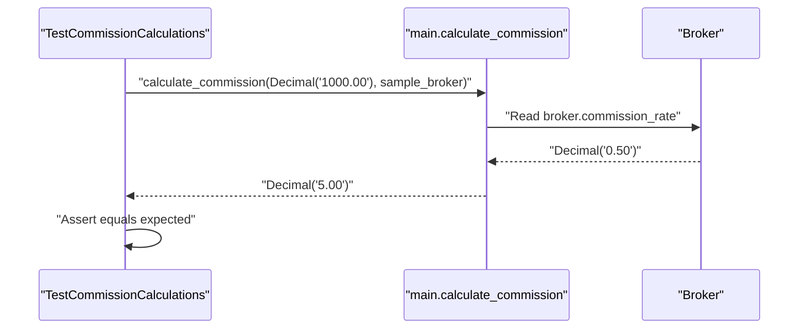
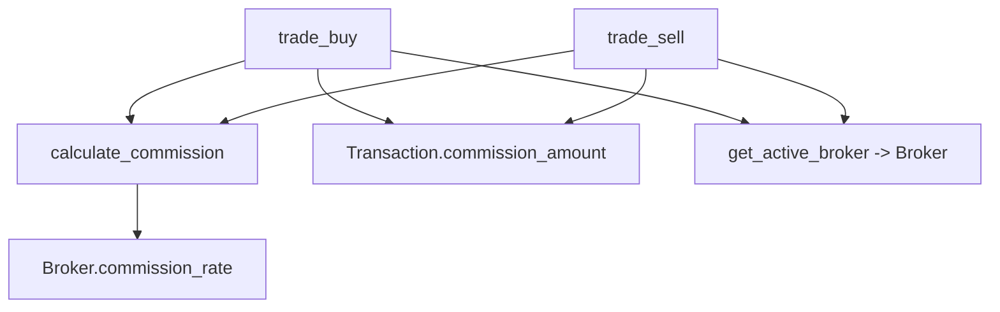

# Commission Calculations

<cite>
**Referenced Files in This Document**
- [main.py](file://main.py)
- [test_trading_operations.py](file://tests/test_trading_operations.py)
- [test_database_models.py](file://tests/test_database_models.py)
- [templates/admin_dashboard.html](file://templates/admin_dashboard.html)
- [test_data.py](file://tests/test_data.py)
- [test_helpers.py](file://tests/test_helpers.py)
</cite>

## Table of Contents
1. [Introduction](#introduction)
2. [Project Structure](#project-structure)
3. [Core Components](#core-components)
4. [Architecture Overview](#architecture-overview)
5. [Detailed Component Analysis](#detailed-component-analysis)
6. [Dependency Analysis](#dependency-analysis)
7. [Performance Considerations](#performance-considerations)
8. [Troubleshooting Guide](#troubleshooting-guide)
9. [Conclusion](#conclusion)
10. [Appendices](#appendices)

## Introduction
This document explains the commission calculation logic used in trading operations. It focuses on the calculate_commission function, the Broker model’s role in storing commission rates and selection of the active broker, and how commission impacts buy and sell transactions. It also documents configuration options, parameters, return values, and edge cases such as missing brokers, invalid commission rates, and zero-commission scenarios. Test coverage from test_trading_operations.py is used to illustrate behavior across different commission rates and transaction types.

## Project Structure
The commission calculation is implemented in the main application module and exercised by trading operation tests. The Broker model persists commission rates and activity status, and the admin interface allows adding and managing brokers.

**Diagram sources**
- [main.py](file://main.py#L172-L185)
- [test_trading_operations.py](file://tests/test_trading_operations.py#L206-L266)
- [test_database_models.py](file://tests/test_database_models.py#L158-L192)
- [test_helpers.py](file://tests/test_helpers.py#L270-L281)
- [templates/admin_dashboard.html](file://templates/admin_dashboard.html#L148-L159)
- [test_data.py](file://tests/test_data.py#L74-L109)

**Section sources**
- [main.py](file://main.py#L172-L185)
- [test_trading_operations.py](file://tests/test_trading_operations.py#L206-L266)
- [test_database_models.py](file://tests/test_database_models.py#L158-L192)
- [test_helpers.py](file://tests/test_helpers.py#L270-L281)
- [templates/admin_dashboard.html](file://templates/admin_dashboard.html#L148-L159)
- [test_data.py](file://tests/test_data.py#L74-L109)

## Core Components
- calculate_commission(total_amount, broker) → Decimal
  - Converts total_amount to Decimal
  - Reads broker.commission_rate and divides by 100 to get the rate fraction
  - Multiplies total_amount by rate
  - Quantizes to two decimal places using Decimal('0.01')
  - Returns Decimal representing commission amount
- get_active_broker() → Broker or None
  - Selects the first active broker ordered by id asc
- Broker model
  - Fields: id, name, email, commission_rate (Numeric(5,2)), is_active
  - Default commission_rate is 0; default is_active is True
- Transaction model
  - Stores commission_amount (Numeric(12,2)) and broker_id (foreign key)
- Trade routes
  - Buy route computes total, selects active broker, calculates commission, checks balance, updates wallet, and records transaction with commission_amount and broker_id
  - Sell route computes proceeds, selects active broker, calculates commission, updates wallet by adding proceeds minus commission, and records transaction

Key parameters and return values:
- calculate_commission(total_amount: Decimal, broker: Broker) → Decimal
- get_active_broker() → Broker or None
- Broker.commission_rate → Decimal (percentage)
- Transaction.commission_amount → Decimal (two-decimal precision)
- Trade routes return redirects with flash messages indicating success or validation errors

**Section sources**
- [main.py](file://main.py#L172-L185)
- [main.py](file://main.py#L290-L373)
- [main.py](file://main.py#L75-L81)
- [main.py](file://main.py#L94-L109)
- [test_trading_operations.py](file://tests/test_trading_operations.py#L206-L266)

## Architecture Overview
The commission calculation pipeline integrates the Broker model, the calculate_commission function, and the trading routes. The active broker is selected at runtime and influences both buy and sell outcomes.

**Diagram sources**
- [main.py](file://main.py#L172-L185)
- [main.py](file://main.py#L290-L373)
- [main.py](file://main.py#L75-L81)
- [main.py](file://main.py#L94-L109)

## Detailed Component Analysis

### calculate_commission Function
Behavior:
- Input: total_amount (Decimal), broker (Broker)
- Steps:
  - If broker is None, return Decimal('0')
  - Convert broker.commission_rate to Decimal and divide by Decimal('100') to get rate fraction
  - Multiply total_amount by rate
  - Quantize to two decimal places using Decimal('0.01')
  - Return Decimal commission amount

Edge cases handled:
- Missing broker: returns 0
- Invalid commission_rate: catches exceptions and returns 0
- Zero-commission scenario: returns 0 when rate is 0

Precision:
- Uses Decimal arithmetic throughout to avoid floating-point rounding errors
- Quantization ensures consistent two-decimal display and storage

**Diagram sources**
- [main.py](file://main.py#L172-L185)

**Section sources**
- [main.py](file://main.py#L172-L185)
- [test_trading_operations.py](file://tests/test_trading_operations.py#L206-L232)

### Broker Model and Active Broker Selection
- Broker fields:
  - commission_rate: Numeric(5,2) with default 0
  - is_active: Boolean default True
- Active broker selection:
  - get_active_broker() filters by is_active=True and orders by id asc, returning the first result
- Admin interface:
  - Form accepts name, email, commission_rate (step 0.01, min 0)
  - Displays brokers with commission % formatted to two decimals

Impact on transactions:
- Buy: commission is subtracted from wallet along with total cost
- Sell: commission is subtracted from proceeds

**Diagram sources**
- [main.py](file://main.py#L75-L81)
- [main.py](file://main.py#L94-L109)
- [templates/admin_dashboard.html](file://templates/admin_dashboard.html#L148-L159)

**Section sources**
- [main.py](file://main.py#L75-L81)
- [main.py](file://main.py#L172-L174)
- [templates/admin_dashboard.html](file://templates/admin_dashboard.html#L148-L159)
- [test_database_models.py](file://tests/test_database_models.py#L158-L192)
- [test_trading_operations.py](file://tests/test_trading_operations.py#L269-L303)

### Buy and Sell Impact
- Buy:
  - total = price × quantity
  - commission = calculate_commission(total, broker)
  - wallet updated by subtracting (total + commission)
  - transaction records total_amount, commission_amount, broker_id
- Sell:
  - total = price × quantity
  - commission = calculate_commission(total, broker)
  - wallet updated by adding (total - commission)
  - transaction records total_amount, commission_amount, broker_id

Validation:
- Buy: insufficient funds check includes commission
- Sell: insufficient shares check prevents overdraft

**Diagram sources**
- [main.py](file://main.py#L290-L373)
- [main.py](file://main.py#L172-L185)

**Section sources**
- [main.py](file://main.py#L290-L373)
- [test_trading_operations.py](file://tests/test_trading_operations.py#L233-L266)

### Test Coverage and Examples
- Commission calculation tests:
  - Positive rate: 0.50% on $1000 yields $5.00
  - Zero rate: $0.00 commission
- Broker integration tests:
  - Active broker selection returns a non-null active broker
  - Transactions record broker_id and commission_amount
- Helper for expected commission:
  - calculate_expected_commission(total_amount, commission_rate) returns Decimal with two-decimal quantization

**Diagram sources**
- [test_trading_operations.py](file://tests/test_trading_operations.py#L206-L218)
- [test_helpers.py](file://tests/test_helpers.py#L270-L281)

**Section sources**
- [test_trading_operations.py](file://tests/test_trading_operations.py#L206-L266)
- [test_helpers.py](file://tests/test_helpers.py#L270-L281)
- [test_data.py](file://tests/test_data.py#L74-L109)

## Dependency Analysis
- calculate_commission depends on:
  - Broker.commission_rate (Decimal)
  - Decimal arithmetic for precise computation and quantization
- get_active_broker depends on:
  - Broker.is_active flag and ordering by id
- Trade routes depend on:
  - calculate_commission for commission
  - Broker selection for broker_id and description
  - Transaction model for recording commission_amount and broker_id

**Diagram sources**
- [main.py](file://main.py#L172-L185)
- [main.py](file://main.py#L290-L373)
- [main.py](file://main.py#L75-L81)
- [main.py](file://main.py#L94-L109)

**Section sources**
- [main.py](file://main.py#L172-L185)
- [main.py](file://main.py#L290-L373)
- [main.py](file://main.py#L75-L81)
- [main.py](file://main.py#L94-L109)

## Performance Considerations
- Decimal arithmetic is used consistently to avoid floating-point drift and ensure deterministic rounding.
- Quantization to two decimals occurs once per commission calculation, minimizing overhead.
- Broker selection is a simple query with a small result set, negligible overhead.
- Transaction writes occur once per trade, with minimal additional overhead.

[No sources needed since this section provides general guidance]

## Troubleshooting Guide
Common issues and resolutions:
- Missing active broker:
  - Symptom: commission returns 0 and description defaults
  - Resolution: ensure at least one broker is active; the system selects the first active broker ordered by id
- Invalid commission rate:
  - Symptom: calculate_commission returns 0
  - Resolution: verify broker.commission_rate is a valid numeric value; admin form enforces non-negative values
- Zero-commission broker:
  - Behavior: commission is 0; transaction still recorded with commission_amount 0
- Insufficient funds on buy:
  - Symptom: flash message indicates insufficient balance including commission
  - Resolution: top up wallet or reduce quantity
- Insufficient shares on sell:
  - Symptom: flash message indicates not enough shares
  - Resolution: reduce quantity or acquire more shares
- Precision anomalies:
  - Ensure inputs are Decimal to preserve precision; quantization is applied in calculate_commission

**Section sources**
- [main.py](file://main.py#L172-L185)
- [main.py](file://main.py#L290-L373)
- [test_trading_operations.py](file://tests/test_trading_operations.py#L233-L266)

## Conclusion
The commission calculation logic is robust, precise, and well-integrated with the trading workflow. It uses Decimal arithmetic, quantizes to two decimals, and handles edge cases gracefully. The Broker model centralizes commission rate management, and the active broker is consistently selected for each transaction. Tests validate behavior across various commission rates and transaction types, ensuring reliability for both buy and sell operations.

[No sources needed since this section summarizes without analyzing specific files]

## Appendices

### Configuration Options and Parameters
- Broker creation (admin):
  - name: string
  - email: string (optional)
  - commission_rate: numeric percentage with two decimal places (min 0)
- Trade routes:
  - symbol: uppercase ticker
  - quantity: positive integer
- calculate_commission:
  - total_amount: Decimal
  - broker: Broker or None
  - returns: Decimal (two-decimal precision)

**Section sources**
- [templates/admin_dashboard.html](file://templates/admin_dashboard.html#L148-L159)
- [main.py](file://main.py#L290-L373)
- [main.py](file://main.py#L172-L185)