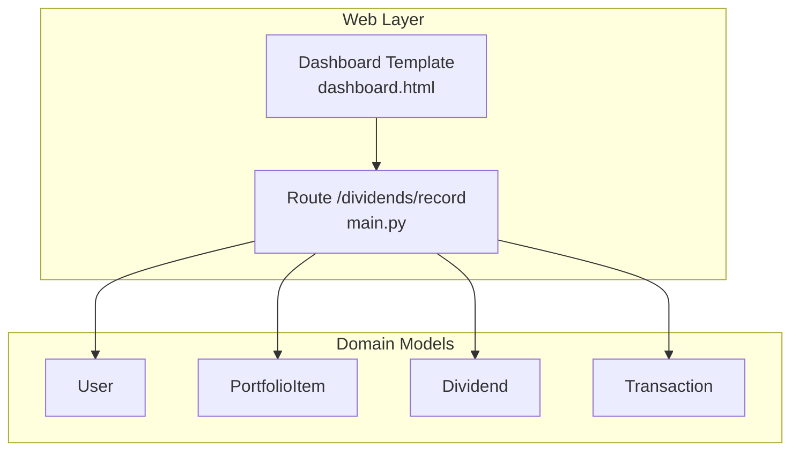
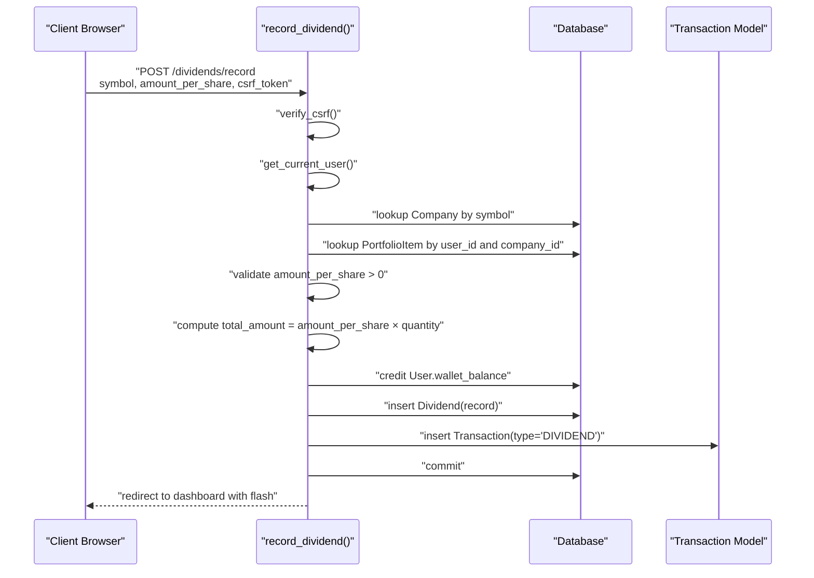
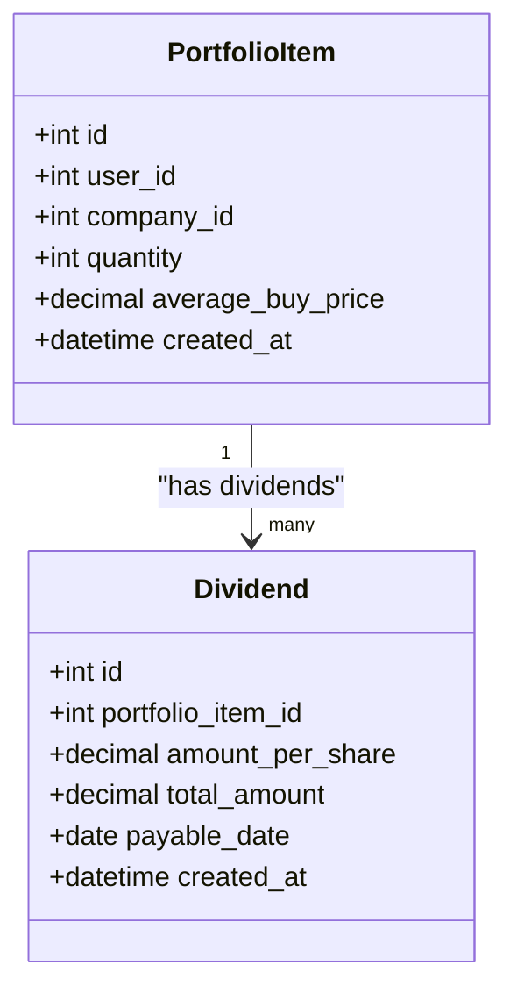
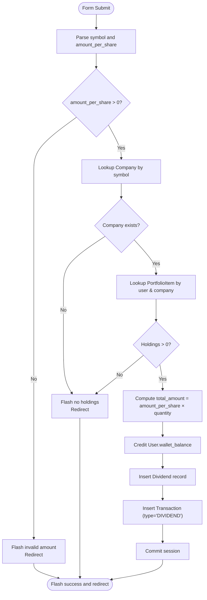
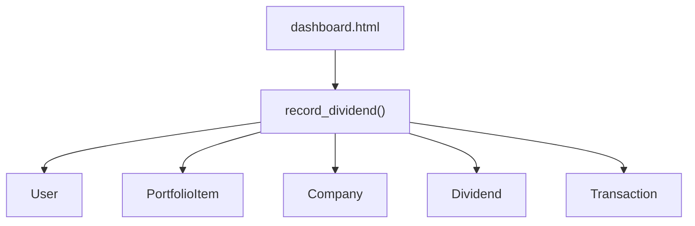
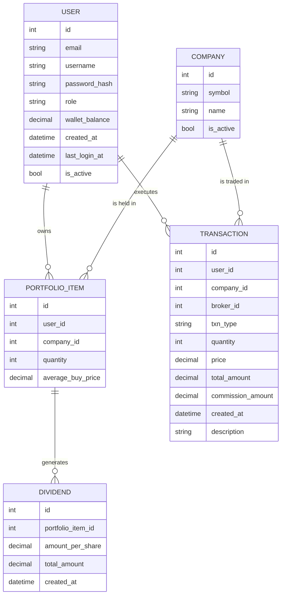
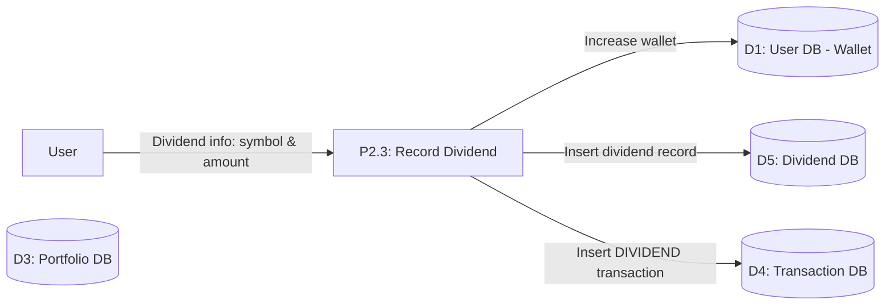

# Dividend Recording

<cite>
**Referenced Files in This Document**
- [main.py](file://main.py)
- [templates/dashboard.html](file://templates/dashboard.html)
- [tests/test_portfolio_management.py](file://tests/test_portfolio_management.py)
- [tests/test_database_models.py](file://tests/test_database_models.py)
- [docs/diagrams/er_diagram.md](file://docs/diagrams/er_diagram.md)
- [docs/diagrams/dfd_portfolio_level1.md](file://docs/diagrams/dfd_portfolio_level1.md)
- [docs/diagrams/gallery.html](file://docs/diagrams/gallery.html)
- [docs/diagrams/exported/dfd_level0.mmd](file://docs/diagrams/exported/dfd_level0.mmd)
</cite>

## Table of Contents
1. [Introduction](#introduction)
2. [Project Structure](#project-structure)
3. [Core Components](#core-components)
4. [Architecture Overview](#architecture-overview)
5. [Detailed Component Analysis](#detailed-component-analysis)
6. [Dependency Analysis](#dependency-analysis)
7. [Performance Considerations](#performance-considerations)
8. [Troubleshooting Guide](#troubleshooting-guide)
9. [Conclusion](#conclusion)
10. [Appendices](#appendices)

## Introduction
This document explains the dividend recording sub-feature in the investment simulation platform. It focuses on the end-to-end workflow for recording a dividend payment, including CSRF verification, user authentication, input validation, portfolio ownership checks, calculation of total payout, creation of dividend and transaction records, and crediting the user’s wallet. It also documents the domain model relationships between PortfolioItem and Dividend, clarifies the simulation nature of dividend recording, and outlines edge cases and test coverage.

## Project Structure
The dividend recording feature spans:
- Route handler that implements the workflow
- Data models for PortfolioItem, Dividend, User, and Transaction
- Frontend form on the dashboard to submit dividend data
- Tests verifying successful recording and error handling

**Diagram sources**
- [templates/dashboard.html](file://templates/dashboard.html#L115-L136)
- [main.py](file://main.py#L398-L433)
- [main.py](file://main.py#L50-L119)

**Section sources**
- [templates/dashboard.html](file://templates/dashboard.html#L115-L136)
- [main.py](file://main.py#L398-L433)
- [main.py](file://main.py#L50-L119)

## Core Components
- Route: POST /dividends/record
  - Enforces CSRF and login
  - Parses symbol and amount_per_share
  - Validates amount > 0
  - Resolves company and verifies holdings
  - Computes total_amount = amount_per_share × quantity
  - Credits user.wallet_balance
  - Creates Dividend record linked to PortfolioItem
  - Creates Transaction record with type “DIVIDEND”
  - Commits and redirects with flash messages

- Data Models:
  - PortfolioItem: holds user holdings with quantity and average buy price
  - Dividend: records per-share and total dividend linked to a PortfolioItem
  - Transaction: records all transactions including “DIVIDEND”
  - User: holds wallet_balance and other attributes

- Frontend Form:
  - Provides symbol and amount_per_share inputs with CSRF token
  - Submits to /dividends/record

**Section sources**
- [main.py](file://main.py#L398-L433)
- [main.py](file://main.py#L83-L119)
- [templates/dashboard.html](file://templates/dashboard.html#L115-L136)

## Architecture Overview
The dividend recording workflow is a request-response process that validates inputs, checks ownership, updates state atomically, and persists records.

**Diagram sources**
- [main.py](file://main.py#L398-L433)
- [main.py](file://main.py#L93-L109)

## Detailed Component Analysis

### Route: record_dividend
- Responsibilities:
  - CSRF verification
  - Authentication enforcement
  - Input parsing and validation
  - Ownership verification
  - Calculation of total dividend
  - State updates and persistence
  - Flash messaging and redirection

- Invocation relationships:
  - Uses verify_csrf() and get_current_user()
  - Queries Company and PortfolioItem
  - Updates User.wallet_balance
  - Inserts Dividend and Transaction
  - Commits session and flashes success/error

- Parameters and return:
  - Request parameters: symbol (string), amount_per_share (number), csrf_token (string)
  - Returns: redirect to dashboard with flash message

- Edge cases handled:
  - Invalid amount_per_share (non-numeric or <= 0)
  - Non-existent company or missing holdings
  - Zero or negative holdings

- Simulation note:
  - Dividends are recorded as simulation entries; no external payment is processed. The user’s wallet_balance is increased by the computed total.

**Section sources**
- [main.py](file://main.py#L398-L433)

### Domain Model: PortfolioItem and Dividend
- Relationship:
  - Dividend belongs to a PortfolioItem via portfolio_item_id
  - PortfolioItem has a backref “dividends” enabling querying all dividend records for a holding

- Implications:
  - Dividend records are tied to specific holdings, not to a user directly
  - This enables accurate attribution of dividend income to the underlying position

**Diagram sources**
- [main.py](file://main.py#L83-L119)

**Section sources**
- [main.py](file://main.py#L83-L119)
- [tests/test_database_models.py](file://tests/test_database_models.py#L298-L328)

### Frontend Form: Record Dividend
- Behavior:
  - Hidden csrf_token input
  - Inputs for symbol and amount_per_share
  - Submits to /dividends/record

- Notes:
  - The form enforces CSRF protection server-side
  - Amount precision is controlled by the input step

**Section sources**
- [templates/dashboard.html](file://templates/dashboard.html#L115-L136)

### Transaction Type: DIVIDEND
- Transaction model includes:
  - txn_type field set to “DIVIDEND”
  - price and total_amount fields capture per-share and total values
  - description field captures “Dividend payout recorded”

- Purpose:
  - Maintains a complete audit trail of dividend events alongside buy/sell transactions

**Section sources**
- [main.py](file://main.py#L93-L109)

### Workflow Flowchart

**Diagram sources**
- [main.py](file://main.py#L398-L433)

## Dependency Analysis
- Route depends on:
  - Authentication and CSRF helpers
  - Database models: Company, PortfolioItem, User, Dividend, Transaction
- Models depend on:
  - SQLAlchemy ORM and relationships
- Frontend depends on:
  - CSRF token generation and inclusion

**Diagram sources**
- [main.py](file://main.py#L398-L433)
- [main.py](file://main.py#L50-L119)
- [templates/dashboard.html](file://templates/dashboard.html#L115-L136)

**Section sources**
- [main.py](file://main.py#L398-L433)
- [main.py](file://main.py#L50-L119)

## Performance Considerations
- The route performs a small number of database reads and writes; performance is primarily bounded by database round-trips.
- Decimal arithmetic is used consistently to avoid floating-point errors.
- The route commits once after all changes are staged, minimizing transaction overhead.

[No sources needed since this section provides general guidance]

## Troubleshooting Guide
Common issues and resolutions:
- Invalid amount_per_share:
  - Cause: Non-numeric or zero/negative value
  - Resolution: Ensure amount_per_share is a positive number
  - Evidence: Tests assert error flash messages for invalid inputs

- Non-existent symbol or no holdings:
  - Cause: Company not found or user has no shares
  - Resolution: Verify symbol exists and user holds shares
  - Evidence: Tests assert “no holdings” flash messages

- CSRF or authentication failures:
  - Cause: Missing or mismatched CSRF token, not logged in
  - Resolution: Ensure CSRF token is included and user is authenticated
  - Evidence: CSRF verification and login decorators are enforced in the route

- Database consistency:
  - Ensure the PortfolioItem quantity is positive before recording
  - Confirm that the Company exists prior to lookup

**Section sources**
- [tests/test_portfolio_management.py](file://tests/test_portfolio_management.py#L274-L316)
- [main.py](file://main.py#L398-L433)

## Conclusion
The dividend recording feature provides a robust, simulation-based mechanism to credit users for dividend information tied to their holdings. It enforces CSRF and authentication, validates inputs, ensures ownership, computes payouts accurately, and persists both dividend and transaction records. The PortfolioItem-Dividend relationship ensures precise attribution of dividend income to specific holdings, contributing to accurate portfolio valuation and reporting.

## Appendices

### API Definition
- Endpoint: POST /dividends/record
- Authentication: Required
- CSRF: Required
- Parameters:
  - symbol (string, required)
  - amount_per_share (number, required)
- Behavior:
  - Validates amount > 0
  - Resolves company and holdings
  - Computes total_amount
  - Credits wallet_balance
  - Creates Dividend and DIVIDEND Transaction
- Responses:
  - Redirect to dashboard with success or error flash

**Section sources**
- [main.py](file://main.py#L398-L433)
- [templates/dashboard.html](file://templates/dashboard.html#L115-L136)

### Test Coverage Summary
- Successful dividend recording:
  - Asserts wallet balance increase equals expected total
  - Verifies transaction type “DIVIDEND” is created
- Error conditions:
  - Invalid symbol: no holdings flash
  - Negative amount: greater-than-zero flash

**Section sources**
- [tests/test_portfolio_management.py](file://tests/test_portfolio_management.py#L274-L316)

### ER Diagram Context
The ER diagram shows the relationships among User, Company, PortfolioItem, Transaction, and Dividend, highlighting how dividends are linked to holdings and how transactions capture all activity.

**Diagram sources**
- [docs/diagrams/er_diagram.md](file://docs/diagrams/er_diagram.md#L1-L68)
- [main.py](file://main.py#L50-L119)

### Portfolio-Level DFD Context
The portfolio-level DFD shows how dividend recording increases wallet, creates a dividend record, and inserts a DIVIDEND transaction.

**Diagram sources**
- [docs/diagrams/dfd_portfolio_level1.md](file://docs/diagrams/dfd_portfolio_level1.md#L1-L37)
- [docs/diagrams/gallery.html](file://docs/diagrams/gallery.html#L201-L214)