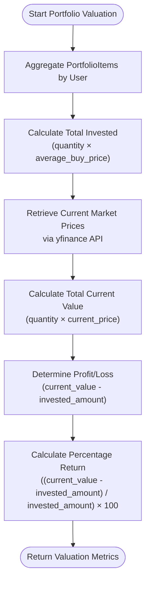
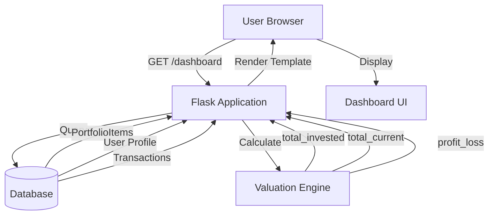
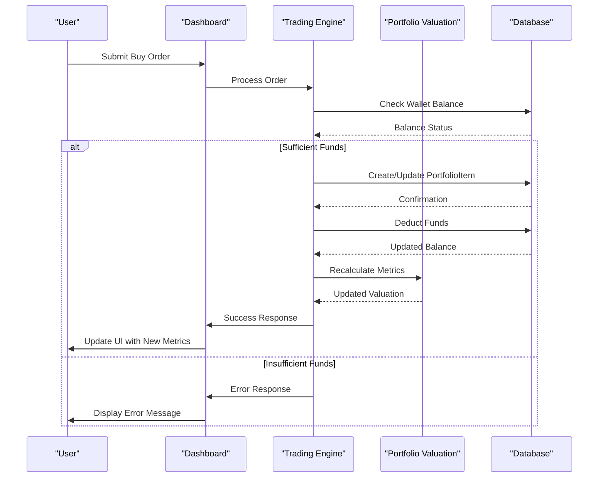
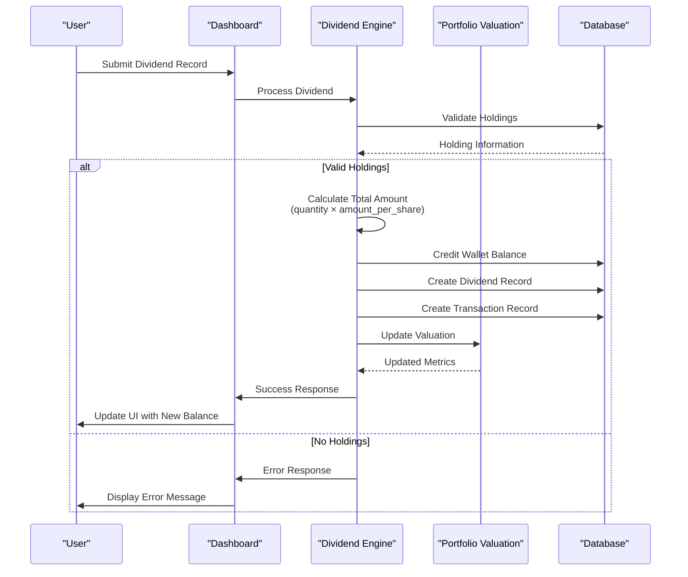
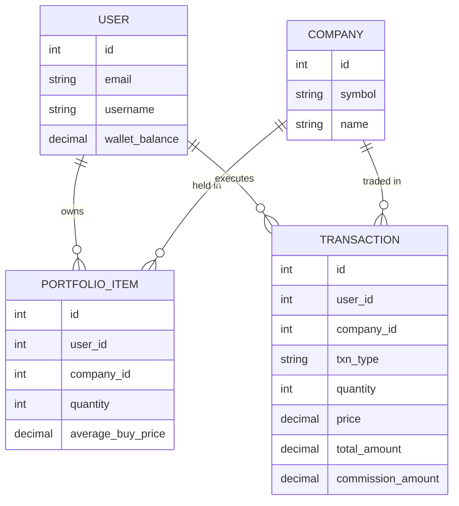

# Portfolio Valuation

<cite>
**Referenced Files in This Document**   
- [main.py](file://main.py)
- [test_portfolio_management.py](file://tests/test_portfolio_management.py)
- [dashboard.html](file://templates/dashboard.html)
</cite>

## Table of Contents
1. [Introduction](#introduction)
2. [Domain Model and Data Structures](#domain-model-and-data-structures)
3. [Valuation Algorithm Implementation](#valuation-algorithm-implementation)
4. [Dashboard Integration and User Interface](#dashboard-integration-and-user-interface)
5. [Integration with Trading Operations](#integration-with-trading-operations)
6. [Dividend Recording Integration](#dividend-recording-integration)
7. [Performance Considerations](#performance-considerations)
8. [Testing and Validation](#testing-and-validation)
9. [Common Issues and Solutions](#common-issues-and-solutions)

## Introduction
The Portfolio Valuation system is a core component of the intelligent stock prediction application, responsible for calculating key performance metrics for user investment portfolios. This system provides users with real-time insights into their portfolio's financial health by calculating total invested amount, current market value, profit/loss, and percentage return. The implementation uses precise financial calculations with the Decimal type to avoid floating-point errors and integrates with external market data sources to retrieve current stock prices. This documentation details the algorithms, data structures, and integration points that enable accurate portfolio valuation.

## Domain Model and Data Structures
The portfolio valuation system is built around several key data models that represent the financial entities in the system. The primary model is PortfolioItem, which tracks a user's holdings in a specific company, storing the quantity of shares owned and the average purchase price. This model establishes relationships with User and Company entities through foreign key references, enabling the aggregation of portfolio data by user.

Financial calculations in the system use the Decimal type from Python's decimal module to ensure precision and avoid floating-point arithmetic errors that could occur with standard floating-point numbers. This is critical for financial applications where even small rounding errors can accumulate and lead to significant discrepancies. The Decimal type allows for exact decimal representation and configurable precision, making it ideal for monetary calculations.

The system also includes Transaction and Dividend models that record financial activities affecting the portfolio. Transactions capture buy and sell operations, while Dividend records track dividend payments received by the user. These models work together to provide a complete picture of the portfolio's history and current state.

**Section sources**
- [main.py](file://main.py#L83-L91)
- [main.py](file://main.py#L30-L31)
- [main.py](file://main.py#L94-L108)
- [main.py](file://main.py#L111-L118)

## Valuation Algorithm Implementation
The portfolio valuation algorithm follows a systematic process to calculate key performance metrics. The calculation begins with aggregating all PortfolioItem records for a user, which represent their current holdings across different companies. For each portfolio item, the system calculates the total invested amount by multiplying the quantity of shares by the average buy price, using Decimal arithmetic to maintain precision.

**Diagram sources**
- [main.py](file://main.py#L258-L263)
- [main.py](file://main.py#L161-L169)

The system retrieves current market prices using the yfinance library, which provides access to real-time and historical stock data from Yahoo Finance. The get_latest_close_price function downloads price data for a specified symbol over a recent time period (typically the last 10 days) and returns the most recent closing price. This price is then used to calculate the current market value of each holding by multiplying it by the quantity of shares owned.

The profit/loss calculation determines the unrealized gain or loss by subtracting the total invested amount from the total current value of the portfolio. A positive result indicates an unrealized profit, while a negative result indicates an unrealized loss. The percentage return is calculated by dividing the profit/loss by the total invested amount and multiplying by 100, providing a normalized measure of portfolio performance that can be compared across different investment sizes.

**Section sources**
- [main.py](file://main.py#L258-L263)
- [main.py](file://main.py#L161-L169)
- [test_portfolio_management.py](file://tests/test_portfolio_management.py#L195-L224)

## Dashboard Integration and User Interface
The portfolio valuation metrics are prominently displayed on the user dashboard, providing a comprehensive overview of the user's financial position. The dashboard presents four key metrics in a card-based layout: wallet balance, total invested amount, current portfolio value, and unrealized profit/loss. These metrics are calculated server-side and passed to the template for rendering, ensuring that users see up-to-date information when they access their dashboard.

**Diagram sources**
- [main.py](file://main.py#L251-L265)
- [dashboard.html](file://templates/dashboard.html#L45-L95)

The dashboard template uses Bootstrap classes to create a responsive layout that adapts to different screen sizes. Each metric is displayed in a colored card with an appropriate icon, making it easy for users to quickly understand their portfolio status at a glance. The wallet balance card shows the available funds for new investments, while the total invested card displays the cumulative amount spent on purchases. The current value card shows the portfolio's worth at current market prices, and the profit/loss card highlights the difference between these two values.

The dashboard also includes interactive elements that allow users to modify their portfolio, such as forms for adding funds to their wallet and recording dividend payments. These actions trigger server-side calculations that immediately update the displayed metrics, providing real-time feedback on how these operations affect the portfolio's valuation.

**Section sources**
- [main.py](file://main.py#L251-L265)
- [dashboard.html](file://templates/dashboard.html#L1-L284)

## Integration with Trading Operations
The portfolio valuation system is tightly integrated with the trading operations functionality, ensuring that valuation metrics are updated in real-time as users execute buy and sell orders. When a user purchases additional shares of a stock they already own, the system recalculates the average buy price using a weighted average formula that combines the previous holdings with the new purchase. This ensures that the cost basis accurately reflects the blended purchase price across all transactions.

For buy operations, the system first validates that the user has sufficient funds in their wallet to cover the purchase amount plus any applicable commission fees. Once validated, it either creates a new PortfolioItem record for a new holding or updates an existing record by increasing the quantity and adjusting the average buy price. The total invested amount for the portfolio increases by the purchase value, while the wallet balance decreases by the total cost (purchase amount plus commission).

Sell operations reduce the quantity of shares in a PortfolioItem and increase the wallet balance by the proceeds from the sale (sale amount minus commission). If a sell operation reduces the quantity to zero, the PortfolioItem record is deleted from the database. The system ensures that users cannot sell more shares than they own by validating the requested quantity against the current holdings before executing the transaction.

**Diagram sources**
- [main.py](file://main.py#L268-L324)
- [main.py](file://main.py#L327-L375)
- [test_portfolio_management.py](file://tests/test_portfolio_management.py#L78-L100)

**Section sources**
- [main.py](file://main.py#L268-L375)
- [test_portfolio_management.py](file://tests/test_portfolio_management.py#L78-L100)

## Dividend Recording Integration
The portfolio valuation system integrates with the dividend recording functionality to ensure that dividend payments are properly accounted for in the user's financial position. When a user records a dividend payment, the system calculates the total amount based on the dividend per share and the number of shares held, then credits this amount to the user's wallet balance. This integration ensures that dividend income is reflected in the overall portfolio valuation.

The dividend recording process begins with user input of the stock symbol and the dividend amount per share. The system validates that the user owns shares in the specified company and retrieves the current holding information. It then calculates the total dividend payment by multiplying the dividend per share by the number of shares owned, using Decimal arithmetic to maintain precision. This total amount is added to the user's wallet balance, increasing their available funds for future investments.

**Diagram sources**
- [main.py](file://main.py#L398-L433)
- [test_portfolio_management.py](file://tests/test_portfolio_management.py#L277-L291)

The system creates both a Dividend record and a corresponding Transaction record to maintain a complete audit trail of financial activities. The Transaction record is marked with a "DIVIDEND" type and includes details such as the quantity of shares, the dividend amount per share, and a description of the transaction. This integration ensures that dividend payments are visible in the user's transaction history alongside buy and sell operations, providing a comprehensive view of all portfolio activities.

**Section sources**
- [main.py](file://main.py#L398-L433)
- [test_portfolio_management.py](file://tests/test_portfolio_management.py#L277-L291)

## Performance Considerations
The portfolio valuation system is designed with performance considerations to handle portfolios with many holdings efficiently. For portfolios with numerous positions, the system batches database queries to minimize round-trips and uses efficient aggregation functions to calculate totals. The valuation calculations themselves are relatively lightweight, involving simple arithmetic operations that scale linearly with the number of holdings.

To optimize market data retrieval, the system could implement caching strategies for price data, as stock prices typically don't change significantly between requests within short time periods. While the current implementation fetches prices directly from yfinance for each dashboard request, a caching layer could store recent price data for frequently accessed symbols, reducing API calls and improving response times. This would be particularly beneficial for users with large portfolios containing many different stocks.

The use of Decimal arithmetic, while essential for financial accuracy, does introduce some performance overhead compared to native floating-point operations. However, this trade-off is necessary to ensure the precision required for financial calculations. The system mitigates this impact by performing calculations only when necessary—primarily when the dashboard is loaded or after portfolio modifications—rather than continuously recalculating values.

For very large portfolios, the system could implement pagination or lazy loading for the holdings table, displaying only a subset of positions at a time while still showing aggregated valuation metrics. This would improve the user experience by reducing initial page load times while maintaining access to complete portfolio information.

**Section sources**
- [main.py](file://main.py#L258-L263)
- [docs/FINVADER_IMPLEMENTATION_SUMMARY.md](file://docs/FINVADER_IMPLEMENTATION_SUMMARY.md#L84-L91)

## Testing and Validation
The portfolio valuation system is thoroughly tested using a comprehensive suite of unit tests that validate the accuracy of calculations under various market conditions and portfolio compositions. The test_portfolio_management.py file contains multiple test cases that verify the correctness of total invested amount calculations, current portfolio value computations, profit/loss determinations, and percentage return calculations.

The tests use mocked market data to simulate different price scenarios, allowing the system to be tested with known inputs and expected outputs. For example, a test might create a portfolio with 10 shares purchased at $150 each, then verify that the total invested amount is correctly calculated as $1,500. When combined with a mocked current price of $175.50, the system should calculate a current value of $1,755, a profit of $255, and a percentage return of approximately 17%.

**Diagram sources**
- [test_portfolio_management.py](file://tests/test_portfolio_management.py#L162-L236)
- [docs/diagrams/er_diagram.md](file://docs/diagrams/er_diagram.md#L1-L68)

The test suite also validates edge cases such as empty portfolios, portfolios with a single holding, and portfolios with multiple holdings across different companies. It verifies that the system correctly handles the addition and removal of holdings, the recalculation of average buy prices after additional purchases, and the deletion of portfolio items when quantities reach zero. These tests ensure that the valuation system remains accurate and reliable across a wide range of usage scenarios.

**Section sources**
- [test_portfolio_management.py](file://tests/test_portfolio_management.py#L162-L236)

## Common Issues and Solutions
Several common issues may arise when using the portfolio valuation system, and understanding these can help users and developers troubleshoot problems effectively. One potential issue is delayed price updates, as the system retrieves current market prices from external APIs which may have rate limits or temporary outages. When price data cannot be retrieved, the system may fall back to using the average buy price or display an error message to the user.

Another common issue relates to timing differences between market data sources and the user's transactions. Since the system uses the most recent closing price from yfinance, there may be discrepancies between the displayed current value and real-time market prices, especially for users checking their portfolio during market hours. This is an inherent limitation of using end-of-day pricing data rather than real-time quotes.

Users may also encounter issues with dividend recording if they enter incorrect symbol information or attempt to record dividends for stocks they don't own. The system validates these inputs and provides appropriate error messages, but users should ensure they have accurate information before recording dividend payments. Additionally, users should be aware that dividend amounts are recorded as received and do not account for tax implications, which may affect the actual net amount available.

For developers, a key consideration is ensuring that all financial calculations use Decimal arithmetic consistently throughout the codebase. Mixing Decimal and floating-point calculations can lead to precision errors and inconsistent results. The test suite helps catch these issues by validating calculation accuracy to within a small tolerance, but developers should be vigilant about using the correct numeric types when implementing new features or modifying existing ones.

**Section sources**
- [main.py](file://main.py#L286-L289)
- [main.py](file://main.py#L353-L356)
- [main.py](file://main.py#L413-L420)
- [test_portfolio_management.py](file://tests/test_portfolio_management.py#L293-L305)