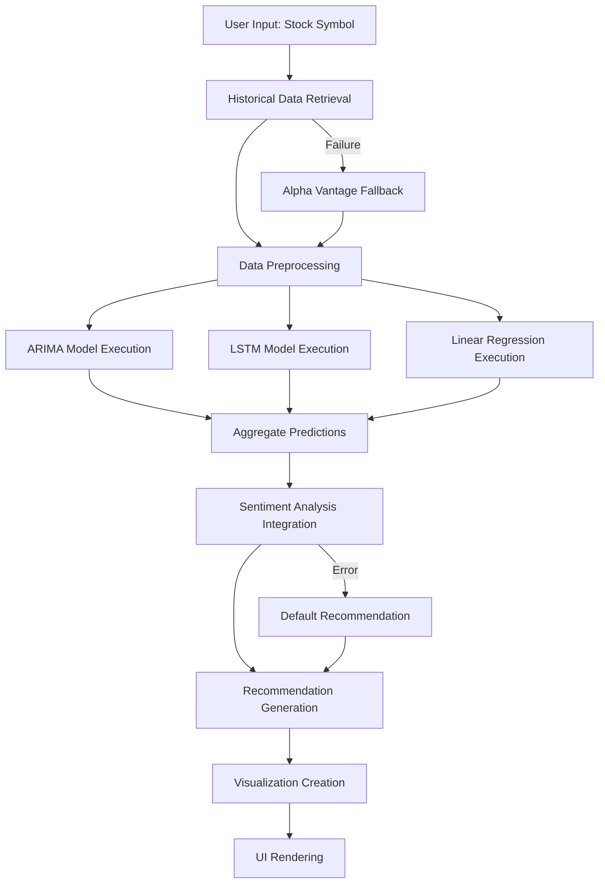
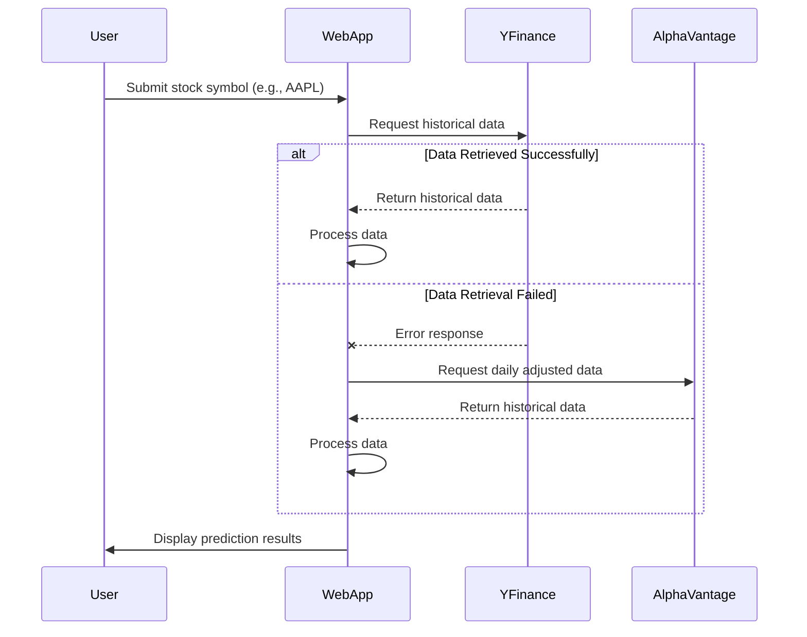
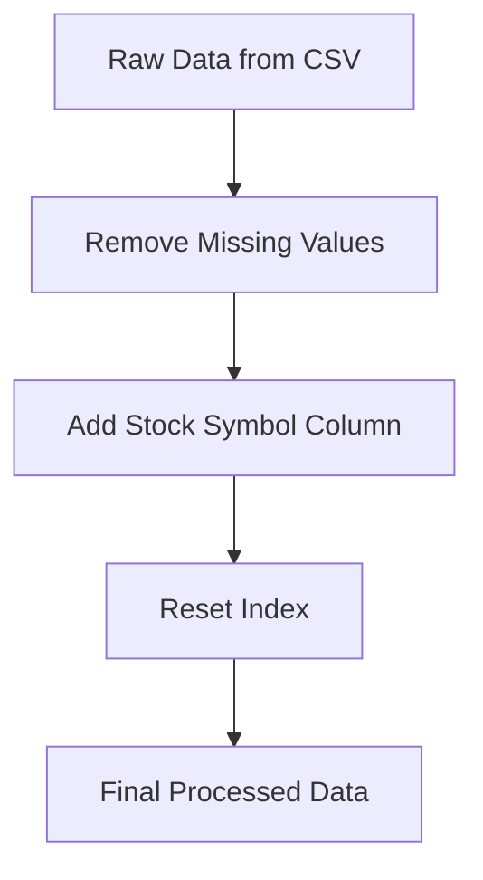
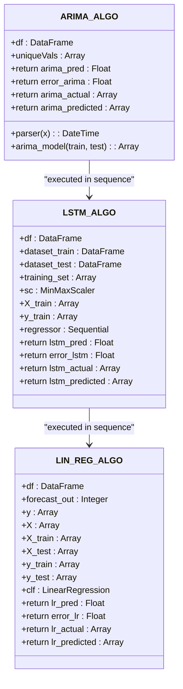
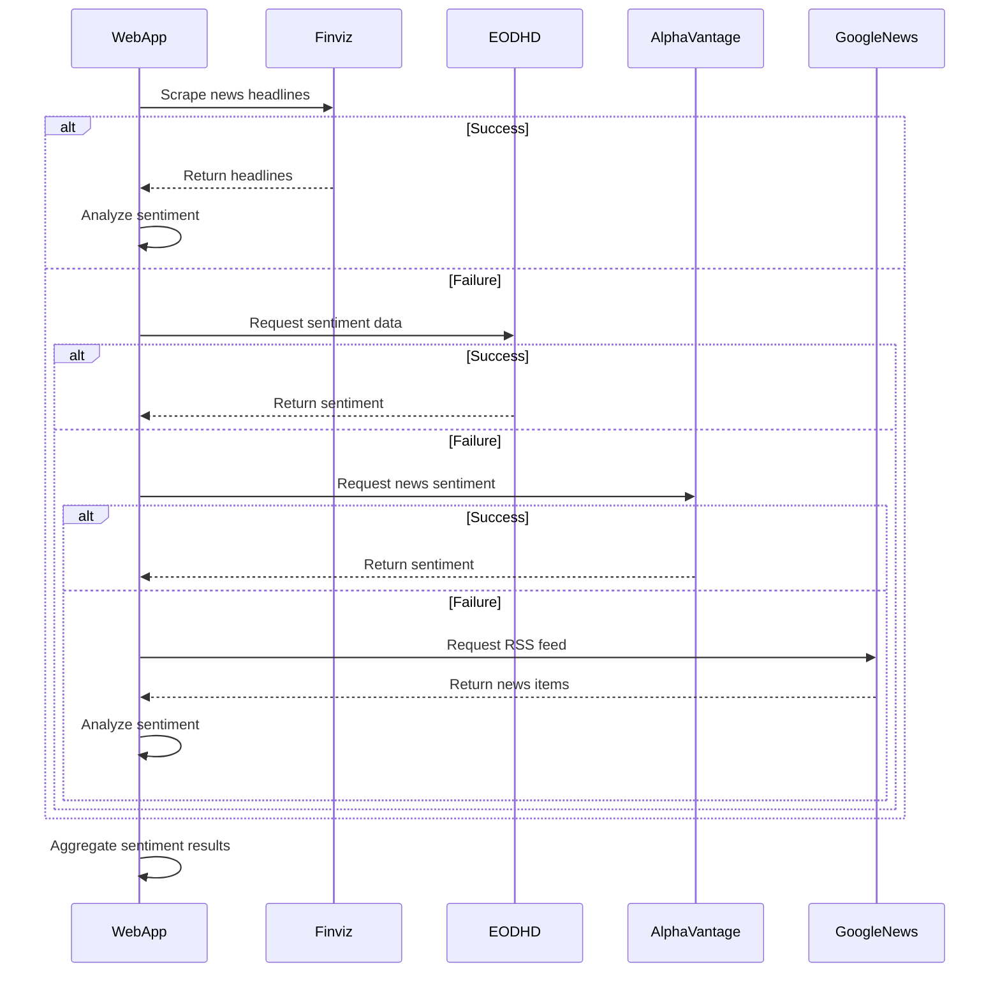
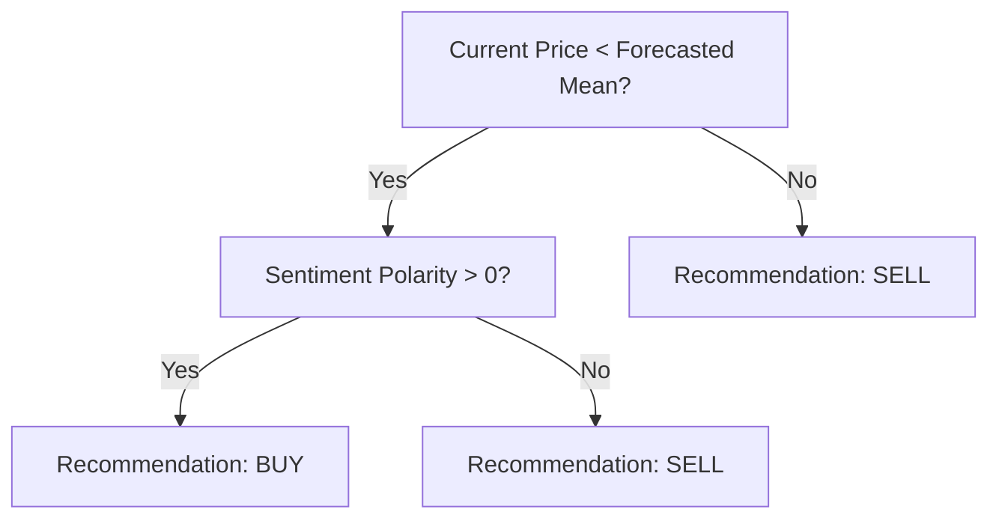
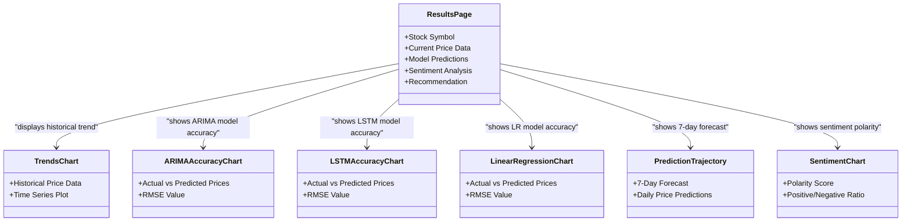
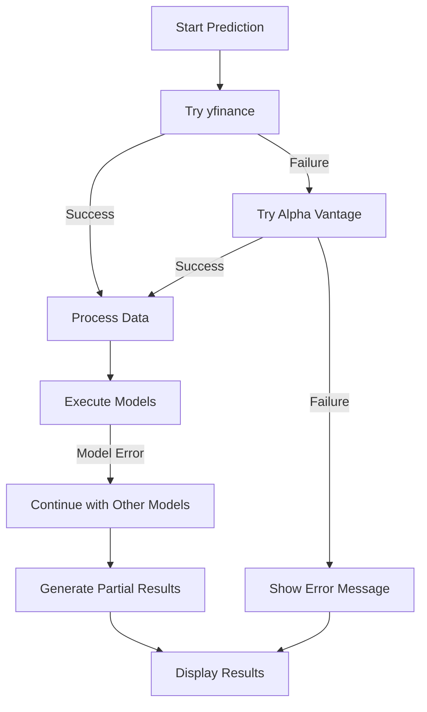
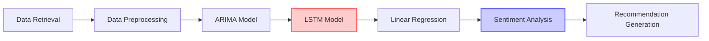
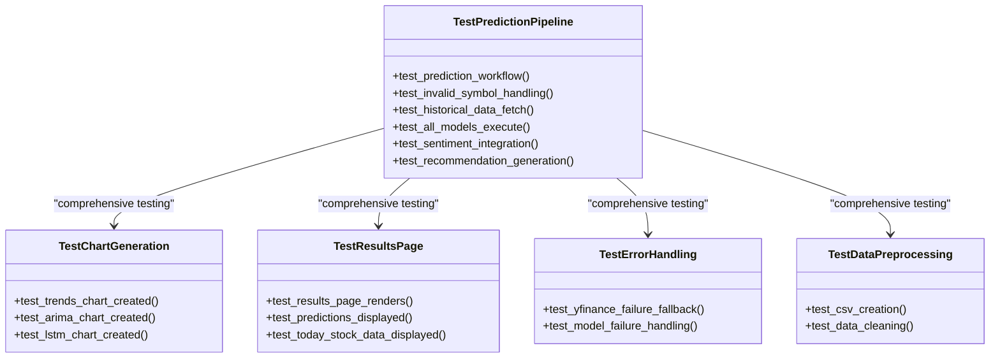

# Prediction Pipeline

<cite>
**Referenced Files in This Document**   
- [main.py](file://main.py)
- [news_sentiment.py](file://news_sentiment.py)
- [tests/test_prediction_pipeline.py](file://tests/test_prediction_pipeline.py)
- [templates/results.html](file://templates/results.html)
</cite>

## Table of Contents
1. [Introduction](#introduction)
2. [End-to-End Prediction Workflow](#end-to-end-prediction-workflow)
3. [Data Retrieval and Fallback Mechanisms](#data-retrieval-and-fallback-mechanisms)
4. [Data Preprocessing and Storage](#data-preprocessing-and-storage)
5. [Model Execution and Prediction](#model-execution-and-prediction)
6. [Sentiment Analysis Integration](#sentiment-analysis-integration)
7. [Recommendation Generation](#recommendation-generation)
8. [Visualization and UI Integration](#visualization-and-ui-integration)
9. [Error Handling and Edge Cases](#error-handling-and-edge-cases)
10. [Performance Considerations](#performance-considerations)
11. [Testing and Validation](#testing-and-validation)

## Introduction
The Prediction Pipeline is the core functionality of the intelligent stock prediction system, responsible for transforming a user's stock symbol input into comprehensive forecasts and investment recommendations. This pipeline orchestrates multiple components including data retrieval, machine learning models, sentiment analysis, and visualization to deliver actionable insights. The system is designed to be robust, handling various error conditions and providing fallback mechanisms when primary data sources fail. The pipeline integrates three distinct machine learning models (ARIMA, LSTM, and Linear Regression) with sentiment analysis to generate BUY/SELL/HOLD recommendations, providing users with a comprehensive view of potential stock movements.

## End-to-End Prediction Workflow
The prediction pipeline follows a structured sequence from user input to forecast visualization, processing through multiple stages to deliver comprehensive stock predictions. The workflow begins when a user submits a stock symbol through the web interface, initiating a series of coordinated operations that transform raw data into actionable investment insights.

**Diagram sources**
- [main.py](file://main.py#L545-L959)
- [news_sentiment.py](file://news_sentiment.py#L737-L800)

The pipeline begins with the user entering a stock symbol (e.g., "AAPL") in the web interface. This triggers the `/predict` route in the Flask application, which initiates the prediction workflow. The system first attempts to retrieve historical stock data using the yfinance library, which provides comprehensive financial data including open, high, low, close prices, and volume. If yfinance fails to retrieve data (due to network issues, invalid symbols, or API limitations), the system implements a fallback mechanism by attempting to retrieve data from Alpha Vantage, ensuring continuity of service even when primary data sources are unavailable.

Once historical data is successfully retrieved, the pipeline proceeds to data preprocessing, where the raw data is cleaned, structured, and prepared for model consumption. This includes handling MultiIndex columns that may be present in yfinance responses, removing any missing values, and organizing the data into a consistent format. The preprocessed data is then used to execute three distinct machine learning models in parallel: ARIMA for time series forecasting, LSTM for deep learning-based prediction, and Linear Regression for trend analysis. Each model generates its own price prediction and associated metrics.

The individual model predictions are then aggregated and combined with sentiment analysis results to generate a comprehensive recommendation. The sentiment analysis component fetches news and social media content related to the stock, analyzes the emotional tone of this content, and produces a polarity score that indicates market sentiment. This sentiment data is integrated with the quantitative predictions to determine whether the overall outlook for the stock is positive (BUY), negative (SELL), or neutral (HOLD).

Finally, the pipeline generates visualization assets including trend charts, model accuracy plots, and prediction trajectories, which are rendered in the results page alongside the recommendation. The entire process is designed to provide users with a holistic view of the stock's potential performance, combining quantitative analysis with qualitative sentiment assessment.

**Section sources**
- [main.py](file://main.py#L545-L959)
- [templates/results.html](file://templates/results.html#L1-L935)

## Data Retrieval and Fallback Mechanisms
The prediction pipeline implements a robust data retrieval system with multiple fallback mechanisms to ensure reliable access to historical stock data. The primary data source is yfinance, a Python library that provides free access to historical market data from Yahoo Finance. When a user requests a prediction for a specific stock symbol, the system first attempts to retrieve the last two years of daily historical data using yfinance.

**Diagram sources**
- [main.py](file://main.py#L550-L581)
- [tests/test_prediction_pipeline.py](file://tests/test_prediction_pipeline.py#L155-L164)

The data retrieval process is implemented in the `get_historical` function within main.py, which takes a stock symbol as input and attempts to download the corresponding historical data. The function requests data for the past two years, which provides sufficient historical context for the machine learning models while maintaining reasonable response times. A critical aspect of this implementation is the handling of MultiIndex columns that yfinance may return in its data structure. The pipeline explicitly flattens these MultiIndex columns by extracting the first level of the index, ensuring consistent data formatting regardless of the source.

When yfinance fails to retrieve data—either due to an invalid stock symbol, network connectivity issues, or temporary API unavailability—the system implements a fallback mechanism using Alpha Vantage. This secondary data source provides an alternative pathway to obtain historical stock information, enhancing the system's reliability. The fallback is implemented through a try-except block that catches any exceptions raised during the yfinance data retrieval process and redirects to Alpha Vantage as an alternative source.

The fallback mechanism is particularly important for maintaining system availability and user experience. Without this redundancy, any failure in the primary data source would result in a complete breakdown of the prediction functionality. By implementing this fallback, the system can continue to provide predictions even when one data source is temporarily unavailable, demonstrating a thoughtful approach to error resilience and service continuity.

**Section sources**
- [main.py](file://main.py#L550-L581)
- [tests/test_prediction_pipeline.py](file://tests/test_prediction_pipeline.py#L155-L164)

## Data Preprocessing and Storage
After successful data retrieval, the prediction pipeline performs essential preprocessing steps to prepare the historical stock data for model execution. The preprocessing phase addresses several data quality and formatting issues to ensure the machine learning models receive consistent, clean input. The first step involves reading the data from a CSV file that was created during the retrieval phase, with the filename corresponding to the stock symbol (e.g., "AAPL.csv").

The pipeline then performs data cleaning by removing any rows with missing values using the `dropna()` method. This is crucial because machine learning models cannot process missing data, and leaving gaps in the time series could lead to inaccurate predictions. The cleaned data is further processed by adding a "Code" column that contains the stock symbol, which is used later in the modeling process to identify the data source.

**Diagram sources**
- [main.py](file://main.py#L920-L932)
- [tests/test_prediction_pipeline.py](file://tests/test_prediction_pipeline.py#L190-L198)

A key aspect of the preprocessing workflow is the creation of CSV files for each stock symbol. This local storage mechanism serves multiple purposes: it provides persistence between sessions, enables faster subsequent predictions for the same stock, and facilitates debugging and analysis. The CSV files contain all relevant historical data including date, open, high, low, close, adjusted close, and volume information, structured in a tabular format that can be easily consumed by the machine learning models.

The preprocessing pipeline also handles the temporal aspect of the data by ensuring the most recent stock information is readily available. The system extracts the latest trading day's data (referred to as "today_stock") which includes the open, high, low, close prices, and volume. This information is displayed prominently in the results interface, giving users immediate context for the predictions being generated.

**Section sources**
- [main.py](file://main.py#L920-L932)
- [tests/test_prediction_pipeline.py](file://tests/test_prediction_pipeline.py#L182-L188)

## Model Execution and Prediction
The prediction pipeline executes three distinct machine learning models—ARIMA, LSTM, and Linear Regression—to generate comprehensive stock price forecasts. Each model approaches the prediction problem from a different methodological perspective, providing diverse insights that are later aggregated to form a robust recommendation. The models are executed sequentially on the preprocessed historical data, with each producing a prediction for the next day's closing price along with performance metrics.

The ARIMA (AutoRegressive Integrated Moving Average) model is implemented as a time series forecasting algorithm that captures patterns in the historical price data. It uses an order of (6,1,0), indicating six autoregressive terms, one level of differencing, and no moving average components. The model is trained on 80% of the historical data and tested on the remaining 20%, with predictions generated iteratively by incorporating actual values as they become available. This approach, known as a rolling forecast origin, provides a realistic assessment of the model's predictive capability.

**Diagram sources**
- [main.py](file://main.py#L584-L845)
- [tests/test_prediction_pipeline.py](file://tests/test_prediction_pipeline.py#L73-L79)

The LSTM (Long Short-Term Memory) model represents a deep learning approach to stock prediction, leveraging a neural network architecture specifically designed for sequence prediction tasks. The implementation uses a Sequential model with four LSTM layers (three with return_sequences=True and one without) followed by dropout layers for regularization and a dense output layer. The model is trained for 25 epochs with a batch size of 32, using the Adam optimizer and mean squared error loss function. Before training, the data is normalized using MinMaxScaler to ensure all values fall within the range [0,1], which improves the stability and convergence of the neural network training process.

The Linear Regression model provides a simpler, interpretable approach to prediction by establishing a linear relationship between historical prices and future values. The implementation creates a new target variable by shifting the closing prices forward by seven days, effectively creating a supervised learning problem where the model learns to predict prices one week in advance. The features consist of the current closing price, while the target is the closing price seven days later. The model is trained on 80% of the data and evaluated on the remaining 20%, with predictions scaled back to their original range after the model generates its output.

Each model returns not only the predicted price but also the RMSE (Root Mean Square Error) as a measure of prediction accuracy, along with arrays of actual and predicted values for visualization purposes. These metrics allow users to assess the reliability of each model's predictions and understand the historical performance of the forecasting algorithms.

**Section sources**
- [main.py](file://main.py#L584-L845)
- [tests/test_prediction_pipeline.py](file://tests/test_prediction_pipeline.py#L73-L79)

## Sentiment Analysis Integration
The prediction pipeline integrates sentiment analysis to complement the quantitative predictions from machine learning models with qualitative market sentiment derived from news and social media sources. This integration is implemented through the `finviz_finvader_sentiment` function, which analyzes financial news content to determine the overall emotional tone surrounding a particular stock.

The sentiment analysis process begins by scraping news headlines from Finviz, a financial website that provides timely market news. The system uses BeautifulSoup to parse the HTML content of the stock's Finviz page, extracting article titles and links from the news table. For each article, the system attempts to retrieve the full text using the newspaper3k library, which can download and parse content from various news websites. When full article text is unavailable, the system falls back to using the headline as the basis for sentiment analysis.

**Diagram sources**
- [news_sentiment.py](file://news_sentiment.py#L747-L784)
- [main.py](file://main.py#L944)

The sentiment analysis itself is performed using a combination of VADER (Valence Aware Dictionary and sEntiment Reasoner) and FinVADER, a financial-domain adaptation of VADER. These sentiment analysis tools assign polarity scores to text content, with values ranging from -1 (extremely negative) to +1 (extremely positive). The system aggregates sentiment scores from multiple articles to produce an overall polarity score for the stock, along with counts of positive, negative, and neutral articles.

The integration of sentiment analysis follows a cascading approach, attempting to retrieve data from multiple sources in sequence if earlier attempts fail. After attempting to scrape Finviz, the system tries EODHD API as a fallback, followed by Alpha Vantage News & Sentiments API, and finally Google News RSS as a last resort. This multi-source approach ensures that sentiment analysis can proceed even when individual sources are unavailable, enhancing the robustness of the overall prediction system.

The sentiment analysis results are structured as a tuple containing the overall polarity score, a list of news headlines, an array of individual sentiment scores, and counts of positive, negative, and neutral articles. This comprehensive output provides both a summary metric and detailed information that can be displayed to users, allowing them to understand both the quantitative sentiment score and the qualitative content that contributed to it.

**Section sources**
- [news_sentiment.py](file://news_sentiment.py#L747-L784)
- [main.py](file://main.py#L944)

## Recommendation Generation
The prediction pipeline generates investment recommendations by combining quantitative predictions from machine learning models with qualitative sentiment analysis results. The recommendation logic is implemented in the `recommending` function, which evaluates both the predicted price trajectory and market sentiment to determine whether the overall outlook for a stock is positive (BUY), negative (SELL), or neutral (HOLD).

The recommendation algorithm follows a hierarchical decision process that prioritizes certain conditions over others. The primary decision criterion compares the current closing price with the mean of the forecasted prices for the next seven days. If the current price is below the forecasted mean, the system considers this a potential buying opportunity. However, this quantitative assessment is then tempered by the sentiment analysis results: only if the overall sentiment polarity is positive does the system generate a BUY recommendation. If the sentiment is neutral or negative despite the favorable price position, the system recommends SELL, reflecting a cautious approach that prioritizes negative sentiment over positive price trends.

**Diagram sources**
- [main.py](file://main.py#L885-L904)
- [templates/results.html](file://templates/results.html#L414-L416)

The recommendation generation process is designed to be conservative, erring on the side of caution when there is conflicting information from different sources. This approach reflects the high-risk nature of stock market investments, where avoiding losses is often more important than capturing every potential gain. The system does not generate HOLD recommendations in the current implementation, instead defaulting to SELL when conditions for BUY are not met.

The recommendation is presented to users through the results interface with clear, actionable language that explains the rationale behind the suggestion. For example, "According to the ML Predictions and Sentiment Analysis, a RISE in AAPL stock is expected ⇒ BUY" provides both the conclusion and the reasoning, helping users understand the basis for the recommendation. This transparency is important for building user trust in the system's predictions, especially when the recommendation might contradict a user's own analysis or expectations.

The integration of multiple data sources in the recommendation process creates a more holistic assessment than would be possible with any single approach. By combining time series forecasting, deep learning predictions, and sentiment analysis, the system can identify situations where quantitative models might be missing important qualitative factors, or vice versa. This multi-faceted approach helps mitigate the limitations of individual prediction methods and provides a more balanced view of potential stock movements.

**Section sources**
- [main.py](file://main.py#L885-L904)
- [templates/results.html](file://templates/results.html#L414-L416)

## Visualization and UI Integration
The prediction pipeline generates multiple visualization assets that are integrated into the results interface to provide users with intuitive, graphical representations of the prediction data. These visualizations include trend charts, model accuracy plots, and prediction trajectories that help users interpret the quantitative results and understand the confidence level of the predictions.

The system creates three primary visualization assets: Trends.png, ARIMA.png, and LSTM.png. The Trends.png chart displays the historical price trend for the stock, providing context for the predictions being generated. This chart is created using matplotlib and shows the closing price over time, allowing users to visualize the long-term trajectory of the stock. The ARIMA.png and LSTM.png charts compare actual versus predicted prices for their respective models, with the actual prices shown as a dotted line and the predicted prices as a solid line. These accuracy charts help users assess how well each model has performed on historical data, providing insight into the reliability of the future predictions.

**Diagram sources**
- [main.py](file://main.py#L612-L614)
- [main.py](file://main.py#L627-L632)
- [main.py](file://main.py#L754-L760)
- [main.py](file://main.py#L824-L830)
- [templates/results.html](file://templates/results.html#L151-L205)

These static images are complemented by interactive D3.js visualizations that provide enhanced user engagement and deeper data exploration capabilities. The results page includes interactive charts for each model (ARIMA, LSTM, and Linear Regression) that allow users to hover over data points to see exact values, toggle the display of Voronoi overlays for easier point identification, and explore the relationship between actual and predicted prices in detail. These interactive elements transform the static prediction results into a dynamic analytical tool that supports more sophisticated user interaction.

The UI integration is implemented through the results.html template, which uses Jinja2 templating to populate the page with prediction data, visualization assets, and recommendation information. The template organizes the information into logical sections including price snapshots, model performance metrics, tomorrow's predictions, error metrics, news and sentiment analysis, and the overall recommendation. This structured presentation helps users navigate the complex prediction data and extract meaningful insights without becoming overwhelmed by the volume of information.

**Section sources**
- [main.py](file://main.py#L612-L614)
- [main.py](file://main.py#L627-L632)
- [main.py](file://main.py#L754-L760)
- [main.py](file://main.py#L824-L830)
- [templates/results.html](file://templates/results.html#L151-L205)

## Error Handling and Edge Cases
The prediction pipeline implements comprehensive error handling to manage various failure scenarios and edge cases that may occur during execution. The system is designed to fail gracefully, providing meaningful feedback to users even when predictions cannot be fully generated due to data availability issues or other technical problems.

The primary error handling mechanism is implemented through try-except blocks that wrap critical sections of the prediction workflow. When retrieving historical data, the system catches any exceptions that occur during the yfinance data download process and redirects to the Alpha Vantage fallback mechanism. If both data sources fail, the system returns the user to the main interface with a "not_found" flag, which triggers a user-friendly error message indicating that the stock symbol could not be found or data could not be retrieved.

**Diagram sources**
- [main.py](file://main.py#L913-L916)
- [tests/test_prediction_pipeline.py](file://tests/test_prediction_pipeline.py#L166-L176)

The system also handles invalid stock symbols by catching exceptions during the data retrieval phase and redirecting users to the main interface with an appropriate error message. This prevents the application from crashing when users enter incorrect or non-existent stock symbols, maintaining a smooth user experience even when input errors occur.

For model execution, the pipeline is designed to continue processing even if one model fails. While the current implementation does not explicitly handle individual model failures, the modular structure of the code allows for partial results to be generated and displayed if some models succeed while others fail. This resilience ensures that users receive whatever predictions can be generated rather than receiving no information at all when a single component fails.

The test suite includes specific test cases for error handling, such as `test_invalid_symbol_handling` and `test_model_failure_handling`, which verify that the system responds appropriately to these edge cases. These tests confirm that the application returns appropriate HTTP status codes (200, 400, or 500) and does not crash when encountering invalid input or component failures.

**Section sources**
- [main.py](file://main.py#L913-L916)
- [tests/test_prediction_pipeline.py](file://tests/test_prediction_pipeline.py#L166-L176)

## Performance Considerations
The prediction pipeline incorporates several performance optimizations to balance computational efficiency with prediction accuracy. The system faces the challenge of executing multiple machine learning models and sentiment analysis within a reasonable timeframe for a web application, requiring careful consideration of computational resources and response times.

One key performance consideration is the sequential execution of models, which creates a linear time complexity relative to the number of models being run. While this approach ensures that each model has access to the same preprocessed data, it also means that the total prediction time is the sum of the individual model execution times. The LSTM model, being the most computationally intensive due to its neural network architecture and 25 training epochs, represents the primary bottleneck in the prediction pipeline.

**Diagram sources**
- [main.py](file://main.py#L935-L937)
- [main.py](file://main.py#L648-L778)

To mitigate performance issues, the system implements data caching through CSV file storage. When a user requests a prediction for a stock that has been previously analyzed, the system can skip the data retrieval phase and read directly from the cached CSV file, significantly reducing response time for repeat predictions. This caching mechanism is particularly effective for popular stocks that are frequently analyzed by multiple users.

The sentiment analysis component also presents performance challenges due to its reliance on web scraping and API calls to multiple external sources. The cascading approach to sentiment data retrieval (Finviz → EODHD → Alpha Vantage → Google News) ensures completeness but increases the potential execution time, especially when multiple sources need to be attempted. Future optimizations could include implementing asynchronous requests to these sources or introducing a local sentiment data cache with expiration policies.

The visualization generation process, while important for user understanding, adds additional computational overhead. Creating multiple matplotlib charts for each prediction request consumes both CPU and I/O resources. Potential optimizations could include generating visualizations on-demand rather than for every prediction, or implementing client-side charting using the raw data passed to the template.

**Section sources**
- [main.py](file://main.py#L935-L937)
- [main.py](file://main.py#L648-L778)

## Testing and Validation
The prediction pipeline is supported by a comprehensive test suite that validates both individual components and end-to-end workflow functionality. The testing strategy includes unit tests for isolated functions, integration tests for component interactions, and mock-based testing to verify behavior under various conditions without relying on external services.

The test suite is organized around the `TestPredictionPipeline` class in test_prediction_pipeline.py, which contains multiple test methods covering different aspects of the prediction workflow. Key test cases include `test_prediction_workflow` to verify the complete prediction process, `test_invalid_symbol_handling` to ensure graceful handling of invalid stock symbols, and `test_all_models_execute` to confirm that ARIMA, LSTM, and Linear Regression models are all invoked during prediction.

**Diagram sources**
- [tests/test_prediction_pipeline.py](file://tests/test_prediction_pipeline.py#L45-L198)
- [conftest.py](file://tests/conftest.py#L147-L206)

A critical aspect of the testing strategy is the use of mocking to isolate the prediction pipeline from external dependencies. The `complete_prediction_mocks` fixture replaces the ARIMA, LSTM, Linear Regression, and sentiment analysis functions with mock implementations that return predetermined values. This allows the tests to verify the workflow logic without requiring actual model training or external API calls, making the tests faster, more reliable, and independent of network conditions.

The test suite also includes specific validation for error handling scenarios, such as `test_yfinance_failure_fallback` which verifies that the system can handle yfinance failures by attempting to use Alpha Vantage as a fallback. This test uses patching to simulate a yfinance failure and confirms that the application responds appropriately without crashing.

Additional test classes focus on specific aspects of the pipeline, including `TestChartGeneration` to verify that visualization assets are created, `TestResultsPage` to ensure the results page renders correctly with prediction data, and `TestDataPreprocessing` to validate data cleaning operations. This comprehensive testing approach ensures that all components of the prediction pipeline function correctly both in isolation and as part of the integrated system.

**Section sources**
- [tests/test_prediction_pipeline.py](file://tests/test_prediction_pipeline.py#L45-L198)
- [conftest.py](file://tests/conftest.py#L147-L206)