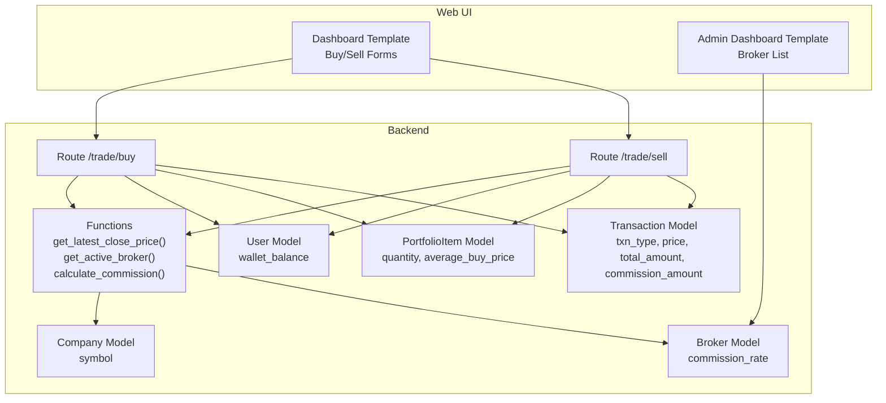
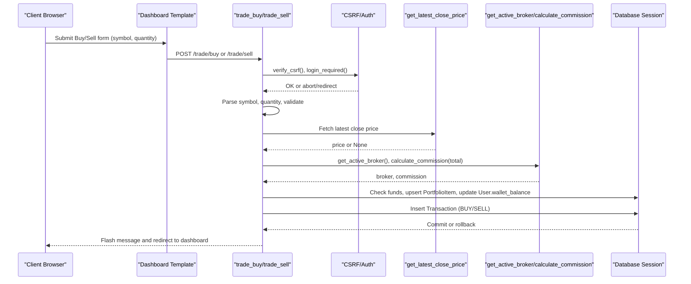
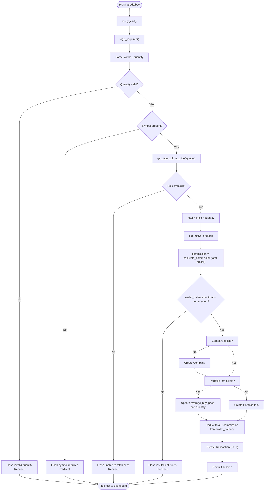
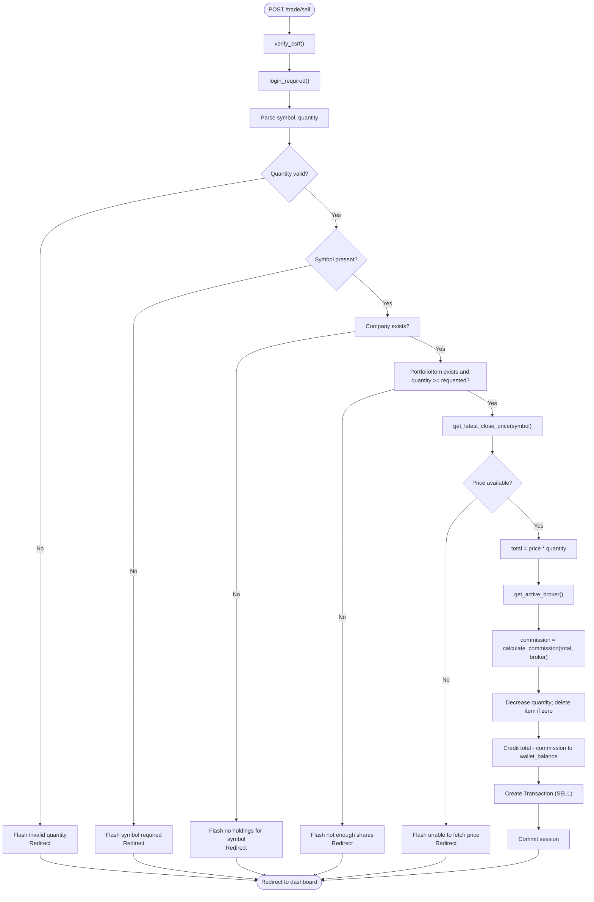
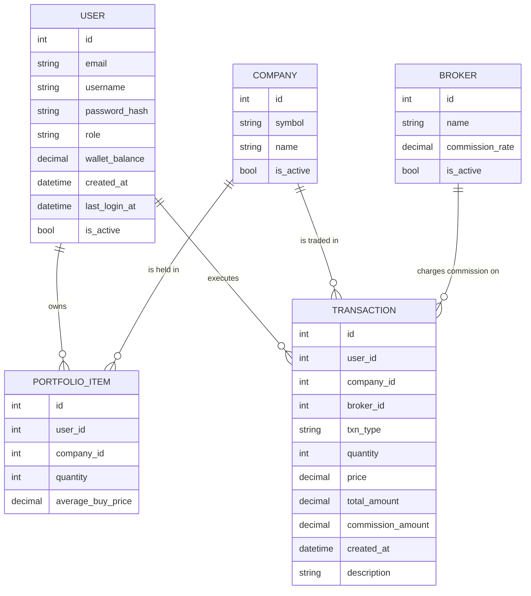
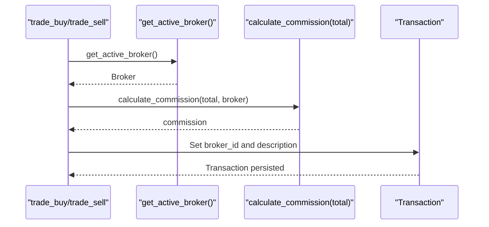
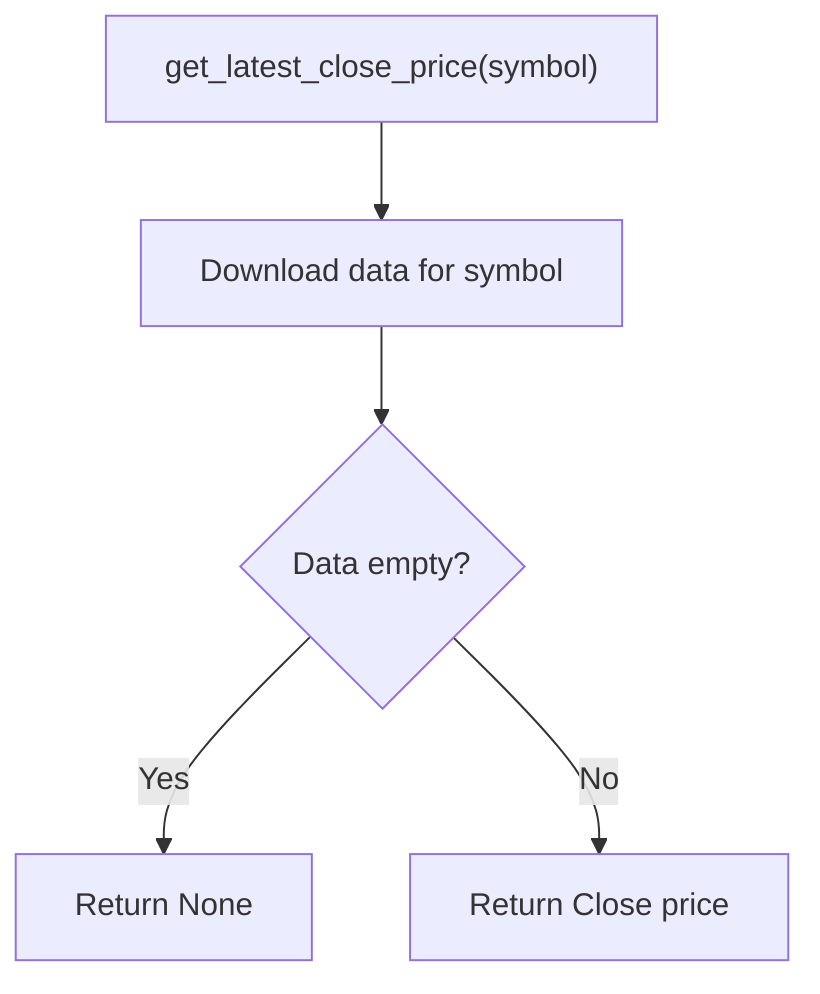
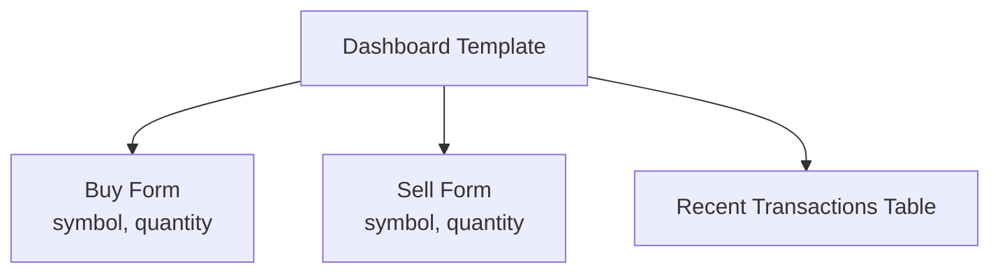
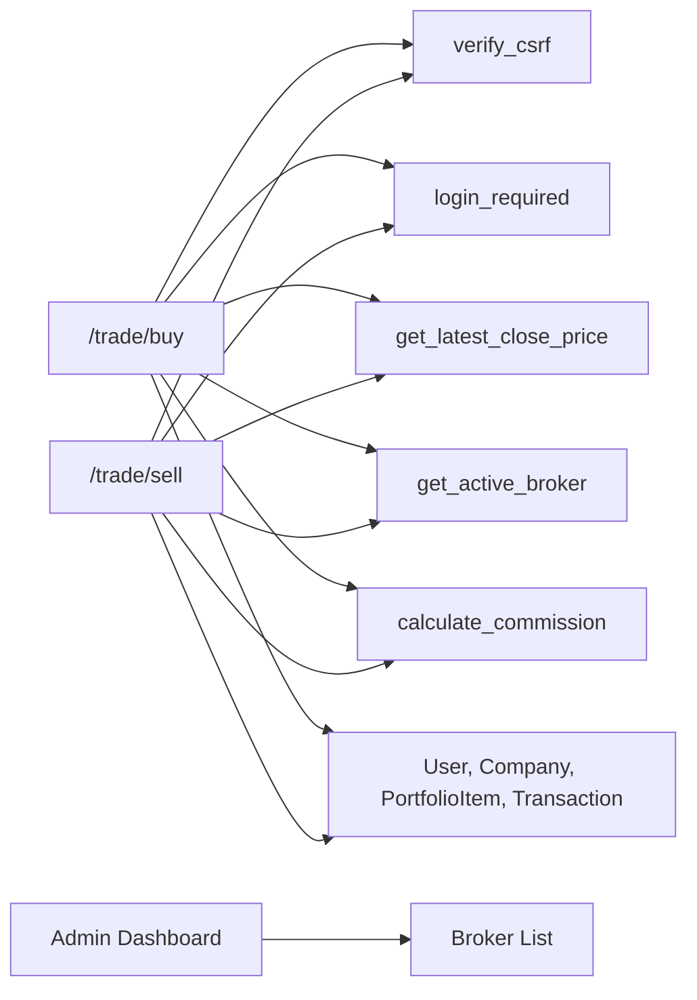

# Trading Operations

<cite>
**Referenced Files in This Document**
- [main.py](file://main.py)
- [templates/dashboard.html](file://templates/dashboard.html)
- [templates/admin_dashboard.html](file://templates/admin_dashboard.html)
- [tests/test_trading_operations.py](file://tests/test_trading_operations.py)
- [tests/conftest.py](file://tests/conftest.py)
- [docs/diagrams/er_diagram.md](file://docs/diagrams/er_diagram.md)
- [docs/diagrams/dfd_portfolio_level1.md](file://docs/diagrams/dfd_portfolio_level1.md)
</cite>

## Table of Contents
1. [Introduction](#introduction)
2. [Project Structure](#project-structure)
3. [Core Components](#core-components)
4. [Architecture Overview](#architecture-overview)
5. [Detailed Component Analysis](#detailed-component-analysis)
6. [Dependency Analysis](#dependency-analysis)
7. [Performance Considerations](#performance-considerations)
8. [Troubleshooting Guide](#troubleshooting-guide)
9. [Conclusion](#conclusion)
10. [Appendices](#appendices)

## Introduction
This document explains the trading logic for simulated buy/sell operations in the application. It covers the end-to-end request flow, validation steps, price retrieval, commission calculation, and database updates. It also documents the domain model, state changes to PortfolioItem, Transaction, and User wallet_balance, and how the active broker influences commission and transaction logging. Edge cases such as insufficient funds, invalid quantities, and non-existent symbols are addressed, along with test coverage that demonstrates success and failure scenarios.

## Project Structure
The trading feature spans backend routes, templates, and tests:
- Backend routes handle CSRF verification, authentication, symbol validation, quantity parsing, price retrieval, balance and commission checks, and database transactions.
- Templates render the buy/sell forms and transaction history.
- Tests validate success and failure paths, including commission calculations and broker integration.

**Diagram sources**
- [main.py](file://main.py#L268-L375)
- [templates/dashboard.html](file://templates/dashboard.html#L197-L234)
- [templates/admin_dashboard.html](file://templates/admin_dashboard.html#L165-L191)

**Section sources**
- [main.py](file://main.py#L268-L375)
- [templates/dashboard.html](file://templates/dashboard.html#L197-L234)
- [templates/admin_dashboard.html](file://templates/admin_dashboard.html#L165-L191)

## Core Components
- Routes
  - POST /trade/buy: Validates CSRF, user authentication, symbol, quantity, price, funds, company existence, commission, updates PortfolioItem and User wallet, records Transaction.
  - POST /trade/sell: Validates CSRF, user authentication, symbol, quantity, company ownership, price, commission, updates PortfolioItem and User wallet, records Transaction.
- Supporting functions
  - get_latest_close_price(symbol): Retrieves latest close price for a symbol.
  - get_active_broker(): Returns the active broker.
  - calculate_commission(total_amount, broker): Computes commission based on broker commission_rate.
- Domain models
  - User: Holds wallet_balance.
  - Company: Holds symbol.
  - PortfolioItem: Tracks quantity and average_buy_price per user-company pair.
  - Transaction: Records buy/sell/dividend activity with price, total_amount, commission_amount, broker_id, description.
  - Broker: Holds commission_rate and is_active flag.

**Section sources**
- [main.py](file://main.py#L161-L185)
- [main.py](file://main.py#L268-L375)
- [docs/diagrams/er_diagram.md](file://docs/diagrams/er_diagram.md#L1-L68)

## Architecture Overview
The trading flow integrates UI, backend routes, and persistence. The dashboard template renders buy/sell forms with CSRF tokens. On submission, routes enforce security and business rules, compute totals and commissions, and atomically update the database.

**Diagram sources**
- [main.py](file://main.py#L268-L375)
- [templates/dashboard.html](file://templates/dashboard.html#L197-L234)

## Detailed Component Analysis

### Buy Operation Flow
- Request flow
  - CSRF verification and authentication required.
  - Parse symbol and quantity; reject if invalid or non-positive.
  - Retrieve latest close price; reject if unavailable.
  - Compute total = price × quantity.
  - Load active broker and compute commission = total × (broker.commission_rate / 100).
  - Reject if insufficient funds (total + commission > wallet_balance).
  - Create Company if missing.
  - If PortfolioItem exists, update average_buy_price and quantity; otherwise create new item.
  - Deduct total + commission from User.wallet_balance.
  - Log transaction with BUY type, price, total_amount, commission_amount, broker_id, and description.
  - Commit and redirect to dashboard with success message.
- State changes
  - PortfolioItem: quantity increased; average_buy_price updated via weighted average.
  - Transaction: new BUY record created.
  - User: wallet_balance decreased by total + commission.
- Edge cases covered by tests
  - Insufficient funds.
  - Invalid quantity (non-integer, negative, zero).
  - Non-existent symbol creation on first buy.
  - Partial purchase updates cost basis.

**Diagram sources**
- [main.py](file://main.py#L268-L324)

**Section sources**
- [main.py](file://main.py#L268-L324)
- [tests/test_trading_operations.py](file://tests/test_trading_operations.py#L16-L133)

### Sell Operation Flow
- Request flow
  - CSRF verification and authentication required.
  - Parse symbol and quantity; reject if invalid or non-positive.
  - Ensure Company exists and user owns the stock; reject if not.
  - Retrieve latest close price; reject if unavailable.
  - Compute total = price × quantity.
  - Load active broker and compute commission.
  - Reject if not enough shares.
  - Decrease quantity; delete PortfolioItem if zero.
  - Credit total - commission to User.wallet_balance.
  - Log transaction with SELL type, price, total_amount, commission_amount, broker_id, and description.
  - Commit and redirect to dashboard with success message.
- State changes
  - PortfolioItem: quantity decreased; removed if zero.
  - Transaction: new SELL record created.
  - User: wallet_balance increased by total - commission.
- Edge cases covered by tests
  - Insufficient shares to sell.
  - Selling all shares removes the PortfolioItem.
  - Non-existent symbol in holdings.

**Diagram sources**
- [main.py](file://main.py#L327-L375)

**Section sources**
- [main.py](file://main.py#L327-L375)
- [tests/test_trading_operations.py](file://tests/test_trading_operations.py#L135-L204)

### Domain Model and Relationships
The ER diagram shows the core entities and their relationships relevant to trading.

**Diagram sources**
- [docs/diagrams/er_diagram.md](file://docs/diagrams/er_diagram.md#L1-L68)

**Section sources**
- [docs/diagrams/er_diagram.md](file://docs/diagrams/er_diagram.md#L1-L68)
- [main.py](file://main.py#L68-L120)

### Broker Integration and Commission Calculation
- Active broker selection
  - get_active_broker() returns the first broker marked as active.
- Commission computation
  - calculate_commission(total_amount, broker) computes total_amount × (broker.commission_rate / 100) and rounds to two decimals.
- Transaction logging
  - Both buy and sell routes set broker_id and description to include broker name and commission rate when applicable.

**Diagram sources**
- [main.py](file://main.py#L172-L185)
- [main.py](file://main.py#L268-L375)

**Section sources**
- [main.py](file://main.py#L172-L185)
- [tests/test_trading_operations.py](file://tests/test_trading_operations.py#L206-L267)

### Price Retrieval and Validation
- Latest price retrieval
  - get_latest_close_price(symbol) fetches the latest close price for a symbol using yfinance.
- Validation
  - Routes reject if price is unavailable.
- Tests
  - Mocked price retrieval ensures predictable behavior in tests.

**Diagram sources**
- [main.py](file://main.py#L161-L169)

**Section sources**
- [main.py](file://main.py#L161-L169)
- [tests/test_trading_operations.py](file://tests/test_trading_operations.py#L306-L324)

### User Interface and Transaction History
- Buy/Sell forms
  - The dashboard template renders separate forms for buy and sell with CSRF tokens and numeric quantity inputs.
- Transaction history
  - The dashboard template lists recent transactions with type, symbol, quantity, price, total, and description.

**Diagram sources**
- [templates/dashboard.html](file://templates/dashboard.html#L197-L234)
- [templates/dashboard.html](file://templates/dashboard.html#L232-L283)

**Section sources**
- [templates/dashboard.html](file://templates/dashboard.html#L197-L234)
- [templates/dashboard.html](file://templates/dashboard.html#L232-L283)

## Dependency Analysis
- Route dependencies
  - trade_buy depends on verify_csrf, login_required, get_latest_close_price, get_active_broker, calculate_commission, and database models.
  - trade_sell mirrors trade_buy with additional ownership checks.
- Broker management
  - Admin dashboard template displays brokers and allows adding new ones.
- Tests depend on fixtures and mocks to simulate price retrieval and authentication.

**Diagram sources**
- [main.py](file://main.py#L268-L375)
- [templates/admin_dashboard.html](file://templates/admin_dashboard.html#L165-L191)

**Section sources**
- [main.py](file://main.py#L268-L375)
- [templates/admin_dashboard.html](file://templates/admin_dashboard.html#L165-L191)

## Performance Considerations
- Price retrieval
  - Using yfinance for each trade introduces latency. Consider caching recent prices per symbol to reduce repeated network calls.
- Commission calculation
  - Decimal arithmetic is precise and safe; ensure consistent rounding to two decimals across the application.
- Database transactions
  - All trading operations occur within a single session commit, ensuring atomicity. Keep the transaction scope minimal to reduce contention.

[No sources needed since this section provides general guidance]

## Troubleshooting Guide
Common issues and resolutions:
- CSRF token mismatch
  - Ensure the hidden CSRF token is included in forms and that sessions are configured correctly.
- Authentication failures
  - Routes require login; unauthenticated users are redirected to login.
- Invalid quantity
  - Routes reject non-integers, zero, or negative quantities.
- Symbol validation
  - Routes require a non-empty symbol; missing symbols are rejected.
- Price retrieval failure
  - Routes reject when latest price cannot be fetched.
- Insufficient funds
  - Routes reject when total plus commission exceeds wallet balance.
- Insufficient shares
  - Routes reject when selling more than owned.
- Non-existent holdings
  - Routes reject selling symbols not in the user’s portfolio.

**Section sources**
- [main.py](file://main.py#L268-L375)
- [tests/test_trading_operations.py](file://tests/test_trading_operations.py#L16-L204)

## Conclusion
The trading subsystem implements a robust, simulated buy/sell pipeline with strong validation and clear state transitions. It integrates CSRF and authentication, validates inputs, retrieves prices, computes commissions via the active broker, and persists atomic database changes. The test suite comprehensively covers success and failure scenarios, including commission calculations and broker integration.

## Appendices

### API and Request/Response Details
- POST /trade/buy
  - Inputs: symbol (string), quantity (integer), csrf_token (string).
  - Behavior: Validates inputs, retrieves price, computes total and commission, checks funds, updates portfolio and wallet, logs transaction.
  - Output: Redirect to dashboard with success or error flash message.
- POST /trade/sell
  - Inputs: symbol (string), quantity (integer), csrf_token (string).
  - Behavior: Validates inputs, checks ownership, retrieves price, computes total and commission, updates portfolio and wallet, logs transaction.
  - Output: Redirect to dashboard with success or error flash message.

**Section sources**
- [templates/dashboard.html](file://templates/dashboard.html#L197-L234)
- [main.py](file://main.py#L268-L375)

### Broker Management
- Active broker selection
  - get_active_broker() returns the first active broker.
- Commission rates
  - calculate_commission() applies the broker’s commission_rate to the total amount.
- Admin actions
  - Admin dashboard displays brokers and allows adding new ones.

**Section sources**
- [main.py](file://main.py#L172-L185)
- [templates/admin_dashboard.html](file://templates/admin_dashboard.html#L165-L191)
- [tests/test_trading_operations.py](file://tests/test_trading_operations.py#L269-L305)

### Test Coverage Highlights
- Buy tests
  - Successful purchase, insufficient funds, transaction creation, invalid quantity, negative/zero quantity, company creation on demand, partial purchase updates cost basis.
- Sell tests
  - Successful sale, insufficient shares, removal of portfolio item when quantity reaches zero, non-existent holdings rejection, transaction creation.
- Commission tests
  - Commission calculation correctness, zero-rate broker, commission deduction on buy and sell.
- Broker integration tests
  - Active broker retrieval, transaction recording of broker information, admin adding a broker.
- Price fetching tests
  - Mocked price retrieval and invalid symbol handling.
- Transaction history tests
  - Timestamp presence, ordering, and dashboard display.

**Section sources**
- [tests/test_trading_operations.py](file://tests/test_trading_operations.py#L16-L348)

### Simulation Nature and Real-World Deployment Notes
- Simulation
  - Trades update simulated wallet balances and portfolio holdings; they do not connect to live exchanges or execute real orders.
- Implications
  - Real-world deployment would require replacing price retrieval with a live market data provider, integrating with a brokerage API for order execution, and implementing risk controls and compliance measures.
  - The current commission and transaction logging mechanisms can be adapted to reflect real broker fees and audit trails.

[No sources needed since this section summarizes conceptual guidance]