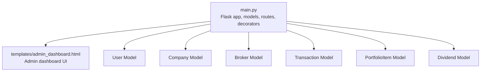
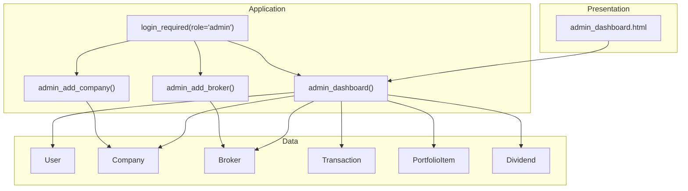
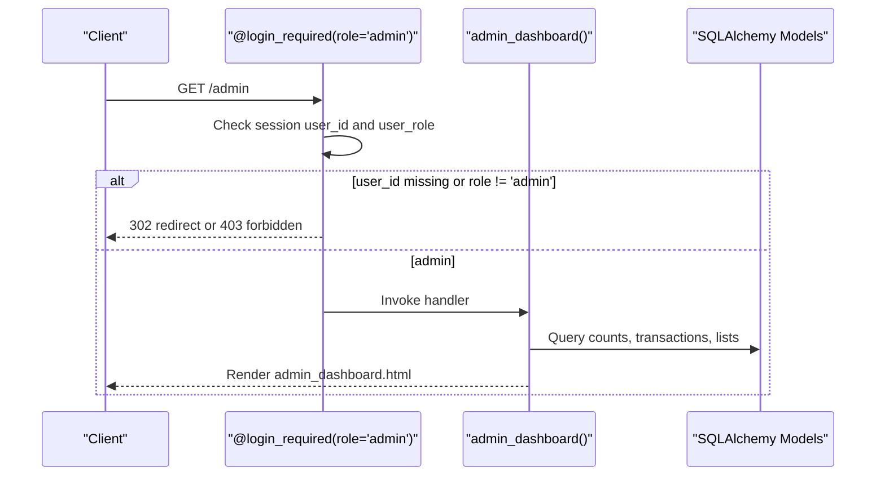
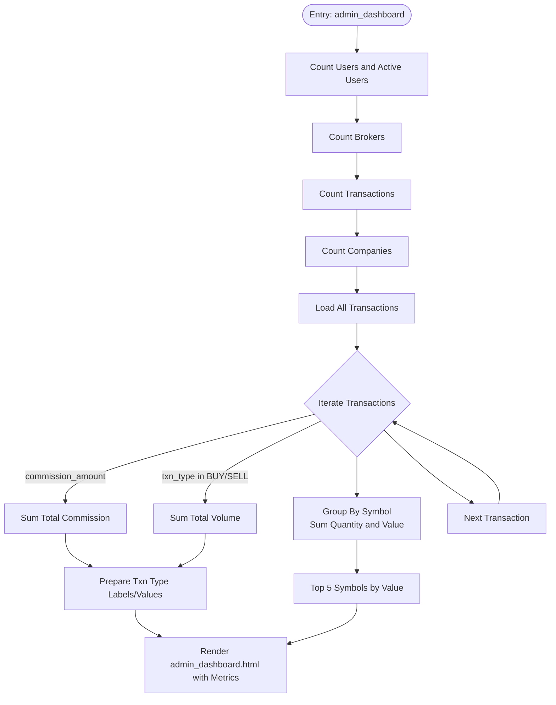
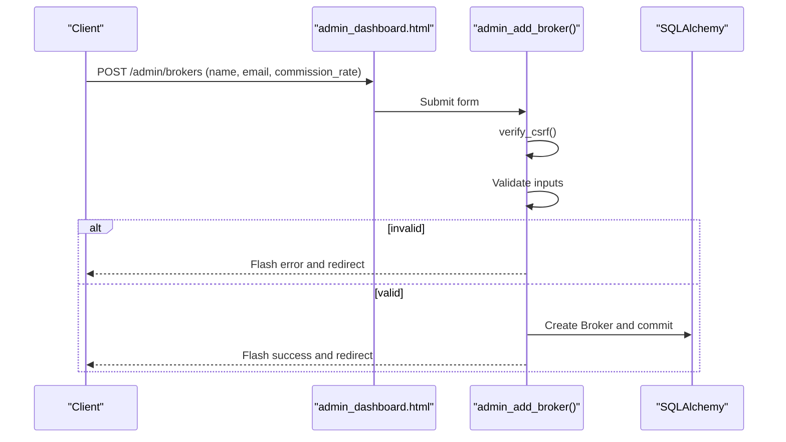
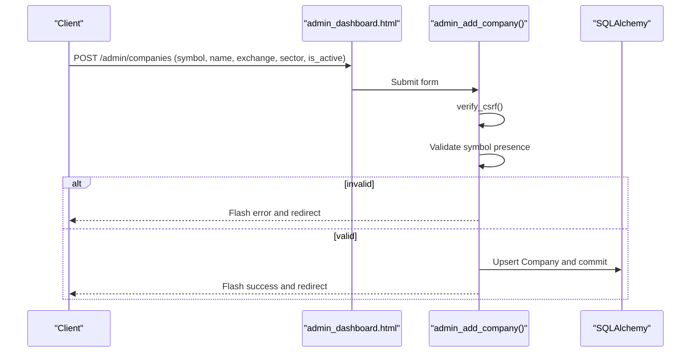
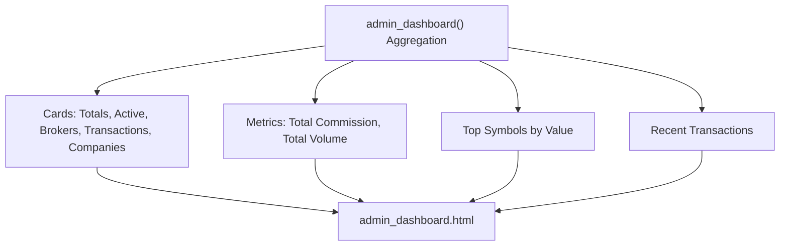
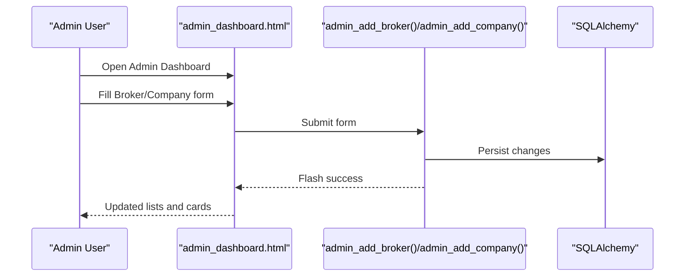
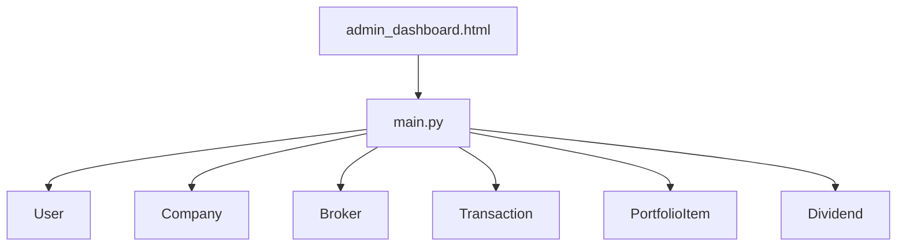
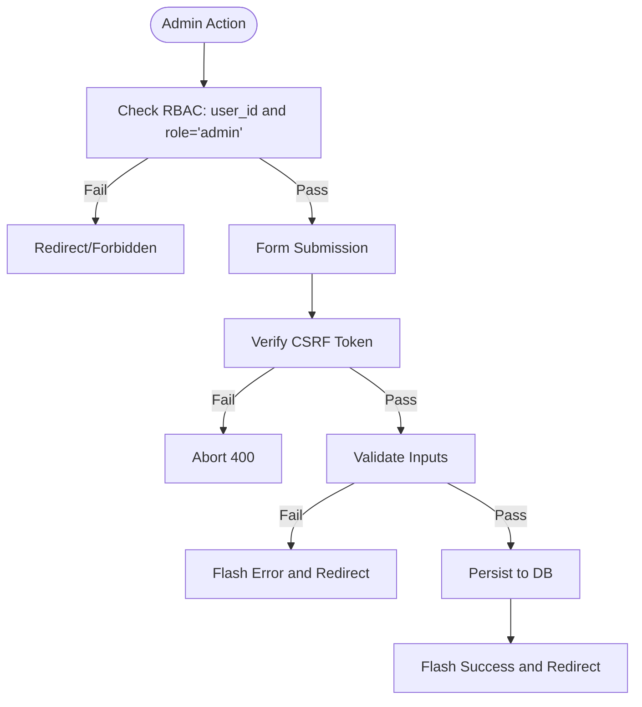

# Admin Dashboard

<cite>
**Referenced Files in This Document**
- [main.py](file://main.py)
- [admin_dashboard.html](file://templates/admin_dashboard.html)
- [test_authentication.py](file://tests/test_authentication.py)
- [test_web_routes.py](file://tests/test_web_routes.py)
- [implementation_status.md](file://status_reports/implementation_status.md)
</cite>

## Table of Contents
1. [Introduction](#introduction)
2. [Project Structure](#project-structure)
3. [Core Components](#core-components)
4. [Architecture Overview](#architecture-overview)
5. [Detailed Component Analysis](#detailed-component-analysis)
6. [Dependency Analysis](#dependency-analysis)
7. [Performance Considerations](#performance-considerations)
8. [Troubleshooting Guide](#troubleshooting-guide)
9. [Conclusion](#conclusion)

## Introduction
This document describes the Admin Dashboard sub-feature, focusing on the administrative interface for managing users, companies, brokers, and monitoring system-wide transactions. It explains role-based access control that restricts dashboard access to admin users, how real-time statistics and system health metrics are aggregated and displayed, and provides examples from main.py and template logic from admin_dashboard.html. It also covers use cases such as user suspension, broker commission updates, and audit trail inspection, along with security considerations and troubleshooting guidance.

## Project Structure
The Admin Dashboard spans two primary areas:
- Backend routes and logic in main.py, including models, decorators, and aggregation logic for statistics.
- Frontend template in templates/admin_dashboard.html, which renders cards, forms, and tables for administration.

**Diagram sources**
- [main.py](file://main.py#L51-L119)
- [admin_dashboard.html](file://templates/admin_dashboard.html#L1-L322)

**Section sources**
- [main.py](file://main.py#L51-L119)
- [admin_dashboard.html](file://templates/admin_dashboard.html#L1-L322)

## Core Components
- Role-based access control: The @login_required(role='admin') decorator ensures only admin users can access admin routes.
- Admin dashboard route: Aggregates counts, totals, and recent transactions for display.
- Broker management: Adds and lists brokers with commission rates.
- Company management: Adds and updates company profiles and activation status.
- Real-time statistics: Displays user counts, active users, broker count, transaction count, company count, total commission, total volume, and top symbols by value.
- Template logic: Uses Jinja2 to render statistics cards, forms, and tables.

Key implementation references:
- Admin-only route decorator and admin dashboard aggregation: [main.py](file://main.py#L436-L490)
- Broker registration form and list: [admin_dashboard.html](file://templates/admin_dashboard.html#L138-L195)
- Company management form and list: [admin_dashboard.html](file://templates/admin_dashboard.html#L197-L265)
- Recent transactions table: [admin_dashboard.html](file://templates/admin_dashboard.html#L267-L309)

**Section sources**
- [main.py](file://main.py#L436-L490)
- [admin_dashboard.html](file://templates/admin_dashboard.html#L138-L309)

## Architecture Overview
The Admin Dashboard follows a layered architecture:
- Presentation layer: admin_dashboard.html renders statistics and forms.
- Application layer: main.py defines routes, applies RBAC, and aggregates metrics.
- Data layer: SQLAlchemy models represent Users, Companies, Brokers, Transactions, PortfolioItems, and Dividends.

**Diagram sources**
- [main.py](file://main.py#L436-L539)
- [admin_dashboard.html](file://templates/admin_dashboard.html#L138-L309)

## Detailed Component Analysis

### Role-Based Access Control (RBAC)
- The @login_required(role='admin') decorator enforces admin-only access to admin routes.
- Session-based authentication stores user_id and user_role; the decorator checks both presence and role equality.
- Tests verify that non-admin users are redirected or receive forbidden responses, while admins can access the dashboard.

**Diagram sources**
- [main.py](file://main.py#L139-L151)
- [main.py](file://main.py#L436-L490)
- [test_authentication.py](file://tests/test_authentication.py#L216-L251)

**Section sources**
- [main.py](file://main.py#L139-L151)
- [test_authentication.py](file://tests/test_authentication.py#L216-L251)

### Admin Dashboard Statistics Aggregation
The admin_dashboard route performs:
- Counts: total users, active users, brokers, transactions, companies.
- Totals: total commission across transactions, total volume (share quantity) for BUY/SELL.
- Top symbols: computed by summing total amounts per symbol and taking the top 5 by value.
- Lists: recent transactions, brokers, and companies.

**Diagram sources**
- [main.py](file://main.py#L436-L490)

**Section sources**
- [main.py](file://main.py#L436-L490)

### Broker Management
- Form in admin_dashboard.html submits to /admin/brokers with hidden CSRF token.
- Validation includes name presence, numeric commission rate, and non-negative constraint.
- On success, a new Broker is created and committed.

**Diagram sources**
- [admin_dashboard.html](file://templates/admin_dashboard.html#L138-L161)
- [main.py](file://main.py#L492-L515)

**Section sources**
- [admin_dashboard.html](file://templates/admin_dashboard.html#L138-L161)
- [main.py](file://main.py#L492-L515)

### Company Management
- Form in admin_dashboard.html submits to /admin/companies with symbol, name, exchange, sector, and activation checkbox.
- Validation includes symbol presence and toggles is_active based on checkbox presence.
- On success, the Company is created or updated and committed.

**Diagram sources**
- [admin_dashboard.html](file://templates/admin_dashboard.html#L233-L265)
- [main.py](file://main.py#L517-L539)

**Section sources**
- [admin_dashboard.html](file://templates/admin_dashboard.html#L233-L265)
- [main.py](file://main.py#L517-L539)

### Real-Time Statistics and System Health Metrics
- Cards display:
  - Total Users, Active Users, Brokers, Transactions, Companies
  - Total Commission, Total Volume (shares)
- Charts and lists:
  - Recent Transactions table
  - Top Symbols by value
- These are populated by the aggregation logic in admin_dashboard route and rendered via Jinja2 in admin_dashboard.html.

**Diagram sources**
- [main.py](file://main.py#L436-L490)
- [admin_dashboard.html](file://templates/admin_dashboard.html#L44-L136)
- [admin_dashboard.html](file://templates/admin_dashboard.html#L267-L309)

**Section sources**
- [main.py](file://main.py#L436-L490)
- [admin_dashboard.html](file://templates/admin_dashboard.html#L44-L136)
- [admin_dashboard.html](file://templates/admin_dashboard.html#L267-L309)

### Use Cases
- User suspension: The implementation_status.md outlines suspend_user and activate_user methods in an AdminService, enabling admin-controlled account lifecycle management.
- Broker commission updates: The admin dashboard allows adding brokers and updating commission rates via the broker management form.
- Audit trail inspection: The implementation_status.md documents get_audit_log(filters) for admin actions, supporting compliance and oversight.

**Diagram sources**
- [implementation_status.md](file://status_reports/implementation_status.md#L187-L218)
- [admin_dashboard.html](file://templates/admin_dashboard.html#L138-L265)
- [main.py](file://main.py#L492-L539)

**Section sources**
- [implementation_status.md](file://status_reports/implementation_status.md#L187-L218)
- [admin_dashboard.html](file://templates/admin_dashboard.html#L138-L265)
- [main.py](file://main.py#L492-L539)

## Dependency Analysis
- Coupling:
  - admin_dashboard route depends on User, Company, Broker, Transaction models for aggregation.
  - Templates depend on route-provided context variables (counts, totals, lists).
- Cohesion:
  - Admin routes are cohesive around administrative tasks and statistics.
- External dependencies:
  - SQLAlchemy ORM for persistence.
  - Jinja2 for templating.
  - CSRF protection via session-stored tokens.

**Diagram sources**
- [main.py](file://main.py#L51-L119)
- [admin_dashboard.html](file://templates/admin_dashboard.html#L1-L322)

**Section sources**
- [main.py](file://main.py#L51-L119)
- [admin_dashboard.html](file://templates/admin_dashboard.html#L1-L322)

## Performance Considerations
- Aggregation complexity:
  - admin_dashboard iterates all transactions to compute totals and symbol totals; for large datasets, consider indexing and pagination.
- Rendering:
  - The template loops over lists; keep lists reasonably sized or paginate.
- CSRF overhead:
  - CSRF verification adds negligible overhead compared to DB operations.
- Recommendations:
  - Add database indexes on frequently filtered fields (e.g., created_at, is_active).
  - Cache dashboard aggregates periodically if real-time updates are not strictly required.
  - Use server-side pagination for recent transactions and lists.

[No sources needed since this section provides general guidance]

## Troubleshooting Guide
Common administrative tasks and validations:
- Admin access denied:
  - Ensure user session contains user_id and user_role set to 'admin'.
  - Tests verify non-admins receive redirects or forbidden responses.
- CSRF token errors:
  - Forms must include the hidden CSRF token; verify token generation and session storage.
- Broker creation failures:
  - Validate name presence and numeric commission rate; ensure commission is non-negative.
- Company updates:
  - Ensure symbol presence; is_active toggled by checkbox presence.

**Diagram sources**
- [main.py](file://main.py#L139-L151)
- [main.py](file://main.py#L492-L539)
- [test_authentication.py](file://tests/test_authentication.py#L216-L251)

**Section sources**
- [main.py](file://main.py#L139-L151)
- [main.py](file://main.py#L492-L539)
- [test_authentication.py](file://tests/test_authentication.py#L216-L251)

## Security Considerations
- Admin-only routes:
  - Enforced by @login_required(role='admin').
- CSRF protection:
  - verify_csrf validates session-stored tokens against form submissions.
- Session security:
  - Session cookie flags configured in app configuration.
- Tests:
  - Authentication and CSRF protections verified in test suites.

**Section sources**
- [main.py](file://main.py#L139-L151)
- [main.py](file://main.py#L121-L137)
- [test_authentication.py](file://tests/test_authentication.py#L197-L213)
- [test_web_routes.py](file://tests/test_web_routes.py#L127-L160)

## Conclusion
The Admin Dashboard provides a focused administrative interface with strict RBAC, robust validation, and clear presentation of system-wide metrics. The backend aggregates statistics efficiently, while the frontend renders actionable cards and forms. The implementation aligns with documented admin capabilities for user, company, and broker management, and supports audit trail inspection. Security measures include CSRF protection and admin-only routing, validated by tests. For large-scale deployments, consider caching and pagination to optimize performance.