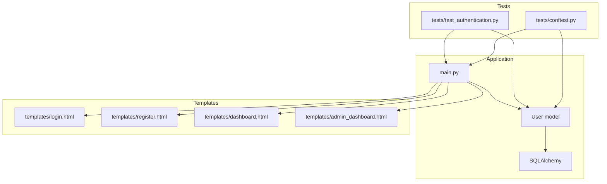
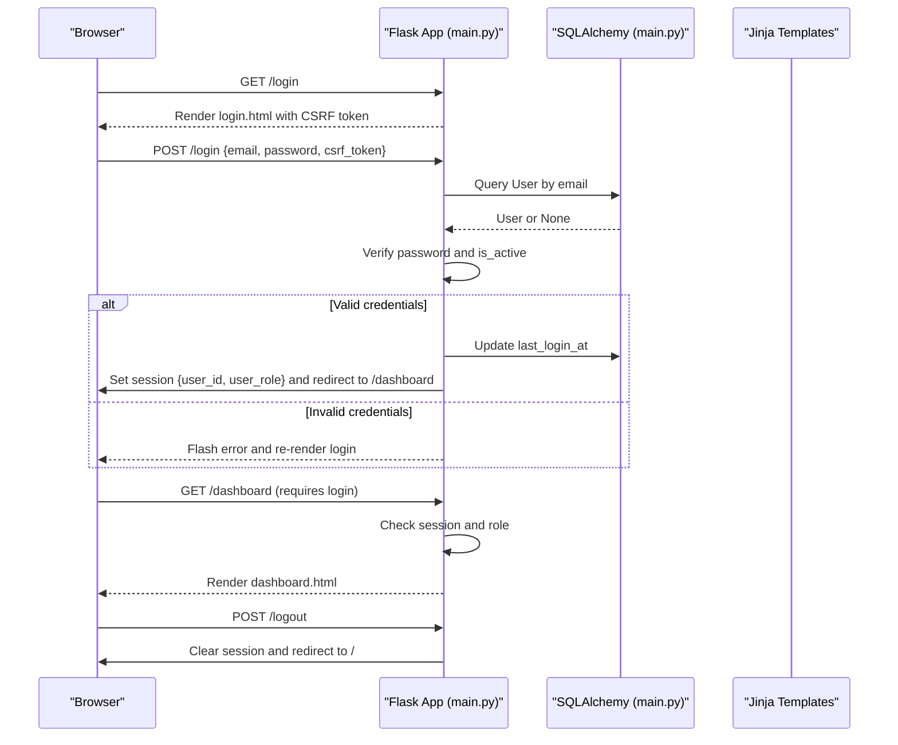
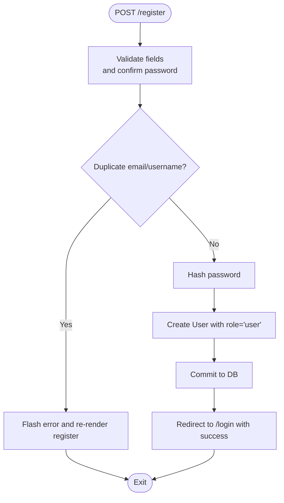
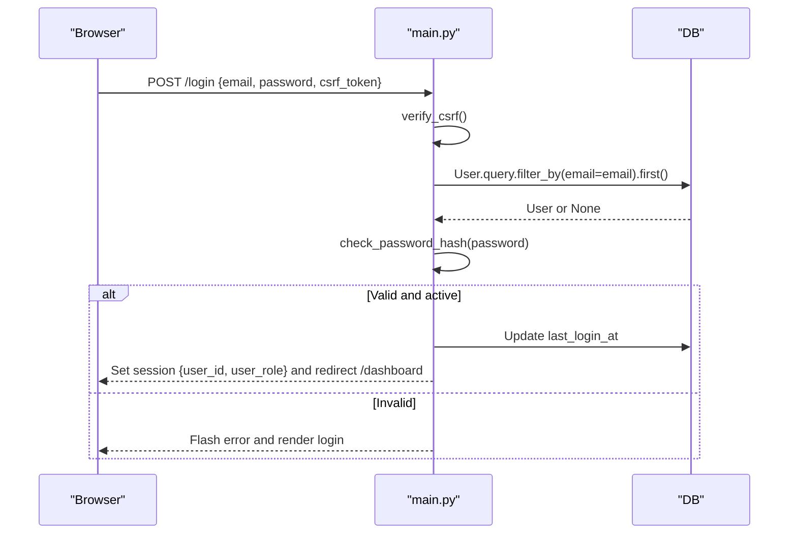
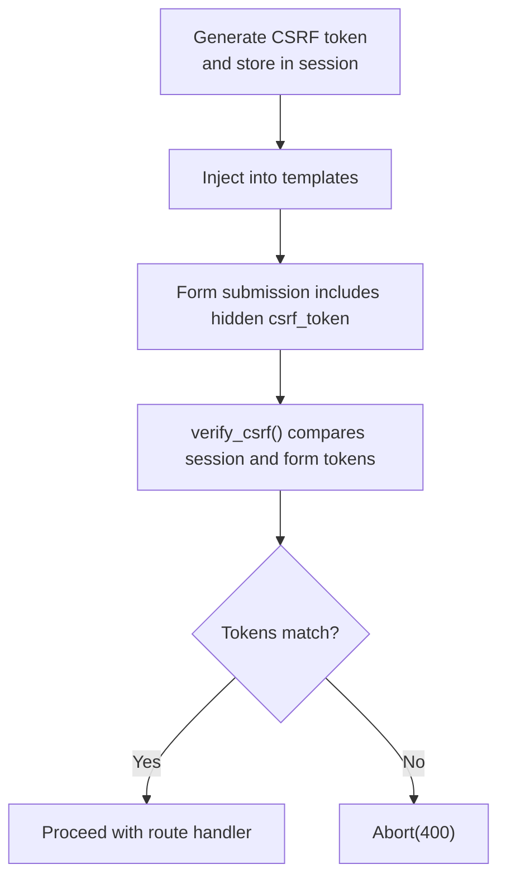
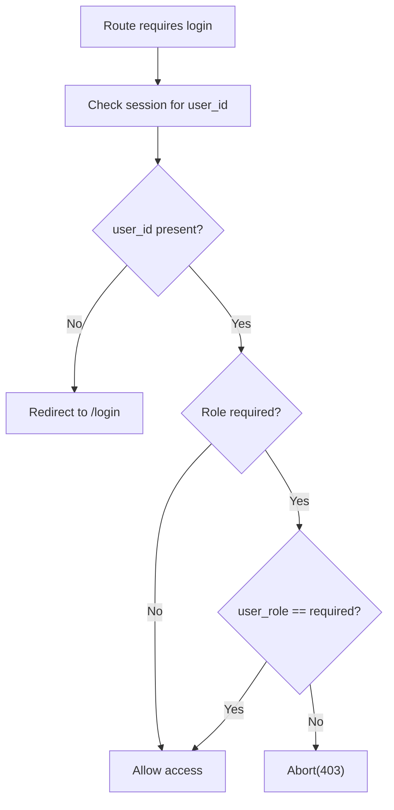
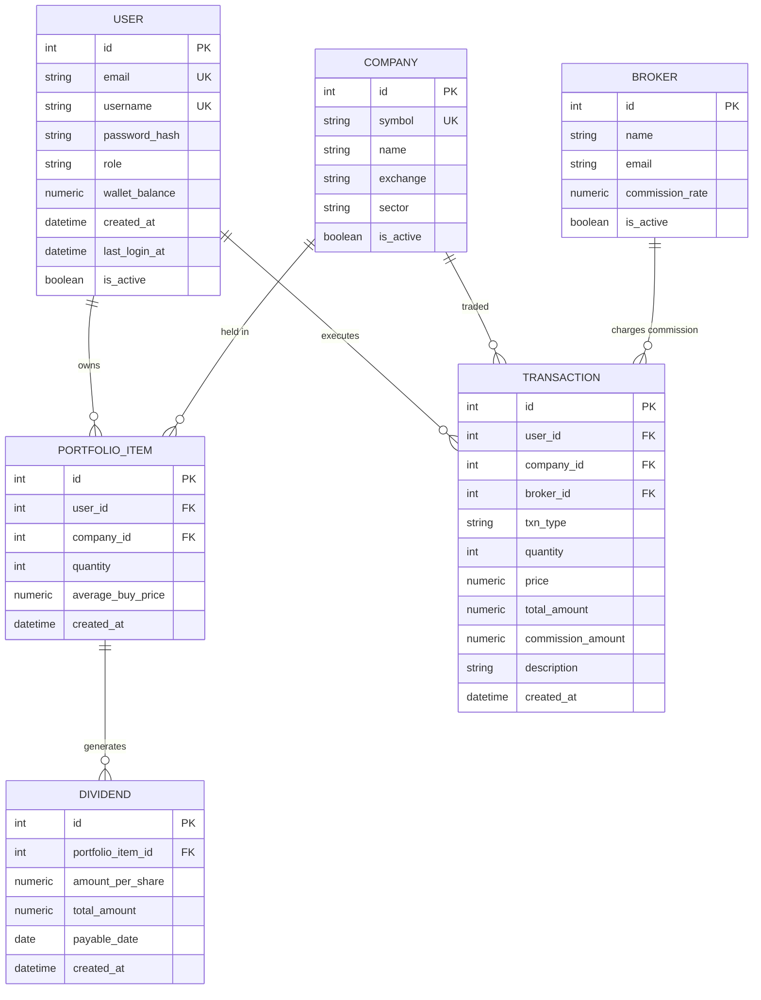
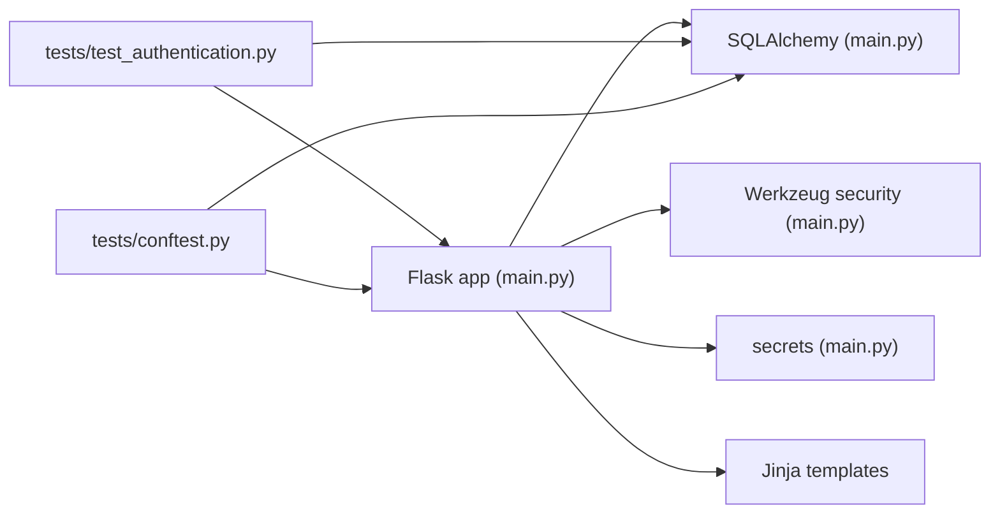

# Authentication System

<cite>
**Referenced Files in This Document**
- [main.py](file://main.py)
- [test_authentication.py](file://tests/test_authentication.py)
- [conftest.py](file://tests/conftest.py)
- [login.html](file://templates/login.html)
- [register.html](file://templates/register.html)
- [dashboard.html](file://templates/dashboard.html)
- [admin_dashboard.html](file://templates/admin_dashboard.html)
</cite>

## Table of Contents
1. [Introduction](#introduction)
2. [Project Structure](#project-structure)
3. [Core Components](#core-components)
4. [Architecture Overview](#architecture-overview)
5. [Detailed Component Analysis](#detailed-component-analysis)
6. [Dependency Analysis](#dependency-analysis)
7. [Performance Considerations](#performance-considerations)
8. [Troubleshooting Guide](#troubleshooting-guide)
9. [Conclusion](#conclusion)

## Introduction
This document explains the Authentication System for the Intelligent Stock Market Prediction web application. It covers user registration, login/logout workflows, password hashing with security best practices, CSRF protection, and role-based access control (RBAC) for user and admin roles. It also documents how authentication integrates with Flask session management, protects sensitive routes, and relates to the User model and database persistence. Practical examples from main.py illustrate route decorators and middleware, and troubleshooting guidance addresses common issues such as failed logins, password reset considerations, and session expiration.

## Project Structure
The authentication system spans a few key areas:
- Application entry and routing logic in main.py
- Jinja templates for login and registration pages
- Database models (User and related entities)
- Tests verifying authentication and RBAC behavior

**Diagram sources**
- [main.py](file://main.py#L1-L120)
- [login.html](file://templates/login.html#L1-L90)
- [register.html](file://templates/register.html#L1-L119)
- [dashboard.html](file://templates/dashboard.html#L1-L284)
- [admin_dashboard.html](file://templates/admin_dashboard.html#L1-L322)
- [test_authentication.py](file://tests/test_authentication.py#L1-L336)
- [conftest.py](file://tests/conftest.py#L1-L144)

**Section sources**
- [main.py](file://main.py#L1-L120)
- [test_authentication.py](file://tests/test_authentication.py#L1-L120)
- [conftest.py](file://tests/conftest.py#L1-L144)

## Core Components
- User model with password hashing and role field
- Session-based authentication with Flask session
- CSRF protection via server-generated tokens
- Route decorators for login-required and RBAC enforcement
- Protected routes for trading, funding, dividends, and admin controls

Key implementation highlights:
- Password hashing and verification using Werkzeug security helpers
- CSRF token generation and validation
- Role-based route protection using a decorator with optional role enforcement
- Session creation on login and clearing on logout

**Section sources**
- [main.py](file://main.py#L51-L64)
- [main.py](file://main.py#L121-L137)
- [main.py](file://main.py#L139-L151)
- [main.py](file://main.py#L154-L159)
- [main.py](file://main.py#L199-L243)
- [main.py](file://main.py#L245-L249)
- [main.py](file://main.py#L251-L266)

## Architecture Overview
The authentication architecture combines Flask’s request/response lifecycle with SQLAlchemy-backed persistence and Jinja templates for rendering.

**Diagram sources**
- [main.py](file://main.py#L199-L243)
- [main.py](file://main.py#L245-L249)
- [main.py](file://main.py#L251-L266)
- [login.html](file://templates/login.html#L70-L90)
- [dashboard.html](file://templates/dashboard.html#L1-L120)

## Detailed Component Analysis

### User Model and Password Security
- The User model stores email, username, password_hash, role, wallet_balance, timestamps, and is_active flag.
- Passwords are hashed using a secure hashing function and verified using a comparison function.
- The model exposes a convenience method to check plaintext passwords against the stored hash.

Best practices demonstrated:
- Never store plaintext passwords
- Use a strong hashing scheme suitable for passwords
- Enforce account activation checks during login

**Section sources**
- [main.py](file://main.py#L51-L64)
- [main.py](file://main.py#L232-L241)
- [test_authentication.py](file://tests/test_authentication.py#L291-L336)

### Registration Workflow
- Validates presence of required fields and matching passwords
- Checks uniqueness of email and username
- Hashes the password and creates a new User with role set to “user”
- Commits to the database and flashes a success message

**Diagram sources**
- [main.py](file://main.py#L199-L223)
- [register.html](file://templates/register.html#L70-L105)

**Section sources**
- [main.py](file://main.py#L199-L223)
- [register.html](file://templates/register.html#L70-L105)
- [test_authentication.py](file://tests/test_authentication.py#L14-L95)

### Login Workflow
- Validates CSRF token
- Queries user by email and checks password and is_active
- On success, clears any prior session, sets user_id and user_role, updates last_login_at, and redirects to dashboard
- On failure, flashes an error and re-renders login

**Diagram sources**
- [main.py](file://main.py#L226-L243)
- [login.html](file://templates/login.html#L70-L90)

**Section sources**
- [main.py](file://main.py#L226-L243)
- [login.html](file://templates/login.html#L70-L90)
- [test_authentication.py](file://tests/test_authentication.py#L97-L171)

### Logout Workflow
- Clears the session and redirects to the index page

**Section sources**
- [main.py](file://main.py#L245-L249)
- [test_authentication.py](file://tests/test_authentication.py#L173-L196)

### Session Management in Flask
- Session keys used: user_id, user_role
- Session is cleared on logout
- After-login, session persists across subsequent requests to protected routes

**Section sources**
- [main.py](file://main.py#L236-L241)
- [main.py](file://main.py#L245-L249)
- [test_authentication.py](file://tests/test_authentication.py#L254-L289)

### CSRF Protection
- CSRF token is generated and stored in the session
- The token is injected into templates and required for forms
- A dedicated validator checks that the submitted token matches the session token

**Diagram sources**
- [main.py](file://main.py#L121-L137)
- [login.html](file://templates/login.html#L78-L90)
- [register.html](file://templates/register.html#L78-L85)
- [dashboard.html](file://templates/dashboard.html#L100-L115)
- [admin_dashboard.html](file://templates/admin_dashboard.html#L140-L160)

**Section sources**
- [main.py](file://main.py#L121-L137)
- [login.html](file://templates/login.html#L78-L90)
- [register.html](file://templates/register.html#L78-L85)
- [dashboard.html](file://templates/dashboard.html#L100-L115)
- [admin_dashboard.html](file://templates/admin_dashboard.html#L140-L160)
- [test_authentication.py](file://tests/test_authentication.py#L197-L216)

### Role-Based Access Control (RBAC)
- A login_required decorator enforces authentication and optional role enforcement
- Routes decorated with login_required(role='admin') restrict access to admin users only
- Unauthenticated users are redirected to login; unauthorized users receive forbidden responses

**Diagram sources**
- [main.py](file://main.py#L139-L151)
- [main.py](file://main.py#L436-L439)
- [main.py](file://main.py#L492-L515)
- [main.py](file://main.py#L517-L539)

**Section sources**
- [main.py](file://main.py#L139-L151)
- [main.py](file://main.py#L436-L439)
- [main.py](file://main.py#L492-L515)
- [main.py](file://main.py#L517-L539)
- [test_authentication.py](file://tests/test_authentication.py#L216-L253)

### Protected Routes and Decorators
- Dashboard route protected by login_required()
- Trading routes (buy, sell), funding top-up, and dividend recording protected by login_required()
- Admin routes protected by login_required(role='admin')

Concrete examples from main.py:
- Dashboard route decorator: [main.py](file://main.py#L251-L251)
- Trade buy route decorator: [main.py](file://main.py#L268-L268)
- Trade sell route decorator: [main.py](file://main.py#L327-L327)
- Funds top-up route decorator: [main.py](file://main.py#L378-L378)
- Dividend recording route decorator: [main.py](file://main.py#L398-L398)
- Admin dashboard route decorator: [main.py](file://main.py#L436-L436)
- Admin broker add route decorator: [main.py](file://main.py#L492-L492)
- Admin company add route decorator: [main.py](file://main.py#L517-L517)

**Section sources**
- [main.py](file://main.py#L251-L251)
- [main.py](file://main.py#L268-L268)
- [main.py](file://main.py#L327-L327)
- [main.py](file://main.py#L378-L378)
- [main.py](file://main.py#L398-L398)
- [main.py](file://main.py#L436-L436)
- [main.py](file://main.py#L492-L492)
- [main.py](file://main.py#L517-L517)

### Database Persistence and Relationships
- User model persists to the database via SQLAlchemy
- Related entities (PortfolioItem, Transaction, Dividend, Company, Broker) support trading and admin workflows
- The User model participates in relationships with PortfolioItem and Transaction

**Diagram sources**
- [main.py](file://main.py#L51-L119)

**Section sources**
- [main.py](file://main.py#L51-L119)

### Templates and CSRF Token Usage
- Login template includes a hidden CSRF token input and renders flashed messages
- Registration template similarly includes a hidden CSRF token input
- Dashboard and admin templates include CSRF tokens for forms and display user context

**Section sources**
- [login.html](file://templates/login.html#L70-L90)
- [register.html](file://templates/register.html#L78-L105)
- [dashboard.html](file://templates/dashboard.html#L100-L115)
- [admin_dashboard.html](file://templates/admin_dashboard.html#L140-L160)

## Dependency Analysis
- main.py depends on Flask, SQLAlchemy, Werkzeug security, and secrets for CSRF
- Tests depend on pytest fixtures to create a test app, DB, and sample users
- Templates depend on Jinja macros/functions to inject CSRF tokens and render messages

**Diagram sources**
- [main.py](file://main.py#L1-L49)
- [test_authentication.py](file://tests/test_authentication.py#L1-L30)
- [conftest.py](file://tests/conftest.py#L1-L40)

**Section sources**
- [main.py](file://main.py#L1-L49)
- [test_authentication.py](file://tests/test_authentication.py#L1-L30)
- [conftest.py](file://tests/conftest.py#L1-L40)

## Performance Considerations
- Password hashing is performed per login; ensure hashing cost is appropriate for production deployment
- CSRF token generation uses a cryptographically secure random generator; keep token lifetime minimal by relying on session lifecycle
- Session storage is in-memory by default; for production, consider server-side sessions with a cache or database backend
- Database queries for authentication are simple; ensure indexes on email and username for scalability

[No sources needed since this section provides general guidance]

## Troubleshooting Guide
Common issues and resolutions:
- Invalid credentials or inactive accounts
  - Symptom: Login fails with an error message
  - Cause: Incorrect email/password or is_active=False
  - Resolution: Verify credentials and ensure the account is active
  - Evidence: [main.py](file://main.py#L232-L236), [test_authentication.py](file://tests/test_authentication.py#L120-L157)
- CSRF validation failures
  - Symptom: 400 Bad Request on form submissions
  - Cause: Missing or mismatched CSRF token
  - Resolution: Ensure templates include the hidden csrf_token input and that verify_csrf() runs before processing
  - Evidence: [main.py](file://main.py#L121-L137), [login.html](file://templates/login.html#L78-L90), [register.html](file://templates/register.html#L78-L85)
- Unauthorized access attempts
  - Symptom: Redirect to login or 403 Forbidden
  - Cause: Missing session or insufficient role
  - Resolution: Authenticate or ensure user has admin role
  - Evidence: [main.py](file://main.py#L139-L151), [main.py](file://main.py#L436-L439), [test_authentication.py](file://tests/test_authentication.py#L216-L253)
- Session not persisting
  - Symptom: Redirect to login after navigating to protected routes
  - Cause: Session cleared or not set
  - Resolution: Confirm login succeeds and sets user_id and user_role; verify session cookies
  - Evidence: [main.py](file://main.py#L236-L241), [test_authentication.py](file://tests/test_authentication.py#L254-L289)
- Session expiration
  - Symptom: Automatic logout after inactivity
  - Cause: Default Flask session behavior
  - Resolution: Configure session timeout and secure cookie attributes as needed
  - Evidence: [main.py](file://main.py#L42-L48)

**Section sources**
- [main.py](file://main.py#L232-L241)
- [main.py](file://main.py#L121-L137)
- [main.py](file://main.py#L139-L151)
- [login.html](file://templates/login.html#L78-L90)
- [register.html](file://templates/register.html#L78-L85)
- [test_authentication.py](file://tests/test_authentication.py#L120-L157)
- [test_authentication.py](file://tests/test_authentication.py#L197-L253)
- [test_authentication.py](file://tests/test_authentication.py#L254-L289)

## Conclusion
The Authentication System integrates Flask session management with SQLAlchemy-backed persistence to provide secure user registration, login/logout, CSRF protection, and RBAC. The design emphasizes simplicity and clarity while adhering to security best practices such as password hashing and role enforcement. The included tests validate core behaviors, and the templates consistently incorporate CSRF tokens. For production, consider enhancing session storage, adding password reset mechanisms, and configuring robust cookie security policies.