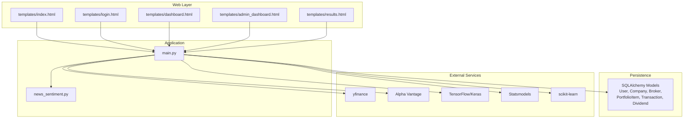
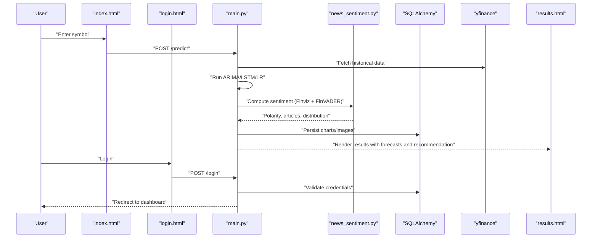
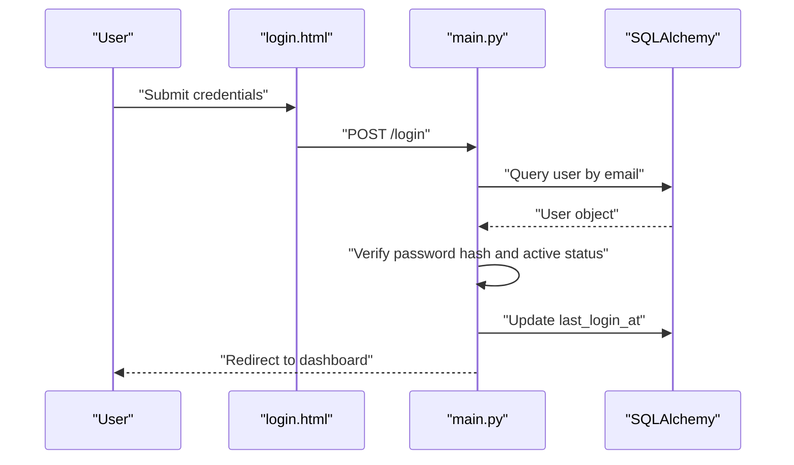
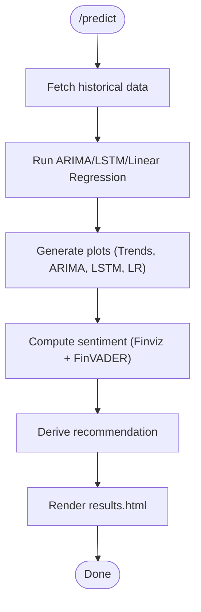
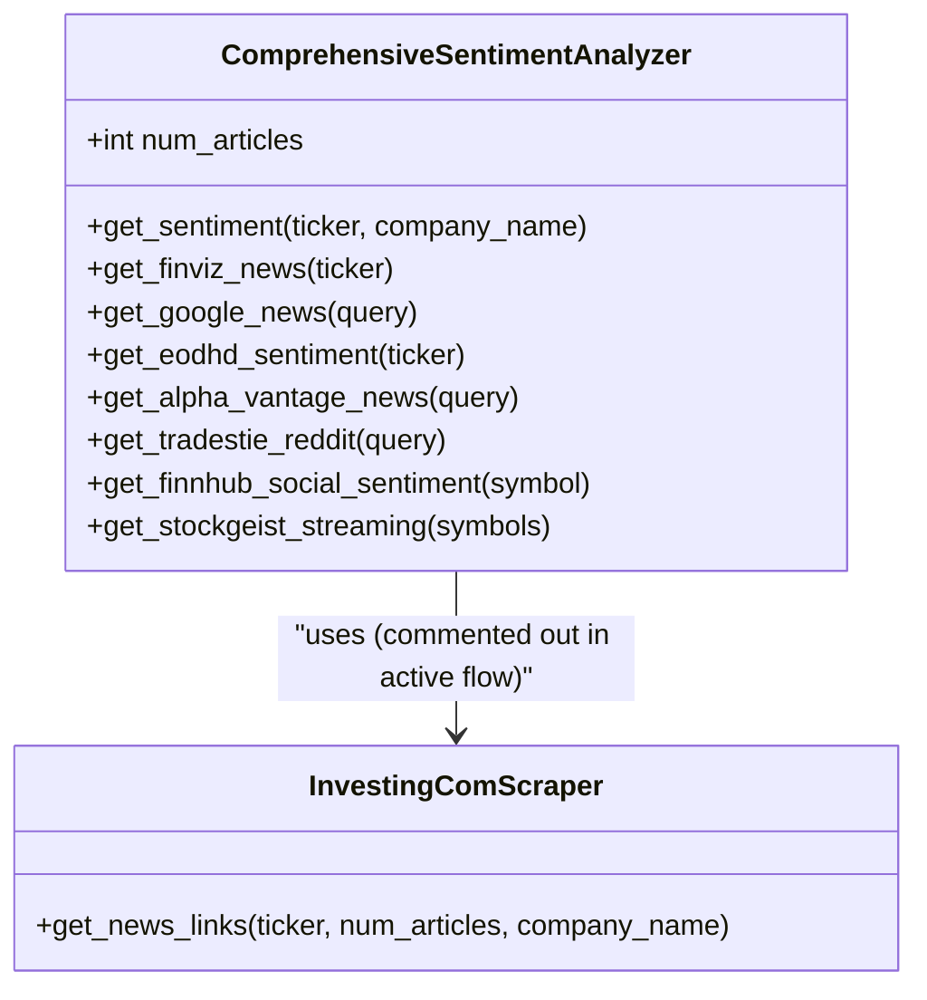
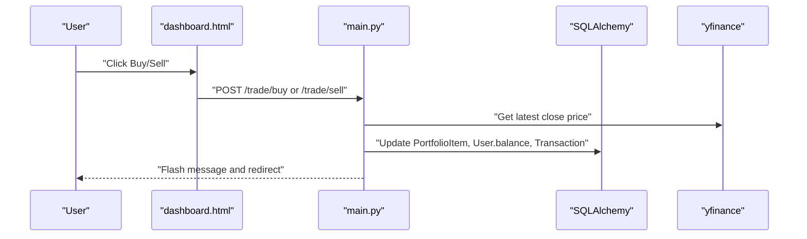
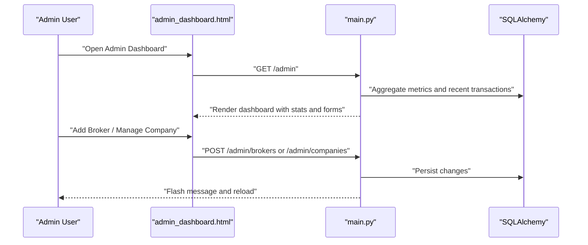
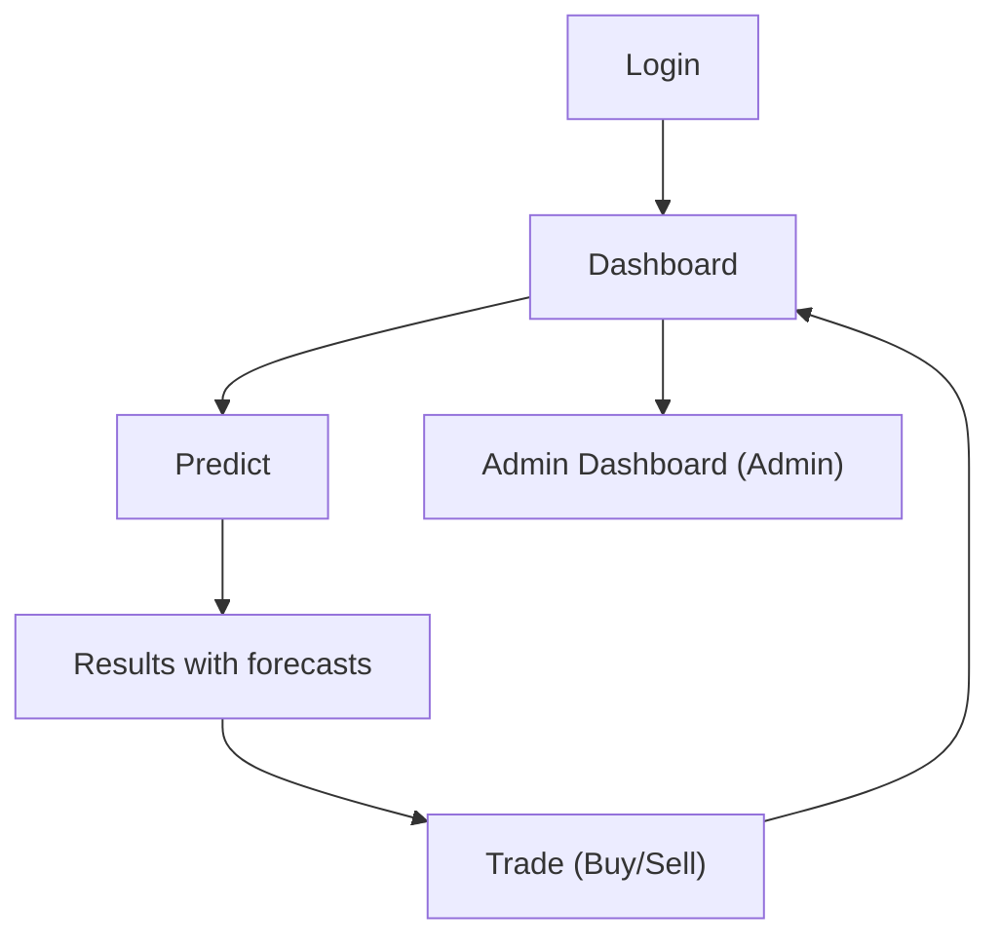
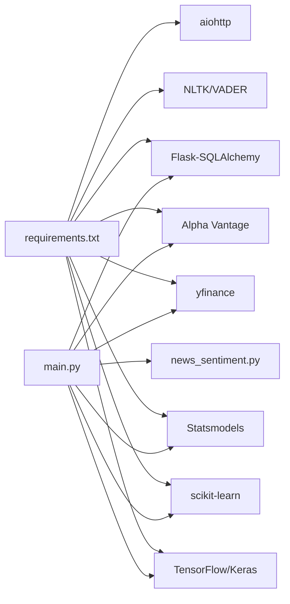

# Core Features

<cite>
**Referenced Files in This Document**
- [main.py](file://main.py)
- [news_sentiment.py](file://news_sentiment.py)
- [templates/index.html](file://templates/index.html)
- [templates/login.html](file://templates/login.html)
- [templates/dashboard.html](file://templates/dashboard.html)
- [templates/admin_dashboard.html](file://templates/admin_dashboard.html)
- [templates/results.html](file://templates/results.html)
- [requirements.txt](file://requirements.txt)
- [demos/advanced_features_demo.py](file://demos/advanced_features_demo.py)
- [demos/selectable_sentiment_sources_demo.py](file://demos/selectable_sentiment_sources_demo.py)
- [tests/test_sentiment_components.py](file://tests/test_sentiment_components.py)
- [tests/test_portfolio_management.py](file://tests/test_portfolio_management.py)
</cite>

## Table of Contents
1. [Introduction](#introduction)
2. [Project Structure](#project-structure)
3. [Core Components](#core-components)
4. [Architecture Overview](#architecture-overview)
5. [Detailed Component Analysis](#detailed-component-analysis)
6. [Dependency Analysis](#dependency-analysis)
7. [Performance Considerations](#performance-considerations)
8. [Troubleshooting Guide](#troubleshooting-guide)
9. [Conclusion](#conclusion)
10. [Appendices](#appendices)

## Introduction
This document presents an integrated overview of the intelligent-stock-prediction system’s core features: Authentication System, Prediction Engine, Sentiment Analysis, Portfolio Management, and Admin Dashboard. It explains how these features interact within user workflows (e.g., login → predict → trade → monitor), documents feature dependencies and data exchange patterns (e.g., sentiment scores influencing predictions), and highlights key differentiators. It also provides configuration requirements, usage examples, and UI integration references.

## Project Structure
The system is a Flask web application with Jinja2 templates for UI, SQLAlchemy for persistence, and modular Python modules for analytics. Key areas:
- Application entry and routing: [main.py](file://main.py)
- Sentiment analysis module: [news_sentiment.py](file://news_sentiment.py)
- UI templates: [templates/index.html](file://templates/index.html), [templates/login.html](file://templates/login.html), [templates/dashboard.html](file://templates/dashboard.html), [templates/admin_dashboard.html](file://templates/admin_dashboard.html), [templates/results.html](file://templates/results.html)
- Dependencies: [requirements.txt](file://requirements.txt)
- Demos and verification: [demos/advanced_features_demo.py](file://demos/advanced_features_demo.py), [demos/selectable_sentiment_sources_demo.py](file://demos/selectable_sentiment_sources_demo.py)
- Tests: [tests/test_sentiment_components.py](file://tests/test_sentiment_components.py), [tests/test_portfolio_management.py](file://tests/test_portfolio_management.py)

**Diagram sources**
- [main.py](file://main.py#L1-L120)
- [news_sentiment.py](file://news_sentiment.py#L1-L120)
- [templates/index.html](file://templates/index.html#L430-L586)
- [templates/login.html](file://templates/login.html#L48-L111)
- [templates/dashboard.html](file://templates/dashboard.html#L1-L284)
- [templates/admin_dashboard.html](file://templates/admin_dashboard.html#L1-L322)
- [templates/results.html](file://templates/results.html#L1-L120)

**Section sources**
- [main.py](file://main.py#L1-L120)
- [requirements.txt](file://requirements.txt#L1-L20)

## Core Components
- Authentication System: Session-based login, CSRF protection, role-based access (user/admin), secure password hashing, and session guards.
- Prediction Engine: ARIMA, LSTM, Linear Regression pipelines integrated with historical price fetching and visualization.
- Sentiment Analysis: Modular sentiment analyzer with selectable sources (Finviz + FinVADER, API fallbacks, RSS), batching, hybrid scoring, and custom lexicons.
- Portfolio Management: Simulated trading, wallet top-ups, dividends, transaction logging, and portfolio valuation.
- Admin Dashboard: Metrics aggregation, broker/company management, and transaction monitoring.

**Section sources**
- [main.py](file://main.py#L121-L220)
- [main.py](file://main.py#L251-L396)
- [main.py](file://main.py#L436-L490)
- [news_sentiment.py](file://news_sentiment.py#L311-L420)
- [templates/admin_dashboard.html](file://templates/admin_dashboard.html#L1-L120)

## Architecture Overview
The system orchestrates user actions through Flask routes, persists state with SQLAlchemy, and integrates external libraries for modeling and data retrieval. The Prediction Engine and Sentiment Analysis feed into a unified results page that displays forecasts, charts, and recommendations.

**Diagram sources**
- [templates/index.html](file://templates/index.html#L468-L488)
- [templates/login.html](file://templates/login.html#L78-L96)
- [main.py](file://main.py#L226-L248)
- [main.py](file://main.py#L545-L642)
- [news_sentiment.py](file://news_sentiment.py#L737-L800)
- [templates/results.html](file://templates/results.html#L143-L206)

## Detailed Component Analysis

### Authentication System
- Session-based login with CSRF token generation and verification.
- Role-based access control for admin-only endpoints.
- Secure password hashing and session cookie configuration.
- Redirects and flash messaging for UX.

Key implementation references:
- Session and CSRF: [main.py](file://main.py#L121-L137)
- Decorator and guards: [main.py](file://main.py#L139-L152)
- Login route and validation: [main.py](file://main.py#L226-L248)
- Registration route and validation: [main.py](file://main.py#L199-L224)
- Templates: [templates/login.html](file://templates/login.html#L48-L111)

**Diagram sources**
- [templates/login.html](file://templates/login.html#L78-L96)
- [main.py](file://main.py#L226-L248)

**Section sources**
- [main.py](file://main.py#L121-L152)
- [main.py](file://main.py#L199-L248)
- [templates/login.html](file://templates/login.html#L48-L111)

### Prediction Engine
- Historical data retrieval via yfinance with fallback to Alpha Vantage when needed.
- Three ML models: ARIMA, LSTM, Linear Regression.
- Visualization of price trends and model accuracy.
- Unified recommendation combining ML predictions and sentiment.

Key implementation references:
- Prediction route and pipeline: [main.py](file://main.py#L545-L642)
- ARIMA/LSTM/Linear Regression functions: [main.py](file://main.py#L583-L846)
- Results rendering: [templates/results.html](file://templates/results.html#L143-L206)

**Diagram sources**
- [main.py](file://main.py#L545-L642)
- [templates/results.html](file://templates/results.html#L143-L206)

**Section sources**
- [main.py](file://main.py#L545-L642)
- [main.py](file://main.py#L583-L846)
- [templates/results.html](file://templates/results.html#L143-L206)

### Sentiment Analysis
- Modular analyzer with selectable sources and use-case configurations.
- FinVADER-based scoring, RSS fallbacks, and API integrations.
- Batch processing, hybrid scoring, and custom lexicons demonstrated in demos.

Key implementation references:
- Analyzer class and sources: [news_sentiment.py](file://news_sentiment.py#L311-L420)
- Finviz + FinVADER integration: [news_sentiment.py](file://news_sentiment.py#L421-L517)
- RSS and API fallbacks: [news_sentiment.py](file://news_sentiment.py#L394-L517)
- Demo usage: [demos/selectable_sentiment_sources_demo.py](file://demos/selectable_sentiment_sources_demo.py#L1-L136), [demos/advanced_features_demo.py](file://demos/advanced_features_demo.py#L1-L154)
- Component verification: [tests/test_sentiment_components.py](file://tests/test_sentiment_components.py#L1-L158)

**Diagram sources**
- [news_sentiment.py](file://news_sentiment.py#L311-L420)
- [news_sentiment.py](file://news_sentiment.py#L96-L150)

**Section sources**
- [news_sentiment.py](file://news_sentiment.py#L311-L517)
- [demos/selectable_sentiment_sources_demo.py](file://demos/selectable_sentiment_sources_demo.py#L1-L136)
- [demos/advanced_features_demo.py](file://demos/advanced_features_demo.py#L1-L154)
- [tests/test_sentiment_components.py](file://tests/test_sentiment_components.py#L1-L158)

### Portfolio Management
- Simulated trading: buy/sell with commission calculation and balance checks.
- Wallet top-ups and dividend recording.
- Portfolio valuation and transaction history.
- Dashboard UI integrates trading controls and prediction triggers.

Key implementation references:
- Buy/Sell routes and validations: [main.py](file://main.py#L268-L376)
- Top-up and dividend routes: [main.py](file://main.py#L378-L434)
- Dashboard rendering and forms: [templates/dashboard.html](file://templates/dashboard.html#L98-L230)
- Tests for portfolio operations: [tests/test_portfolio_management.py](file://tests/test_portfolio_management.py#L1-L316)

**Diagram sources**
- [templates/dashboard.html](file://templates/dashboard.html#L191-L230)
- [main.py](file://main.py#L268-L376)

**Section sources**
- [main.py](file://main.py#L268-L376)
- [main.py](file://main.py#L378-L434)
- [templates/dashboard.html](file://templates/dashboard.html#L98-L230)
- [tests/test_portfolio_management.py](file://tests/test_portfolio_management.py#L1-L316)

### Admin Dashboard
- Metrics: user counts, active users, brokers, transactions, companies, total commission, total volume.
- Broker/company management and transaction listing.
- Role-based access enforced.

Key implementation references:
- Admin route and metrics aggregation: [main.py](file://main.py#L436-L490)
- Admin UI: [templates/admin_dashboard.html](file://templates/admin_dashboard.html#L1-L120)
- Broker/company management forms: [templates/admin_dashboard.html](file://templates/admin_dashboard.html#L137-L266)

**Diagram sources**
- [templates/admin_dashboard.html](file://templates/admin_dashboard.html#L137-L266)
- [main.py](file://main.py#L436-L490)

**Section sources**
- [main.py](file://main.py#L436-L490)
- [templates/admin_dashboard.html](file://templates/admin_dashboard.html#L1-L120)
- [templates/admin_dashboard.html](file://templates/admin_dashboard.html#L137-L266)

### User Workflow Integration
End-to-end user journey:
- Login → Dashboard (portfolio view, trades, predictions) → Predict (ML + sentiment) → Trade (simulated buy/sell) → Monitor (transactions, valuation).

**Diagram sources**
- [templates/login.html](file://templates/login.html#L48-L111)
- [templates/dashboard.html](file://templates/dashboard.html#L1-L120)
- [templates/index.html](file://templates/index.html#L468-L488)
- [templates/results.html](file://templates/results.html#L143-L206)
- [templates/admin_dashboard.html](file://templates/admin_dashboard.html#L1-L120)

**Section sources**
- [templates/login.html](file://templates/login.html#L48-L111)
- [templates/dashboard.html](file://templates/dashboard.html#L1-L120)
- [templates/index.html](file://templates/index.html#L468-L488)
- [templates/results.html](file://templates/results.html#L143-L206)
- [templates/admin_dashboard.html](file://templates/admin_dashboard.html#L1-L120)

## Dependency Analysis
- External libraries: TensorFlow/Keras, scikit-learn, statsmodels, yfinance, Alpha Vantage, NLTK/VADER, aiohttp, Flask-SQLAlchemy.
- Internal dependencies: main.py imports news_sentiment for sentiment, uses SQLAlchemy models, and renders templates.
- Data exchange: Prediction route passes symbol to sentiment analyzer; sentiment results influence recommendation; trading routes update portfolio and balances.

**Diagram sources**
- [requirements.txt](file://requirements.txt#L1-L20)
- [main.py](file://main.py#L1-L60)
- [news_sentiment.py](file://news_sentiment.py#L1-L40)

**Section sources**
- [requirements.txt](file://requirements.txt#L1-L20)
- [main.py](file://main.py#L1-L60)
- [news_sentiment.py](file://news_sentiment.py#L1-L40)

## Performance Considerations
- Model inference: ARIMA/LSTM/Linear Regression involve heavy computation; caching and efficient preprocessing reduce latency.
- Sentiment analysis: Batch processing and selective sources improve throughput; Redis caching is available but disabled in current implementation.
- UI rendering: Static images and D3 charts offload client-side rendering; ensure chart containers are sized appropriately.
- Recommendations: Combining ML predictions with sentiment polarity provides a balanced signal; weighting strategies can be tuned via demos.

[No sources needed since this section provides general guidance]

## Troubleshooting Guide
- Authentication failures: Verify credentials, active status, and CSRF token presence in forms.
- Trading errors: Ensure sufficient balance, valid quantities, and symbol availability; check commission calculations.
- Prediction failures: Confirm symbol validity and network connectivity for data providers.
- Sentiment issues: Check API keys for premium sources and fallback mechanisms; verify Selenium availability if using web scraping paths.

**Section sources**
- [main.py](file://main.py#L226-L248)
- [main.py](file://main.py#L268-L376)
- [main.py](file://main.py#L545-L642)
- [tests/test_sentiment_components.py](file://tests/test_sentiment_components.py#L1-L158)
- [tests/test_portfolio_management.py](file://tests/test_portfolio_management.py#L1-L316)

## Conclusion
The intelligent-stock-prediction system integrates secure authentication, robust prediction pipelines, flexible sentiment analysis, and comprehensive portfolio management into a cohesive workflow. Its modular design enables selectable sentiment sources, hybrid scoring, and use-case-specific configurations, while the admin dashboard provides operational oversight. Together, these features deliver a clear value proposition: actionable insights grounded in multiple models and real-time sentiment.

[No sources needed since this section summarizes without analyzing specific files]

## Appendices

### Configuration Requirements
- Environment variables:
  - SECRET_KEY: Flask secret key for sessions and CSRF.
  - DATABASE_URL: SQLAlchemy database URI (default SQLite).
- Libraries: See [requirements.txt](file://requirements.txt#L1-L20).
- Optional: API keys for Alpha Vantage, EODHD, Finnhub, StockGeist (used by sentiment analyzer).

**Section sources**
- [main.py](file://main.py#L41-L50)
- [requirements.txt](file://requirements.txt#L1-L20)
- [news_sentiment.py](file://news_sentiment.py#L311-L345)

### Usage Examples and UI Integration
- Login and dashboard: [templates/login.html](file://templates/login.html#L48-L111), [templates/dashboard.html](file://templates/dashboard.html#L1-L120)
- Prediction flow: [templates/index.html](file://templates/index.html#L468-L488), [templates/results.html](file://templates/results.html#L143-L206)
- Admin controls: [templates/admin_dashboard.html](file://templates/admin_dashboard.html#L137-L266)
- Demos: [demos/selectable_sentiment_sources_demo.py](file://demos/selectable_sentiment_sources_demo.py#L1-L136), [demos/advanced_features_demo.py](file://demos/advanced_features_demo.py#L1-L154)

**Section sources**
- [templates/index.html](file://templates/index.html#L468-L488)
- [templates/results.html](file://templates/results.html#L143-L206)
- [templates/login.html](file://templates/login.html#L48-L111)
- [templates/dashboard.html](file://templates/dashboard.html#L1-L120)
- [templates/admin_dashboard.html](file://templates/admin_dashboard.html#L137-L266)
- [demos/selectable_sentiment_sources_demo.py](file://demos/selectable_sentiment_sources_demo.py#L1-L136)
- [demos/advanced_features_demo.py](file://demos/advanced_features_demo.py#L1-L154)