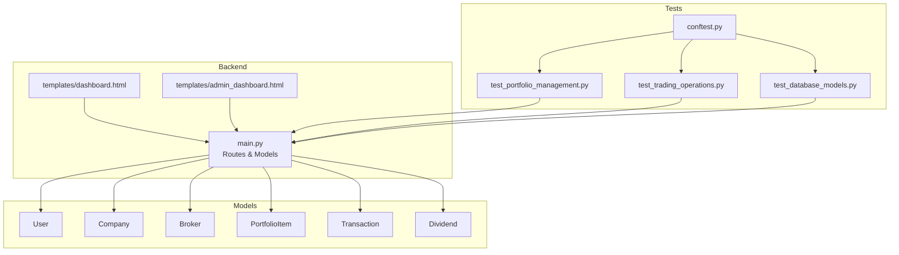
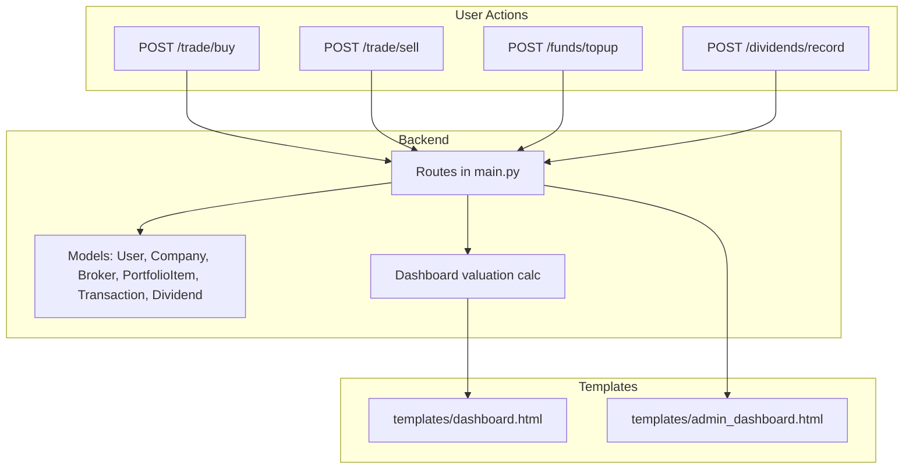
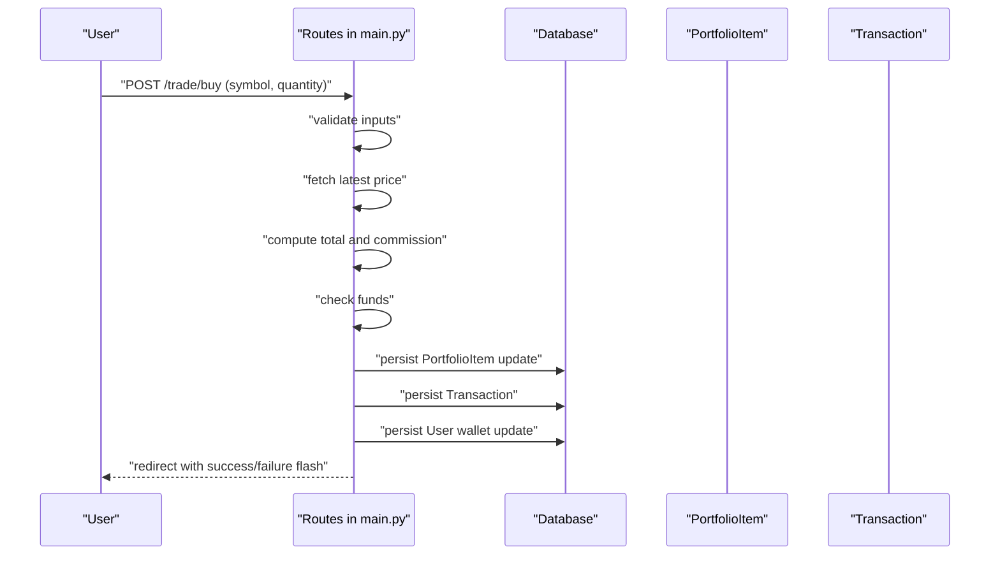
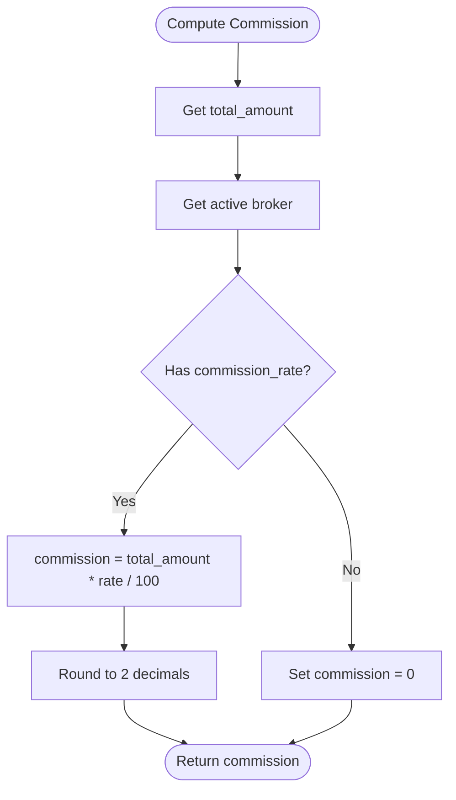
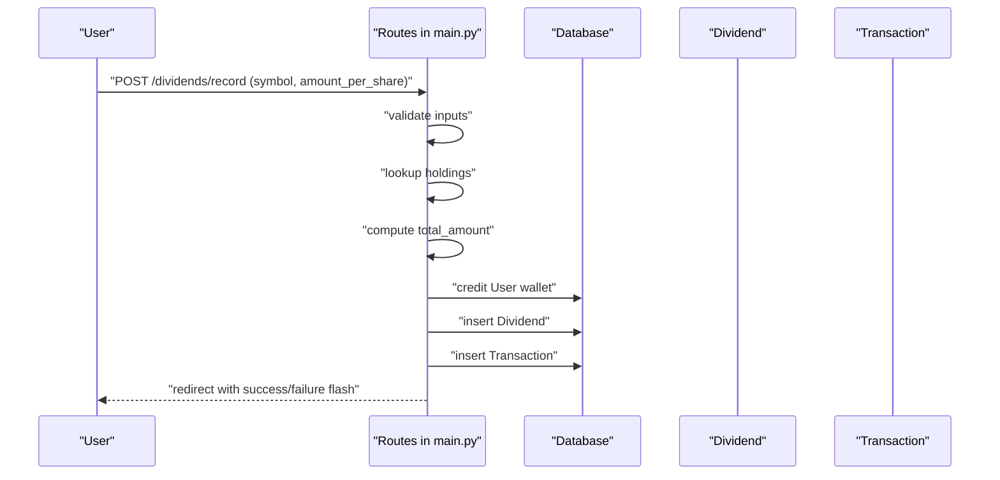
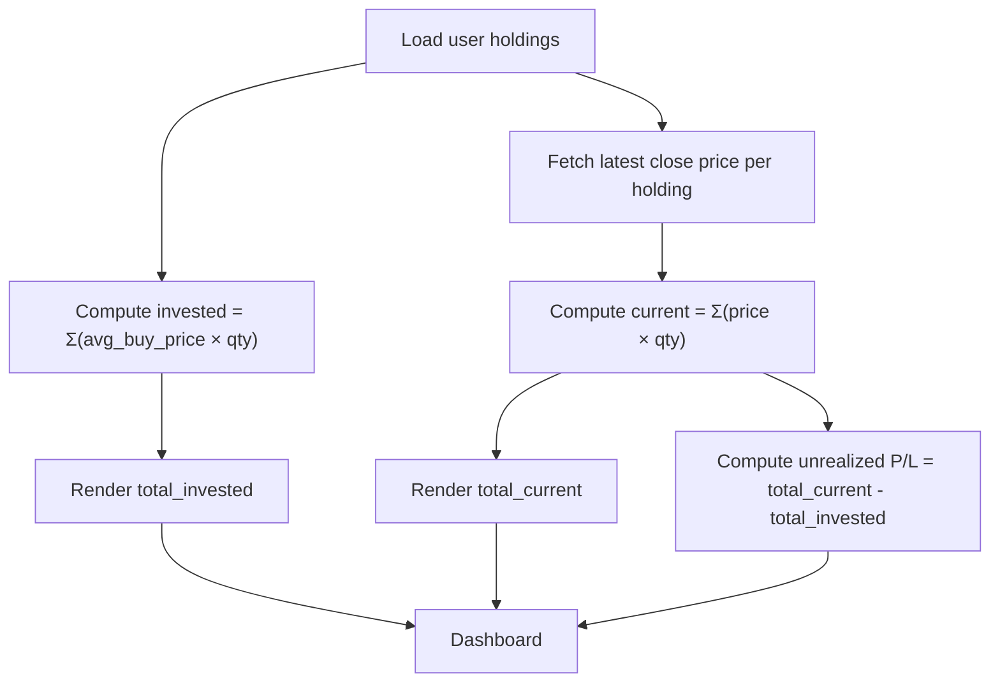
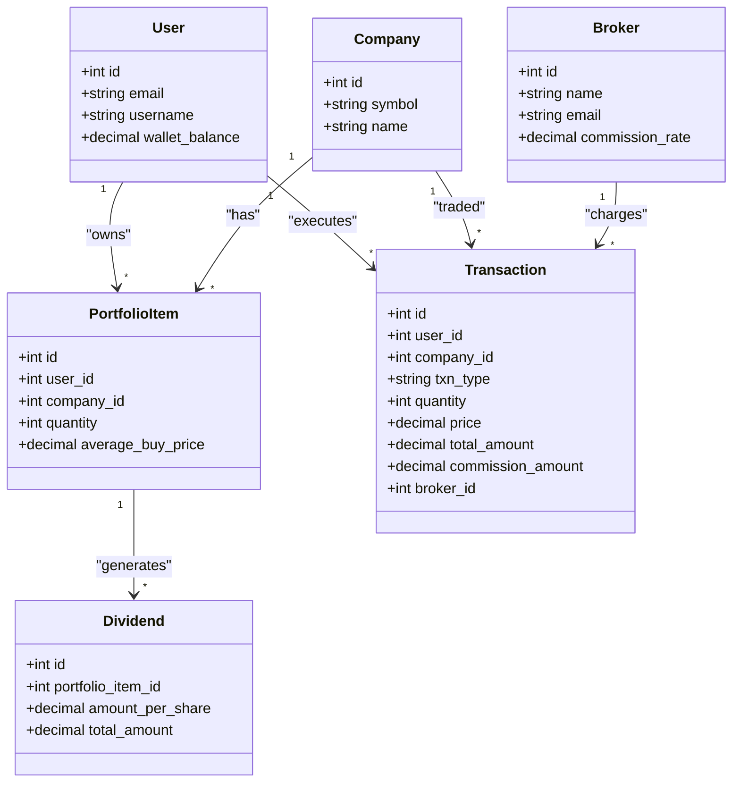
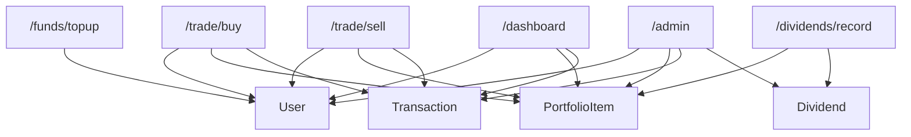

# Portfolio Management

<cite>
**Referenced Files in This Document**
- [main.py](file://main.py)
- [dashboard.html](file://templates/dashboard.html)
- [admin_dashboard.html](file://templates/admin_dashboard.html)
- [test_portfolio_management.py](file://tests/test_portfolio_management.py)
- [test_trading_operations.py](file://tests/test_trading_operations.py)
- [test_database_models.py](file://tests/test_database_models.py)
- [conftest.py](file://tests/conftest.py)
</cite>

## Table of Contents
1. [Introduction](#introduction)
2. [Project Structure](#project-structure)
3. [Core Components](#core-components)
4. [Architecture Overview](#architecture-overview)
5. [Detailed Component Analysis](#detailed-component-analysis)
6. [Dependency Analysis](#dependency-analysis)
7. [Performance Considerations](#performance-considerations)
8. [Troubleshooting Guide](#troubleshooting-guide)
9. [Conclusion](#conclusion)
10. [Appendices](#appendices)

## Introduction
This document explains the Portfolio Management sub-feature, focusing on the virtual wallet system, stock buy/sell operations, commission calculations based on broker configurations, and dividend recording mechanics. It also documents how transactions update portfolio valuations in real time and how holdings are visualized on the dashboard. The content references concrete code paths in main.py and test files to ground the explanation in actual implementation details. Finally, it covers common issues such as insufficient funds, fractional shares, and transaction rollback scenarios, along with usage patterns for portfolio rebalancing and performance tracking, and best practices for financial precision and audit logging.

## Project Structure
Portfolio Management spans backend routes and models, and the frontend dashboard templates. The key elements are:
- Backend routes for buy, sell, dividend recording, and wallet top-ups
- Database models for User, Company, Broker, PortfolioItem, Transaction, and Dividend
- Dashboard templates that render holdings, recent transactions, and valuation summaries
- Tests that validate buy/sell flows, commission calculations, and dividend recording

**Diagram sources**
- [main.py](file://main.py#L51-L119)
- [dashboard.html](file://templates/dashboard.html#L1-L284)
- [admin_dashboard.html](file://templates/admin_dashboard.html#L1-L322)
- [test_portfolio_management.py](file://tests/test_portfolio_management.py#L1-L316)
- [test_trading_operations.py](file://tests/test_trading_operations.py#L1-L348)
- [test_database_models.py](file://tests/test_database_models.py#L1-L356)
- [conftest.py](file://tests/conftest.py#L1-L273)

**Section sources**
- [main.py](file://main.py#L51-L119)
- [dashboard.html](file://templates/dashboard.html#L1-L284)
- [admin_dashboard.html](file://templates/admin_dashboard.html#L1-L322)
- [test_portfolio_management.py](file://tests/test_portfolio_management.py#L1-L316)
- [test_trading_operations.py](file://tests/test_trading_operations.py#L1-L348)
- [test_database_models.py](file://tests/test_database_models.py#L1-L356)
- [conftest.py](file://tests/conftest.py#L1-L273)

## Core Components
- Virtual Wallet: User wallet_balance is a numeric field persisted in the database and updated on buy/sell and dividend events.
- PortfolioItem: Tracks per-symbol holdings per user, including quantity and average_buy_price.
- Transaction: Records all buy/sell/dividend actions with price, quantity, total_amount, commission_amount, and broker association.
- Dividend: Captures per-share dividend amounts and total credited amounts linked to a PortfolioItem.
- Broker: Defines commission_rate used to compute transaction fees.

Key implementation references:
- Wallet and models: [main.py](file://main.py#L51-L119)
- Buy/Sell/Dividend routes: [main.py](file://main.py#L268-L433)
- Dashboard valuation and holdings: [main.py](file://main.py#L251-L266), [dashboard.html](file://templates/dashboard.html#L43-L116)

**Section sources**
- [main.py](file://main.py#L51-L119)
- [main.py](file://main.py#L251-L266)
- [main.py](file://main.py#L268-L433)
- [dashboard.html](file://templates/dashboard.html#L43-L116)

## Architecture Overview
The Portfolio Management feature integrates user actions with database updates and real-time valuation computation. The dashboard aggregates totals from holdings and recent transactions.

**Diagram sources**
- [main.py](file://main.py#L251-L266)
- [main.py](file://main.py#L268-L433)
- [dashboard.html](file://templates/dashboard.html#L43-L116)
- [admin_dashboard.html](file://templates/admin_dashboard.html#L1-L322)

## Detailed Component Analysis

### Virtual Wallet System
- Purpose: Simulates a cash balance for trading within the app.
- Persistence: User.wallet_balance is a numeric field initialized to zero or a test default.
- Operations:
  - Top-up increases wallet_balance by a validated amount.
  - Buy deducts total plus commission from wallet_balance.
  - Sell credits wallet_balance with net proceeds after commission.
  - Dividend adds total dividend amount to wallet_balance.

Validation and error handling:
- Amounts are parsed as decimals; invalid inputs are rejected.
- Buy requires sufficient funds including commission.
- Sell requires sufficient quantity; otherwise rejected.

References:
- Wallet model and defaults: [main.py](file://main.py#L51-L60), [test_database_models.py](file://tests/test_database_models.py#L99-L112)
- Top-up route: [main.py](file://main.py#L378-L396)
- Buy route and balance updates: [main.py](file://main.py#L268-L324)
- Sell route and balance updates: [main.py](file://main.py#L327-L375)
- Dividend route and balance updates: [main.py](file://main.py#L398-L433)
- Tests for wallet operations: [test_portfolio_management.py](file://tests/test_portfolio_management.py#L14-L73)

**Section sources**
- [main.py](file://main.py#L51-L60)
- [main.py](file://main.py#L378-L396)
- [main.py](file://main.py#L268-L324)
- [main.py](file://main.py#L327-L375)
- [main.py](file://main.py#L398-L433)
- [test_portfolio_management.py](file://tests/test_portfolio_management.py#L14-L73)
- [test_database_models.py](file://tests/test_database_models.py#L99-L112)

### Stock Buy/Sell Operations
- Buy:
  - Validates symbol and quantity; fetches latest close price; computes total and commission; checks funds; updates PortfolioItem average_buy_price and quantity; decrements wallet_balance by total + commission; records Transaction.
- Sell:
  - Validates symbol and quantity; ensures sufficient holdings; computes proceeds; updates PortfolioItem quantity or deletes it when zero; increments wallet_balance by net proceeds; records Transaction.

References:
- Buy route: [main.py](file://main.py#L268-L324)
- Sell route: [main.py](file://main.py#L327-L375)
- Tests for buy/sell: [test_trading_operations.py](file://tests/test_trading_operations.py#L13-L204)

**Diagram sources**
- [main.py](file://main.py#L268-L324)
- [test_trading_operations.py](file://tests/test_trading_operations.py#L13-L133)

**Section sources**
- [main.py](file://main.py#L268-L324)
- [main.py](file://main.py#L327-L375)
- [test_trading_operations.py](file://tests/test_trading_operations.py#L13-L204)

### Commission Calculations Based on Broker Configurations
- Active broker is fetched; commission computed as total_amount multiplied by broker.commission_rate divided by 100, rounded to two decimal places.
- Commission is included in buy total and subtracted from proceeds in sell.

References:
- Active broker selection: [main.py](file://main.py#L172-L174)
- Commission calculation: [main.py](file://main.py#L176-L184)
- Broker model: [main.py](file://main.py#L75-L81)
- Tests for commission: [test_trading_operations.py](file://tests/test_trading_operations.py#L206-L267)

**Diagram sources**
- [main.py](file://main.py#L172-L184)
- [main.py](file://main.py#L75-L81)

**Section sources**
- [main.py](file://main.py#L172-L184)
- [main.py](file://main.py#L75-L81)
- [test_trading_operations.py](file://tests/test_trading_operations.py#L206-L267)

### Dividend Recording Mechanics
- Validates symbol and positive amount_per_share.
- Ensures user has holdings for the symbol.
- Computes total_amount = amount_per_share × quantity.
- Credits wallet_balance and records Dividend and Transaction.

References:
- Dividend route: [main.py](file://main.py#L398-L433)
- Tests for dividend: [test_portfolio_management.py](file://tests/test_portfolio_management.py#L274-L316)

**Diagram sources**
- [main.py](file://main.py#L398-L433)

**Section sources**
- [main.py](file://main.py#L398-L433)
- [test_portfolio_management.py](file://tests/test_portfolio_management.py#L274-L316)

### Real-Time Portfolio Valuation and Dashboard Visualization
- Dashboard computes:
  - total_invested = sum of average_buy_price × quantity across holdings
  - total_current = sum of latest close price × quantity across holdings
  - Unrealized P/L = total_current − total_invested
- These values are rendered in the dashboard template.

References:
- Dashboard valuation logic: [main.py](file://main.py#L251-L266)
- Dashboard template rendering: [dashboard.html](file://templates/dashboard.html#L43-L116)
- Tests for portfolio calculations: [test_portfolio_management.py](file://tests/test_portfolio_management.py#L162-L237)

**Diagram sources**
- [main.py](file://main.py#L251-L266)
- [dashboard.html](file://templates/dashboard.html#L43-L116)

**Section sources**
- [main.py](file://main.py#L251-L266)
- [dashboard.html](file://templates/dashboard.html#L43-L116)
- [test_portfolio_management.py](file://tests/test_portfolio_management.py#L162-L237)

### Relationship Between PortfolioItem, Transaction, Dividend, and Broker
- PortfolioItem belongs to a User and a Company; tracks quantity and average_buy_price.
- Transaction belongs to a User, a Company, and optionally a Broker; captures txn_type, quantity, price, total_amount, commission_amount, and description.
- Dividend belongs to a PortfolioItem; captures amount_per_share and total_amount.
- Broker defines commission_rate used to compute commission_amount on transactions.

**Diagram sources**
- [main.py](file://main.py#L51-L119)

**Section sources**
- [main.py](file://main.py#L51-L119)

### Usage Patterns: Portfolio Rebalancing and Performance Tracking
- Rebalancing:
  - Use buy/sell routes to adjust holdings toward target weights.
  - Monitor current value vs. invested value on the dashboard to assess drift.
  - Track transaction history to review timing and costs.
- Performance tracking:
  - Compare total_current vs. total_invested to measure unrealized P/L.
  - Use transaction history to compute realized gains/losses and total commissions paid.

References:
- Dashboard valuation: [main.py](file://main.py#L251-L266), [dashboard.html](file://templates/dashboard.html#L43-L116)
- Transaction history on dashboard: [dashboard.html](file://templates/dashboard.html#L231-L271)
- Admin monitoring dashboard: [admin_dashboard.html](file://templates/admin_dashboard.html#L1-L322)

**Section sources**
- [main.py](file://main.py#L251-L266)
- [dashboard.html](file://templates/dashboard.html#L43-L116)
- [dashboard.html](file://templates/dashboard.html#L231-L271)
- [admin_dashboard.html](file://templates/admin_dashboard.html#L1-L322)

### Best Practices for Financial Precision and Audit Logging
- Precision:
  - Use decimal arithmetic for currency and price computations to avoid floating-point rounding errors.
  - Round commission amounts to two decimal places consistently.
- Audit logging:
  - All buy/sell/dividend actions create Transaction records with timestamps, descriptions, and broker associations.
  - Admin dashboard aggregates transaction counts, volumes, and total commission for monitoring.

References:
- Decimal usage and rounding: [main.py](file://main.py#L176-L184)
- Transaction records: [main.py](file://main.py#L94-L109), [test_database_models.py](file://tests/test_database_models.py#L249-L296)
- Admin monitoring: [main.py](file://main.py#L436-L490), [admin_dashboard.html](file://templates/admin_dashboard.html#L1-L322)

**Section sources**
- [main.py](file://main.py#L176-L184)
- [main.py](file://main.py#L94-L109)
- [test_database_models.py](file://tests/test_database_models.py#L249-L296)
- [main.py](file://main.py#L436-L490)
- [admin_dashboard.html](file://templates/admin_dashboard.html#L1-L322)

## Dependency Analysis
- Routes depend on models and helpers (latest price fetch, active broker, commission calculation).
- Dashboard depends on models to compute totals and renders transaction history.
- Tests depend on fixtures to simulate users, companies, brokers, and transactions.

**Diagram sources**
- [main.py](file://main.py#L251-L266)
- [main.py](file://main.py#L268-L433)
- [dashboard.html](file://templates/dashboard.html#L43-L116)
- [admin_dashboard.html](file://templates/admin_dashboard.html#L1-L322)

**Section sources**
- [main.py](file://main.py#L251-L266)
- [main.py](file://main.py#L268-L433)
- [dashboard.html](file://templates/dashboard.html#L43-L116)
- [admin_dashboard.html](file://templates/admin_dashboard.html#L1-L322)

## Performance Considerations
- Price fetching: Latest close price is fetched per symbol; caching or batching could reduce API calls in production.
- Decimal arithmetic: Using Decimal avoids costly floating-point conversions and ensures consistent rounding.
- Transaction history: Limiting recent transactions on the dashboard reduces rendering overhead.

[No sources needed since this section provides general guidance]

## Troubleshooting Guide
Common issues and resolutions:
- Insufficient funds for buy:
  - Validation compares wallet_balance with total plus commission; ensure sufficient balance and correct symbol/quantity.
  - Reference: [main.py](file://main.py#L268-L324), [test_trading_operations.py](file://tests/test_trading_operations.py#L41-L53)
- Not enough shares to sell:
  - Validation checks item.quantity vs. requested quantity; ensure holdings exist.
  - Reference: [main.py](file://main.py#L327-L375), [test_trading_operations.py](file://tests/test_trading_operations.py#L158-L167)
- Invalid quantity or amount:
  - Routes reject non-integers or non-positive values; ensure numeric inputs.
  - Reference: [main.py](file://main.py#L268-L324), [main.py](file://main.py#L378-L396), [test_trading_operations.py](file://tests/test_trading_operations.py#L73-L101)
- Fractional shares:
  - Current buy/sell routes accept integer quantities; fractional shares are not supported in these endpoints.
  - Reference: [main.py](file://main.py#L268-L324), [main.py](file://main.py#L327-L375)
- Transaction rollback scenarios:
  - The routes commit within a single request; there is no explicit rollback mechanism. If robustness is required, wrap operations in a transaction and handle exceptions centrally.
  - Reference: [main.py](file://main.py#L268-L324), [main.py](file://main.py#L327-L375), [main.py](file://main.py#L398-L433)

**Section sources**
- [main.py](file://main.py#L268-L324)
- [main.py](file://main.py#L327-L375)
- [main.py](file://main.py#L378-L396)
- [test_trading_operations.py](file://tests/test_trading_operations.py#L41-L101)

## Conclusion
The Portfolio Management sub-feature provides a robust, test-backed framework for simulating trading within the application. It includes a virtual wallet, buy/sell operations with commission calculations, dividend recording, and real-time portfolio valuation on the dashboard. The models and routes are designed for clarity and maintainability, with strong test coverage for critical flows. For production deployments, consider adding explicit transaction rollback handling, caching for price lookups, and enhanced audit logging.

[No sources needed since this section summarizes without analyzing specific files]

## Appendices

### Example References to Transaction Processing Logic and Database Updates
- Buy route logic and database updates: [main.py](file://main.py#L268-L324)
- Sell route logic and database updates: [main.py](file://main.py#L327-L375)
- Dividend route logic and database updates: [main.py](file://main.py#L398-L433)
- Commission calculation: [main.py](file://main.py#L176-L184)
- Active broker selection: [main.py](file://main.py#L172-L174)
- Dashboard valuation computation: [main.py](file://main.py#L251-L266)
- Dashboard template rendering: [dashboard.html](file://templates/dashboard.html#L43-L116)
- Admin monitoring dashboard: [admin_dashboard.html](file://templates/admin_dashboard.html#L1-L322)

**Section sources**
- [main.py](file://main.py#L172-L184)
- [main.py](file://main.py#L251-L266)
- [main.py](file://main.py#L268-L324)
- [main.py](file://main.py#L327-L375)
- [main.py](file://main.py#L398-L433)
- [dashboard.html](file://templates/dashboard.html#L43-L116)
- [admin_dashboard.html](file://templates/admin_dashboard.html#L1-L322)