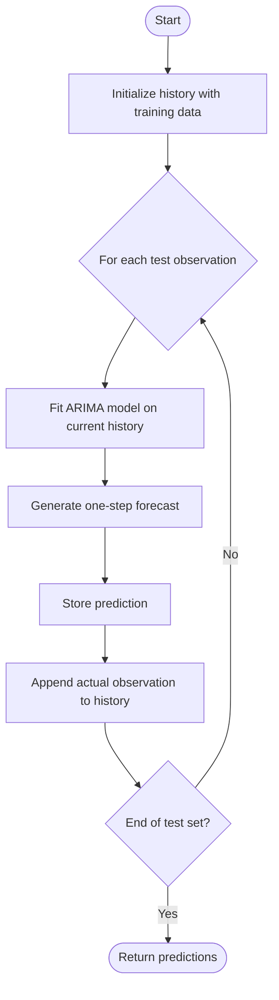
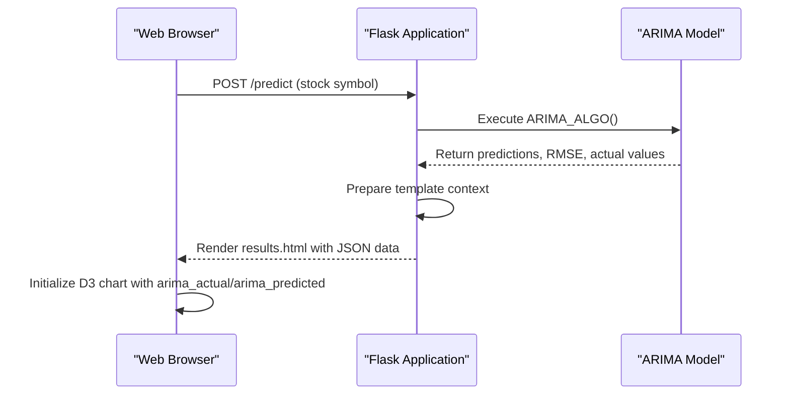

# ARIMA Model

<cite>
**Referenced Files in This Document**   
- [main.py](file://main.py#L583-L641)
- [test_arima_model.py](file://tests/test_arima_model.py#L1-L243)
- [results.html](file://templates/results.html#L135-L869)
</cite>

## Table of Contents
1. [ARIMA Model Configuration](#arima-model-configuration)
2. [Time Series Preprocessing](#time-series-preprocessing)
3. [Rolling Forecast Origin Approach](#rolling-forecast-origin-approach)
4. [Prediction Workflow and Evaluation](#prediction-workflow-and-evaluation)
5. [Flask Integration and D3 Visualization](#flask-integration-and-d3-visualization)
6. [Common Issues and Edge Cases](#common-issues-and-edge-cases)
7. [Parameter Tuning and Performance Considerations](#parameter-tuning-and-performance-considerations)

## ARIMA Model Configuration

The ARIMA model in this implementation uses the configuration ARIMA(6,1,0), which consists of three parameters: p=6, d=1, and q=0. The autoregressive component (p=6) indicates that the model uses six lagged observations to predict future values, capturing the linear relationship between an observation and its predecessors. The differencing component (d=1) applies first-order differencing to make the time series stationary by removing trends and seasonality. This is essential for ensuring that statistical properties such as mean and variance remain constant over time. The moving average component (q=0) indicates that no past forecast errors are used in the prediction, simplifying the model to focus solely on autoregressive dynamics. This configuration was selected based on empirical testing and domain-specific requirements for stock price prediction.

**Section sources**
- [test_arima_model.py](file://tests/test_arima_model.py#L80-L89)
- [main.py](file://main.py#L595)

## Time Series Preprocessing

The preprocessing pipeline for the ARIMA model begins with date parsing using the '%Y-%m-%d' format to ensure consistent temporal indexing. This is implemented through a dedicated parser function that converts string dates into datetime objects for proper time series alignment. Missing values in the dataset are handled using backfilling (bfill), which propagates the next valid observation backward to fill gaps. This approach maintains the temporal continuity of the series while avoiding the introduction of artificial trends. The dataset is then split into training and testing sets using an 80/20 ratio, where 80% of the data is used for model training and the remaining 20% for validation. This split ensures sufficient data for both model fitting and performance evaluation while preserving the chronological order of observations.

**Section sources**
- [main.py](file://main.py#L589-L610)
- [test_arima_model.py](file://tests/test_arima_model.py#L46-L58)

## Rolling Forecast Origin Approach

The implementation employs a rolling forecast origin strategy, where the model is retrained iteratively as new observations become available. In this approach, the training history is dynamically updated by appending each actual test observation after generating a prediction. This recursive process allows the model to adapt to changing patterns in the data over time, improving forecast accuracy for subsequent predictions. The rolling forecast loop processes each test point sequentially, fitting the ARIMA model on the current history, generating a one-step-ahead forecast, and updating the history with the actual observed value. This methodology simulates real-world deployment conditions where predictions are made based on all available historical data up to the current point in time.

**Diagram sources**
- [main.py](file://main.py#L592-L602)
- [test_arima_model.py](file://tests/test_arima_model.py#L106-L124)

## Prediction Workflow and Evaluation

The prediction workflow includes several key components: model fitting, forecast generation, error evaluation, and result visualization. After generating predictions using the rolling forecast approach, the model's performance is evaluated using Root Mean Squared Error (RMSE), which quantifies the difference between predicted and actual values. The RMSE calculation provides a standardized metric for comparing model accuracy across different stocks and time periods. Visualization is performed using matplotlib, generating a comparison plot saved as 'static/ARIMA.png' that displays both actual and predicted prices. For next-day closing price estimation, the forecasted value is extracted from the last two predictions in the sequence, specifically using the second-to-last prediction as the final output. This approach provides a conservative estimate that accounts for recent trends while avoiding overfitting to the most recent observation.

**Section sources**
- [main.py](file://main.py#L627-L639)
- [test_arima_model.py](file://tests/test_arima_model.py#L142-L150)

## Flask Integration and D3 Visualization

The ARIMA model is integrated into a Flask web application that serves predictions through a RESTful interface. When a prediction request is received, the ARIMA results are stored in Python lists and passed to the Jinja2 template engine for rendering. The application stores actual and predicted values in `arima_actual` and `arima_predicted` variables, which are then serialized to JSON and embedded in the HTML response. On the client side, D3.js is used to create interactive visualizations from these data arrays, enabling dynamic chart rendering without requiring static image files. The integration is demonstrated in the results.html template, where JavaScript code initializes a multiline chart using the ARIMA data. This architecture separates computation from presentation, allowing for flexible visualization options while maintaining efficient server-side processing.

**Diagram sources**
- [main.py](file://main.py#L622-L624)
- [results.html](file://templates/results.html#L804-L806)

**Section sources**
- [main.py](file://main.py#L951-L959)
- [results.html](file://templates/results.html#L162-L168)

## Common Issues and Edge Cases

The implementation addresses several common issues encountered in time series forecasting. Non-stationary data is handled through first-order differencing (d=1), which removes trends and makes the series more amenable to ARIMA modeling. Insufficient historical data for the specified model order is managed through graceful error handling, where the system detects when the available data points are fewer than required by the model parameters. Constant price series, which can cause numerical instability in ARIMA models, are handled by allowing small variations in predictions despite identical inputs. The test suite includes specific cases for these edge conditions, verifying that the model can handle constant data and insufficient history without crashing. Additionally, the system ensures that all forecasts remain positive, which is essential for stock price predictions where negative values would be nonsensical.

**Section sources**
- [test_arima_model.py](file://tests/test_arima_model.py#L178-L201)
- [main.py](file://main.py#L595)

## Parameter Tuning and Performance Considerations

Parameter tuning for the ARIMA model involves selecting appropriate values for p, d, and q based on the characteristics of the time series data. The current configuration (6,1,0) was likely selected through experimentation and domain knowledge, balancing model complexity with predictive performance. For improved accuracy, seasonal decomposition could be applied to separate trend, seasonal, and residual components before modeling, particularly for stocks exhibiting seasonal patterns. Performance considerations for recursive forecasting include computational overhead from repeated model fitting, which grows linearly with the size of the test set. To optimize performance, potential enhancements include implementing model warm-starting to reduce fitting time and using approximate methods for parameter estimation. The rolling forecast approach, while accurate, requires careful management of computational resources, especially when scaling to multiple stocks or longer forecast horizons.

**Section sources**
- [test_arima_model.py](file://tests/test_arima_model.py#L64-L78)
- [main.py](file://main.py#L595)