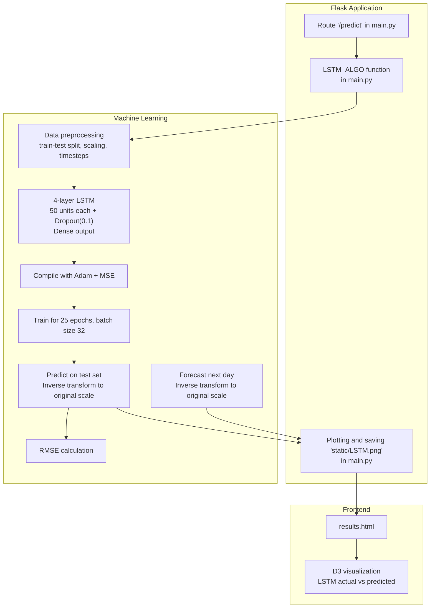
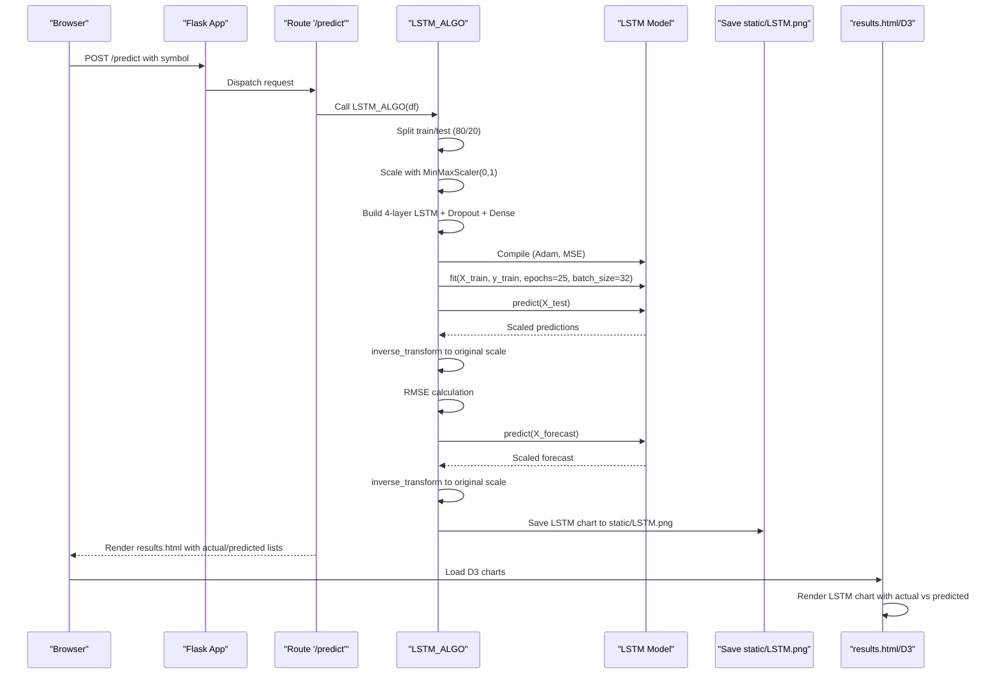
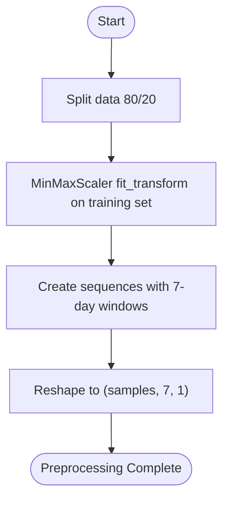
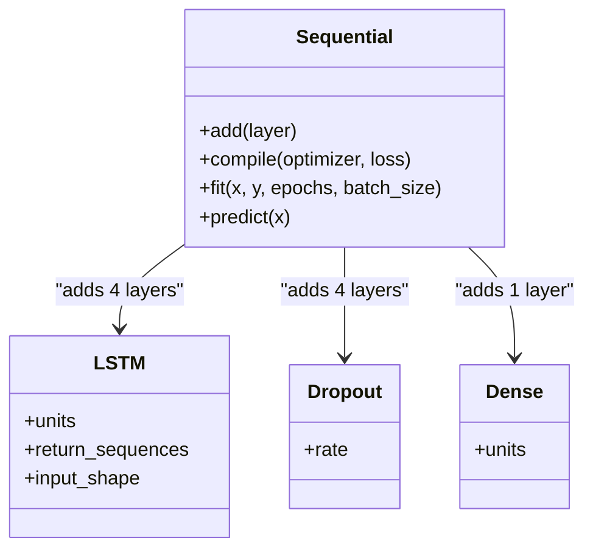
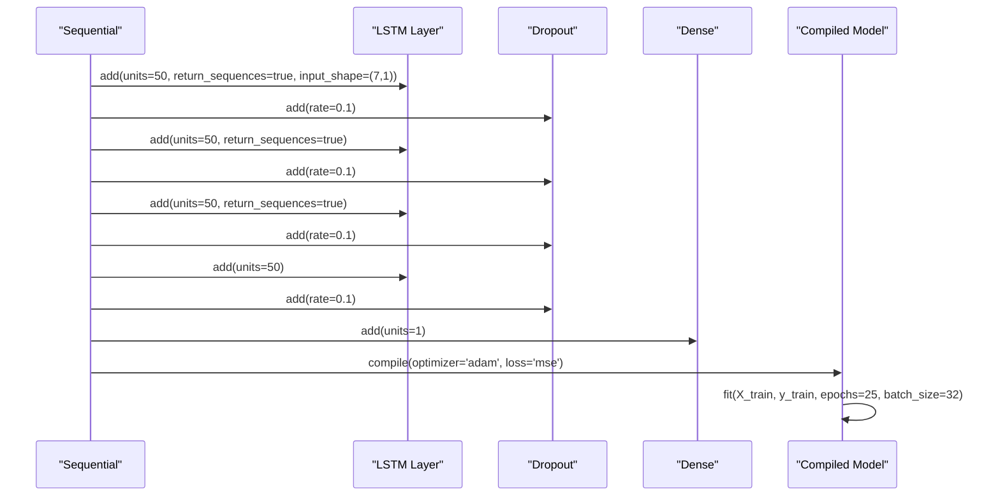
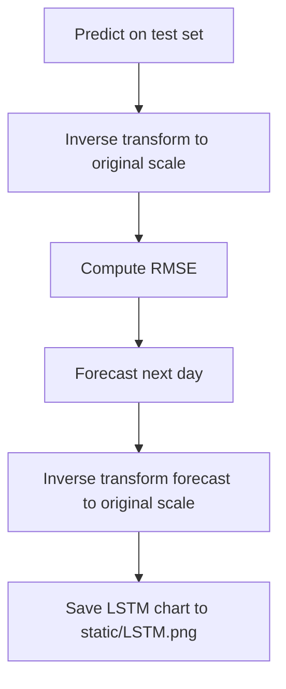
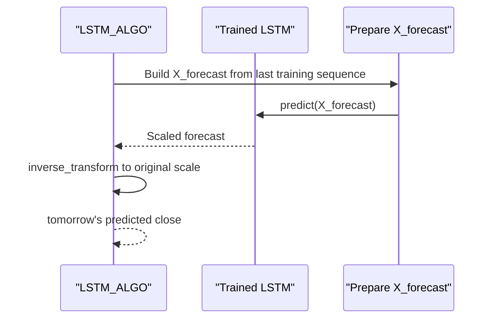
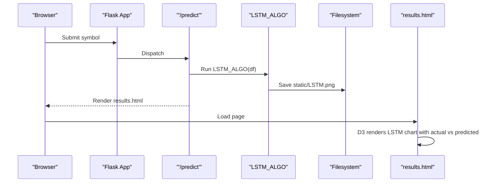
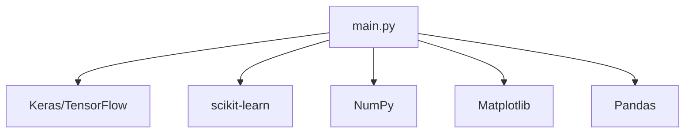

# LSTM Model

<cite>
**Referenced Files in This Document**
- [main.py](file://main.py)
- [tests/test_lstm_model.py](file://tests/test_lstm_model.py)
- [tests/test_helpers.py](file://tests/test_helpers.py)
- [templates/results.html](file://templates/results.html)
- [requirements.txt](file://requirements.txt)
</cite>

## Table of Contents
1. [Introduction](#introduction)
2. [Project Structure](#project-structure)
3. [Core Components](#core-components)
4. [Architecture Overview](#architecture-overview)
5. [Detailed Component Analysis](#detailed-component-analysis)
6. [Dependency Analysis](#dependency-analysis)
7. [Performance Considerations](#performance-considerations)
8. [Troubleshooting Guide](#troubleshooting-guide)
9. [Conclusion](#conclusion)
10. [Appendices](#appendices)

## Introduction
This document explains the LSTM model implementation used for stock price prediction in the application. It covers the 4-layer LSTM architecture with 50 units each, dropout regularization, and a Dense output layer. It documents the data preprocessing pipeline including an 80/20 train-test split, MinMaxScaler normalization to [0, 1], and 7-day timesteps for sequence modeling. It describes model compilation with the Adam optimizer and mean squared error loss, training with 25 epochs and batch size 32, and the prediction workflow including inverse scaling to restore original price values and RMSE calculation. It also explains the forecasting mechanism using the last trained sequence to predict the next day’s closing price and how the Flask route integrates with the frontend to visualize LSTM predictions in static/LSTM.png and return data for D3 visualization.

## Project Structure
The LSTM implementation resides in the Flask route that orchestrates data fetching, preprocessing, model training, evaluation, and visualization. Supporting tests validate data preparation, model architecture, training, prediction, and error metrics. The frontend renders the LSTM chart using D3 with data passed from the backend.

**Diagram sources**
- [main.py](file://main.py#L545-L960)
- [templates/results.html](file://templates/results.html#L800-L860)

**Section sources**
- [main.py](file://main.py#L545-L960)
- [templates/results.html](file://templates/results.html#L800-L860)

## Core Components
- LSTM preprocessing pipeline:
  - 80/20 train-test split
  - MinMaxScaler normalization to [0, 1]
  - Creation of 7-day timesteps for sequence modeling
- LSTM model architecture:
  - 4 LSTM layers with 50 units each
  - Dropout(0.1) after each LSTM layer
  - Dense output layer
- Model compilation:
  - Optimizer: Adam
  - Loss: mean squared error
- Training:
  - 25 epochs
  - Batch size 32
- Prediction workflow:
  - Predict on test set
  - Inverse transform to restore original price scale
  - RMSE calculation
  - Forecast next day using the last sequence
- Visualization:
  - Save LSTM chart to static/LSTM.png
  - Pass actual and predicted series to frontend for D3 rendering

**Section sources**
- [main.py](file://main.py#L646-L778)
- [tests/test_lstm_model.py](file://tests/test_lstm_model.py#L93-L136)
- [tests/test_lstm_model.py](file://tests/test_lstm_model.py#L138-L179)
- [tests/test_lstm_model.py](file://tests/test_lstm_model.py#L181-L259)
- [tests/test_lstm_model.py](file://tests/test_lstm_model.py#L262-L302)
- [templates/results.html](file://templates/results.html#L800-L860)

## Architecture Overview
The LSTM prediction pipeline is encapsulated inside the Flask route and invoked by the user. The route fetches historical data, preprocesses it, builds and trains the LSTM model, evaluates it, forecasts the next day, saves the LSTM chart, and renders the results page with data for D3.

**Diagram sources**
- [main.py](file://main.py#L545-L960)
- [templates/results.html](file://templates/results.html#L800-L860)

## Detailed Component Analysis

### LSTM Data Preprocessing Pipeline
- Train-test split: 80% training, 20% testing.
- Feature scaling: MinMaxScaler normalized to [0, 1].
- Sequence creation: 7-day timesteps with one target per sequence.
- Reshaping: Input tensors shaped as (samples, timesteps, features).

**Diagram sources**
- [main.py](file://main.py#L646-L709)
- [tests/test_lstm_model.py](file://tests/test_lstm_model.py#L22-L69)

**Section sources**
- [main.py](file://main.py#L646-L709)
- [tests/test_lstm_model.py](file://tests/test_lstm_model.py#L22-L69)

### LSTM Model Architecture
- 4 LSTM layers with 50 units each.
- Dropout(0.1) after each LSTM layer.
- Dense output layer for single-step prediction.
- Compilation with Adam optimizer and mean squared error loss.

**Diagram sources**
- [main.py](file://main.py#L683-L715)
- [tests/test_lstm_model.py](file://tests/test_lstm_model.py#L93-L136)

**Section sources**
- [main.py](file://main.py#L683-L715)
- [tests/test_lstm_model.py](file://tests/test_lstm_model.py#L93-L136)

### Model Compilation and Training
- Optimizer: Adam
- Loss: mean squared error
- Training: 25 epochs, batch size 32

**Diagram sources**
- [main.py](file://main.py#L683-L718)
- [tests/test_lstm_model.py](file://tests/test_lstm_model.py#L138-L179)

**Section sources**
- [main.py](file://main.py#L714-L718)
- [tests/test_lstm_model.py](file://tests/test_lstm_model.py#L138-L179)

### Prediction Workflow and Evaluation
- Predict on test sequences.
- Inverse transform scaled predictions to original scale.
- Compute RMSE between actual and predicted prices.
- Forecast next day’s closing price using the last sequence and inverse transform.

**Diagram sources**
- [main.py](file://main.py#L720-L778)
- [tests/test_lstm_model.py](file://tests/test_lstm_model.py#L262-L302)

**Section sources**
- [main.py](file://main.py#L720-L778)
- [tests/test_lstm_model.py](file://tests/test_lstm_model.py#L262-L302)

### Forecasting Mechanism
- The forecast uses the last sequence from the training set appended with the last training label to form a 7-day input.
- The model predicts the next value, which is then inverse transformed to the original scale.

**Diagram sources**
- [main.py](file://main.py#L675-L679)
- [main.py](file://main.py#L766-L771)
- [tests/test_lstm_model.py](file://tests/test_lstm_model.py#L224-L259)

**Section sources**
- [main.py](file://main.py#L675-L679)
- [main.py](file://main.py#L766-L771)
- [tests/test_lstm_model.py](file://tests/test_lstm_model.py#L224-L259)

### Flask Route Integration and Visualization
- The Flask route triggers LSTM_ALGO, which generates static/LSTM.png and returns the results page.
- The frontend receives actual and predicted lists and renders the LSTM chart using D3.

**Diagram sources**
- [main.py](file://main.py#L545-L960)
- [templates/results.html](file://templates/results.html#L800-L860)

**Section sources**
- [main.py](file://main.py#L545-L960)
- [templates/results.html](file://templates/results.html#L800-L860)

## Dependency Analysis
External libraries used for LSTM implementation:
- TensorFlow/Keras for building and training the LSTM model
- scikit-learn for MinMaxScaler
- NumPy for numerical operations
- Matplotlib for saving plots
- Pandas for data manipulation

**Diagram sources**
- [requirements.txt](file://requirements.txt#L1-L19)
- [main.py](file://main.py#L1-L40)

**Section sources**
- [requirements.txt](file://requirements.txt#L1-L19)
- [main.py](file://main.py#L1-L40)

## Performance Considerations
- GPU acceleration: Ensure TensorFlow/Keras is configured to use GPU if available. This can significantly reduce training time for LSTM models.
- Batch size tuning: While the implementation uses batch size 32, experimentation with larger batches (e.g., 64 or 128) can improve throughput depending on memory capacity.
- Early stopping: Incorporate early stopping during training to prevent overfitting and reduce training time when validation loss stops improving.
- Gradient clipping: Consider adding gradient clipping to mitigate exploding gradients in deep LSTM networks.
- Sequence length: The current implementation uses 7-day timesteps. Experimenting with different lengths may impact model performance and training speed.
- Data size: Larger datasets generally improve model performance but increase training time. Consider data augmentation or sampling strategies if data is limited.

[No sources needed since this section provides general guidance]

## Troubleshooting Guide
Common issues and mitigations:
- Overfitting:
  - Use dropout (already implemented at 0.1) and consider reducing model complexity (fewer layers or units).
  - Add regularization (L1/L2) to dense layers if needed.
  - Use early stopping to halt training when validation loss plateaus.
- Vanishing gradients:
  - Ensure proper initialization and learning rate scheduling.
  - Consider using gradient clipping.
  - Verify sequence length and model depth; very long sequences or too many layers can exacerbate vanishing gradients.
- Long training times:
  - Reduce epochs or use early stopping.
  - Increase batch size if memory allows.
  - Enable GPU acceleration.
  - Use mixed precision training if supported by your environment.
- Data quality:
  - Ensure sufficient historical data and handle missing values appropriately.
  - Validate that the 7-day timestep aligns with the intended forecasting horizon.

**Section sources**
- [main.py](file://main.py#L683-L718)
- [tests/test_lstm_model.py](file://tests/test_lstm_model.py#L93-L136)

## Conclusion
The LSTM implementation follows a standard sequence-to-sequence pattern with 4 LSTM layers, dropout regularization, and a Dense output. The preprocessing pipeline ensures consistent scaling and temporal structure, while the training regimen uses Adam and MSE with 25 epochs and batch size 32. The prediction workflow restores original scales via inverse transformation, computes RMSE, and forecasts the next day’s closing price. The Flask route integrates visualization by saving static/LSTM.png and passing data to the frontend for D3 rendering. With appropriate tuning—especially around early stopping, batch size, and GPU utilization—the model can achieve robust performance while managing training time effectively.

[No sources needed since this section summarizes without analyzing specific files]

## Appendices

### Appendix A: Example References from Tests
- Data preparation tests validate MinMax scaling, 7-day timesteps, train-test split, and 3D reshaping.
- Model architecture tests verify the 4-layer LSTM with 50 units each and Dense output.
- Training tests confirm fitting with correct shapes and batch size.
- Prediction tests validate inverse scaling and next-day forecasting.
- Error metric tests confirm RMSE computation.

**Section sources**
- [tests/test_lstm_model.py](file://tests/test_lstm_model.py#L22-L69)
- [tests/test_lstm_model.py](file://tests/test_lstm_model.py#L93-L136)
- [tests/test_lstm_model.py](file://tests/test_lstm_model.py#L138-L179)
- [tests/test_lstm_model.py](file://tests/test_lstm_model.py#L181-L259)
- [tests/test_lstm_model.py](file://tests/test_lstm_model.py#L262-L302)

### Appendix B: Mock Utilities for Testing
- Mock helpers include mock LSTM and ARIMA models, synthetic stock data generation, and sentiment data mocks used across tests.

**Section sources**
- [tests/test_helpers.py](file://tests/test_helpers.py#L36-L68)
- [tests/test_helpers.py](file://tests/test_helpers.py#L153-L159)
- [tests/test_helpers.py](file://tests/test_helpers.py#L161-L168)