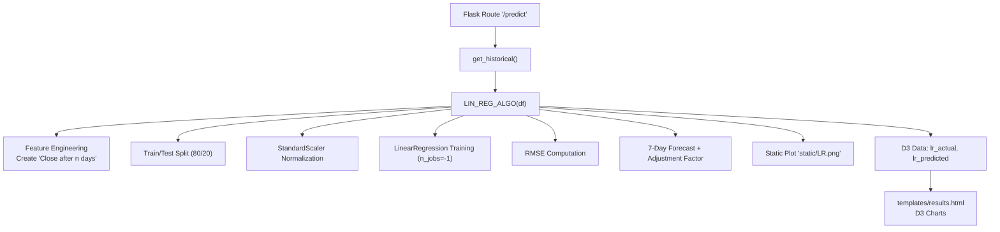
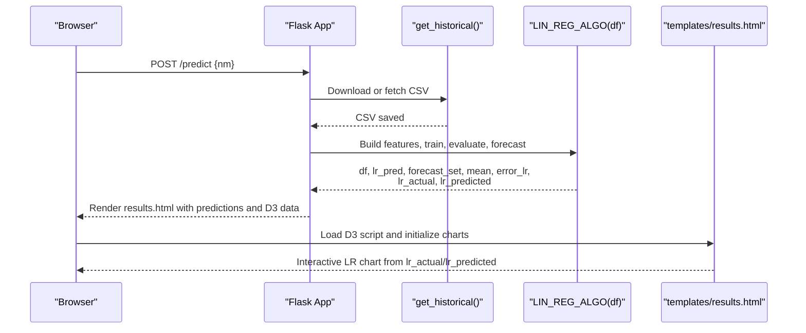
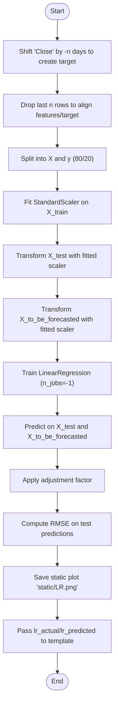
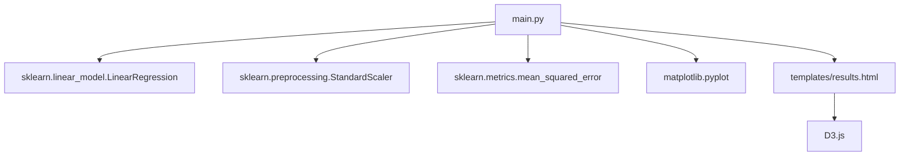

# Linear Regression Model

<cite>
**Referenced Files in This Document**
- [main.py](file://main.py)
- [tests/test_linear_regression_model.py](file://tests/test_linear_regression_model.py)
- [tests/test_helpers.py](file://tests/test_helpers.py)
- [templates/results.html](file://templates/results.html)
</cite>

## Table of Contents
1. [Introduction](#introduction)
2. [Project Structure](#project-structure)
3. [Core Components](#core-components)
4. [Architecture Overview](#architecture-overview)
5. [Detailed Component Analysis](#detailed-component-analysis)
6. [Dependency Analysis](#dependency-analysis)
7. [Performance Considerations](#performance-considerations)
8. [Troubleshooting Guide](#troubleshooting-guide)
9. [Conclusion](#conclusion)
10. [Appendices](#appendices)

## Introduction
This document explains the Linear Regression model implementation used for stock price prediction in the intelligent stock prediction application. It covers the feature engineering process, data preprocessing pipeline, model training, forecasting, RMSE computation, visualization integration with D3.js, and common pitfalls. It also references unit tests that validate data preparation, scaling, and accuracy checks.

## Project Structure
The Linear Regression logic resides in the main application file and is integrated into the Flask prediction route. The rendered results page includes D3-based interactive charts for model comparisons.

**Diagram sources**
- [main.py](file://main.py#L545-L979)
- [templates/results.html](file://templates/results.html#L185-L869)

**Section sources**
- [main.py](file://main.py#L545-L979)
- [templates/results.html](file://templates/results.html#L185-L869)

## Core Components
- Feature engineering: creates a target variable shifted forward by n days and prepares the feature matrix from closing prices.
- Preprocessing: splits data 80/20, normalizes features with StandardScaler, and prepares forecast data from the last n days.
- Model training: scikit-learn LinearRegression with parallel processing enabled.
- Forecasting: generates 7-day forecast, applies an adjustment factor, and computes a mean prediction.
- Evaluation: RMSE computed on test predictions.
- Visualization: saves a static plot and passes data to D3 for interactive charts.

**Section sources**
- [main.py](file://main.py#L780-L845)
- [tests/test_linear_regression_model.py](file://tests/test_linear_regression_model.py#L22-L237)

## Architecture Overview
The Linear Regression pipeline is embedded within the Flask route that orchestrates multiple models. After retrieving historical data, it runs ARIMA, LSTM, and Linear Regression, then renders results with D3 charts.

**Diagram sources**
- [main.py](file://main.py#L545-L979)
- [templates/results.html](file://templates/results.html#L800-L869)

## Detailed Component Analysis

### Feature Engineering: Target Variable and Feature Matrix
- Target creation: A new column named “Close after n days” is created by shifting the Close column backward by n days (n=7). This makes the model predict the Close value n days ahead.
- Feature matrix: The feature matrix X is constructed from the Close column. The last n rows are dropped to align with the shifted target, ensuring no leakage.
- Data alignment: The dataset is trimmed to exclude the last n rows to prevent NaN targets.

Validation in tests confirms:
- The target column is created.
- The last n rows are NaN for the target.
- The train/test split respects the 80/20 ratio.

**Section sources**
- [main.py](file://main.py#L780-L802)
- [tests/test_linear_regression_model.py](file://tests/test_linear_regression_model.py#L22-L53)

### Data Preprocessing Pipeline
- Train/Test split: Uses an 80/20 split based on the length of the dataset.
- StandardScaler normalization: Fit on training features, then transformed for test and forecast sets. This ensures zero mean and unit variance across features.
- Forecast data preparation: Extracts the last n rows of the feature matrix for out-of-sample forecasting.

Unit tests validate:
- Proper scaling behavior on training and test sets.
- Consistent shapes for forecast data after scaling.

**Section sources**
- [main.py](file://main.py#L798-L810)
- [tests/test_linear_regression_model.py](file://tests/test_linear_regression_model.py#L54-L76)
- [tests/test_linear_regression_model.py](file://tests/test_linear_regression_model.py#L200-L238)

### Model Training and Parallel Processing
- Model instantiation: scikit-learn LinearRegression is created with parallel processing enabled (n_jobs=-1).
- Training: Fits on normalized training features and targets.
- Testing: Generates predictions on the test set and applies a multiplicative adjustment factor.

Unit tests confirm:
- Model creation with n_jobs=-1.
- Successful fitting and prediction generation.

**Section sources**
- [main.py](file://main.py#L811-L818)
- [tests/test_linear_regression_model.py](file://tests/test_linear_regression_model.py#L78-L113)

### 7-Day Forecast Generation and Final Prediction
- Forecast generation: Predictions are produced for the last n rows (7 days) of the feature matrix.
- Adjustment factor: Each forecast value is multiplied by a constant factor to adjust predictions.
- Mean calculation: The mean of the forecast set is computed as the final prediction for the next trading day.

Unit tests verify:
- Correct number of forecast values.
- Application of the adjustment factor.
- Mean calculation produces a positive scalar.

**Section sources**
- [main.py](file://main.py#L835-L845)
- [tests/test_linear_regression_model.py](file://tests/test_linear_regression_model.py#L115-L149)

### RMSE Computation and Static Visualization
- RMSE: Computed on the test set predictions versus actual values.
- Static plot: A line plot of actual vs predicted prices is saved to a static image for quick inspection.
- D3 integration: The same data is passed to the template to power interactive D3 charts.

Unit tests validate:
- RMSE calculation correctness.
- Accuracy on perfectly linear data.
- Data structure for plotting.

**Section sources**
- [main.py](file://main.py#L823-L833)
- [tests/test_linear_regression_model.py](file://tests/test_linear_regression_model.py#L152-L183)
- [tests/test_linear_regression_model.py](file://tests/test_linear_regression_model.py#L185-L197)
- [templates/results.html](file://templates/results.html#L800-L869)

### Flask Integration and D3 Visualization
- Route orchestration: The prediction route downloads historical data, runs ARIMA, LSTM, and Linear Regression, and renders results.
- Template rendering: The template receives model outputs and displays:
  - Tomorrow’s predictions per model.
  - RMSE metrics.
  - 7-day forecast table.
  - D3 charts for ARIMA, LSTM, and Linear Regression using lr_actual and lr_predicted.
- D3 initialization: The template initializes multi-line charts and supports toggling Voronoi overlays.

**Section sources**
- [main.py](file://main.py#L910-L979)
- [templates/results.html](file://templates/results.html#L185-L869)

### Data Preparation and Scaling Flow

**Diagram sources**
- [main.py](file://main.py#L780-L845)

## Dependency Analysis
- Internal dependencies:
  - Data ingestion and preprocessing in the prediction route.
  - LinearRegression and StandardScaler from scikit-learn.
  - Matplotlib for saving static plots.
  - D3.js in the template for interactive visualization.
- External data sources:
  - Historical CSV retrieval and fallback to alternative providers.
- Test-time dependencies:
  - Mocked data generation for validation of feature engineering and scaling.

**Diagram sources**
- [main.py](file://main.py#L780-L845)
- [templates/results.html](file://templates/results.html#L800-L869)

**Section sources**
- [main.py](file://main.py#L780-L845)
- [templates/results.html](file://templates/results.html#L800-L869)

## Performance Considerations
- Parallel processing: Using n_jobs=-1 enables multi-core training for speed on larger datasets.
- Scaling benefits: StandardScaler improves convergence and stability for linear models.
- Data size: The 80/20 split balances training capacity with test reliability; ensure sufficient historical samples for stable estimates.
- Outlier sensitivity: Linear models are sensitive to outliers; consider robust preprocessing or winsorizing if data exhibits extreme values.

[No sources needed since this section provides general guidance]

## Troubleshooting Guide
Common issues and mitigations:
- Linear assumption mismatch: If the market exhibits strong non-linear dynamics, linear models may underperform. Consider adding polynomial features or switching to non-linear models.
- Overfitting on small datasets: With limited data, coefficients can be unstable. Increase data length, reduce feature dimensionality, or apply regularization.
- Sensitivity to outliers: Extreme values can skew predictions. Inspect residuals and consider removing or adjusting outliers.
- Data leakage: Ensure the target is created by shifting and that the last n rows are excluded from training features.
- Static plot not updating: Verify the route writes to the expected static path and that the template references the correct image path.

**Section sources**
- [main.py](file://main.py#L780-L845)
- [tests/test_linear_regression_model.py](file://tests/test_linear_regression_model.py#L22-L76)

## Conclusion
The Linear Regression component provides a fast, interpretable baseline for stock price prediction. It implements sound preprocessing, parallel training, and clear evaluation via RMSE. The integration with D3 enables interactive visualization of actual vs predicted prices. While linear models are simple, they require careful feature engineering and data hygiene to remain reliable.

[No sources needed since this section summarizes without analyzing specific files]

## Appendices

### Example References from Unit Tests
- Feature engineering and train/test split validation: [tests/test_linear_regression_model.py](file://tests/test_linear_regression_model.py#L22-L53)
- StandardScaler normalization and forecast scaling: [tests/test_linear_regression_model.py](file://tests/test_linear_regression_model.py#L54-L76), [tests/test_linear_regression_model.py](file://tests/test_linear_regression_model.py#L200-L238)
- Model creation, training, and prediction: [tests/test_linear_regression_model.py](file://tests/test_linear_regression_model.py#L78-L113)
- 7-day forecast, adjustment factor, and mean calculation: [tests/test_linear_regression_model.py](file://tests/test_linear_regression_model.py#L115-L149)
- RMSE computation and accuracy checks: [tests/test_linear_regression_model.py](file://tests/test_linear_regression_model.py#L152-L183)
- D3 data structure for LR plot: [tests/test_linear_regression_model.py](file://tests/test_linear_regression_model.py#L185-L197)
- Mock stock data generator for testing: [tests/test_helpers.py](file://tests/test_helpers.py#L36-L68)