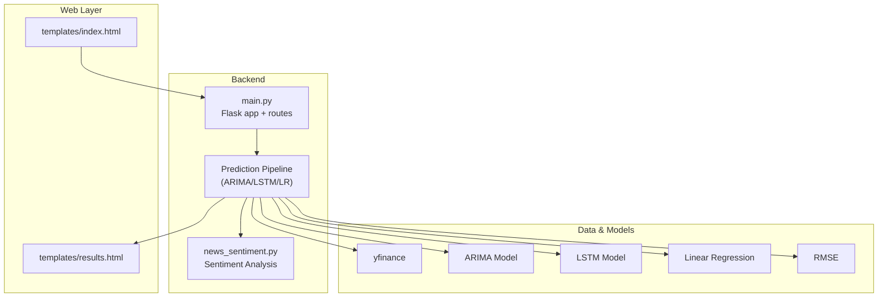
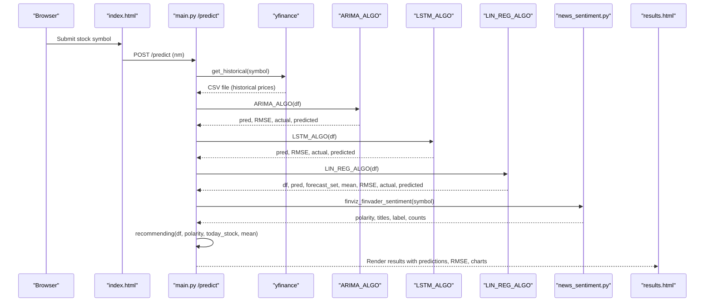
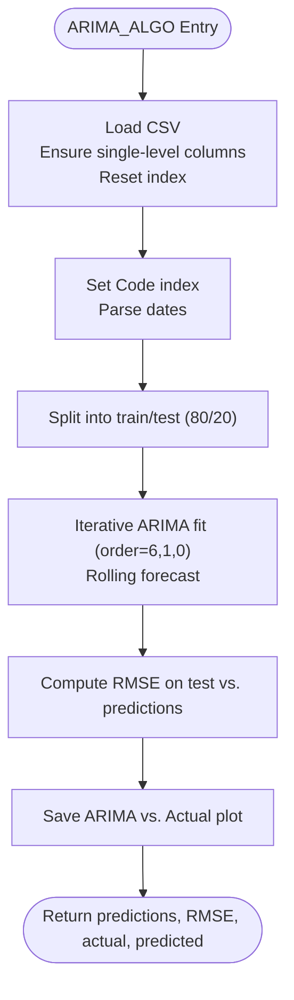
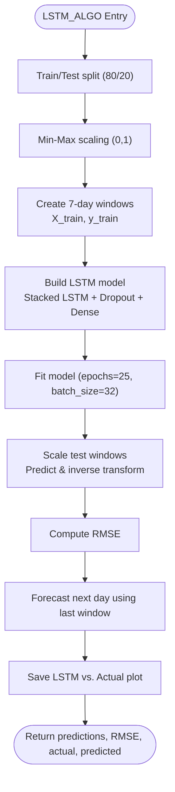
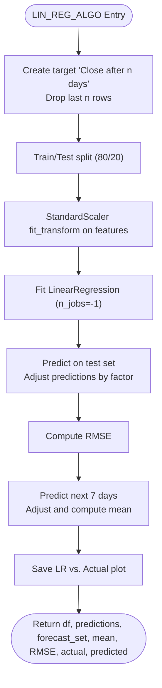
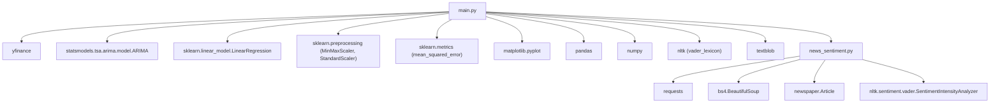

# Prediction Engine

<cite>
**Referenced Files in This Document**
- [main.py](file://main.py)
- [news_sentiment.py](file://news_sentiment.py)
- [templates/index.html](file://templates/index.html)
- [templates/results.html](file://templates/results.html)
- [tests/test_lstm_model.py](file://tests/test_lstm_model.py)
- [tests/test_arima_model.py](file://tests/test_arima_model.py)
- [tests/test_linear_regression_model.py](file://tests/test_linear_regression_model.py)
- [tests/test_prediction_pipeline.py](file://tests/test_prediction_pipeline.py)
</cite>

## Table of Contents
1. [Introduction](#introduction)
2. [Project Structure](#project-structure)
3. [Core Components](#core-components)
4. [Architecture Overview](#architecture-overview)
5. [Detailed Component Analysis](#detailed-component-analysis)
6. [Dependency Analysis](#dependency-analysis)
7. [Performance Considerations](#performance-considerations)
8. [Troubleshooting Guide](#troubleshooting-guide)
9. [Conclusion](#conclusion)
10. [Appendices](#appendices)

## Introduction
This document explains the Prediction Engine sub-feature that powers stock price forecasting in the Flask application. It covers the implementation of three machine learning models—ARIMA, LSTM, and Linear Regression—along with data preprocessing, model training pipelines, hyperparameter configurations, prediction execution workflows, and integration with sentiment analysis. It also documents how predictions are rendered for the frontend, common issues (overfitting, convergence, performance), and optimization strategies for faster inference and memory efficiency. Finally, it describes usage patterns for triggering predictions via the web interface and API.

## Project Structure
The Prediction Engine is implemented primarily in the Flask application entry point and integrates with a dedicated sentiment module. Templates render the results and charts.

**Diagram sources**
- [main.py](file://main.py#L545-L979)
- [news_sentiment.py](file://news_sentiment.py#L1164-L1334)
- [templates/index.html](file://templates/index.html#L468-L486)
- [templates/results.html](file://templates/results.html#L143-L422)

**Section sources**
- [main.py](file://main.py#L545-L979)
- [templates/index.html](file://templates/index.html#L468-L486)
- [templates/results.html](file://templates/results.html#L143-L422)

## Core Components
- ARIMA model: Statistical time-series forecasting with fixed order parameters and rolling-window evaluation.
- LSTM model: Deep learning recurrent network with stacked LSTM layers, dropout regularization, and Min-Max scaling.
- Linear Regression model: Classical supervised learning baseline with feature engineering and StandardScaler normalization.
- Data preprocessing: Historical data acquisition via yfinance, CSV persistence, train/test splits, and feature engineering.
- Sentiment integration: News-based sentiment aggregation and recommendation logic.
- Frontend rendering: Results page displays predictions, RMSE metrics, and D3 visualizations.

**Section sources**
- [main.py](file://main.py#L583-L979)
- [news_sentiment.py](file://news_sentiment.py#L1164-L1334)
- [templates/results.html](file://templates/results.html#L143-L422)

## Architecture Overview
The prediction workflow begins at the Flask route that accepts a stock symbol, fetches historical data, runs the three models, computes RMSE metrics, aggregates sentiment, and renders the results page with interactive charts.

**Diagram sources**
- [main.py](file://main.py#L545-L979)
- [news_sentiment.py](file://news_sentiment.py#L1164-L1334)
- [templates/index.html](file://templates/index.html#L468-L486)
- [templates/results.html](file://templates/results.html#L143-L422)

## Detailed Component Analysis

### ARIMA Model
- Data preparation: Converts CSV to DataFrame, ensures single-level columns, resets index, and writes CSV for persistence.
- Time series formatting: Sets Code index and parses dates for time-series indexing.
- Train/test split: Uses 80/20 split on the Close series.
- Model specification: ARIMA with fixed order (6,1,0).
- Rolling forecast: Iteratively fits ARIMA on expanding history and forecasts one step ahead.
- Metrics: Computes RMSE between actual and predicted test values.
- Visualization: Saves ARIMA vs. Actual plots for frontend display.

Key implementation references:
- Historical data fetch and preprocessing: [main.py](file://main.py#L545-L582)
- ARIMA algorithm and evaluation: [main.py](file://main.py#L583-L642)
- Tests for ARIMA data prep, model creation, rolling forecast, and RMSE: [tests/test_arima_model.py](file://tests/test_arima_model.py#L1-L244)

**Diagram sources**
- [main.py](file://main.py#L583-L642)

**Section sources**
- [main.py](file://main.py#L583-L642)
- [tests/test_arima_model.py](file://tests/test_arima_model.py#L1-L244)

### LSTM Model
- Data preparation: Splits data 80/20, selects Close column, and applies Min-Max scaling to [0,1].
- Windowing: Creates sequences with 7-day lookback (timesteps) and single-step targets.
- Model architecture: Stacked LSTM layers with dropout (0.1) and dense output.
- Training: Adam optimizer, MSE loss, 25 epochs, batch size 32.
- Testing and forecasting: Scales test sequences, predicts, inverse transforms to original scale, computes RMSE, and forecasts next day using the last known window.

Key implementation references:
- LSTM algorithm and evaluation: [main.py](file://main.py#L646-L779)
- Tests for scaling, timesteps, model architecture, training, inverse scaling, and RMSE: [tests/test_lstm_model.py](file://tests/test_lstm_model.py#L1-L303)

**Diagram sources**
- [main.py](file://main.py#L646-L779)

**Section sources**
- [main.py](file://main.py#L646-L779)
- [tests/test_lstm_model.py](file://tests/test_lstm_model.py#L1-L303)

### Linear Regression Model
- Feature engineering: Creates a target variable “Close after n days” shifted by n days (n=7).
- Train/test split: Uses 80/20 split on engineered features.
- Scaling: Applies StandardScaler to normalize features.
- Model: LinearRegression with n_jobs=-1.
- Evaluation: Predicts on test set, computes RMSE.
- Forecasting: Scales unknown features and predicts next 7 days; applies a multiplicative adjustment factor and calculates mean.

Key implementation references:
- Linear Regression algorithm and evaluation: [main.py](file://main.py#L779-L846)
- Tests for feature engineering, scaling, model training, forecast, and RMSE: [tests/test_linear_regression_model.py](file://tests/test_linear_regression_model.py#L1-L251)

**Diagram sources**
- [main.py](file://main.py#L779-L846)

**Section sources**
- [main.py](file://main.py#L779-L846)
- [tests/test_linear_regression_model.py](file://tests/test_linear_regression_model.py#L1-L251)

### Data Preprocessing Pipeline
- Historical data acquisition: Uses yfinance to download two years of daily OHLCV data; flattens multi-index columns and resets index.
- CSV persistence: Writes CSV for downstream processing.
- Data validation: Drops NA rows and constructs a DataFrame with a Code column for compatibility with ARIMA preprocessing.
- Train/test splits: Implemented inside each model’s preprocessing logic.

Key implementation references:
- Historical data fetch and preprocessing: [main.py](file://main.py#L545-L582)
- Data validation and DataFrame construction: [main.py](file://main.py#L910-L933)

**Section sources**
- [main.py](file://main.py#L545-L582)
- [main.py](file://main.py#L910-L933)

### Prediction Execution Workflow
- Route entry: The /predict route reads the symbol from the form, attempts to fetch historical data, and proceeds to model execution.
- Model orchestration: Executes ARIMA, LSTM, and Linear Regression in sequence, capturing predictions, RMSE, and visualization-ready arrays.
- Sentiment integration: Calls news_sentiment to compute global polarity and sentiment distribution, then generates a recommendation (BUY/SELL) based on model predictions and sentiment.
- Rendering: Passes predictions, RMSE, and visualization arrays to results.html for display.

Key implementation references:
- Route and orchestration: [main.py](file://main.py#L545-L979)
- Sentiment integration and recommendation: [main.py](file://main.py#L910-L979), [news_sentiment.py](file://news_sentiment.py#L1164-L1334)
- Frontend rendering: [templates/results.html](file://templates/results.html#L143-L422)

**Section sources**
- [main.py](file://main.py#L545-L979)
- [news_sentiment.py](file://news_sentiment.py#L1164-L1334)
- [templates/results.html](file://templates/results.html#L143-L422)

### Ensemble Methods and Recommendation Logic
- Ensemble: The system does not implement explicit model averaging or stacking. Instead, it aggregates model predictions and RMSE metrics and uses sentiment to derive a recommendation.
- Recommendation: Compares today’s close with the mean of the 7-day forecast; if today’s close is below the mean and sentiment is positive, recommends a rise and a BUY; otherwise, recommends a fall and a SELL. This logic is encapsulated in the recommending function.

Key implementation references:
- Recommendation logic: [main.py](file://main.py#L847-L905)
- Sentiment computation: [news_sentiment.py](file://news_sentiment.py#L1164-L1334)

**Section sources**
- [main.py](file://main.py#L847-L905)
- [news_sentiment.py](file://news_sentiment.py#L1164-L1334)

### Frontend Integration and Visualization
- Results page: Displays today’s OHLCV snapshot, model predictions, RMSE metrics, and D3 visualizations for ARIMA, LSTM, and Linear Regression.
- Interactive charts: The results template initializes D3 charts for each model, enabling hover tooltips and optional Voronoi overlays.
- Static assets: ARIMA, LSTM, LR, and sentiment pie charts are saved as static images for quick rendering.

Key implementation references:
- Results rendering and D3 initialization: [templates/results.html](file://templates/results.html#L143-L422)

**Section sources**
- [templates/results.html](file://templates/results.html#L143-L422)

## Dependency Analysis
The Prediction Engine depends on external libraries and modules:

**Diagram sources**
- [main.py](file://main.py#L1-L40)
- [news_sentiment.py](file://news_sentiment.py#L1-L120)

**Section sources**
- [main.py](file://main.py#L1-L40)
- [news_sentiment.py](file://news_sentiment.py#L1-L120)

## Performance Considerations
- Model training overhead:
  - LSTM trains for 25 epochs with batch size 32; reduce epochs or increase batch size cautiously to speed up training.
  - Linear Regression uses n_jobs=-1 for multi-core training; ensure sufficient CPU cores for parallelism.
- Data preprocessing:
  - Min-Max scaling for LSTM and StandardScaler for Linear Regression are efficient; avoid repeated scaling by reusing fitted scalers.
  - Windowing creates sequences; ensure memory usage remains bounded by limiting sequence length or reducing dataset size.
- Inference optimization:
  - Persist trained models to disk and reload for inference to avoid retraining on each request.
  - Cache predictions and visualization artifacts (static images) to reduce repeated computations.
  - Use asynchronous tasks for long-running sentiment analysis and model execution to keep the web server responsive.
- Memory efficiency:
  - Avoid loading entire datasets into memory; stream or chunk data where possible.
  - Dispose of temporary arrays and close figures promptly to free memory.
- Frontend performance:
  - D3 visualizations are client-side; keep data arrays compact and avoid unnecessary DOM updates.
  - Lazy-load charts and images to improve initial page load.

[No sources needed since this section provides general guidance]

## Troubleshooting Guide
Common issues and resolutions:

- Overfitting:
  - ARIMA: Fixed order (6,1,0) may overfit on short series; validate with out-of-sample rolling forecast and monitor RMSE.
  - LSTM: Excessive layers or epochs can cause overfitting; reduce layers, add more dropout, or apply early stopping.
  - Linear Regression: High variance indicates overfitting; consider regularization or feature selection.
- Model convergence:
  - LSTM: Ensure adequate data length for 7-day windows; initialize with proper scaling and optimizer settings.
  - ARIMA: Insufficient data points for order (6,1,0) can cause convergence warnings; adjust order or increase data length.
- Performance bottlenecks:
  - Large datasets or frequent retraining slow down requests; cache models and precompute static visualizations.
  - Sentiment analysis can be slow; use lightweight sources or asynchronous processing.
- Data quality:
  - yfinance may return empty or malformed data; implement robust error handling and fallbacks (e.g., Alpha Vantage).
- Frontend rendering:
  - Missing static images (ARIMA/LSTM/LR/SA) can occur if model execution fails; ensure file paths exist and permissions are correct.

**Section sources**
- [main.py](file://main.py#L545-L979)
- [news_sentiment.py](file://news_sentiment.py#L1164-L1334)

## Conclusion
The Prediction Engine integrates ARIMA, LSTM, and Linear Regression with robust preprocessing and sentiment analysis to deliver stock price forecasts and recommendations. While no explicit ensemble averaging is implemented, the system aggregates model outputs and sentiment to inform trading decisions. The Flask application orchestrates the pipeline, persists visualizations, and renders results via templates. With careful tuning of hyperparameters, caching, and asynchronous processing, the system can achieve faster inference and improved reliability.

[No sources needed since this section summarizes without analyzing specific files]

## Appendices

### Usage Patterns
- Web interface:
  - Navigate to the home page, enter a stock symbol, and click “View Forecast.” The results page displays predictions, RMSE metrics, and interactive charts.
- API:
  - The /predict route can be invoked programmatically by posting a form payload with the symbol field. Integration tests demonstrate end-to-end execution.

**Section sources**
- [templates/index.html](file://templates/index.html#L468-L486)
- [tests/test_prediction_pipeline.py](file://tests/test_prediction_pipeline.py#L1-L75)

### Hyperparameters and Configurations
- ARIMA:
  - Order: (6,1,0)
  - Rolling forecast on expanding history
- LSTM:
  - Layers: 4 stacked LSTM with 50 units each and dropout 0.1
  - Input shape: (timesteps=7, features=1)
  - Optimizer: Adam
  - Loss: mean_squared_error
  - Training: epochs=25, batch_size=32
  - Scaling: Min-Max (0,1)
- Linear Regression:
  - Target: “Close after n days” with n=7
  - Scaling: StandardScaler
  - Model: LinearRegression with n_jobs=-1
  - Adjustment factor: 1.04 applied to forecast set

**Section sources**
- [main.py](file://main.py#L583-L979)
- [tests/test_lstm_model.py](file://tests/test_lstm_model.py#L1-L303)
- [tests/test_arima_model.py](file://tests/test_arima_model.py#L1-L244)
- [tests/test_linear_regression_model.py](file://tests/test_linear_regression_model.py#L1-L251)