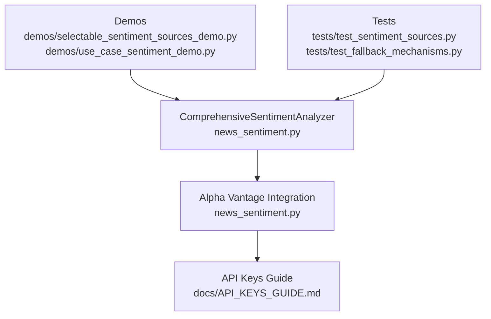
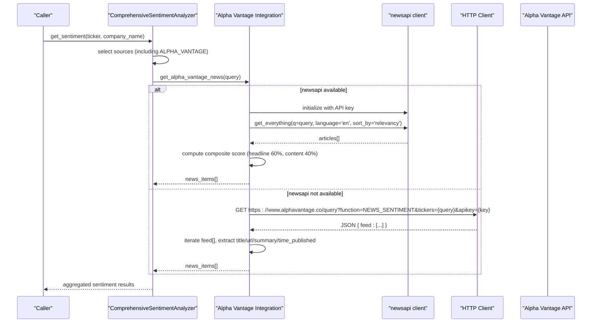
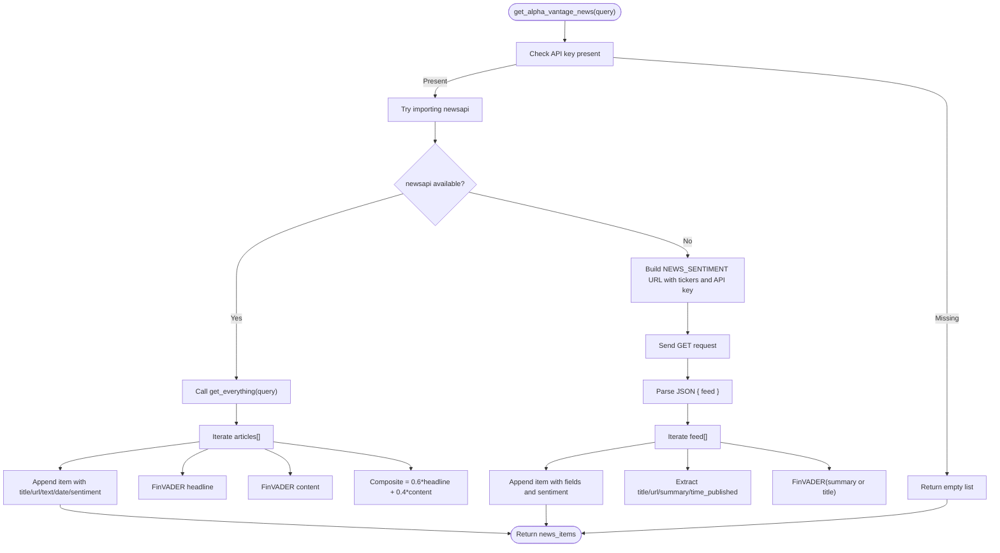
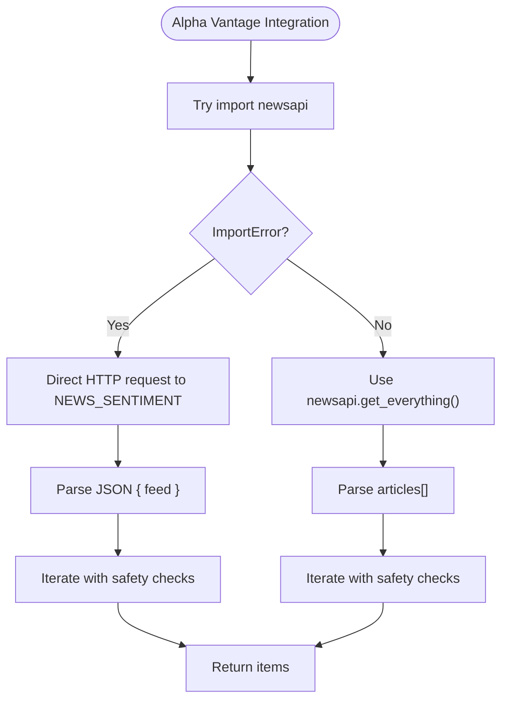
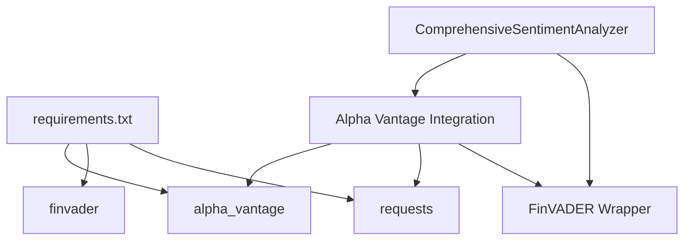

# Alpha Vantage News & Sentiments API

<cite>
**Referenced Files in This Document**
- [news_sentiment.py](file://news_sentiment.py)
- [API_KEYS_GUIDE.md](file://docs/API_KEYS_GUIDE.md)
- [requirements.txt](file://requirements.txt)
- [demos/selectable_sentiment_sources_demo.py](file://demos/selectable_sentiment_sources_demo.py)
- [demos/use_case_sentiment_demo.py](file://demos/use_case_sentiment_demo.py)
- [tests/test_sentiment_sources.py](file://tests/test_sentiment_sources.py)
- [tests/test_fallback_mechanisms.py](file://tests/test_fallback_mechanisms.py)
</cite>

## Table of Contents
1. [Introduction](#introduction)
2. [Project Structure](#project-structure)
3. [Core Components](#core-components)
4. [Architecture Overview](#architecture-overview)
5. [Detailed Component Analysis](#detailed-component-analysis)
6. [Dependency Analysis](#dependency-analysis)
7. [Performance Considerations](#performance-considerations)
8. [Troubleshooting Guide](#troubleshooting-guide)
9. [Conclusion](#conclusion)
10. [Appendices](#appendices)

## Introduction
This document explains the Alpha Vantage News & Sentiments API integration in the sentiment analysis module. It covers both implementation paths:
- Using the newsapi client library when available
- Falling back to direct HTTP requests to the Alpha Vantage endpoint

It documents request construction for the NEWS_SENTIMENT function, including ticker parameters and API key authentication. It explains how the response is parsed from the feed array and how publication timestamps are extracted. It details the hybrid sentiment scoring approach that combines headline and content analysis using FinVADER with weighted averaging (60% headline, 40% content). It includes code example references demonstrating both the library-based and direct request approaches. It addresses error handling for import failures, network issues, and malformed responses. Finally, it discusses configuration requirements and optimal use cases such as quantitative hedge funds that benefit from premium sentiment data with high accuracy.

## Project Structure
The Alpha Vantage integration lives within the sentiment analysis module and participates in a broader multi-source sentiment pipeline. The relevant files are:
- news_sentiment.py: Core sentiment analyzer, including Alpha Vantage integration and hybrid scoring
- docs/API_KEYS_GUIDE.md: API key acquisition and usage guidance
- requirements.txt: Dependencies including alpha_vantage and finvader
- demos/*: Example scripts demonstrating selectable sources and use-case configurations
- tests/*: Unit and integration tests for sentiment sources and fallbacks

**Diagram sources**
- [news_sentiment.py](file://news_sentiment.py#L518-L581)
- [API_KEYS_GUIDE.md](file://docs/API_KEYS_GUIDE.md#L31-L53)
- [demos/selectable_sentiment_sources_demo.py](file://demos/selectable_sentiment_sources_demo.py#L86-L101)
- [demos/use_case_sentiment_demo.py](file://demos/use_case_sentiment_demo.py#L55-L73)
- [tests/test_sentiment_sources.py](file://tests/test_sentiment_sources.py#L12-L24)
- [tests/test_fallback_mechanisms.py](file://tests/test_fallback_mechanisms.py#L17-L43)

**Section sources**
- [news_sentiment.py](file://news_sentiment.py#L518-L581)
- [API_KEYS_GUIDE.md](file://docs/API_KEYS_GUIDE.md#L31-L53)

## Core Components
- Alpha Vantage integration method: Implements both library-based and direct request fallbacks
- Request construction: Builds the NEWS_SENTIMENT endpoint URL with tickers and API key
- Response parsing: Iterates over the feed array and extracts title, URL, summary, and published timestamp
- Timestamp extraction: Uses the published timestamp field from the feed item
- Hybrid scoring: Computes a composite score combining headline and content FinVADER scores (60%/40%)
- Error handling: Catches import failures, network exceptions, and malformed responses

Key implementation references:
- Alpha Vantage integration method: [news_sentiment.py](file://news_sentiment.py#L518-L581)
- Hybrid scoring method: [news_sentiment.py](file://news_sentiment.py#L1003-L1028)

**Section sources**
- [news_sentiment.py](file://news_sentiment.py#L518-L581)
- [news_sentiment.py](file://news_sentiment.py#L1003-L1028)

## Architecture Overview
The Alpha Vantage integration is part of a layered sentiment pipeline. The analyzer selects sources based on configuration and use case, then aggregates sentiment scores. When Alpha Vantage is chosen, the integration method attempts to use the newsapi client library; if unavailable, it falls back to direct HTTP requests to the NEWS_SENTIMENT endpoint.

**Diagram sources**
- [news_sentiment.py](file://news_sentiment.py#L518-L581)

## Detailed Component Analysis

### Alpha Vantage Integration Method
The integration method performs the following steps:
- Validates presence of an API key
- Attempts to use the newsapi client library:
  - Initializes the client with the API key
  - Calls get_everything with query, language, and sorting parameters
  - For each article, runs FinVADER on both headline and content
  - Computes a composite score as 60% headline + 40% content
  - Stores title, URL, text, source, publishedAt, and sentiment_score
- If the newsapi import fails, falls back to direct HTTP requests:
  - Constructs the NEWS_SENTIMENT endpoint URL with tickers and API key
  - Sends an HTTP GET request with a user agent header
  - Parses the JSON response and iterates over the feed array
  - Extracts title, URL, summary, and time_published
  - Applies FinVADER to the summary or title to produce a sentiment score
  - Stores the resulting items

**Diagram sources**
- [news_sentiment.py](file://news_sentiment.py#L518-L581)

**Section sources**
- [news_sentiment.py](file://news_sentiment.py#L518-L581)

### Response Parsing and Timestamp Extraction
- Library-based path: The response contains an articles array. The integration reads publishedAt for timestamp and uses content or description for text.
- Direct request path: The response contains a feed array. The integration reads title, url, summary, and time_published for each item.

Timestamp extraction:
- Published timestamp is extracted from publishedAt in the library path
- Published timestamp is extracted from time_published in the direct request path

**Section sources**
- [news_sentiment.py](file://news_sentiment.py#L533-L554)
- [news_sentiment.py](file://news_sentiment.py#L558-L578)

### Hybrid Sentiment Scoring (60% Headline, 40% Content)
The integration computes a composite score by applying FinVADER to both headline and content, then weighting them:
- Headline score: FinVADER on article title
- Content score: FinVADER on article content or description
- Composite: 0.6 * headline_score + 0.4 * content_score

This approach improves accuracy by leveraging both headline impact and content depth.

**Section sources**
- [news_sentiment.py](file://news_sentiment.py#L536-L545)

### Error Handling
- Import failure: If newsapi is not installed, the integration catches ImportError and falls back to direct HTTP requests.
- Network issues: The integration wraps HTTP requests in try/except blocks and prints error messages.
- Malformed responses: The integration checks for expected keys (articles/feed) before iterating and provides safe defaults.

**Diagram sources**
- [news_sentiment.py](file://news_sentiment.py#L555-L581)

**Section sources**
- [news_sentiment.py](file://news_sentiment.py#L555-L581)

### Configuration Requirements and Optimal Use Cases
- API key requirement: Alpha Vantage requires an API key. The integration gracefully skips when the key is not provided.
- Free tier limits: According to the API keys guide, Alpha Vantage offers a free tier with rate limits.
- Optimal use cases:
  - Quantitative hedge funds: The use-case configuration enables Alpha Vantage plus FinVADER with hybrid scoring, aligning with premium quality sentiment data needs.

References:
- API key acquisition and usage: [API_KEYS_GUIDE.md](file://docs/API_KEYS_GUIDE.md#L31-L53)
- Use-case configuration enabling Alpha Vantage: [news_sentiment.py](file://news_sentiment.py#L362-L367)
- Demo showcasing quant use case: [demos/use_case_sentiment_demo.py](file://demos/use_case_sentiment_demo.py#L55-L73)

**Section sources**
- [API_KEYS_GUIDE.md](file://docs/API_KEYS_GUIDE.md#L31-L53)
- [news_sentiment.py](file://news_sentiment.py#L362-L367)
- [demos/use_case_sentiment_demo.py](file://demos/use_case_sentiment_demo.py#L55-L73)

### Code Example References
- Using Alpha Vantage with an API key:
  - Convenience function reference: [news_sentiment.py](file://news_sentiment.py#L1209-L1216)
  - Demo reference: [demos/selectable_sentiment_sources_demo.py](file://demos/selectable_sentiment_sources_demo.py#L86-L101)
- Demonstrating use-case configuration (quant hedge funds):
  - Function reference: [news_sentiment.py](file://news_sentiment.py#L1260-L1267)
  - Demo reference: [demos/use_case_sentiment_demo.py](file://demos/use_case_sentiment_demo.py#L55-L73)

**Section sources**
- [news_sentiment.py](file://news_sentiment.py#L1209-L1216)
- [demos/selectable_sentiment_sources_demo.py](file://demos/selectable_sentiment_sources_demo.py#L86-L101)
- [news_sentiment.py](file://news_sentiment.py#L1260-L1267)
- [demos/use_case_sentiment_demo.py](file://demos/use_case_sentiment_demo.py#L55-L73)

## Dependency Analysis
- External libraries:
  - alpha_vantage: Provides the Alpha Vantage client library
  - finvader: Provides FinVADER sentiment analysis
  - requests: Used for direct HTTP requests
  - htmldate: Used for extracting publication dates in other sources
- Internal dependencies:
  - The Alpha Vantage integration depends on the analyzer’s FinVADER wrapper and the shared headers
  - The integration is invoked from the main get_sentiment pipeline

**Diagram sources**
- [requirements.txt](file://requirements.txt#L1-L19)
- [news_sentiment.py](file://news_sentiment.py#L518-L581)

**Section sources**
- [requirements.txt](file://requirements.txt#L1-L19)
- [news_sentiment.py](file://news_sentiment.py#L518-L581)

## Performance Considerations
- The Alpha Vantage integration is invoked conditionally based on selected sources and use-case configuration.
- Hybrid scoring adds minimal overhead by running FinVADER twice per article (headline and content).
- Direct HTTP requests bypass the newsapi client but still incur network latency and JSON parsing costs.
- The analyzer aggregates sentiment scores and applies thresholds for classification, which is O(n) in the number of articles.

[No sources needed since this section provides general guidance]

## Troubleshooting Guide
Common issues and resolutions:
- Import failure for newsapi:
  - Symptom: ImportError when importing the newsapi client
  - Resolution: Install the newsapi package; the integration automatically falls back to direct HTTP requests
  - Reference: [news_sentiment.py](file://news_sentiment.py#L555-L556)
- Missing API key:
  - Symptom: Integration prints a message indicating the key is not provided and skips Alpha Vantage
  - Resolution: Provide a valid API key or rely on other sources
  - Reference: [news_sentiment.py](file://news_sentiment.py#L523-L525)
- Network errors:
  - Symptom: Exceptions during HTTP requests
  - Resolution: Wrap calls with retry logic if needed; the integration prints error messages and continues
  - Reference: [news_sentiment.py](file://news_sentiment.py#L558-L560)
- Malformed responses:
  - Symptom: Missing expected keys in JSON
  - Resolution: The integration checks for keys before iteration and provides safe defaults
  - Reference: [news_sentiment.py](file://news_sentiment.py#L562-L563)
- Rate limiting:
  - Symptom: API responses indicate rate limit exceeded
  - Resolution: Observe free-tier rate limits and consider upgrading or caching
  - Reference: [API_KEYS_GUIDE.md](file://docs/API_KEYS_GUIDE.md#L224-L246)

**Section sources**
- [news_sentiment.py](file://news_sentiment.py#L523-L525)
- [news_sentiment.py](file://news_sentiment.py#L555-L560)
- [news_sentiment.py](file://news_sentiment.py#L562-L563)
- [API_KEYS_GUIDE.md](file://docs/API_KEYS_GUIDE.md#L224-L246)

## Conclusion
The Alpha Vantage News & Sentiments API integration provides a robust, dual-path implementation that leverages the newsapi client when available and falls back to direct HTTP requests when not. It constructs the NEWS_SENTIMENT endpoint with appropriate parameters, parses the feed array, and extracts publication timestamps. The hybrid scoring approach enhances accuracy by combining headline and content sentiment with weighted averaging. The integration gracefully handles import failures, network issues, and malformed responses, and it fits seamlessly into the broader sentiment analysis pipeline with configurable use cases.

[No sources needed since this section summarizes without analyzing specific files]

## Appendices

### API Endpoint Reference
- Endpoint: NEWS_SENTIMENT
- Parameters:
  - function: NEWS_SENTIMENT
  - tickers: Ticker symbol(s) to query
  - apikey: Your Alpha Vantage API key
- Response:
  - feed: Array of news items containing title, url, summary, and time_published

**Section sources**
- [news_sentiment.py](file://news_sentiment.py#L558-L578)

### Related Tests and Demos
- Tests verifying Alpha Vantage integration and fallback behavior:
  - [tests/test_sentiment_sources.py](file://tests/test_sentiment_sources.py#L12-L24)
  - [tests/test_fallback_mechanisms.py](file://tests/test_fallback_mechanisms.py#L17-L43)
- Demos showcasing selectable sources and use cases:
  - [demos/selectable_sentiment_sources_demo.py](file://demos/selectable_sentiment_sources_demo.py#L86-L101)
  - [demos/use_case_sentiment_demo.py](file://demos/use_case_sentiment_demo.py#L55-L73)

**Section sources**
- [tests/test_sentiment_sources.py](file://tests/test_sentiment_sources.py#L12-L24)
- [tests/test_fallback_mechanisms.py](file://tests/test_fallback_mechanisms.py#L17-L43)
- [demos/selectable_sentiment_sources_demo.py](file://demos/selectable_sentiment_sources_demo.py#L86-L101)
- [demos/use_case_sentiment_demo.py](file://demos/use_case_sentiment_demo.py#L55-L73)