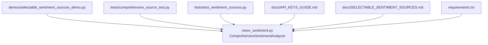
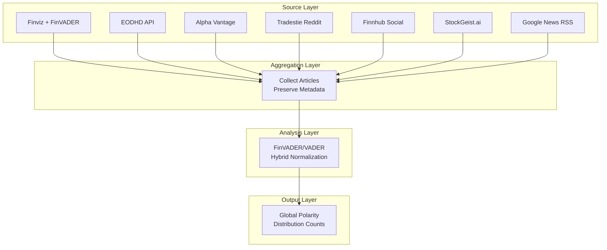
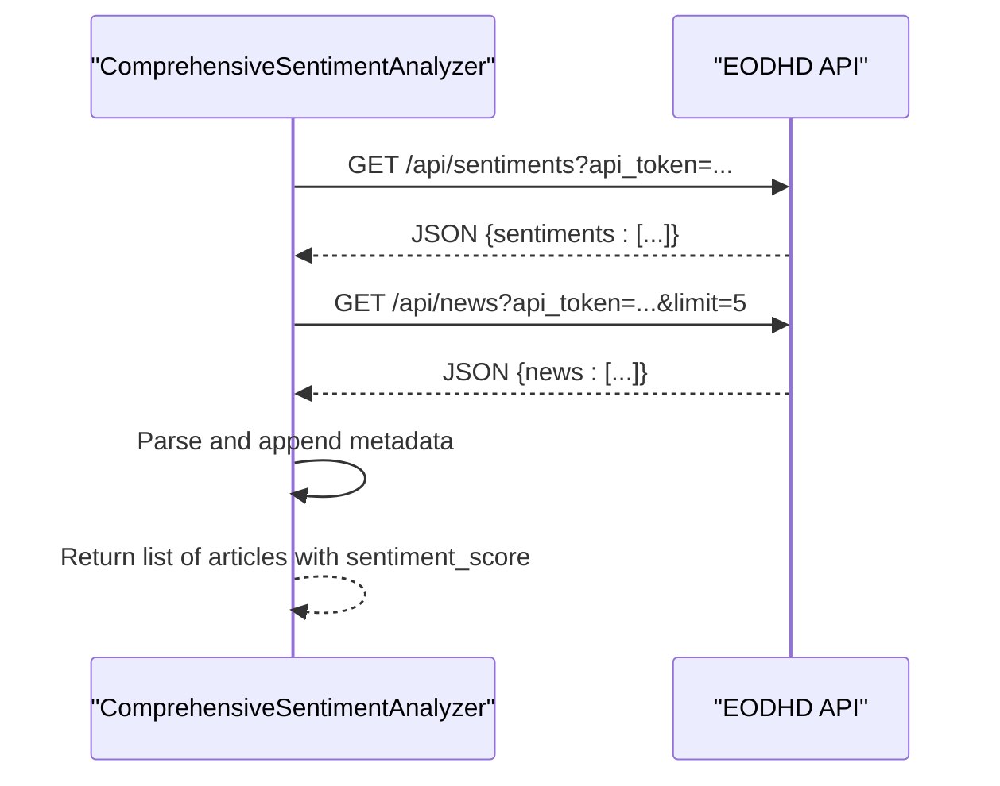
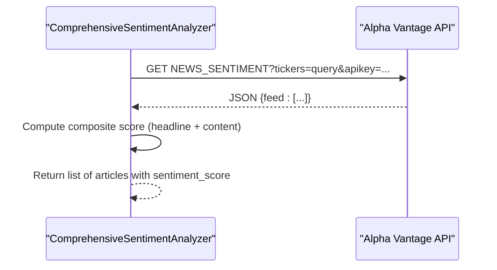
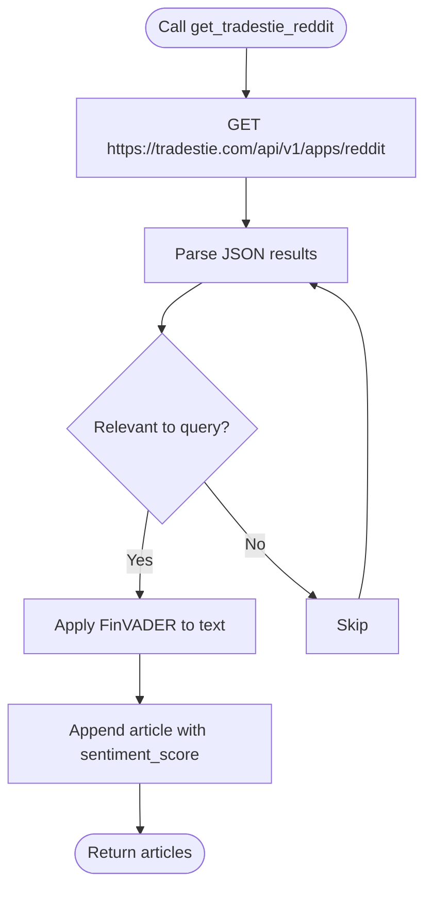
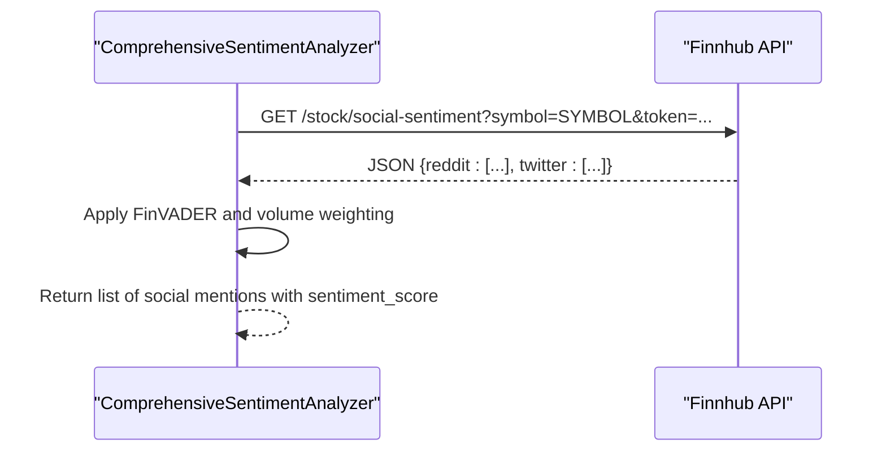
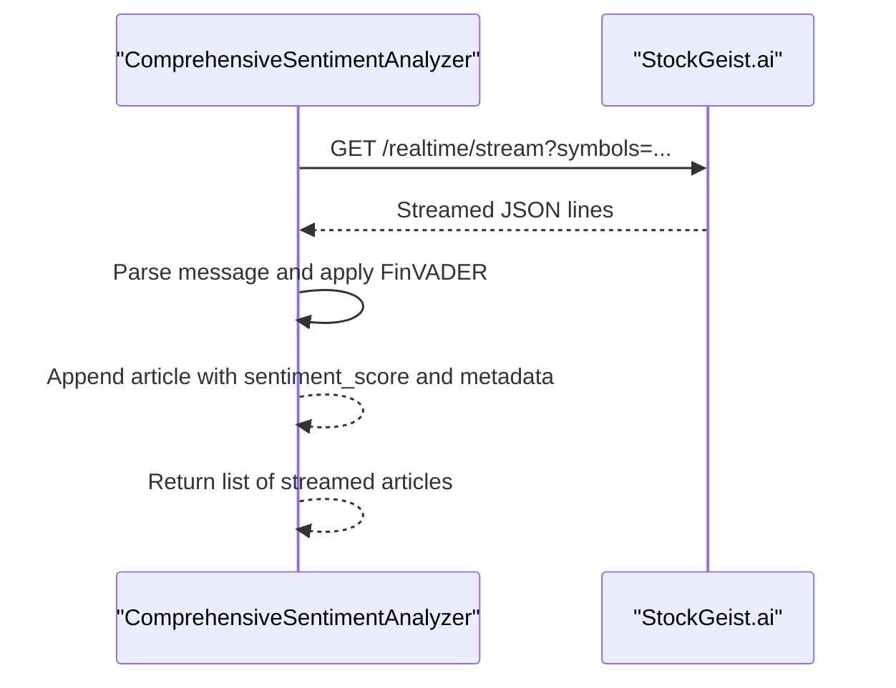
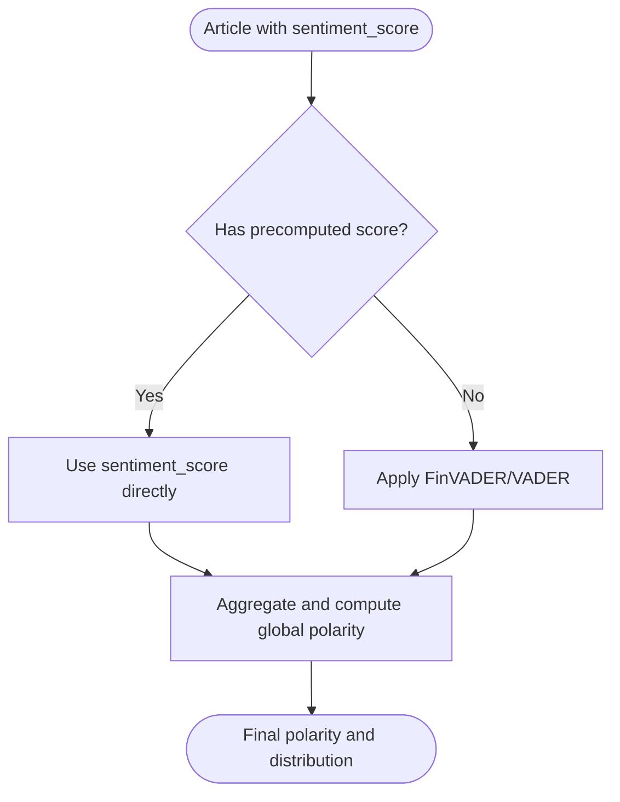
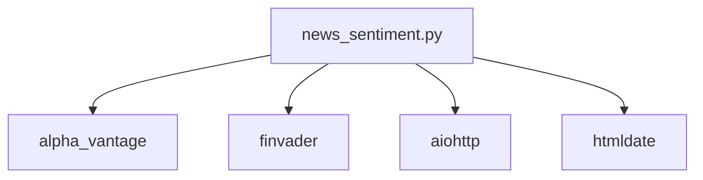

# Alternative News Sources

<cite>
**Referenced Files in This Document**
- [news_sentiment.py](file://news_sentiment.py)
- [API_KEYS_GUIDE.md](file://docs/API_KEYS_GUIDE.md)
- [SELECTABLE_SENTIMENT_SOURCES.md](file://docs/SELECTABLE_SENTIMENT_SOURCES.md)
- [requirements.txt](file://requirements.txt)
- [comprehensive_source_test.py](file://tests/comprehensive_source_test.py)
- [test_sentiment_sources.py](file://tests/test_sentiment_sources.py)
- [selectable_sentiment_sources_demo.py](file://demos/selectable_sentiment_sources_demo.py)
</cite>

## Table of Contents
1. [Introduction](#introduction)
2. [Project Structure](#project-structure)
3. [Core Components](#core-components)
4. [Architecture Overview](#architecture-overview)
5. [Detailed Component Analysis](#detailed-component-analysis)
6. [Dependency Analysis](#dependency-analysis)
7. [Performance Considerations](#performance-considerations)
8. [Troubleshooting Guide](#troubleshooting-guide)
9. [Conclusion](#conclusion)
10. [Appendices](#appendices)

## Introduction
This document focuses on the alternative news sources sub-feature that integrates multiple API-based sentiment sources alongside web scraping and RSS feeds. It covers the implementation of dedicated methods for EODHD API, Alpha Vantage News & Sentiments API, Tradestie WallStreetBets API, Finnhub Social Sentiment API, and StockGeist.ai. It explains API endpoint URLs, authentication mechanisms, response parsing, error handling, normalization of sentiment scores across sources, preservation of metadata such as publication dates, and asynchronous streaming for StockGeist. It also addresses rate limits, authentication key management, and handling inconsistent response formats, along with guidance on configuring API keys and selecting sources by use case.

## Project Structure
The alternative news sources are implemented in a single module that orchestrates multiple data sources and sentiment analysis. Supporting documentation and tests demonstrate usage, configuration, and verification.

**Diagram sources**
- [news_sentiment.py](file://news_sentiment.py#L1-L120)
- [selectable_sentiment_sources_demo.py](file://demos/selectable_sentiment_sources_demo.py#L1-L136)
- [comprehensive_source_test.py](file://tests/comprehensive_source_test.py#L1-L251)
- [test_sentiment_sources.py](file://tests/test_sentiment_sources.py#L1-L170)
- [API_KEYS_GUIDE.md](file://docs/API_KEYS_GUIDE.md#L1-L246)
- [SELECTABLE_SENTIMENT_SOURCES.md](file://docs/SELECTABLE_SENTIMENT_SOURCES.md#L1-L208)
- [requirements.txt](file://requirements.txt#L1-L19)

**Section sources**
- [news_sentiment.py](file://news_sentiment.py#L1-L120)
- [API_KEYS_GUIDE.md](file://docs/API_KEYS_GUIDE.md#L1-L246)
- [SELECTABLE_SENTIMENT_SOURCES.md](file://docs/SELECTABLE_SENTIMENT_SOURCES.md#L1-L208)
- [requirements.txt](file://requirements.txt#L1-L19)

## Core Components
- ComprehensiveSentimentAnalyzer: Central orchestrator that selects and invokes source methods, aggregates results, and computes final sentiment.
- Dedicated source methods:
  - get_eodhd_sentiment
  - get_alpha_vantage_news
  - get_tradestie_reddit
  - get_finnhub_social_sentiment
  - get_stockgeist_streaming (async)
- Convenience functions for single-source usage and use-case-specific presets.
- Utilities for batching, hybrid scoring, and robust FinVADER analysis.

Key responsibilities:
- Source selection and prioritization
- Authentication and API key management
- Response parsing and metadata preservation
- Normalization of sentiment scores
- Error handling and graceful degradation
- Asynchronous streaming for real-time data

**Section sources**
- [news_sentiment.py](file://news_sentiment.py#L311-L420)
- [news_sentiment.py](file://news_sentiment.py#L480-L706)
- [news_sentiment.py](file://news_sentiment.py#L1164-L1283)
- [news_sentiment.py](file://news_sentiment.py#L1286-L1334)

## Architecture Overview
The system follows a layered approach:
- Source layer: Web scraping, RSS, and external APIs
- Aggregation layer: Unified article collection with metadata
- Analysis layer: FinVADER/VADER scoring and hybrid normalization
- Output layer: Global polarity, distribution counts, and charts

**Diagram sources**
- [news_sentiment.py](file://news_sentiment.py#L480-L895)
- [news_sentiment.py](file://news_sentiment.py#L1003-L1046)

## Detailed Component Analysis

### EODHD API Integration (get_eodhd_sentiment)
- Purpose: Retrieve pre-calculated sentiment data and related news items.
- Endpoint URL: https://eodhd.com/api/sentiments and https://eodhd.com/api/news
- Authentication: Bearer token via query parameter api_token.
- Response parsing:
  - Reads sentiment entries and enriches with news details.
  - Extracts title, link, content, date, and sentiment compound score.
- Error handling:
  - Skips gracefully if API key is missing.
  - Catches exceptions and logs errors.
- Metadata preservation:
  - Stores date and sentiment_score for downstream normalization.
- Notes:
  - Uses a two-call pattern: fetch sentiment list, then fetch news details.

**Diagram sources**
- [news_sentiment.py](file://news_sentiment.py#L480-L516)

**Section sources**
- [news_sentiment.py](file://news_sentiment.py#L480-L516)

### Alpha Vantage News & Sentiments API Integration (get_alpha_vantage_news)
- Purpose: Real-time ingestion with full article text and composite scoring.
- Endpoint URL: https://www.alphavantage.co/query?function=NEWS_SENTIMENT&tickers=...
- Authentication: API key via query parameter apikey.
- Response parsing:
  - Uses either official newsapi package or direct request.
  - Builds composite score combining headline and content.
  - Extracts title, url, content, publishedAt, and sentiment_score.
- Error handling:
  - Gracefully falls back to direct requests if newsapi is unavailable.
  - Skips if API key is missing.
- Metadata preservation:
  - Stores publishedAt and sentiment_score.

**Diagram sources**
- [news_sentiment.py](file://news_sentiment.py#L518-L581)

**Section sources**
- [news_sentiment.py](file://news_sentiment.py#L518-L581)

### Tradestie WallStreetBets API Integration (get_tradestie_reddit)
- Purpose: 15-minute updates with raw Reddit comments/posts.
- Endpoint URL: https://tradestie.com/api/v1/apps/reddit
- Authentication: None required.
- Response parsing:
  - Filters results by relevance to query (ticker or text).
  - Applies FinVADER to raw text to refine sentiment.
  - Stores raw_score and sentiment_score.
- Error handling:
  - Iterates through results safely and logs errors.
- Metadata preservation:
  - Stores time_published and symbol-like identifiers.

**Diagram sources**
- [news_sentiment.py](file://news_sentiment.py#L583-L620)

**Section sources**
- [news_sentiment.py](file://news_sentiment.py#L583-L620)

### Finnhub Social Sentiment API Integration (get_finnhub_social_sentiment)
- Purpose: Multi-source social sentiment from Reddit, Twitter, Yahoo Finance, StockTwits.
- Endpoint URL: https://finnhub.io/api/v1/stock/social-sentiment?symbol=SYMBOL&token=...
- Authentication: Bearer token via query parameter token.
- Response parsing:
  - Iterates over supported platforms (e.g., reddit, twitter).
  - Applies FinVADER to text and weights by mention volume.
  - Extracts text, url, atTime, and sentiment_score.
- Error handling:
  - Skips gracefully if API key is missing.
- Metadata preservation:
  - Stores atTime and symbol context.

**Diagram sources**
- [news_sentiment.py](file://news_sentiment.py#L622-L665)

**Section sources**
- [news_sentiment.py](file://news_sentiment.py#L622-L665)

### StockGeist.ai Streaming Integration (get_stockgeist_streaming)
- Purpose: Real-time streaming with SSE or REST for sentiment.
- Endpoint URL: https://api.stockgeist.ai/realtime/stream?symbols=...
- Authentication: Authorization header with Bearer token.
- Response parsing:
  - Streams lines and parses JSON messages.
  - Applies FinVADER to text and stores symbol, timestamp, url, and sentiment_score.
- Error handling:
  - Handles stream processing errors and stops when article quota met.
- Metadata preservation:
  - Stores symbol, timestamp, url, and sentiment_score.

**Diagram sources**
- [news_sentiment.py](file://news_sentiment.py#L667-L706)

**Section sources**
- [news_sentiment.py](file://news_sentiment.py#L667-L706)

### Sentiment Score Normalization and Metadata Preservation
- Normalization:
  - When API sources provide pre-computed scores, they are used directly.
  - For Alpha Vantage, a hybrid approach normalizes 0–1 scale to -1 to 1 and combines with FinVADER.
- Metadata preservation:
  - Dates: publishedAt, time_published, atTime, and extracted date via htmldate when available.
  - URLs and titles are preserved for traceability.
  - Symbol context is stored for StockGeist streaming.

**Diagram sources**
- [news_sentiment.py](file://news_sentiment.py#L800-L895)
- [news_sentiment.py](file://news_sentiment.py#L1003-L1027)

**Section sources**
- [news_sentiment.py](file://news_sentiment.py#L800-L895)
- [news_sentiment.py](file://news_sentiment.py#L1003-L1027)

### Asynchronous Requests and Streaming
- StockGeist streaming uses aiohttp to process server-sent events asynchronously.
- Other sources use synchronous requests with timeouts and error handling.
- The analyzer’s get_sentiment method orchestrates source calls in priority order and aggregates results.

**Section sources**
- [news_sentiment.py](file://news_sentiment.py#L667-L706)
- [news_sentiment.py](file://news_sentiment.py#L737-L895)

## Dependency Analysis
External dependencies relevant to alternative news sources:
- alpha_vantage: Official SDK for Alpha Vantage.
- finvader: Financial sentiment analysis library.
- aiohttp: Asynchronous HTTP client for StockGeist streaming.
- htmldate: Optional date extraction for RSS.

**Diagram sources**
- [requirements.txt](file://requirements.txt#L1-L19)
- [news_sentiment.py](file://news_sentiment.py#L1-L120)

**Section sources**
- [requirements.txt](file://requirements.txt#L1-L19)

## Performance Considerations
- Source priority minimizes latency by starting with Finviz + FinVADER and filling gaps with slower APIs.
- Asynchronous streaming for StockGeist reduces blocking and improves responsiveness.
- Batch processing capabilities enable high-throughput analysis for portfolios.
- Redis caching (optional) can be used to cache results when enabled.

[No sources needed since this section provides general guidance]

## Troubleshooting Guide
Common issues and resolutions:
- API key not provided:
  - The system gracefully skips API sources and continues with available ones.
- Rate limits exceeded:
  - Respect provider limits; consider upgrading plans or caching results.
- Network errors:
  - The code catches exceptions and logs errors; adjust timeouts and retry logic as needed.
- Inconsistent response formats:
  - The code checks for expected keys and falls back to defaults or neutral scores.
- Authentication failures:
  - Verify keys and service correctness; ensure correct endpoint and headers.

**Section sources**
- [API_KEYS_GUIDE.md](file://docs/API_KEYS_GUIDE.md#L224-L246)
- [news_sentiment.py](file://news_sentiment.py#L518-L581)
- [news_sentiment.py](file://news_sentiment.py#L583-L620)
- [news_sentiment.py](file://news_sentiment.py#L622-L665)
- [news_sentiment.py](file://news_sentiment.py#L667-L706)

## Conclusion
The alternative news sources sub-feature provides a robust, configurable pipeline integrating multiple sentiment data sources. It supports authentication, asynchronous streaming, normalization, and metadata preservation while gracefully handling errors and rate limits. Users can select sources by use case, manage API keys securely, and optimize performance and cost according to their needs.

[No sources needed since this section summarizes without analyzing specific files]

## Appendices

### API Key Configuration and Best Practices
- Configure keys via constructor parameters or convenience functions.
- Store keys in environment variables for security.
- Use selective source lists to avoid unnecessary API calls.
- Monitor rate limits and implement caching where applicable.

**Section sources**
- [API_KEYS_GUIDE.md](file://docs/API_KEYS_GUIDE.md#L145-L246)
- [news_sentiment.py](file://news_sentiment.py#L311-L345)

### Use Case Selection Guidance
- High-Frequency Trading: Prefer Finviz + FinVADER for speed.
- Retail Trading Apps: Tradestie Reddit + FinVADER for social insights.
- Quant Hedge Funds: Alpha Vantage + FinVADER with hybrid scoring.
- Academic Research: Google News RSS + FinVADER for breadth.
- Fintech Startups: StockGeist + FinVADER for real-time streams.

**Section sources**
- [news_sentiment.py](file://news_sentiment.py#L346-L380)
- [SELECTABLE_SENTIMENT_SOURCES.md](file://docs/SELECTABLE_SENTIMENT_SOURCES.md#L146-L183)

### Verification and Demos
- Comprehensive tests validate end-to-end behavior across sources.
- Demo scripts illustrate selectable source usage and API key integration.

**Section sources**
- [comprehensive_source_test.py](file://tests/comprehensive_source_test.py#L1-L251)
- [test_sentiment_sources.py](file://tests/test_sentiment_sources.py#L1-L170)
- [selectable_sentiment_sources_demo.py](file://demos/selectable_sentiment_sources_demo.py#L1-L136)