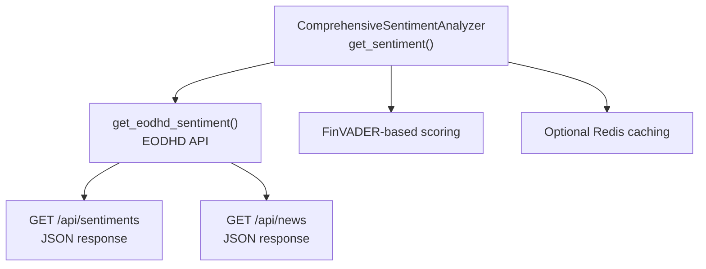
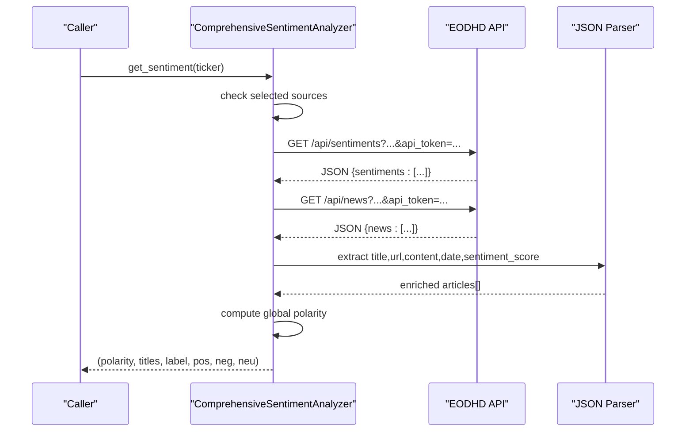
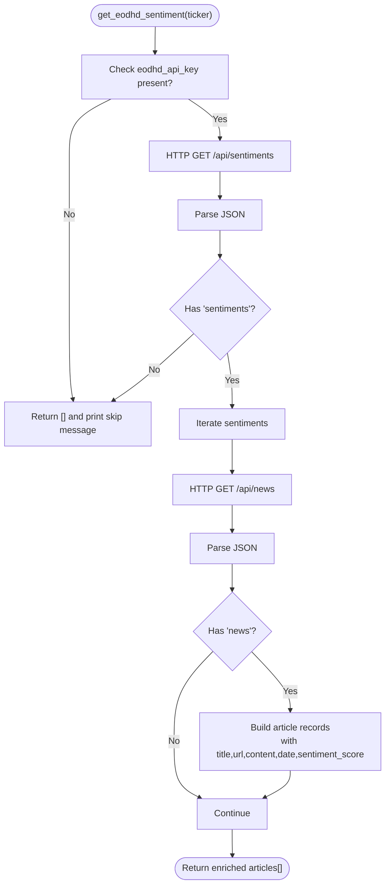
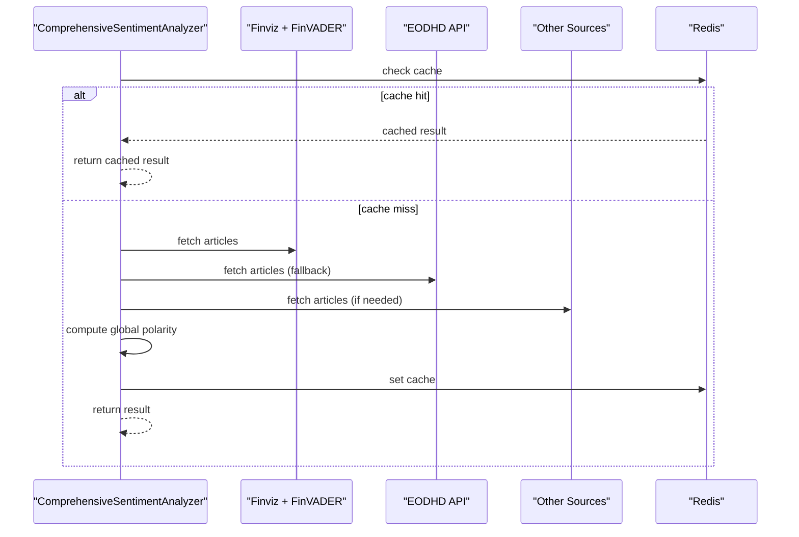
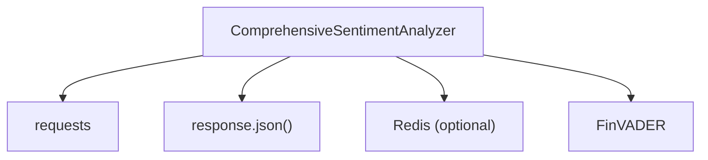

# EODHD API Integration

<cite>
**Referenced Files in This Document**
- [news_sentiment.py](file://news_sentiment.py)
- [API_KEYS_GUIDE.md](file://docs/API_KEYS_GUIDE.md)
- [API Keys Demo](file://demos/api_keys_demo.py)
- [Comprehensive Source Test](file://tests/comprehensive_source_test.py)
- [Three Sources Verification](file://tests/three_sources_verification.py)
- [Requirements](file://requirements.txt)
</cite>

## Table of Contents
1. [Introduction](#introduction)
2. [Project Structure](#project-structure)
3. [Core Components](#core-components)
4. [Architecture Overview](#architecture-overview)
5. [Detailed Component Analysis](#detailed-component-analysis)
6. [Dependency Analysis](#dependency-analysis)
7. [Performance Considerations](#performance-considerations)
8. [Troubleshooting Guide](#troubleshooting-guide)
9. [Conclusion](#conclusion)
10. [Appendices](#appendices)

## Introduction
This document focuses on the EODHD API integration sub-feature within the sentiment analysis pipeline. It explains how the get_eodhd_sentiment method retrieves pre-calculated sentiment data and associated news articles, how authentication works via an API token, and how the system handles responses and errors. It also covers configuration for the EODHD API key, the two-step process for fetching sentiment and news, performance benefits of using pre-calculated scores, and use cases where this source is preferred, especially in high-frequency trading scenarios.

## Project Structure
The EODHD integration is implemented within the ComprehensiveSentimentAnalyzer class and exposed via convenience functions. The relevant files include:
- news_sentiment.py: Contains the get_eodhd_sentiment method, the analyzer’s fallback chain, and helper functions.
- docs/API_KEYS_GUIDE.md: Provides guidance on obtaining and using API keys, including EODHD.
- demos/api_keys_demo.py: Demonstrates usage patterns and graceful fallback when keys are missing.
- tests/comprehensive_source_test.py and tests/three_sources_verification.py: Validate behavior under different API key conditions.
- requirements.txt: Lists dependencies including libraries used for HTTP requests and sentiment analysis.

**Diagram sources**
- [news_sentiment.py](file://news_sentiment.py#L480-L516)
- [news_sentiment.py](file://news_sentiment.py#L737-L895)

**Section sources**
- [news_sentiment.py](file://news_sentiment.py#L480-L516)
- [news_sentiment.py](file://news_sentiment.py#L737-L895)

## Core Components
- get_eodhd_sentiment(ticker): Fetches pre-calculated sentiment and news from EODHD API. It checks for the presence of an API key and returns an empty list if absent. It performs two HTTP requests: one to retrieve sentiment entries and another to fetch detailed news items. It extracts title, URL, content, date, and a precomputed compound sentiment score.
- get_sentiment(): Orchestrates the end-to-end sentiment analysis pipeline. It first tries Finviz + FinVADER, then optionally falls back to EODHD API if configured and available. It aggregates articles and computes a global polarity score, distributing positive/negative/neutral counts.

Key behaviors:
- Authentication: Uses the eodhd_api_key attribute and passes it as api_token in the URL.
- Response handling: Expects JSON responses with keys for sentiments and news; safely handles missing keys and malformed data.
- Error handling: Catches exceptions during HTTP requests and JSON parsing, prints messages, and returns empty lists or continues with other sources.
- Two-step process: First, fetch sentiment entries; then, fetch detailed news items for enrichment.

**Section sources**
- [news_sentiment.py](file://news_sentiment.py#L480-L516)
- [news_sentiment.py](file://news_sentiment.py#L737-L895)

## Architecture Overview
The EODHD integration participates in the broader sentiment pipeline. The diagram below maps the EODHD API calls and their role in the analyzer’s fallback chain.

**Diagram sources**
- [news_sentiment.py](file://news_sentiment.py#L480-L516)
- [news_sentiment.py](file://news_sentiment.py#L737-L895)

## Detailed Component Analysis

### get_eodhd_sentiment(ticker)
- Purpose: Retrieve pre-calculated sentiment and news from EODHD API.
- Authentication: Requires eodhd_api_key; if absent, returns an empty list and logs a message.
- Endpoint URL pattern:
  - Sentiment endpoint: https://eodhd.com/api/sentiments?s={ticker}&api_token={token}&fmt=json
  - News endpoint: https://eodhd.com/api/news?s={ticker}&limit=5&api_token={token}&fmt=json
- Response structure handling:
  - Sentiments: Expects a top-level key "sentiments" containing an array of sentiment entries.
  - News: Expects a top-level key "news" containing an array of news items.
  - Fields extracted: title, link, content, date, and sentiment.compound (precomputed).
- Enrichment: For each news item, constructs a normalized article record with sentiment_score included.
- Error handling: Catches exceptions around HTTP requests and JSON parsing, prints a message, and returns an empty list.

**Diagram sources**
- [news_sentiment.py](file://news_sentiment.py#L480-L516)

**Section sources**
- [news_sentiment.py](file://news_sentiment.py#L480-L516)

### get_sentiment() and Fallback Chain
- The analyzer orchestrates multiple sources. EODHD API is attempted as a fallback after Finviz + FinVADER.
- When precomputed sentiment scores are available (as in EODHD API responses), the analyzer uses them directly for global polarity computation and distribution counts.
- Redis caching is supported for performance.

**Diagram sources**
- [news_sentiment.py](file://news_sentiment.py#L737-L895)

**Section sources**
- [news_sentiment.py](file://news_sentiment.py#L737-L895)

### Configuration and API Key Management
- The analyzer accepts eodhd_api_key via constructor parameters or convenience functions.
- The eodhd_sentiment() convenience function sets eodhd_api_key and restricts the pipeline to EODHD API.
- The API keys guide documents how to obtain and use EODHD API keys and demonstrates graceful fallback when keys are missing.

Practical usage patterns:
- Without API key: The analyzer skips EODHD API and continues with available sources.
- With API key: The analyzer attempts EODHD API as part of the fallback chain.
- Environment variables: Recommended for secure storage of API keys.

**Section sources**
- [news_sentiment.py](file://news_sentiment.py#L311-L345)
- [news_sentiment.py](file://news_sentiment.py#L1199-L1207)
- [API_KEYS_GUIDE.md](file://docs/API_KEYS_GUIDE.md#L1-L30)
- [API Keys Demo](file://demos/api_keys_demo.py#L49-L57)

### Error Handling Mechanism
- Missing API key: The method returns an empty list and prints a skip message.
- Network failures and invalid responses: The method catches exceptions during HTTP requests and JSON parsing, prints an error message, and returns an empty list.
- Graceful fallback: The higher-level get_sentiment() continues with other sources if EODHD API fails or is not configured.

Validation evidence:
- Unit tests demonstrate that the analyzer proceeds without EODHD API when the key is None.
- Demo scripts show behavior when API keys are not provided or are invalid.

**Section sources**
- [news_sentiment.py](file://news_sentiment.py#L480-L516)
- [Comprehensive Source Test](file://tests/comprehensive_source_test.py#L43-L68)
- [Three Sources Verification](file://tests/three_sources_verification.py#L39-L52)
- [API Keys Demo](file://demos/api_keys_demo.py#L49-L57)

### Two-Step Process: Sentiment Data and News Articles
- Step 1: Fetch sentiment entries from the sentiments endpoint.
- Step 2: For each sentiment entry, fetch detailed news items from the news endpoint.
- Enrichment: Combine sentiment scores with full article content and metadata to produce a unified dataset for downstream analysis.

This process is encapsulated in get_eodhd_sentiment() and leverages the analyzer’s fallback logic in get_sentiment().

**Section sources**
- [news_sentiment.py](file://news_sentiment.py#L480-L516)
- [news_sentiment.py](file://news_sentiment.py#L737-L895)

## Dependency Analysis
- External HTTP library: The implementation uses requests for HTTP calls to EODHD endpoints.
- JSON parsing: Responses are parsed using response.json().
- Optional Redis caching: The analyzer supports Redis for caching results.
- Third-party libraries: The project includes libraries such as aiohttp, htmldate, and others, but the EODHD integration relies on requests.

**Diagram sources**
- [news_sentiment.py](file://news_sentiment.py#L311-L345)
- [news_sentiment.py](file://news_sentiment.py#L480-L516)
- [news_sentiment.py](file://news_sentiment.py#L737-L895)
- [requirements.txt](file://requirements.txt#L1-L19)

**Section sources**
- [news_sentiment.py](file://news_sentiment.py#L311-L345)
- [news_sentiment.py](file://news_sentiment.py#L480-L516)
- [news_sentiment.py](file://news_sentiment.py#L737-L895)
- [requirements.txt](file://requirements.txt#L1-L19)

## Performance Considerations
- Pre-calculated sentiment scores: EODHD API returns precomputed sentiment scores, avoiding the need to download and locally analyze article text. This significantly reduces latency and computational overhead compared to scraping and applying FinVADER locally.
- Two-step retrieval: While the method performs two HTTP requests, the overall latency is lower than full-text scraping and analysis because the sentiment is already computed server-side.
- Use cases: High-frequency trading (HFT) environments benefit from low-latency access to preprocessed sentiment signals, enabling rapid decision-making.

Evidence and guidance:
- The analyzer detects precomputed sentiment scores and uses them directly for global polarity computation.
- The API keys guide highlights EODHD as a premium source for pre-calculated sentiment.
- The integration is designed to be part of a multi-source fallback chain, allowing prioritization of the fastest available sources.

**Section sources**
- [news_sentiment.py](file://news_sentiment.py#L800-L895)
- [API_KEYS_GUIDE.md](file://docs/API_KEYS_GUIDE.md#L1-L30)

## Troubleshooting Guide
Common issues and resolutions:
- Missing API key:
  - Symptom: EODHD API is skipped, and a skip message is printed.
  - Resolution: Provide a valid eodhd_api_key or rely on other sources.
- Invalid API key or rate limit exceeded:
  - Symptom: Exceptions caught during HTTP requests or JSON parsing; error messages printed.
  - Resolution: Verify the key, check rate limits, and ensure network connectivity.
- Network failures:
  - Symptom: Timeouts or connection errors.
  - Resolution: Retry logic is not explicitly implemented in get_eodhd_sentiment(); consider adding retries or circuit breaker patterns at the caller level if needed.

Validation evidence:
- Unit tests and demos confirm graceful fallback behavior when keys are missing or invalid.
- The analyzer prints informative messages for both skip and error conditions.

**Section sources**
- [news_sentiment.py](file://news_sentiment.py#L480-L516)
- [Comprehensive Source Test](file://tests/comprehensive_source_test.py#L43-L68)
- [API Keys Demo](file://demos/api_keys_demo.py#L49-L57)

## Conclusion
The EODHD API integration provides a fast, reliable fallback for sentiment analysis by leveraging pre-calculated sentiment scores and associated news content. The get_eodhd_sentiment method implements robust authentication via an API token, structured response handling, and graceful error management. The analyzer’s fallback chain ensures continuity even when the API is unavailable or keys are missing. For high-frequency trading and latency-sensitive applications, EODHD’s preprocessed data offers significant performance advantages over local analysis.

## Appendices

### API Endpoint URL Pattern and Authentication
- Sentiment endpoint: https://eodhd.com/api/sentiments?s={ticker}&api_token={token}&fmt=json
- News endpoint: https://eodhd.com/api/news?s={ticker}&limit=5&api_token={token}&fmt=json
- Authentication: api_token parameter derived from eodhd_api_key.

**Section sources**
- [news_sentiment.py](file://news_sentiment.py#L480-L516)

### Response Structure Handling
- Sentiments: Top-level key "sentiments" with an array of entries.
- News: Top-level key "news" with an array of entries.
- Enriched fields: title, link, content, date, sentiment.compound.

**Section sources**
- [news_sentiment.py](file://news_sentiment.py#L480-L516)

### Configuration Requirements
- Provide eodhd_api_key either via constructor or convenience function eodhd_sentiment().
- Store keys securely using environment variables.
- The API keys guide provides step-by-step instructions for obtaining and using EODHD API keys.

**Section sources**
- [news_sentiment.py](file://news_sentiment.py#L311-L345)
- [news_sentiment.py](file://news_sentiment.py#L1199-L1207)
- [API_KEYS_GUIDE.md](file://docs/API_KEYS_GUIDE.md#L1-L30)

### Use Cases and Performance Benefits
- Preferred for high-frequency trading: Low-latency access to precomputed sentiment signals.
- Performance benefits: Avoids browser automation and local FinVADER analysis, reducing end-to-end latency.

**Section sources**
- [API_KEYS_GUIDE.md](file://docs/API_KEYS_GUIDE.md#L1-L30)
- [news_sentiment.py](file://news_sentiment.py#L800-L895)