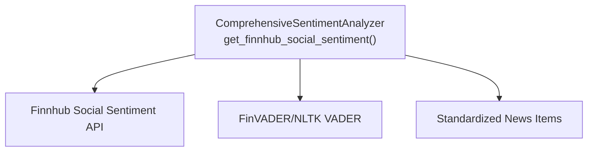
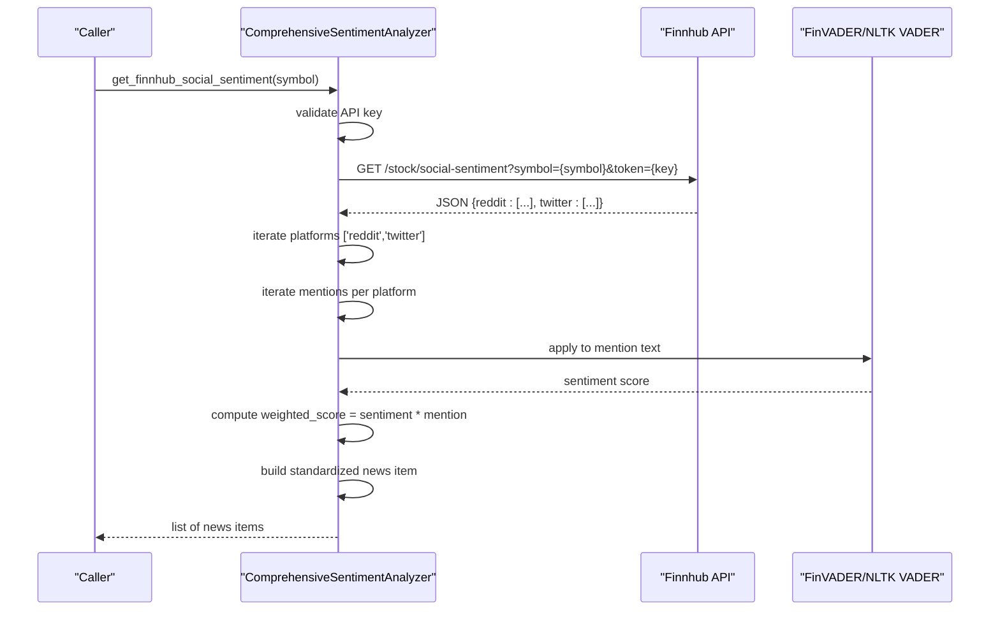
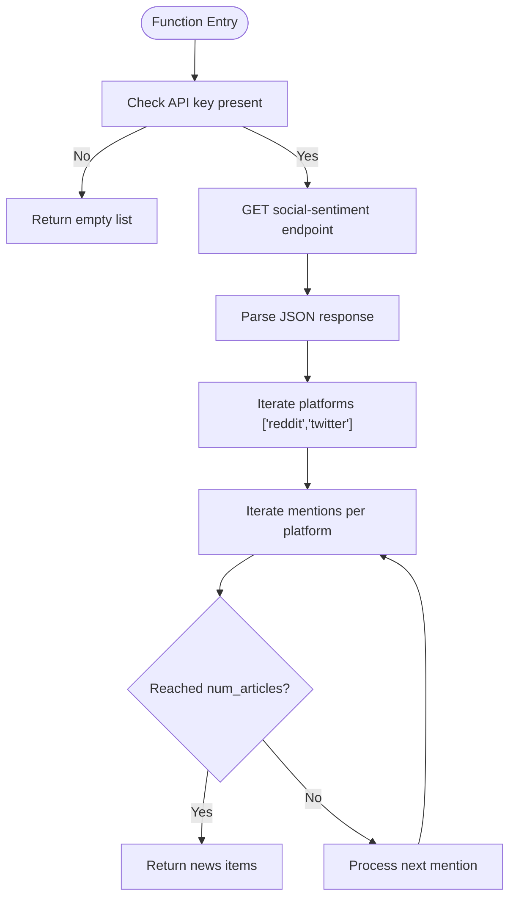
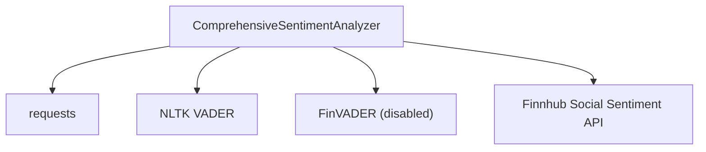

# Finnhub Social Sentiment API

<cite>
**Referenced Files in This Document**
- [news_sentiment.py](file://news_sentiment.py)
- [API_KEYS_GUIDE.md](file://docs/API_KEYS_GUIDE.md)
- [ERROR_HANDLING_MONITORING.md](file://docs/ERROR_HANDLING_MONITORING.md)
- [all_sources_integration_test.py](file://tests/all_sources_integration_test.py)
</cite>

## Table of Contents
1. [Introduction](#introduction)
2. [Project Structure](#project-structure)
3. [Core Components](#core-components)
4. [Architecture Overview](#architecture-overview)
5. [Detailed Component Analysis](#detailed-component-analysis)
6. [Dependency Analysis](#dependency-analysis)
7. [Performance Considerations](#performance-considerations)
8. [Troubleshooting Guide](#troubleshooting-guide)
9. [Conclusion](#conclusion)
10. [Appendices](#appendices)

## Introduction
This document explains the Finnhub Social Sentiment API integration within the sentiment analysis module. It focuses on the get_finnhub_social_sentiment method, detailing how the endpoint URL is constructed with symbol and authentication token, how the response is parsed to extract social mentions from Reddit and Twitter, how FinVADER is applied to raw social media text, and how volume-weighted sentiment scoring multiplies sentiment by mention counts. It also describes the data transformation process that converts social mentions into standardized news items with platform-specific titles and URLs, and outlines error handling for API connectivity and response parsing. Finally, it covers configuration requirements for the Finnhub API key and highlights use cases where social sentiment monitoring is critical, such as retail trading applications tracking community sentiment.

## Project Structure
The Finnhub Social Sentiment integration resides in the sentiment analysis module alongside other sources (Finviz, EODHD, Alpha Vantage, Tradestie Reddit, StockGeist, and Google News RSS). The integration is encapsulated within the ComprehensiveSentimentAnalyzer class and exposed via convenience functions.

**Diagram sources**
- [news_sentiment.py](file://news_sentiment.py#L622-L666)

**Section sources**
- [news_sentiment.py](file://news_sentiment.py#L622-L666)

## Core Components
- get_finnhub_social_sentiment(symbol): Fetches social sentiment data from Finnhub for the given symbol, applies FinVADER to raw text, computes volume-weighted sentiment, and transforms mentions into standardized news items with platform-specific titles and URLs.
- Configuration: Requires a Finnhub API key; if not provided, the method gracefully skips the source.
- Error handling: Includes try/except blocks around API calls and FinVADER application, with fallbacks to neutral sentiment when parsing fails.

**Section sources**
- [news_sentiment.py](file://news_sentiment.py#L622-L666)
- [API_KEYS_GUIDE.md](file://docs/API_KEYS_GUIDE.md#L55-L77)

## Architecture Overview
The Finnhub Social Sentiment integration follows a layered approach:
- API layer: Requests the Finnhub endpoint with symbol and token.
- Parsing layer: Iterates over supported platforms (Reddit, Twitter) and individual mentions.
- Scoring layer: Applies FinVADER to raw text and multiplies by mention count for volume weighting.
- Transformation layer: Converts each mention into a standardized news item with platform-specific metadata.
- Selection layer: Integrated into the broader sentiment pipeline and can be selected independently.

**Diagram sources**
- [news_sentiment.py](file://news_sentiment.py#L622-L666)

## Detailed Component Analysis

### Finnhub Social Sentiment Endpoint Construction
- URL construction: The method builds the endpoint URL using the symbol and the Finnhub API token.
- Authentication: The token is appended as a query parameter.
- Request configuration: Uses a shared User-Agent header and a timeout for resilience.

Key implementation references:
- URL construction and request: [news_sentiment.py](file://news_sentiment.py#L633-L636)
- Headers and timeout: [news_sentiment.py](file://news_sentiment.py#L328-L331)

**Section sources**
- [news_sentiment.py](file://news_sentiment.py#L633-L636)
- [news_sentiment.py](file://news_sentiment.py#L328-L331)

### Response Parsing and Platform Separation
- Supported platforms: The method iterates over ['reddit','twitter'] and processes mentions from each platform.
- Individual mention iteration: For each platform, it iterates through the list of mentions.
- Early termination: The loop respects the configured num_articles limit.

Key implementation references:
- Platform loop and mention iteration: [news_sentiment.py](file://news_sentiment.py#L640-L661)

**Diagram sources**
- [news_sentiment.py](file://news_sentiment.py#L622-L666)

**Section sources**
- [news_sentiment.py](file://news_sentiment.py#L640-L661)

### FinVADER Application and Volume-Weighted Sentiment Scoring
- FinVADER application: For each mention, the method applies FinVADER to the raw text.
- Volume-weighted scoring: The computed sentiment is multiplied by the mention count to reflect volume-weighted influence.

Key implementation references:
- FinVADER application and weighted scoring: [news_sentiment.py](file://news_sentiment.py#L646-L651)

Notes:
- The repository disables the FinVADER library in this codebase; the method falls back to NLTK VADER when FinVADER is not available.
- The method includes a robust FinVADER wrapper elsewhere in the module with retry logic and fallbacks.

**Section sources**
- [news_sentiment.py](file://news_sentiment.py#L646-L651)
- [news_sentiment.py](file://news_sentiment.py#L828-L848)
- [news_sentiment.py](file://news_sentiment.py#L1049-L1119)

### Data Transformation to Standardized News Items
- Title construction: Titles are prefixed with the platform name and a snippet of the original text.
- URL assignment: The URL is taken from the mention’s URL field.
- Metadata inclusion: Source is set to the platform name; date is taken from the mention’s timestamp; sentiment_score is the volume-weighted score.
- Early termination: The method stops adding items once the configured num_articles limit is reached.

Key implementation references:
- Standardized news item creation: [news_sentiment.py](file://news_sentiment.py#L653-L661)

**Section sources**
- [news_sentiment.py](file://news_sentiment.py#L653-L661)

### Code Examples: Iteration Over Platforms and Mentions
- Platform iteration: The method iterates over ['reddit','twitter'] and processes mentions from each.
- Mention iteration: Within each platform, it iterates through the list of mentions until the article cap is reached.

Key implementation references:
- Platform and mention loops: [news_sentiment.py](file://news_sentiment.py#L640-L661)

**Section sources**
- [news_sentiment.py](file://news_sentiment.py#L640-L661)

### Integration Into the Broader Sentiment Pipeline
- Selection: The Finnhub Social source can be selected independently via convenience functions or included in a broader pipeline.
- Fallback behavior: If the Finnhub API key is not provided, the method gracefully skips the source.

Key implementation references:
- Convenience function for Finnhub-only sentiment: [news_sentiment.py](file://news_sentiment.py#L1226-L1233)
- Graceful skip when API key is missing: [news_sentiment.py](file://news_sentiment.py#L627-L629)

**Section sources**
- [news_sentiment.py](file://news_sentiment.py#L1226-L1233)
- [news_sentiment.py](file://news_sentiment.py#L627-L629)

## Dependency Analysis
- External API: Finnhub Social Sentiment API endpoint.
- Internal dependencies:
  - FinVADER/NLTK VADER for sentiment scoring.
  - requests for HTTP calls.
  - Standardized news item construction for consistent output.

**Diagram sources**
- [news_sentiment.py](file://news_sentiment.py#L622-L666)

**Section sources**
- [news_sentiment.py](file://news_sentiment.py#L622-L666)

## Performance Considerations
- API call timeout: The method sets a timeout for the Finnhub request to avoid hanging.
- Early termination: The method stops processing once the desired number of articles is reached.
- Scoring overhead: FinVADER/NLTK VADER application is performed per mention; batching or vectorization could reduce overhead in higher-throughput scenarios.

**Section sources**
- [news_sentiment.py](file://news_sentiment.py#L633-L636)
- [news_sentiment.py](file://news_sentiment.py#L640-L661)

## Troubleshooting Guide
- API connectivity issues:
  - The method catches exceptions during the HTTP request and prints an error message. Ensure the Finnhub API key is valid and network connectivity is available.
  - Reference: [news_sentiment.py](file://news_sentiment.py#L633-L636)
- Response parsing failures:
  - The method catches exceptions during FinVADER application and assigns a neutral weighted score as a fallback.
  - Reference: [news_sentiment.py](file://news_sentiment.py#L646-L651)
- Graceful degradation:
  - If the Finnhub API key is not provided, the method returns an empty list and continues with other sources.
  - Reference: [news_sentiment.py](file://news_sentiment.py#L627-L629)
- Configuration requirements:
  - Obtain a Finnhub API key and pass it to the analyzer or via the convenience function.
  - Reference: [API_KEYS_GUIDE.md](file://docs/API_KEYS_GUIDE.md#L55-L77)
- Error handling and monitoring:
  - The module includes robust error handling with logging and fallbacks; consult the error handling documentation for retry strategies and monitoring patterns.
  - Reference: [ERROR_HANDLING_MONITORING.md](file://docs/ERROR_HANDLING_MONITORING.md#L1-L313)

**Section sources**
- [news_sentiment.py](file://news_sentiment.py#L627-L636)
- [news_sentiment.py](file://news_sentiment.py#L646-L651)
- [API_KEYS_GUIDE.md](file://docs/API_KEYS_GUIDE.md#L55-L77)
- [ERROR_HANDLING_MONITORING.md](file://docs/ERROR_HANDLING_MONITORING.md#L1-L313)

## Conclusion
The Finnhub Social Sentiment integration provides a streamlined way to incorporate Reddit and Twitter mentions into the sentiment analysis pipeline. It constructs the endpoint URL with the symbol and token, parses the response by platform, applies FinVADER to raw text, computes volume-weighted sentiment, and transforms mentions into standardized news items. The implementation includes robust error handling and graceful degradation when the API key is missing. For retail trading applications and community sentiment monitoring, this integration offers timely insights from social platforms.

## Appendices

### Configuration Requirements
- Finnhub API key: Required to enable the Finnhub Social source. The key can be passed to the analyzer constructor or via the convenience function.
- Reference: [API_KEYS_GUIDE.md](file://docs/API_KEYS_GUIDE.md#L55-L77)

**Section sources**
- [API_KEYS_GUIDE.md](file://docs/API_KEYS_GUIDE.md#L55-L77)

### Use Cases Where Social Sentiment Monitoring Is Critical
- Retail trading applications: Tracking community sentiment on social platforms to inform short-term decisions.
- Community sentiment monitoring: Observing spikes in mentions and sentiment to anticipate market reactions.
- Reference: [API_KEYS_GUIDE.md](file://docs/API_KEYS_GUIDE.md#L170-L189)

**Section sources**
- [API_KEYS_GUIDE.md](file://docs/API_KEYS_GUIDE.md#L170-L189)

### Integration Test Coverage
- The integration test suite includes a dedicated test for Finnhub Social, verifying graceful handling when the API key is not provided.
- Reference: [all_sources_integration_test.py](file://tests/all_sources_integration_test.py#L124-L143)

**Section sources**
- [all_sources_integration_test.py](file://tests/all_sources_integration_test.py#L124-L143)