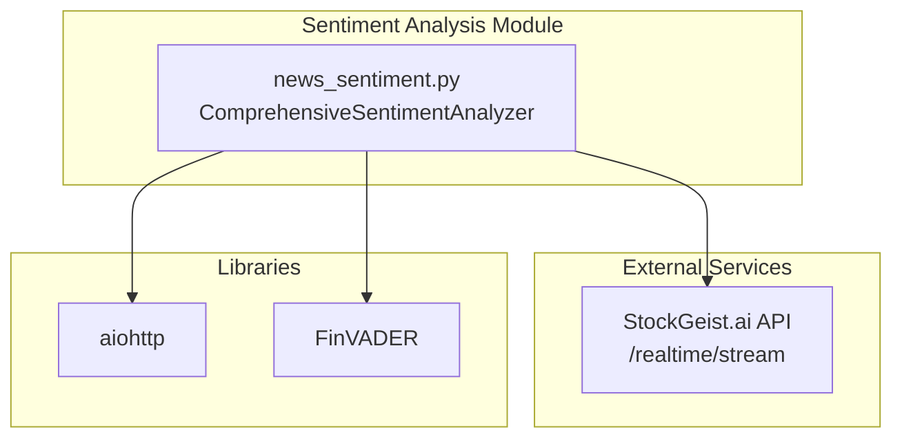
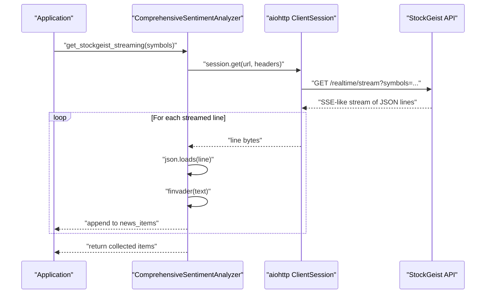
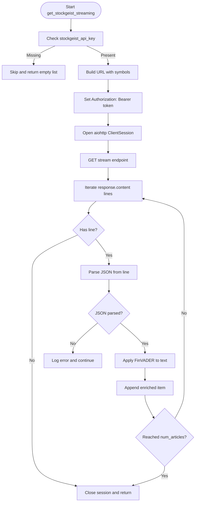
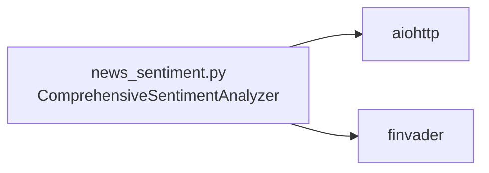

# StockGeist.ai Real-Time Streaming

<cite>
**Referenced Files in This Document**
- [news_sentiment.py](file://news_sentiment.py)
- [requirements.txt](file://requirements.txt)
- [demos/api_keys_demo.py](file://demos/api_keys_demo.py)
- [docs/API_KEYS_GUIDE.md](file://docs/API_KEYS_GUIDE.md)
- [docs/COMPLETE_INTEGRATION_SUMMARY.md](file://docs/COMPLETE_INTEGRATION_SUMMARY.md)
</cite>

## Table of Contents
1. [Introduction](#introduction)
2. [Project Structure](#project-structure)
3. [Core Components](#core-components)
4. [Architecture Overview](#architecture-overview)
5. [Detailed Component Analysis](#detailed-component-analysis)
6. [Dependency Analysis](#dependency-analysis)
7. [Performance Considerations](#performance-considerations)
8. [Troubleshooting Guide](#troubleshooting-guide)
9. [Conclusion](#conclusion)
10. [Appendices](#appendices)

## Introduction
This document explains the StockGeist.ai real-time streaming integration implemented in the repository. It focuses on the asynchronous Server-Sent Events (SSE) stream handling using aiohttp, the endpoint URL construction for real-time sentiment streams, Bearer token authentication, the event loop that parses JSON messages and applies FinVADER sentiment analysis, graceful error handling, and practical deployment guidance for fintech startups requiring low-latency market sentiment monitoring.

## Project Structure
The StockGeist streaming feature is implemented within the sentiment analysis module. The module orchestrates multiple sources and includes a dedicated async method for real-time streaming from StockGeist. Supporting documentation and demos illustrate API key configuration and usage patterns.

**Diagram sources**
- [news_sentiment.py](file://news_sentiment.py#L667-L706)
- [requirements.txt](file://requirements.txt#L1-L19)

**Section sources**
- [news_sentiment.py](file://news_sentiment.py#L667-L706)
- [requirements.txt](file://requirements.txt#L1-L19)

## Core Components
- Async StockGeist streaming method: Implements SSE-style consumption of StockGeist’s real-time stream endpoint using aiohttp, constructs the endpoint URL with a symbols parameter, and authenticates with a Bearer token header.
- Message processing loop: Iterates over streamed lines, parses JSON, applies FinVADER sentiment analysis to the message text, and collects structured results.
- Error handling: Catches exceptions during JSON parsing and message processing, logs errors, and continues processing until the configured article cap is reached.
- Configuration: Requires a StockGeist API key passed to the analyzer constructor; the module checks for the presence of the key before attempting to stream.

Key implementation references:
- Async streaming method and endpoint construction: [news_sentiment.py](file://news_sentiment.py#L667-L706)
- FinVADER integration for sentiment scoring: [news_sentiment.py](file://news_sentiment.py#L687-L698)
- API key requirement and graceful skip: [news_sentiment.py](file://news_sentiment.py#L672-L674)

**Section sources**
- [news_sentiment.py](file://news_sentiment.py#L667-L706)

## Architecture Overview
The streaming pipeline connects the application to StockGeist’s SSE endpoint, processes each incoming JSON message asynchronously, and enriches it with sentiment scores.

**Diagram sources**
- [news_sentiment.py](file://news_sentiment.py#L667-L706)

## Detailed Component Analysis

### Endpoint Construction and Authentication
- Endpoint URL: Built from a base path and a query parameter containing a comma-separated list of symbols.
- Authentication: Adds an Authorization header with a Bearer token derived from the configured StockGeist API key.
- Session lifecycle: Uses an aiohttp ClientSession as an async context manager to manage the HTTP connection.

Implementation references:
- URL construction and headers: [news_sentiment.py](file://news_sentiment.py#L678-L681)
- Async session and request: [news_sentiment.py](file://news_sentiment.py#L682-L683)

**Section sources**
- [news_sentiment.py](file://news_sentiment.py#L678-L683)

### Event Loop and Message Processing
- Streaming iteration: Reads response content line-by-line using an async iterator.
- JSON parsing: Converts each non-empty line into a JSON object.
- Sentiment analysis: Applies FinVADER to the message text field and stores the resulting score.
- Alerting and enrichment: Stores fields such as title, URL, text, source, timestamp, sentiment score, and symbol.
- Early termination: Stops collecting when the configured article cap is reached.

Implementation references:
- Line iteration and early exit: [news_sentiment.py](file://news_sentiment.py#L684-L702)
- JSON parsing and FinVADER application: [news_sentiment.py](file://news_sentiment.py#L686-L698)

**Diagram sources**
- [news_sentiment.py](file://news_sentiment.py#L667-L706)

**Section sources**
- [news_sentiment.py](file://news_sentiment.py#L667-L706)

### Async Context Manager Usage and Message Processing Loop
- The method uses aiohttp.ClientSession as an async context manager to ensure proper resource management.
- The loop reads streamed lines, decodes JSON, and performs sentiment analysis per message.
- Graceful error handling prevents single malformed messages from breaking the entire stream.

Implementation references:
- Async context manager and loop: [news_sentiment.py](file://news_sentiment.py#L682-L702)
- Error handling inside loop: [news_sentiment.py](file://news_sentiment.py#L699-L700)

**Section sources**
- [news_sentiment.py](file://news_sentiment.py#L682-L702)

### Configuration Requirements for StockGeist API Key
- Passing the key: The StockGeist API key is provided to the analyzer constructor and stored for later use.
- Requirement enforcement: The method checks for the presence of the key and skips streaming if absent.
- Documentation and demos: The repository includes guidance and examples for obtaining and configuring API keys.

Implementation references:
- Constructor parameter and storage: [news_sentiment.py](file://news_sentiment.py#L327-L327)
- Presence check and skip: [news_sentiment.py](file://news_sentiment.py#L672-L674)
- API key guide and usage examples: [docs/API_KEYS_GUIDE.md](file://docs/API_KEYS_GUIDE.md#L80-L102)
- Demo showing “API key required” for StockGeist: [demos/api_keys_demo.py](file://demos/api_keys_demo.py#L155-L160)

**Section sources**
- [news_sentiment.py](file://news_sentiment.py#L327-L327)
- [news_sentiment.py](file://news_sentiment.py#L672-L674)
- [docs/API_KEYS_GUIDE.md](file://docs/API_KEYS_GUIDE.md#L80-L102)
- [demos/api_keys_demo.py](file://demos/api_keys_demo.py#L155-L160)

### Optimal Deployment Patterns for Persistent Connections
- Use async context managers: Ensure the aiohttp ClientSession is opened and closed within the method scope to manage resources efficiently.
- Control article caps: Tune the analyzer’s num_articles setting to balance latency and throughput for real-time scenarios.
- Graceful degradation: Since the method returns collected items upon encountering errors or reaching the cap, design higher-level loops to reconnect and resume streaming.
- Environment configuration: Supply the StockGeist API key via constructor parameters or environment variables as shown in the demos and documentation.

Implementation references:
- Async context manager usage: [news_sentiment.py](file://news_sentiment.py#L682-L683)
- Article cap enforcement: [news_sentiment.py](file://news_sentiment.py#L685-L702)
- API key configuration guidance: [docs/API_KEYS_GUIDE.md](file://docs/API_KEYS_GUIDE.md#L80-L102)
- Demo usage patterns: [demos/api_keys_demo.py](file://demos/api_keys_demo.py#L101-L134)

**Section sources**
- [news_sentiment.py](file://news_sentiment.py#L682-L702)
- [docs/API_KEYS_GUIDE.md](file://docs/API_KEYS_GUIDE.md#L80-L102)
- [demos/api_keys_demo.py](file://demos/api_keys_demo.py#L101-L134)

### Use Cases in Fintech Startups and Low-Latency Trading Systems
- Fintech MVP stack: The repository demonstrates a “StockGeist + FinVADER + FastAPI” stack suitable for rapid product launches.
- Real-time monitoring: StockGeist streaming enables near-instant sentiment ingestion for dashboards and alerts.
- Performance benefits: The module emphasizes speed and scalability, aligning with low-latency trading needs.

References:
- Use case demonstration mentioning StockGeist: [demos/use_case_sentiment_demo.py](file://demos/use_case_sentiment_demo.py#L92-L109)
- Integration summary highlighting real-time streaming: [docs/COMPLETE_INTEGRATION_SUMMARY.md](file://docs/COMPLETE_INTEGRATION_SUMMARY.md#L146-L179)

**Section sources**
- [demos/use_case_sentiment_demo.py](file://demos/use_case_sentiment_demo.py#L92-L109)
- [docs/COMPLETE_INTEGRATION_SUMMARY.md](file://docs/COMPLETE_INTEGRATION_SUMMARY.md#L146-L179)

## Dependency Analysis
- External libraries:
  - aiohttp: Provides asynchronous HTTP client functionality for streaming.
  - finvader: Performs financial sentiment analysis on text content.
- Internal dependencies:
  - ComprehensiveSentimentAnalyzer: Encapsulates streaming logic, configuration, and sentiment scoring.
  - FinVADER integration: Applied to message text to produce a numeric sentiment score.

**Diagram sources**
- [news_sentiment.py](file://news_sentiment.py#L667-L706)
- [requirements.txt](file://requirements.txt#L1-L19)

**Section sources**
- [news_sentiment.py](file://news_sentiment.py#L667-L706)
- [requirements.txt](file://requirements.txt#L1-L19)

## Performance Considerations
- Asynchronous streaming: aiohttp enables efficient handling of SSE-like streams without blocking the event loop.
- Early termination: The loop exits when the configured article cap is reached, preventing unnecessary processing.
- Resource management: Using async context managers ensures connections are properly closed, reducing resource leaks.
- Latency-sensitive environments: Combine streaming with appropriate num_articles tuning and robust error handling to maintain responsiveness.

[No sources needed since this section provides general guidance]

## Troubleshooting Guide
Common issues and remedies:
- Missing API key:
  - Symptom: Streaming is skipped with a printed message.
  - Resolution: Provide a valid StockGeist API key to the analyzer constructor.
  - Reference: [news_sentiment.py](file://news_sentiment.py#L672-L674)
- Invalid or malformed JSON lines:
  - Symptom: Errors logged and processing continues.
  - Resolution: Ensure the upstream stream sends valid JSON lines; consider adding retry logic at a higher level.
  - Reference: [news_sentiment.py](file://news_sentiment.py#L699-L700)
- Network or endpoint errors:
  - Symptom: Exceptions caught and logged; method returns collected items.
  - Resolution: Implement retry loops and circuit breaker patterns at the application level.
  - Reference: [news_sentiment.py](file://news_sentiment.py#L704-L706)
- API key configuration:
  - Symptom: Misconfigured or missing key.
  - Resolution: Follow the documented steps to obtain and configure the key.
  - References: [docs/API_KEYS_GUIDE.md](file://docs/API_KEYS_GUIDE.md#L80-L102), [demos/api_keys_demo.py](file://demos/api_keys_demo.py#L101-L134)

**Section sources**
- [news_sentiment.py](file://news_sentiment.py#L672-L706)
- [docs/API_KEYS_GUIDE.md](file://docs/API_KEYS_GUIDE.md#L80-L102)
- [demos/api_keys_demo.py](file://demos/api_keys_demo.py#L101-L134)

## Conclusion
The StockGeist.ai real-time streaming integration leverages aiohttp to consume a JSON-line SSE-like stream, authenticate with a Bearer token, and apply FinVADER sentiment analysis to each message. The implementation is designed for resilience, with explicit checks for API keys, graceful error handling, and early termination based on article caps. For fintech startups, this foundation supports low-latency market sentiment monitoring and can be integrated into broader trading systems with proper deployment patterns and environment configuration.

[No sources needed since this section summarizes without analyzing specific files]

## Appendices

### API Key Configuration References
- Obtaining and configuring StockGeist API keys: [docs/API_KEYS_GUIDE.md](file://docs/API_KEYS_GUIDE.md#L80-L102)
- Demo usage patterns and environment-friendly approaches: [demos/api_keys_demo.py](file://demos/api_keys_demo.py#L101-L134)

**Section sources**
- [docs/API_KEYS_GUIDE.md](file://docs/API_KEYS_GUIDE.md#L80-L102)
- [demos/api_keys_demo.py](file://demos/api_keys_demo.py#L101-L134)