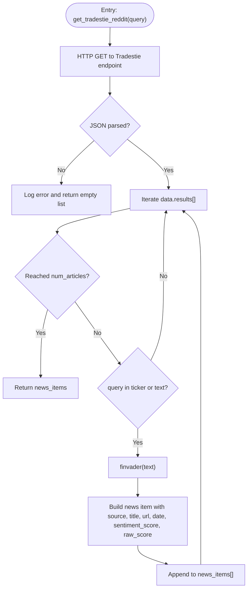

# Tradestie WallStreetBets API

<cite>
**Referenced Files in This Document**
- [news_sentiment.py](file://news_sentiment.py)
- [all_sources_integration_test.py](file://tests/all_sources_integration_test.py)
- [test_finvader_implementation.py](file://tests/test_finvader_implementation.py)
- [FINVADER_IMPLEMENTATION_SUMMARY.md](file://docs/FINVADER_IMPLEMENTATION_SUMMARY.md)
- [ERROR_HANDLING_MONITORING.md](file://docs/ERROR_HANDLING_MONITORING.md)
</cite>

## Table of Contents
1. [Introduction](#introduction)
2. [Project Structure](#project-structure)
3. [Core Components](#core-components)
4. [Architecture Overview](#architecture-overview)
5. [Detailed Component Analysis](#detailed-component-analysis)
6. [Dependency Analysis](#dependency-analysis)
7. [Performance Considerations](#performance-considerations)
8. [Troubleshooting Guide](#troubleshooting-guide)
9. [Conclusion](#conclusion)
10. [Appendices](#appendices)

## Introduction
This document explains the Tradestie WallStreetBets API integration within the sentiment analysis pipeline. It covers how the system fetches raw Reddit mentions from the public Tradestie endpoint, applies relevance filtering by ticker or text, enriches the results with FinVADER sentiment, and integrates the resulting news items into the unified sentiment analysis workflow. It also documents error handling for network failures and JSON parsing issues, and highlights the value of retail-driven sentiment for fintech applications.

## Project Structure
The Tradestie integration resides in the sentiment module alongside other sources. The module exposes:
- A dedicated method to fetch and refine Reddit mentions
- A convenience function to run only Reddit sentiment
- A broader sentiment pipeline that aggregates results from multiple sources, including Reddit

**Diagram sources**
- [news_sentiment.py](file://news_sentiment.py#L583-L621)
- [news_sentiment.py](file://news_sentiment.py#L737-L800)

**Section sources**
- [news_sentiment.py](file://news_sentiment.py#L583-L621)
- [news_sentiment.py](file://news_sentiment.py#L737-L800)

## Core Components
- Tradestie Reddit fetcher: Retrieves raw mentions from the public endpoint and filters by query relevance.
- FinVADER refinement: Applies financial sentiment analysis to Reddit text to produce nuanced scores.
- News item enrichment: Creates standardized news items with source labeling, titles, URLs, dates, and sentiment scores.
- Integration into the pipeline: Reddit results are merged with other sources and analyzed for polarity and distribution.

Key responsibilities:
- Network request to the Tradestie endpoint
- JSON parsing and iteration over results
- Relevance filtering by ticker or text
- FinVADER scoring and fallback handling
- Metadata enrichment and normalization

**Section sources**
- [news_sentiment.py](file://news_sentiment.py#L583-L621)
- [news_sentiment.py](file://news_sentiment.py#L800-L895)

## Architecture Overview
The Reddit integration participates in the multi-source sentiment pipeline. The flow below shows how Reddit mentions are fetched, filtered, scored, and integrated.

**Diagram sources**
- [news_sentiment.py](file://news_sentiment.py#L737-L799)
- [news_sentiment.py](file://news_sentiment.py#L583-L621)
- [news_sentiment.py](file://news_sentiment.py#L800-L895)

## Detailed Component Analysis

### Tradestie Reddit Fetcher and Relevance Filtering
- Endpoint: Public endpoint for Reddit mentions.
- Request: HTTP GET with a short timeout.
- Parsing: JSON response with a results array.
- Filtering: Mentions are included if either the query appears in the ticker field or in the text field.
- Enrichment: Titles are constructed for display; URLs are generated from Reddit identifiers; dates and raw sentiment scores are preserved alongside FinVADER compound scores.

**Diagram sources**
- [news_sentiment.py](file://news_sentiment.py#L583-L621)

**Section sources**
- [news_sentiment.py](file://news_sentiment.py#L583-L621)

### FinVADER Sentiment Refinement
- The integration uses FinVADER to compute a nuanced financial sentiment score for each Reddit mention.
- If FinVADER is unavailable or fails, the code falls back to standard VADER.
- The refined compound score replaces the API’s basic sentiment score for downstream analysis.

**Diagram sources**
- [news_sentiment.py](file://news_sentiment.py#L800-L895)

**Section sources**
- [news_sentiment.py](file://news_sentiment.py#L800-L895)

### News Item Enrichment and Metadata
- Title: Constructed with a “Reddit:” prefix and truncated text for readability.
- URL: Built from Reddit identifiers.
- Source: Labeled as “Tradestie Reddit.”
- Date: From the mention’s published timestamp.
- Sentiment: FinVADER compound score.
- Raw score: Preserved from the API for transparency.

These items are appended to the unified list of news items and later analyzed for polarity and distribution.

**Section sources**
- [news_sentiment.py](file://news_sentiment.py#L583-L621)
- [news_sentiment.py](file://news_sentiment.py#L737-L799)

### Integration Into the Unified Pipeline
- The Reddit results are merged with outputs from other sources (Finviz, EODHD, Alpha Vantage, Finnhub, Google News).
- The unified list is analyzed using FinVADER/VADER to compute global polarity and distribution statistics.
- The pipeline caches results and logs sentiment distributions for observability.

**Diagram sources**
- [news_sentiment.py](file://news_sentiment.py#L737-L799)
- [news_sentiment.py](file://news_sentiment.py#L800-L895)

**Section sources**
- [news_sentiment.py](file://news_sentiment.py#L737-L799)
- [news_sentiment.py](file://news_sentiment.py#L800-L895)

### API Workflow and Error Handling
- Network failures: The fetcher catches exceptions during HTTP requests and JSON parsing, logs them, and returns an empty list.
- JSON parsing issues: The code checks for the presence of the expected keys and gracefully handles missing data.
- FinVADER failures: The pipeline falls back to VADER and logs errors.

**Diagram sources**
- [news_sentiment.py](file://news_sentiment.py#L583-L621)
- [news_sentiment.py](file://news_sentiment.py#L800-L895)

**Section sources**
- [news_sentiment.py](file://news_sentiment.py#L583-L621)
- [news_sentiment.py](file://news_sentiment.py#L800-L895)

## Dependency Analysis
- External libraries:
  - requests: HTTP client for fetching Reddit mentions.
  - finvader: Financial sentiment library for nuanced scoring.
  - NLTK VADER: Fallback sentiment analyzer.
- Internal dependencies:
  - ComprehensiveSentimentAnalyzer orchestrates source selection and aggregation.
  - get_sentiment performs sentiment analysis and distribution computation.

**Diagram sources**
- [news_sentiment.py](file://news_sentiment.py#L583-L621)
- [news_sentiment.py](file://news_sentiment.py#L800-L895)

**Section sources**
- [news_sentiment.py](file://news_sentiment.py#L583-L621)
- [news_sentiment.py](file://news_sentiment.py#L800-L895)

## Performance Considerations
- The Reddit endpoint returns a results array; the integration limits processing to the configured number of articles.
- FinVADER is used for rapid, financial-domain-aware scoring; when unavailable, VADER provides a quick fallback.
- The pipeline caches results and logs distributions to support monitoring and reduce repeated processing.

[No sources needed since this section provides general guidance]

## Troubleshooting Guide
Common issues and resolutions:
- Network timeouts or HTTP errors: The fetcher catches exceptions and logs them; verify connectivity and endpoint availability.
- JSON parsing failures: Ensure the endpoint returns the expected structure; the code checks for required keys and handles missing data gracefully.
- FinVADER import or runtime errors: The pipeline falls back to VADER and logs the error; install or enable FinVADER for enhanced accuracy.
- Tests: Dedicated tests exercise the Reddit integration and demonstrate expected behavior.

**Section sources**
- [news_sentiment.py](file://news_sentiment.py#L583-L621)
- [news_sentiment.py](file://news_sentiment.py#L800-L895)
- [all_sources_integration_test.py](file://tests/all_sources_integration_test.py#L99-L122)
- [test_finvader_implementation.py](file://tests/test_finvader_implementation.py#L1-L106)

## Conclusion
The Tradestie WallStreetBets integration brings raw, retail-driven sentiment into the unified pipeline. By filtering mentions for relevance and refining sentiment with FinVADER, it enhances the accuracy and timeliness of sentiment signals. The robust error handling and fallback mechanisms ensure reliability, while the modular design allows easy integration into diverse use cases, including fintech applications serving retail traders.

[No sources needed since this section summarizes without analyzing specific files]

## Appendices

### Advantages for Retail Investor Sentiment and Fintech Applications
- Real-time community sentiment: Captures retail-driven discussions and reactions from r/WallStreetBets.
- Cost-effective: Public endpoint with no authentication required.
- Nuanced scoring: FinVADER improves financial context compared to basic API scores.
- Scalable integration: Fits seamlessly into the multi-source pipeline with configurable article limits and use-case presets.

**Section sources**
- [news_sentiment.py](file://news_sentiment.py#L583-L621)
- [FINVADER_IMPLEMENTATION_SUMMARY.md](file://docs/FINVADER_IMPLEMENTATION_SUMMARY.md#L0-L90)
- [ERROR_HANDLING_MONITORING.md](file://docs/ERROR_HANDLING_MONITORING.md#L159-L172)