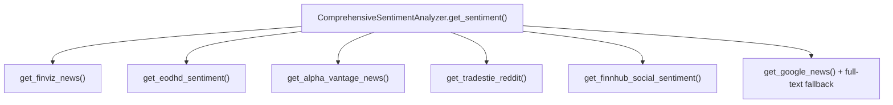
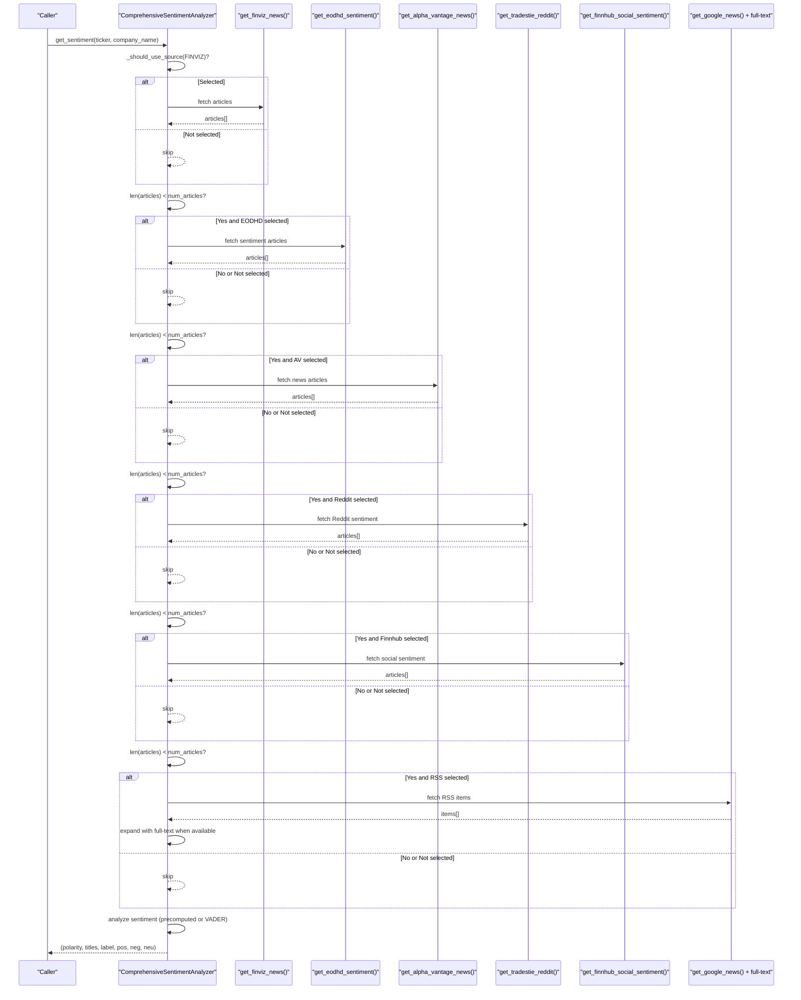

# Fallback Mechanisms

<cite>
**Referenced Files in This Document**
- [news_sentiment.py](file://news_sentiment.py)
- [test_fallback_mechanisms.py](file://tests/test_fallback_mechanisms.py)
- [selectable_sentiment_sources_demo.py](file://demos/selectable_sentiment_sources_demo.py)
</cite>

## Table of Contents
1. [Introduction](#introduction)
2. [Project Structure](#project-structure)
3. [Core Components](#core-components)
4. [Architecture Overview](#architecture-overview)
5. [Detailed Component Analysis](#detailed-component-analysis)
6. [Dependency Analysis](#dependency-analysis)
7. [Performance Considerations](#performance-considerations)
8. [Troubleshooting Guide](#troubleshooting-guide)
9. [Conclusion](#conclusion)

## Introduction
This document explains the fallback mechanisms implemented in the sentiment analysis pipeline. The system follows a strict priority order: Finviz (primary), EODHD API (secondary), Alpha Vantage (tertiary), Tradestie Reddit (optional), Finnhub Social (optional), and Google News RSS (last resort). The get_sentiment method aggregates articles from sources until the requested number is met, and it continues to the next source only when the target is not satisfied. Errors in one source do not prevent subsequent sources from being attempted. The _should_use_source method controls whether a given source is included in the pipeline based on user configuration.

## Project Structure
The fallback logic resides in the ComprehensiveSentimentAnalyzer class within the sentiment module. Tests validate the fallback chain and error handling behavior. Demos illustrate how to customize the set of sources used.

**Diagram sources**
- [news_sentiment.py](file://news_sentiment.py#L737-L800)

**Section sources**
- [news_sentiment.py](file://news_sentiment.py#L737-L800)
- [test_fallback_mechanisms.py](file://tests/test_fallback_mechanisms.py#L1-L296)

## Core Components
- Priority-driven fallback: The get_sentiment method iterates through sources in order and appends articles until the requested number is reached.
- Conditional progression: After each source, the method checks whether the number of collected articles meets the target; if not, it proceeds to the next source.
- Availability gating: The _should_use_source method ensures a source is only attempted if it is explicitly selected.
- Partial failure handling: Errors encountered in one source do not block subsequent sources from being attempted.
- Last-resort expansion: When the target is still not met, the system expands with Google News RSS and attempts to extract full article text for richer analysis.

**Section sources**
- [news_sentiment.py](file://news_sentiment.py#L737-L800)
- [news_sentiment.py](file://news_sentiment.py#L707-L712)

## Architecture Overview
The fallback pipeline is a deterministic, ordered sequence controlled by the get_sentiment method. It uses a simple but robust pattern: attempt a source, collect results, check the count, and continue if needed. The _should_use_source method acts as a filter to honor user-selected sources.

**Diagram sources**
- [news_sentiment.py](file://news_sentiment.py#L737-L800)

## Detailed Component Analysis

### Priority-based Fallback Sequence
- Primary: Finviz (fast and reliable)
- Secondary: EODHD API (pre-calculated sentiment)
- Tertiary: Alpha Vantage (real-time with full content)
- Optional: Tradestie Reddit (social sentiment)
- Optional: Finnhub Social (multi-source social mentions)
- Last resort: Google News RSS (wide coverage; expands with full-text extraction)

The method checks the number of collected articles after each source and only proceeds to the next when the target is not met. This ensures minimal over-fetching and predictable runtime.

**Section sources**
- [news_sentiment.py](file://news_sentiment.py#L737-L800)

### Conditional Logic Governing the Fallback
- After attempting Finviz, the method checks len(all_articles) < num_articles before proceeding to EODHD.
- After EODHD, it checks again before proceeding to Alpha Vantage.
- After Alpha Vantage, it checks before proceeding to Reddit.
- After Reddit, it checks before proceeding to Finnhub.
- After Finnhub, it checks before proceeding to Google News RSS.
- The Google News RSS step expands the list with full-text extraction when available.

These checks ensure that the pipeline stops early when the target is satisfied and avoids unnecessary network calls.

**Section sources**
- [news_sentiment.py](file://news_sentiment.py#L737-L800)

### Error Handling and Partial Failures
- Each source method catches exceptions internally and logs messages, returning empty lists when errors occur.
- Because errors are isolated to individual sources, a failure in one source does not prevent others from being attempted.
- Tests demonstrate graceful fallback even when earlier sources raise exceptions.

**Section sources**
- [news_sentiment.py](file://news_sentiment.py#L429-L467)
- [news_sentiment.py](file://news_sentiment.py#L492-L516)
- [news_sentiment.py](file://news_sentiment.py#L558-L581)
- [news_sentiment.py](file://news_sentiment.py#L590-L620)
- [news_sentiment.py](file://news_sentiment.py#L634-L665)
- [news_sentiment.py](file://news_sentiment.py#L398-L419)
- [test_fallback_mechanisms.py](file://tests/test_fallback_mechanisms.py#L198-L246)

### Role of _should_use_source
- Determines whether a specific source is included in the pipeline based on the selected_sources configuration.
- Supports both explicit selection and a catch-all sentinel to enable all sources.
- Ensures that disabled sources are skipped even if the target is not yet met.

**Section sources**
- [news_sentiment.py](file://news_sentiment.py#L707-L712)

### Data Integrity and Partial Results
- The system continues to analyze sentiment even if some sources fail or return fewer articles.
- When no articles are available, the neutral count is padded to meet the requested number for balanced reporting.
- Pre-computed sentiment scores from APIs are used directly to preserve accuracy and avoid re-analysis.

**Section sources**
- [news_sentiment.py](file://news_sentiment.py#L800-L895)

### Customizing the Fallback Sequence
- The order is fixed by the get_sentiment method. To change which sources participate, configure selected_sources during initialization.
- Demos show how to select only Finviz + FinVADER, only Google News RSS, or a custom pair like Finviz + EODHD.

**Section sources**
- [news_sentiment.py](file://news_sentiment.py#L737-L800)
- [selectable_sentiment_sources_demo.py](file://demos/selectable_sentiment_sources_demo.py#L67-L85)

### Timeout Values and Reliability
- Finviz and Google News RSS use shorter timeouts to improve responsiveness.
- EODHD, Alpha Vantage, Tradestie Reddit, and Finnhub Social use longer timeouts to accommodate slower APIs.
- These values balance reliability and latency; adjust them according to your environment and SLAs.

**Section sources**
- [news_sentiment.py](file://news_sentiment.py#L398-L419)
- [news_sentiment.py](file://news_sentiment.py#L429-L467)
- [news_sentiment.py](file://news_sentiment.py#L492-L516)
- [news_sentiment.py](file://news_sentiment.py#L558-L581)
- [news_sentiment.py](file://news_sentiment.py#L590-L620)
- [news_sentiment.py](file://news_sentiment.py#L634-L665)

## Dependency Analysis
The fallback logic depends on:
- The _should_use_source gate to filter sources.
- The get_sentiment method’s iteration and length checks.
- Individual source methods that encapsulate their own error handling and timeouts.

```mermaid
flowchart TD
Start(["Start get_sentiment"]) --> CheckCache["Check cache"]
CheckCache --> |Hit| ReturnCache["Return cached result"]
CheckCache --> |Miss| InitAccum["Initialize articles accumulator"]
InitAccum --> TryFinviz{"Selected?"}
TryFinviz --> |Yes| FetchFinviz["Fetch Finviz articles"]
TryFinviz --> |No| NextCheck1["Skip Finviz"]
FetchFinviz --> LenCheck1{"Articles < Target?"}
NextCheck1 --> LenCheck1
LenCheck1 --> |Yes| TryEODHD{"Selected?"}
LenCheck1 --> |No| TryEODHD
TryEODHD --> |Yes| FetchEODHD["Fetch EODHD articles"]
TryEODHD --> |No| NextCheck2["Skip EODHD"]
FetchEODHD --> LenCheck2{"Articles < Target?"}
NextCheck2 --> LenCheck2
LenCheck2 --> |Yes| TryAV{"Selected?"}
LenCheck2 --> |No| TryAV
TryAV --> |Yes| FetchAV["Fetch Alpha Vantage articles"]
TryAV --> |No| NextCheck3["Skip AV"]
FetchAV --> LenCheck3{"Articles < Target?"}
NextCheck3 --> LenCheck3
LenCheck3 --> |Yes| TryReddit{"Selected?"}
LenCheck3 --> |No| TryReddit
TryReddit --> |Yes| FetchReddit["Fetch Reddit articles"]
TryReddit --> |No| NextCheck4["Skip Reddit"]
FetchReddit --> LenCheck4{"Articles < Target?"}
NextCheck4 --> LenCheck4
LenCheck4 --> |Yes| TryFinnhub{"Selected?"}
LenCheck4 --> |No| TryFinnhub
TryFinnhub --> |Yes| FetchFinnhub["Fetch Finnhub articles"]
TryFinnhub --> |No| NextCheck5["Skip Finnhub"]
FetchFinnhub --> LenCheck5{"Articles < Target?"}
NextCheck5 --> LenCheck5
LenCheck5 --> |Yes| TryRSS{"Selected?"}
LenCheck5 --> |No| TryRSS
TryRSS --> |Yes| FetchRSS["Fetch Google News RSS<br/>Expand with full-text"]
TryRSS --> |No| NextCheck6["Skip RSS"]
FetchRSS --> Done["Proceed to sentiment analysis"]
NextCheck6 --> Done
Done --> Analyze["Analyze sentiment (precomputed or VADER)"]
Analyze --> Cache["Cache result"]
Cache --> End(["Return result"])
```

**Diagram sources**
- [news_sentiment.py](file://news_sentiment.py#L737-L800)

**Section sources**
- [news_sentiment.py](file://news_sentiment.py#L737-L800)

## Performance Considerations
- Shorter timeouts for Finviz and Google News RSS reduce latency for the primary path.
- Longer timeouts for APIs increase reliability but may increase tail latency.
- Early termination when the target is met minimizes unnecessary network calls.
- Caching reduces repeated computation for identical tickers.

[No sources needed since this section provides general guidance]

## Troubleshooting Guide
- If the target number of articles is not met, verify that sufficient sources are selected and that the target is reasonable for the chosen sources.
- If a source fails, confirm that the API key is configured (where applicable) and that network connectivity is available.
- To debug which sources were attempted, enable debug logging and review the printed source names during execution.
- Tests demonstrate that errors in earlier sources do not prevent later sources from being attempted.

**Section sources**
- [test_fallback_mechanisms.py](file://tests/test_fallback_mechanisms.py#L1-L296)

## Conclusion
The fallback mechanisms provide a robust, configurable, and resilient sentiment analysis pipeline. The fixed priority order ensures predictable behavior, while the _should_use_source gate allows users to tailor the pipeline to their needs. The conditional logic prevents unnecessary calls, and error isolation guarantees that partial failures do not compromise the entire workflow. With appropriate timeout tuning and caching, the system balances reliability and performance across diverse environments.