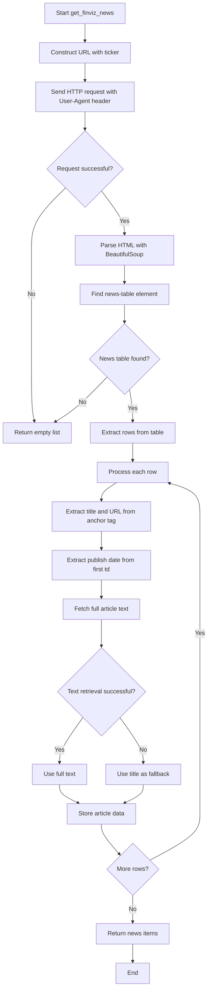
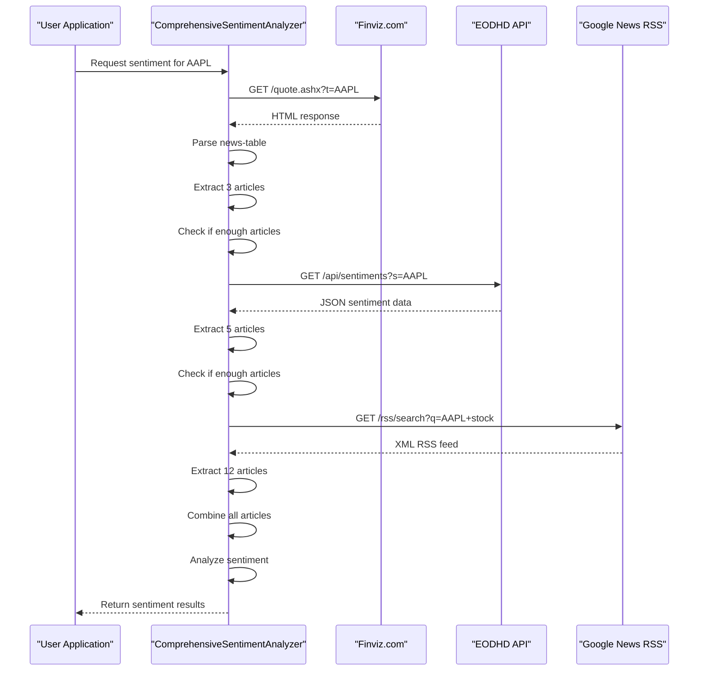

# Finviz Integration

<cite>
**Referenced Files in This Document**   
- [news_sentiment.py](file://news_sentiment.py)
- [tests/test_sentiment_sources.py](file://tests/test_sentiment_sources.py)
- [tests/test_helpers.py](file://tests/test_helpers.py)
</cite>

## Table of Contents
1. [Introduction](#introduction)
2. [Finviz News Scraping Implementation](#finviz-news-scraping-implementation)
3. [Error Handling and Fallback Mechanisms](#error-handling-and-fallback-mechanisms)
4. [Performance Optimization and Caching](#performance-optimization-and-caching)
5. [Troubleshooting Common Issues](#troubleshooting-common-issues)
6. [Conclusion](#conclusion)

## Introduction
The Finviz integration sub-feature provides a primary source for financial news headlines used in sentiment analysis. This documentation details the implementation of web scraping from Finviz using HTTP requests and BeautifulSoup parsing, focusing on the `get_finviz_news` method in the `ComprehensiveSentimentAnalyzer` class. The system is designed to extract news headlines, URLs, and publish dates from Finviz's stock quote pages, incorporating this information into comprehensive sentiment analysis. The integration includes robust error handling, fallback mechanisms, and performance optimizations to ensure reliable operation despite challenges such as rate limiting and HTML structure changes.

## Finviz News Scraping Implementation

The Finviz integration is implemented through the `get_finviz_news` method in the `ComprehensiveSentimentAnalyzer` class, which scrapes financial news headlines from Finviz using HTTP requests and BeautifulSoup parsing. The method constructs a URL using the stock ticker symbol in the format `https://finviz.com/quote.ashx?t={ticker}` and sends an HTTP GET request with a properly configured User-Agent header to avoid 403 Forbidden errors.

The implementation specifically targets the news table on Finviz's stock quote page, which typically has the ID `news-table`. After retrieving the page content, BeautifulSoup parses the HTML to locate this table and extract news items from its rows. For each row, the method extracts the news headline text and URL from the anchor tag (`<a>`) within the row. Additionally, it attempts to extract the publish date from the first table data cell (`<td>`) in the row, which often contains timestamp information.

A key feature of the implementation is the fallback mechanism for article text retrieval. The system attempts to fetch the full article text using the `newspaper3k` library through the `fetch_article_text` method. If this process fails, the system gracefully falls back to using the headline text as the content for sentiment analysis, ensuring that analysis can proceed even when full article retrieval is not possible.

The method incorporates error handling at multiple levels, using try-except blocks to handle potential issues during the scraping process. If an individual article cannot be processed due to parsing errors, the system continues with the next article rather than terminating the entire operation. This approach ensures that partial results are still returned even when some articles cannot be processed.

**Diagram sources**
- [news_sentiment.py](file://news_sentiment.py#L421-L467)

**Section sources**
- [news_sentiment.py](file://news_sentiment.py#L421-L467)

## Error Handling and Fallback Mechanisms

The Finviz integration includes comprehensive error handling and fallback mechanisms to ensure system reliability. The implementation uses try-except blocks throughout the scraping process to catch and handle various exceptions that may occur during HTTP requests, HTML parsing, and article text retrieval. This defensive programming approach prevents the entire sentiment analysis process from failing due to issues with a single news source.

When the Finviz scraping fails or returns insufficient articles, the system implements a fallback chain to alternative sources. The `get_sentiment` method in `ComprehensiveSentimentAnalyzer` first attempts to retrieve news from Finviz. If fewer articles than requested are obtained, it progressively falls back to other sources including EODHD API, Alpha Vantage News API, Tradestie Reddit API, Finnhub Social Sentiment API, and finally Google News RSS as a last resort.

The system handles network errors and API rate limits gracefully. When an HTTP request fails, the method catches the exception and continues processing, logging the error but not propagating it to terminate the analysis. For empty results from Finviz, the system returns an empty list rather than raising an exception, allowing the calling code to handle this scenario appropriately.

The fallback mechanism is particularly important given the potential for Finviz to change their HTML structure or implement anti-scraping measures. By having multiple alternative sources, the system maintains functionality even if the primary Finviz integration is temporarily disrupted. The testing framework includes specific tests for these fallback scenarios, verifying that when Finviz returns no results, the system correctly proceeds to the next available source.

**Diagram sources**
- [news_sentiment.py](file://news_sentiment.py#L737-L799)
- [tests/test_fallback_mechanisms.py](file://tests/test_fallback_mechanisms.py#L240-L296)

**Section sources**
- [news_sentiment.py](file://news_sentiment.py#L737-L799)
- [tests/test_fallback_mechanisms.py](file://tests/test_fallback_mechanisms.py#L240-L296)

## Performance Optimization and Caching

The Finviz integration incorporates several performance optimization strategies to enhance efficiency and reduce redundant operations. The most significant optimization is the use of caching to store sentiment analysis results, preventing the need to repeatedly scrape and analyze the same news articles.

The system implements a caching mechanism using Redis, though this feature is currently disabled in the codebase. When enabled, the cache stores sentiment analysis results keyed by the ticker symbol and a hash of the text content. This allows the system to quickly retrieve previously computed results rather than reprocessing the same data, significantly improving response times for frequently requested tickers.

To minimize the impact of network requests, the system limits the number of articles retrieved from each source based on the `num_articles` parameter. This prevents excessive scraping that could trigger rate limiting or IP blocking. The implementation also uses timeouts on HTTP requests (5 seconds for Finviz) to prevent the system from hanging indefinitely if a server is unresponsive.

The fallback mechanism itself serves as a performance optimization by providing alternative data sources when the primary source is slow or unavailable. Rather than waiting for a timeout from a non-responsive Finviz server, the system can quickly proceed to alternative sources, maintaining overall system responsiveness.

Additionally, the system optimizes the sentiment analysis process by using pre-computed sentiment scores when available from API sources like EODHD, avoiding the need to run local sentiment analysis on articles from these sources. This hybrid approach combines the speed of API-provided sentiment with the flexibility of local analysis for scraped content.

**Section sources**
- [news_sentiment.py](file://news_sentiment.py#L712-L735)

## Troubleshooting Common Issues

When troubleshooting issues with the Finviz integration, several common problems should be considered. The most frequent issue is receiving 403 Forbidden responses, which typically indicates that the User-Agent header is missing or insufficient. The implementation addresses this by including a comprehensive User-Agent string that mimics a real browser, but if Finviz updates their anti-bot measures, this header may need to be updated.

Another common issue is changes to Finviz's HTML structure, which can break the scraping logic. The current implementation relies on the presence of a table with ID `news-table` and specific patterns for extracting headlines and dates. If Finviz modifies their page layout, the selectors in the code will need to be updated accordingly. Monitoring the output logs for messages like "Found 0 articles on Finviz" can help identify when such structural changes have occurred.

Rate limiting and IP blocking are potential challenges when scraping Finviz at high frequencies. To mitigate this, the system should implement appropriate delays between requests when performing batch operations. The current implementation does not include explicit rate limiting, so external controls may be necessary when making frequent requests.

For debugging purposes, enabling detailed logging can provide insights into the scraping process. The system includes print statements that report the number of articles found on Finviz, which can help diagnose issues. Additionally, the test suite provides a valuable resource for troubleshooting, with mock responses that can be used to verify the parsing logic independently of the live website.

When full article text cannot be retrieved, the system automatically falls back to using the headline text, which is a designed feature rather than an error. However, if this fallback is occurring more frequently than expected, it may indicate issues with the `newspaper3k` library or connectivity problems with the article source websites.

**Section sources**
- [news_sentiment.py](file://news_sentiment.py#L421-L467)
- [tests/test_sentiment_sources.py](file://tests/test_sentiment_sources.py#L25-L52)

## Conclusion
The Finviz integration provides a robust foundation for financial news sentiment analysis, combining efficient web scraping with comprehensive error handling and fallback mechanisms. By extracting headlines, URLs, and publish dates from Finviz's news table and incorporating this data into sentiment analysis, the system delivers timely insights for stock prediction. The implementation demonstrates careful consideration of real-world challenges such as rate limiting, HTML structure changes, and network reliability, with appropriate safeguards to ensure consistent operation. Future enhancements could include more sophisticated rate limiting, enhanced caching strategies, and additional fallback sources to further improve reliability and performance.