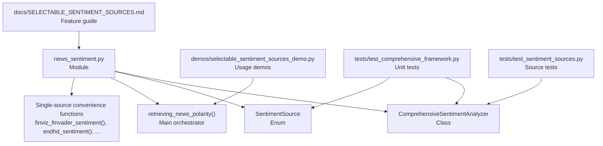
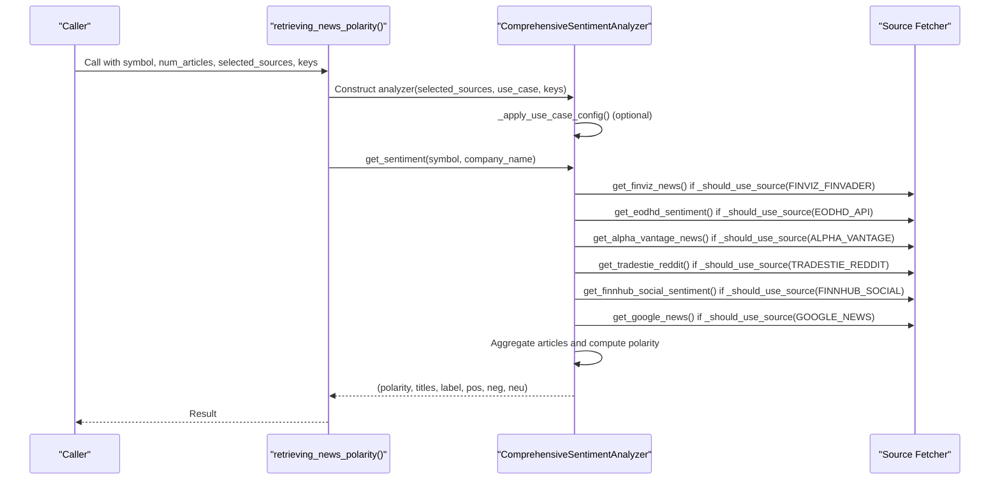
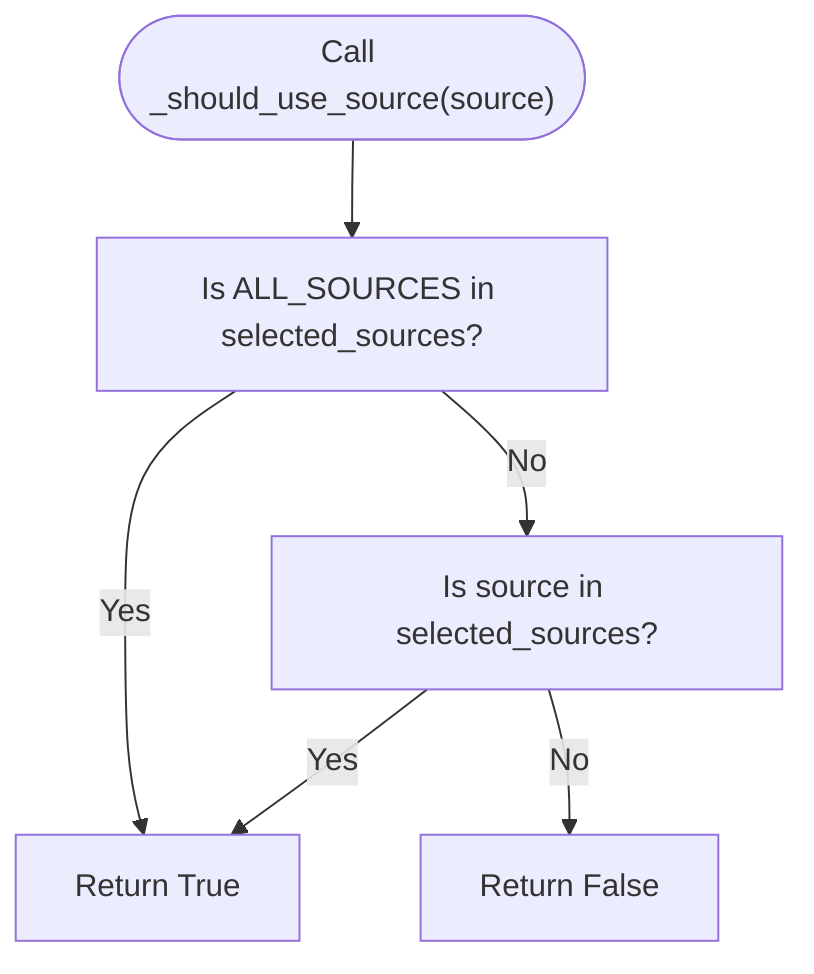
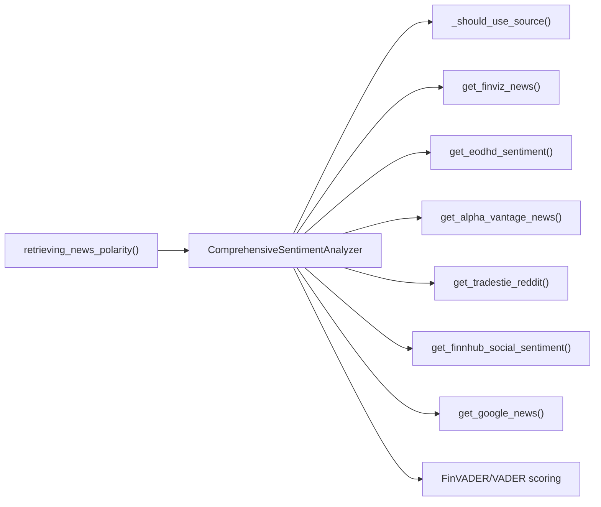

# Selectable Configurations

<cite>
**Referenced Files in This Document**
- [news_sentiment.py](file://news_sentiment.py)
- [SELECTABLE_SENTIMENT_SOURCES.md](file://docs/SELECTABLE_SENTIMENT_SOURCES.md)
- [selectable_sentiment_sources_demo.py](file://demos/selectable_sentiment_sources_demo.py)
- [test_comprehensive_framework.py](file://tests/test_comprehensive_framework.py)
- [test_sentiment_sources.py](file://tests/test_sentiment_sources.py)
- [README.md](file://README.md)
</cite>

## Table of Contents
1. [Introduction](#introduction)
2. [Project Structure](#project-structure)
3. [Core Components](#core-components)
4. [Architecture Overview](#architecture-overview)
5. [Detailed Component Analysis](#detailed-component-analysis)
6. [Dependency Analysis](#dependency-analysis)
7. [Performance Considerations](#performance-considerations)
8. [Troubleshooting Guide](#troubleshooting-guide)
9. [Conclusion](#conclusion)
10. [Appendices](#appendices)

## Introduction
This document explains the selectable configurations sub-feature that enables users to choose specific sentiment sources based on their needs. It focuses on:
- The SentimentSource enum and how selected_sources controls which sources participate in analysis
- The _should_use_source method that gates source activation during sentiment analysis
- Configuration options for enabling all sources or specific combinations and how this affects the analysis workflow
- Practical configuration scenarios and their impact on performance and accuracy
- Best practices for source selection based on data freshness, cost, and target audience

## Project Structure
The sentiment analysis feature lives primarily in the news_sentiment module. The selectable configuration is implemented through an enum of sources, a selection list, and a gating method that decides whether to fetch from a given source. Convenience functions and demos illustrate usage.

**Diagram sources**
- [news_sentiment.py](file://news_sentiment.py#L70-120)
- [news_sentiment.py](file://news_sentiment.py#L1163-L1241)
- [news_sentiment.py](file://news_sentiment.py#L1243-L1283)
- [SELECTABLE_SENTIMENT_SOURCES.md](file://docs/SELECTABLE_SENTIMENT_SOURCES.md#L1-L208)
- [selectable_sentiment_sources_demo.py](file://demos/selectable_sentiment_sources_demo.py#L1-L136)
- [test_comprehensive_framework.py](file://tests/test_comprehensive_framework.py#L240-L271)
- [test_sentiment_sources.py](file://tests/test_sentiment_sources.py#L1-L170)

**Section sources**
- [news_sentiment.py](file://news_sentiment.py#L70-120)
- [news_sentiment.py](file://news_sentiment.py#L1163-L1241)
- [news_sentiment.py](file://news_sentiment.py#L1243-L1283)
- [SELECTABLE_SENTIMENT_SOURCES.md](file://docs/SELECTABLE_SENTIMENT_SOURCES.md#L1-L208)
- [selectable_sentiment_sources_demo.py](file://demos/selectable_sentiment_sources_demo.py#L1-L136)
- [test_comprehensive_framework.py](file://tests/test_comprehensive_framework.py#L240-L271)
- [test_sentiment_sources.py](file://tests/test_sentiment_sources.py#L1-L170)

## Core Components
- SentimentSource enum: Defines all supported sources and a special ALL_SOURCES sentinel.
- selected_sources parameter: A list of SentimentSource values controlling which sources are used.
- _should_use_source(source): Predicate that returns True if a source should be activated based on selected_sources.
- get_sentiment(): Orchestrates fetching from sources in priority order and applies FinVADER/VADER scoring.
- retrieving_news_polarity(): Top-level orchestrator that constructs the analyzer and resolves company names.
- Single-source convenience functions: Helper functions that preset selected_sources for common use cases.

Key behaviors:
- Default behavior: selected_sources defaults to [ALL_SOURCES], enabling all sources in priority order.
- Explicit selection: Pass a list of specific sources to restrict analysis to those.
- API keys: Some sources require keys; missing keys cause graceful skipping of those sources.
- Fallback chain: Sources are attempted in priority order until sufficient articles are collected.

**Section sources**
- [news_sentiment.py](file://news_sentiment.py#L70-120)
- [news_sentiment.py](file://news_sentiment.py#L310-L380)
- [news_sentiment.py](file://news_sentiment.py#L707-L712)
- [news_sentiment.py](file://news_sentiment.py#L736-L895)
- [news_sentiment.py](file://news_sentiment.py#L1163-L1241)
- [news_sentiment.py](file://news_sentiment.py#L1243-L1283)

## Architecture Overview
The selectable configuration sits at the intersection of configuration, orchestration, and source execution. The analyzer’s constructor accepts selected_sources and applies use-case-specific defaults. The orchestrator get_sentiment() iterates through sources in priority order, gating each with _should_use_source().

**Diagram sources**
- [news_sentiment.py](file://news_sentiment.py#L1163-L1189)
- [news_sentiment.py](file://news_sentiment.py#L310-L380)
- [news_sentiment.py](file://news_sentiment.py#L736-L895)
- [news_sentiment.py](file://news_sentiment.py#L707-L712)

## Detailed Component Analysis

### SentimentSource Enum and selected_sources
- Enum defines all supported sources plus ALL_SOURCES.
- selected_sources defaults to [ALL_SOURCES] when not provided.
- selected_sources can be explicitly set to a list of specific sources.

Practical implications:
- Enabling only fast sources reduces latency.
- Disabling API sources avoids cost and rate-limit concerns.
- Restricting to domain-relevant sources improves accuracy for financial contexts.

**Section sources**
- [news_sentiment.py](file://news_sentiment.py#L70-120)
- [news_sentiment.py](file://news_sentiment.py#L310-L344)

### _should_use_source Method
- Returns True if ALL_SOURCES is present OR if the specific source is included in selected_sources.
- Used inside get_sentiment() to gate each source fetch.

**Diagram sources**
- [news_sentiment.py](file://news_sentiment.py#L707-L712)

**Section sources**
- [news_sentiment.py](file://news_sentiment.py#L707-L712)
- [test_comprehensive_framework.py](file://tests/test_comprehensive_framework.py#L245-L259)

### get_sentiment() Workflow and Priority Order
- Priority order: Finviz + FinVADER, EODHD API, Alpha Vantage, Tradestie Reddit, Finnhub Social, Google News RSS.
- For each source, if _should_use_source() is True and the article count is below the target, fetch and append articles.
- If still short, continue to the next source.
- After collecting articles, compute sentiment using FinVADER (when available) or standard VADER, then derive polarity and counts.

```mermaid
flowchart TD
S(["Start get_sentiment"]) --> CacheCheck["Check cache"]
CacheCheck --> |Hit| ReturnCache["Return cached result"]
CacheCheck --> |Miss| Init["Initialize all_articles"]
Init --> Finviz{"Should use Finviz + FinVADER?"}
Finviz --> |Yes| FetchFinviz["Fetch Finviz articles"] --> Append1["Extend all_articles"] --> Next1{"Article count < target?"}
Finviz --> |No| Next1
Next1 --> |Yes| EODHD{"Should use EODHD API?"}
EODHD --> |Yes| FetchEODHD["Fetch EODHD articles"] --> Append2["Extend all_articles"] --> Next2{"Article count < target?"}
EODHD --> |No| Next2
Next2 --> |Yes| AV{"Should use Alpha Vantage?"}
AV --> |Yes| FetchAV["Fetch Alpha Vantage articles"] --> Append3["Extend all_articles"] --> Next3{"Article count < target?"}
AV --> |No| Next3
Next3 --> |Yes| Reddit{"Should use Tradestie Reddit?"}
Reddit --> |Yes| FetchReddit["Fetch Reddit articles"] --> Append4["Extend all_articles"] --> Next4{"Article count < target?"}
Reddit --> |No| Next4
Next4 --> |Yes| Finnhub{"Should use Finnhub Social?"}
Finnhub --> |Yes| FetchFinnhub["Fetch Finnhub social mentions"] --> Append5["Extend all_articles"] --> Next5{"Article count < target?"}
Finnhub --> |No| Next5
Next5 --> |Yes| Google{"Should use Google News RSS?"}
Google --> |Yes| FetchGoogle["Fetch RSS articles"] --> FullText["Try to fetch full text"] --> Append6["Extend all_articles"] --> Next6{"Article count < target?"}
Google --> |No| Next6
Next6 --> |Yes| Continue["Continue to next source"] --> Next1
Next6 --> |No| Analyze["Compute FinVADER/VADER scores"]
Analyze --> Aggregate["Aggregate polarity and counts"]
Aggregate --> CacheSet["Cache result"]
CacheSet --> Return(["Return (polarity, titles, label, pos, neg, neu)"])
```

**Diagram sources**
- [news_sentiment.py](file://news_sentiment.py#L736-L895)

**Section sources**
- [news_sentiment.py](file://news_sentiment.py#L736-L895)

### Single-Source Convenience Functions
- finviz_finvader_sentiment(), eodhd_sentiment(), alpha_vantage_sentiment(), reddit_sentiment(), social_sentiment(), google_news_sentiment() preset selected_sources to a single source.
- They also accept API keys where applicable.

These functions demonstrate the simplest configuration paths and are useful for targeted analysis or demos.

**Section sources**
- [news_sentiment.py](file://news_sentiment.py#L1191-L1241)
- [news_sentiment.py](file://news_sentiment.py#L1243-L1283)

### Use Case-Based Configuration
- UseCase enum drives automatic configuration of num_articles and selected_sources for typical scenarios (e.g., HFT, retail, quant, academic, fintech).
- When use_case is provided, _apply_use_case_config() adjusts analyzer settings accordingly.

This complements manual selected_sources by aligning configuration with typical workloads.

**Section sources**
- [news_sentiment.py](file://news_sentiment.py#L89-L118)
- [news_sentiment.py](file://news_sentiment.py#L345-L378)

### Demo and Documentation References
- The demo script showcases:
  - Default behavior (all sources)
  - Single-source usage
  - Custom selection
  - Graceful skipping when API keys are absent
- The feature guide documents available sources, usage options, benefits, priority order, and examples by use case.

**Section sources**
- [selectable_sentiment_sources_demo.py](file://demos/selectable_sentiment_sources_demo.py#L1-L136)
- [SELECTABLE_SENTIMENT_SOURCES.md](file://docs/SELECTABLE_SENTIMENT_SOURCES.md#L1-L208)

## Dependency Analysis
- Internal dependencies:
  - retrieving_news_polarity() depends on ComprehensiveSentimentAnalyzer and company name resolution.
  - Analyzer depends on _should_use_source() and the source fetchers.
  - Source fetchers depend on external APIs or RSS feeds and may require API keys.
- External dependencies:
  - Requests, BeautifulSoup, newspaper3k, NLTK VADER, and optional packages (e.g., newsapi, tenacity).
- Coupling:
  - Analyzer is moderately coupled to source fetchers; coupling could be reduced by an interface abstraction for sources.
- Cohesion:
  - Analyzer encapsulates configuration, orchestration, and scoring, maintaining good cohesion around sentiment analysis.

**Diagram sources**
- [news_sentiment.py](file://news_sentiment.py#L1163-L1189)
- [news_sentiment.py](file://news_sentiment.py#L310-L380)
- [news_sentiment.py](file://news_sentiment.py#L707-L712)
- [news_sentiment.py](file://news_sentiment.py#L736-L895)

**Section sources**
- [news_sentiment.py](file://news_sentiment.py#L1163-L1189)
- [news_sentiment.py](file://news_sentiment.py#L310-L380)
- [news_sentiment.py](file://news_sentiment.py#L707-L712)
- [news_sentiment.py](file://news_sentiment.py#L736-L895)

## Performance Considerations
- Fastest path: Use Finviz + FinVADER alone for minimal latency and no API costs.
- Cost control: Disable premium API sources or rely on free fallbacks to reduce expenses.
- Throughput: RSS and scraping are generally faster than API calls; batching and caching help.
- Accuracy vs. speed: Premium APIs often provide richer content and precomputed scores, potentially improving accuracy at the cost of latency and cost.
- Practical tips:
  - For high-frequency trading, prefer Finviz + FinVADER with lower num_articles.
  - For retail apps, combine Finviz + Reddit for social context.
  - For professional analysis, include premium APIs when budget allows.

[No sources needed since this section provides general guidance]

## Troubleshooting Guide
Common issues and resolutions:
- Missing API keys: Some sources skip gracefully when keys are absent. Verify keys and re-run.
- No articles found: The system pads neutral counts when no articles are available; adjust selected_sources or increase num_articles.
- Slow performance: Narrow down selected_sources to faster sources (e.g., Finviz + FinVADER).
- Unexpected results: Confirm the priority order and that desired sources are included in selected_sources.

Relevant behaviors:
- API sources gracefully skip when keys are missing.
- The analyzer continues with remaining sources when some fail.
- Logging indicates which sources are being used.

**Section sources**
- [news_sentiment.py](file://news_sentiment.py#L480-L517)
- [news_sentiment.py](file://news_sentiment.py#L518-L581)
- [news_sentiment.py](file://news_sentiment.py#L582-L665)
- [news_sentiment.py](file://news_sentiment.py#L736-L895)

## Conclusion
The selectable configurations feature gives users fine-grained control over sentiment analysis by letting them choose which sources to use. The _should_use_source() predicate ensures only selected sources are executed, while the priority-driven workflow guarantees efficient and resilient operation. By combining explicit selection with use-case presets, teams can optimize for performance, cost, and accuracy tailored to their target audience and requirements.

[No sources needed since this section summarizes without analyzing specific files]

## Appendices

### Configuration Scenarios and Guidance
- Quick analysis: Use Finviz + FinVADER alone for fastest results.
- Social sentiment focus: Combine Finviz + Reddit/WallStreetBets for retail-oriented insights.
- Professional analysis: Enable premium APIs (e.g., EODHD, Alpha Vantage, Finnhub) for richer content and precomputed scores.
- Cost-conscious: Prefer free sources (Finviz + RSS) or disable paid APIs.
- Data freshness: Use Finviz for near-real-time headlines; RSS as a last resort; premium APIs for richer, possibly delayed, content.

Best practices:
- Align selected_sources with the target audience (e.g., retail vs. institutional).
- Consider data freshness requirements; Finviz and premium APIs typically offer more timely content.
- Budget constraints: Disable premium APIs or rely on free fallbacks.
- Accuracy: Include premium APIs when available; otherwise, FinVADER/VADER remains robust.

**Section sources**
- [SELECTABLE_SENTIMENT_SOURCES.md](file://docs/SELECTABLE_SENTIMENT_SOURCES.md#L1-L208)
- [news_sentiment.py](file://news_sentiment.py#L1163-L1241)
- [news_sentiment.py](file://news_sentiment.py#L1243-L1283)

### Related Project Context
- The sentiment analysis module is part of a larger system integrating prediction models and portfolio management.

**Section sources**
- [README.md](file://README.md#L1-L202)