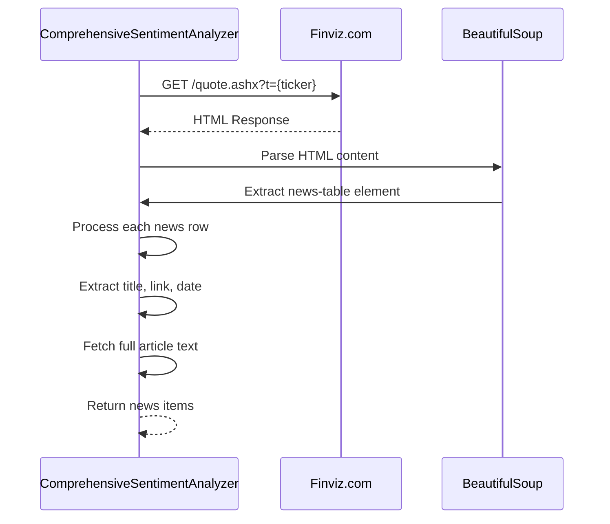
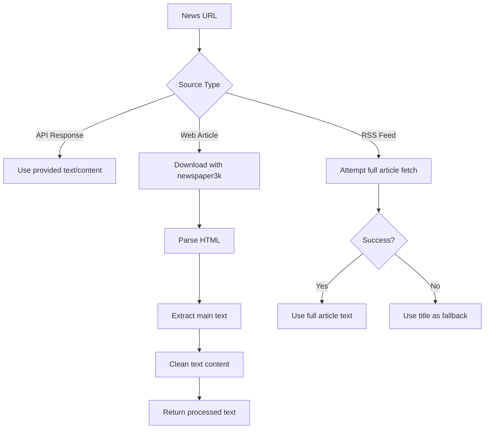
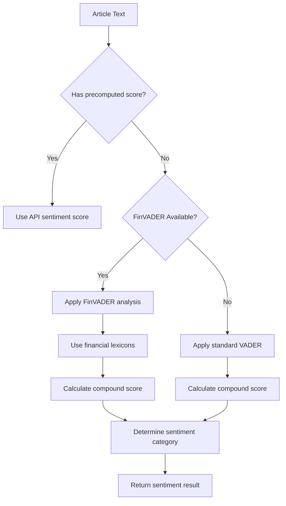
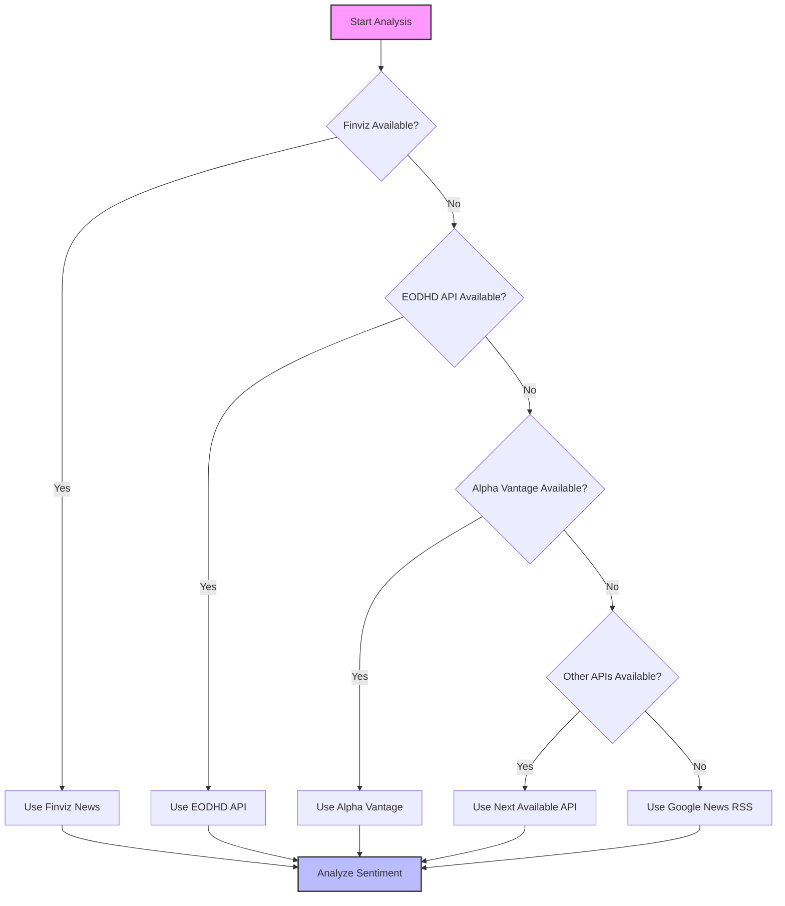
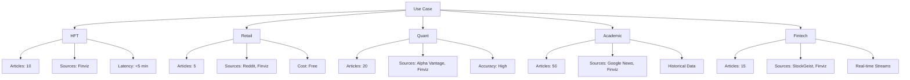
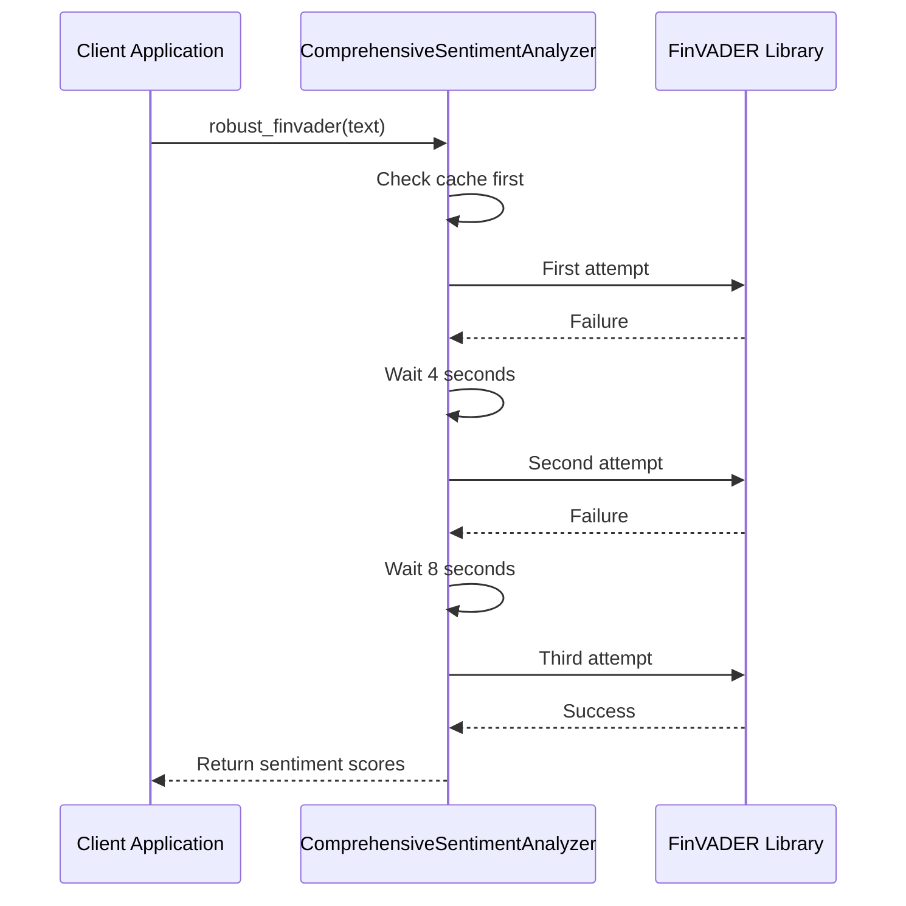
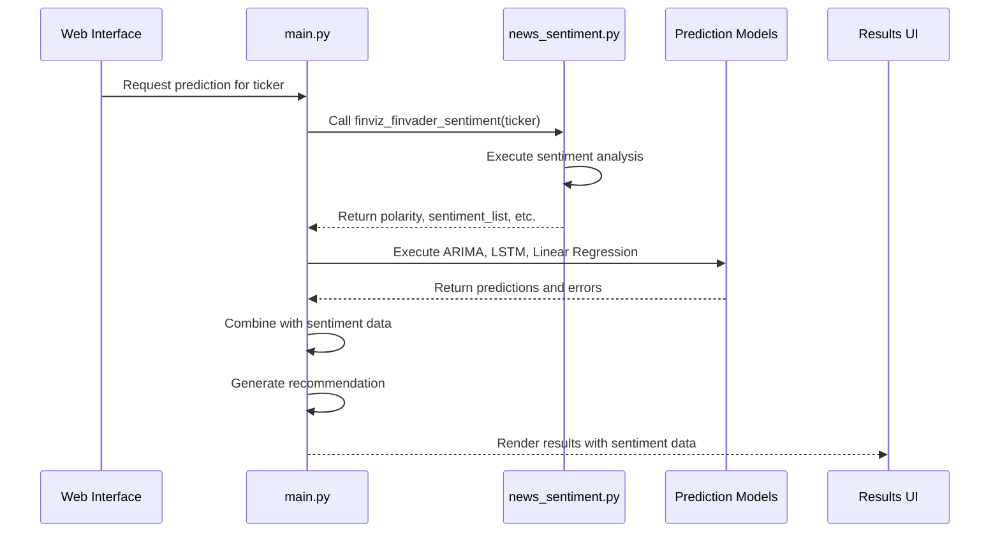

# Sentiment Analysis

<cite>
**Referenced Files in This Document**   
- [news_sentiment.py](file://news_sentiment.py)
- [main.py](file://main.py)
- [demos/selectable_sentiment_sources_demo.py](file://demos/selectable_sentiment_sources_demo.py)
- [demos/use_case_sentiment_demo.py](file://demos/use_case_sentiment_demo.py)
- [docs/SELECTABLE_SENTIMENT_SOURCES.md](file://docs/SELECTABLE_SENTIMENT_SOURCES.md)
- [docs/USE_CASE_SENTIMENT_ANALYSIS.md](file://docs/USE_CASE_SENTIMENT_ANALYSIS.md)
- [docs/ADVANCED_FEATURES.md](file://docs/ADVANCED_FEATURES.md)
- [docs/ERROR_HANDLING_MONITORING.md](file://docs/ERROR_HANDLING_MONITORING.md)
</cite>

## Table of Contents
1. [Introduction](#introduction)
2. [Architecture Overview](#architecture-overview)
3. [Core Components](#core-components)
4. [Sentiment Source Integration](#sentiment-source-integration)
5. [Text Preprocessing Pipeline](#text-preprocessing-pipeline)
6. [Sentiment Scoring and Aggregation](#sentiment-scoring-and-aggregation)
7. [Fallback Mechanisms](#fallback-mechanisms)
8. [Selectable Sentiment Sources](#selectable-sentiment-sources)
9. [Use Case Configurations](#use-case-configurations)
10. [Error Handling and Monitoring](#error-handling-and-monitoring)
11. [Integration with Prediction Engine](#integration-with-prediction-engine)
12. [Configuration and Customization](#configuration-and-customization)

## Introduction

The Sentiment Analysis sub-feature provides a comprehensive system for analyzing financial sentiment from multiple news sources and social media platforms. The system integrates Finviz scraping with financial sentiment scoring, supports alternative news sources like Alpha Vantage and EODHD API, and implements robust fallback mechanisms when primary sources fail.

The architecture supports selectable sentiment sources that can be configured for different use cases including high-frequency trading (HFT), retail applications, academic research, and fintech startups. The system processes text through a sophisticated pipeline that normalizes sentiment scores and feeds them into the prediction engine to inform trading recommendations.

Key features include asynchronous requests, comprehensive error handling, rate limiting management, HTML parsing with htmldate, and sentiment bias analysis across sources. The system is designed to be both flexible and resilient, allowing users to configure source priorities and add new sentiment providers as needed.

## Architecture Overview

The sentiment analysis system follows a modular architecture with clearly defined components for source integration, text processing, sentiment scoring, and result aggregation. The system prioritizes performance and reliability while maintaining flexibility for different use cases.

```mermaid
graph TD
A[Sentiment Analysis System] --> B[Source Selection]
B --> C[Primary: Finviz Scraping]
B --> D[Fallback: EODHD API]
B --> E[Alternative: Alpha Vantage]
B --> F[Social: Reddit/WSB]
B --> G[Last Resort: Google News RSS]
A --> H[Text Preprocessing]
H --> I[HTML Parsing]
H --> J[Article Extraction]
H --> K[Date Extraction]
A --> L[Sentiment Scoring]
L --> M[FinVADER Analysis]
L --> N[VADER Fallback]
L --> O[API Pre-calculated Scores]
A --> P[Aggregation & Normalization]
P --> Q[Weighted Scoring]
P --> R[Distribution Analysis]
P --> S[Cache Storage]
A --> T[Output]
T --> U[Polarity Score]
T --> V[Sentiment Label]
T --> W[Article List]
T --> X[Chart Visualization]
style A fill:#4B73B1,stroke:#333,stroke-width:2px
style T fill:#2ecc71,stroke:#333,stroke-width:2px
```



**Diagram sources**
- [news_sentiment.py](file://news_sentiment.py#L311-L895)

## Core Components

The sentiment analysis system is built around the ComprehensiveSentimentAnalyzer class, which orchestrates the entire sentiment analysis workflow. The system uses a priority-based approach to source selection, starting with the fastest and most reliable sources and falling back to alternatives when needed.

The text preprocessing pipeline extracts full article content using newspaper3k, with fallback to headline text when full content cannot be retrieved. Sentiment scoring is performed using FinVADER when available, with standard VADER as a fallback. The system also supports pre-calculated sentiment scores from APIs like EODHD and Alpha Vantage.

Results are aggregated and normalized to produce a global polarity score, sentiment label, and distribution metrics. The system includes built-in chart generation and caching mechanisms to improve performance and user experience.

**Section sources**
- [news_sentiment.py](file://news_sentiment.py#L311-L895)

## Sentiment Source Integration

The system integrates multiple sentiment sources with a clear priority hierarchy. The primary source is Finviz, which is scraped using BeautifulSoup for fast and reliable headline extraction. When Finviz data is insufficient, the system falls back to API-based sources and finally to RSS feeds.

### Finviz Scraping

Finviz serves as the primary news source due to its speed and reliability. The system scrapes the Finviz quote page to extract news headlines, URLs, and publication dates. The scraping process uses a proper User-Agent header to avoid 403 Forbidden errors and parses the HTML content to extract news items from the 'news-table' element.



**Diagram sources**
- [news_sentiment.py](file://news_sentiment.py#L421-L467)

### Alternative News Sources

The system supports several alternative news sources through API integration:

- **EODHD API**: Provides pre-calculated sentiment scores and news articles
- **Alpha Vantage**: Offers real-time news and sentiment data with full article text
- **Finnhub Social Sentiment**: Aggregates sentiment from Reddit, Twitter, and other social platforms
- **Tradestie Reddit**: Specializes in WallStreetBets sentiment analysis
- **StockGeist.ai**: Provides real-time streaming sentiment data

These sources are integrated with proper API key handling and graceful degradation when keys are not provided or APIs are unavailable.

**Section sources**
- [news_sentiment.py](file://news_sentiment.py#L480-L706)

## Text Preprocessing Pipeline

The text preprocessing pipeline ensures high-quality input for sentiment analysis by extracting and cleaning content from various sources. The pipeline handles both structured API responses and unstructured web content.

### Article Extraction

The system uses newspaper3k to extract full article content from news URLs. This library automatically downloads, parses, and extracts the main text content while removing navigation elements, advertisements, and other noise.



**Diagram sources**
- [news_sentiment.py](file://news_sentiment.py#L380-L392)

### HTML and Date Processing

The system uses htmldate to extract publication dates from article pages, providing more accurate temporal context for sentiment analysis. This is particularly important for time-series analysis and trend detection.

The HTML parsing process handles various edge cases including relative URLs, duplicate links, and malformed HTML. The system normalizes URLs to ensure they are complete and accessible.

**Section sources**
- [news_sentiment.py](file://news_sentiment.py#L59-L65)

## Sentiment Scoring and Aggregation

The sentiment scoring system combines multiple approaches to provide accurate financial sentiment analysis. The system uses FinVADER when available, with standard VADER as a fallback, and can incorporate pre-calculated scores from external APIs.

### Scoring Logic

The sentiment analysis process follows a hierarchical approach:

1. Check for pre-calculated sentiment scores from APIs
2. Use FinVADER with financial lexicons for enhanced accuracy
3. Fall back to standard VADER when FinVADER is unavailable
4. Apply consistent thresholds for positive, negative, and neutral classification



**Diagram sources**
- [news_sentiment.py](file://news_sentiment.py#L810-L858)

### Aggregation Methods

The system aggregates sentiment scores across multiple articles to produce a global polarity score. The aggregation process includes:

- Weighted averaging of compound scores
- Counting positive, negative, and neutral articles
- Calculating distribution statistics
- Generating sentiment labels based on thresholds

The global polarity is calculated as the mean of all compound scores, with articles below -0.05 classified as negative, above 0.05 as positive, and between as neutral.

**Section sources**
- [news_sentiment.py](file://news_sentiment.py#L860-L882)

## Fallback Mechanisms

The system implements a robust fallback chain to ensure sentiment analysis can proceed even when primary sources are unavailable. The fallback mechanism follows a priority order based on speed, reliability, and cost.

### Fallback Chain

The sentiment analysis system uses the following priority order for sources:

1. Finviz + FinVADER (Primary)
2. EODHD API (API Fallback)
3. Alpha Vantage News & Sentiments API
4. Tradestie WallStreetBets API
5. Finnhub Social Sentiment API
6. StockGeist.ai
7. Google News RSS (Last Resort)



**Diagram sources**
- [news_sentiment.py](file://news_sentiment.py#L747-L799)

### Error Handling

The system includes comprehensive error handling at multiple levels:

- Network request failures with retry mechanisms
- HTML parsing errors with graceful degradation
- Missing content with title-based fallback
- API key validation with informative messages
- Empty result sets with appropriate defaults

The error handling ensures the system can continue processing even when individual components fail.

**Section sources**
- [news_sentiment.py](file://news_sentiment.py#L464-L466)

## Selectable Sentiment Sources

The system provides flexible source selection capabilities, allowing users to choose specific sentiment sources based on their needs. This feature enables optimization for performance, cost, and use case requirements.

### Source Selection Options

Users can select sentiment sources through several methods:

1. **Default behavior**: Uses all available sources in priority order
2. **Single source functions**: Convenience functions for specific sources
3. **Custom selection**: Explicit selection of multiple sources
4. **Use case configurations**: Pre-configured settings for specific scenarios

```python
# Use all sources (default)
polarity, titles, label, pos, neg, neu = retrieving_news_polarity("AAPL", 5)

# Use only Finviz + FinVADER
polarity, titles, label, pos, neg, neu = finviz_finvader_sentiment("AAPL", 5)

# Use only Google News RSS
polarity, titles, label, pos, neg, neu = google_news_sentiment("AAPL", 5)

# Custom selection of sources
selected_sources = [SentimentSource.FINVIZ_FINVADER, SentimentSource.GOOGLE_NEWS]
polarity, titles, label, pos, neg, neu = retrieving_news_polarity("AAPL", 5, selected_sources=selected_sources)
```

**Section sources**
- [demos/selectable_sentiment_sources_demo.py](file://demos/selectable_sentiment_sources_demo.py#L22-L135)

## Use Case Configurations

The system includes pre-configured settings for different use cases, optimizing the sentiment analysis process for specific requirements and constraints.

### Use Case Enum

The system defines use cases through the UseCase enum:

```python
class UseCase(Enum):
    HIGH_FREQUENCY_TRADING = "hft"
    RETAIL_TRADING_APPS = "retail"
    QUANT_HEDGE_FUNDS = "quant"
    ACADEMIC_RESEARCH = "academic"
    FINTECH_STARTUPS = "fintech"
```

### Configuration Profiles

Each use case has specific configuration parameters:



**Diagram sources**
- [news_sentiment.py](file://news_sentiment.py#L88-L94)
- [docs/USE_CASE_SENTIMENT_ANALYSIS.md](file://docs/USE_CASE_SENTIMENT_ANALYSIS.md#L112-L117)

## Error Handling and Monitoring

The system implements comprehensive error handling and monitoring features to ensure reliability and provide insights into system performance.

### Retry Mechanisms

For production-grade reliability, the system uses tenacity for retry mechanisms when FinVADER is available:



**Diagram sources**
- [docs/ERROR_HANDLING_MONITORING.md](file://docs/ERROR_HANDLING_MONITORING.md#L9-L28)

### Monitoring Features

The system includes monitoring capabilities to track sentiment distribution and system performance:

- Mean and standard deviation of sentiment scores
- Count of extreme sentiments (abs(score) > 0.5)
- Range of compound scores
- Detailed logging of processing steps

These metrics help identify potential issues with sentiment bias, data quality, or processing performance.

**Section sources**
- [news_sentiment.py](file://news_sentiment.py#L914-L953)

## Integration with Prediction Engine

The sentiment analysis system is tightly integrated with the stock prediction engine, providing sentiment data that informs trading recommendations.

### Integration Flow

The sentiment analysis results are incorporated into the prediction workflow as follows:



**Diagram sources**
- [main.py](file://main.py#L934-L959)

### Recommendation Logic

The sentiment polarity is used in the recommending function to generate BUY/SELL/NEUTRAL recommendations based on the combination of technical analysis predictions and sentiment analysis:

```python
# In main.py
polarity, sentiment_list, sentiment_pol, pos, neg, neutral = finviz_finvader_sentiment(quote)
idea, decision = recommending(df, polarity, today_stock, mean)
```

The sentiment analysis provides a crucial input that complements the technical analysis models, creating a more comprehensive prediction system.

**Section sources**
- [main.py](file://main.py#L944-L946)

## Configuration and Customization

The system provides extensive configuration options to customize behavior for different environments and requirements.

### Configuration Parameters

Key configuration parameters include:

- **num_articles**: Number of articles to process (varies by use case)
- **selected_sources**: Specific sentiment sources to use
- **use_case**: Pre-configured settings for specific scenarios
- **API keys**: For premium data sources (EODHD, Alpha Vantage, etc.)
- **Redis caching**: Optional caching for improved performance

### Adding New Providers

The modular architecture makes it relatively straightforward to add new sentiment providers:

1. Implement a new method in ComprehensiveSentimentAnalyzer
2. Add the source to the SentimentSource enum
3. Update the source selection logic
4. Implement error handling and fallback mechanisms
5. Add testing and documentation

The system's design encourages extensibility while maintaining consistency in the output format and processing pipeline.

**Section sources**
- [news_sentiment.py](file://news_sentiment.py#L77-L86)
- [news_sentiment.py](file://news_sentiment.py#L311-L320)