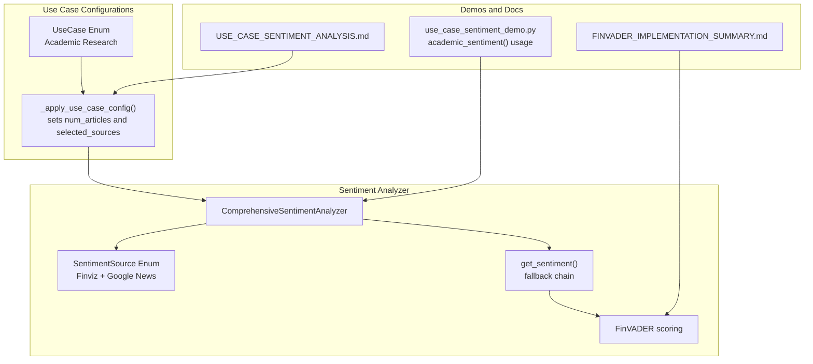
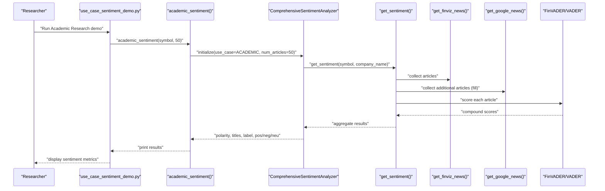
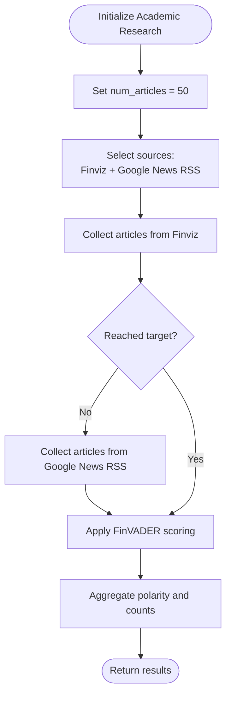
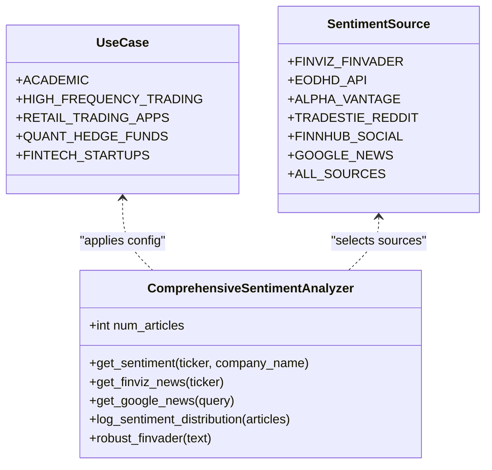
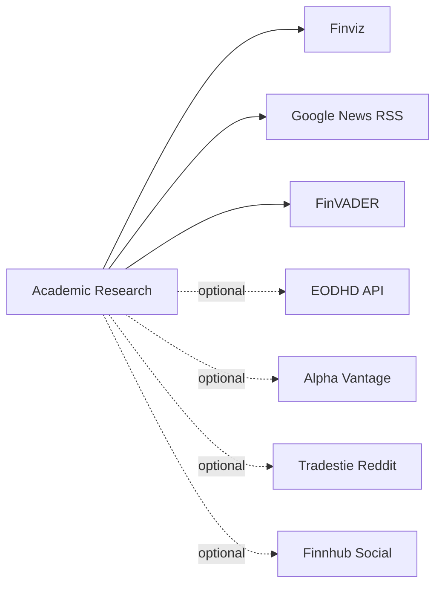

# Academic Research

<cite>
**Referenced Files in This Document**
- [news_sentiment.py](file://news_sentiment.py)
- [demos/use_case_sentiment_demo.py](file://demos/use_case_sentiment_demo.py)
- [docs/USE_CASE_SENTIMENT_ANALYSIS.md](file://docs/USE_CASE_SENTIMENT_ANALYSIS.md)
- [docs/FINVADER_IMPLEMENTATION_SUMMARY.md](file://docs/FINVADER_IMPLEMENTATION_SUMMARY.md)
- [requirements.txt](file://requirements.txt)
- [tests/test_comprehensive_framework.py](file://tests/test_comprehensive_framework.py)
</cite>

## Table of Contents
1. [Introduction](#introduction)
2. [Project Structure](#project-structure)
3. [Core Components](#core-components)
4. [Architecture Overview](#architecture-overview)
5. [Detailed Component Analysis](#detailed-component-analysis)
6. [Dependency Analysis](#dependency-analysis)
7. [Performance Considerations](#performance-considerations)
8. [Troubleshooting Guide](#troubleshooting-guide)
9. [Conclusion](#conclusion)
10. [Appendices](#appendices)

## Introduction
This document explains the Academic Research use case configuration optimized for historical depth and reproducible results using free data sources. It focuses on a setup that prioritizes Google News RSS and Finviz with FinVADER sentiment analysis, processing 50 articles to ensure comprehensive data coverage. The configuration enables long-term sentiment trend analysis and supports publishing research papers on social media’s predictive power. Guidance is provided for longitudinal studies and methodological rigor in financial research, including initialization examples and best practices.

## Project Structure
The Academic Research configuration is implemented as part of the sentiment analysis module and exposed via convenience functions. The module organizes:
- Use-case-aware configuration via a dedicated enum and analyzer
- A flexible fallback chain for news sources
- FinVADER-based sentiment scoring with robust fallbacks
- Batch processing and monitoring helpers suitable for academic backtesting

**Diagram sources**
- [news_sentiment.py](file://news_sentiment.py#L77-L118)
- [news_sentiment.py](file://news_sentiment.py#L346-L390)
- [news_sentiment.py](file://news_sentiment.py#L737-L800)
- [news_sentiment.py](file://news_sentiment.py#L800-L895)
- [demos/use_case_sentiment_demo.py](file://demos/use_case_sentiment_demo.py#L74-L91)
- [docs/USE_CASE_SENTIMENT_ANALYSIS.md](file://docs/USE_CASE_SENTIMENT_ANALYSIS.md#L65-L84)
- [docs/FINVADER_IMPLEMENTATION_SUMMARY.md](file://docs/FINVADER_IMPLEMENTATION_SUMMARY.md#L1-L52)

**Section sources**
- [news_sentiment.py](file://news_sentiment.py#L77-L118)
- [news_sentiment.py](file://news_sentiment.py#L346-L390)
- [news_sentiment.py](file://news_sentiment.py#L737-L800)
- [news_sentiment.py](file://news_sentiment.py#L800-L895)
- [demos/use_case_sentiment_demo.py](file://demos/use_case_sentiment_demo.py#L74-L91)
- [docs/USE_CASE_SENTIMENT_ANALYSIS.md](file://docs/USE_CASE_SENTIMENT_ANALYSIS.md#L65-L84)
- [docs/FINVADER_IMPLEMENTATION_SUMMARY.md](file://docs/FINVADER_IMPLEMENTATION_SUMMARY.md#L1-L52)

## Core Components
- UseCase and SentimentSource enums define the configuration surface for each use case and available sources.
- Academic Research sets:
  - num_articles to 50 for statistical robustness
  - selected_sources to Finviz + Google News RSS
- The analyzer’s get_sentiment method implements a deterministic fallback chain:
  - Finviz (primary)
  - EODHD API (fallback)
  - Alpha Vantage (fallback)
  - Tradestie Reddit (fallback)
  - Finnhub Social (fallback)
  - Google News RSS (last resort)
- FinVADER sentiment scoring is applied when available; otherwise standard VADER is used.

Key implementation references:
- Use case configuration application: [news_sentiment.py](file://news_sentiment.py#L346-L390)
- Fallback chain and article collection: [news_sentiment.py](file://news_sentiment.py#L737-L800)
- FinVADER vs VADER scoring: [news_sentiment.py](file://news_sentiment.py#L800-L895)

**Section sources**
- [news_sentiment.py](file://news_sentiment.py#L77-L118)
- [news_sentiment.py](file://news_sentiment.py#L346-L390)
- [news_sentiment.py](file://news_sentiment.py#L737-L800)
- [news_sentiment.py](file://news_sentiment.py#L800-L895)

## Architecture Overview
The Academic Research configuration follows a layered approach:
- Top-level convenience function academic_sentiment initializes the analyzer with use_case=ACADEMIC and num_articles=50.
- The analyzer applies use-case-specific defaults and then executes get_sentiment.
- get_sentiment collects articles from Finviz and Google News RSS, then applies FinVADER scoring.
- Results include polarity, titles, label, and counts of positive/negative/neutral sentiments.

**Diagram sources**
- [demos/use_case_sentiment_demo.py](file://demos/use_case_sentiment_demo.py#L74-L91)
- [news_sentiment.py](file://news_sentiment.py#L1269-L1275)
- [news_sentiment.py](file://news_sentiment.py#L346-L390)
- [news_sentiment.py](file://news_sentiment.py#L737-L800)
- [news_sentiment.py](file://news_sentiment.py#L800-L895)

**Section sources**
- [demos/use_case_sentiment_demo.py](file://demos/use_case_sentiment_demo.py#L74-L91)
- [news_sentiment.py](file://news_sentiment.py#L1269-L1275)
- [news_sentiment.py](file://news_sentiment.py#L346-L390)
- [news_sentiment.py](file://news_sentiment.py#L737-L800)
- [news_sentiment.py](file://news_sentiment.py#L800-L895)

## Detailed Component Analysis

### Academic Research Configuration
- Purpose: Enable reproducible, free, historical sentiment analysis for academic research.
- Key settings:
  - num_articles = 50 to improve statistical significance
  - selected_sources = [Finviz, Google News RSS] to maximize free coverage and historical depth
- Behavior:
  - Finviz provides fast, reliable headlines and initial coverage.
  - Google News RSS acts as a last-resort source to fill missing articles and broaden temporal scope.
  - FinVADER scoring ensures financial-domain accuracy.

**Diagram sources**
- [news_sentiment.py](file://news_sentiment.py#L368-L372)
- [news_sentiment.py](file://news_sentiment.py#L737-L800)
- [news_sentiment.py](file://news_sentiment.py#L800-L895)

**Section sources**
- [news_sentiment.py](file://news_sentiment.py#L368-L372)
- [news_sentiment.py](file://news_sentiment.py#L737-L800)
- [news_sentiment.py](file://news_sentiment.py#L800-L895)

### FinVADER Integration and Fallback Chain
- FinVADER is used when available; otherwise standard VADER is applied.
- The analyzer logs sentiment distributions and supports robust FinVADER analysis with retries and caching.

**Diagram sources**
- [news_sentiment.py](file://news_sentiment.py#L77-L118)
- [news_sentiment.py](file://news_sentiment.py#L311-L390)
- [news_sentiment.py](file://news_sentiment.py#L800-L895)

**Section sources**
- [news_sentiment.py](file://news_sentiment.py#L77-L118)
- [news_sentiment.py](file://news_sentiment.py#L311-L390)
- [news_sentiment.py](file://news_sentiment.py#L800-L895)

### Initialization Examples for Academic Use
- Use the convenience function academic_sentiment to initialize the analyzer with the Academic Research configuration and process 50 articles.
- The demo script demonstrates usage and prints results including polarity, titles, label, and sentiment distribution.

Code example paths:
- Academic Research demo usage: [demos/use_case_sentiment_demo.py](file://demos/use_case_sentiment_demo.py#L74-L91)
- Academic Research convenience function: [news_sentiment.py](file://news_sentiment.py#L1269-L1275)

**Section sources**
- [demos/use_case_sentiment_demo.py](file://demos/use_case_sentiment_demo.py#L74-L91)
- [news_sentiment.py](file://news_sentiment.py#L1269-L1275)

## Dependency Analysis
- Academic Research depends on:
  - Finviz for fast, headline-level coverage
  - Google News RSS for broad, historical reach
  - FinVADER for financial-domain sentiment accuracy
- Optional premium sources (EODHD, Alpha Vantage, Reddit, Finnhub) are available but not selected by default for this configuration.

**Diagram sources**
- [news_sentiment.py](file://news_sentiment.py#L368-L372)
- [news_sentiment.py](file://news_sentiment.py#L737-L800)
- [docs/FINVADER_IMPLEMENTATION_SUMMARY.md](file://docs/FINVADER_IMPLEMENTATION_SUMMARY.md#L1-L52)

**Section sources**
- [news_sentiment.py](file://news_sentiment.py#L368-L372)
- [news_sentiment.py](file://news_sentiment.py#L737-L800)
- [docs/FINVADER_IMPLEMENTATION_SUMMARY.md](file://docs/FINVADER_IMPLEMENTATION_SUMMARY.md#L1-L52)

## Performance Considerations
- Academic Research targets 50 articles to balance statistical robustness with processing overhead.
- FinVADER improves accuracy compared to standard VADER, especially for financial texts.
- The analyzer includes logging and monitoring helpers to track sentiment distributions and detect anomalies during batch runs.

[No sources needed since this section provides general guidance]

## Troubleshooting Guide
Common issues and remedies for Academic Research:
- Missing or slow external sources:
  - The analyzer gracefully falls back through the configured chain; monitor logs to confirm which sources were used.
- FinVADER availability:
  - If FinVADER is unavailable, standard VADER is used as a fallback.
- Rate limits and timeouts:
  - The analyzer uses timeouts and selective retries for robustness; consider reducing num_articles or adding caching if needed.

References:
- Fallback chain and timeouts: [news_sentiment.py](file://news_sentiment.py#L737-L800)
- FinVADER fallback and robust analysis: [news_sentiment.py](file://news_sentiment.py#L800-L895)
- Robust FinVADER with retries and caching: [news_sentiment.py](file://news_sentiment.py#L1049-L1119)

**Section sources**
- [news_sentiment.py](file://news_sentiment.py#L737-L800)
- [news_sentiment.py](file://news_sentiment.py#L800-L895)
- [news_sentiment.py](file://news_sentiment.py#L1049-L1119)

## Conclusion
The Academic Research configuration optimizes for historical depth and reproducibility using free data sources. By setting num_articles to 50 and selecting Finviz plus Google News RSS, researchers can gather a representative sample of sentiment over time. FinVADER ensures financial-domain accuracy, while the analyzer’s logging and monitoring features support methodological rigor. The convenience function academic_sentiment simplifies initialization for longitudinal studies and enables publication-ready analyses.

[No sources needed since this section summarizes without analyzing specific files]

## Appendices

### A. Longitudinal Studies and Methodological Rigor
- Use batch processing to analyze multiple symbols and dates consistently.
- Track sentiment distributions and extreme values to assess volatility and reliability.
- Maintain detailed logs and cache results for reproducibility.

References:
- Batch processing and rolling averages: [news_sentiment.py](file://news_sentiment.py#L959-L1001)
- Sentiment distribution logging: [news_sentiment.py](file://news_sentiment.py#L914-L956)

**Section sources**
- [news_sentiment.py](file://news_sentiment.py#L959-L1001)
- [news_sentiment.py](file://news_sentiment.py#L914-L956)

### B. Academic Research Setup Checklist
- Confirm dependencies for FinVADER and related libraries.
- Initialize with academic_sentiment for 50 articles.
- Verify fallback chain usage and logs.
- Export results for replication and peer review.

References:
- Dependencies: [requirements.txt](file://requirements.txt#L1-L19)
- Academic Research function: [news_sentiment.py](file://news_sentiment.py#L1269-L1275)
- Use-case documentation: [docs/USE_CASE_SENTIMENT_ANALYSIS.md](file://docs/USE_CASE_SENTIMENT_ANALYSIS.md#L65-L84)

**Section sources**
- [requirements.txt](file://requirements.txt#L1-L19)
- [news_sentiment.py](file://news_sentiment.py#L1269-L1275)
- [docs/USE_CASE_SENTIMENT_ANALYSIS.md](file://docs/USE_CASE_SENTIMENT_ANALYSIS.md#L65-L84)