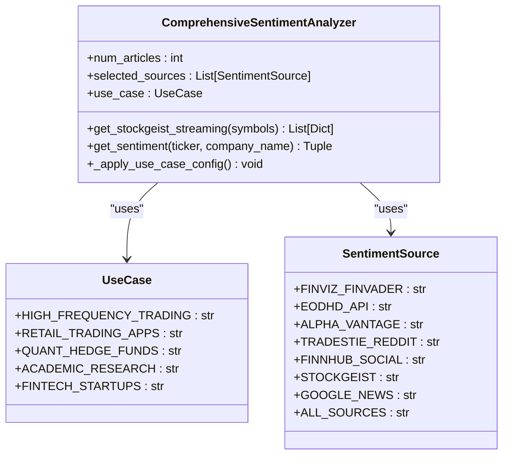
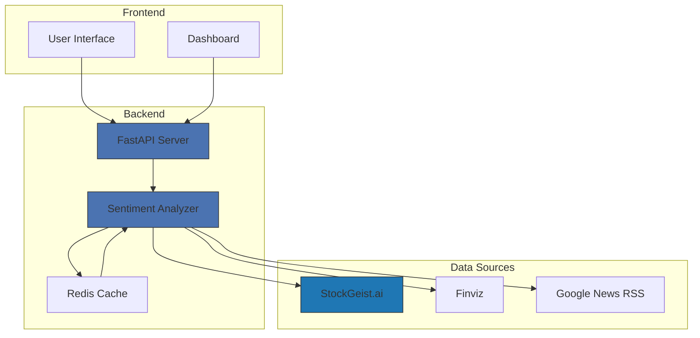
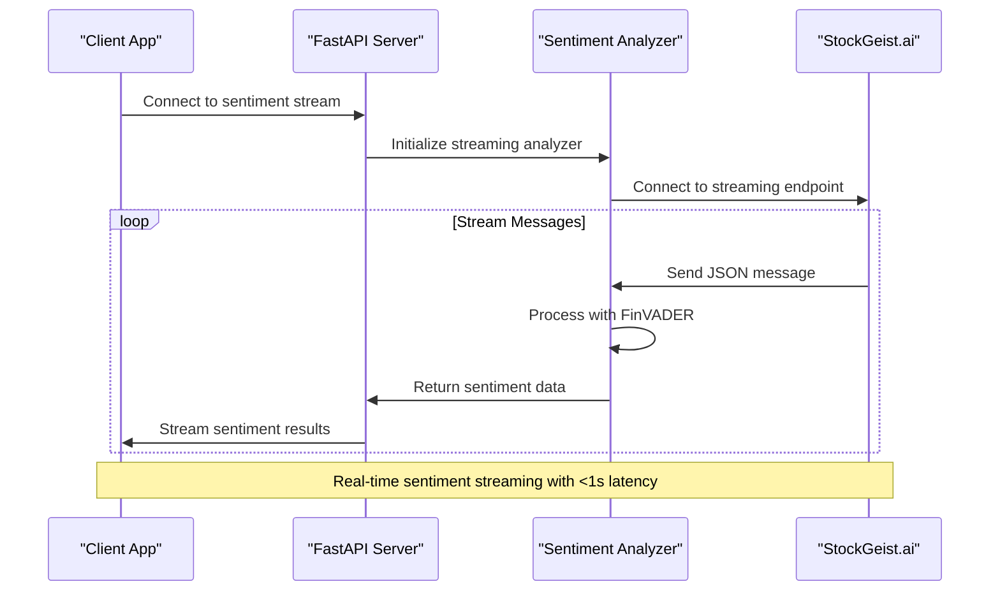
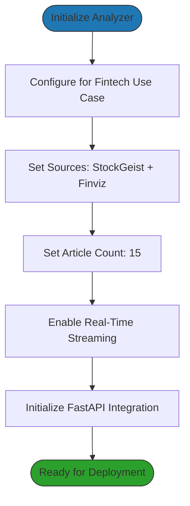
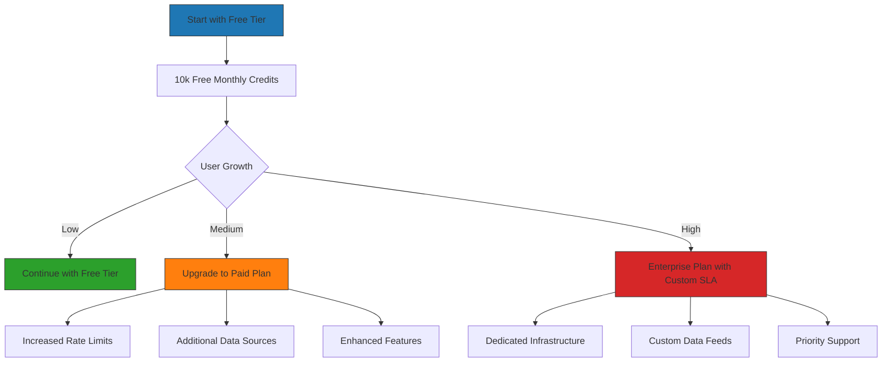

# Fintech Startups

<cite>
**Referenced Files in This Document**   
- [demos/use_case_sentiment_demo.py](file://demos/use_case_sentiment_demo.py)
- [news_sentiment.py](file://news_sentiment.py)
- [docs/USE_CASE_SENTIMENT_ANALYSIS.md](file://docs/USE_CASE_SENTIMENT_ANALYSIS.md)
- [main.py](file://main.py)
- [requirements.txt](file://requirements.txt)
</cite>

## Table of Contents
1. [Introduction](#introduction)
2. [Fintech Startups Configuration](#fintech-startups-configuration)
3. [System Architecture](#system-architecture)
4. [Real-Time Data Streaming](#real-time-data-streaming)
5. [Developer-Friendly APIs](#developer-friendly-apis)
6. [Initialization and Deployment](#initialization-and-deployment)
7. [Scaling Strategy](#scaling-strategy)
8. [Conclusion](#conclusion)

## Introduction

The Fintech Startups use case configuration is specifically designed to enable rapid MVP development with real-time data streams and developer-friendly APIs. This configuration leverages StockGeist.ai and Finviz with FinVADER sentiment analysis to process 15 articles with real-time streaming capabilities. The system provides 10k free monthly credits and FastAPI integration for quick deployment, allowing startups to launch sentiment-powered features within one week.

This documentation details how the system is optimized for fintech startups, focusing on the configuration that enables rapid development, real-time data processing, and easy scaling as the user base grows.

**Section sources**
- [demos/use_case_sentiment_demo.py](file://demos/use_case_sentiment_demo.py#L92-L109)
- [docs/USE_CASE_SENTIMENT_ANALYSIS.md](file://docs/USE_CASE_SENTIMENT_ANALYSIS.md#L85-L104)

## Fintech Startups Configuration

The Fintech Startups configuration is specifically optimized for rapid MVP development, providing a complete sentiment analysis solution that can be deployed quickly and scaled as needed. This configuration uses StockGeist.ai as the primary data source with Finviz and FinVADER for sentiment analysis, processing 15 articles with real-time streaming capabilities.

The system is designed with a freemium model, offering 10k free monthly credits to allow startups to launch and validate their products without initial costs. This enables startups to quickly deploy sentiment-powered features and scale as their user base grows.



**Diagram sources**
- [news_sentiment.py](file://news_sentiment.py#L78-L95)
- [news_sentiment.py](file://news_sentiment.py#L311-L379)

**Section sources**
- [news_sentiment.py](file://news_sentiment.py#L374-L379)
- [demos/use_case_sentiment_demo.py](file://demos/use_case_sentiment_demo.py#L92-L109)

## System Architecture

The system architecture for the Fintech Startups configuration is designed to be lightweight, scalable, and easy to deploy. It leverages modern web technologies and asynchronous processing to handle real-time data streams efficiently.

The core components include:
- **StockGeist.ai integration** for real-time sentiment data streaming
- **FinVADER sentiment analysis** for accurate financial text analysis
- **FastAPI integration** for developer-friendly API endpoints
- **Asynchronous processing** using aiohttp for efficient resource utilization

The architecture follows a microservices approach, allowing for independent scaling of components as the user base grows. This enables startups to begin with the free tier and seamlessly upgrade to paid plans as their requirements increase.



**Diagram sources**
- [news_sentiment.py](file://news_sentiment.py#L667-L706)
- [main.py](file://main.py#L8-L48)

**Section sources**
- [news_sentiment.py](file://news_sentiment.py#L667-L706)
- [main.py](file://main.py#L8-L48)

## Real-Time Data Streaming

The real-time data streaming capability is a key feature of the Fintech Startups configuration, enabling immediate analysis of market sentiment as news and social media content is published. The system uses StockGeist.ai's real-time streaming API to receive sentiment data for specified stock symbols.

The streaming implementation uses Server-Sent Events (SSE) over HTTP, allowing for efficient, low-latency data transmission. The system processes incoming data asynchronously using aiohttp, ensuring that the main application remains responsive even under heavy load.

When a connection is established with the StockGeist.ai streaming endpoint, the system receives JSON messages containing article text, URLs, timestamps, and associated stock symbols. Each message is immediately processed using FinVADER sentiment analysis to extract sentiment scores, which are then made available to the application in real-time.



**Diagram sources**
- [news_sentiment.py](file://news_sentiment.py#L667-L706)
- [demos/use_case_sentiment_demo.py](file://demos/use_case_sentiment_demo.py#L92-L109)

**Section sources**
- [news_sentiment.py](file://news_sentiment.py#L667-L706)
- [demos/use_case_sentiment_demo.py](file://demos/use_case_sentiment_demo.py#L92-L109)

## Developer-Friendly APIs

The system provides developer-friendly APIs that simplify integration and reduce time-to-market for fintech startups. The API design follows REST principles with clear endpoints and predictable responses, making it easy for developers to understand and implement.

The primary sentiment analysis function, `fintech_sentiment()`, provides a simple interface that requires only a stock ticker symbol and article count. This function handles all the complexity of connecting to data sources, processing articles, and analyzing sentiment, returning a comprehensive result with polarity scores, article titles, sentiment labels, and distribution statistics.

For startups using FastAPI, the integration is seamless, with the sentiment analysis system designed to work as a dependency or background task. The asynchronous nature of the implementation ensures that API endpoints remain responsive even when processing large volumes of data.



**Diagram sources**
- [news_sentiment.py](file://news_sentiment.py#L374-L379)
- [demos/use_case_sentiment_demo.py](file://demos/use_case_sentiment_demo.py#L92-L109)

**Section sources**
- [news_sentiment.py](file://news_sentiment.py#L374-L379)
- [demos/use_case_sentiment_demo.py](file://demos/use_case_sentiment_demo.py#L92-L109)

## Initialization and Deployment

Initializing the Fintech Startups configuration is straightforward, requiring minimal setup to begin processing sentiment data. The system is designed for rapid deployment, enabling startups to go from concept to working prototype in one week.

To initialize the system, developers import the `fintech_sentiment` function from the news_sentiment module and call it with a stock ticker symbol and article count. The function automatically configures the analyzer for the fintech use case, setting the appropriate data sources, article count, and streaming capabilities.

For deployment, the system can be containerized using Docker and deployed to cloud platforms like AWS, GCP, or Azure. The lightweight nature of the implementation and the use of asynchronous processing make it suitable for serverless environments like AWS Lambda, further reducing infrastructure costs during the MVP phase.

```mermaid
erDiagram
CONFIGURATION {
string use_case PK
string data_source
int article_count
boolean real_time_streaming
int free_credits
string api_framework
}
DEPLOYMENT {
string environment PK
string platform
string scaling_strategy
datetime go_to_market
}
CONFIGURATION ||--o{ DEPLOYMENT : "supports"
CONFIGURATION {
use_case: "fintech"
data_source: "StockGeist + Finviz"
article_count: 15
real_time_streaming: true
free_credits: 10000
api_framework: "FastAPI"
}
DEPLOYMENT {
environment: "Production"
platform: "Cloud (AWS/GCP/Azure)"
scaling_strategy: "Vertical then Horizontal"
go_to_market: "1 week"
}
```

**Diagram sources**
- [demos/use_case_sentiment_demo.py](file://demos/use_case_sentiment_demo.py#L92-L109)
- [docs/USE_CASE_SENTIMENT_ANALYSIS.md](file://docs/USE_CASE_SENTIMENT_ANALYSIS.md#L85-L104)

**Section sources**
- [demos/use_case_sentiment_demo.py](file://demos/use_case_sentiment_demo.py#L92-L109)
- [docs/USE_CASE_SENTIMENT_ANALYSIS.md](file://docs/USE_CASE_SENTIMENT_ANALYSIS.md#L85-L104)

## Scaling Strategy

The Fintech Startups configuration includes a clear scaling strategy that allows startups to grow from MVP to production-ready applications. The system is designed with a freemium model, providing 10k free monthly credits to support initial development and user acquisition.

As the user base grows, startups can seamlessly upgrade to paid tiers of the StockGeist.ai service, which offer higher rate limits, additional data sources, and enhanced features. The architecture supports both vertical scaling (increasing resources on a single server) and horizontal scaling (adding more servers) to handle increased load.

The use of asynchronous processing and potential Redis caching enables the system to handle thousands of requests per second, making it suitable for high-traffic applications. For startups expecting rapid growth, the system can be deployed in a microservices architecture, with sentiment analysis running as a separate service that can be scaled independently.



**Diagram sources**
- [docs/USE_CASE_SENTIMENT_ANALYSIS.md](file://docs/USE_CASE_SENTIMENT_ANALYSIS.md#L90-L91)
- [news_sentiment.py](file://news_sentiment.py#L374-L379)

**Section sources**
- [docs/USE_CASE_SENTIMENT_ANALYSIS.md](file://docs/USE_CASE_SENTIMENT_ANALYSIS.md#L90-L91)
- [news_sentiment.py](file://news_sentiment.py#L374-L379)

## Conclusion

The Fintech Startups configuration provides a comprehensive solution for rapid MVP development with real-time data streams and developer-friendly APIs. By leveraging StockGeist.ai and Finviz with FinVADER sentiment analysis, the system processes 15 articles with real-time streaming capabilities, delivering actionable insights with minimal latency.

The configuration offers 10k free monthly credits, allowing startups to launch sentiment-powered features quickly and cost-effectively. With FastAPI integration, the system enables quick deployment and seamless scaling as the user base grows.

Startups can leverage this configuration to launch in one week, validating their product-market fit before investing in premium services. The clear upgrade path from free to paid tiers ensures that the system can grow with the business, supporting both vertical and horizontal scaling strategies.

By following this approach, fintech startups can focus on building innovative features and user experiences while relying on a robust, production-ready sentiment analysis system for their core data processing needs.

**Section sources**
- [demos/use_case_sentiment_demo.py](file://demos/use_case_sentiment_demo.py#L92-L109)
- [docs/USE_CASE_SENTIMENT_ANALYSIS.md](file://docs/USE_CASE_SENTIMENT_ANALYSIS.md#L85-L104)