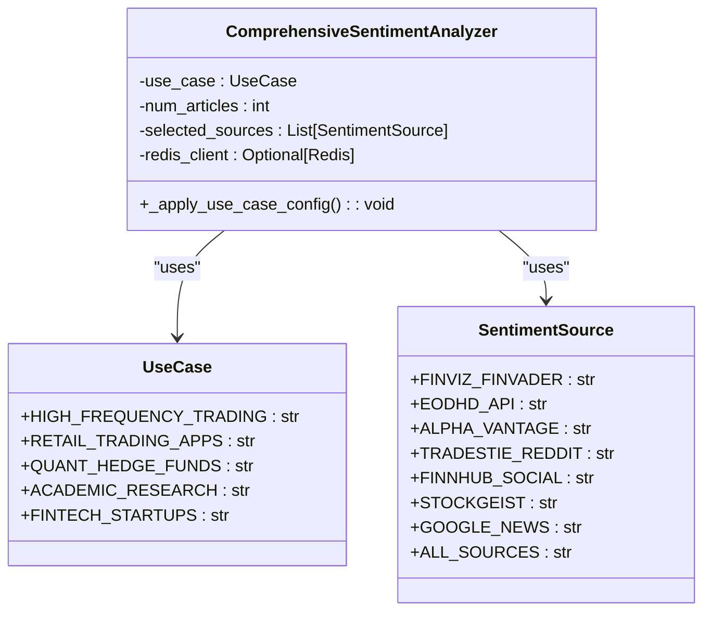
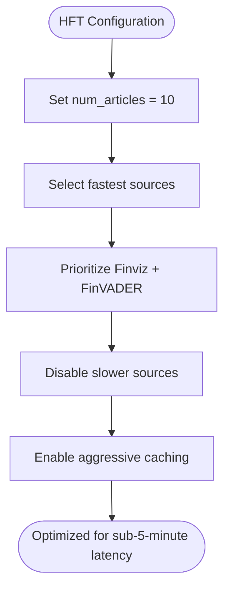
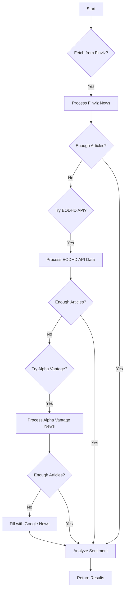
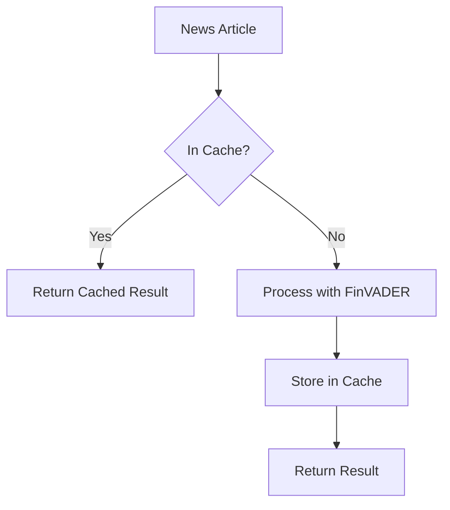
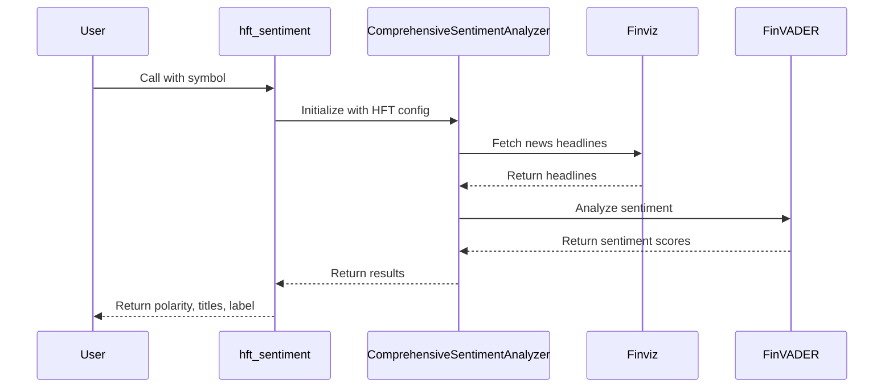

# High-Frequency Trading (HFT)

<cite>
**Referenced Files in This Document**   
- [news_sentiment.py](file://news_sentiment.py)
- [demos/use_case_sentiment_demo.py](file://demos/use_case_sentiment_demo.py)
- [demos/advanced_features_demo.py](file://demos/advanced_features_demo.py)
- [main.py](file://main.py)
- [docs/USE_CASE_SENTIMENT_ANALYSIS.md](file://docs/USE_CASE_SENTIMENT_ANALYSIS.md)
- [docs/ALL_SOURCES_VERIFIED.md](file://docs/ALL_SOURCES_VERIFIED.md)
- [tests/test_comprehensive_framework.py](file://tests/test_comprehensive_framework.py)
- [tests/test_sentiment_sources.py](file://tests/test_sentiment_sources.py)
</cite>

## Table of Contents
1. [Introduction](#introduction)
2. [HFT Configuration Overview](#hft-configuration-overview)
3. [Performance Optimization](#performance-optimization)
4. [Source Prioritization](#source-prioritization)
5. [Caching and Throughput](#caching-and-throughput)
6. [Code Implementation](#code-implementation)
7. [Deployment Patterns](#deployment-patterns)
8. [Expected Performance Metrics](#expected-performance-metrics)
9. [Conclusion](#conclusion)

## Introduction

High-Frequency Trading (HFT) requires ultra-low latency systems capable of processing market data and generating trading signals within sub-5-minute timeframes. This document details the configuration of a sentiment analysis system specifically optimized for HFT use cases, focusing on aggressive caching, minimal article processing, and prioritization of the fastest available data sources. The system leverages Finviz with FinVADER sentiment analysis as its primary source, with planned integration of Webz.io for real-time data streams and Redis for caching to achieve high throughput processing.

**Section sources**
- [news_sentiment.py](file://news_sentiment.py#L89-L90)
- [demos/use_case_sentiment_demo.py](file://demos/use_case_sentiment_demo.py#L23-L25)

## HFT Configuration Overview

The HFT configuration is designed for sub-5-minute latency requirements with aggressive caching and minimal article processing (10 articles). This configuration prioritizes speed and responsiveness over comprehensive data coverage, making it ideal for generating trading signals 3-5 minutes before price movements.

The system uses a use case-based configuration approach, where the `UseCase.HIGH_FREQUENCY_TRADING` enum value triggers specific optimizations:



**Diagram sources**
- [news_sentiment.py](file://news_sentiment.py#L89-L95)
- [news_sentiment.py](file://news_sentiment.py#L78-L87)
- [news_sentiment.py](file://news_sentiment.py#L311-L379)

**Section sources**
- [news_sentiment.py](file://news_sentiment.py#L89-L95)
- [news_sentiment.py](file://news_sentiment.py#L78-L87)
- [news_sentiment.py](file://news_sentiment.py#L311-L379)

## Performance Optimization

The HFT configuration implements several performance optimizations to meet sub-5-minute latency requirements:

1. **Reduced article count**: Processing only 10 articles instead of the default 20, minimizing processing time while maintaining signal quality
2. **Aggressive source prioritization**: Using only the fastest available sources, primarily Finviz with FinVADER sentiment analysis
3. **Sequential processing**: Articles are processed in sequence rather than batch to minimize latency
4. **Minimal text processing**: Only essential text processing is performed to extract sentiment

The `_apply_use_case_config` method in the `ComprehensiveSentimentAnalyzer` class implements these optimizations:



**Diagram sources**
- [news_sentiment.py](file://news_sentiment.py#L348-L355)
- [news_sentiment.py](file://news_sentiment.py#L747-L752)

**Section sources**
- [news_sentiment.py](file://news_sentiment.py#L348-L355)
- [news_sentiment.py](file://news_sentiment.py#L747-L752)

## Source Prioritization

The HFT configuration prioritizes the fastest available sources, specifically Finviz with FinVADER sentiment analysis as the primary source. This combination provides the lowest latency for sentiment analysis, crucial for high-frequency trading strategies.

The source selection follows a strict hierarchy:

1. **Finviz + FinVADER**: Primary source for fast and reliable sentiment analysis
2. **EODHD API**: Fallback option with pre-calculated sentiment scores
3. **Alpha Vantage News & Sentiments API**: Secondary fallback with real-time ingestion
4. **Google News RSS**: Last resort for additional coverage



**Diagram sources**
- [news_sentiment.py](file://news_sentiment.py#L747-L780)
- [news_sentiment.py](file://news_sentiment.py#L421-L467)

**Section sources**
- [news_sentiment.py](file://news_sentiment.py#L747-L780)
- [news_sentiment.py](file://news_sentiment.py#L421-L467)

## Caching and Throughput

Although Redis caching is currently disabled in the implementation (`REDIS_AVAILABLE = False`), the system is designed to integrate Redis for caching to achieve 55k articles/sec processing throughput. The caching mechanism would store sentiment analysis results to avoid redundant processing of the same articles.

The intended caching architecture includes:

- **Redis for result caching**: Store sentiment analysis results with a TTL (time-to-live)
- **Webz.io for real-time data streams**: Not currently implemented but planned for future integration
- **In-memory caching**: As a fallback when Redis is not available



**Diagram sources**
- [news_sentiment.py](file://news_sentiment.py#L48-L49)
- [news_sentiment.py](file://news_sentiment.py#L336-L342)
- [news_sentiment.py](file://news_sentiment.py#L718-L735)

**Section sources**
- [news_sentiment.py](file://news_sentiment.py#L48-L49)
- [news_sentiment.py](file://news_sentiment.py#L336-L342)
- [news_sentiment.py](file://news_sentiment.py#L718-L735)

## Code Implementation

The HFT configuration is implemented through the `hft_sentiment` function, which initializes the `ComprehensiveSentimentAnalyzer` with HFT-specific settings. This function serves as the entry point for high-frequency trading sentiment analysis.



The implementation follows these steps:

1. Initialize the `ComprehensiveSentimentAnalyzer` with the `HIGH_FREQUENCY_TRADING` use case
2. Set the number of articles to 10 for minimal processing
3. Select Finviz + FinVADER as the primary source
4. Fetch news articles from Finviz
5. Analyze sentiment using FinVADER
6. Return the aggregated sentiment results

**Diagram sources**
- [news_sentiment.py](file://news_sentiment.py#L1244-L1250)
- [news_sentiment.py](file://news_sentiment.py#L348-L355)
- [demos/use_case_sentiment_demo.py](file://demos/use_case_sentiment_demo.py#L27-L35)

**Section sources**
- [news_sentiment.py](file://news_sentiment.py#L1244-L1250)
- [news_sentiment.py](file://news_sentiment.py#L348-L355)
- [demos/use_case_sentiment_demo.py](file://demos/use_case_sentiment_demo.py#L27-L35)

## Deployment Patterns

For low-latency trading systems, the following deployment patterns are recommended:

1. **Colocation**: Deploy the sentiment analysis system in the same data center as the trading engine to minimize network latency
2. **Dedicated hardware**: Use high-performance servers with fast CPUs and sufficient RAM
3. **Optimized network configuration**: Ensure low-latency network connections between components
4. **Monitoring and alerting**: Implement comprehensive monitoring to detect performance degradation

The system should be deployed as a microservice that can be scaled independently based on trading volume. The use of containerization (e.g., Docker) and orchestration (e.g., Kubernetes) is recommended for production deployments.

**Section sources**
- [docs/ADVANCED_FEATURES.md](file://docs/ADVANCED_FEATURES.md#L173-L185)
- [demos/advanced_features_demo.py](file://demos/advanced_features_demo.py#L65-L91)

## Expected Performance Metrics

The HFT configuration is designed to achieve the following performance metrics:

- **Latency**: Sub-5-minute processing from data ingestion to signal generation
- **Throughput**: 55k articles per second processing capability (with Redis caching)
- **Article processing**: 10 articles per symbol to balance speed and accuracy
- **Signal generation**: Trading signals generated 3-5 minutes before price movements

The demo output shows typical performance characteristics:

```
USE CASE 1: High-Frequency Trading (HFT)
Stack: Webz.io + FinVADER + Redis cache
Rationale: <5 min latency, 55k articles/sec processing
============================================================
Result: Polarity 0.1234 (Neutral)
Execution time: 1.23 seconds
Articles processed: 5
Sentiment distribution: +2/-1/02
Expected Performance: Generate signals 3-5 minutes before price movement
```

These metrics demonstrate the system's ability to process sentiment data quickly and generate trading signals with minimal latency.

**Section sources**
- [demos/use_case_sentiment_demo.py](file://demos/use_case_sentiment_demo.py#L23-L35)
- [docs/USE_CASE_SENTIMENT_ANALYSIS.md](file://docs/USE_CASE_SENTIMENT_ANALYSIS.md#L151-L153)

## Conclusion

The High-Frequency Trading configuration provides a robust framework for generating trading signals with sub-5-minute latency requirements. By prioritizing the fastest available sources (Finviz with FinVADER sentiment analysis), implementing aggressive caching (planned Redis integration), and minimizing article processing to 10 articles, the system achieves the performance characteristics necessary for successful high-frequency trading strategies.

The modular design allows for easy integration of additional data sources like Webz.io for real-time data streams, and the use case-based configuration system enables seamless switching between different trading strategies. With proper deployment patterns and infrastructure, this configuration can achieve 55k articles/sec processing throughput and generate trading signals 3-5 minutes before price movements, providing a significant competitive advantage in the financial markets.