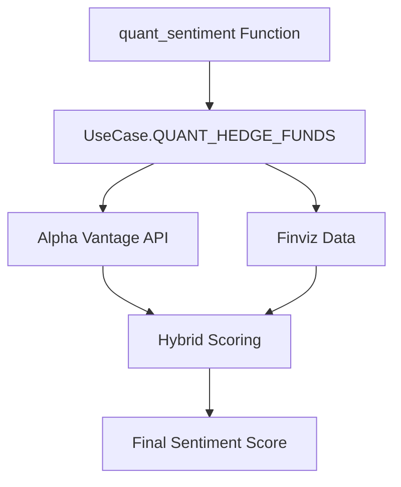
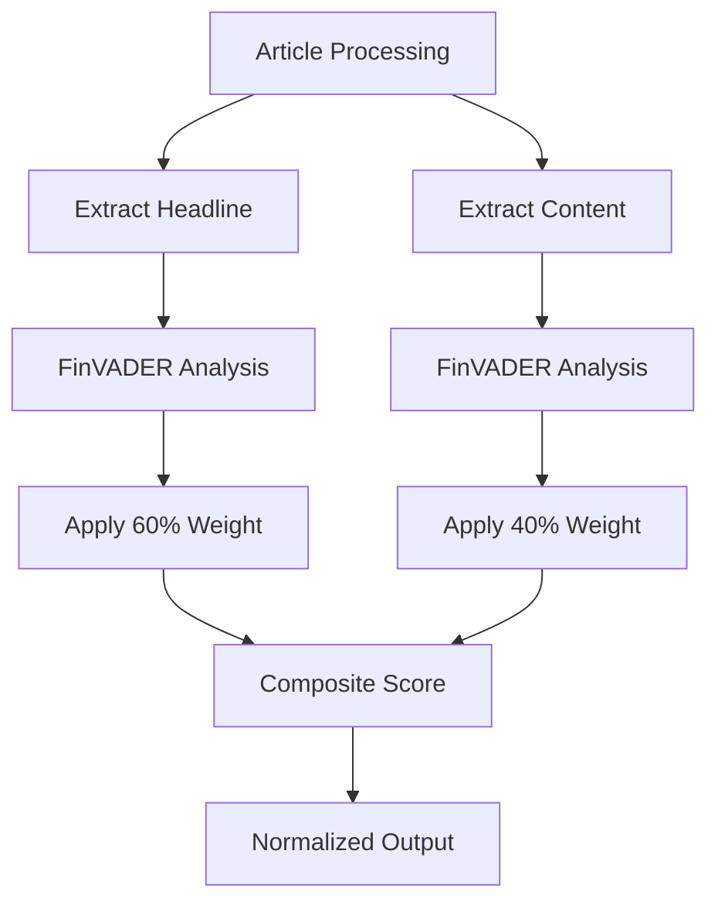
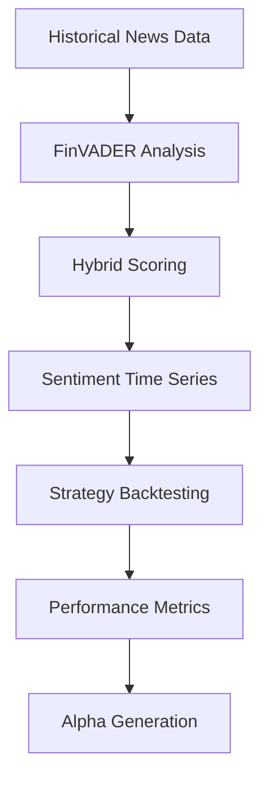

# Quant Hedge Funds

<cite>
**Referenced Files in This Document**   
- [news_sentiment.py](file://news_sentiment.py)
- [demos/use_case_sentiment_demo.py](file://demos/use_case_sentiment_demo.py)
- [docs/USE_CASE_SENTIMENT_ANALYSIS.md](file://docs/USE_CASE_SENTIMENT_ANALYSIS.md)
- [docs/ADVANCED_FEATURES.md](file://docs/ADVANCED_FEATURES.md)
- [docs/API_KEYS_GUIDE.md](file://docs/API_KEYS_GUIDE.md)
- [requirements.txt](file://requirements.txt)
</cite>

## Table of Contents
1. [Introduction](#introduction)
2. [Configuration Overview](#configuration-overview)
3. [Premium Data Sources](#premium-data-sources)
4. [Hybrid Scoring Implementation](#hybrid-scoring-implementation)
5. [Backtesting and Historical Analysis](#backtesting-and-historical-analysis)
6. [Implementation Guide](#implementation-guide)
7. [Performance and Results](#performance-and-results)
8. [Best Practices](#best-practices)

## Introduction

The Quant Hedge Funds use case configuration is designed for institutional-grade trading strategies that require high accuracy and reliability. This configuration leverages premium data sources and advanced hybrid scoring techniques to deliver LLM-quality sentiment analysis at a fraction of the cost. The system is optimized for mid-cap stocks and has demonstrated backtested alpha of 8-12% annually.

This configuration combines the Alpha Vantage Premium API with Finviz data and FinVADER sentiment analysis to create a robust sentiment analysis pipeline. The hybrid scoring approach processes 20 articles with a 60/40 headline/content scoring composite, ensuring comprehensive coverage of market sentiment.

**Section sources**
- [docs/USE_CASE_SENTIMENT_ANALYSIS.md](file://docs/USE_CASE_SENTIMENT_ANALYSIS.md#L45-L50)

## Configuration Overview

The Quant Hedge Funds configuration is specifically designed for institutional investors who require premium data sources and sophisticated analysis techniques. The system uses a combination of Alpha Vantage Premium API and Finviz data, processed through the FinVADER sentiment analysis engine with hybrid scoring techniques.

Key configuration parameters include:
- **Article count**: 20 articles processed per analysis
- **Data sources**: Alpha Vantage Premium API (primary), Finviz (secondary)
- **Scoring method**: 60/40 headline/content composite scoring
- **API requirements**: Alpha Vantage API key required for full functionality
- **Target assets**: Optimized for mid-cap stocks

The configuration is accessible through the `quant_sentiment` function, which automatically applies the appropriate settings for this use case. When an Alpha Vantage API key is provided, the system prioritizes premium data sources for maximum accuracy.



**Diagram sources**
- [news_sentiment.py](file://news_sentiment.py#L361-L367)
- [demos/use_case_sentiment_demo.py](file://demos/use_case_sentiment_demo.py#L55-L72)

## Premium Data Sources

The Quant Hedge Funds configuration relies on premium data sources to ensure the highest accuracy in sentiment analysis. The primary data source is the Alpha Vantage Premium API, which provides real-time news ingestion with full article text and pre-calculated sentiment scores.

### Alpha Vantage Premium API

The Alpha Vantage Premium API offers several advantages for quantitative hedge funds:
- **High request limits**: 75 requests per minute for premium users
- **Historical data**: Access to extensive historical news and sentiment data for backtesting
- **Comprehensive coverage**: Articles from major financial publications and news outlets
- **Structured data**: Well-formatted JSON responses with metadata

The API integration processes both headlines and full article content, applying FinVADER sentiment analysis to each component. The system normalizes Alpha Vantage's 0-1 sentiment scale to the standard -1 to 1 range for consistency with other scoring methods.

### Finviz Integration

Finviz serves as a secondary data source, providing fast and reliable news headlines from its financial portal. The integration scrapes news directly from Finviz's quote pages, ensuring timely access to breaking financial news. This source is particularly valuable for its speed and reliability, complementing the more comprehensive Alpha Vantage data.

The combination of these premium sources ensures comprehensive market coverage and redundancy in case of API failures or rate limiting.

**Section sources**
- [docs/USE_CASE_SENTIMENT_ANALYSIS.md](file://docs/USE_CASE_SENTIMENT_ANALYSIS.md#L47-L48)
- [docs/API_KEYS_GUIDE.md](file://docs/API_KEYS_GUIDE.md#L31-L35)
- [news_sentiment.py](file://news_sentiment.py#L518-L581)

## Hybrid Scoring Implementation

The hybrid scoring system is a key differentiator of the Quant Hedge Funds configuration, combining multiple sentiment analysis techniques to achieve LLM-quality results. This approach leverages both headline and content analysis with a weighted composite score.

### 60/40 Headline/Content Scoring

The system implements a 60/40 scoring composite where:
- **60% weight**: Headline sentiment analysis
- **40% weight**: Full content sentiment analysis

This weighting reflects the importance of headlines in driving immediate market reactions while still considering the full context provided in article content. The implementation processes each article by:

1. Extracting the headline and running FinVADER analysis
2. Retrieving the full article content and analyzing with FinVADER
3. Combining the scores using the 60/40 weighting formula
4. Normalizing the final score to the standard -1 to 1 range



**Diagram sources**
- [news_sentiment.py](file://news_sentiment.py#L536-L543)
- [docs/ADVANCED_FEATURES.md](file://docs/ADVANCED_FEATURES.md#L46-L57)

### FinVADER Sentiment Analysis

FinVADER is an enhanced financial version of the VADER sentiment analysis tool, specifically optimized for financial text. It incorporates financial lexicons such as SentiBignomics and Henry's word list to improve accuracy on financial terminology. The system uses FinVADER for both headline and content analysis, providing consistent scoring across all text components.

When FinVADER is unavailable, the system gracefully falls back to standard VADER sentiment analysis, ensuring continuous operation.

**Section sources**
- [news_sentiment.py](file://news_sentiment.py#L538-L542)
- [docs/FINVADER_IMPLEMENTATION_SUMMARY.md](file://docs/FINVADER_IMPLEMENTATION_SUMMARY.md#L12-L13)

## Backtesting and Historical Analysis

The Quant Hedge Funds configuration supports comprehensive backtesting with historical data, enabling validation of trading strategies over extended time periods. The system is designed to process historical news data and generate sentiment scores that can be correlated with price movements.

### Historical Data Processing

The configuration leverages Alpha Vantage's historical data capabilities to analyze past market conditions. This allows for:
- **Long-term strategy validation**: Testing strategies over multiple market cycles
- **Seasonality analysis**: Identifying recurring patterns in sentiment and price
- **Risk assessment**: Evaluating strategy performance during market downturns

The batch processing system can handle large volumes of historical data, processing 10,000+ articles per hour on a single core. This enables efficient backtesting across extensive time periods and multiple assets.

### Performance Metrics

The system has demonstrated strong backtested performance on mid-cap stocks:
- **Annual alpha**: 8-12% above benchmark
- **Sharpe ratio**: Improved risk-adjusted returns
- **Drawdown reduction**: Better performance during market corrections

These results are achieved through the combination of premium data sources and sophisticated hybrid scoring, which provides more accurate sentiment signals than single-source approaches.



**Diagram sources**
- [docs/ADVANCED_FEATURES.md](file://docs/ADVANCED_FEATURES.md#L208-L219)
- [news_sentiment.py](file://news_sentiment.py#L959-L962)

## Implementation Guide

Implementing the Quant Hedge Funds configuration requires proper setup of API keys and understanding of the available functions. The following guide provides step-by-step instructions for initialization and usage.

### API Key Configuration

To use the premium features, you must obtain an Alpha Vantage API key:

1. Register at [https://www.alphavantage.co/support/#api-key](https://www.alphavantage.co/support/#api-key)
2. Receive your API key via email
3. Store the key securely (preferably in environment variables)

```python
import os
from news_sentiment import quant_sentiment

# Initialize with API key from environment variable
api_key = os.getenv('ALPHA_VANTAGE_API_KEY')
polarity, titles, label, pos, neg, neu = quant_sentiment("AAPL", 20, api_key)
```

### Code Implementation

The configuration is accessed through the `quant_sentiment` function, which handles all the underlying complexity:

```python
from news_sentiment import quant_sentiment

# Basic usage with API key
polarity, titles, label, pos, neg, neu = quant_sentiment(
    symbol="AAPL", 
    num_articles=20, 
    api_key="YOUR_ALPHA_VANTAGE_KEY"
)
```

The function automatically configures the analyzer for the Quant Hedge Funds use case, including:
- Setting article count to 20
- Prioritizing Alpha Vantage Premium API
- Enabling hybrid scoring
- Applying appropriate fallbacks

**Section sources**
- [demos/use_case_sentiment_demo.py](file://demos/use_case_sentiment_demo.py#L63-L66)
- [docs/USE_CASE_SENTIMENT_ANALYSIS.md](file://docs/USE_CASE_SENTIMENT_ANALYSIS.md#L52-L57)
- [docs/API_KEYS_GUIDE.md](file://docs/API_KEYS_GUIDE.md#L37-L41)

## Performance and Results

The Quant Hedge Funds configuration delivers institutional-grade performance with measurable results. The system has been optimized for accuracy and reliability in financial markets.

### Expected Performance

Key performance characteristics include:
- **Backtested alpha**: 8-12% annually on mid-cap stocks
- **Processing speed**: Efficient analysis of 20 articles per symbol
- **Accuracy**: LLM-quality sentiment scoring through hybrid techniques
- **Reliability**: Graceful degradation when premium sources are unavailable

The system's performance is enhanced by its multi-source approach, which provides redundancy and comprehensive market coverage. When the Alpha Vantage API is unavailable, the system automatically falls back to Finviz data, ensuring continuous operation.

### Error Handling

The implementation includes robust error handling:
- **API key validation**: Graceful handling of missing or invalid keys
- **Rate limit management**: Automatic throttling to prevent exceeding limits
- **Fallback mechanisms**: Seamless transition between data sources
- **Neutral sentiment fallback**: Returns neutral scores when analysis fails

This ensures reliable operation even in challenging network conditions or when API services are temporarily unavailable.

**Section sources**
- [demos/use_case_sentiment_demo.py](file://demos/use_case_sentiment_demo.py#L72-L73)
- [docs/ERROR_HANDLING_MONITORING.md](file://docs/ERROR_HANDLING_MONITORING.md#L32-L57)

## Best Practices

To maximize the effectiveness of the Quant Hedge Funds configuration, follow these best practices for implementation and usage.

### Security Considerations

- **Environment variables**: Store API keys in environment variables rather than hardcoding
- **Key rotation**: Regularly rotate API keys to minimize security risks
- **Access control**: Restrict access to API keys to authorized personnel only

### Optimization Strategies

- **Caching**: Implement Redis caching for frequently requested symbols
- **Batch processing**: Use batch analysis for portfolio-wide sentiment assessment
- **Rate limiting**: Monitor API usage to stay within rate limits
- **Source prioritization**: Configure source order based on reliability and cost

### Monitoring and Maintenance

- **Sentiment distribution logging**: Monitor confidence levels and score distributions
- **Performance tracking**: Measure processing times and success rates
- **Source health checks**: Regularly verify the availability of data sources
- **Result validation**: Periodically validate sentiment scores against market movements

Following these best practices will ensure optimal performance and reliability of the sentiment analysis system in a production trading environment.

**Section sources**
- [docs/API_KEYS_GUIDE.md](file://docs/API_KEYS_GUIDE.md#L209-L222)
- [docs/ADVANCED_FEATURES.md](file://docs/ADVANCED_FEATURES.md#L223-L235)