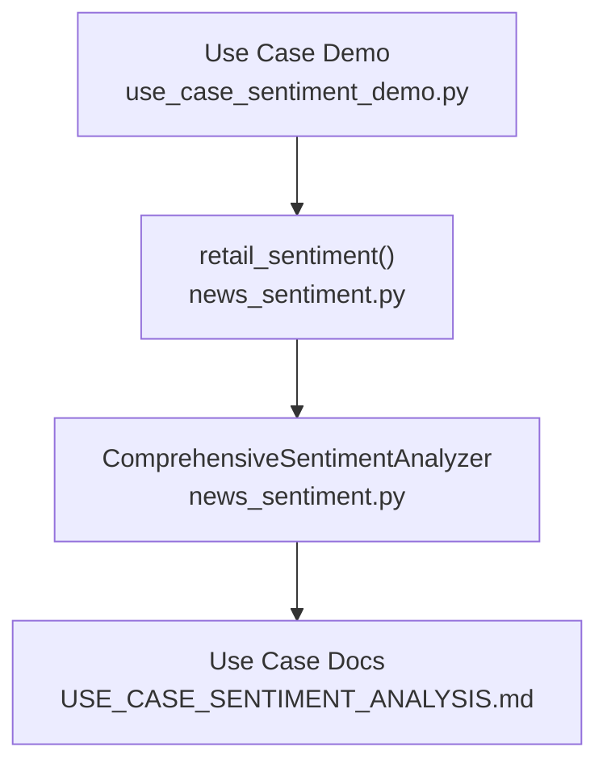
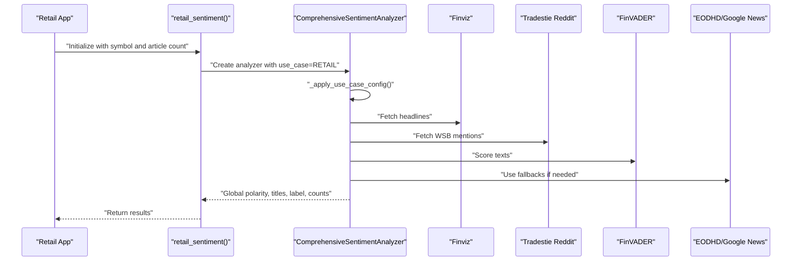
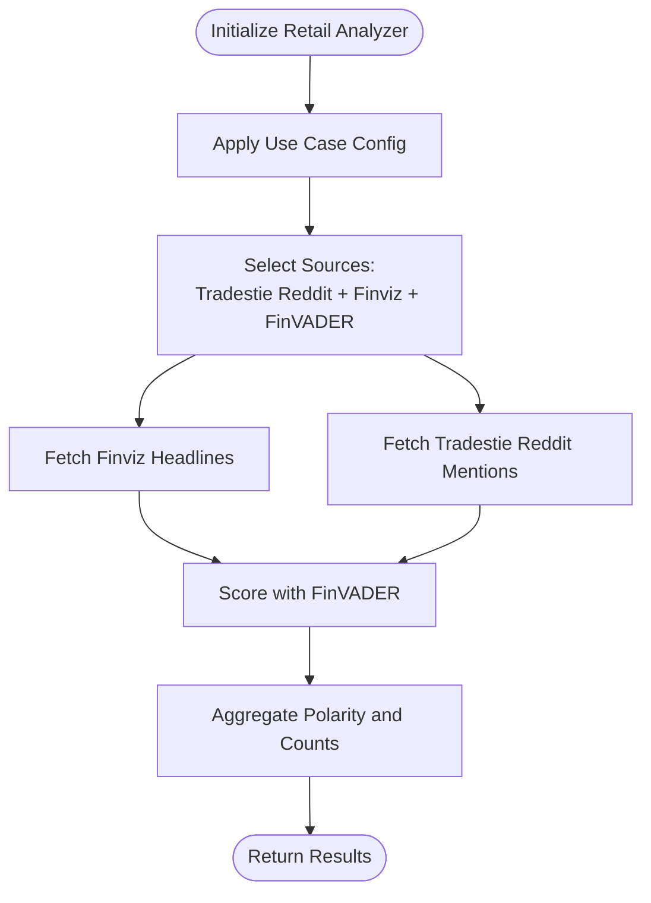
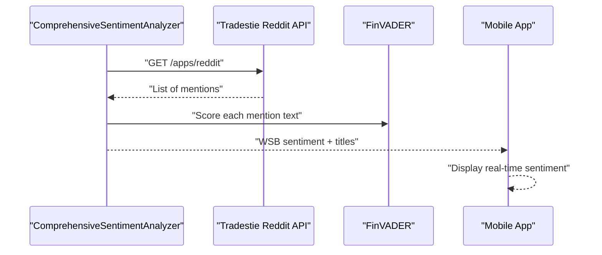
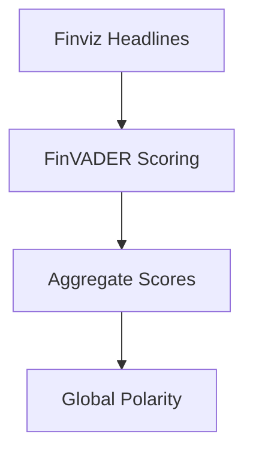
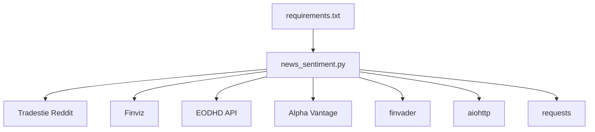

# Retail Trading Apps

<cite>
**Referenced Files in This Document**
- [news_sentiment.py](file://news_sentiment.py)
- [USE_CASE_SENTIMENT_ANALYSIS.md](file://docs/USE_CASE_SENTIMENT_ANALYSIS.md)
- [use_case_sentiment_demo.py](file://demos/use_case_sentiment_demo.py)
- [requirements.txt](file://requirements.txt)
- [FINVADER_IMPLEMENTATION_SUMMARY.md](file://docs/FINVADER_IMPLEMENTATION_SUMMARY.md)
- [error_handling_monitoring_demo.py](file://demos/error_handling_monitoring_demo.py)
</cite>

## Table of Contents
1. [Introduction](#introduction)
2. [Project Structure](#project-structure)
3. [Core Components](#core-components)
4. [Architecture Overview](#architecture-overview)
5. [Detailed Component Analysis](#detailed-component-analysis)
6. [Dependency Analysis](#dependency-analysis)
7. [Performance Considerations](#performance-considerations)
8. [Troubleshooting Guide](#troubleshooting-guide)
9. [Conclusion](#conclusion)
10. [Appendices](#appendices)

## Introduction
This document explains the Retail Trading Apps use case configuration for sentiment analysis. It focuses on how the system is optimized for cost-effectiveness with zero-cost APIs and a 15-minute latency tolerance. The configuration integrates Tradestie Reddit API and Finviz with FinVADER sentiment analysis, processing only a small number of articles to minimize API usage. It also documents how this configuration enables real-time WallStreetBets sentiment integration in mobile applications, provides code example paths for initializing the sentiment analyzer for retail applications, and outlines the expected user impact. Guidance is included for implementing this configuration in consumer-facing trading apps and balancing performance with budget constraints.

## Project Structure
The Retail Trading Apps configuration lives in the sentiment analysis module and is exposed through convenience functions. The module organizes:
- A comprehensive analyzer class that selects sources and applies use-case-specific defaults
- Convenience functions for each use case, including retail
- Demos that illustrate initialization and runtime behavior
- Documentation that describes the use-case stack and rationale

**Diagram sources**
- [news_sentiment.py](file://news_sentiment.py#L1164-L1283)
- [USE_CASE_SENTIMENT_ANALYSIS.md](file://docs/USE_CASE_SENTIMENT_ANALYSIS.md#L1-L165)
- [use_case_sentiment_demo.py](file://demos/use_case_sentiment_demo.py#L37-L54)

**Section sources**
- [news_sentiment.py](file://news_sentiment.py#L1164-L1283)
- [USE_CASE_SENTIMENT_ANALYSIS.md](file://docs/USE_CASE_SENTIMENT_ANALYSIS.md#L1-L165)
- [use_case_sentiment_demo.py](file://demos/use_case_sentiment_demo.py#L37-L54)

## Core Components
- Use-case-aware configuration: The analyzer applies predefined settings for retail trading, including article count and source selection.
- Source selection: Retail uses Tradestie Reddit plus Finviz + FinVADER.
- Latency and cost targets: The configuration targets zero-cost APIs and 15-minute latency suitable for swing trading and mobile apps.
- Initialization: Consumers call a convenience function to initialize the analyzer with retail defaults.

Key implementation references:
- Use-case configuration application: [news_sentiment.py](file://news_sentiment.py#L356-L360)
- Convenience function for retail: [news_sentiment.py](file://news_sentiment.py#L1252-L1258)
- Demo showcasing retail configuration: [use_case_sentiment_demo.py](file://demos/use_case_sentiment_demo.py#L37-L54)
- Use-case rationale and stack: [USE_CASE_SENTIMENT_ANALYSIS.md](file://docs/USE_CASE_SENTIMENT_ANALYSIS.md#L25-L38)

**Section sources**
- [news_sentiment.py](file://news_sentiment.py#L356-L360)
- [news_sentiment.py](file://news_sentiment.py#L1252-L1258)
- [use_case_sentiment_demo.py](file://demos/use_case_sentiment_demo.py#L37-L54)
- [USE_CASE_SENTIMENT_ANALYSIS.md](file://docs/USE_CASE_SENTIMENT_ANALYSIS.md#L25-L38)

## Architecture Overview
The retail configuration follows a layered approach:
- Primary source: Finviz for fast, reliable headlines
- Social sentiment: Tradestie Reddit for real-time WallStreetBets mentions
- Sentiment scoring: FinVADER for financial nuance
- Fallbacks: EODHD API and Google News RSS as needed
- Output: Global polarity, article titles, and distribution counts

**Diagram sources**
- [news_sentiment.py](file://news_sentiment.py#L1164-L1283)
- [news_sentiment.py](file://news_sentiment.py#L356-L360)
- [news_sentiment.py](file://news_sentiment.py#L747-L800)
- [news_sentiment.py](file://news_sentiment.py#L583-L620)

## Detailed Component Analysis

### Retail Use Case Configuration
- Defaults: Article count of 5 and source selection of Tradestie Reddit plus Finviz + FinVADER.
- Rationale: Zero cost, 15-minute latency acceptable for swing trading; suitable for mobile apps and serverless deployments.
- Behavior: The analyzer applies these defaults automatically when initialized with the retail use case.

References:
- Configuration application: [news_sentiment.py](file://news_sentiment.py#L356-L360)
- Convenience function: [news_sentiment.py](file://news_sentiment.py#L1252-L1258)
- Demo output and user impact: [use_case_sentiment_demo.py](file://demos/use_case_sentiment_demo.py#L37-L54)
- Documentation rationale and stack: [USE_CASE_SENTIMENT_ANALYSIS.md](file://docs/USE_CASE_SENTIMENT_ANALYSIS.md#L25-L38)

**Diagram sources**
- [news_sentiment.py](file://news_sentiment.py#L356-L360)
- [news_sentiment.py](file://news_sentiment.py#L747-L800)
- [news_sentiment.py](file://news_sentiment.py#L583-L620)

**Section sources**
- [news_sentiment.py](file://news_sentiment.py#L356-L360)
- [news_sentiment.py](file://news_sentiment.py#L1252-L1258)
- [use_case_sentiment_demo.py](file://demos/use_case_sentiment_demo.py#L37-L54)
- [USE_CASE_SENTIMENT_ANALYSIS.md](file://docs/USE_CASE_SENTIMENT_ANALYSIS.md#L25-L38)

### Real-time WallStreetBets Integration
- Tradestie Reddit endpoint is polled to retrieve recent mentions and scores them with FinVADER.
- The configuration processes a small number of articles to keep latency low and costs minimal.
- This enables real-time WSB sentiment to be surfaced in mobile applications.

References:
- Reddit fetching and scoring: [news_sentiment.py](file://news_sentiment.py#L583-L620)
- Demo user impact statement: [use_case_sentiment_demo.py](file://demos/use_case_sentiment_demo.py#L51-L53)
- Documentation user impact: [USE_CASE_SENTIMENT_ANALYSIS.md](file://docs/USE_CASE_SENTIMENT_ANALYSIS.md#L25-L38)

**Diagram sources**
- [news_sentiment.py](file://news_sentiment.py#L583-L620)

**Section sources**
- [news_sentiment.py](file://news_sentiment.py#L583-L620)
- [use_case_sentiment_demo.py](file://demos/use_case_sentiment_demo.py#L51-L53)
- [USE_CASE_SENTIMENT_ANALYSIS.md](file://docs/USE_CASE_SENTIMENT_ANALYSIS.md#L25-L38)

### FinVADER and Finviz Integration
- Finviz is used as the primary source for fast headline retrieval.
- FinVADER performs sentiment scoring with financial lexicons for improved accuracy.
- The implementation replaces older, slower scraping approaches with a streamlined pipeline.

References:
- FinVADER benefits and fallback chain: [FINVADER_IMPLEMENTATION_SUMMARY.md](file://docs/FINVADER_IMPLEMENTATION_SUMMARY.md#L1-L91)
- Finviz fetching and scoring: [news_sentiment.py](file://news_sentiment.py#L421-L467)
- FinVADER scoring path: [news_sentiment.py](file://news_sentiment.py#L800-L895)

**Diagram sources**
- [news_sentiment.py](file://news_sentiment.py#L421-L467)
- [news_sentiment.py](file://news_sentiment.py#L800-L895)
- [FINVADER_IMPLEMENTATION_SUMMARY.md](file://docs/FINVADER_IMPLEMENTATION_SUMMARY.md#L1-L91)

**Section sources**
- [FINVADER_IMPLEMENTATION_SUMMARY.md](file://docs/FINVADER_IMPLEMENTATION_SUMMARY.md#L1-L91)
- [news_sentiment.py](file://news_sentiment.py#L421-L467)
- [news_sentiment.py](file://news_sentiment.py#L800-L895)

### Initialization Example Paths
- Initialize retail analyzer with a symbol and article count:
  - [news_sentiment.py](file://news_sentiment.py#L1252-L1258)
- The demo shows initialization and runtime behavior for retail:
  - [use_case_sentiment_demo.py](file://demos/use_case_sentiment_demo.py#L37-L54)

**Section sources**
- [news_sentiment.py](file://news_sentiment.py#L1252-L1258)
- [use_case_sentiment_demo.py](file://demos/use_case_sentiment_demo.py#L37-L54)

## Dependency Analysis
- External APIs:
  - Tradestie Reddit: Used for real-time WSB mentions.
  - Finviz: Used for fast headline retrieval.
  - EODHD API: Optional fallback for pre-calculated sentiment.
  - Alpha Vantage: Optional premium source for hybrid scoring.
- Libraries:
  - finvader: Provides financial sentiment scoring.
  - aiohttp: Enables asynchronous streaming where applicable.
  - Requests: Handles synchronous HTTP calls for Reddit and RSS.

References:
- Reddit integration: [news_sentiment.py](file://news_sentiment.py#L583-L620)
- Finviz integration: [news_sentiment.py](file://news_sentiment.py#L421-L467)
- EODHD fallback: [news_sentiment.py](file://news_sentiment.py#L480-L517)
- Alpha Vantage integration: [news_sentiment.py](file://news_sentiment.py#L518-L581)
- Dependencies: [requirements.txt](file://requirements.txt#L1-L19)

**Diagram sources**
- [requirements.txt](file://requirements.txt#L1-L19)
- [news_sentiment.py](file://news_sentiment.py#L421-L581)

**Section sources**
- [requirements.txt](file://requirements.txt#L1-L19)
- [news_sentiment.py](file://news_sentiment.py#L421-L581)

## Performance Considerations
- Latency targets: The retail configuration targets 15-minute latency suitable for swing trading and mobile apps.
- Cost-effectiveness: Uses free or low-cost sources (Tradestie Reddit, Finviz) and limits article count to 5.
- Throughput: The analyzer’s fallback chain and FinVADER scoring are designed for speed and reliability.
- Monitoring: Built-in logging and distribution metrics help track performance and quality.

References:
- Use-case rationale and latency: [USE_CASE_SENTIMENT_ANALYSIS.md](file://docs/USE_CASE_SENTIMENT_ANALYSIS.md#L25-L38)
- Demo runtime behavior: [use_case_sentiment_demo.py](file://demos/use_case_sentiment_demo.py#L37-L54)
- Distribution logging: [news_sentiment.py](file://news_sentiment.py#L914-L956)

**Section sources**
- [USE_CASE_SENTIMENT_ANALYSIS.md](file://docs/USE_CASE_SENTIMENT_ANALYSIS.md#L25-L38)
- [use_case_sentiment_demo.py](file://demos/use_case_sentiment_demo.py#L37-L54)
- [news_sentiment.py](file://news_sentiment.py#L914-L956)

## Troubleshooting Guide
- Error handling and retries: The system includes robust error handling with retry mechanisms and graceful degradation.
- Monitoring: Logging captures sentiment distribution statistics and error details.
- Edge cases: Empty text and missing data are handled with neutral fallbacks.

References:
- Robust FinVADER analysis with retries: [error_handling_monitoring_demo.py](file://demos/error_handling_monitoring_demo.py#L20-L39)
- Distribution logging: [news_sentiment.py](file://news_sentiment.py#L914-L956)
- Error recovery behavior: [error_handling_monitoring_demo.py](file://demos/error_handling_monitoring_demo.py#L65-L83)

**Section sources**
- [error_handling_monitoring_demo.py](file://demos/error_handling_monitoring_demo.py#L20-L39)
- [news_sentiment.py](file://news_sentiment.py#L914-L956)
- [error_handling_monitoring_demo.py](file://demos/error_handling_monitoring_demo.py#L65-L83)

## Conclusion
The Retail Trading Apps configuration optimizes sentiment analysis for cost-effectiveness and practical latency by combining Tradestie Reddit and Finviz with FinVADER, processing only a small number of articles. This setup enables real-time WallStreetBets sentiment integration in mobile applications, aligns with zero-cost operational models, and provides a reliable foundation for consumer-facing trading apps. The convenience functions and use-case-aware analyzer simplify initialization and ensure consistent performance under budget constraints.

## Appendices

### Implementation Guidance for Consumer Apps
- Choose the retail configuration by calling the retail convenience function with the desired symbol and article count.
- Integrate the returned polarity, titles, and distribution counts into your app’s UI.
- For serverless or low-resource environments, rely on the free sources and small article count to minimize costs.
- Monitor performance using the built-in logging and adjust article counts or sources as needed.

References:
- Convenience function path: [news_sentiment.py](file://news_sentiment.py#L1252-L1258)
- Demo usage: [use_case_sentiment_demo.py](file://demos/use_case_sentiment_demo.py#L129-L139)
- Use-case rationale: [USE_CASE_SENTIMENT_ANALYSIS.md](file://docs/USE_CASE_SENTIMENT_ANALYSIS.md#L25-L38)

**Section sources**
- [news_sentiment.py](file://news_sentiment.py#L1252-L1258)
- [use_case_sentiment_demo.py](file://demos/use_case_sentiment_demo.py#L129-L139)
- [USE_CASE_SENTIMENT_ANALYSIS.md](file://docs/USE_CASE_SENTIMENT_ANALYSIS.md#L25-L38)