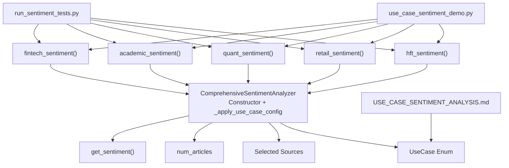
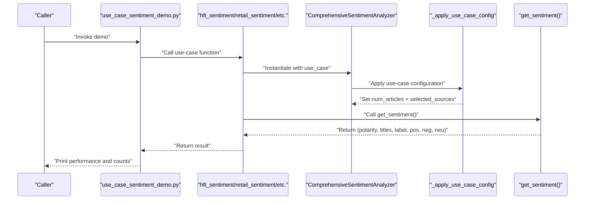
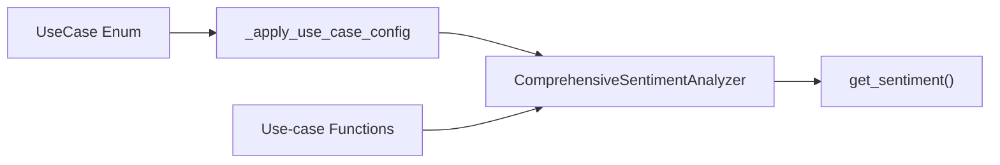

# Use Case Configurations

<cite>
**Referenced Files in This Document**
- [news_sentiment.py](file://news_sentiment.py)
- [USE_CASE_SENTIMENT_ANALYSIS.md](file://docs/USE_CASE_SENTIMENT_ANALYSIS.md)
- [use_case_sentiment_demo.py](file://demos/use_case_sentiment_demo.py)
- [run_sentiment_tests.py](file://tests/run_sentiment_tests.py)
</cite>

## Table of Contents
1. [Introduction](#introduction)
2. [Project Structure](#project-structure)
3. [Core Components](#core-components)
4. [Architecture Overview](#architecture-overview)
5. [Detailed Component Analysis](#detailed-component-analysis)
6. [Dependency Analysis](#dependency-analysis)
7. [Performance Considerations](#performance-considerations)
8. [Troubleshooting Guide](#troubleshooting-guide)
9. [Conclusion](#conclusion)
10. [Appendices](#appendices)

## Introduction
This document explains the use case configurations sub-feature that enables the system to tailor sentiment analysis for different financial scenarios. It focuses on:
- How the UseCase enum defines five predefined use cases
- How the _apply_use_case_config method applies the optimal configuration for each use case
- How to initialize the ComprehensiveSentimentAnalyzer with a specific use case and observe the resulting behavior
- How each use case optimizes for distinct requirements such as low latency, cost-effectiveness, or historical depth
- Guidance on selecting the appropriate use case and extending the system with custom configurations

## Project Structure
The use case configurations are implemented in the sentiment module and surfaced through convenience functions grouped by use case. The demo and documentation files illustrate usage and expected behavior.

**Diagram sources**
- [news_sentiment.py](file://news_sentiment.py#L311-L345)
- [news_sentiment.py](file://news_sentiment.py#L346-L380)
- [news_sentiment.py](file://news_sentiment.py#L1243-L1283)
- [use_case_sentiment_demo.py](file://demos/use_case_sentiment_demo.py#L1-L150)
- [USE_CASE_SENTIMENT_ANALYSIS.md](file://docs/USE_CASE_SENTIMENT_ANALYSIS.md#L1-L165)
- [run_sentiment_tests.py](file://tests/run_sentiment_tests.py#L140-L168)

**Section sources**
- [news_sentiment.py](file://news_sentiment.py#L311-L345)
- [news_sentiment.py](file://news_sentiment.py#L346-L380)
- [news_sentiment.py](file://news_sentiment.py#L1243-L1283)
- [use_case_sentiment_demo.py](file://demos/use_case_sentiment_demo.py#L1-L150)
- [USE_CASE_SENTIMENT_ANALYSIS.md](file://docs/USE_CASE_SENTIMENT_ANALYSIS.md#L1-L165)
- [run_sentiment_tests.py](file://tests/run_sentiment_tests.py#L140-L168)

## Core Components
- UseCase enum: Defines the five use cases used to drive configuration.
- ComprehensiveSentimentAnalyzer: Central orchestrator that applies use-case-specific settings via _apply_use_case_config.
- Convenience functions: hft_sentiment, retail_sentiment, quant_sentiment, academic_sentiment, fintech_sentiment wrap initialization and invocation for each use case.
- Selected sources and num_articles: The two primary configuration knobs controlled by use cases.

Key behaviors:
- On construction, the analyzer reads the use_case and invokes _apply_use_case_config to set num_articles and selected_sources.
- During get_sentiment, the analyzer respects selected_sources and num_articles to fetch and score sentiment efficiently.

**Section sources**
- [news_sentiment.py](file://news_sentiment.py#L88-L95)
- [news_sentiment.py](file://news_sentiment.py#L311-L345)
- [news_sentiment.py](file://news_sentiment.py#L346-L380)
- [news_sentiment.py](file://news_sentiment.py#L1243-L1283)

## Architecture Overview
The use case configuration pipeline connects the caller’s intent (via a convenience function) to the analyzer’s internal configuration and execution.

**Diagram sources**
- [news_sentiment.py](file://news_sentiment.py#L1243-L1283)
- [news_sentiment.py](file://news_sentiment.py#L311-L345)
- [news_sentiment.py](file://news_sentiment.py#L346-L380)
- [use_case_sentiment_demo.py](file://demos/use_case_sentiment_demo.py#L1-L150)

## Detailed Component Analysis

### UseCase Enum
Defines the five supported use cases:
- HIGH_FREQUENCY_TRADING
- RETAIL_TRADING_APPS
- QUANT_HEDGE_FUNDS
- ACADEMIC_RESEARCH
- FINTECH_STARTUPS

These values are used to branch in _apply_use_case_config to apply the appropriate configuration.

**Section sources**
- [news_sentiment.py](file://news_sentiment.py#L88-L95)
- [USE_CASE_SENTIMENT_ANALYSIS.md](file://docs/USE_CASE_SENTIMENT_ANALYSIS.md#L108-L118)

### _apply_use_case_config Method
Applies configuration based on the selected UseCase:
- HIGH_FREQUENCY_TRADING: Sets a small number of articles and restricts sources to the fastest available (Finviz + FinVADER).
- RETAIL_TRADING_APPS: Uses a small article count and combines social sentiment with FinVADER.
- QUANT_HEDGE_FUNDS: Uses a moderate article count and integrates premium APIs with FinVADER.
- ACADEMIC_RESEARCH: Uses a larger article count and emphasizes historical or broad coverage sources.
- FINTECH_STARTUPS: Uses a moderate article count and integrates real-time streaming APIs.

Notes:
- The documentation references a Webz.io stack for HFT, indicating a fast ingestion pipeline. In the current implementation, the analyzer falls back to Finviz + FinVADER for HFT.
- Redis caching is referenced in documentation; the analyzer initializes Redis connectivity but the caching logic appears to be primarily in the robust_finvader method and not in _apply_use_case_config.

**Section sources**
- [news_sentiment.py](file://news_sentiment.py#L346-L380)
- [USE_CASE_SENTIMENT_ANALYSIS.md](file://docs/USE_CASE_SENTIMENT_ANALYSIS.md#L1-L165)

### Convenience Functions and Initialization
Each use-case function constructs a ComprehensiveSentimentAnalyzer with the corresponding UseCase and delegates to the shared retrieval logic. This ensures consistent configuration application across all use cases.

Examples:
- HFT: hft_sentiment(symbol, num_articles=10) with use_case=UseCase.HIGH_FREQUENCY_TRADING
- Retail: retail_sentiment(symbol, num_articles=5) with use_case=UseCase.RETAIL_TRADING_APPS
- Quant: quant_sentiment(symbol, num_articles=20, api_key) with use_case=UseCase.QUANT_HEDGE_FUNDS
- Academic: academic_sentiment(symbol, num_articles=50) with use_case=UseCase.ACADEMIC_RESEARCH
- Fintech: fintech_sentiment(symbol, num_articles=15) with use_case=UseCase.FINTECH_STARTUPS

Behavioral differences:
- Number of articles varies by use case to balance speed vs. statistical robustness.
- Selected sources vary to match performance, cost, and data characteristics.

**Section sources**
- [news_sentiment.py](file://news_sentiment.py#L1243-L1283)
- [use_case_sentiment_demo.py](file://demos/use_case_sentiment_demo.py#L1-L150)
- [USE_CASE_SENTIMENT_ANALYSIS.md](file://docs/USE_CASE_SENTIMENT_ANALYSIS.md#L149-L165)

### How Use Cases Optimize for Specific Requirements
- Low-latency HFT: Smaller article count and fastest available sources to minimize processing time.
- Cost-effective retail apps: Free-tier or low-cost sources with acceptable latency.
- Premium quant funds: Integrates higher-quality APIs with hybrid scoring for improved accuracy.
- Academic research: Larger article count and historical or broad coverage sources for reproducibility.
- Fintech startups: Real-time streaming APIs for MVP launch with scalable architecture.

These optimizations are reflected in the configuration applied by _apply_use_case_config and the convenience functions.

**Section sources**
- [news_sentiment.py](file://news_sentiment.py#L346-L380)
- [USE_CASE_SENTIMENT_ANALYSIS.md](file://docs/USE_CASE_SENTIMENT_ANALYSIS.md#L1-L165)

### Extending the System with Custom Configurations
To add a new use case:
1. Add a new member to the UseCase enum.
2. Extend _apply_use_case_config to set num_articles and selected_sources for the new use case.
3. Optionally add a convenience function mirroring the existing pattern (e.g., my_use_case_sentiment).
4. Validate behavior with tests and demos.

Validation examples:
- Unit tests exercise the use-case functions and assert expected outcomes.
- The demo script exercises all five use cases and prints performance metrics.

**Section sources**
- [news_sentiment.py](file://news_sentiment.py#L88-L95)
- [news_sentiment.py](file://news_sentiment.py#L346-L380)
- [news_sentiment.py](file://news_sentiment.py#L1243-L1283)
- [run_sentiment_tests.py](file://tests/run_sentiment_tests.py#L140-L168)
- [use_case_sentiment_demo.py](file://demos/use_case_sentiment_demo.py#L1-L150)

## Dependency Analysis
The use-case configuration depends on:
- UseCase enum values
- _apply_use_case_config to set num_articles and selected_sources
- Convenience functions to construct the analyzer with the intended use_case
- get_sentiment to enforce selected_sources and num_articles during execution

**Diagram sources**
- [news_sentiment.py](file://news_sentiment.py#L88-L95)
- [news_sentiment.py](file://news_sentiment.py#L346-L380)
- [news_sentiment.py](file://news_sentiment.py#L311-L345)
- [news_sentiment.py](file://news_sentiment.py#L1243-L1283)

**Section sources**
- [news_sentiment.py](file://news_sentiment.py#L88-L95)
- [news_sentiment.py](file://news_sentiment.py#L311-L345)
- [news_sentiment.py](file://news_sentiment.py#L346-L380)
- [news_sentiment.py](file://news_sentiment.py#L1243-L1283)

## Performance Considerations
- HFT: Minimizes article count and uses the fastest available sources to reduce latency.
- Retail: Balances cost and latency with a small article count and free-tier sources.
- Quant: Integrates premium APIs and hybrid scoring to improve accuracy.
- Academic: Larger article count to support statistical significance and reproducibility.
- Fintech: Real-time streaming APIs enable rapid iteration and MVP deployment.

[No sources needed since this section provides general guidance]

## Troubleshooting Guide
- If a use case function returns neutral results consistently, verify:
  - The selected sources include at least one source that yields articles for the given symbol.
  - API keys are configured when required by the use case.
  - num_articles is sufficient to trigger downstream processing.
- For Redis caching:
  - Redis availability is checked during analyzer construction; if unavailable, caching is skipped.
  - The robust_finvader method demonstrates caching behavior for FinVADER results.

**Section sources**
- [news_sentiment.py](file://news_sentiment.py#L311-L345)
- [news_sentiment.py](file://news_sentiment.py#L1049-L1119)

## Conclusion
The use case configurations provide a structured way to tailor sentiment analysis for diverse financial scenarios. By setting num_articles and selected_sources per use case, the system balances speed, cost, accuracy, and scalability. The convenience functions and tests make it straightforward to adopt and validate these configurations, while the extensibility model allows adding new use cases with minimal effort.

[No sources needed since this section summarizes without analyzing specific files]

## Appendices

### Appendix A: Use Case Details and Expected Behavior
- HIGH_FREQUENCY_TRADING
  - Purpose: Ultra-low-latency signal generation
  - Configuration: Small article count and fastest sources
  - Behavior: Minimal processing overhead, suitable for co-located deployments
- RETAIL_TRADING_APPS
  - Purpose: Cost-effective, near-real-time sentiment for consumer apps
  - Configuration: Small article count with social sentiment sources
  - Behavior: Free-tier compatible, acceptable latency for swing trading
- QUANT_HEDGE_FUNDS
  - Purpose: Higher-quality signals for quantitative strategies
  - Configuration: Moderate article count with premium APIs and hybrid scoring
  - Behavior: Improved accuracy through API-backed sentiment and FinVADER fusion
- ACADEMIC_RESEARCH
  - Purpose: Reproducible results with historical depth
  - Configuration: Larger article count and broad coverage sources
  - Behavior: Supports statistical analysis and publication-grade reproducibility
- FINTECH_STARTUPS
  - Purpose: Rapid MVP launch with real-time capabilities
  - Configuration: Moderate article count with streaming APIs
  - Behavior: Easy integration, scalable architecture, freemium-friendly

**Section sources**
- [USE_CASE_SENTIMENT_ANALYSIS.md](file://docs/USE_CASE_SENTIMENT_ANALYSIS.md#L1-L165)
- [news_sentiment.py](file://news_sentiment.py#L346-L380)

### Appendix B: How to Initialize Analyzer with a Use Case
- Use the convenience function for the desired use case; it constructs the analyzer with the appropriate use_case and delegates to get_sentiment.
- Alternatively, instantiate ComprehensiveSentimentAnalyzer directly with use_case and call get_sentiment.

Examples (paths only):
- [news_sentiment.py](file://news_sentiment.py#L1243-L1283)
- [news_sentiment.py](file://news_sentiment.py#L1164-L1189)

**Section sources**
- [news_sentiment.py](file://news_sentiment.py#L1164-L1189)
- [news_sentiment.py](file://news_sentiment.py#L1243-L1283)