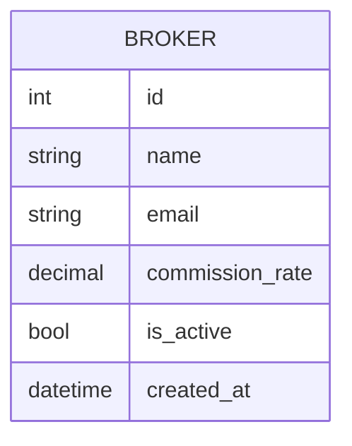
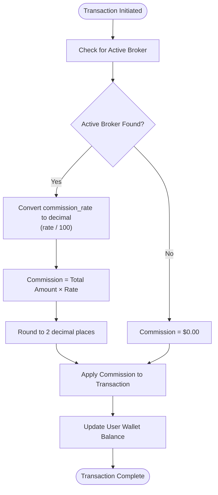
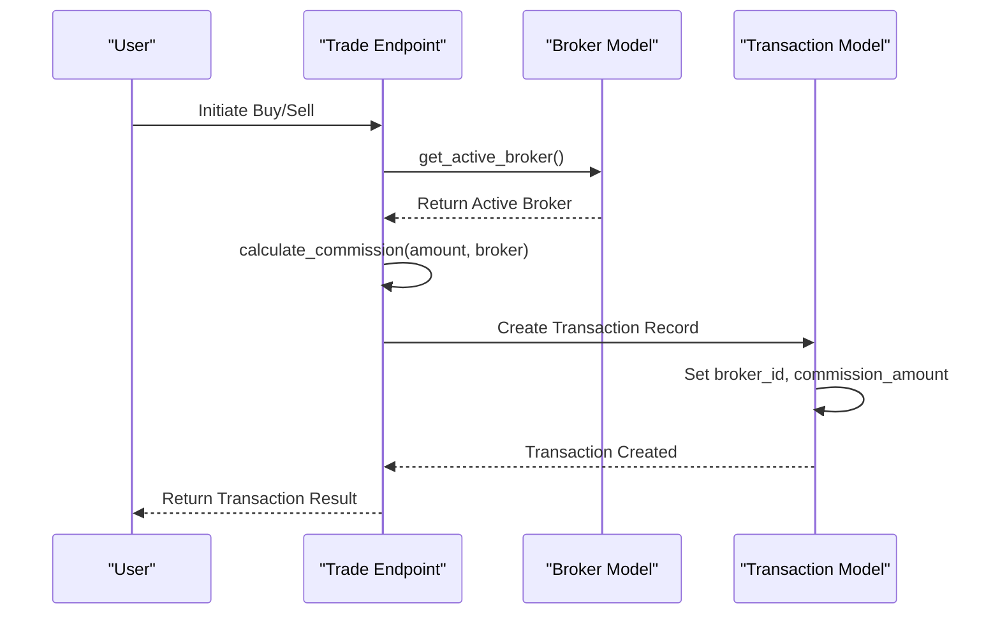
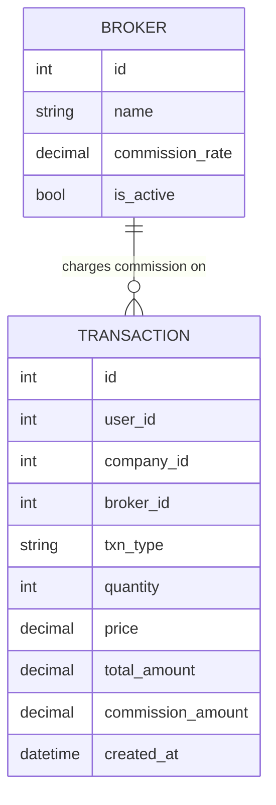
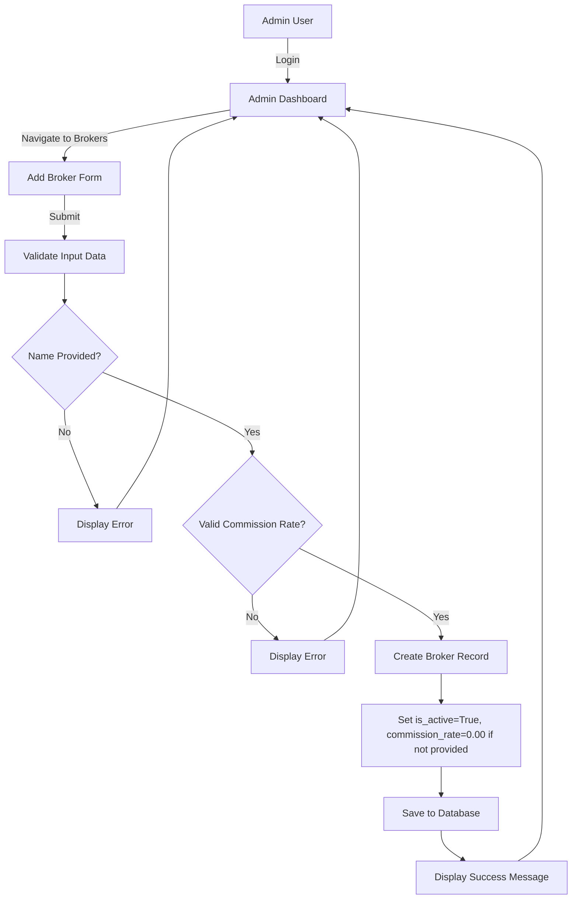
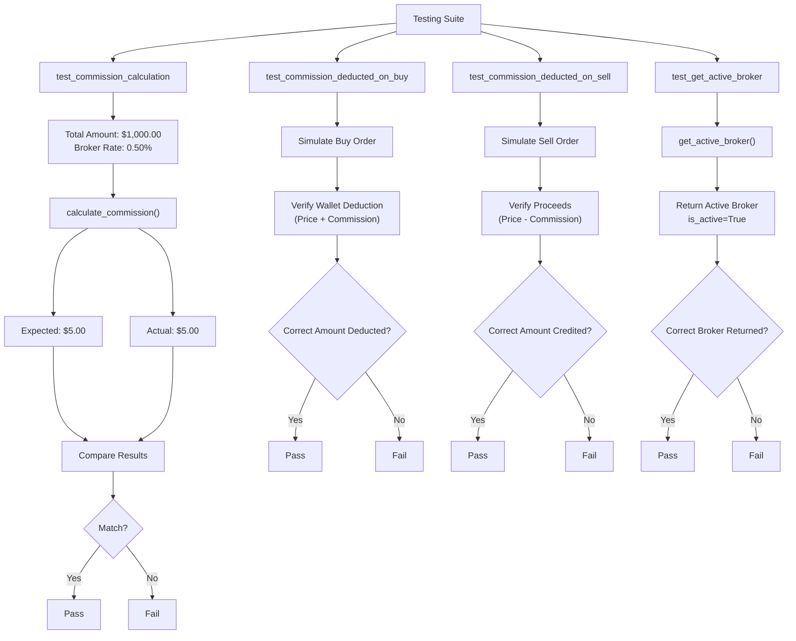

# Broker Model

<cite>
**Referenced Files in This Document**   
- [main.py](file://main.py)
- [test_trading_operations.py](file://tests/test_trading_operations.py)
- [conftest.py](file://tests/conftest.py)
- [test_database_models.py](file://tests/test_database_models.py)
</cite>

## Table of Contents
1. [Introduction](#introduction)
2. [Broker Model Attributes](#broker-model-attributes)
3. [Commission Calculation](#commission-calculation)
4. [Active Broker Management](#active-broker-management)
5. [Relationship with Transaction Model](#relationship-with-transaction-model)
6. [Broker Creation and Administration](#broker-creation-and-administration)
7. [Business Rules and Constraints](#business-rules-and-constraints)
8. [Test Cases and Validation](#test-cases-and-validation)
9. [Conclusion](#conclusion)

## Introduction
The Broker model in the intelligent stock prediction system represents brokerage firms that charge commissions on trading activities. This model plays a critical role in calculating trading costs and supports multiple brokerage configurations within the application. The broker's commission structure is applied during buy and sell operations, with commissions recorded in transaction records. The system ensures only one active broker is used at a time for commission calculations, providing a flexible framework for simulating different brokerage fee structures in the trading environment.

**Section sources**
- [main.py](file://main.py#L75-L81)

## Broker Model Attributes
The Broker model contains essential attributes that define a brokerage firm's characteristics and commission structure:

- **id**: Integer, primary key that uniquely identifies each broker in the system
- **name**: String (255 characters), required field containing the broker's name
- **email**: String (255 characters), optional contact email for the broker
- **commission_rate**: Numeric (5,2), required decimal field representing the commission percentage (e.g., 0.50 for 0.50%)
- **is_active**: Boolean, flag indicating whether the broker is currently active (default: True)
- **created_at**: DateTime, timestamp when the broker record was created

The commission_rate field uses a precision of 5 digits with 2 decimal places, allowing rates from 0.00% to 99.99%. The is_active field serves as a soft delete mechanism and determines which broker's commission rates are applied to trading operations. When a broker is created, the is_active field defaults to True, and the commission_rate defaults to 0 if not specified.

**Diagram sources**
- [main.py](file://main.py#L75-L81)
- [docs/diagrams/er_diagram.md](file://docs/diagrams/er_diagram.md#L22-L27)

**Section sources**
- [main.py](file://main.py#L75-L81)
- [test_database_models.py](file://tests/test_database_models.py#L158-L192)

## Commission Calculation
The system calculates commissions based on the broker's commission_rate applied to the total transaction amount. The calculate_commission function converts the percentage rate to a decimal by dividing by 100, then multiplies it by the total transaction amount. The result is quantized to two decimal places to represent currency values accurately.

For example, with a broker having a 0.50% commission rate and a transaction amount of $1,000.00, the commission would be calculated as $5.00. The commission is deducted from the user's wallet balance on buy operations (reducing the available funds) and deducted from the proceeds on sell operations (reducing the amount credited to the wallet).

The commission calculation is applied to both buy and sell transactions, ensuring realistic trading cost simulation. The calculated commission amount is stored in the Transaction model's commission_amount field and included in the transaction description for transparency.

**Diagram sources**
- [main.py](file://main.py#L176-L184)
- [test_trading_operations.py](file://tests/test_trading_operations.py#L209-L232)

**Section sources**
- [main.py](file://main.py#L176-L184)
- [test_trading_operations.py](file://tests/test_trading_operations.py#L209-L232)

## Active Broker Management
The system implements a singleton pattern for active brokers through the get_active_broker function, which queries for brokers where is_active equals True and returns the first result ordered by ID. This ensures that only one active broker's commission rates are applied to trading operations at any given time.

When multiple brokers have is_active set to True, the system uses the one with the lowest ID value, providing deterministic behavior. This design allows administrators to maintain multiple broker configurations while ensuring consistent commission application. The active broker selection occurs at the beginning of both buy and sell transaction processing, retrieving the current active broker before calculating commissions.

The active broker information is stored in each transaction record via the broker_id foreign key, creating an audit trail of which broker's commission structure was applied to each trade. This allows historical analysis of trading costs under different brokerage configurations.

**Diagram sources**
- [main.py](file://main.py#L172-L173)
- [main.py](file://main.py#L268-L375)
- [test_trading_operations.py](file://tests/test_trading_operations.py#L271-L279)

**Section sources**
- [main.py](file://main.py#L172-L173)
- [main.py](file://main.py#L290-L292)
- [test_trading_operations.py](file://tests/test_trading_operations.py#L271-L279)

## Relationship with Transaction Model
The Broker model has a one-to-many relationship with the Transaction model, where each broker can be associated with multiple transactions, but each transaction is linked to only one broker. This relationship is established through the broker_id foreign key in the Transaction model that references the Broker model's id field.

When a buy or sell transaction is executed, the system records the active broker's ID in the transaction record, along with the calculated commission amount. This creates a complete audit trail showing which broker's commission structure was applied to each trade. The relationship enables reporting and analytics on trading activity by broker, allowing users and administrators to analyze commission costs over time.

The transaction description field includes the broker's name and commission rate, providing transparency to users about the fees applied to their trades. For example, a transaction description might read "Simulated buy order via Test Broker (0.50% commission)" to clearly communicate the brokerage fees.

**Diagram sources**
- [main.py](file://main.py#L75-L81)
- [main.py](file://main.py#L94-L108)
- [docs/diagrams/er_diagram.md](file://docs/diagrams/er_diagram.md#L22-L27)

**Section sources**
- [main.py](file://main.py#L94-L108)
- [test_trading_operations.py](file://tests/test_trading_operations.py#L280-L289)

## Broker Creation and Administration
Brokers are created through an administrative interface accessible only to users with admin privileges. The admin_add_broker route handles POST requests containing the broker's name, email, and commission_rate. The system validates that the name field is provided and that the commission_rate is a valid non-negative number before creating the broker record.

When a new broker is created, it is automatically set as active (is_active=True) unless otherwise specified. The administrative dashboard displays all brokers with their name, email, commission rate, and active status, allowing administrators to view and manage multiple brokerage configurations.

The system supports multiple brokers in the database, but only one can be active at a time for commission calculations. This allows administrators to maintain different brokerage profiles (e.g., different commission structures for various account types) while ensuring consistent fee application during trading.

**Diagram sources**
- [main.py](file://main.py#L492-L514)
- [templates/admin_dashboard.html](file://templates/admin_dashboard.html#L148-L158)

**Section sources**
- [main.py](file://main.py#L492-L514)
- [templates/admin_dashboard.html](file://templates/admin_dashboard.html#L148-L158)

## Business Rules and Constraints
The Broker model enforces several business rules to ensure data integrity and proper system operation:

1. **Single Active Broker Rule**: The system assumes only one active broker at a time for commission calculations, enforced through the get_active_broker function which returns only the first active broker found.

2. **Commission Rate Constraints**: The commission_rate field is defined as non-negative with a default value of 0, preventing negative commission rates that would effectively pay users to trade.

3. **Required Name Field**: The name field is required (nullable=False), ensuring every broker has a descriptive name for identification in transaction records and the admin interface.

4. **Active Status Default**: New brokers are created with is_active=True by default, making them immediately available for commission calculations unless explicitly set otherwise.

5. **Decimal Precision**: The commission_rate uses NUMERIC(5,2) precision, limiting rates to two decimal places and a maximum of 99.99%, which aligns with typical brokerage fee structures.

These business rules ensure the system maintains realistic brokerage configurations and prevents invalid data that could lead to incorrect commission calculations or system errors.

**Section sources**
- [main.py](file://main.py#L75-L81)
- [main.py](file://main.py#L172-L173)
- [test_database_models.py](file://tests/test_database_models.py#L158-L192)

## Test Cases and Validation
The system includes comprehensive test cases to validate the Broker model's functionality and ensure proper commission application. The test_trading_operations.py file contains tests that verify commission calculations, active broker selection, and transaction recording.

Key test cases include:
- Verification that commission is correctly calculated based on the active broker's commission_rate
- Confirmation that commissions are deducted from user wallet balances on both buy and sell operations
- Validation that transaction records include the correct broker_id and commission_amount
- Testing of edge cases such as zero commission rates and high-value transactions
- Ensuring the get_active_broker function returns the correct active broker

The test suite uses sample data with known commission rates (e.g., 0.50%) and transaction amounts to verify that the calculated commissions match expected values. Tests also validate that when no active broker exists, the system handles the scenario appropriately, typically by applying zero commission.

These tests ensure the reliability of the commission calculation system and provide confidence that trading costs are accurately reflected in the simulation environment.

**Diagram sources**
- [test_trading_operations.py](file://tests/test_trading_operations.py#L206-L267)
- [conftest.py](file://tests/conftest.py#L100-L111)

**Section sources**
- [test_trading_operations.py](file://tests/test_trading_operations.py#L206-L267)
- [conftest.py](file://tests/conftest.py#L100-L111)

## Conclusion
The Broker model serves as a critical component in the intelligent stock prediction system, enabling realistic simulation of brokerage fees in trading operations. By supporting configurable commission rates and multiple brokerage profiles, the system provides flexibility for users to model different trading cost scenarios. The tight integration with the Transaction model ensures accurate tracking of commissions, while the active broker management system maintains consistency in fee application. Comprehensive testing validates the correctness of commission calculations and edge cases, ensuring reliable operation of the trading simulation. This model enhances the realism of the stock prediction environment by accounting for one of the key costs associated with actual trading activities.