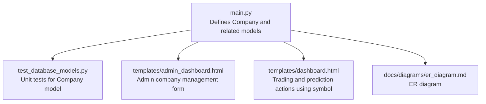
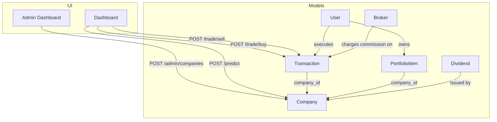
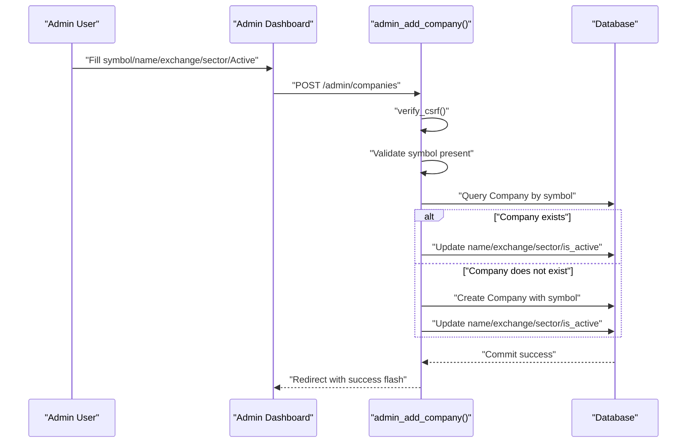
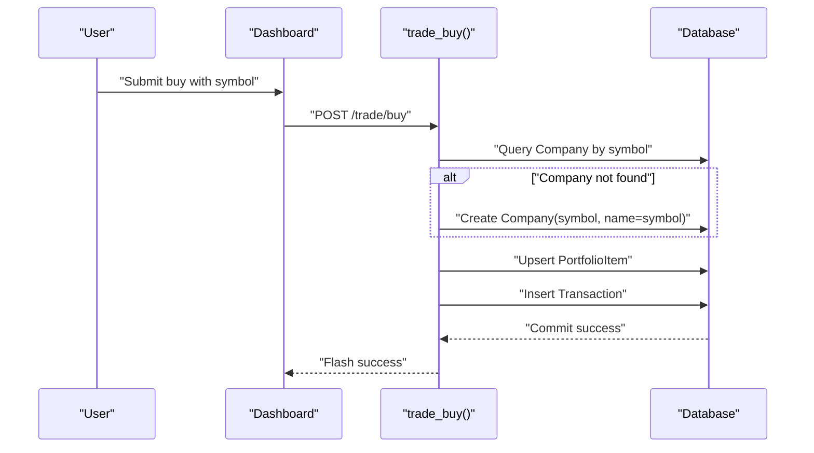
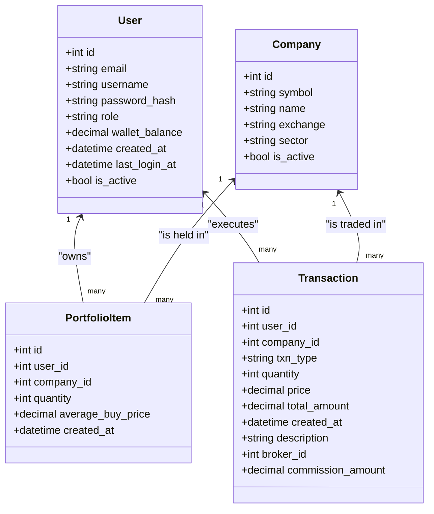
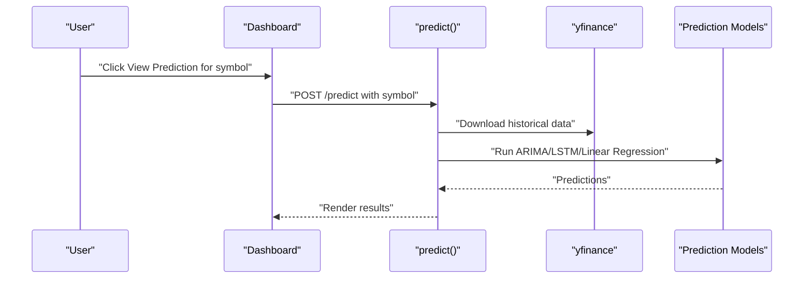
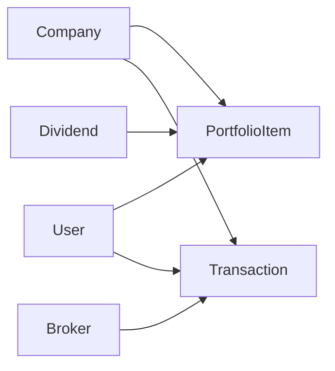

# Company Model

<cite>
**Referenced Files in This Document**
- [main.py](file://main.py)
- [test_database_models.py](file://tests/test_database_models.py)
- [admin_dashboard.html](file://templates/admin_dashboard.html)
- [dashboard.html](file://templates/dashboard.html)
- [er_diagram.md](file://docs/diagrams/er_diagram.md)
</cite>

## Table of Contents
1. [Introduction](#introduction)
2. [Project Structure](#project-structure)
3. [Core Components](#core-components)
4. [Architecture Overview](#architecture-overview)
5. [Detailed Component Analysis](#detailed-component-analysis)
6. [Dependency Analysis](#dependency-analysis)
7. [Performance Considerations](#performance-considerations)
8. [Troubleshooting Guide](#troubleshooting-guide)
9. [Conclusion](#conclusion)

## Introduction
This document provides comprehensive data model documentation for the Company model. It details attributes, data types, constraints, and the unique constraint on the stock symbol. It explains how the Company model serves as the primary identifier for financial instruments and documents its relationships with PortfolioItem and Transaction models. It also covers how company metadata (exchange, sector) supports portfolio analysis and reporting, the role of the is_active flag in controlling trading availability, and demonstrates proper instantiation and validation rules using test_database_models.py. Finally, it outlines how the Company model integrates with admin workflows and prediction workflows.

## Project Structure
The Company model is defined in the main application module alongside other SQLAlchemy models. Tests validate model behavior and constraints. The admin interface exposes a form to manage company records, and the dashboard integrates company symbols into trading and prediction workflows.

**Diagram sources**
- [main.py](file://main.py#L66-L120)
- [test_database_models.py](file://tests/test_database_models.py#L115-L155)
- [admin_dashboard.html](file://templates/admin_dashboard.html#L230-L266)
- [dashboard.html](file://templates/dashboard.html#L162-L176)
- [er_diagram.md](file://docs/diagrams/er_diagram.md#L1-L68)

**Section sources**
- [main.py](file://main.py#L66-L120)
- [test_database_models.py](file://tests/test_database_models.py#L115-L155)
- [admin_dashboard.html](file://templates/admin_dashboard.html#L230-L266)
- [dashboard.html](file://templates/dashboard.html#L162-L176)
- [er_diagram.md](file://docs/diagrams/er_diagram.md#L1-L68)

## Core Components
- Company model fields and constraints:
  - id: Integer, primary key
  - symbol: String up to 16 characters, unique and not null
  - name: String up to 255 characters
  - exchange: String up to 64 characters
  - sector: String up to 128 characters
  - is_active: Boolean, defaults to True

- Unique constraint on symbol:
  - The symbol field is unique and not null, enforcing that each stock symbol maps to a single Company record. This makes symbol the primary identifier for financial instruments in the system.

- Default values:
  - is_active defaults to True for new Company instances.

- Relationships:
  - PortfolioItem has foreign keys to Company (company_id).
  - Transaction has foreign keys to Company (company_id).
  - Company participates in ER relationships with PortfolioItem and Transaction.

**Section sources**
- [main.py](file://main.py#L66-L73)
- [er_diagram.md](file://docs/diagrams/er_diagram.md#L1-L68)

## Architecture Overview
The Company model underpins trading operations and analytics. Users initiate trades and predictions using a stock symbol. The system resolves the symbol to a Company record, enabling portfolio tracking and transaction logging. Admins can manage company metadata and availability via the admin dashboard.

**Diagram sources**
- [main.py](file://main.py#L66-L120)
- [admin_dashboard.html](file://templates/admin_dashboard.html#L230-L266)
- [dashboard.html](file://templates/dashboard.html#L162-L176)

## Detailed Component Analysis

### Company Model Definition and Constraints
- Attributes and types:
  - id: Integer (primary key)
  - symbol: String(16), unique, not null
  - name: String(255)
  - exchange: String(64)
  - sector: String(128)
  - is_active: Boolean, default True

- Unique constraint rationale:
  - Ensures each symbol maps to a single Company record, preventing ambiguity in trading and analytics.

- Default behavior:
  - is_active defaults to True, indicating newly created companies are eligible for trading until explicitly deactivated.

- Validation rules evidenced by tests:
  - Creation with all required fields succeeds.
  - Duplicate symbol raises an integrity error.
  - Default is_active is True when not explicitly set.

**Section sources**
- [main.py](file://main.py#L66-L73)
- [test_database_models.py](file://tests/test_database_models.py#L118-L155)

### Admin Interface for Company Creation and Updates
- Admin form fields:
  - Symbol (required)
  - Name
  - Exchange
  - Sector
  - Active checkbox (defaults checked)

- Backend route behavior:
  - Validates presence of symbol.
  - Retrieves or creates a Company by symbol.
  - Updates name, exchange, sector, and is_active based on form inputs.
  - Commits changes to the database.

- Security:
  - Uses CSRF protection via verify_csrf.

- Example snippet paths:
  - Admin form rendering: [admin_dashboard.html](file://templates/admin_dashboard.html#L230-L266)
  - Admin route handler: [main.py](file://main.py#L517-L539)

**Diagram sources**
- [admin_dashboard.html](file://templates/admin_dashboard.html#L230-L266)
- [main.py](file://main.py#L517-L539)

**Section sources**
- [admin_dashboard.html](file://templates/admin_dashboard.html#L230-L266)
- [main.py](file://main.py#L517-L539)

### Symbol Validation and Usage in Trading Workflows
- Symbol validation:
  - Admin requires symbol presence.
  - Tests enforce uniqueness; duplicate symbol triggers an integrity error.
  - Default is_active is True.

- Trading operations:
  - Buy/Sell routes accept a symbol, resolve to a Company, and create PortfolioItem and Transaction entries.
  - If a symbol does not exist, the system creates a minimal Company record with symbol and name derived from symbol.

- Example snippet paths:
  - Buy flow symbol resolution and auto-create: [main.py](file://main.py#L286-L301)
  - Sell flow symbol resolution and validation: [main.py](file://main.py#L342-L349)
  - Dashboard symbol propagation to prediction: [dashboard.html](file://templates/dashboard.html#L172-L176)

**Diagram sources**
- [main.py](file://main.py#L286-L301)
- [dashboard.html](file://templates/dashboard.html#L162-L176)

**Section sources**
- [main.py](file://main.py#L286-L301)
- [main.py](file://main.py#L342-L349)
- [dashboard.html](file://templates/dashboard.html#L162-L176)
- [test_database_models.py](file://tests/test_database_models.py#L137-L148)

### Relationship Between Company and PortfolioItem/Transaction
- Foreign key relationships:
  - PortfolioItem.company_id references Company.id
  - Transaction.company_id references Company.id

- Backrefs:
  - PortfolioItem defines a relationship to Company
  - Transaction defines a relationship to Company

- Test evidence:
  - PortfolioItem relationships validated by accessing user and company attributes.
  - Transaction relationships validated by accessing user, company, and broker attributes.

**Diagram sources**
- [main.py](file://main.py#L66-L120)
- [er_diagram.md](file://docs/diagrams/er_diagram.md#L1-L68)

**Section sources**
- [main.py](file://main.py#L83-L109)
- [test_database_models.py](file://tests/test_database_models.py#L195-L229)
- [test_database_models.py](file://tests/test_database_models.py#L249-L296)
- [er_diagram.md](file://docs/diagrams/er_diagram.md#L1-L68)

### Company Metadata for Portfolio Analysis and Reporting
- Exchange and sector fields enable categorization and aggregation:
  - Exchange can be used to group by venue.
  - Sector enables industry-level reporting and allocation analysis.

- Admin dashboard aggregates transaction metrics by symbol, leveraging Company.symbol for labeling and grouping.

- Example snippet paths:
  - Admin dashboard symbol totals aggregation: [main.py](file://main.py#L436-L490)

**Section sources**
- [main.py](file://main.py#L436-L490)
- [main.py](file://main.py#L66-L73)

### is_active Flag and Trading Availability
- Purpose:
  - Controls whether a company is considered available for trading. While the provided code does not explicitly filter by is_active in trading routes, the flag exists to support future or custom logic that could restrict trading for inactive companies.

- Default:
  - New companies default to is_active=True.

- Example snippet paths:
  - Company default is_active: [main.py](file://main.py#L66-L73)
  - Test asserting default is_active: [test_database_models.py](file://tests/test_database_models.py#L149-L155)

**Section sources**
- [main.py](file://main.py#L66-L73)
- [test_database_models.py](file://tests/test_database_models.py#L149-L155)

### Proper Instantiation and Validation Rules (Using test_database_models.py)
- Creating a Company with required fields passes assertions.
- Attempting to create a duplicate symbol raises an integrity error.
- Default is_active is True when not explicitly set.

- Example snippet paths:
  - Company creation test: [test_database_models.py](file://tests/test_database_models.py#L118-L136)
  - Unique symbol test: [test_database_models.py](file://tests/test_database_models.py#L137-L148)
  - Default is_active test: [test_database_models.py](file://tests/test_database_models.py#L149-L155)

**Section sources**
- [test_database_models.py](file://tests/test_database_models.py#L118-L155)

### Usage in Stock Prediction Workflows
- The dashboard allows users to request predictions for a given symbol. The prediction endpoint uses the symbol to fetch historical data and compute forecasts.

- Example snippet paths:
  - Dashboard symbol propagation to prediction: [dashboard.html](file://templates/dashboard.html#L172-L176)
  - Prediction route and symbol handling: [main.py](file://main.py#L545-L582)

**Diagram sources**
- [dashboard.html](file://templates/dashboard.html#L172-L176)
- [main.py](file://main.py#L545-L582)

**Section sources**
- [dashboard.html](file://templates/dashboard.html#L172-L176)
- [main.py](file://main.py#L545-L582)

## Dependency Analysis
- Internal dependencies:
  - Company is referenced by PortfolioItem and Transaction via foreign keys.
  - Relationships are defined in the model definitions.

- External dependencies:
  - Trading and prediction rely on external market data providers (yfinance) for price data.

- Admin and UI dependencies:
  - Admin dashboard form posts to admin_add_company route.
  - Dashboard forms post to trade and prediction routes.

**Diagram sources**
- [main.py](file://main.py#L66-L120)
- [er_diagram.md](file://docs/diagrams/er_diagram.md#L1-L68)

**Section sources**
- [main.py](file://main.py#L66-L120)
- [er_diagram.md](file://docs/diagrams/er_diagram.md#L1-L68)

## Performance Considerations
- Indexing:
  - The unique constraint on symbol implies an index; ensure appropriate indexing for frequent symbol lookups in trading and prediction workflows.

- Query patterns:
  - Frequent lookups by symbol should leverage the unique index.
  - Aggregation by symbol in admin dashboards benefits from indexed symbol fields.

- Data size:
  - Company metadata (name, exchange, sector) is relatively small; keep these fields normalized to reduce duplication.

[No sources needed since this section provides general guidance]

## Troubleshooting Guide
- IntegrityError on symbol duplication:
  - Symptom: Inserting a second Company with an existing symbol fails.
  - Resolution: Ensure symbol uniqueness before insert or update.

- Missing symbol in trading:
  - Symptom: Buy/Sell fails due to missing symbol.
  - Resolution: Provide a valid symbol; the system auto-creates a Company if it does not exist.

- Unexpected inactive company:
  - Symptom: Company appears in reports but is not tradable.
  - Resolution: Verify is_active flag; set to True if intended for trading.

- Example snippet paths:
  - Symbol uniqueness test: [test_database_models.py](file://tests/test_database_models.py#L137-L148)
  - Auto-create on buy: [main.py](file://main.py#L296-L301)

**Section sources**
- [test_database_models.py](file://tests/test_database_models.py#L137-L148)
- [main.py](file://main.py#L296-L301)

## Conclusion
The Company model defines the core identity for financial instruments with a unique symbol serving as the primary key. Its attributes (symbol, name, exchange, sector, is_active) support trading, portfolio tracking, and reporting. The model’s relationships with PortfolioItem and Transaction enable robust portfolio management, while the admin interface and dashboard integrate symbol-based workflows for trading and prediction. Tests validate instantiation, uniqueness, and defaults, ensuring reliable behavior across the system.