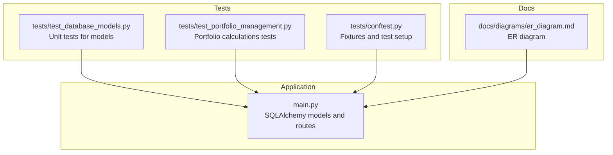
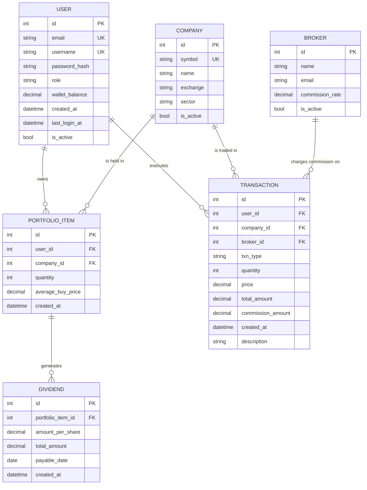
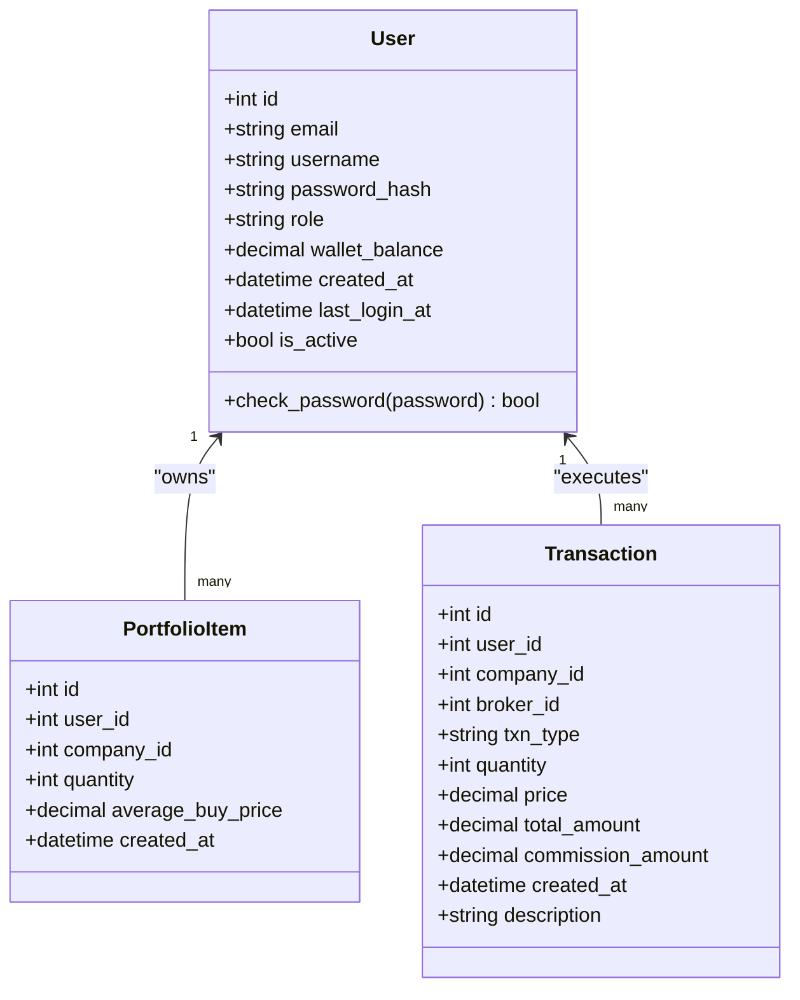
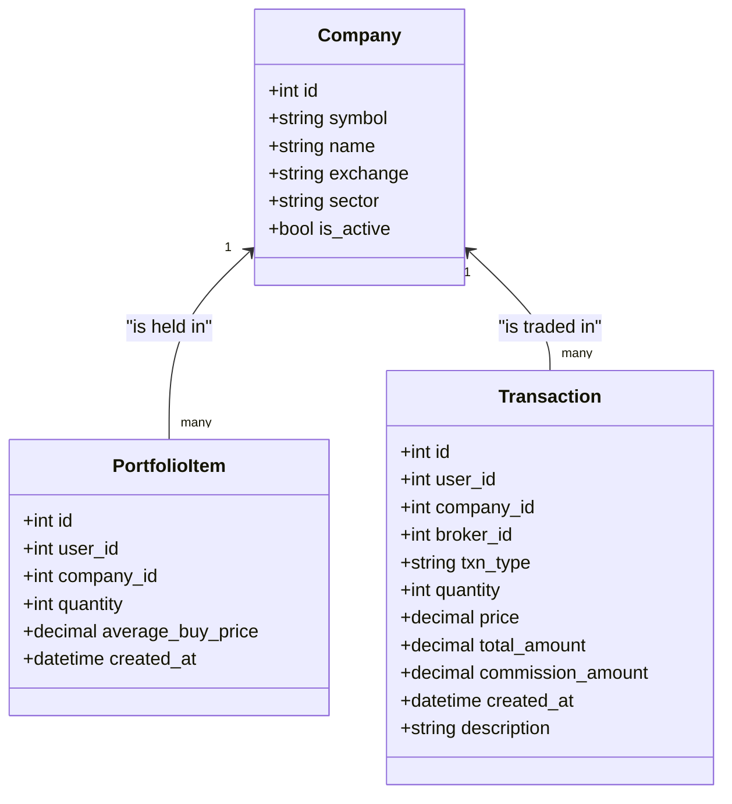
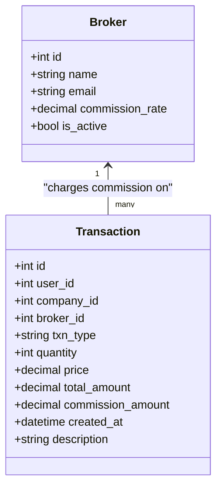
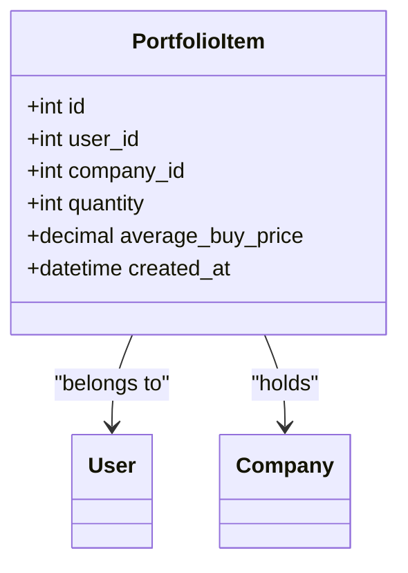
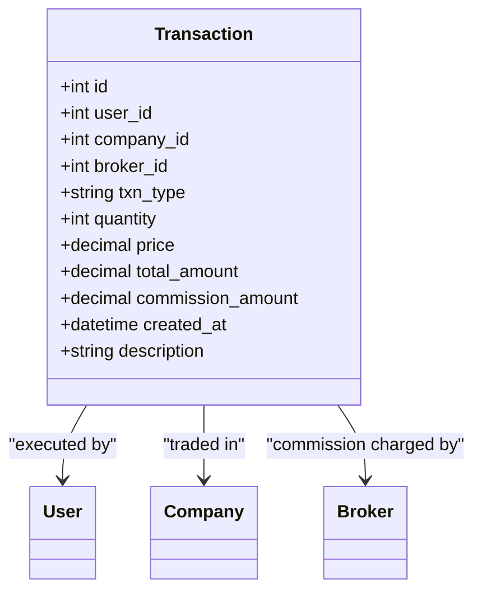
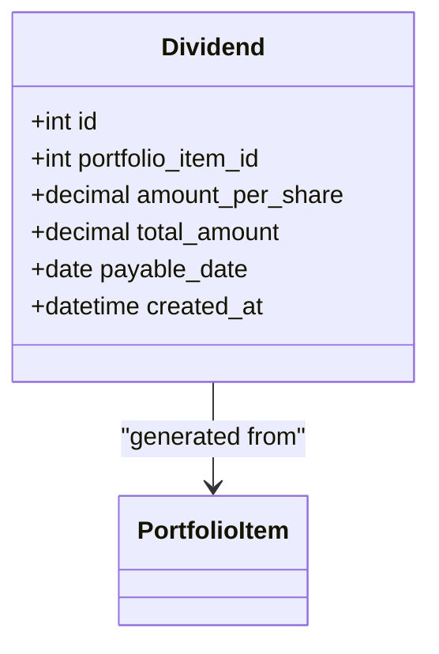
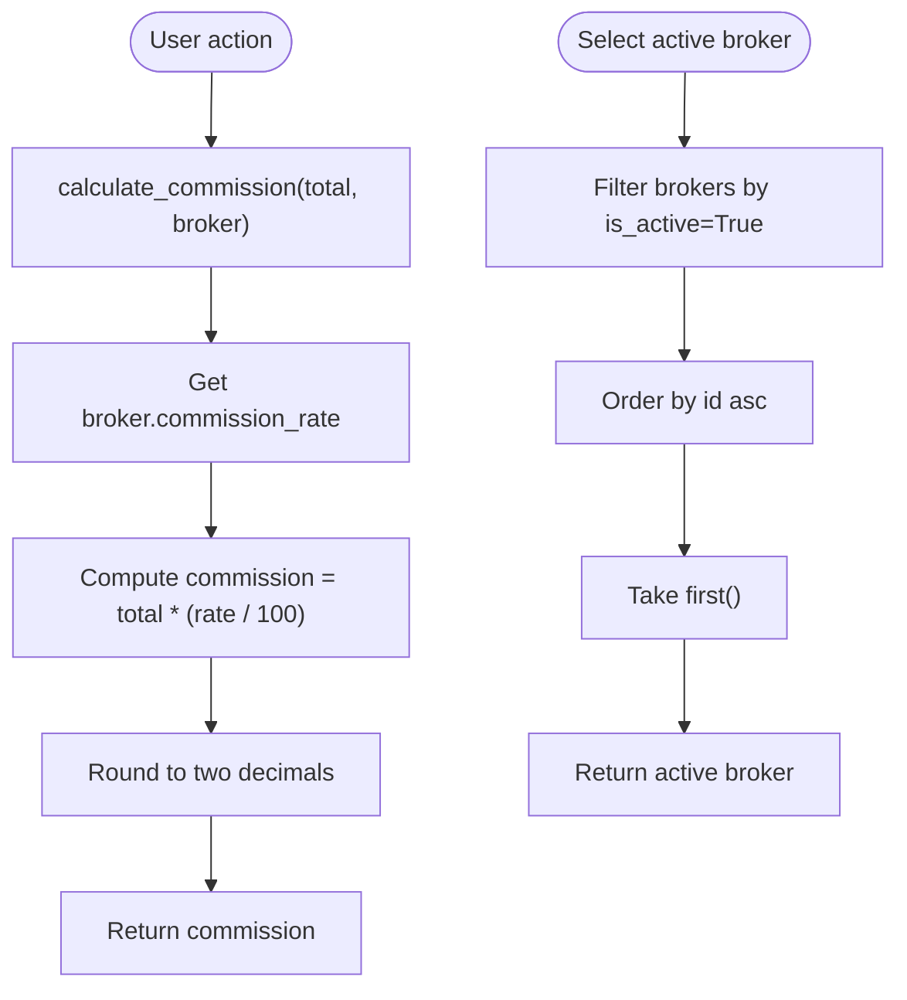
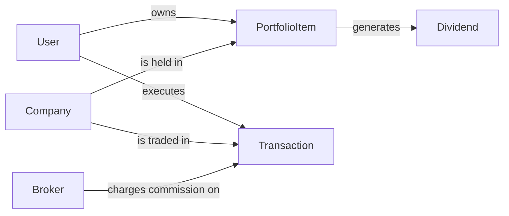

# Data Models & ORM

<cite>
**Referenced Files in This Document**
- [main.py](file://main.py)
- [tests/test_database_models.py](file://tests/test_database_models.py)
- [tests/conftest.py](file://tests/conftest.py)
- [docs/diagrams/er_diagram.md](file://docs/diagrams/er_diagram.md)
- [tests/test_portfolio_management.py](file://tests/test_portfolio_management.py)
</cite>

## Table of Contents
1. [Introduction](#introduction)
2. [Project Structure](#project-structure)
3. [Core Components](#core-components)
4. [Architecture Overview](#architecture-overview)
5. [Detailed Component Analysis](#detailed-component-analysis)
6. [Dependency Analysis](#dependency-analysis)
7. [Performance Considerations](#performance-considerations)
8. [Troubleshooting Guide](#troubleshooting-guide)
9. [Conclusion](#conclusion)
10. [Appendices](#appendices)

## Introduction
This document provides comprehensive data model documentation for the SQLAlchemy ORM implementation used in the application. It covers each model class (User, Company, PortfolioItem, Transaction, Dividend, Broker), their attributes, data types, relationships, and methods. It also explains ORM mapping to database tables, relationship loading strategies, query optimization techniques, validation logic, custom methods, and event hooks. The document references test_database_models.py to illustrate expected behavior and edge cases, and includes guidance on preventing N+1 queries, enforcing business rules, and maintaining data integrity across transactions.

## Project Structure
The data models are defined in the main application module and exercised by tests. The ER diagram provides a conceptual overview of entity relationships.

**Diagram sources**
- [main.py](file://main.py#L41-L120)
- [tests/test_database_models.py](file://tests/test_database_models.py#L1-L356)
- [tests/test_portfolio_management.py](file://tests/test_portfolio_management.py#L162-L236)
- [tests/conftest.py](file://tests/conftest.py#L1-L273)
- [docs/diagrams/er_diagram.md](file://docs/diagrams/er_diagram.md#L1-L68)

**Section sources**
- [main.py](file://main.py#L41-L120)
- [tests/test_database_models.py](file://tests/test_database_models.py#L1-L356)
- [tests/test_portfolio_management.py](file://tests/test_portfolio_management.py#L162-L236)
- [tests/conftest.py](file://tests/conftest.py#L1-L273)
- [docs/diagrams/er_diagram.md](file://docs/diagrams/er_diagram.md#L1-L68)

## Core Components
This section documents each model’s ORM mapping, attributes, defaults, constraints, and relationships.

- User
  - Attributes and types:
    - id: Integer, primary key
    - email: String(255), unique, not null
    - username: String(64), unique, not null
    - password_hash: String(255), not null
    - role: String(20), not null, default "user"
    - wallet_balance: Numeric(12,2), not null, default 0
    - created_at: DateTime, default UTC now
    - last_login_at: DateTime
    - is_active: Boolean, default True
  - Methods:
    - check_password(password): Verifies password hash
  - Defaults and constraints:
    - Unique constraints on email and username enforced at DB level
    - NOT NULL constraints on email, username, password_hash
    - Default values for role, wallet_balance, is_active
  - Relationship:
    - Backref portfolio_items and transactions (see below)

- Company
  - Attributes and types:
    - id: Integer, primary key
    - symbol: String(16), unique, not null
    - name: String(255)
    - exchange: String(64)
    - sector: String(128)
    - is_active: Boolean, default True
  - Constraints:
    - Unique constraint on symbol
    - Default is_active True

- Broker
  - Attributes and types:
    - id: Integer, primary key
    - name: String(255), not null
    - email: String(255)
    - commission_rate: Numeric(5,2), not null, default 0
    - is_active: Boolean, default True
  - Defaults:
    - commission_rate default 0

- PortfolioItem
  - Attributes and types:
    - id: Integer, primary key
    - user_id: Integer, foreign key to User.id, not null
    - company_id: Integer, foreign key to Company.id, not null
    - quantity: Integer, not null, default 0
    - average_buy_price: Numeric(12,2), not null, default 0
    - created_at: DateTime, default UTC now
  - Relationships:
    - user: relationship to User with backref portfolio_items and lazy loading
    - company: relationship to Company
  - Cascade behavior:
    - Deleting a User cascades deletes PortfolioItem records (verified by tests)

- Transaction
  - Attributes and types:
    - id: Integer, primary key
    - user_id: Integer, foreign key to User.id, not null
    - company_id: Integer, foreign key to Company.id, not null
    - txn_type: String(16), not null
    - quantity: Integer, not null
    - price: Numeric(12,2), not null
    - total_amount: Numeric(12,2), not null
    - created_at: DateTime, default UTC now
    - description: String(255)
    - broker_id: Integer, foreign key to Broker.id
    - commission_amount: Numeric(12,2), not null, default 0
  - Relationships:
    - user: relationship to User with backref transactions and lazy loading
    - company: relationship to Company
    - broker: relationship to Broker

- Dividend
  - Attributes and types:
    - id: Integer, primary key
    - portfolio_item_id: Integer, foreign key to PortfolioItem.id, not null
    - amount_per_share: Numeric(12,4), not null
    - total_amount: Numeric(12,2), not null
    - payable_date: Date
    - created_at: DateTime, default UTC now
  - Relationships:
    - portfolio_item: relationship to PortfolioItem with backref dividends and lazy loading

- Model validation and constraints (from tests):
  - Unique constraints enforced for email, username, and symbol
  - Foreign key constraints enforced (non-existent company in portfolio item creation raises integrity error)
  - NOT NULL constraints enforced (creating user without required fields raises integrity error)

**Section sources**
- [main.py](file://main.py#L51-L119)
- [tests/test_database_models.py](file://tests/test_database_models.py#L15-L356)
- [tests/conftest.py](file://tests/conftest.py#L53-L126)

## Architecture Overview
The data models are mapped to relational tables via SQLAlchemy declarative ORM. Relationships are defined with foreign keys and backrefs. The ER diagram captures entity relationships and cardinalities.

**Diagram sources**
- [docs/diagrams/er_diagram.md](file://docs/diagrams/er_diagram.md#L1-L68)
- [main.py](file://main.py#L51-L119)

**Section sources**
- [docs/diagrams/er_diagram.md](file://docs/diagrams/er_diagram.md#L1-L68)
- [main.py](file://main.py#L51-L119)

## Detailed Component Analysis

### User Model
- Purpose: Represents application users with authentication and wallet balance.
- Key behaviors:
  - Password verification via check_password
  - Default role "user", default wallet_balance 0, default is_active True
- Relationship loading:
  - portfolio_items and transactions are loaded lazily via backrefs
- Business rules:
  - Unique email and username enforced at DB level
  - NOT NULL constraints on email, username, password_hash

**Diagram sources**
- [main.py](file://main.py#L51-L119)

**Section sources**
- [main.py](file://main.py#L51-L64)
- [tests/test_database_models.py](file://tests/test_database_models.py#L15-L114)

### Company Model
- Purpose: Stores company metadata used in trading and analytics.
- Key behaviors:
  - Default is_active True
  - Unique symbol enforced at DB level
- Business rules:
  - Unique symbol constraint
  - NOT NULL fields for symbol

**Diagram sources**
- [main.py](file://main.py#L66-L73)
- [main.py](file://main.py#L83-L119)

**Section sources**
- [main.py](file://main.py#L66-L73)
- [tests/test_database_models.py](file://tests/test_database_models.py#L115-L156)

### Broker Model
- Purpose: Represents brokers used for commission calculation and transaction attribution.
- Key behaviors:
  - Default commission_rate 0
  - Default is_active True
- Business rules:
  - NOT NULL name and commission_rate
  - NOT NULL fields for name and commission_rate

**Diagram sources**
- [main.py](file://main.py#L75-L81)
- [main.py](file://main.py#L94-L109)

**Section sources**
- [main.py](file://main.py#L75-L81)
- [tests/test_database_models.py](file://tests/test_database_models.py#L158-L193)

### PortfolioItem Model
- Purpose: Tracks user holdings of specific companies with cost basis and quantity.
- Key behaviors:
  - Relationships to User and Company
  - Cascading delete when User is deleted
- Business rules:
  - NOT NULL user_id and company_id
  - Defaults for quantity and average_buy_price

**Diagram sources**
- [main.py](file://main.py#L83-L92)
- [main.py](file://main.py#L51-L119)

**Section sources**
- [main.py](file://main.py#L83-L92)
- [tests/test_database_models.py](file://tests/test_database_models.py#L195-L247)

### Transaction Model
- Purpose: Records buy/sell/dividend events with pricing, quantities, and fees.
- Key behaviors:
  - Relationships to User, Company, and Broker
  - NOT NULL fields for user_id, company_id, txn_type, quantity, price, total_amount
- Business rules:
  - Foreign key constraints enforced
  - NOT NULL constraints enforced

**Diagram sources**
- [main.py](file://main.py#L94-L109)
- [main.py](file://main.py#L51-L119)

**Section sources**
- [main.py](file://main.py#L94-L109)
- [tests/test_database_models.py](file://tests/test_database_models.py#L249-L296)

### Dividend Model
- Purpose: Records dividend payouts linked to specific portfolio positions.
- Key behaviors:
  - Relationship to PortfolioItem with backref dividends
  - NOT NULL fields for portfolio_item_id, amount_per_share, total_amount

**Diagram sources**
- [main.py](file://main.py#L111-L119)
- [main.py](file://main.py#L83-L119)

**Section sources**
- [main.py](file://main.py#L111-L119)
- [tests/test_database_models.py](file://tests/test_database_models.py#L298-L330)

### Custom Methods and Event Hooks
- Password hashing and verification:
  - User.check_password uses hashed passwords
- Commission calculation:
  - calculate_commission(total_amount, broker) computes commission based on broker.commission_rate
- Active broker selection:
  - get_active_broker filters active brokers
- CSRF protection and login-required decorators:
  - CSRF token generation and verification
  - Role-based access control helpers

**Diagram sources**
- [main.py](file://main.py#L172-L185)
- [main.py](file://main.py#L172-L174)

**Section sources**
- [main.py](file://main.py#L62-L64)
- [main.py](file://main.py#L172-L185)
- [main.py](file://main.py#L121-L137)

## Dependency Analysis
Relationships and dependencies among models are defined via foreign keys and backrefs. Tests validate referential integrity and cascading behavior.

**Diagram sources**
- [main.py](file://main.py#L51-L119)
- [tests/test_database_models.py](file://tests/test_database_models.py#L195-L247)

**Section sources**
- [main.py](file://main.py#L51-L119)
- [tests/test_database_models.py](file://tests/test_database_models.py#L195-L247)

## Performance Considerations
- Relationship loading strategies:
  - Lazy loading is used by default for relationships (evident from backref lazy=True). This can lead to N+1 queries when iterating related objects without explicit joins.
  - Recommendation: Use joinedload or selectinload for bulk operations to prevent N+1 queries when fetching user portfolios with related entities.
- Query optimization techniques:
  - Use outerjoin or selectinload for fetching PortfolioItem with user and company details in a single pass.
  - Use limit and pagination for listing recent transactions.
  - Use filtered queries with appropriate indexes on frequently queried columns (e.g., user_id, company_id, symbol).
- Indexing:
  - Consider adding indexes on:
    - User.email and User.username (already unique)
    - Company.symbol (already unique)
    - PortfolioItem.user_id and PortfolioItem.company_id
    - Transaction.user_id, Transaction.company_id, Transaction.broker_id
    - Dividend.portfolio_item_id
- Avoid N+1 queries:
  - When rendering dashboards, pre-load relationships using joinedload or selectinload.
  - Aggregate statistics (e.g., total commission, transaction counts) should be computed server-side with efficient queries rather than Python loops over large datasets.

[No sources needed since this section provides general guidance]

## Troubleshooting Guide
Common issues and resolutions derived from tests and model constraints:

- Integrity errors on unique constraints:
  - Duplicate email or username for User
  - Duplicate symbol for Company
  - Resolution: Ensure uniqueness before commit; handle exceptions appropriately.
- Integrity errors on foreign keys:
  - Creating PortfolioItem with non-existent company_id
  - Resolution: Validate foreign keys before commit; catch integrity errors.
- Integrity errors on NOT NULL constraints:
  - Creating User without required fields
  - Resolution: Validate presence of required fields before commit.
- Cascading deletes:
  - Deleting a User deletes associated PortfolioItem records
  - Resolution: Confirm cascade behavior is desired; otherwise adjust cascade settings.

**Section sources**
- [tests/test_database_models.py](file://tests/test_database_models.py#L15-L356)

## Conclusion
The SQLAlchemy models define a clear, normalized schema for user accounts, companies, brokers, portfolio holdings, transactions, and dividends. They enforce business rules via unique and foreign key constraints, defaults, and NOT NULL checks. Relationships are established with backrefs and lazy loading. Tests validate model behavior, constraints, and cascading deletes. For production, adopt eager loading strategies to prevent N+1 queries, add targeted indexes, and refine validation and error handling around critical operations like trading and dividend recording.

[No sources needed since this section summarizes without analyzing specific files]

## Appendices

### Common Queries and Workflows
- Getting user portfolio:
  - Fetch PortfolioItem entries for a user and load related Company details using joinedload or selectinload to avoid N+1 queries.
  - Reference: [tests/test_portfolio_management.py](file://tests/test_portfolio_management.py#L162-L236)
- Calculating returns:
  - Compute total invested as sum of average_buy_price × quantity.
  - Compute current value using latest close prices and quantity.
  - Compute percentage return as ((current_value - invested) / invested) × 100.
  - Reference: [tests/test_portfolio_management.py](file://tests/test_portfolio_management.py#L162-L236)
- Recording dividends:
  - Create Dividend linked to a PortfolioItem and update user wallet balance accordingly.
  - Reference: [main.py](file://main.py#L398-L434), [tests/test_database_models.py](file://tests/test_database_models.py#L298-L330)

**Section sources**
- [tests/test_portfolio_management.py](file://tests/test_portfolio_management.py#L162-L236)
- [main.py](file://main.py#L398-L434)
- [tests/test_database_models.py](file://tests/test_database_models.py#L298-L330)