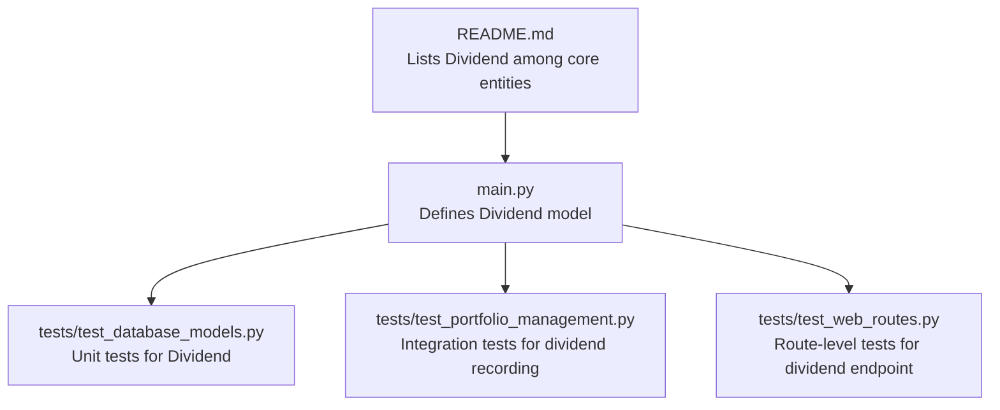
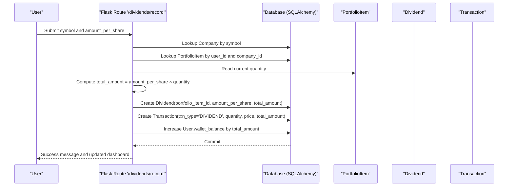
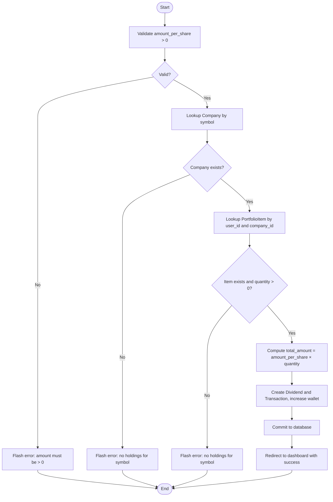
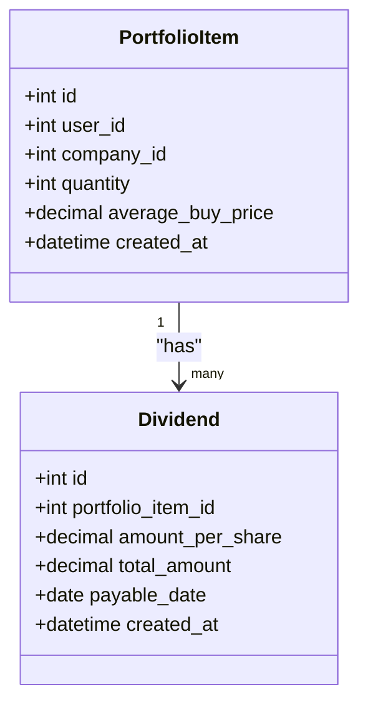
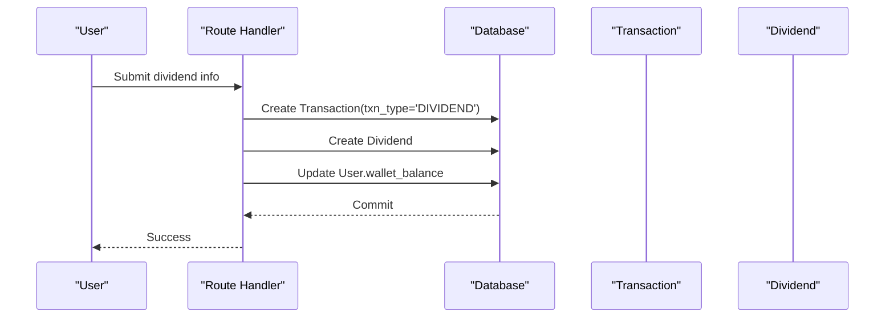
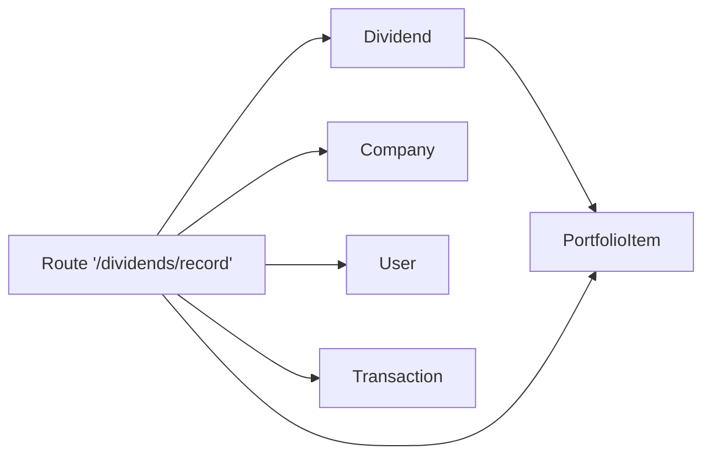

# Dividend Model

<cite>
**Referenced Files in This Document**
- [main.py](file://main.py)
- [tests/test_database_models.py](file://tests/test_database_models.py)
- [tests/test_portfolio_management.py](file://tests/test_portfolio_management.py)
- [tests/test_web_routes.py](file://tests/test_web_routes.py)
- [README.md](file://README.md)
</cite>

## Table of Contents
1. [Introduction](#introduction)
2. [Project Structure](#project-structure)
3. [Core Components](#core-components)
4. [Architecture Overview](#architecture-overview)
5. [Detailed Component Analysis](#detailed-component-analysis)
6. [Dependency Analysis](#dependency-analysis)
7. [Performance Considerations](#performance-considerations)
8. [Troubleshooting Guide](#troubleshooting-guide)
9. [Conclusion](#conclusion)

## Introduction
This document provides comprehensive data model documentation for the Dividend entity. It defines the schema, attributes, constraints, and relationships with PortfolioItem and User, and explains how dividends are recorded and tracked. It also covers the business logic for dividend recording, automatic calculation based on current holdings, and the impact on portfolio valuation and wallet balance. Finally, it demonstrates how to properly associate dividends with portfolio items and illustrates the calculation of total dividend income using the test suite.

## Project Structure
The Dividend model is part of the core data models defined in the main application file and is exercised by unit and integration tests. The application’s README confirms the presence of a Dividend entity in the database schema.

**Diagram sources**
- [main.py](file://main.py#L110-L120)
- [tests/test_database_models.py](file://tests/test_database_models.py#L298-L329)
- [tests/test_portfolio_management.py](file://tests/test_portfolio_management.py#L274-L315)
- [tests/test_web_routes.py](file://tests/test_web_routes.py#L114-L125)
- [README.md](file://README.md#L83-L91)

**Section sources**
- [main.py](file://main.py#L110-L120)
- [README.md](file://README.md#L83-L91)

## Core Components
The Dividend model is defined as a SQLAlchemy ORM class with the following key characteristics:
- Primary key: id (Integer)
- Foreign key: portfolio_item_id (Integer) referencing PortfolioItem.id
- Amount fields:
  - amount_per_share (Numeric with precision/ scale suitable for currency)
  - total_amount (Numeric with precision/ scale suitable for currency)
- Optional date field: payable_date (Date)
- Timestamp: created_at (DateTime)
- Relationship: portfolio_item (backref dividends on PortfolioItem)

Constraints and defaults observed from tests:
- amount_per_share must be positive (validated in route handler)
- total_amount is derived from amount_per_share × quantity at record time
- Dividend records are associated with an existing PortfolioItem (foreign key constraint enforced by database)
- created_at defaults to current UTC time

These attributes enable tracking income from stock holdings, linking each dividend payment to a specific holding position and ensuring accurate wallet crediting and reporting.

**Section sources**
- [main.py](file://main.py#L110-L120)
- [tests/test_database_models.py](file://tests/test_database_models.py#L301-L317)
- [tests/test_portfolio_management.py](file://tests/test_portfolio_management.py#L277-L292)

## Architecture Overview
The Dividend model participates in two primary workflows:
- Admin-driven dividend recording via a web route that validates holdings and computes total_amount
- Automatic calculation of total dividend income by summing Dividend.total_amount across a user’s holdings

**Diagram sources**
- [main.py](file://main.py#L398-L433)
- [tests/test_portfolio_management.py](file://tests/test_portfolio_management.py#L277-L292)

## Detailed Component Analysis

### Data Model Definition and Constraints
- id: Integer, primary key
- portfolio_item_id: Integer, foreign key to PortfolioItem.id; required
- amount_per_share: Numeric; required and validated to be greater than zero
- total_amount: Numeric; required; computed as amount_per_share × PortfolioItem.quantity at record time
- payable_date: Date; optional
- created_at: DateTime; defaults to current UTC time
- Relationship: Dividend.portfolio_item links back to PortfolioItem, enabling access to quantity and company for reporting

Constraints verified by tests:
- Dividend creation succeeds with valid portfolio_item_id, amount_per_share, and total_amount
- Dividend relationship with PortfolioItem exposes quantity for calculations
- Route-level validation rejects invalid amounts and symbols without holdings

**Section sources**
- [main.py](file://main.py#L110-L120)
- [tests/test_database_models.py](file://tests/test_database_models.py#L301-L329)
- [tests/test_portfolio_management.py](file://tests/test_portfolio_management.py#L277-L315)

### Business Logic: Dividend Recording Workflow
- Input validation:
  - Rejects non-positive amount_per_share
  - Requires a valid symbol with existing holdings
- Calculation:
  - total_amount = amount_per_share × current quantity in PortfolioItem
- Persistence:
  - Creates Dividend record linked to PortfolioItem
  - Creates Transaction record with txn_type='DIVIDEND'
  - Credits User.wallet_balance by total_amount
- Feedback:
  - Returns success message and redirects to dashboard

**Diagram sources**
- [main.py](file://main.py#L398-L433)
- [tests/test_portfolio_management.py](file://tests/test_portfolio_management.py#L277-L315)

**Section sources**
- [main.py](file://main.py#L398-L433)
- [tests/test_portfolio_management.py](file://tests/test_portfolio_management.py#L277-L315)

### Relationship with PortfolioItem
- Dividend.portfolio_item_id references PortfolioItem.id
- Dividend.portfolio_item relationship enables:
  - Accessing current quantity for total_amount computation
  - Accessing company information for transaction descriptions
- Tests confirm that Dividend.quantity equals PortfolioItem.quantity at the time of record

**Diagram sources**
- [main.py](file://main.py#L83-L92)
- [main.py](file://main.py#L110-L120)
- [tests/test_database_models.py](file://tests/test_database_models.py#L318-L329)

**Section sources**
- [main.py](file://main.py#L83-L92)
- [main.py](file://main.py#L110-L120)
- [tests/test_database_models.py](file://tests/test_database_models.py#L318-L329)

### Impact on Portfolio Valuation and Wallet Balance
- Wallet balance increases by total_amount upon successful dividend recording
- Dividend records are persisted alongside Transaction records with txn_type='DIVIDEND'
- Historical tracking is achieved via Dividend.created_at and Transaction.created_at timestamps

**Diagram sources**
- [main.py](file://main.py#L398-L433)

**Section sources**
- [main.py](file://main.py#L398-L433)

### Tax Reporting and Historical Tracking
- Dividend records include:
  - amount_per_share and total_amount for income reporting
  - payable_date (optional) for tax year attribution
  - created_at for audit trail
- Transactions with txn_type='DIVIDEND' provide a chronological history of dividend income for reporting purposes

**Section sources**
- [main.py](file://main.py#L110-L120)
- [main.py](file://main.py#L398-L433)

### Example Workflows

#### Admin Interface Dividend Creation
- Use the route handler to record dividends:
  - Endpoint: POST /dividends/record
  - Required fields: symbol, amount_per_share
  - Behavior: Validates holdings, computes total_amount, persists Dividend and Transaction, credits wallet

**Section sources**
- [main.py](file://main.py#L398-L433)
- [tests/test_web_routes.py](file://tests/test_web_routes.py#L114-L125)

#### Automatic Calculation Based on Current Holdings
- Total dividend income for a user can be computed by summing Dividend.total_amount across all dividend records associated with their holdings.

**Section sources**
- [tests/test_portfolio_management.py](file://tests/test_portfolio_management.py#L277-L292)

#### Proper Association with Portfolio Items
- Dividend must be associated with an existing PortfolioItem (same user_id and company_id) and must have quantity > 0 at the time of recording.

**Section sources**
- [tests/test_database_models.py](file://tests/test_database_models.py#L318-L329)
- [tests/test_portfolio_management.py](file://tests/test_portfolio_management.py#L277-L292)

## Dependency Analysis
- Internal dependencies:
  - Dividend depends on PortfolioItem via foreign key
  - Route handler depends on Company, PortfolioItem, and User for validation and persistence
- External dependencies:
  - SQLAlchemy ORM for database operations
  - Flask for routing and session management

**Diagram sources**
- [main.py](file://main.py#L83-L92)
- [main.py](file://main.py#L110-L120)
- [main.py](file://main.py#L398-L433)

**Section sources**
- [main.py](file://main.py#L83-L92)
- [main.py](file://main.py#L110-L120)
- [main.py](file://main.py#L398-L433)

## Performance Considerations
- Dividend creation is a small, single-table write plus a wallet update; negligible overhead.
- For reporting large volumes of dividends, consider indexing:
  - Dividend.portfolio_item_id
  - Dividend.created_at
  - Transaction.user_id and Transaction.txn_type for efficient filtering
- Avoid unnecessary recomputation of total_amount; compute once during recording as implemented.

[No sources needed since this section provides general guidance]

## Troubleshooting Guide
Common issues and resolutions:
- Invalid amount_per_share:
  - Symptom: Error message indicating amount must be greater than zero
  - Cause: Non-positive input
  - Resolution: Enter a positive numeric value
- No holdings for symbol:
  - Symptom: Error message indicating no holdings for symbol
  - Cause: Symbol not associated with user’s PortfolioItem or quantity is zero
  - Resolution: Ensure the user holds shares of the given symbol before recording
- Database integrity errors:
  - Symptom: IntegrityError on creation
  - Cause: Missing or invalid portfolio_item_id
  - Resolution: Confirm the PortfolioItem exists and belongs to the current user

**Section sources**
- [main.py](file://main.py#L408-L433)
- [tests/test_portfolio_management.py](file://tests/test_portfolio_management.py#L293-L315)

## Conclusion
The Dividend model provides a robust foundation for tracking income from stock holdings. Its schema enforces referential integrity via PortfolioItem, supports precise monetary calculations, and integrates seamlessly with the wallet and transaction systems. The route handler ensures safe, validated creation of dividend records, while tests demonstrate correct association with portfolio items and accurate total dividend income computation. These capabilities support both operational tracking and tax reporting needs.