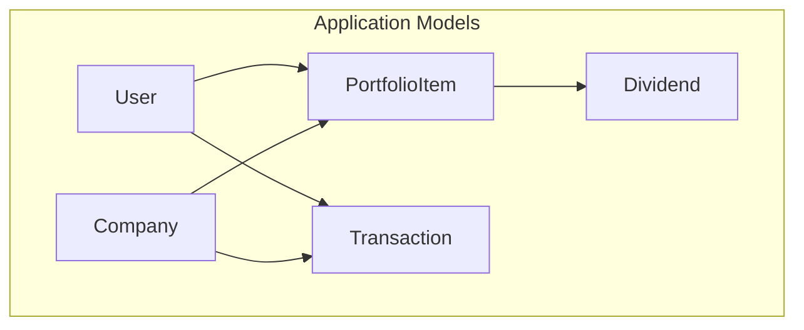
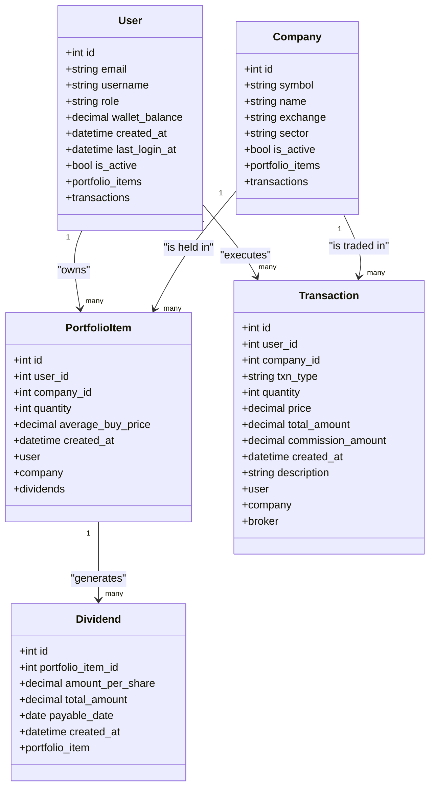
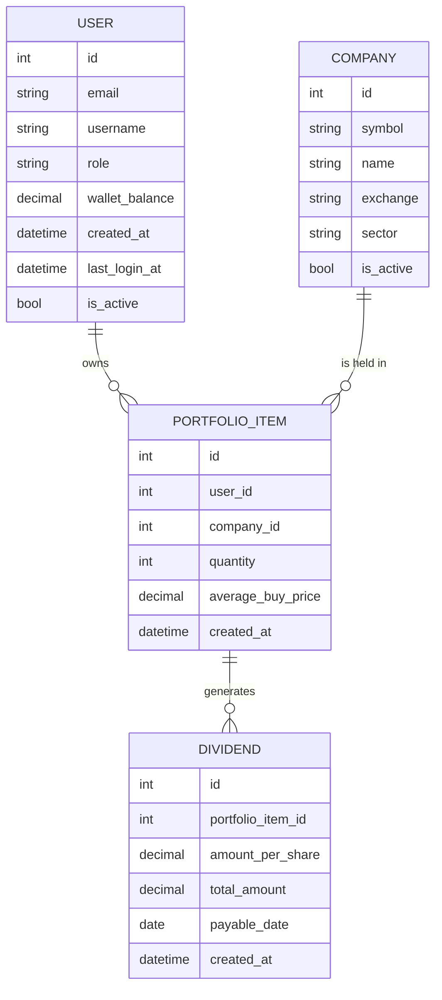

# PortfolioItem Model

<cite>
**Referenced Files in This Document**
- [main.py](file://main.py)
- [test_portfolio_management.py](file://tests/test_portfolio_management.py)
- [test_database_models.py](file://tests/test_database_models.py)
- [conftest.py](file://tests/conftest.py)
- [er_diagram.md](file://docs/diagrams/er_diagram.md)
</cite>

## Table of Contents
1. [Introduction](#introduction)
2. [Project Structure](#project-structure)
3. [Core Components](#core-components)
4. [Architecture Overview](#architecture-overview)
5. [Detailed Component Analysis](#detailed-component-analysis)
6. [Dependency Analysis](#dependency-analysis)
7. [Performance Considerations](#performance-considerations)
8. [Troubleshooting Guide](#troubleshooting-guide)
9. [Conclusion](#conclusion)

## Introduction
This document provides comprehensive data model documentation for the PortfolioItem model, which is the core entity for tracking user holdings in the system. It defines the attributes, constraints, and relationships with User, Company, and Dividend models. It also explains the composite nature of the model as the central representation of current holdings per user per stock, and documents the business logic for average cost basis calculation, total investment tracking, and integration with dividend recording. Finally, it references test coverage that illustrates proper state transitions and edge cases.

## Project Structure
The PortfolioItem model is defined alongside related models in the main application module and is exercised by unit tests that validate creation, updates, deletions, and integrations with transactions and dividends.

**Diagram sources**
- [main.py](file://main.py#L50-L120)
- [er_diagram.md](file://docs/diagrams/er_diagram.md#L1-L68)

**Section sources**
- [main.py](file://main.py#L50-L120)
- [er_diagram.md](file://docs/diagrams/er_diagram.md#L1-L68)

## Core Components
The PortfolioItem model encapsulates a user’s position in a specific company. It maintains:
- id: Primary key identifier
- user_id: Foreign key to User
- company_id: Foreign key to Company
- quantity: Number of shares owned
- average_buy_price: Average cost basis per share
- created_at: Timestamp of creation

Constraints and data types:
- id: Integer, primary key
- user_id: Integer, foreign key to User.id, not null
- company_id: Integer, foreign key to Company.id, not null
- quantity: Integer, not null, default 0
- average_buy_price: Numeric with precision and scale suitable for currency, not null, default 0
- created_at: DateTime, default current UTC time

Relationships:
- Back-reference to User via portfolio_items
- Back-reference to Company via portfolio_items
- One-to-many relationship with Dividend via portfolio_item

Business logic highlights:
- Composite identity: user_id + company_id uniquely identifies a holding position.
- Average cost basis is recalculated on subsequent purchases.
- When quantity reaches zero, the PortfolioItem is removed.
- Total invested is computed as average_buy_price × quantity per holding.

**Section sources**
- [main.py](file://main.py#L83-L92)
- [test_database_models.py](file://tests/test_database_models.py#L195-L229)

## Architecture Overview
PortfolioItem sits at the center of the portfolio tracking architecture, linking users to their holdings and enabling downstream calculations and integrations.

**Diagram sources**
- [main.py](file://main.py#L50-L120)
- [er_diagram.md](file://docs/diagrams/er_diagram.md#L1-L68)

## Detailed Component Analysis

### Data Model Definition and Constraints
- Attributes and types:
  - id: Integer, primary key
  - user_id: Integer, foreign key to User.id, not null
  - company_id: Integer, foreign key to Company.id, not null
  - quantity: Integer, not null, default 0
  - average_buy_price: Numeric with precision and scale suitable for currency, not null, default 0
  - created_at: DateTime, default current UTC time
- Relationships:
  - user: backref to User.portfolio_items
  - company: backref to Company.portfolio_items
  - dividends: backref to Dividend.portfolio_item

These definitions enable:
- Unique composite positions per user-company pair
- Efficient aggregation of total invested and current value
- Clear linkage to dividend records

**Section sources**
- [main.py](file://main.py#L83-L92)
- [test_database_models.py](file://tests/test_database_models.py#L195-L229)

### Relationships with User, Company, and Dividend
- User: PortfolioItem belongs to a single user; user holds many holdings.
- Company: PortfolioItem corresponds to a single company; company has many holdings.
- Dividend: Dividend records link to a specific PortfolioItem; each holding can have many dividend entries.

These relationships support:
- Portfolio aggregation per user
- Cross-company holdings reporting
- Dividend attribution to specific holdings

**Section sources**
- [main.py](file://main.py#L83-L92)
- [test_database_models.py](file://tests/test_database_models.py#L195-L229)

### Business Logic: Average Cost Basis and Total Investment
Average cost basis is recalculated when a user adds more shares:
- New average_buy_price = (old_total_cost + new_purchase_cost) / (old_quantity + new_quantity)
- This ensures accurate cost basis for profit/loss calculations and tax reporting.

Total invested is computed as:
- Sum of (average_buy_price × quantity) across all PortfolioItem records for a user.

The tests validate:
- Recalculation of average buy price on new purchases
- Correct computation of total invested across multiple holdings

**Section sources**
- [test_portfolio_management.py](file://tests/test_portfolio_management.py#L102-L125)
- [test_portfolio_management.py](file://tests/test_portfolio_management.py#L165-L194)

### State Transitions and Edge Cases
The tests demonstrate:
- Creation of a new PortfolioItem with initial quantity and average_buy_price
- Updating quantity on subsequent buys
- Deleting a PortfolioItem when quantity reaches zero
- Retrieving a user’s portfolio across multiple companies
- Handling invalid inputs and missing data gracefully

These behaviors are enforced by the application routes and validated by unit tests.

**Section sources**
- [test_portfolio_management.py](file://tests/test_portfolio_management.py#L78-L151)

### Integration with Dividend Recording
Dividends are recorded against a specific PortfolioItem:
- Dividend amount_per_share is multiplied by current quantity to compute total_amount
- Wallet balance is credited accordingly
- A transaction record is created for the dividend event

The tests verify:
- Recording dividends for existing holdings
- Proper validation for invalid symbol or negative amounts
- Correct credit to wallet balance

**Section sources**
- [main.py](file://main.py#L398-L434)
- [test_portfolio_management.py](file://tests/test_portfolio_management.py#L277-L316)
- [test_database_models.py](file://tests/test_database_models.py#L298-L328)

### Example Workflows (by reference)
- Creating a PortfolioItem during a stock purchase:
  - See route and logic for buy operations and PortfolioItem creation/update.
  - Reference: [main.py](file://main.py#L268-L325)
- Updating quantity on subsequent buys/sells:
  - See buy and sell routes for quantity adjustments and deletion on zero quantity.
  - Reference: [main.py](file://main.py#L268-L375)
- Deleting when quantity reaches zero:
  - See sell route behavior when item.quantity becomes zero.
  - Reference: [main.py](file://main.py#L353-L375)
- Dividend recording and integration:
  - See dividend route and associated transaction creation.
  - Reference: [main.py](file://main.py#L398-L434)

## Dependency Analysis
PortfolioItem depends on:
- User and Company for identity and context
- Dividend for dividend-related records
- Transaction for buy/sell/dividend events

**Diagram sources**
- [main.py](file://main.py#L50-L120)
- [er_diagram.md](file://docs/diagrams/er_diagram.md#L1-L68)

**Section sources**
- [main.py](file://main.py#L50-L120)
- [er_diagram.md](file://docs/diagrams/er_diagram.md#L1-L68)

## Performance Considerations
- Use numeric types for currency fields to avoid floating-point precision errors.
- Indexes on user_id and company_id can improve query performance for portfolio retrieval and filtering.
- Batch operations for bulk purchases/sales can reduce round-trips and improve throughput.
- Avoid unnecessary recomputation of totals; cache derived metrics where appropriate.

## Troubleshooting Guide
Common issues and resolutions:
- Insufficient funds for purchase:
  - Ensure wallet_balance covers total cost plus commission before creating a buy transaction.
  - Reference: [main.py](file://main.py#L293-L324)
- Not enough shares to sell:
  - Validate item.quantity against requested quantity before executing a sell.
  - Reference: [main.py](file://main.py#L349-L375)
- Invalid symbol or missing holdings:
  - Dividend recording requires an existing PortfolioItem with positive quantity.
  - Reference: [main.py](file://main.py#L413-L434)
- Zero quantity holdings:
  - On selling to zero, the PortfolioItem is deleted; verify that downstream views handle absence gracefully.
  - Reference: [main.py](file://main.py#L361-L363)

**Section sources**
- [main.py](file://main.py#L293-L324)
- [main.py](file://main.py#L349-L375)
- [main.py](file://main.py#L413-L434)

## Conclusion
The PortfolioItem model is the backbone of portfolio tracking, uniquely identifying user-company holdings and maintaining accurate cost basis and quantities. Its relationships with User, Company, and Dividend enable robust portfolio aggregation, valuation, and dividend accounting. The included tests validate critical state transitions and edge cases, ensuring reliable behavior across buy/sell/dividend operations.