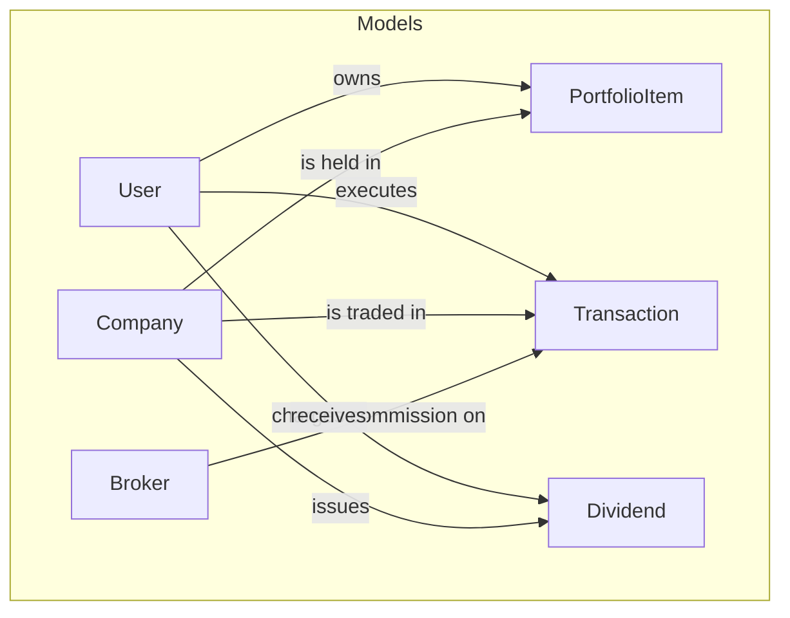
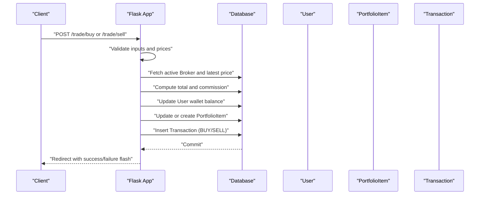
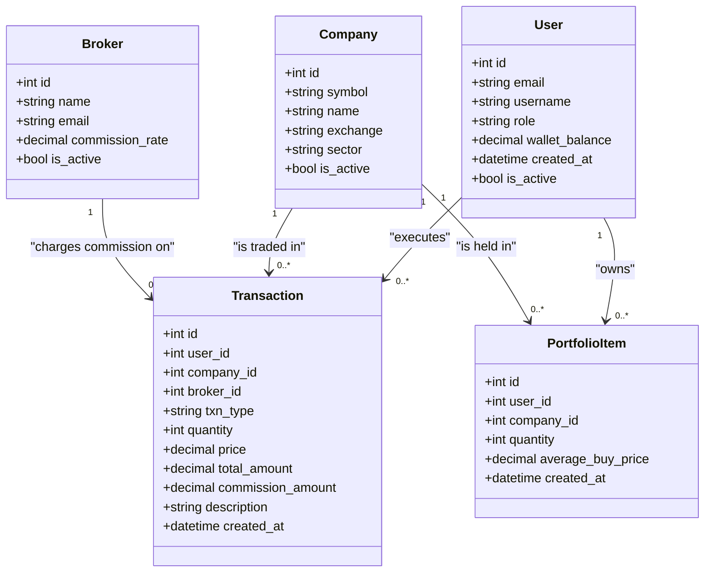

# Transaction Model

<cite>
**Referenced Files in This Document**
- [main.py](file://main.py)
- [tests/test_trading_operations.py](file://tests/test_trading_operations.py)
- [tests/test_database_models.py](file://tests/test_database_models.py)
- [tests/conftest.py](file://tests/conftest.py)
- [templates/dashboard.html](file://templates/dashboard.html)
- [templates/admin_dashboard.html](file://templates/admin_dashboard.html)
- [docs/diagrams/er_diagram.md](file://docs/diagrams/er_diagram.md)
- [docs/diagrams/dfd_portfolio_level1.md](file://docs/diagrams/dfd_portfolio_level1.md)
</cite>

## Table of Contents
1. [Introduction](#introduction)
2. [Project Structure](#project-structure)
3. [Core Components](#core-components)
4. [Architecture Overview](#architecture-overview)
5. [Detailed Component Analysis](#detailed-component-analysis)
6. [Dependency Analysis](#dependency-analysis)
7. [Performance Considerations](#performance-considerations)
8. [Troubleshooting Guide](#troubleshooting-guide)
9. [Conclusion](#conclusion)

## Introduction
This document provides comprehensive data model documentation for the Transaction model, detailing its attributes, data types, constraints, and relationships with User, Company, and Broker. It explains how the Transaction model serves as an immutable ledger of all trading activities, documents business rules for validation and atomic updates, and demonstrates practical usage patterns for buy/sell operations, commission calculation, and trade history reporting. The content is grounded in the repository’s source code and test suite.

## Project Structure
The Transaction model is defined in the main application module alongside other core models and is exercised by unit tests and templates that render transaction history.

**Diagram sources**
- [docs/diagrams/er_diagram.md](file://docs/diagrams/er_diagram.md#L1-L68)

**Section sources**
- [main.py](file://main.py#L94-L109)
- [docs/diagrams/er_diagram.md](file://docs/diagrams/er_diagram.md#L1-L68)

## Core Components
The Transaction model encapsulates all buy, sell, and dividend-related ledger entries. Below are its attributes with data types and constraints derived from the model definition and tests.

- id: Integer, primary key
- user_id: Integer, foreign key to User.id, not null
- company_id: Integer, foreign key to Company.id, not null
- broker_id: Integer, foreign key to Broker.id
- txn_type: String, not null (values include BUY, SELL, DIVIDEND)
- quantity: Integer, not null
- price: Numeric(12,2), not null
- total_amount: Numeric(12,2), not null
- commission_amount: Numeric(12,2), not null, default 0
- description: String, optional
- created_at: DateTime, default current UTC time

Relationships:
- belongs to User (user)
- belongs to Company (company)
- belongs to Broker (broker)

Constraints and defaults:
- Numeric fields are defined with precision and scale suitable for currency and prices.
- commission_amount defaults to 0, reflecting scenarios where commission is not applicable (e.g., internal transfers).
- created_at defaults to the current UTC time, ensuring chronological ordering.

**Section sources**
- [main.py](file://main.py#L94-L109)
- [tests/test_database_models.py](file://tests/test_database_models.py#L249-L295)

## Architecture Overview
The Transaction model participates in the portfolio management workflow, where buy and sell operations update wallet balances and portfolio holdings atomically, and all changes are recorded as Transaction entries.

**Diagram sources**
- [main.py](file://main.py#L268-L375)
- [docs/diagrams/dfd_portfolio_level1.md](file://docs/diagrams/dfd_portfolio_level1.md#L1-L35)

## Detailed Component Analysis

### Transaction Attributes and Constraints
- id: Integer primary key
- user_id: Integer foreign key to User.id, not null
- company_id: Integer foreign key to Company.id, not null
- broker_id: Integer foreign key to Broker.id
- txn_type: String, not null; validated values include BUY, SELL, DIVIDEND
- quantity: Integer, not null; validated as positive in routes
- price: Numeric(12,2), not null; represents price per share
- total_amount: Numeric(12,2), not null; price × quantity
- commission_amount: Numeric(12,2), not null, default 0
- description: String, optional
- created_at: DateTime, default current UTC time

These definitions ensure immutability of the ledger: once a Transaction is committed, its details (including commission_amount and total_amount) remain unchanged, enabling reliable historical reporting.

**Section sources**
- [main.py](file://main.py#L94-L109)
- [tests/test_database_models.py](file://tests/test_database_models.py#L249-L295)

### Relationships with User, Company, and Broker
- User: Each Transaction belongs to a User via user_id; the relationship exposes user.email and related profile data.
- Company: Each Transaction references a Company via company_id; the relationship exposes company.symbol and metadata.
- Broker: Each Transaction optionally references a Broker via broker_id; the relationship exposes broker.name and commission_rate.

These relationships enable rich reporting and auditing, including per-user transaction histories and per-broker commission tracking.

**Section sources**
- [main.py](file://main.py#L94-L109)
- [tests/test_database_models.py](file://tests/test_database_models.py#L278-L295)

### Business Rules and Validation
- Buy validation:
  - Positive quantity and valid symbol are required.
  - Wallet balance must cover total cost plus commission.
  - Latest price fetched before computation.
  - Company is created if not present.
- Sell validation:
  - PortfolioItem must exist and contain sufficient quantity.
  - Positive quantity and valid symbol are required.
  - Latest price fetched before computation.
- Atomic updates:
  - Wallet balance and portfolio holdings are updated within a single transaction commit.
  - Transaction records capture the exact amounts and timestamps.

These rules are enforced in the trading routes and verified by tests.

**Section sources**
- [main.py](file://main.py#L268-L375)
- [tests/test_trading_operations.py](file://tests/test_trading_operations.py#L16-L133)
- [tests/test_trading_operations.py](file://tests/test_trading_operations.py#L135-L204)

### Commission Calculation Based on Broker Rates
- Active broker is selected via a helper that returns the first active broker.
- Commission is calculated as total_amount × (commission_rate / 100), rounded to two decimal places.
- Commission is included in buy totals and subtracted from proceeds in sell totals.

This ensures consistent fee accounting across transactions.

**Section sources**
- [main.py](file://main.py#L172-L185)
- [tests/test_trading_operations.py](file://tests/test_trading_operations.py#L206-L267)

### Usage in Trade History Reports
- Dashboard displays recent transactions for the logged-in user, ordered by created_at descending.
- Admin dashboard lists recent transactions with user, symbol, quantity, price, total, and description.
- Tests verify chronological ordering and presence of timestamps.

These views rely on Transaction records to provide transparent, auditable trade history.

**Section sources**
- [main.py](file://main.py#L251-L266)
- [templates/dashboard.html](file://templates/dashboard.html#L241-L265)
- [templates/admin_dashboard.html](file://templates/admin_dashboard.html#L274-L305)
- [tests/test_trading_operations.py](file://tests/test_trading_operations.py#L326-L348)

### Example Workflows

#### Creating a Transaction During a Buy Operation
- Route: POST /trade/buy
- Steps:
  - Validate quantity and symbol.
  - Fetch latest price and compute total.
  - Compute commission using active broker.
  - Validate sufficient funds (total + commission).
  - Upsert PortfolioItem (update quantity and average_buy_price if exists).
  - Deduct wallet balance (total + commission).
  - Insert Transaction with BUY, price, total_amount, commission_amount, broker_id, and description.

**Section sources**
- [main.py](file://main.py#L268-L325)
- [tests/test_trading_operations.py](file://tests/test_trading_operations.py#L16-L67)

#### Creating a Transaction During a Sell Operation
- Route: POST /trade/sell
- Steps:
  - Validate quantity and symbol.
  - Fetch latest price and compute total.
  - Compute commission using active broker.
  - Validate sufficient holdings.
  - Reduce quantity or delete PortfolioItem if zero.
  - Credit wallet balance (total - commission).
  - Insert Transaction with SELL, price, total_amount, commission_amount, broker_id, and description.

**Section sources**
- [main.py](file://main.py#L327-L375)
- [tests/test_trading_operations.py](file://tests/test_trading_operations.py#L135-L204)

#### Recording a Dividend as a Transaction
- Route: POST /dividends/record
- Steps:
  - Validate symbol and holdings.
  - Compute total dividend amount.
  - Credit wallet balance.
  - Insert Dividend record and Transaction with DIVIDEND type.

**Section sources**
- [main.py](file://main.py#L398-L434)
- [tests/test_database_models.py](file://tests/test_database_models.py#L298-L330)

#### Generating Trade History Reports
- Dashboard view: Orders recent transactions for the user.
- Admin view: Lists recent transactions with user and symbol context.
- Tests: Verify ordering by created_at and presence of timestamps.

**Section sources**
- [main.py](file://main.py#L251-L266)
- [templates/dashboard.html](file://templates/dashboard.html#L241-L265)
- [templates/admin_dashboard.html](file://templates/admin_dashboard.html#L274-L305)
- [tests/test_trading_operations.py](file://tests/test_trading_operations.py#L326-L348)

### Edge Cases Covered by Tests
- Invalid or zero/negative quantity inputs.
- Insufficient funds for buy.
- Insufficient shares for sell.
- Selling all shares removes the PortfolioItem.
- Purchasing a new symbol creates a Company automatically.
- Transaction timestamps are present and ordered.
- Broker information is recorded on transactions.

**Section sources**
- [tests/test_trading_operations.py](file://tests/test_trading_operations.py#L16-L133)
- [tests/test_trading_operations.py](file://tests/test_trading_operations.py#L135-L204)
- [tests/test_trading_operations.py](file://tests/test_trading_operations.py#L326-L348)

## Dependency Analysis
The Transaction model depends on and interacts with the following components:

**Diagram sources**
- [main.py](file://main.py#L51-L109)
- [docs/diagrams/er_diagram.md](file://docs/diagrams/er_diagram.md#L1-L68)

**Section sources**
- [main.py](file://main.py#L51-L109)
- [docs/diagrams/er_diagram.md](file://docs/diagrams/er_diagram.md#L1-L68)

## Performance Considerations
- Indexing: Consider adding indexes on Transaction.user_id, Transaction.company_id, Transaction.broker_id, and Transaction.created_at for efficient querying and reporting.
- Decimal arithmetic: Using Numeric types avoids floating-point drift and ensures precise commission and amount calculations.
- Batch operations: Group related updates (wallet, portfolio, transaction) in a single commit to minimize contention and improve throughput.

[No sources needed since this section provides general guidance]

## Troubleshooting Guide
Common issues and resolutions:

- Insufficient funds for buy:
  - Cause: total + commission exceeds wallet_balance.
  - Resolution: Top up wallet or reduce quantity.
  - Evidence: Route validates balance and flashes an error.

- Not enough shares to sell:
  - Cause: PortfolioItem.quantity less than requested.
  - Resolution: Sell fewer shares or buy more.
  - Evidence: Route checks holdings and flashes an error.

- Zero or negative quantity:
  - Cause: Invalid input parsing.
  - Resolution: Enter a positive integer.
  - Evidence: Routes validate quantity and flash errors.

- Missing company symbol:
  - Cause: Symbol not found and not auto-created.
  - Resolution: Use a supported symbol or ensure Company exists.
  - Evidence: Route validates symbol presence.

- Commission not applied:
  - Cause: No active broker or zero commission rate.
  - Resolution: Configure an active broker with a positive rate.
  - Evidence: Commission calculation uses active broker.

**Section sources**
- [main.py](file://main.py#L268-L375)
- [tests/test_trading_operations.py](file://tests/test_trading_operations.py#L16-L133)
- [tests/test_trading_operations.py](file://tests/test_trading_operations.py#L135-L204)
- [tests/test_trading_operations.py](file://tests/test_trading_operations.py#L206-L267)

## Conclusion
The Transaction model is the immutable ledger of trading activities, capturing all buy, sell, and dividend events with precise amounts, timestamps, and broker fees. Its design, validated by tests and demonstrated in routes and templates, ensures robust auditability, accurate financial reporting, and consistent business rule enforcement across the portfolio management workflow.