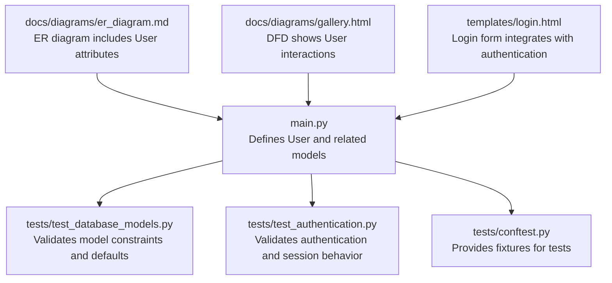
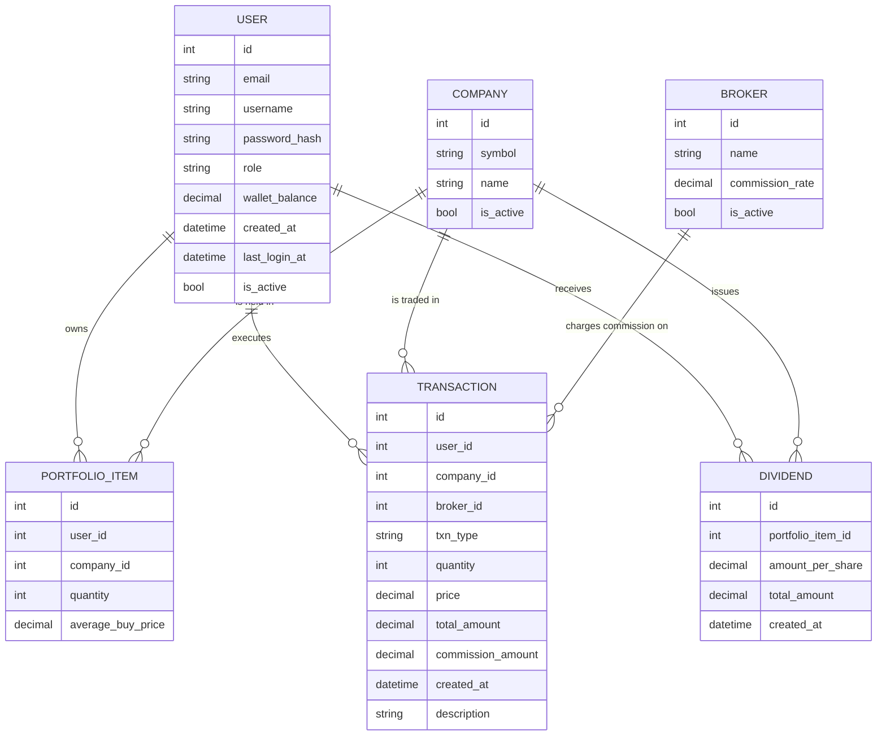
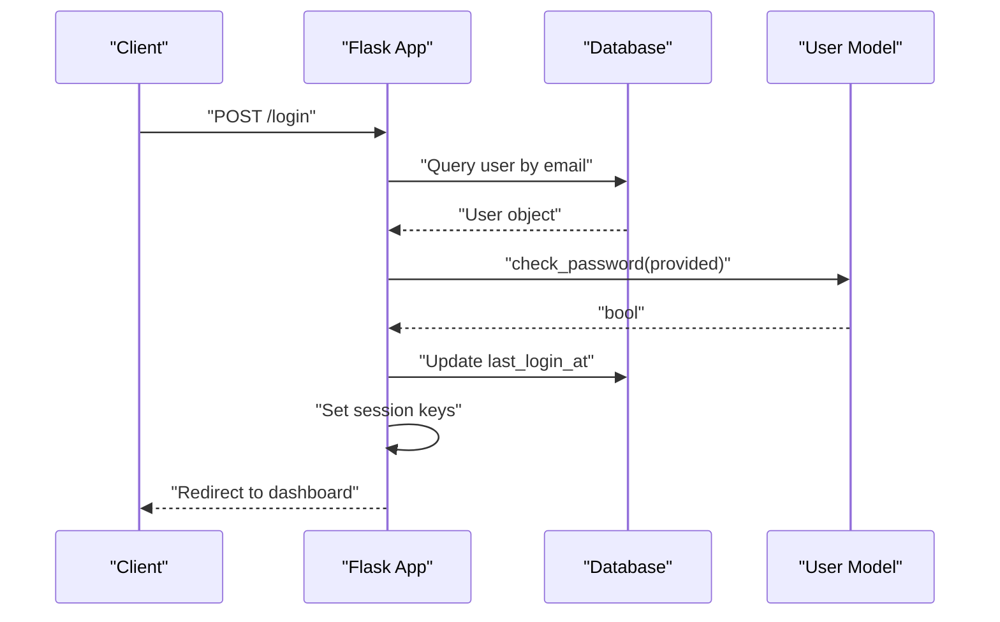
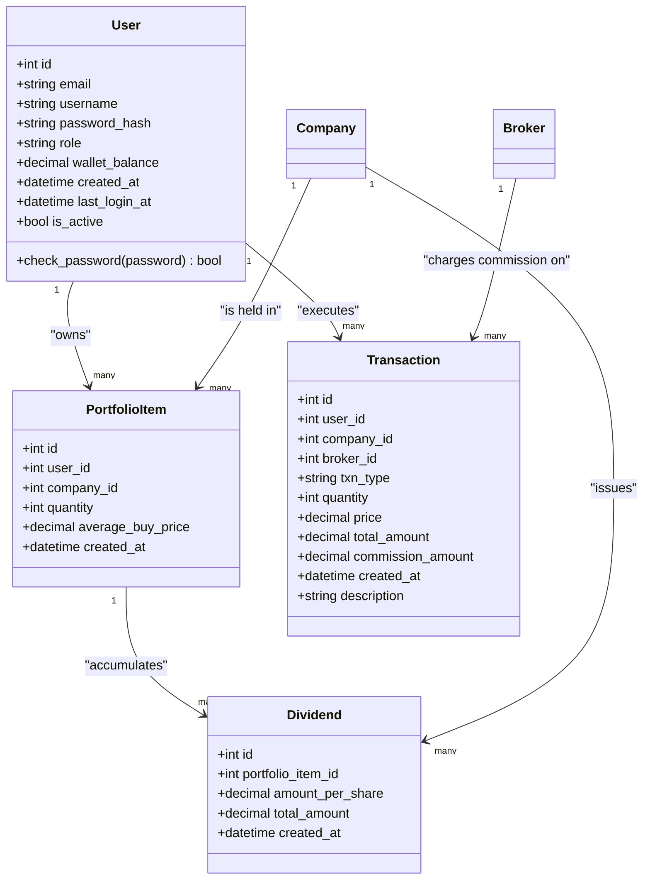
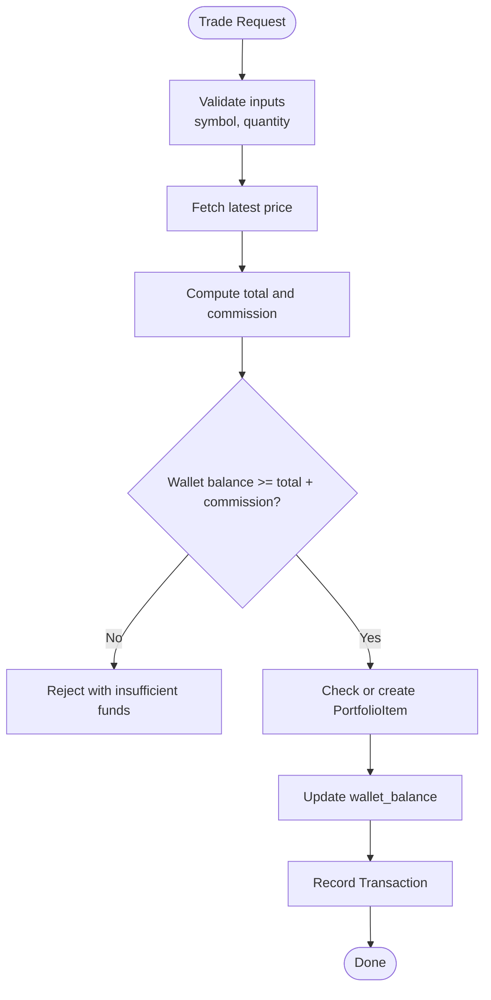
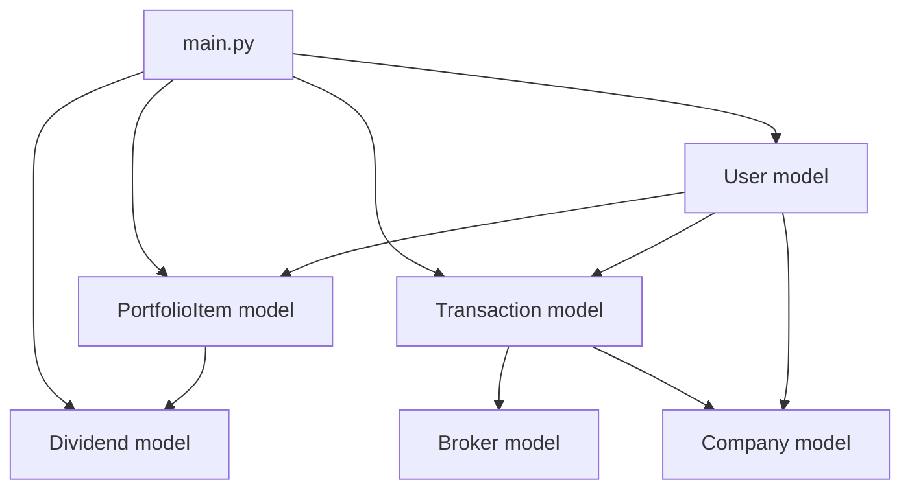

# User Model

<cite>
**Referenced Files in This Document**
- [main.py](file://main.py)
- [test_database_models.py](file://tests/test_database_models.py)
- [test_authentication.py](file://tests/test_authentication.py)
- [conftest.py](file://tests/conftest.py)
- [er_diagram.md](file://docs/diagrams/er_diagram.md)
- [gallery.html](file://docs/diagrams/gallery.html)
- [templates/login.html](file://templates/login.html)
</cite>

## Table of Contents
1. [Introduction](#introduction)
2. [Project Structure](#project-structure)
3. [Core Components](#core-components)
4. [Architecture Overview](#architecture-overview)
5. [Detailed Component Analysis](#detailed-component-analysis)
6. [Dependency Analysis](#dependency-analysis)
7. [Performance Considerations](#performance-considerations)
8. [Troubleshooting Guide](#troubleshooting-guide)
9. [Conclusion](#conclusion)

## Introduction
This document provides comprehensive data model documentation for the User model, focusing on attributes, constraints, relationships, and operational behavior. It also covers password hashing, authentication and session management, role-based access control, and how wallet_balance participates in trading operations. Validation rules, uniqueness constraints, and defaults are illustrated using the test suite. Security considerations and practical usage patterns are included to help developers implement robust user management.

## Project Structure
The User model is defined in the main application module alongside other SQLAlchemy models. Tests validate model behavior, constraints, and integration with authentication and trading flows.

**Diagram sources**
- [main.py](file://main.py#L51-L64)
- [test_database_models.py](file://tests/test_database_models.py#L18-L113)
- [test_authentication.py](file://tests/test_authentication.py#L1-L171)
- [conftest.py](file://tests/conftest.py#L53-L83)
- [er_diagram.md](file://docs/diagrams/er_diagram.md#L1-L13)
- [gallery.html](file://docs/diagrams/gallery.html#L186-L214)
- [templates/login.html](file://templates/login.html#L79-L90)

**Section sources**
- [main.py](file://main.py#L51-L64)
- [test_database_models.py](file://tests/test_database_models.py#L18-L113)
- [test_authentication.py](file://tests/test_authentication.py#L1-L171)
- [conftest.py](file://tests/conftest.py#L53-L83)
- [er_diagram.md](file://docs/diagrams/er_diagram.md#L1-L13)
- [gallery.html](file://docs/diagrams/gallery.html#L186-L214)
- [templates/login.html](file://templates/login.html#L79-L90)

## Core Components
- User model definition and attributes
- Password hashing and verification
- Session management and role-based access control
- Relationship with PortfolioItem, Transaction, and Dividend
- Validation rules, uniqueness constraints, and defaults

**Section sources**
- [main.py](file://main.py#L51-L64)
- [test_database_models.py](file://tests/test_database_models.py#L18-L113)
- [test_authentication.py](file://tests/test_authentication.py#L1-L171)

## Architecture Overview
The User model participates in multiple workflows:
- Registration and login authenticate users and manage sessions
- Trading operations use wallet_balance to enforce spend limits and update balances
- Dividend operations credit wallet_balance and create related records

**Diagram sources**
- [er_diagram.md](file://docs/diagrams/er_diagram.md#L1-L68)
- [main.py](file://main.py#L51-L119)

## Detailed Component Analysis

### User Model Definition and Attributes
- id: Integer, primary key
- email: String, unique, not null
- username: String, unique, not null
- password_hash: String, not null
- role: String, not null, default "user"
- wallet_balance: Numeric, not null, default 0
- created_at: DateTime, default current UTC time
- last_login_at: DateTime, nullable
- is_active: Boolean, default true

Constraints and defaults are enforced by the model definition and validated by tests.

**Section sources**
- [main.py](file://main.py#L51-L64)
- [test_database_models.py](file://tests/test_database_models.py#L99-L112)

### Password Hashing and Verification
- Passwords are hashed using a secure utility before storage.
- The check_password method compares a provided plaintext password against the stored hash.
- Tests verify that stored hashes are not equal to the original password and that repeated hashing produces different hashes due to salting.

Implementation references:
- Hashing during registration and test setup
- Verification via check_password method
- Security validations in authentication tests

**Section sources**
- [main.py](file://main.py#L51-L64)
- [test_database_models.py](file://tests/test_database_models.py#L38-L54)
- [test_authentication.py](file://tests/test_authentication.py#L291-L335)

### Authentication and Session Management
- Registration validates presence of required fields, ensures email and username uniqueness, and stores a hashed password.
- Login authenticates by email, checks password via check_password, and enforces is_active. On success, it sets session keys and updates last_login_at.
- Logout clears the session.
- CSRF protection is integrated via a token mechanism.
- Role-based access control is enforced by a decorator that checks session role for admin-only routes.

**Diagram sources**
- [main.py](file://main.py#L226-L241)
- [test_authentication.py](file://tests/test_authentication.py#L120-L171)

**Section sources**
- [main.py](file://main.py#L199-L241)
- [test_authentication.py](file://tests/test_authentication.py#L1-L171)
- [templates/login.html](file://templates/login.html#L79-L90)

### Role-Based Access Control
- The login_required decorator checks for a logged-in user and optionally enforces a required role.
- Admin-only routes require the user role to be "admin".
- Tests verify that non-admin users are denied access to admin routes.

**Section sources**
- [main.py](file://main.py#L139-L151)
- [test_authentication.py](file://tests/test_authentication.py#L242-L251)
- [tests/test_web_routes.py](file://tests/test_web_routes.py#L127-L160)

### Relationships with Other Models
- One-to-many: User owns PortfolioItem and Transactions; Company is held in PortfolioItem; Broker charges commission on Transactions; Company issues Dividends; PortfolioItem accumulates Dividends.
- Relationships are defined with foreign keys and backrefs.

**Diagram sources**
- [main.py](file://main.py#L51-L119)
- [er_diagram.md](file://docs/diagrams/er_diagram.md#L1-L68)

**Section sources**
- [main.py](file://main.py#L83-L119)
- [er_diagram.md](file://docs/diagrams/er_diagram.md#L1-L68)

### Validation Rules, Uniqueness Constraints, and Defaults
- Unique constraints: email and username must be unique; attempting duplicates raises an integrity error.
- Not-null constraints: email, username, password_hash, role, and numeric fields are required.
- Defaults: role defaults to "user"; wallet_balance defaults to 0; is_active defaults to true; last_login_at is initially null; created_at defaults to current UTC time.
- Tests cover uniqueness, default values, and null constraints.

**Section sources**
- [test_database_models.py](file://tests/test_database_models.py#L55-L98)
- [test_database_models.py](file://tests/test_database_models.py#L99-L113)
- [test_database_models.py](file://tests/test_database_models.py#L331-L356)

### Wallet Balance Usage in Trading Operations
- Buy flow:
  - Validates symbol and quantity, fetches latest price, computes total and commission, checks wallet_balance >= total + commission, updates wallet_balance, creates or updates PortfolioItem, and records Transaction.
- Sell flow:
  - Validates symbol and quantity, checks holdings, computes proceeds, applies commission, updates wallet_balance, deletes PortfolioItem if quantity reaches zero, and records Transaction.
- Dividend flow:
  - Validates symbol and amount_per_share, checks holdings, computes total_amount, credits wallet_balance, records Dividend and Transaction.

**Diagram sources**
- [main.py](file://main.py#L268-L375)
- [main.py](file://main.py#L378-L433)

**Section sources**
- [main.py](file://main.py#L268-L375)
- [main.py](file://main.py#L378-L433)
- [test_trading_operations.py](file://tests/test_trading_operations.py#L1-L266)
- [test_portfolio_management.py](file://tests/test_portfolio_management.py#L1-L44)

### Example Workflows (by reference)
- User creation and authentication:
  - Registration path: [main.py](file://main.py#L199-L224)
  - Login path: [main.py](file://main.py#L226-L241)
  - Session management helpers: [main.py](file://main.py#L139-L159)
- Session persistence and CSRF:
  - CSRF token generation and verification: [main.py](file://main.py#L121-L137)
  - Session clearing on logout: [main.py](file://main.py#L245-L249)
- Role enforcement:
  - Admin-only route decorator: [main.py](file://main.py#L139-L151)
  - Tests for admin-only routes: [test_authentication.py](file://tests/test_authentication.py#L242-L251)

**Section sources**
- [main.py](file://main.py#L121-L159)
- [main.py](file://main.py#L199-L249)
- [test_authentication.py](file://tests/test_authentication.py#L242-L251)

## Dependency Analysis
- User depends on SQLAlchemy for ORM mapping and on Werkzeug for password hashing utilities.
- Relationships define foreign keys and backrefs to PortfolioItem, Transaction, and Dividend.
- Tests depend on fixtures to create sample users and validate behaviors.

**Diagram sources**
- [main.py](file://main.py#L51-L119)

**Section sources**
- [main.py](file://main.py#L51-L119)

## Performance Considerations
- Password hashing is handled by a secure utility; hashing costs are managed by the underlying implementation.
- Queries for login and trading rely on indexed email lookups and foreign keys; ensure database indexes exist for frequently queried columns.
- Decimal arithmetic is used for financial computations to avoid floating-point precision issues.

[No sources needed since this section provides general guidance]

## Troubleshooting Guide
Common issues and resolutions:
- Registration fails due to duplicate email or username:
  - Cause: Unique constraint violation.
  - Resolution: Ensure unique email and username; tests demonstrate the expected error behavior.
- Login fails:
  - Cause: Wrong credentials or inactive account.
  - Resolution: Confirm email, password, and is_active; session is cleared on invalid login.
- Insufficient funds for buy:
  - Cause: wallet_balance less than total plus commission.
  - Resolution: Top up wallet or reduce quantity; tests validate this scenario.
- Admin access denied:
  - Cause: Non-admin user attempting admin route.
  - Resolution: Ensure role is "admin"; tests verify access control.

**Section sources**
- [test_database_models.py](file://tests/test_database_models.py#L55-L98)
- [test_authentication.py](file://tests/test_authentication.py#L120-L171)
- [test_trading_operations.py](file://tests/test_trading_operations.py#L1-L266)
- [tests/test_web_routes.py](file://tests/test_web_routes.py#L127-L160)

## Conclusion
The User model defines a secure, extensible foundation for identity and financial operations. Its attributes, constraints, and relationships enable robust authentication, session management, and trading workflows. Password hashing, role-based access control, and strict validation rules ensure safety and reliability. The tests provide concrete examples of expected behavior, including defaults, uniqueness, and integrity constraints.